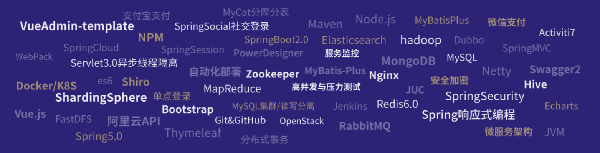

<link rel="stylesheet" href="resource/css/README.css">

🚩 *[低头敲代码,抬头看方向](https://www.processon.com/mindmap/5fcddb4e1e08536c5970cc7a)*

---

## ☕ JavaSE

### JavaSE基础

**JavaSE**

- [ ] [尚硅谷-宋红康-JavaSE](尚硅谷学习笔记/第1阶段-基础阶段/尚硅谷-宋红康-JavaSE核心基础/Java核心技术.md)

### JavaWeb开发

**JavaWeb**

- [ ] [B站-遇见狂神说-JavaWeb](哔哩哔学习笔记/B站-遇见狂神说/JavaWeb入门到实战/JavaWeb.md)
- [ ] 尚硅谷-王振国-JavaWeb

### JavaSE高级

**Java数据结构和算法**

- [ ] [尚硅谷-韩顺平-Java数据结构和算法](尚硅谷学习笔记/第1阶段-基础阶段/尚硅谷-韩顺平-Java数据结构和算法/Java数据结构和算法.md)

**Java设计模式**

- [ ] [尚硅谷-韩顺平-Java设计模式](尚硅谷学习笔记/第1阶段-基础阶段/尚硅谷-韩顺平-Java设计模式/Java设计模式.md)

**JVM**

- [ ] [尚硅谷-宋红康-JVM虚拟机](尚硅谷学习笔记/第4阶段-JavaEE高级/尚硅谷-宋红康-JVM虚拟机/JVM虚拟机.md)

## 🍃 JavaEE

### ORM框架

**MyBatis**

- [ ] [B站-遇见狂神说-MyBatis](哔哩哔学习笔记/B站-遇见狂神说/Mybatis最新完整教程IDEA版通俗易懂/Mybatis3.md)
- [ ] 尚硅谷-xx-MyBatis

**MyBatisPlus**

- [ ] [B站-遇见狂神说-MyBatisPlus](哔哩哔学习笔记/B站-遇见狂神说/MyBatisPlus最新完整教程通俗易懂/MybatisPlus.md)
- [ ] 尚硅谷-xx-MyBatisPlus

### Spring全家桶

**Spring**

- [ ] [B站-遇见狂神说-Spring5](哔哩哔学习笔记/B站-遇见狂神说/Spring5最新完整教程IDEA版通俗易懂/Spring5.md)
- [ ] B站-编程不良人-Spring5
- [ ] 尚硅谷-王泽-Spring5
- [ ] 尚硅谷-雷丰阳-Spring注解驱动开发

**SpringData**

- [ ] 尚硅谷-佟刚-SpringData

**SpringMVC**

- [ ] [B站-遇见狂神说-SpringMVC](哔哩哔学习笔记/B站-遇见狂神说/SpringMVC最新教程IDEA版通俗易懂/SpringMVC.md)
- [ ] 尚硅谷-佟刚-SpringMVC

**SpringBoot**

- [ ] 尚硅谷-雷丰阳-SpringBoot1.x
- [ ] [尚硅谷-雷丰阳-SpringBoot2.x](尚硅谷学习笔记/第4阶段-JavaEE高级/尚硅谷-雷丰阳-SpringBoot2/SpringBoot2核心技术与响应式编程.md)
- [ ] [B站-遇见狂神说-SpringBoot2.x](哔哩哔学习笔记/B站-遇见狂神说/SpringMVC最新教程IDEA版通俗易懂/SpringMVC.md)

**SpringCloud**

- [ ] [B站-遇见狂神说-SpringCloud(H版)](哔哩哔学习笔记/B站-遇见狂神说/SpringCloud最新教程IDEA版/SpringCloud.md)
- [ ] 尚硅谷-周阳-SpringCloudH版+alibaba版
- [ ] B站-编程不良人-SpringCloud

### 通讯技术

**Netty**

- [ ] [尚硅谷-韩顺平-Netty](尚硅谷学习笔记/第4阶段-JavaEE高级/尚硅谷-韩顺平-Netty网络通讯框架/Netty4.md)

### 消息中间件

- [ ] [B站-编程不良人-RabbitMQ](哔哩哔学习笔记/B站-编程不良人/RaabitMQ消息中间件/RibbitMQ实战教程.md)
- [ ] 尚硅谷-周阳-ActiveMQ
- [ ] 黑马-xx-RocketMQ
- [ ] 尚硅谷-xx-kafka

### 安全认证

**SpringSecurity**

- [ ] 尚硅谷-王泽-SpringSecurity

**Shiro**

- [ ] [B站-编程不良人-shiro](哔哩哔学习笔记/B站-编程不良人/Shrio安全认证/Shiro实战教程.md)
- [ ] 尚硅谷-佟刚-Shiro

### 搜索引擎

- [ ] [B站-遇见狂神说-ElasticSearch7.6.x](哔哩哔学习笔记/B站-遇见狂神说/ElasticSearch7.6.x最新完整教程通俗易懂/ElasticSearch7.6.x.md)
- [ ] B站-编程不良人-ElasticSearch6.x

### Java项目实战

- [ ] 尚硅谷-xx-尚筹网项目
- [ ] 尚硅谷-xx-谷粒学院项目
- [ ] 尚硅谷-xx-谷粒商城项目

### Java面试相关

- [ ] 尚硅谷-xx-就业面试第一季
- [ ] 尚硅谷-xx-就业面试第二季
- [ ] 尚硅谷-xx-就业面试第三季

## 🤔 Java大数据

*大数据相关的知识待定~~*

##  # 大数据技术生态
**Flink**
- [ ] 尚硅谷-xx-Flink
**Hive**
- [ ] 尚硅谷-xx-Hive
**Spark3.0**
- [ ] 尚硅谷-xx-spark3.0
**Hadoop**
- [ ] 尚硅谷-xx-hadoop
**zookeeper**
- [ ] 尚硅谷-xx-zookeeper
**HA**
- [ ] 尚硅谷-xx-HA
**Flume**
- [ ] 尚硅谷-xx-Flume
**Oozie**
- [ ] 尚硅谷-xx-Oozie
**Scala**
- [ ] 尚硅谷-xx-Scala
**Azkaban**
- [ ] 尚硅谷-xx-Azkaban
**HBase**
- [ ] 尚硅谷-xx-HBase
### 大数据项目实战
- [ ] 尚硅谷-xx-电信客服
- [ ] 尚硅谷-xx-机器学习与推荐系统
- [ ] 尚硅谷-xx-电商推荐系统
- [ ] 尚硅谷-xx-电商数仓2.0
- [ ] 尚硅谷-xx-电商数仓3.0
- [ ] 尚硅谷-xx-阿里云离线数仓(阿里云委托录制)
- [ ] 尚硅谷-xx-阿里云实时数仓(阿里云委托录制)

## 🎨 前端技术

### 前端基础

**HTML5+CSS3**

- [ ] [知播渔-李南江-HTML5+CSS](知播渔学习笔记/01-H5C3基础入门/H5H3核心技术.md)

**JavaScript**

- [ ] [知播渔-李南江-JavaScript及新特性](知播渔学习笔记/03-JavaScript及新特性/JavaScript核心与新特性.md)

**TypeScript**

- [ ] 知播渔-李南江-TypeScript

### 前端框架

**JavaScrip常用框架**

- [ ] 知播渔-李南江-JavaScript新特性+常用框架

**Jquery**

- [ ] [知播渔-李南江-JQuery](知播渔学习笔记/05-JQuery/JQuery核心技术.md)

**BootStrap4**

- [ ] 知播渔-李南江-BootStrap4

**Less丶Sass**

- [ ] 知播渔-李南江-less+sass预处理

**Vue**

- [ ] [知播渔-李南江-Vue2.x](知播渔学习笔记/12-Vue全家桶及项目实战/Vue全家桶及项目实战.md)
- [ ] 尚硅谷-xx-Vue3.0
- [ ] [B站-编程不良人-Vue实战](哔哩哔学习笔记/B站-编程不良人/Vue实战教程/Vue实战.md)

**ElementUI**

- [ ] [B站-编程不良人-ElementUI](哔哩哔学习笔记/B站-编程不良人/ElementUI/ElemenUI实战教程.md)

**NodeJS**

- [ ] 知播渔-李南江-NodeJS

**React**

- [ ] 知播渔-李南江-React
- [ ] 尚硅谷-xx-React

**Webpack**

- [ ] 知播渔-李南江-webpack4
- [ ] 尚硅谷-xx-webpack5

**微信小程序开发**

- [ ] 尚硅谷-闫志勇-微信小程序开发
- [ ] 知播渔-李南江-微信小程序云开发

### 其他前端开发技术

**移动端开发**

- [ ] 知播渔-李南江-移动端开发

**uniapp**

- [ ] 知播渔-李南江-uniapp

**Express+KOA2+Egg**

- [ ] 知播渔-Express+KOA2+Egg

**打造通用后端开发框架**

- [ ] 知播渔-李南江-打造前后端通用框架

**Electron**

**Flutter**

- [ ] 知播渔-李南江-Flutter

**Echarts**

**layUI**

**Promise**

- [ ] 尚硅谷-xx-Promise

**axios**

- [ ] 尚硅谷-xx-axios

## 🗄️  数据库技术

### 数据库基础

**MySQL及连接技术** 

- [ ] B站-遇见狂神说-MySQL
- [ ] 尚硅谷-李玉婷-MySQL核心基础
- [ ] 尚硅谷-周阳-MySQL高级
- [ ] [尚硅谷-宋红康-JDBC](尚硅谷学习笔记/第1阶段-基础阶段/尚硅谷-宋红康-JDBC/JDBC.md)
- [ ] 知播渔-李南江-MySQL8.0

**oracle及连接技术**

- [ ] [尚硅谷-宋红康-SQL丶PLSQL丶Oracle](尚硅谷学习笔记/第1阶段-基础阶段/尚硅谷-宋红康-Oracle丶SQL丶PLSQL/README.md)

### NoSQL框架

**Redis**

- [ ] [B站-遇见狂神说-Redis5.0](哔哩哔学习笔记/B站-遇见狂神说/Redis最新超详细版教程通俗易懂/Redis.md)
- [ ] 尚硅谷-周阳-Redis
- [ ] [B站-编程不良人-Redis](哔哩哔学习笔记/B站-编程不良人/Redis缓存/Redis.md)
- [ ] 知播渔-李南江-Redis

**MongoDB**

- [ ] B站-编程不良人-MongoDB
- [ ] 知播渔-李南江-MongoDB

## 🛠️DevOps

### Linux

- [ ] B站-遇见狂神说-LinuxCentOS7
- [ ] 韩顺平-linux2021升级版

### 容器技术

**Docker**

- [ ] [B站-遇见狂神说-Docker](哔哩哔学习笔记/B站-遇见狂神说/Docker基础和进阶/Docker.md)
- [ ] [B站-编程不良人-Docker](哔哩哔学习笔记/B站-编程不良人/Docker/Docker.md)

**K8S**

- [ ] 尚硅谷-王泽-K8s

### 版本控制

**GIT**

- [x] [B站-遇见狂神说-Git](哔哩哔学习笔记/B站-遇见狂神说/Git最新教程通俗易懂/git.md)
- [ ] 知播渔-李南江-Git

## 🎇 拓展学习

### 技术专题

- [ ] [JWT实现登录认证流程](哔哩哔学习笔记/B站-编程不良人/JWT实现登录认证流程/JWT实现登录认证流程.md)

**idea工具**

- [ ] [IDEA工具使用记录](其他未分类笔记/IDEA使用记录/IDEA使用记录.md)

### 其他语言

**C**

- [ ] 知播渔-李南江-C语言

**GO**

- [ ] 知播渔-李南江-go语言

**python3**

### 博客搭建

- [x] [doscify框架](哔哩哔学习笔记/B站-全栈小刘/Docsify编写开源文档.md)

### 学习路线

- [x] [2021Java后端学习体系](哔哩哔学习笔记/B站-韩顺平/Java后端开发路线.md)

### 一些说明

*对本笔记文档中出现的一些 Emoji表情的一些说明*

1. 如果是 👌 表示该文档已经完成

   

   

2. 如果是 🚩 表示笔记已经做到这里来了

   
   
3. 如果是 💡 表示这里没有搞懂,需要反复掌握

   

