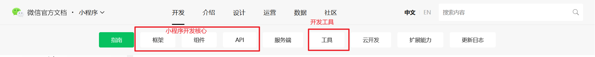
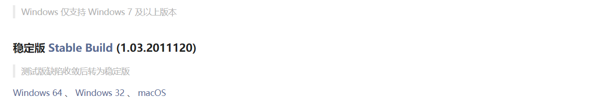
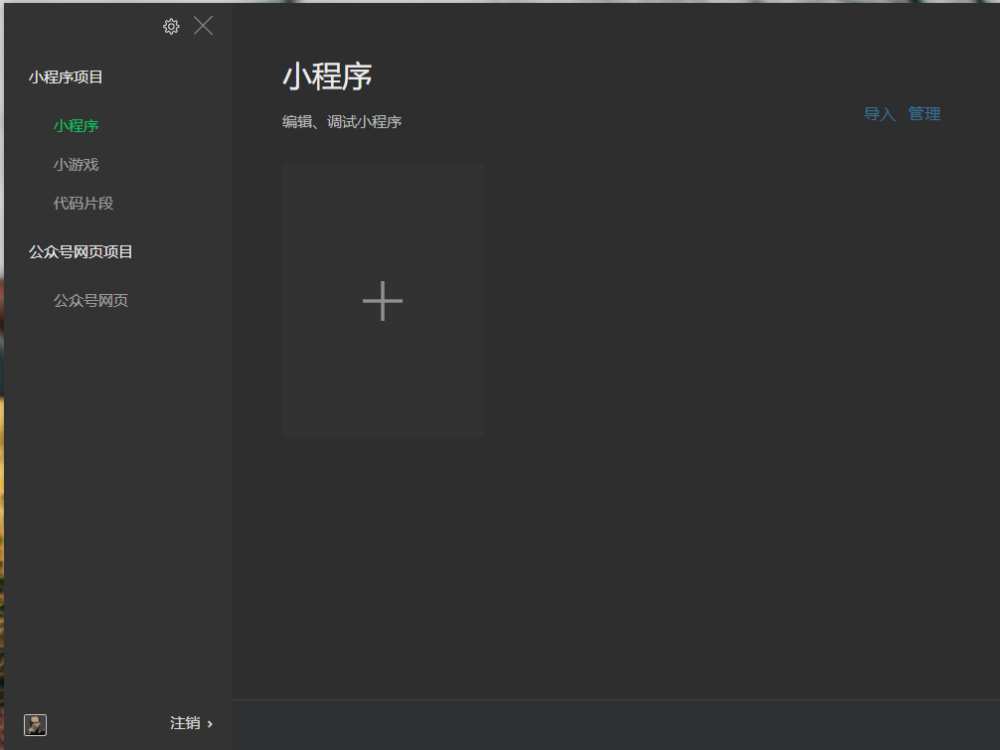
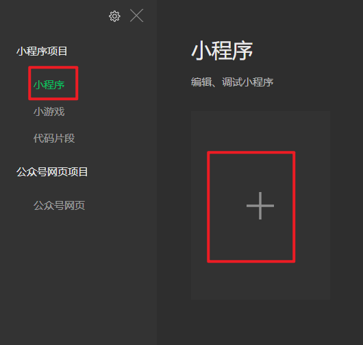
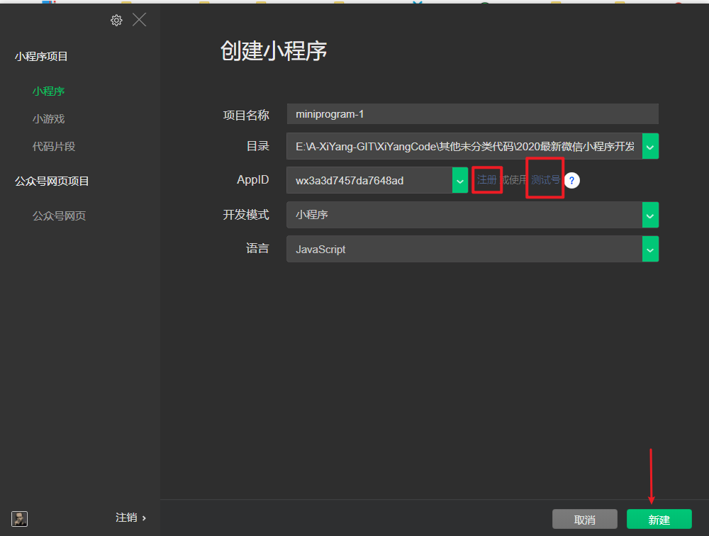
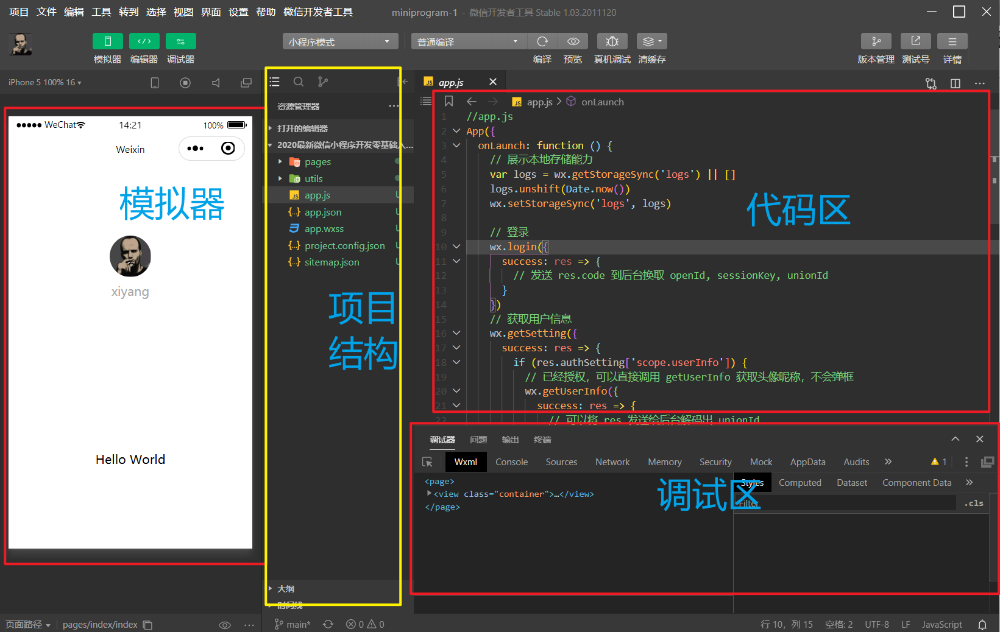
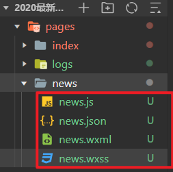
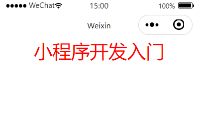

# 小程序入门

## 1. 小程序简介

### 1.1 小程序是什么？
微信小程序，简称小程序，缩写XCX，英文名mini program，是一种不需要下载安装即可使用的应用，它实现了应用触手可及的梦想，用户扫一扫或者，一下即可打开应用。也体现了"用完即走的理念，用户不需要担心是否安装太多应用的问题。应用将无处不在，随时可用，但又无需安装卸载。

---

### 1.2 小程序和APP的对比
1. 开发成本低
2. 开发门槛低
3. 获客成本低于App；拼多多、小红书等案例
4. 开发周期更短，节省开发成本
5. App已经趋于饱和
	- 用户：减轻内存，用完即可关闭，不占用空间商户：线上线下结合，实现互联网的转型
	- 创业者：应用广泛，创业更简单，尤其是公众号创业者，可以直接公众号+小程序，打造微信生态圈
	- 小程序依靠微信生态圈，拥庞大的自然流量，同时拥有众多线上营销功能，前途不可限量。
---

### 1.3 小程序与普通网页开发的区别
小程序的主要开发语言是JavaScript，小程序的开发同普通的网页开发相比有很大的相似性。对于前端开发者而言，从网页开发迁移到小程序的开发成本并不高，但是二者还是有些许区别的。

*ps注意: 微信小程序的项目规定在2M,否者无法上传*

​	

---

### 1.4 多达10多个的流量入口

自从小程序发布以来就一直在不断更新、完善功能。越来越多新的功能不断上线，流量入口也在不断增多，这里我们总结了10个入口。
1. 微信搜索
2. 发现入口
3. 线下小程序
4. 小程序码
5. 公众号内链
6. 转发小程序
7. 公众号关联小程序
8. 商家公众平台自定义菜单
9. 绑定关联通知
10. 附近小程序


## 2. 微信小程序软件介绍

### 2.1 官网

*官网: https://developers.weixin.qq.com/miniprogram/dev/framework/app-service/api.html*



### 2.2 工具下载安装

不同的开发是有自己对应的开发环境的,微信小程序的开发环境就是上面的工具

[下载稳定版](https://developers.weixin.qq.com/miniprogram/dev/devtools/download.html)然后根据对应的电脑环境选不同的开发工具



然后就像安装普通软件一样安装开发工具就ok了

安装完成后是如下界面



### 2.3 创建小程序工程

点击小程序,然后点击右边的加进行项目构建



AppID如果是上线项目可以注册,如果学习使用测试号就可以了



创建成功后,显示的就是下面的这些界面,这个界面由4个板块构成(模拟器,代码区,项目结构,调试区)




### 2.4 目录结构

```
project.config.json: 项目配置文件，做一些个性化配置，例如界面颜色、编译配置等等
sitemap.json: 地图
app.json: 当前小程序的全局配置，包括了小程序的所有页面路径、界面表现、网络超时时间、底部 tab 等
sitemap: 配置小程序及其页面是否允许被微信索引
-----pages: 里面包含一个个具体的页面(页面)
-----utils: 公共的文件夹,存放公共的文件(非必要)
.wxss: 页面样式(css)，
app.wxss 作为全局样式，会作用于当前小程序的所有页面，局部页面样式 
page.wxss 仅对当前页面生效。
app.js: 小程序的逻辑(小程序的入口文件,必须存在)
.js: 页面逻辑
.json: 页面配置
.wxml: 页面结构(html)
```


## 3. 小程序上做一些简单的操作

软件安装好后,在里面进行一些测试,首先需要知道的是,所有关于页面的显示都是在page目录里面,所以可以在page里面创建一个文件夹news,然后再创建一个page(会自动生成4种文件)



其中news.js表示当前page的js代码,news.json就是一些基础的配置,news.wxml就是结构,news.wxss就是css样式;

**案例**: 在pages中创建一个文件夹news,然后创建一个page并编写一点简单的结构和样式

```wxml
<view class="box">小程序开发入门</view>
```

```wxss
.box{
  color:red;
  font-size: 30px;
  text-align: center;
}
```




*更简单的创建方式:直接在app.json文件里面进行相应的配置就可以自动创建页面,例如`"pages/news/news"`会在pages文件夹里面创建一个news文件夹,并在这个文件夹里面创建一个名称是news的page* 


注意点
1. 小程序中有自己的标签,不支持html标签,小程序中`<view></view>`标签代表的就是html中的`<div></div>`标签

2. 如果你需要在page文件夹中创建新的页面,那么这个文件夹下必须包含4个文件,否则无法运行

3. 关于app.json文件中的pages配置说明: 想哪个页面显示在最前面,就把哪个路径放到最前面

   ```json
     "pages": [
       "pages/news/news", //首页显示的一定是news这个page
       "pages/index/index",
       "pages/logs/logs"
     ],
   ```

   

   