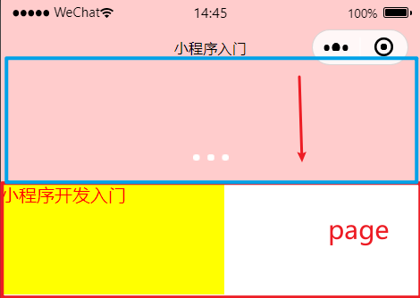
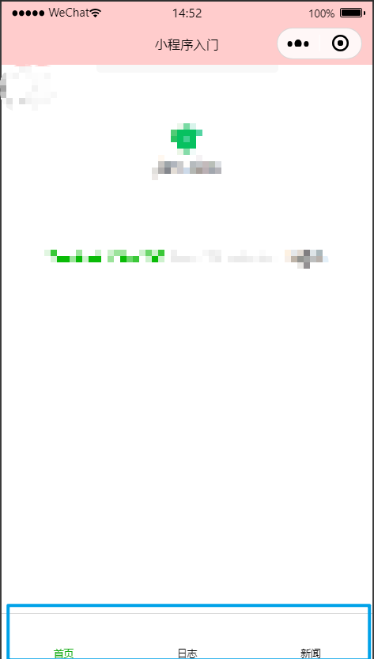

# 框架丶组件丶API

> 上一篇是小程序入门,知道了小程序是什么,小程序的开发环境,以及简单的页面搭建和样式编写
>
> 微信小程序开发中最重要的3个部分是框架丶组件丶API;这一篇主要深入学习一些组件布局,API以及框架

## 1. 组件

*小程序中的组件就是标签,只是比较独立的标签,只能在小程序中去使用而已,起本质就是标签,学习小程序中的组件就相当于学习html中的标签而已; [文档](https://developers.weixin.qq.com/miniprogram/dev/component/)* 

组件和标签一样,都有自己默认的一些属性,学习组件的时候不仅仅学习这个组件的作用,还需要知道组件里面自带了哪些属性,以及属性的作用

### view

view是一个容器标签,类似于html中的div标签;在微信小程序中可以使用view进行布局 [文档](https://developers.weixin.qq.com/miniprogram/dev/component/view.html)

**常用属性:**

1. `hover-class`: 点击后出现的样式,需要预先定义一个类,进行绑定
2. `hover-stop-propagation`:阻止事件冒泡
3. `hover-start-time`: 点击后,多少时间出现变化
4. `hover-stay-time`: 松开后,样式保留的时间是多少


### text

用来包裹文字的组件 [文档](https://developers.weixin.qq.com/miniprogram/dev/component/text.html)

**常用属性:**

1. `user-select`:
2. `space`: 是否连续显示空格,可选值有`ensp`,`emsp`,`nbsp`
3. `decode`: 是否解码


### image

用于做图片的组件 [文档](https://developers.weixin.qq.com/miniprogram/dev/component/image.html)

**常用属性:**

1. `src`: 图片的地址,可以是本地地址,可以是线上地址
2. `mode`: 图片的裁剪缩放模式,可选值有`scaleToFill`,`aspectFit`...
3. `show-menu-by-longpress`: 长按图片,识别小程序二维码


注意点:
1. 可以引入当前项目中的图片资源
2. 可以引入外部的资源


### navigator

这个组件是用于跳转的,其作用类似于html中的a标签 [文档](https://developers.weixin.qq.com/miniprogram/dev/component/navigator.html)

**常用属性:**

1. `target`: 可以跳转到其他小程序,但是无法跳转到其他非小程序的网页,可选值有`self:当前小程序`,`miniProgram:其他小程序`
2. `url`: 用于做小程序内部的网页跳转,例如从首页跳转到当前小程序内的其他界面(page)

注意点:
1. 可以通过target跳转其他小程序
2. 无法通过url跳转到外部网页

### scroll-view

可滚动视图区域 [文档](https://developers.weixin.qq.com/miniprogram/dev/component/scroll-view.html)

**常用属性:**

1. `scroll-x`: 横向滚动
2. `scroll-y`: 纵向滚动
3. `scroll-top`: 竖向滚动位置
4. `scroll-left`: 横向滚动位置

### swiper & swiper-item

两个组件结合使用可以用于做轮播图 [文档](https://developers.weixin.qq.com/miniprogram/dev/component/swiper.html)

**常用属性:**

1. `indicator-dots`: 是否显示面板指示点
2. `indicator-color`: 指示点颜色
3. `indicator-active-color`: 当前选中的指示点颜色
4. `autoplay`:是否自动切换
5. `current`: 当前所在滑块的index
6. `interval`: 自动切换时间间隔
7. `duration`: 滑动动画时长
8. `circular`: 是否采用衔接滑动
9. `vertical`: 滑动方向是否为纵向


```wxml
<!-- 轮播图结构 -->
<swiper >
  <swiper-item>1
    <image></image>
  </swiper-item>
  <swiper-item>2
    <image></image>
  </swiper-item>
  <swiper-item>3
    <image></image>
  </swiper-item>
</swiper>
```

### button

button组件就是微信小程序中的按钮,各种提交登录点击相关操作的按钮都使用这个组件 [文档](https://developers.weixin.qq.com/miniprogram/dev/component/button.html)

**常用属性:**

1. `size`: 用于规定按钮的大小,可选值有`default:默认大小` 和 `mini:小按钮`
2. `type`: 用于规定按钮的样式,可选值有`primary:绿色`,`defalut:白色`,`warn:红色`
3. `plain`: 对组件添加了这个属性,实心按钮会变成空心按钮
4. `disabled`: 默认是false,如果是true,就是禁用状态
5. `open-type`: 微信开发能力,`contact:客服消息`,
6. `form-type`: 用于做用户采集信息的


### checkbox

复选框 [文档](https://developers.weixin.qq.com/miniprogram/dev/component/checkbox.html)


### checkbox-group

[文档](https://developers.weixin.qq.com/miniprogram/dev/component/checkbox-group.html)


### input

用于做输入框,同html中的input [文档](https://developers.weixin.qq.com/miniprogram/dev/component/input.html)

**常用属性:**

1. `value`:
2. `type`: 
3. `password`: 密码框
4. `placeholder`: 
5. `focus`: 获取焦点


### switch

开关滑块 [文档](https://developers.weixin.qq.com/miniprogram/dev/component/switch.html)

**常用属性:**

1. `checked`: 是否选中
2. `disabled`: 是否禁用
3. `type`: 样式
4. `color`: 颜色,用法和css中的color一样


### textarea

文本输入域 [文档](https://developers.weixin.qq.com/miniprogram/dev/component/textarea.html)

**常用属性:**


### icon

图标,这个组件一般用于做消息提示,例如支付成功 [文档](https://developers.weixin.qq.com/miniprogram/dev/component/icon.html)

**常用属性:**

1. `type`: icon的类型,可选值有success, success_no_circle, info, warn, waiting, cancel, download, search, clear
2. `size`: icon的大小
3. `color`: icon的颜色,用法和css的color一样

```wxml
<view style="text-align:center;padding:20px">
  <icon type="success" size="30"></icon>
  <view>支付成功</view>
</view>
```

### progress

进度条 [文档](https://developers.weixin.qq.com/miniprogram/dev/component/progress.html)

**常用属性:**

1. `percent`:百分比
2. `show-info`: 在进度条右侧显示百分比
3. `border-radius`: 圆角
4. `font-size`: 右侧字体百分比大小
5. `activeColor`: 进度条颜色
6. `backgroundColor`: 进度条背景颜色


```wxml
<!-- 进度条 -->
<view style="padding:50px">
  <progress percent="50" show-info></progress>
</view>
```


## 2. 框架

### 2.1 小程序配置

小程序配置分为全局配置,页面配置,sitemap配置

#### 2.1.1 全局配置

小程序根目录下的 `app.json` 文件用来对微信小程序进行全局配置。在这里面配置后,所有的页面都有效,官方文档中所有的配置项都可以在和pages同级的json中进行配置 [文档](https://developers.weixin.qq.com/miniprogram/dev/reference/configuration/app.html)

##### 2.1.1.1 page配置

这个配置是用于创建页面,所有的页面链接都是房子page对象里面的,其格式就是字符串 [文档](https://developers.weixin.qq.com/miniprogram/dev/reference/configuration/app.html#pages)

```json
  "pages": [
    "pages/index/index", //page目录下的index页面的index.wxml文件
    "pages/logs/logs",//pages纹木下的logs下的logs.wxml文件
    "pages/news/news"
  ],
```

##### 2.1.1.2 windows对象配置

用于配置小程序的一些在手机上显示的整体样式的 [文档](https://developers.weixin.qq.com/miniprogram/dev/reference/configuration/app.html#window)

```json
  "window": {
    "backgroundTextStyle": "light", //下拉 loading 的样式，仅支持 dark / light
    "navigationBarBackgroundColor": "#fcc", //小程序顶部导航栏的背景色
    "navigationBarTitleText": "小程序入门",  //小程序顶部标题文字
    "navigationBarTextStyle": "white", //顶部导航栏标题颜色
    "backgroundColor":"#fcc", //当page向下拉动后,留白出来的背景色,需开启enablePullDownRefresh才能向下拉动
    "enablePullDownRefresh":true
  },
```



##### 2.1.1.3 tabBar对象配置

用于配置小程序底部导航菜单的,比如常看到的那种`首页,菜单,用户`这种三栏或四栏的导航,[文档](https://developers.weixin.qq.com/miniprogram/dev/reference/configuration/app.html#tabBar)

```json

//tabBar对象配置,底部切换导航
  "tabBar":{
     color":"#c30"
"selectedcolor":"#0ff"
"backgroundColor": "#ccc,
"borderstyle": "white,
custom" :true,
    "list":[
      {
        "pagePath": "pages/index/index",
        "text":"首页",
      	iconPath": "images/home. png,
      ' selectedIconPath": "images/user-h. png
      },{
        "pagePath":"pages/logs/logs",
        "text":"日志"
      },{
        "pagePath": "pages/news/news",
        "text":"新闻"
      }
    ]
  },
```




#### 2.1.2 页面配置

[页面配置官方文档](https://developers.weixin.qq.com/miniprogram/dev/reference/configuration/page.html)

小程序目录下每个page文件夹下的`xx.json` ,这里面配置的只对当前页面有效;本页面的窗口表现进行配置。页面中配置项在当前页面会覆盖 `app.json` 的 `window` 中相同的配置项


#### 2.1.3 sitemp配置

[sitemp配置官方文档](https://developers.weixin.qq.com/miniprogram/dev/reference/configuration/sitemap.html)

小程序根目录下的 `sitemap.json` 文件用于配置小程序及其页面是否允许被微信索引，文件内容为一个 JSON 对象，如果没有 `sitemap.json` ，则默认为所有页面都允许被索引


## 3. API

