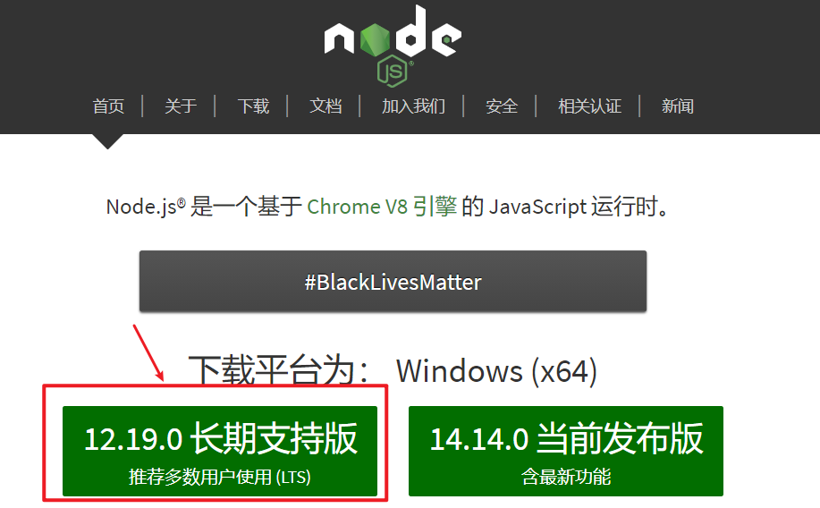

# Doscify简介和安装

## 简介

`docsify`是由现饿了么前端团队@elemeFE的cinwell.li编写的一套文档站点生成框

架，github上已有3k+ star,

Docsify 是一个动态生成文档网站的工具。不同于 GitBook、Hexo 的地方是它不会

生成将 .md 转成 .html 文件，所有转换工作都是在运行时进行。

## 特性

- 无需构建，写完文档直接发布

- 容易使用并且轻量 (~19kB gzipped)

- 智能的全文搜索(`搜索插件`)

- 提供多套主题

- 丰富的 API(`各种插件`)

- 支持 Emoji(`emoji表情大全`)

- 兼容 IE10+

- 支持 SSR (**example**) 

## 安装

### 安装node.js

### npm安装doscify框架

推荐全局安装 `docsify-cli` 工具，可以方便地创建及在本地预览生成的文档。

`npm i docsify-cli -g`

## 样板

其他人基于docsify框架记录笔记的样板

https://veal98.gitee.io/cs-wiki/#/

