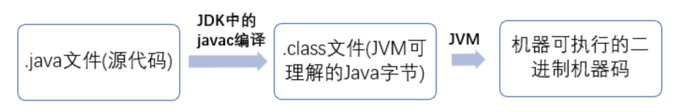

# JavaSE基础面试题

## 1. ⾯向对象和⾯向过程的区别

**⾯向过程 ：**⾯向过程性能⽐⾯向对象⾼。 因为类调⽤时需要实例化，开销比较⼤，比较消耗资 源，所以当性能是最重要的考量因素的时候，⽐如单⽚机、嵌⼊式开发、Linux/Unix 等⼀般采 ⽤⾯向过程开发。但是，⾯向过程没有⾯向对象易维护、易复⽤、易扩展。 

**⾯向对象 ：**⾯向对象易维护、易复⽤、易扩展。 因为⾯向对象有封装、继承、多态性的特性， 所以可以设计出低耦合的系统，使系统更加灵活、更加易于维护。但是，⾯向对象性能⽐⾯向过 程低。

## 2. Java 语⾔有哪些特点?

1. 简单易学；
2. ⾯向对象（封装，继承，多态）；
3. 平台⽆关性（ Java 虚拟机实现平台⽆关性）；
4. 可靠性；
5. 安全性；
6. ⽀持多线程（ C++ 语⾔没有内置的多线程机制，因此必须调⽤操作系统的多线程功能来进⾏多
线程程序设计，⽽ Java 语⾔却提供了多线程⽀持）；
7. ⽀持⽹络编程并且很⽅便（ Java 语⾔诞⽣本身就是为简化⽹络编程设计的，因此 Java 语⾔不
仅⽀持⽹络编程⽽且很⽅便）；
8. 编译与解释并存；

## 3. 关于 JVM JDK 和 JRE 最详细通俗的解答

**JVM:** Java 虚拟机（JVM）是运⾏ Java 字节码的虚拟机。JVM 有针对不同系统的特定实现（Windows， Linux，macOS），⽬的是使⽤相同的字节码，它们都会给出相同的结果。

**什么是字节码?采⽤字节码的好处是什么?**

在 Java 中，JVM 可以理解的代码就叫做 字节码 （即扩展名为 .class 的⽂件），它不⾯向任 何特定的处理器，只⾯向虚拟机。Java 语⾔通过字节码的⽅式，在⼀定程度上解决了传统解释型语 ⾔执⾏效率低的问题，同时⼜保留了解释型语⾔可移植的特点。所以 Java 程序运⾏时比较⾼效， ⽽且，由于字节码并不针对⼀种特定的机器，因此，Java 程序⽆须重新编译便可在多种不同操作系 统的计算机上运⾏。

**Java 程序从源代码到运⾏⼀般有下⾯ 3 步：**

**jvm总结：**

Java 虚拟机（JVM）是运⾏ Java 字节码的虚拟机。JVM 有针对不同系统的特定实现（Windows， Linux，macOS），⽬的是使⽤相同的字节码，它们都会给出相同的结果。字节码和不同系统的 JVM 实 现是 Java 语⾔“⼀次编译，随处可以运⾏”的关键所在。

**JDK 和 JRE**

JDK 是 Java Development Kit，它是功能⻬全的 Java SDK。它拥有 JRE 所拥有的⼀切，还有编译器 （javac）和⼯具（如 javadoc 和 jdb）。<u>它能够创建和编译程序</u>。

JRE 是 Java 运⾏时环境。它是运⾏已编译 Java 程序所需的所有内容的集合，包括 Java 虚拟机 （JVM），Java 类库，java 命令和其他的⼀些基础构件。但是，<u>它不能⽤于创建新程序</u>。

## 4.  Java 和 C++的区别?

都是⾯向对象的语⾔，都⽀持封装、继承和多态

Java 不提供指针来直接访问内存，程序内存更加安全

Java 的类是单继承的，C++ ⽀持多重继承；虽然 Java 的类不可以多继承，但是接⼝可以多继承。

Java 有⾃动内存管理机制，不需要程序员⼿动释放⽆⽤内存

在 C 语⾔中，字符串或字符数组最后都会有⼀个额外的字符‘\0’来表示结束。但是，Java 语⾔中没有结束符这⼀概念。

## 5. 什么是 Java 程序的主类? 应⽤程序和⼩程序的主类有何不同?

⼀个程序中可以有多个类，但只能有⼀个类是主类。

在 Java 应⽤程序中，这个主类是指包含 main（）⽅法的类。

⽽在 Java ⼩程序中，这个主类是⼀个继承⾃系统类 JApplet 或 Applet 的⼦ 类。

应⽤程序的主类不⼀定要求是 public 类，但⼩程序的主类要求必须是 public 类。

主类是 Java 程序执⾏的⼊⼝点。

## 6. Java 应⽤程序与⼩程序之间有哪些差别?

简单说应⽤程序是从主线程启动(也就是 main() ⽅法)。

applet ⼩程序没有 main() ⽅法，主要 是嵌在浏览器⻚⾯上运⾏(调⽤ init() 或者 run() 来启动)，嵌⼊浏览器【这点跟 flash 的⼩游戏类 似。】

## 7. 字符型常量char和字符串常量String的区别?

 形式上: 字符常量是单引号引起的⼀个字符; 字符串常量是双引号引起的若⼲个字符

含义上: 字符常量相当于⼀个整型值( ASCII 值),可以参加表达式运算; 字符串常量代表⼀个地 址值(该字符串在内存中存放位置)

占内存⼤⼩： 字符常量只占 2 个字节; 字符串常量占若⼲个字节 (注意： char 在 Java 中占两 个字节)

## 8. 构造器 Constructor 是否可被 override?

Constructor 不能被 override（重写）,但是可以 overload（重载）,所以你可以看到⼀个类中有多个 构造函数的情况。

## 9.  重载和重写的区别

**什么是重载：**发⽣在同⼀个类中，⽅法名必须相同，参数类型不同、个数不同、顺序不同，⽅法返回值和访问修饰符 可以不同。

**什么是重写：**重写发⽣在运⾏期，是⼦类对⽗类的允许访问的⽅法的实现过程进⾏重新编写。

**重写和重载的区别：**

- **重载**就是同样的⼀个⽅法能够根据输⼊数据的不同，做出不同的处理 

- **重写**就是当⼦类继承⾃⽗类的相同⽅法，输⼊数据⼀样，但要做出有别于⽗类的响应时，你就要覆 盖⽗类⽅法

## 10. Java ⾯向对象编程三⼤特性: 封装 继承 多态

**封装** 封装把⼀个对象的属性私有化，同时提供⼀些可以被外界访问的属性的⽅法，如果属性不想被外界访 问，我们⼤可不必提供⽅法给外界访问。但是如果⼀个类没有提供给外界访问的⽅法，那么这个类也没 有什么意义了。

**继承** 继承是使⽤已存在的类的定义作为基础建⽴新类的技术，新类的定义可以增加新的数据或新的功能，也 可以⽤⽗类的功能，但不能选择性地继承⽗类。通过使⽤继承我们能够⾮常⽅便地复⽤以前的代码。

**关于继承如下 3 点请记住：** 

1. ⼦类拥有⽗类对象所有的属性和⽅法（包括私有属性和私有⽅法），但是⽗类中的私有属性和⽅ 法⼦类是⽆法访问，只是拥有。 
2. ⼦类可以拥有⾃⼰属性和⽅法，即⼦类可以对⽗类进⾏扩展。 
3. ⼦类可以⽤⾃⼰的⽅式实现⽗类的⽅法。

**多态** 所谓多态就是指程序中定义的引⽤变量所指向的具体类型和通过该引⽤变量发出的⽅法调⽤在编程时并 不确定，⽽是在程序运⾏期间才确定，即⼀个引⽤变量到底会指向哪个类的实例对象，该引⽤变量发出 的⽅法调⽤到底是哪个类中实现的⽅法，必须在由程序运⾏期间才能决定。 

**在 Java 中有两种形式可以实现多态：**

- 继承（多个⼦类对同⼀⽅法的重写）
- 接⼝（实现接⼝并覆盖接 ⼝中同⼀⽅法）。

## 11. String 及StringBuffer 和 StringBuilder 的区别是什么? String 为什么是不可变的?

**String：**String 类中<u>使⽤ final 关键字</u>修饰字符数组来保存字符串， private final char value[] ，所以 <u>String 对象是不可变的</u>。

**StringBuilder 与 StringBuffer：** 都继承⾃ AbstractStringBuilder 类，在 AbstractStringBuilder 中也是使⽤字符数组保存字符串 char[]value 但是<u>没有⽤ final 关键字</u>修 饰，所以<u>这两种对象都是可变的</u>。

**AbstractStringBuilder：** StringBuilder 与 StringBuffer 的构造⽅法都是调⽤⽗类构造⽅法也就是 AbstractStringBuilder 实现的

**线程安全性角度上，三者的区别**

- String 中的对象是不可变的，也就可以理解为常量，线程安全。
- AbstractStringBuilder 是 StringBuilder 与 StringBuffer 的公共⽗类，定义了⼀些字符串的基本操作，如 expandCapacity、 append、insert、indexOf 等公共⽅法。
- StringBuffer 对⽅法加了同步锁或者对调⽤的⽅法加了同步 锁，所以是线程安全的。
- StringBuilder 并没有对⽅法进⾏加同步锁，所以是⾮线程安全的。

**性能角度上，三者的区别：**

- 每次对 String 类型进⾏改变的时候，都会⽣成⼀个新的 String 对象，然后将指针指向新的 String 对象。
- StringBuffer 每次都会对 StringBuffer 对象本身进⾏操作，⽽不是⽣成新的对象并改变对象 引⽤。
- 相同情况下使⽤ StringBuilder 相⽐使⽤ StringBuffer 仅能获得 10%~15% 左右的性能提升， 但却要冒多线程不安全的⻛险。

**三者的使用选择：**

1. 操作少量的数据: 适⽤ String
2. 单线程操作字符串缓冲区下操作⼤量数据: 适⽤ StringBuilder
3. 多线程操作字符串缓冲区下操作⼤量数据: 适⽤ StringBuffer

## 12.  ⾃动装箱与拆箱

**装箱：**将基本类型⽤它们对应的引⽤类型包装起来；

**拆箱：**将包装类型转换为基本数据类型；

## 13. 在⼀个静态⽅法内调⽤⼀个⾮静态成员为什么是⾮法的?

由于静态⽅法可以不通过对象进⾏调⽤，因此在静态⽅法⾥，不能调⽤其他⾮静态变量，也不可以访问 ⾮静态变量成员。

## 14. 在 Java 中定义⼀个不做事且没有参数的构造⽅法的作⽤

Java 程序在执⾏⼦类的构造⽅法之前，如果没有⽤ super() 来调⽤⽗类特定的构造⽅法，则会调⽤ ⽗类中“没有参数的构造⽅法”。因此，如果⽗类中只定义了有参数的构造⽅法，⽽在⼦类的构造⽅法中 ⼜没有⽤ super() 来调⽤⽗类中特定的构造⽅法，则编译时将发⽣错误，因为 Java 程序在⽗类中找 不到没有参数的构造⽅法可供执⾏。解决办法是在⽗类⾥加上⼀个不做事且没有参数的构造⽅法。

## 15.  import java 和 javax 有什么区别？

**实际上 java 和 javax 没有区别。这都是⼀个名字。**

刚开始的时候 JavaAPI 所必需的包是 java 开头的包，javax 当时只是扩展 API 包来使⽤。然⽽随着 时间的推移，javax 逐渐地扩展成为 Java API 的组成部分。但是，将扩展从 javax 包移动到 java 包确实太麻烦了，最终会破坏⼀堆现有的代码。因此，最终决定 javax 包将成为标准 API 的⼀部分。

## 16. 接⼝和抽象类的区别是什么？

1. 接⼝的⽅法默认是 public，所有⽅法在接⼝中不能有实现(Java 8 开始接⼝⽅法可以有默认实现），⽽抽象类可以有⾮抽象的⽅法。
2. 接⼝中除了 static、final 变量，不能有其他变量，⽽抽象类中则不⼀定。
3. ⼀个类可以实现多个接⼝，但只能实现⼀个抽象类。接⼝⾃⼰本身可以通过 extends 关键字扩
展多个接⼝。
4. 接⼝⽅法默认修饰符是 public，抽象⽅法可以有 public、protected 和 default 这些修饰符（抽象⽅法就是为了被重写所以不能使⽤ private 关键字修饰！）。
5. 从设计层⾯来说，抽象是对类的抽象，是⼀种模板设计，⽽接⼝是对⾏为的抽象，是⼀种⾏为的规范。

## 17. 成员变量与局部变量的区别有哪些？

**从语法形式上看**:成员变量是属于类的，⽽局部变量是在⽅法中定义的变量或是⽅法的参数；成员变量可以被 public,private,static 等修饰符所修饰，⽽局部变量不能被访问控制修饰符及static 所修饰；但是，成员变量和局部变量都能被 final 所修饰。

**从变量在内存中的存储⽅式来看:**如果成员变量是使⽤ static 修饰的，那么这个成员变量是属于类的，如果没有使⽤ static 修饰，这个成员变量是属于实例的。对象存于堆内存，如果局部变量类型为基本数据类型，那么存储在栈内存，如果为引⽤数据类型，那存放的是指向堆内存对象的引⽤或者是指向常量池中的地址。

**从变量在内存中的⽣存时间上看:**成员变量是对象的⼀部分，它随着对象的创建⽽存在，⽽局部变量随着⽅法的调⽤⽽⾃动消失。

**成员变量如果没有被赋初值:**则会⾃动以类型的默认值⽽赋值（⼀种情况例外:被 final 修饰的成员变量也必须显式地赋值），⽽局部变量则不会⾃动赋值。

## 18. 创建⼀个对象⽤什么运算符?对象实体与对象引⽤有何不同?

**new 运算符**，<u>new 创建对象实例</u>（对象实例在堆内存中），<u>对象引⽤指向对象实例</u>（对象引⽤存放在栈 内存中）。

**⼀个对象引⽤**可以指向 0 个或 1 个对象（⼀根绳⼦可以不系⽓球，也可以系⼀个⽓球）; 

**⼀个对象实体**可以有 n 个引⽤指向它（可以⽤ n 条绳⼦系住⼀个⽓球）。

## 19. 什么是⽅法的返回值?返回值在类的⽅法⾥的作⽤是什么?

**⽅法的返回值：**是指我们获取到的某个⽅法体中的代码执⾏后产⽣的结果！（前提是该⽅法可能产⽣结 果）。

**返回值的作⽤:**接收出结果，使得它可以⽤于其他的操作！

## 20. ⼀个类的构造⽅法的作⽤是什么? 若⼀个类没有声明构造⽅法，该程序能正确执 ⾏吗? 为什么?

主要作⽤是完成对**类对象的初始化⼯作**。

**【结果】:**可以执⾏。

**【原因】：**因为⼀个类即使没有声明构造⽅法也会有默认的不 带参数的构造⽅法。

## 21. 构造⽅法有哪些特性？

1. 名字与类名相同。
2. 没有返回值，但不能⽤ void 声明构造函数。
3. ⽣成类的对象时⾃动执⾏，⽆需调⽤。

## 22.  静态⽅法和实例⽅法有何不同

在外部调⽤静态⽅法时，可以使⽤"类名.⽅法名"的⽅式，也可以使⽤"对象名.⽅法名"的⽅式。 ⽽实例⽅法只有后⾯这种⽅式。也就是说，调⽤静态⽅法可以⽆需创建对象。

静态⽅法在访问本类的成员时，只允许访问静态成员（即静态成员变量和静态⽅法），⽽不允许 访问实例成员变量和实例⽅法；实例⽅法则⽆此限制。

## 23. 对象的相等与指向他们的引⽤相等,两者有什么不同?

**对象的相等**:⽐的是内存中存放的内容是否相等。

**引⽤相等:**，⽐᫾的是他们指向的内存地址是否相 等。

## 24. 在调⽤⼦类构造⽅法之前会先调⽤⽗类没有参数的构造⽅法,其⽬的是?

帮助⼦类做初始化⼯作。

## 25.  == 与 equals(重要)

