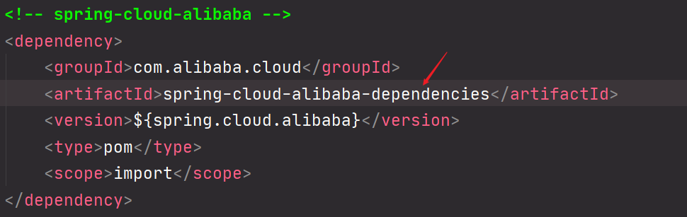

# Nacos组件

Nacos组件有两个作用,一个是 **服务注册与发现(Nacos Discovery)** 一个是 **分布式配置服务**


## 1. 分布式项目构建

### 1.1 兼容问题

springcloud 丶alibaba丶springboot三者需要兼容

springcloud并不是一个独立的框架而是一个工具箱并没有具体的版本号

如果SpringCloud和SpringBoot版本没有对应,会出现许多BUG	


---

SpringCloudAlibaba和boot的版本兼容 [官方文档](https://github.com/alibaba/spring-cloud-alibaba/blob/master/README-zh.md#%E7%89%88%E6%9C%AC%E7%AE%A1%E7%90%86%E8%A7%84%E8%8C%83)


### 1.2 微服务父子架构

可以创建一个父项目来对SpringCloud SpringBoot SrpingCloudAlibaba三者之间进行版本规范;每一个子SpringBoot项目就是一个微服务

#### 1.2.1 构建父项目

创建一个mavaen项目,这个项目只用来做微服务版本管理,并不需要编写逻辑代码,所以可以给src目录删除


引入对应的依赖

```xml
<?xml version="1.0" encoding="UTF-8"?>
<project xmlns="http://maven.apache.org/POM/4.0.0"
         xmlns:xsi="http://www.w3.org/2001/XMLSchema-instance"
         xsi:schemaLocation="http://maven.apache.org/POM/4.0.0 http://maven.apache.org/xsd/maven-4.0.0.xsd">
    <modelVersion>4.0.0</modelVersion>

    <!--父项目坐标-->
    <groupId>com.woniu</groupId>
    <artifactId>ali-cloud-parent</artifactId>
    <!--1.父项目新增 pom-->
    <packaging>pom</packaging>
    <version>1.0-SNAPSHOT</version>

    <!--2.关联子项目-->
    <!--<modules></modules>-->
    <modules>
        <module>ali-cloud-news</module>
        <module>ali-cloud-user</module>
    </modules>

    <!--3.复制子项目中的 parent配置-->
    <parent>
        <groupId>org.springframework.boot</groupId>
        <artifactId>spring-boot-starter-parent</artifactId>
        <version>2.2.9.RELEASE</version>
        <relativePath/> <!-- lookup parent from repository -->
    </parent>
    <!--4.配置公共依赖的版本-->
    <properties>
        <spring-cloud-alibaba.version>2.2.1.RELEASE</spring-cloud-alibaba.version>
        <spring-cloud-version>Hoxton.SR6</spring-cloud-version>
        <java.version>1.8</java.version>
    </properties>
    <!--5.配置公共的依赖-->
    <dependencyManagement>
        <dependencies>
            <!-- spring-cloud-alibaba -->
            <dependency>
                <groupId>com.alibaba.cloud</groupId>
                <artifactId>spring-cloud-alibaba-dependencies</artifactId>
                <version>${spring-cloud-alibaba.version}</version>
                <type>pom</type>
                <scope>import</scope>
            </dependency>
            <!-- springcloud -->
            <dependency>
                <groupId>org.springframework.cloud</groupId>
                <artifactId>spring-cloud-dependencies</artifactId>
                <version>${spring-cloud-version}</version>
                <type>pom</type>
                <scope>import</scope>
            </dependency>
        </dependencies>
    </dependencyManagement>

</project>
```

#### 1.2.2 构建子项目

创建两个SpringBoot子项目


## 2. Nacos Discovery

### 2.1 Discovery是什么

在微服务架构下的项目服务与服务之间的信息是要进行统一管理的,那么这个**中心服务**Nacos Discovery就是来充当管理角色的,一般称这个中心服务为 **服务注册与发现**


### 2.2 Discovery作用

服务发现是微服务架构体系中最关键的组件之一。如果尝试着用<u>手动的方式来给每一个客户端来配置所有服务提供者的服务列表是一件非常困难的事</u>，而且也不利于服务的动态扩缩容。Nacos Discovery 可以让你将服务<u>自动注册到 Nacos 服务端</u>并且能够动态感知和刷新某个服务实例的服务列表。除此之外，Nacos Discovery 也将服务实例自身的一些元数据信息-例如 host，port,健康检查URL，主页等-注册到 Nacos 。


### 2.3 心跳连接

例如服务a和服务b都是受Discovery进行管理的,假设服务b坏掉了,就会告诉Discovery服务b坏掉了,这样服务a通过Discovery知道服务b坏掉了,无法访问

服务b会与Discovery建立一个连接(底层是TCP),而且每隔一会就会发送一个心跳连接到Discovery,如果长时间没有发送心跳连接到Discovery,那么Discovery就会认为服务b已经坏掉,会从里面移除去


### 2.4 服务消费和服务提供

服务消费者是如何访问服务提供者的信息的?

服务消费者和服务提供者都会先注册到Discovery里面,Discpvery保存了服务消费者和提供者的ip和端口. 当服务消费者要访问服务提供者时,会到通过service_name到Discovery拿到对应的ip和端口,然后直接访问

对于Discovery发现服务中心来说,服务消费者,服务提供者都是客户端,Discovery是个服务端


### 2.5 nacos服务下载

nacos其实本身就是一个服务,alibaba已经提供好了,所以可以直接下载使用

nacos官网地址:https://nacos.io/zh-cn/docs/quick-start.html 

nacos各版本下载地址: https://github.com/alibaba/nacos/releases

**nacos服务下载注意点:** 

- 下载nacos的时候需要先点击图示的这个(ctrl+左键)

  

- 然后根据这里的版本下载对应的nacos服务

  

下载完成后解压通过 `nacos\bin\startup.cmd` 启动服务;nacos的默认端口是8846;然后通过http://localhost:8848/nacos进行访问;第一次启动的时候**用户名和密码都是nacos**;登录成功后是如下界面


然后打开服务列表,可以看到是没有服务的


### 2.6 注册服务

将前面创建的两个工程(ali-cloud-user丶ali-cloud-news)注册到服务中心Nacos中

1. 首先分别在两个子工程中引入nacos依赖(哪个项目需要注册到nacos服务中,哪个项目就需要导入这个nacos的jar包)

   ```xml
   <!--nacos服务注册-->
   <dependency>
       <groupId>com.alibaba.cloud</groupId>
       <artifactId>spring-cloud-starter-alibaba-nacos-discovery</artifactId>
   </dependency>
   ```

2. 然后需要分别编写两个SpringBoot工程的配置文件将服务注册到Nacos服务中去

   ```yml
server:
     port: 8081 # 不同的服务配置不同的端口
   spring:
     application:
    name: news-server # 不同的服务配置不同的服务名
     cloud:
    nacos:
         discovery:
           server-addr: localhost:8848 # nacos端口号
   ```


3. 启动两个工程后,注册到nacos服务成功!

   

   

*ps: 上面的就是搭建一个最简单的受nacos管理的服务项目*

---

### 2.7 RestTemplate服务消费

#### 2.7.1 服务之间调用流程

服务与服务之间可以通过**RestTemplate**来进行通信

**【案例】** : 通过显示的新闻查询新闻的发布人信息

```java
// user-server服务的controller层
@RestController
@RequestMapping("/news")
public class NewsController {
    //通过RestTemplate进行服务消费
    private RestTemplate rt = new RestTemplate();

    //根据新闻id查询新闻发布人信息
    @GetMapping("/newsmessage")
    public String newsmessage(@RequestParam(required = false) Integer id){
        //调用user-server的服务
        String user = rt.getForObject("http://localhost:8082/user/getuser?newsid=" + id, String.class);
        return "news-server:【新闻的id为:"+id+"这条新闻的发布人信息是:】"+"\n"+user;
    }
}
```

```java
// news-server服务的controller层
@RestController
@RequestMapping("/user")
public class UserController {
    //通过新闻id的查询发布人信息
    @GetMapping("/getuser")
    public String getuser(@RequestParam(required = false) Integer newsid){
        return "user-server:【id为:"+newsid+"的人的个人信息是balabala...】";
    }
}
```

**测试结果: **


#### 2.7.2 使用服务名进行服务调用

*ps: 在新闻服务中通过RestTemplate调用用户服务时,采用的是地址+端口的方式进行的,我们也可以通过nacos中注册的服务名来进行调用*

**news-server服务**

```java
/**
 * @program: ali-cloud-parent
 * @description: config配置类,在当前服务的config包下
 * @author: XiYang
 * @create: 2020-09-23 14:19
 **/
@Configuration
public class NewsConfig {
    @Bean
    @LoadBalanced //需要开启负载均衡
    public RestTemplate getRestTemplate(){
        return new RestTemplate();
    }
}
```

```java
/**
 * @program: ali-cloud-parent
 * @description:
 * @author: XiYang
 * @create: 2020-09-23 10:41
 **/
@RestController
@RequestMapping("/news")
public class NewsController {
    //通过RestTemplate进行服务消费
    //private RestTemplate rt = new RestTemplate();

    @Autowired
    private RestTemplate rt;
    //根据新闻id查询新闻发布人信息
    @GetMapping("/newsmessage")
    public String newsmessage(@RequestParam(required = false) Integer id){
        //调用user-server的服务
        //String user = rt.getForObject("http://localhost:8082/user/getuser?newsid=" + id, String.class);
        String user = rt.getForObject("http://user-server/user/getuser?newsid=" + id, String.class);
        return "news-server:【新闻的id为:"+id+"这条新闻的发布人信息是:】"+"\n"+user;
    }
}
```

**user-server服务**

```java
/**
 * @program: ali-cloud-parent
 * @description:
 * @author: XiYang
 * @create: 2020-09-23 10:48
 **/
@RestController
@RequestMapping("/user")
public class UserController {
    //通过新闻id的查询发布人信息
    @GetMapping("/getuser")
    public String getuser(@RequestParam(required = false) Integer newsid){
        return "user-server:【id为:"+newsid+"的人的个人信息是balabala...】";
    }
}
```


**测试结果:**


### 2.8 Discover领域模型

#### 2.8.1领域模型理论基础

**领域模型图**


| 名词      | 描述                                                         |
| --------- | ------------------------------------------------------------ |
| Namespace | 命名空间(隔离)所有没有指定namespace的服务其names[ace都是public |
| Group     | 逻辑分组                                                     |
| cluster   | 集群                                                         |
| instance  | 具体的服务                                                   |
|           |                                                              |

**领域模型的意义**: 通过领域模型可以对整个服务进行逻辑分类

**领域模型的注意点:**

1. 命名空间具备隔离性,不同的namespace之间的服务无法相互调用
2. 新版本group之间的服务也无法相互调用


#### 2.8.2 领域模型创建namespace

新建一个命名空间: 


会生成一个随机命名空间id:


将这个id配置到user-server服务中,即user-server在在codexiyang这个命名空间里面

```yml
server:
  port: 8082
spring:
  application:
    name: user-server # 配置服务名
  cloud:
    nacos:
      discovery:
        server-addr: localhost:8848 # nacos端口号
        namespace: e1802ca1-cc34-4200-af59-1566742818a3 # 配置命名空间
```

可以看到user-server服务在其他命名空间.new-server在默认命名空间中


重启user-server服务,无法通过news-server服务访问user-server服务了;`No instances available for user-server没有适用于用户服务器的实例`得出结论: **不同的namespace空间里面的服务是无法进行访问的**


当我们在news-server中也配置了这个相同的命名空间的字符串后,服务与服务之间又可以相互访问了

```yml
server:
  port: 8081 # 不同的服务配置不同的端口
spring:
  application:
    name: news-server # 不同的服务配置不同的服务名
  cloud:
    nacos:
      discovery:
        server-addr: localhost:8848 # nacos端口号
        namespace: e1802ca1-cc34-4200-af59-1566742818a3 # 配置命名空间
```


#### 2.8.3 领域模型创建group

相同的group之间的服务可以相互访问,不同的服务与服务之间无法相互访问

直接在配置文件中配置group完事

```yml
server:
  port: 8082
spring:
  application:
    name: user-server # 配置服务名
  cloud:
    nacos:
      discovery:
        server-addr: localhost:8848 # nacos端口号
        namespace: e1802ca1-cc34-4200-af59-1566742818a3 # 配置命名空间
        group: 1
```

```yml
server:
  port: 8081 # 不同的服务配置不同的端口
spring:
  application:
    name: news-server # 不同的服务配置不同的服务名
  cloud:
    nacos:
      discovery:
        server-addr: localhost:8848 # nacos端口号
        namespace: e1802ca1-cc34-4200-af59-1566742818a3 # 配置命名空间
        group: 1
```


#### 2.8.4 领域模型配置集群cluster

集群配置仅仅只是一个逻辑分类,可以,不影响服务与服务之间的访问

对new-server服务进行配置;配置集群名字为SH,多端口

```yml
server:
  # port: 8080 # 不同的服务配置不同的端口
  # port: 8181 # 不同的服务配置不同的端口
   port: 8281 # 不同的服务配置不同的端口
spring:
  application:
    name: user-server # 不同的服务配置不同的服务名
  cloud:
    nacos:
      discovery:
        server-addr: localhost:8848 # nacos端口号
        namespace: e1802ca1-cc34-4200-af59-1566742818a3 # 配置命名空间
        group: 1
        # cluster-name: CQ # news-server在重庆
        cluster-name: SH # news-server在上海
```

然后可以看到news-server的服务详情


> 思考: user-server现在有2个集群,当news-server调用user-server的服务的时候,到底是访问哪个节点中的服务?
>
> - 这就涉及到负载均衡了,通过负载均衡的算法去进行访问的

#### 2.8.5 元数据配置

元数据也是用来做逻辑判断的,代码中需要就去使用元数据,不需要就不使用元数据

```yml
server:
  port: 8283
# port: 8082
  # port: 8182
  # port: 8282
spring:
  application:
    name: user-server # 配置服务名
  cloud:
    nacos:
      discovery:
        server-addr: localhost:8848 # nacos端口号
        namespace: e1802ca1-cc34-4200-af59-1566742818a3 # 配置命名空间
        group: 1
        cluster-name: CQ # news-server在重庆
        # cluster-name: SH # news-server在上海
        metadata:
          username: lqz
          password: 1234
          message:
            sex: 男
            age: 18岁
```


#### 2.8.6 配置小结

```yml
spring:
  application:
    name: user-server # 配置服务名
  cloud:
    nacos:
      discovery:
        server-addr: localhost:8848 # nacos端口号
        namespace: e1802ca1-cc34-4200-af59-1566742818a3 # 配置命名空间
        group: 1 # 配置分组
        cluster-name: CQ # 配置集群
        metadata: # 配置元数据 满足json格式
          username: lqz
          password: 1234
          message:
            sex: 男
            age: 18岁
```


----


Nacos  config

在微服务架构模式下,每个服务都有不同的配置,Nacos config是用于对不同服务的配置进行统一管理,即是一个**配置中心管理服务**

