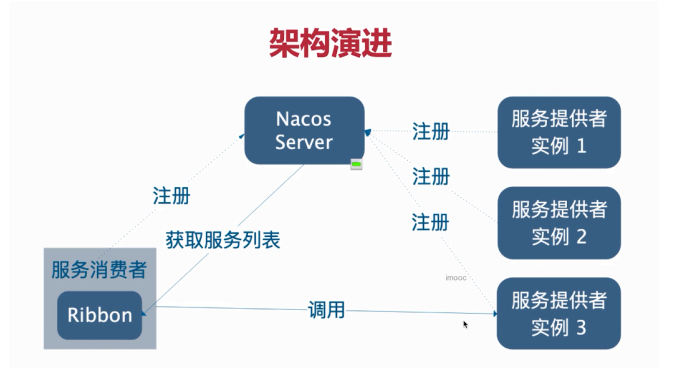
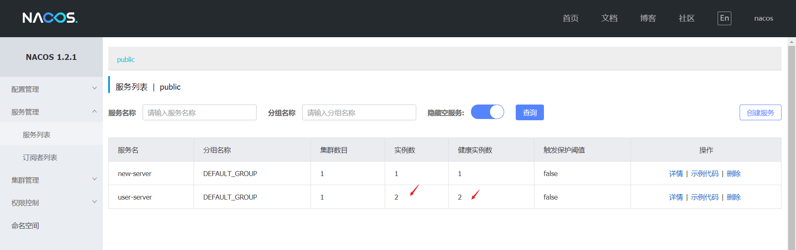

# Ribbon组件

## 1. Ribbon理论基础

### 1.1 什么是负载均衡LBS

顾名思义，这个负载均衡服务器最基本的功能就是要保证所有提供服务的机器要大概一样忙，不能一台机器忙到爆，另外一台机器在吹空调。这样不公平，如果是这样，我们也没有必要花钱买这么多的机器了。所以LBS在决定将服务请求forward到某台机器前需要一些策略来保证大家相对一样忙。

### 1.2 Ribbon是什么

- Ribbon是Netflix发布的云中间层服务开源项目
- 主要功能是提供客户端(消费者方)**负载均衡**算法
- Ribbon客户端组件提供一系列完善的配置项，如，连接超时，重试等。
- 简单的说，**Ribbon是一个客户端负载均衡器**，我们可以在配置文件中列出load Balancer后面所有的机器，Ribbon会自动的帮助你基于某种规则(如简单轮询，随机连接等)去连接这些机器，
- 我们也可以**使用Ribbon实现自定义的负载均衡算法**。
- Ribbon是SpringCloud的基础组件,所以在使用Ribbon组件的时候并不需要使用导入jar包

### 1.3 Ribbon工作流程

Ribbon和其他服务实例都会注册到Nacos中

Ribbon从Nacos中获取所有的服务列表

通过不同的负载均衡算法拿到服务实例



## 2. 模拟Ribbon轮询负载均衡

模拟ribbon的负载均衡算法

**news-server服务**

```java
@Configuration
public class BaseConfig {
    @Bean
    //@LoadBalanced //开启负载均衡(由于是模拟的,不需要开启)
    public RestTemplate getRestTemplate(){
        return new RestTemplate();
    }
}
```

```java
@RestController
@RequestMapping("/news")
public class NewsController {

    @Autowired
    private RestTemplate restTemplate;
    @Autowired
    private DiscoveryClient discoveryClient; //这个对象由SpringCloud提供,可以用于

    @GetMapping("/list")
    //通过id查询某一条新闻
    public String getByid(@RequestParam(required = false) Integer id){
        //获取这个服务  获取这个服务的所有节点
        List<ServiceInstance> instances = discoveryClient.getInstances("user-server");
        //模拟随机算法,拿到其中的一个节点
        ServiceInstance serviceInstance = instances.get(new Random().nextInt(instances.size()));
        //通过节点拿到资源路径
        URI uri = serviceInstance.getUri();
        //调用user-server的服务                              //调用nacos中配置的user-server服务
        String user =restTemplate.getForObject(uri+"/user/getUser?newsid="+id,String.class);
        return "新闻的id为:"+id + "=============>"+ user; //新闻根用户一起显示
    }
}
```

**user-server服务**

开启两次服务,一次服务是8081,一次服务是8082

```java
@RestController
@RequestMapping("/user")
public class UserController {
    @Value("${server.port}") //获取配置信息
    private String port;

    @GetMapping("/getUser")
    //通过新闻id查询用户对象
    public String getUserByNewsId(@RequestParam(required = false) Integer newsid){
        return newsid +  "代表的这条新闻对应的用户"+",当前端口:"+port;
    }
}
```

```yml
server:
  # port: 8082 # user-server1
  port: 8083 # user-server2
spring:
  application:
    name: user-server
  cloud:
    nacos:
      discovery:
        server-addr: localhost:8848
```

可以看到user-server有两个实例(一个是8082的一个是8083的)



**测试结果**

user-server端口是在发生变化的,意味着每次发送请求都是user-server下的不同的实例,ribbon组件对这个算法做了强大的封装,我们可以通过ribbon来实现负载均衡


## 3. 使用Ribbon

项目中使用Ribbon负载均衡,ribbon是作为消费者的,这里的消费者是news-server服务

**news-server服务**

```java
@Configuration
public class BaseConfig {
    @Bean
    @LoadBalanced //开启负载均衡支持
    public RestTemplate getRestTemplate(){
        return new RestTemplate();
    }
}
```

```java
@RestController
@RequestMapping("/news")
public class NewsController {

    @Autowired
    private RestTemplate restTemplate;

    @GetMapping("/list")
    //通过id查询某一条新闻
    public String getByid(@RequestParam(required = false) Integer id){         //调用nacos中配置的user-server服务
        String user =restTemplate.getForObject("http://user-server/user/getUser?newsid="+id,String.class);
        return "新闻的id为:"+id + "=============>"+ user; //新闻根用户一起显示
    }
}
```

**news-server服务**

```java
@RestController
@RequestMapping("/user")
public class UserController {
    @Value("${server.port}") //获取配置信息
    private String port;

    @GetMapping("/getUser")
    //通过新闻id查询用户对象
    public String getUserByNewsId(@RequestParam(required = false) Integer newsid){
        return newsid +  "代表的这条新闻对应的用户"+",当前端口:"+port;
    }
}
```


分别启动8082和8083的服务

```yml
server:
   port: 8082 # user-server1
  # port: 8083 # user-server2
spring:
  application:
    name: user-server
  cloud:
    nacos:
      discovery:
        server-addr: localhost:8848
```

**测试结果:** *ribbon默认是轮询策略*,比如1,2,3 这3个端口,先访问1,然后访问2,然后访问3为一轮,下一次又访问1..依次循环


## 4. Ribbon内置负载均衡策略

ribbon中不仅仅只有轮换策略,Ribbon中还内置了一些其他的负载均衡的策略

| 策略类                                                     | 命名                   | 描述                                                         |
| ---------------------------------------------------------- | ---------------------- | ------------------------------------------------------------ |
| `RandomRule`                                               | **随机策略**           | 随机选择server                                               |
| `RoundRobinRule`                                           | **轮询策略**           | 按照顺序选择server（ribbon默认策略）                         |
| `RetryRule`                                                | **重试策略**           | 在一个配置时间段内，当选择server不成功，则一直尝试选择一个可用的server |
| `BestAvailableRule`                                        | **最低并发策略**       | 逐个考察server，如果server断路器打开，则忽略，再选择其中并发链接最低的server |
| `AvailabilityFilteringRule`                                | **可用过滤策略**       | 过滤掉一直失败并被标记为circuit tripped的server，过滤掉那些高并发链接的server（active connections超过配置的阈值） |
| ~~`ResponseTimeWeightedRule`~~  `WeightedResponseTimeRule` | **响应时间加权重策略** | 根据server的响应时间分配权重，响应时间越长，权重越低，被选择到的概率也就越低。响应时间越短，权重越高，被选中的概率越高，这个策略很贴切，综合了各种因素，比如：网络，磁盘，io等，都直接影响响应时间;前者被废弃 |
| `ZoneAvoidanceRule`                                        | **区域权重策略**       | 综合判断server所在区域的性能，和server的可用性，轮询选择server并且判断一个AWS Zone的运行性能是否可用，剔除不可用的Zone中的所有server |

## 5. 全局配置内置策略

内置策略的配置方式有两种,一种是<u>代码配置</u>,一种是在yml配置文件中配置(一般不用)

上面的这些不同的策略都是不同的算法对象,所有的算法对象都是实现于`Rule`接口的;要想使用不同的策略可以将这个策略丢到容器中就完事了.例如使用随机策略RandomRule

**news-server服务配置**

```java
@Configuration
public class BaseConfig {
    @Bean
    @LoadBalanced //开启负载均衡
    public RestTemplate getRestTemplate(){
        return new RestTemplate();
    }

    //使用不同种策略(以使用RandomRule为例)
    //ps:这种暴力的方式的全局配置的,会覆盖默认的轮询策略
    @Bean
    public IRule getRule(){
        return new RandomRule();
    }
}
```

测试结果: 随机访问不同的端口的服务的


**警告**: 最好不要使用这样的方式(直接丢到容器中)进行全局配置策略模式,否则容易出现问题,最好采用以下的方式来进行全局的策略配置

- 主容器配置

  ```java
  //主容器配置
  @Configuration
  @RibbonClients(defaultConfiguration = RibbonConfig.class)
  public class BaseConfig {
      @Bean
      @LoadBalanced //开启负载均衡
      public RestTemplate getRestTemplate(){
          return new RestTemplate();
      }
  }
  ```

- ribbon配置

  ```java
  //ribbon配置
  @Configuration
  public class RibbonConfig {
      //使用不同种策略(以使用RandomRule为例)
      //ps:这种暴力的方式的全局配置的,会覆盖默认的轮询策略
      @Bean
      public IRule getRule(){
          return new RandomRule();
      }
  }
  ```

  

## 6. 自定义负载均衡策略

在实际的环境中,ribbon提供的内置策略无法满足自己的实际需求时,就需要自定义负载均衡策略


