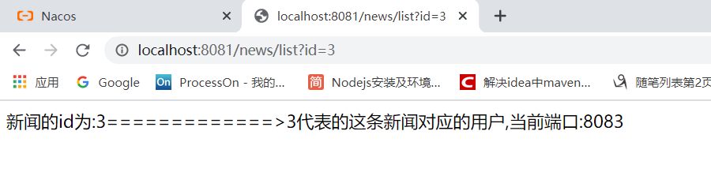
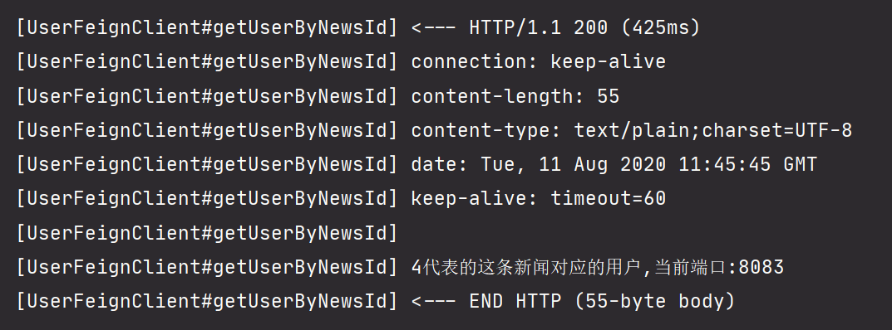
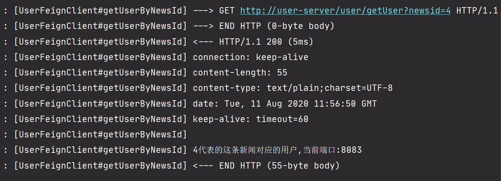

# Fegin组件

## Fegin是什么

当我们通过RestTemplate调用其它服务的API时，所需要的参数须在请求的URL中通过`?`进行拼接，如果参数少的话或许我们还可以忍受，一旦有多个参数的话，这时拼接请求字符串就会效率低下.

```java
//调用user-server的服务
String user = restTemplate.getForObject("http://localhost:8082/user/getUser?newsid="+id,String.class);
```


**Feign是一个声明式的Web Service客户端**，它的目的就是让Web Service调用更加简单。Feign提供了HTTP请求的模板，通过编写简单的接口和插入注解，就可以定义好HTTP请求的参数、格式、地址等信息。而Feign则会完全代理HTTP请求，我们只需要像调用方法一样调用它就可以完成服务请求及相关处理。Feign整合了Ribbon和Sentinel(关于Sentinel我们后面再讲)，可以让我们不再需要显式地使用这两个组件。

feign就是通过一个本地对服务接口的**代理**，进行对注册到注册中心的服务调用，对于调用者来说，就像调用本地接口一样。

Feign是以接口方式进行调用,而不是通过RestTemplate来调用,**feign底层还是ribbon**,它进行了封装,让我们调用起来更加友好

## Fegin特性

总起来说，Feign具有如下特性：

1. 可插拔的注解支持，包括Feign注解和JAX-RS注解;

2. 支持可插拔的HTTP编码器和解码器;

3. 支持Sentinel和它的Fallback;

4. 支持Ribbon的负载均衡;

5. 支持HTTP请求和响应的压缩。

这看起来有点像我们springmvc模式的Controller层的RequestMapping映射。这种模式是我们非常喜欢的。**Feign是用@FeignClient来映射服务的。**


## Fegin的基本使用

使用之前的news-server和user-server工程

**news-server服务**

news-server服务通过fegin方式去访问user-server服务中的方法,所以需要在user-server中添加依赖

```xml
<!--fegin包-->
<dependency>
    <groupId>org.springframework.cloud</groupId>
    <artifactId>spring-cloud-starter-openfeign</artifactId>
</dependency>
```

编写一个包client并编写一个接口

```java
@FeignClient("user-server") //这里的value是服务中心里面需要访问的服务名
@RequestMapping("/user") //由于UserController有这个外层路径,所以这里也需要添加上
public interface UserFeignClient { //接口中的方法需要完全按照user-server中的方法去写
    @GetMapping("/getUser")
    //通过新闻id查询用户对象
    public String getUserByNewsId(@RequestParam(required = false) Integer newsid);
}
```

news-server服务中使用这个接口调用user-server中的提供的方法

```java
@RestController
@RequestMapping("/news")
public class NewsController {

//    @Autowired
//    private RestTemplate restTemplate;
    @Autowired
    private UserFeignClient userFeignClient;

    @GetMapping("/list")
    //通过id查询某一条新闻
    public String getByid(@RequestParam(required = false) Integer id){
        String user = userFeignClient.getUserByNewsId(id); //直接调用方法
        return "新闻的id为:"+id + "=============>"+ user; //新闻根用户一起显示
    }
}
```

news-server服务的启动类中需要添加@EnableFeignClients注解

```java
@SpringBootApplication
@EnableFeignClients //使用Fegin需要在启动类中添加这个注解
public class NewsServerApplication {

    public static void main(String[] args) {
        SpringApplication.run(NewsServerApplication.class, args);
    }

}
```

**user-server服务**

```java
@RestController
@RequestMapping("/user")
public class UserController {
    @Value("${server.port}") //获取配置信息
    private String port;

    @GetMapping("/getUser")
    //通过新闻id查询用户对象
    public String getUserByNewsId(@RequestParam(required = false) Integer newsid){
        return newsid +  "代表的这条新闻对应的用户"+",当前端口:"+port;
    }
}
```

**测试结果:**



## Fegin日志

fegin提供了日志功能,用于显示通过fegin调用的所有详细信息;在使用fegin的日志的时候,需要将全局的日志调整为debug级别

### yml配置

将使用fegin的new-server服务的全局配置yml文件配置为如下:

```yml
server:
  port: 8081
spring:
  application:
    name: new-server
  cloud:
    nacos:
      discovery:
        server-addr: localhost:8848
# 全局的日志调整为debug级别
logging:
  level:
    # 此处要将对应 Feign 的日志界别设置成 DEBUG，因为 Feign 的 Logger.Level 只对 DEBUG 作出响应
    com.xiyang.client: debug
# fegin的日志 全局配置使用default 局部配置使用服务名
feign:
  client:
    config:
      default:
        logger-level: full
```

刷新浏览器访问,即可在后台中看到fegin的日志信息



### java代码配置

关于fegin的配置一般使用yml配置比较方便,一般不会使用java代码配置,java代码配置作为了解

new-server中的yml配置如下

```yml
server:
  port: 8081
spring:
  application:
    name: new-server
  cloud:
    nacos:
      discovery:
        server-addr: localhost:8848
# 全局的日志调整为debug级别
logging:
  level:
    # 此处要将对应 Feign 的日志界别设置成 DEBUG，因为 Feign 的 Logger.Level 只对 DEBUG 作出响应
    com.xiyang.client: debug
# fegin的日志 全局配置使用default 局部配置使用服务名
#feign:
#  client:
#    config:
#      default:
#        logger-level: full
```

fegin日志配置类

```java
@Configuration
public class FeginConfig {
    @Bean
    public Level createLevel(){
        return Level.FULL;
    }
}
/**
 * import feign.Logger;
 * import feign.Logger.Level;
 */
```

注意: 如果是局部配置需要在使用fegin的接口中的@FeignClient注解中添加configuration属性,值为日志配置配置类型

```java
//@FeignClient(name="user-server",configuration = FeginConfig.class) //(局部配置)这里的name是服务中心里面需要访问的服务名  这里的configuration是进行日进行日志配置的
@FeignClient(name="user-server") //全局配置
@RequestMapping("/user") //由于UserController有这个外层路径,所以这里也需要添加上
public interface UserFeignClient { //接口中的方法需要完全按照user-server中的方法去写
    @GetMapping("/getUser")
    //通过新闻id查询用户对象
    public String getUserByNewsId(@RequestParam(required = false) Integer newsid);
}
```

测试结果



## Fegin连接池

Fegin是支持连接池配置的

```yml
server:
  port: 8081
spring:
  application:
    name: new-server
  cloud:
    nacos:
      discovery:
        server-addr: localhost:8848
# 全局的日志调整为debug级别
logging:
  level:
    # 此处要将对应 Feign 的日志界别设置成 DEBUG，因为 Feign 的 Logger.Level 只对 DEBUG 作出响应
    com.xiyang.client: debug
# fegin的日志 全局配置使用default 局部配置使用服务名
feign:
  # fegin日志配置
  client:
    config:
      default:
        logger-level: full
  # fegin连接池配置
  httpclient:
    enabled: true # 开启连接池
    max-connections: 200 # 最大连接数200
    max-connections-per-route: 50 
    connection-timeout: 200000 # 超时时间20秒
```

## Fegin接口编写

当参数比较多是时,如何进行访问

通过及几种方式去搞的,回头再搞...

dto数据传输对象

bulider建造者模式