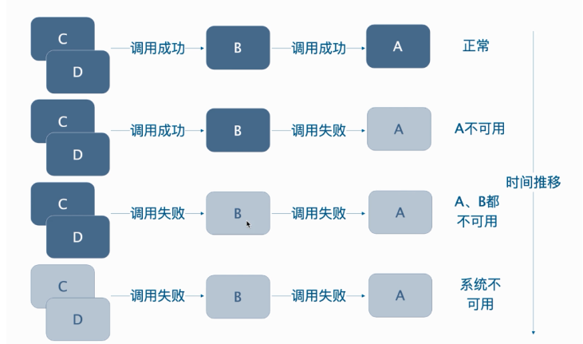
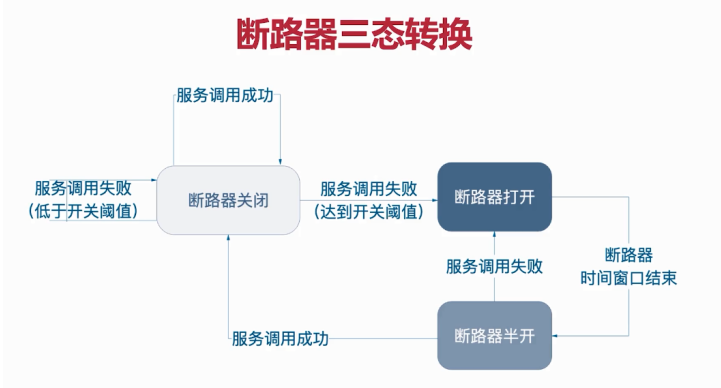
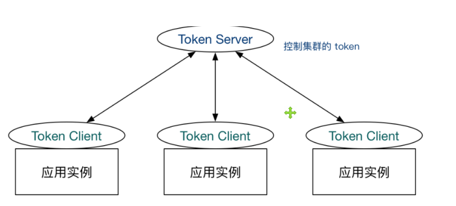

# Sentinerl组件

sentiner组件是对我们服务的一种防护

官方文档: https://github.com/alibaba/spring-cloud-alibaba/wiki/Sentinel

## 1. 雪崩效应

刚开始某个网站的所有服务是正常运行的(c,d,b,a都正常)

随着时间的推移,网站的名气逐渐变高,外来的点击量变大,出现了高并发 (线程变多)

大量的请求(线程过多)导致服务A这里堵塞,调用失败,时间继续推移,大量的线程堵塞在服务B处,导致服务B也调用失败

最后线程堵塞在服务C和服务D处,使其都调用失败,微服务架构下的所有服务大规模的崩掉;

最终的结果导致整个微服务都无法运行



> 就像堵车一样,某高速路口发生车祸,刚开启是几个车堵住,我们可以将被堵的车理解为线程.车祸过不去,线程堵塞,后面大量的车都过不去,大量的车都被(线程)堵塞,就会导致高速路瘫痪;如果没有交警的疏通,整条高速路都被堵.最终,这条路就被大量的汽车(线程)堵死,高速路瘫痪;
>
> sentinerl可以扮演交警的角色,进行解决问题(限流啊啥的....)

## 2. 服务容错

服务容错机制是用来避免雪崩效应的;服务容错机制提供了4种方案来解决服务雪崩效应;其中使用最多的方案就是限流和短路器

### 2.1 限流

在某一个时间段,只允许过来的请求有100个,超过100个请求就限制掉

### 2.2 短路器

当服务压力过大,可以通过打开短路器的方式来对服务进行下线.阻止掉所有来访问服务的请求

当短路器设定的下线的时间到了之后,短路器进行半开,如果请求能过去,断路器就关闭,服务上线,如果请求无法过去,断路器全开,服务继续下线



### 2.3 超时

请求访问的时候超过时间了

### 2.4 仓壁模式

例如重庆的九宫格火锅,如果一个格子漏了,不影响其他格子继续吃火锅;

### qps指标(面)

每秒查询率,是对一个特点的查询服务器在规定时间流锁处理流量多少的衡量标准

用来衡量服务压力的,每秒钟有多少流量进来

## 3. sentinel

随着微服务的流行，服务和服务之间的稳定性变得越来越重要。 Sentinel以流量为切入点，从流量控制、熔断降级、系统负载保护等多个维度保护服务的稳定性。

sentinel就是是用来做服务容错的处理的

使用sentinel

导入依赖


下载sentinel控制台(就是一个jar包,通过cmd启动jar包)


注意点:

sentinel包引入进来后数据响应会转换成xml，需要去掉一个依赖

```xml
<groupId>com.fasterxml.jackson.dataformat</groupId>
<artifactId>jackson-dataformat-xml</artifactId>
```


### 3.1 流量控制

#### 3.1.1 流控模式

**直接**: 针对资源自己达到某个阀值就进行限流

**关联**: 关联的资源达到某个阀值进行限流

**链路: ** 服务内部对资源内部调用的资源进行入口来源的限制


#### 3.1.2 流控效果

**快速失败: ** 当达到阀值之后直接抛异常

**Warm Up:** 当流量在某一瞬间很大的时候,它不会让流量立即到达阀值,而是经过一段时间慢慢的预热增长

**排队通过: ** 请求达到阀值进行匀速排队通过


### 3.2 降级策略

**RT**: 平均响应时间,当 1s 内持续进入 N 个请求，对应时刻的平均响应时间（秒级）均超过阈值（count，以 ms 为单位），那么在接下的时间窗口（DegradeRule 中的 timeWindow，以 s 为单 位）之内，对这个方法的调用都会自动地熔断（抛出 DegradeException）。

**异常比例**: 通过没秒的异常总数计算比例

**异常数量**: 


### 3.3 热点参数,授权,系统规则


### 3.4 集群流控

**集群流控身份** : 集群流控中共有两种身份

- Token Client: 集群流控客户端,用于向所属Token Server通信请求token.集群限流服务端会返回给客户端结果,决定是否限流
- Token Server: 即集群流控服务端,处理来自Token Client的请求,根据配置的集群规则判断是否应该发放token(是否允许通过)

**集群流控模型**




### 3.5 三大接口


