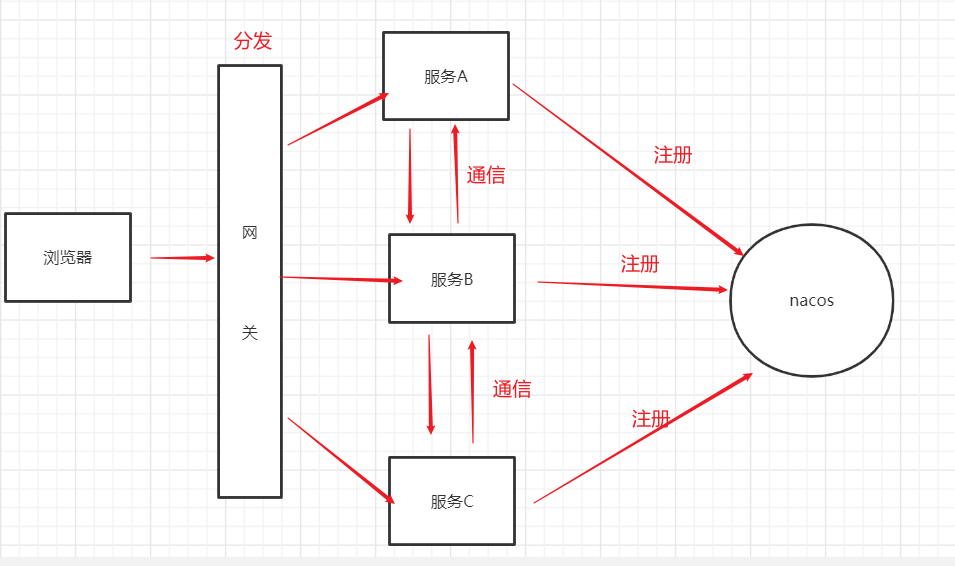
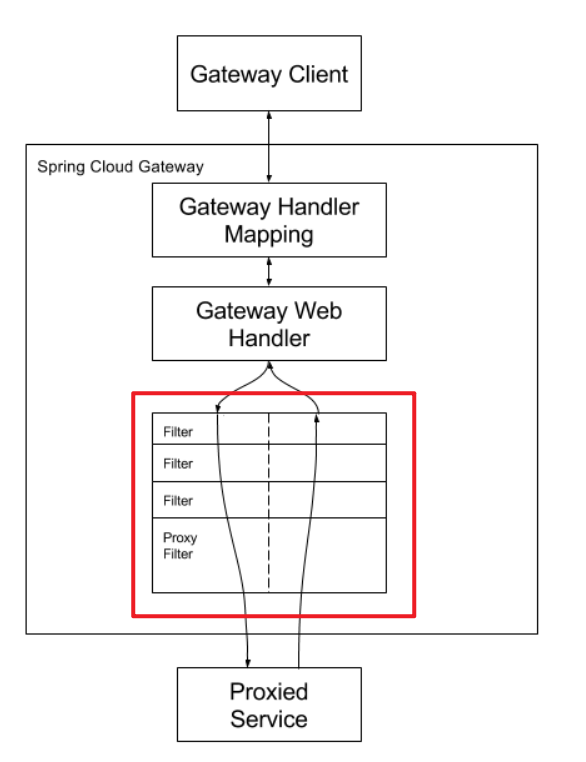
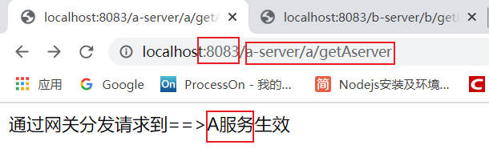
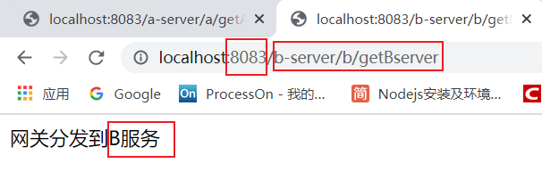
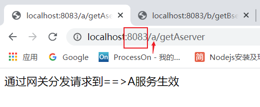
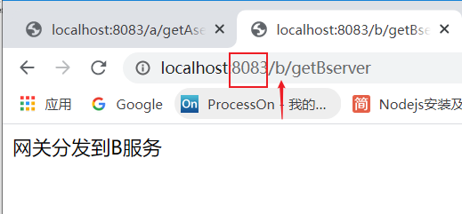

# Gateway组件

## 1.网关服务

所有的服务是注册到nacos的;服务与服务之间的通信可以采用fegin和resttemplate,外面的请求想要访问内部的不同服务需要通过一个中间分发器,这样才能保证安全性;在微服务架构中,这个中间分发器就教**网关服务**,网关服务就是用来对浏览器的请求进行分发到不同的服务上



## 2. zuul和gateway

zuul是第一代网关服务,gateway是第二代网关服务;gateway不是基于javaweb来开发的,而是基于反应是编程模式webflux进行的;

 Spring Cloud Gateway需要Spring Boot和Spring Webflux提供的Netty运行时。它不能在传统的Servlet容器中或作为WAR构建时使用。


## 3. gateway网关三大组成

**路由**: 网关的基本构建块。它由ID，目标URI，谓词集合和过滤器集合定义。如果聚合谓词为true，则匹配路由。

**谓词**: 这是[Java 8函数谓词](https://docs.oracle.com/javase/8/docs/api/java/util/function/Predicate.html)。输入类型是[Spring Framework`ServerWebExchange`](https://docs.spring.io/spring/docs/5.0.x/javadoc-api/org/springframework/web/server/ServerWebExchange.html)。这使您可以匹配HTTP请求中的所有内容，例如标头或参数。

**过滤器:** 这些是使用特定工厂构造的[Spring Framework`GatewayFilter`](https://docs.spring.io/spring/docs/5.0.x/javadoc-api/org/springframework/web/server/GatewayFilter.html)实例。在这里，您可以在发送下游请求之前或之后修改请求和响应。


## 4. gateway工作流程

核心就在于gatewayfilter链



## 5. gateway的基本使用

### 5.1 gateway依赖

要将Spring Cloud Gateway包含在您的项目中，请使用启动器，其组ID为`org.springframework.cloud`，工件ID为`spring-cloud-starter-gateway`。有关使用当前Spring Cloud Release Train设置构建系统的详细信息，请参见[Spring Cloud Project页面](https://projects.spring.io/spring-cloud/)。

注意: gateway服务也是注册到nacos服务上的,因此需要搭配nacos一起使用

```xml
<!--gateway网关服务依赖-->
<dependency>
    <groupId>org.springframework.cloud</groupId>
    <artifactId>spring-cloud-starter-gateway</artifactId>
</dependency>
<!--nocas包-->
<dependency>
    <groupId>com.alibaba.cloud</groupId>
    <artifactId>spring-cloud-starter-alibaba-nacos-discovery</artifactId>
</dependency>
```

### 5.2 使用gateway自动路由

使用gateway网关做服务自动路由分发请求

创建3个工程 a-server b-server gateway-server

首先启动nacos服务,然后依次启动上面这3个服务

**a-server服务**

```java
@RestController
@RequestMapping("/a")
public class AserverController {
    @GetMapping("/getAserver")
    public String getAserver(){
        return "通过网关分发请求到==>A服务生效";
    }
}
```

```yml
server:
  port: 8081
spring:
  application:
    name: a-server
  cloud:
    nacos:
      discovery:
        server-addr: localhost:8848
```

**b-server服务**

```java
@RestController
@RequestMapping("/b")
public class BserverContrller {
    @GetMapping("/getBserver")
    public String getBserver(){
        return "网关分发到B服务";
    }
}
```

```yml
server:
  port: 8082
spring:
  application:
    name: b-server
  cloud:
    nacos:
      discovery:
        server-addr: localhost:8848
```

**gateway-server服务**

```yml
server:
  port: 8083
spring:
  application:
    name: gateway-server
  cloud:
    nacos:
      discovery:
        server-addr: localhost:8848
    # =================================核心
    # 打开自动路由配置方式      |  自动路由  |
    # 访问: http://localhost:8083/a-server/a/getAserver
    #     代表:  http://localhost:8081/a-server/a/getAserver
    # 访问: http://localhost:8083/b-server/b/getBserver
    #     代表: http://localhost:8082/b-server/b/getBserver
    gateway:
      discovery:
        locator:
          enabled: true
    # ==================================核心
```

**测试结果**





### 5.3 路径谓词配置

官方地址: https://docs.spring.io/spring-cloud-gateway/docs/2.2.4.RELEASE/reference/html/#the-path-route-predicate-factory

在5.2 项目的基础上修改网关服务的yml配置为如下

```yml
server:
  port: 8083
spring:
  application:
    name: gateway-server
  cloud:
    nacos:
      discovery:
        server-addr: localhost:8848

    gateway:
      # 打开自动路由配置方式      |  自动路由  |
      # 访问: http://localhost:8083/a-server/a/getAserver
      #     代表:  http://localhost:8081/a-server/a/getAserver
      # 访问: http://localhost:8083/b-server/b/getBserver
      #     代表: http://localhost:8082/b-server/b/getBserver
      #      discovery:
      #        locator:
      #          enabled: true
      routes:
        - id: a-server
          uri: lb://a-server
          predicates:
            - Path=/a/**
        - id: b-server
          uri: lb://b-server
          predicates:
            - Path=/b/**
```

**配置说明:** id为a-server;资源定位到a-server访问路径通过a代替,后面的**表示a-server服务中存在的方法;springcloud中称 `- Path=/a/\*\*`为谓词,不同的谓词有不同的功能更多谓词语参考[官方文档路由谓词工厂](https://docs.spring.io/spring-cloud-gateway/docs/2.2.4.RELEASE/reference/html/#gateway-request-predicates-factories)

```yml
      routes:
        - id: a-server
          uri: lb://a-server
          predicates:
            - Path=/a/** # 注意: 这里的a是a-server中controller配置的a @RequestMapping("/a")
```

**测试结果:**





## 6. GatewayFilter

[官方文档-GatewayFilter](https://docs.spring.io/spring-cloud-gateway/docs/2.2.4.RELEASE/reference/html/#gatewayfilter-factories)

gatefway中也提供了filter

### 6.1 过滤器的基本使用


### 6.2 自定义FilterFactory


## 7. getway统一异常处理


