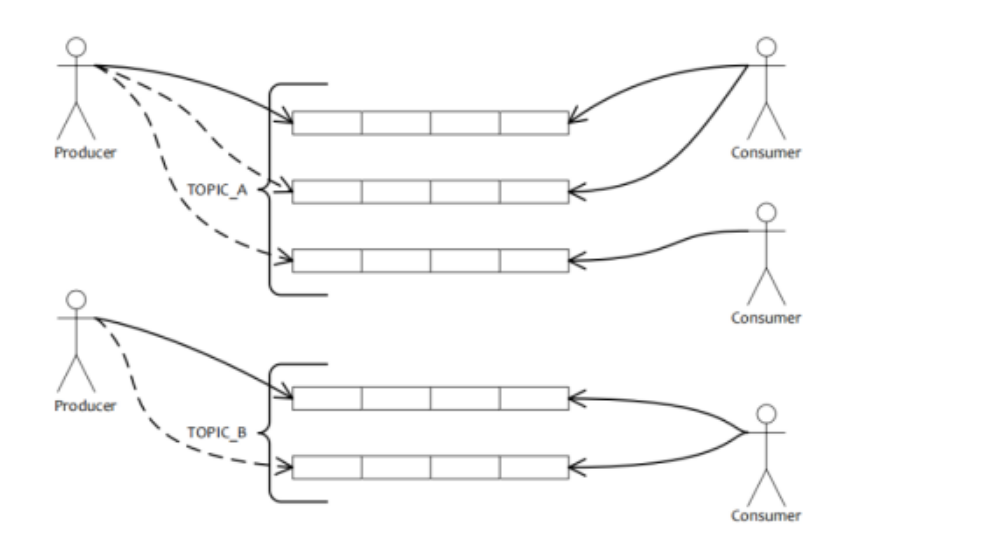
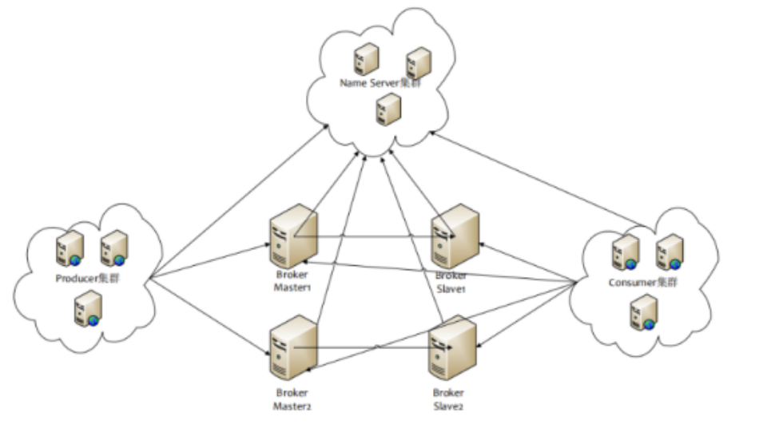
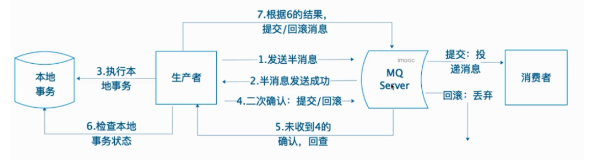

# iRocketMQ消息队列组件基础理论

## 1. RocketMQ基础理论

###  1.1 AMQP

### 1.2 JMS消息服务

**什么是JMS: ** java消息服务(Java Message Service) ,java平台中关于面向消息中间件的接口,JMS是一种与厂商无噶的API,就是一种规范(类似于jdbc的概念),**用来访问消息收发系统消息**

**jms的特点:**

- 解耦: **订单系统 >> 物流系统**
- 异步: **用户注册 >> 发送邮件，初始化信息**
- 削峰: **秒杀、日志处理**
- 夸平台丶多语言
- 分布式事务丶最终一致性
- RPC调用上下游对接点数据源变动丶通知下属

### 1.3 主流的消息中间件框架对比

1. **Appache ActiveMQ**

   Apache出品，历史悠久，支持多种语言的客户端和协议Java，NET，c++等，基于JMS Provider

   实现。吞吐量不高，多队列的时候性能下降，存在消息丢失的情况，比较少大规模使用。

2. **Kafka**

   是由Apache软件基金会开发的一个开源流处理平台，由Scala和Java编写。Kafaka是一种高吞吐量的分布式发布订阅消息系统，它可以处理大规模的网站中的所有动作流数据（网页浏览，搜索和其他用户行动），副本集机制，实现数据冗余，保持数据尽量不丢失，支持多个生产者和消费者。不支持批量和广播消息，运维难度大。

3. **RabbitMQ**

   是一个开源的AMQP实现，服务器端用Erlang语言编写，支持多种客户端。。。用于在分布式系统中存储转发消息，在易用性、扩展性、高可用性等方便表现不错。使用Erlang开发，阅读和修改源码难度大

4. **RocketMQ**

   阿里开源的消息中间件，Java开发，具有高吞吐量、高可用性、适合大规模分布式系统应用的特点，性能强劲(零拷贝技术)，支持海量堆积，支持指定次数和时间间隔的失败消息重发，支持consumer端tag过滤，延迟消息等，在阿里内部大规模使用，适合在电商、互联网金融等领域使用。因为是阿里内部从实践到产品的产物，因此里面很多接口、API并不是很普遍适用。

### 1.4 RocketMQ介绍

RocketMQ这款软件本身就是使用Java语言编写的

是一款开源的分布式消息系统，基于高可用分布式集群技术，提供低延时的、高可靠的消息发布与订阅服务。同时，广泛应用于多个领域，包括异步通信解耦、企业解决方案、金融支付、电信、电子商务、快递物流、广告营销、社交、即时通信、移动应用、手游、视频、物联网、车联网等。

**RocketMQ具有以下特点:**

1. 能够保证严格的消息顺序

2. 提供丰富的消息拉取模式

3. 高效的订阅者水平扩展能力

4. 实时的消息订阅机制

5. 亿级消息堆积能力

6. 支持分布式事务

## 2. RocketMQ核心理论

*[官方文档](https://github.com/apache/rocketmq/blob/master/docs/cn/concept.md)*

### 2.1 消息模型(Message Model)

RocketMQ主要由 **Producer、Broker、Consumer** 三部分组成，其中Producer 负责生产消息，Consumer 负责消费消息，Broker 负责存储消息。Broker 在实际部署过程中对应一台服务器，每个 Broker 可以存储多个Topic的消息，每个Topic的消息也可以分片存储于不同的 Broker。Message Queue 用于存储消息的物理地址，每个Topic中的消息地址存储于多个 Message Queue 中。ConsumerGroup 由多个Consumer 实例构成。

**消息生产者(Producer)**

负责生产消息，一般由业务系统负责生产消息。一个消息生产者会把业务应用系统里产生的消息发送到broker服务器。RocketMQ提供多种发送方式，同步发送(会等发送成功的返回信息)、异步发送(不管是否发送成功,效率更高,一般可以做日志)、顺序发送、单向发送。同步和异步方式均需要Broker返回确认信息，单向发送不需要。

**消息消费(Consumer)**

负责生产消息，一般由业务系统负责生产消息。一个消息生产者会把业务应用系统里产生的消息发送到broker服务器。RocketMQ提供多种发送方式，同步发送、异步发送、顺序发送、单向发送。同步和异步方式均需要Broker返回确认信息，单向发送不需要。

### 2.2 主题(Topic)

表示一类消息的集合，每个主题包含若干条消息，每条消息只能属于一个主题，是RocketMQ进行消息订阅的**基本单位。**

### 2.3 部署结构

**代理服务器(Broker Server)**

​    消息中转角色，负责存储消息、转发消息。代理服务器在RocketMQ系统中负责接收从生产者发送来的消息并存储、同时为消费者的拉取请求作准备。代理服务器也存储消息相关的元数据，包括消费者组、消费进度偏移和主题和队列消息等。

**名字服务(Name Server)**

​    名称服务充当路由消息的提供者。生产者或消费者能够通过名字服务查找各主题相应的Broker IP列表。多个Namesrv实例组成集群，但相互独立，没有信息交换。

### 2.4 组(Group)

**生产者组(Producer Group)**

同一类Producer的集合，这类Producer发送同一类消息且发送逻辑一致。如果发送的是事务消息且原始生产者在发送之后崩溃，则Broker服务器会联系同一生产者组的其他生产者实例以提交或回溯消费。

**消费者组(Consumer Group)**

同一类Consumer的集合，这类Consumer通常消费同一类消息且消费逻辑一致。消费者组使得在消息消费方面，实现负载均衡和容错的目标变得非常容易。要注意的是，消费者组的消费者实例必须订阅完全相同的Topic。RocketMQ 支持两种消息模式：集群消费（Clustering）和广播消费（Broadcasting）。

### 2.5 标签(Tag)

为消息设置的标志，用于同一主题下区分不同类型的消息。来自同一业务单元的消息，可以根据		不同业务目的在同一主题下设置不同标签。标签能够有效地保持代码的清晰度和连贯性，并优化		RocketMQ提供的查询系统。消费者可以根据Tag实现对不同子主题的不同消费逻辑，实现更好		的扩展性。

### 2.6 消息传播模式

**集群模式(Clustering)**

集群消费模式下,相同Consumer Group的每个Consumer实例平均分摊消息。

**广播模式(Broadcasting)**

广播消费模式下，相同Consumer Group的每个Consumer实例都接收全量的消息。

### 2.7 消息消费模式

**拉取式消费(Pull Consumer)**

 Consumer消费的一种类型，应用通常主动调用Consumer的拉消息方法从Broker服务器拉消			息、主动权由应用控制。一旦获取了批量消息，应用就会启动消费过程。

**推动式消费(Push Consumer)**

Consumer消费的一种类型，该模式下Broker收到数据后会主动推送给消费端，该消费模式	一般实时性较高。

### 2.8 消息类型

**普通消息**

​      消息系统所传输信息的物理载体，生产和消费数据的最小单位，每条消息必须属于一个主题。			RocketMQ中每个消息拥有唯一的Message ID，且可以携带具有业务标识的Key。系统提供			了通过Message ID和Key查询消息的功能。

**普通顺序消息**

​     普通顺序消费模式下，消费者通过同一个消费队列收到的消息是有顺序的，不同消息队列			 收到的消息则可能是无顺序的。

**严格顺序消息**

  严格顺序消息模式下，消费者收到的所有消息均是有顺序的。

**事务消息**

RocketMQ事务消息（Transactional Message）是指应用本地事务和发送消息操作可以被定义	到全局事务中，要么同时成功，要么同时失败。RocketMQ的事务消息提供类似 X/Open XA 	的分布事务功能，通过事务消息能达到分布式事务的最终一致。

**延时消息**

​     是指消息发送到broker后，不会立即被消费，等待特定时间投递给真正的topic。 broker有			配置项messageDelayLevel，默认值为“1s 5s 10s 30s 1m 2m 3m 4m 5m 6m 7m 8m 9m 10m 20m 			30m 1h 2h”，18个level。可以配置自定义messageDelayLevel。注意，messageDelayLevel是			broker的属性，不属于某个topic。发消息时，设置delayLevel等级即可：						msg.setDelayLevel(level)。level有以下三种情况：

- `level == 0`，消息为非延迟消息

- `1<=level<=maxLevel`，消息延迟特定时间，例如level==1，延迟1s

- `level > maxLevel`，则level== maxLevel，例如level==20，延迟2h

定时消息会暂存在名为**SCHEDULE_TOPIC_XXXX**的topic中，并根据delayTimeLevel存入	特定的queue，queueId = delayTimeLevel – 1，即一个queue只存相同延迟的消息，保证具有	相同发送延迟的消息能够顺序消费。broker会调度地消费SCHEDULE_TOPIC_XXXX，将消	息写入真实的topic。

需要注意的是，定时消息会在第一次写入和调度写入真实topic时都会计数，因此发送数量、	tps都会变高。

### 2.9 消息刷盘(持久化)

**同步刷盘**

如上图所示，只有在消息真正持久化至磁盘后RocketMQ的Broker端才会真正返回Producer	端一个成功的ACK响应。同步刷盘对MQ消息可靠性来说是一种不错的保障， 但是性能上	会有较大影响，一般适用于金融业务应用该模式较多。

**异步刷盘**

能够充分利用OS的PageCache的优势，只要消息写入PageCache即可将成功的ACK返回给	  Producer端。消息刷盘采用后台异步线程提交的方式进行，降低了读写延迟，提高了MQ的 		性能和吞吐量。

### 2.10 消息重试

Consumer消费消息失败后，要提供一种重试机制，令消息再消费一次。Consumer消费消息	失败通常可以认为有以下几种情况：

由于消息本身的原因，例如反序列化失败，消息数据本身无法处理（例如话费充值，当前消	息的手机号被注销，无法充值）等。这种错误通常需要跳过这条消息，再消费其它消息，而	这条失败的消息即使立刻重试消费，99%也不成功，所以最好提供一种定时重试机制，即过	10秒后再重试。

由于依赖的下游应用服务不可用，例如db连接不可用，外系统网络不可达等。遇到这种错	误，即使跳过当前失败的消息，消费其他消息同样也会报错。这种情况建议应用sleep 30s，	再消费下一条消息，这样可以减轻Broker重试消息的压力。

RocketMQ会为每个消费组都设置一个Topic名称为“%RETRY%+consumerGroup”的重试队列	（这里需要注意的是，这个Topic的重试队列是针对消费组，而不是针对每个Topic设置的），	用于暂时保存因为各种异常而导致Consumer端无法消费的消息。考虑到异常恢复起来需要	一些时间，会为重试队列设置多个重试级别，每个重试级别都有与之对应的重新投递延时，	重试次数越多投递延时就越大。RocketMQ对于重试消息的处理是先保存至Topic名称为	“SCHEDULE_TOPIC_XXXX”的延迟队列中，后台定时任务按照对应的时间进行Delay后重	新保存至“%RETRY%+consumerGroup”的重试队列中。

### 2.11 消息从投

生产者在发送消息时，同步消息失败会重投，异步消息有重试，oneway没有任何保证。消息	重投保证消息尽可能发送成功、不丢失，但可能会造成消息重复，消息重复在RocketMQ中	是无法避免的问题。消息重复在一般情况下不会发生，当出现消息量大、网络抖动，消息重	复就会是大概率事件。另外，生产者主动重发、consumer负载变化也会导致重复消息。如下	方法可以设置消息重试策略：

retryTimesWhenSendFailed:同步发送失败重投次数，默认为2，因此生产者会最多尝试发送	retryTimesWhenSendFailed + 1次。不会选择上次失败的broker，尝试向其他broker发送，最	大程度保证消息不丢。超过重投次数，抛出异常，由客户端保证消息不丢。当出现	RemotingException、MQClientException和部分MQBrokerException时会重投。

retryTimesWhenSendAsyncFailed:异步发送失败重试次数，异步重试不会选择其他broker，仅	在同一个broker上做重试，不保证消息不丢。

retryAnotherBrokerWhenNotStoreOK:消息刷盘（主或备）超时或slave不可用（返回状态非	SEND_OK），是否尝试发送到其他broker，默认false。十分重要消息可以开启。  

### 2.12 死信队列

死信队列用于处理无法被正常消费的消息。当一条消息初次消费失败，消息队列会自动进行		消息重试；达到最大重试次数后，若消费依然失败，则表明消费者在正常情况下无法正确地		消费该消息，此时，消息队列 不会立刻将消息丢弃，而是将其发送到该消费者对应的特殊		队列中。

RocketMQ将这种正常情况下无法被消费的消息称为死信消息（Dead-Letter Message），将存		储死信消息的特殊队列称为死信队列（Dead-Letter Queue）。在RocketMQ中，可以通过使		用console控制台对死信队列中的消息进行重发来使得消费者实例再次进行消费。

