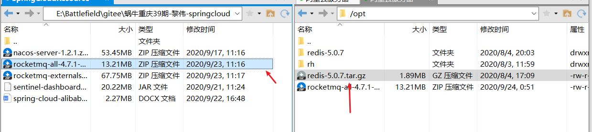
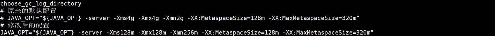
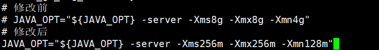
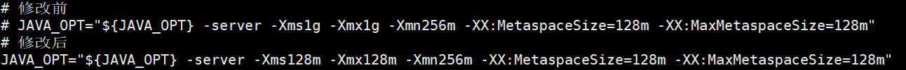

# RocketMQ安装与启动

[下载地址](https://www.apache.org/dyn/closer.cgi?path=rocketmq/4.7.1/rocketmq-all-4.7.1-bin-release.zip) *ps: 下载编译好的下来直接使用,下载的是未编译的版本的话,还要拿来自己编译,比较麻烦*


## linux安装RocketMQ

### 1.1 上传解压到服务器上



```shell
[root@iZwz964jzdqku9gecmp58bZ ~]# cd /
[root@iZwz964jzdqku9gecmp58bZ /]# cd opt
[root@iZwz964jzdqku9gecmp58bZ opt]# ls
redis-5.0.7  redis-5.0.7.tar.gz  rh  rocketmq-all-4.7.1-bin-release.zip
# 解压
[root@iZwz964jzdqku9gecmp58bZ opt]# unzip rocketmq-all-4.7.1-bin-release.zip
[root@iZwz964jzdqku9gecmp58bZ opt]# cd rocketmq-all-4.7.1-bin-release
[root@iZwz964jzdqku9gecmp58bZ rocketmq-all-4.7.1-bin-release]# ls
benchmark  bin  conf  lib  LICENSE  NOTICE  README.md
[root@iZwz964jzdqku9gecmp58bZ rocketmq-all-4.7.1-bin-release]# cd bin
# 可以看到这里有启动命令了,但是千万不要急着启动
[root@iZwz964jzdqku9gecmp58bZ bin]# ls
cachedog.sh       mqadmin       mqbroker.numanode0  mqnamesrv       os.sh      runbroker.cmd  setcache.sh
cleancache.sh     mqadmin.cmd   mqbroker.numanode1  mqnamesrv.cmd   play.cmd   runbroker.sh   startfsrv.sh
cleancache.v1.sh  mqbroker      mqbroker.numanode2  mqshutdown      play.sh    runserver.cmd  tools.cmd
dledger           mqbroker.cmd  mqbroker.numanode3  mqshutdown.cmd  README.md  runserver.sh   tools.sh
[root@iZwz964jzdqku9gecmp58bZ bin]# 
```

ps: *安装完成!*

### 1.2 设置Rocket的内存 

由于Rocket启动占用运存比较大,在启动Rocket之前需要根据机器内存情况设置运行内存,否则服务器容易崩盘

需要修改`rnserver.sh` 和 `runbroker.sh`和`tools.sh`的内存

```shell
# 进入到runserver.sh中修改内存
[root@iZwz964jzdqku9gecmp58bZ bin]# vi runserver.sh
```



```shell
# 进入到runbroker.sh中修改内存
[root@iZwz964jzdqku9gecmp58bZ bin]# vi runbroker.sh
```



```shell
# 修改tools.sh的内存
[root@iZwz964jzdqku9gecmp58bZ bin]# vi tools.sh
```



### 1.3 启动NameServer

nohup sh bin/mqnamesrv &

查看启动日志

tail -f ~/logs/rocketmqlogs/namesrv.log

### 1.4 启动brokerServer

查看启动日志

  nohup sh bin/mqbroker -n localhost:9876 &

   查看启动日志

   tail -f ~/logs/rocketmqlogs/broker.log

### 1.5 关闭服务

   sh bin/mqshutdown broker

   sh bin/mqshutdown namesrv

要想完全清空数据，删除文件夹~/store，然后重启


## 2 . 控制台安装

### 2.1 下载

git clone https://github.com/apache/rocketmq-externals.git

### 2.2 修改配置

找到rocketmq-console/src/main/resources/application.properties 根据需求，修改配置

```
 server.port=8081

# name server地址

# 也可以不修改，在启动完console后，在控制台导航栏 - 运维 - NameSvrAddrList一栏设置
 rocketmq.config.namesrvAddr=localhost:8719
```

###    2.3 修改 pom.xml ，修改RocketMQ相关依赖的版本

```
<rocketmq.version>4.7.1</rocketmq.version>
```

### 2.4 切换到控制台目录 cd rocketmq-console

```
  mvn clean package -DskipTests
```

  


