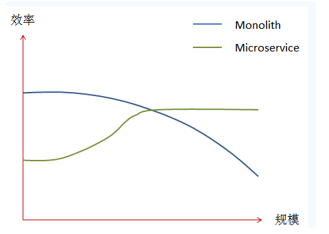

# 微服务及springcloud

## 1. 单体应用架构(Monolith)

将所有的代码及功能都包含在一个WAR包中的项目组织方式被称为Monolith架构;就是一个完整的不可分割的项目

### 1.1 单体应用架构的优点和缺点

**优点**: 如果是小项目,采用Monolith架构得项目构建灵活,小巧

**缺点**: 如果是大项目,采用Monolith架构项目会有如下缺点

- **编译困难,部署困难,测试困难**

  代码量变多，即使更改一行代码，也需花大量时间编译，部署前要编译打包，解压等所以部署难，部署完了还要测试所以测试难

- **技术选择难**

  在变得越来越大的同时，我们的应用所使用的技术也会变得越来越多。这些技术有些是不兼容的，就比如在一个项目中大范围地混合使用C++和Java几乎是不可能的事情。在这种情况下，我们就需要抛弃对某些不兼容技术的使用，而选择一种不是那么适合的技术来实现特定的功能。

- **扩展难**

  网站上线后无法分批次的对网站的功能进行扩充

- **负载均衡**

  单体应用中多个模块的负载不均衡,我们扩容高负载的时候,也把低负载的模块也扩容,极大浪费了资源.

## 2. 微服务架构(MicroServic)

微服务:对一个大服务的拆分;每个服务运行在其**独立**的进程中;服务于服务之间直接相互交互;独立地部署;各自服务的技术选择很自由.

将大项目分割成一个一个的小项目,小项目与小项目之间是通过通信的方式进行联系起来的;常见的通信机制有(Restful和消息队列)

### 2.1 微服务架构的优点 

- **复杂度可控：**

  在将应用分解的同时，规避了原本复杂度无止境的积累。每一个微服务专注于单一功能，并通过定义良好的接口清晰表述服务边界。由于体积小、复杂	度低，每个微服务可由一个小规模开发团队完全掌控，易于保持高可维护性和开	发效率。

- **独立部署：**

  由于微服务具备独立的运行进程，所以每个微服务也可以独立部署。当某个微服务发生变更时无需编译、部署整个应用。由微服务组成的应用相当于具备一系列可并行的发布流程，使得发布更加高效，同时降低对生产环境所造成的风险，最终缩短应用交付周期。

- **技术选型灵活：**

  微服务架构下，技术选型是去中心化的。每个团队可以根据自身服务的需求和行业发展的现状，自由选择最适合的技术栈。由于每个微服务相对简单，故需要对技术栈进行升级时所面临的风险就较低，甚至完全重构一个微服务也是可行的。

- **容错：**

  当某一组件发生故障时，在单一进程的传统架构下，故障很有可能在进程内扩散，形成应用全局性的不可用。在微服务架构下，故障会被隔离在单个服务中。若设计良好，其他服务可通过重试、平稳退化等机制实现应用层面的容错。

- **扩展性：**

  单块架构应用也可以实现横向扩展，就是将整个应用完整的复制到不同的节点。当应用的不同组件在扩展需求上存在差异时，微服务架构便体现出其灵活性，因为每个服务可以根据实际需求独立进行扩展。

## 3. 项目架构选择

在项目架构的时候如何选择是微服务架构还是单体应用架构

- 如果项目小,不会常发生变更,功能稳定通常使用单体应用

- 如果项目大,而且会常发生变更,功能随时扩展就可以考虑使用微服务架构开发项目

- 从这个图可以看出: 单体项目随着规模的变大效率是变小的;微服务随着项目的规模变大效率是不断增大的

## 4. 搭建微服务架构

如果单纯的使用手工搭建微服务项目是十分困难的,市面上出现了很多的框架

市面上有很多框架是用于搭建微服务的,微服务框架的作用是对拆分的项目进行管理,例如spring-cloud工具包(工具箱)

---

## 5. spring-cloud

官方文档: https://spring.io/projects/spring-cloud/

Spring cloud是一个基于Spring Boot实现的**服务治理工具包**，在微服务架构中用于管理和协调服务的。

Spring Cloud是一系列框架的有序集合。它利用Spring Boot的开发便利性巧妙地简化了分布式系统基础设施的开发，如服务发现注册、配置中心、消息总线、负载均衡、断路器、数据监控等，都可以用Spring Boot的开发风格做到一键启动和部署。Spring并没有重复制造轮子，它只是将目前各家公司开发的比较成熟、经得起实际考验的服务框架组合起来，通过Spring Boot风格进行再封装屏蔽掉了复杂的配置和实现原理，最终给开发者留出了一套简单易懂、易部署和易维护的分布式系统开发**工具包**。

---

## 6. spring-cloud-aibaba

官方文档: https://github.com/alibaba/spring-cloud-alibaba/blob/master/README-zh.md

Spring Cloud Alibaba 致力于提供微服务开发的一站式解决方案。此项目包含开发分布式应用微服务的必需组件，方便开发者通过Spring Cloud 编程模型轻松使用这些组件来开发分布式应用服务。

---

### 6.1 主要功能

**服务限流降级**：默认支持 WebServlet、WebFlux, OpenFeign、RestTemplate、Spring Cloud Gateway, Zuul, Dubbo 和 RocketMQ 限流降级功能的接入，可以在运行时通过控制台实时修改限流降级规则，还支持查看限流降级 Metrics 监控。

**服务注册与发现**：适配 Spring Cloud 服务注册与发现标准，默认集成了 Ribbon 的支持。

**分布式配置管理**：支持分布式系统中的外部化配置，配置更改时自动刷新。

**消息驱动能力**：基于 Spring Cloud Stream 为微服务应用构建消息驱动能力。

**分布式事务**：使用 @GlobalTransactional 注解， 高效并且对业务零侵入地解决分布式事务问题。。

**阿里云对象存储**：阿里云提供的海量、安全、低成本、高可靠的云存储服务。支持在任何应用、任何时间、任何地点存储和访问任意类型的数据。

**分布式任务调度**：提供秒级、精准、高可靠、高可用的定时（基于 Cron 表达式）任务调度服务。同时提供分布式的任务执行模型，如网格任务。网格任务支持海量子任务均匀分配到所有 Worker（schedulerx-client）上执行。

**阿里云短信服务**：覆盖全球的短信服务，友好、高效、智能的互联化通讯能力，帮助企业迅速搭建客户触达通道。

### 6.2 常用组件

- **Sentinel**：把流量作为切入点，从流量控制、熔断降级、系统负载保护等多个维度保护服务的稳定性。

- **Nacos**：一个更易于构建云原生应用的动态服务发现、配置管理和服务管理平台。

- **RocketMQ**：一款开源的分布式消息系统，基于高可用分布式集群技术，提供低延时的、高可靠的消息发布与订阅服务。

- **Dubbo**：Apache Dubbo™ 是一款高性能 Java RPC 框架。

- **Seata**：阿里巴巴开源产品，一个易于使用的高性能微服务分布式事务解决方案。

- **Alibaba Cloud ACM**：一款在分布式架构环境中对应用配置进行集中管理和推送的应用配置中心产品。

- **Alibaba Cloud OSS**: 阿里云对象存储服务（Object Storage Service，简称 OSS），是阿里云提供的海量、安全、低成本、高可靠的云存储服务。您可以在任何应用、任何时间、任何地点存储和访问任意类型的数据。

- **Alibaba Cloud SchedulerX**: 阿里中间件团队开发的一款分布式任务调度产品，提供秒级、精准、高可靠、高可用的定时（基于 Cron 表达式）任务调度服务。

- **Alibaba Cloud SMS**: 覆盖全球的短信服务，友好、高效、智能的互联化通讯能力，帮助企业迅速搭建客户触达通道。

### 6.3  将学习的组件

主要以SpringCloud-alibaba为基准进行学习,还会穿插一些其他的组件

| 阿里巴巴                                          | 非阿里巴巴        |
| ------------------------------------------------- | ----------------- |
| Nacos(discovery config) 服务发现注册  -- 配置中心 | Ribbon (负载均衡) |
| Sentinel (流控)                                   | Fegin             |
| RockMq (消息队列)                                 | Gateway (网关)    |

