# 父子工程的搭建

> 说明: 在企业开发中,实际上的项目好多都是父子工程,首先创建一个整体的父工程,父工程下面创建不同的子工程,方便模块的扩展开发 . 本篇文章是记录idea中如何去构建父子工程的; maven+springboot

## 创建父工程: springboot-parent-project

首先通过idea创建一个名为` springboot-parent-project`的springboot父项目

创建springboot项目

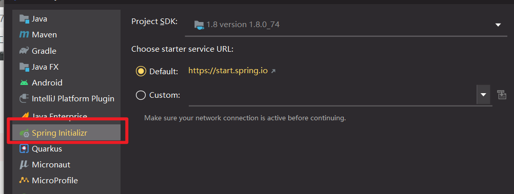

规定父项目名称和一些环境,以及包名

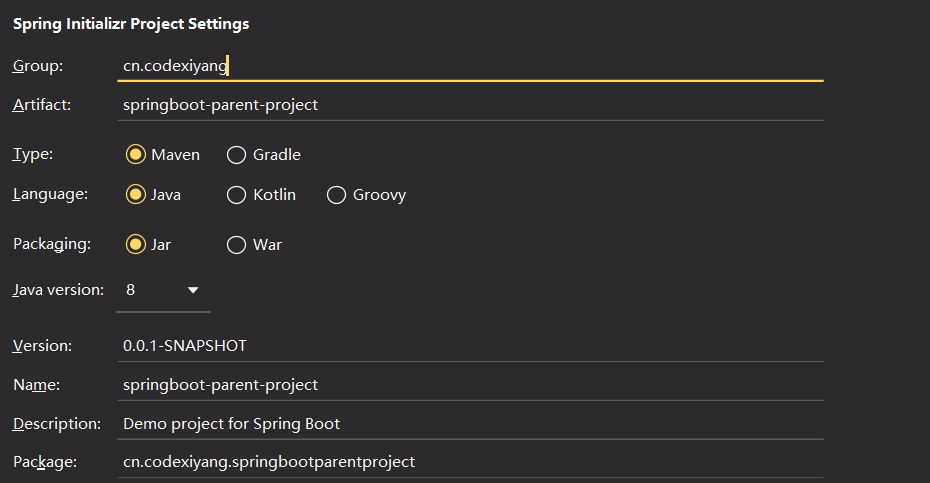

使用springboot-web的依赖

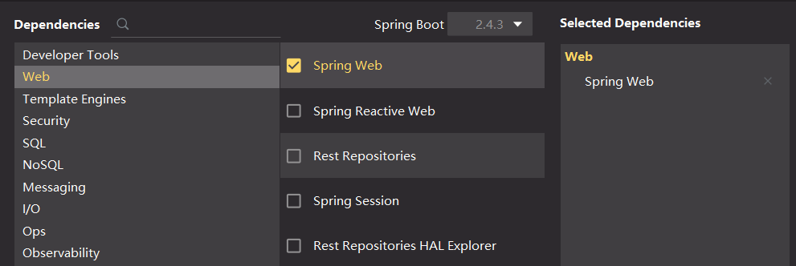

我项目的存放路径

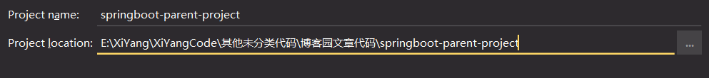

此时的项目结构如下:

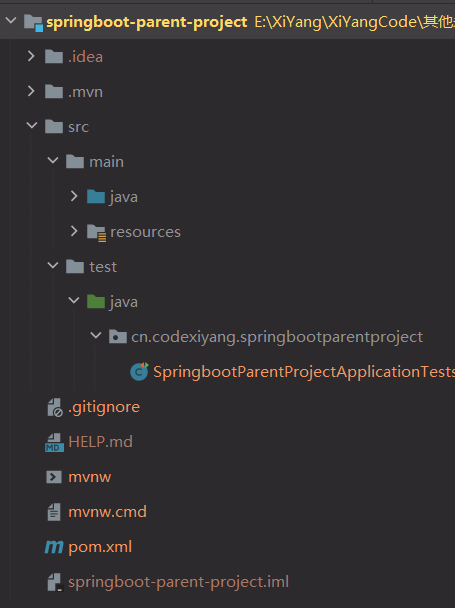

**特别注意:**  这个父工程我们是不会拿来写业务的,一般都是用来做一些版本管理, 真正的业务实际上是写在子模块中的

```
下面展示哪些需要被删除
springboot-parent-project
|--.idea
|--.mvn
|--src //删除
|--.gitigonre
|--HELP.md //删除
|--mvnw //删除
|--mvnw.cmd //删除
|--pmx.xml
|--springboot-parent-project.iml
```


## 创建子工程

这里我们在父工程下创建两个子工程 `springboot-son1-project` 和 `springboot-son2-project`;具体创建方式如下

### 子工程springboot-son1-project

右键之前创建的父工程创建一个model

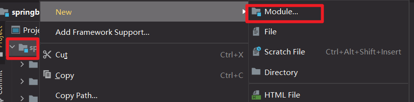

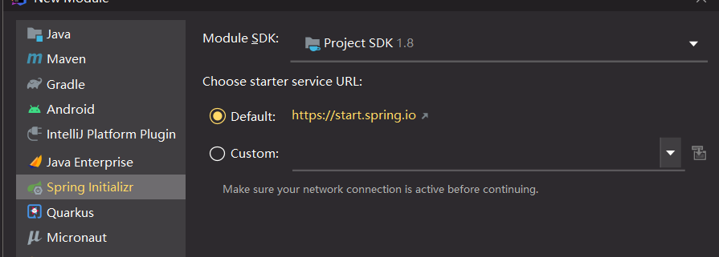

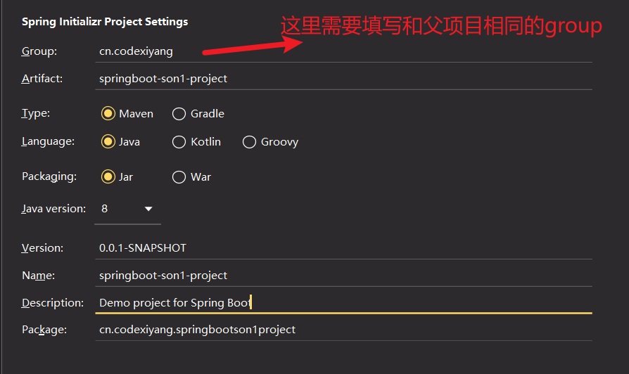

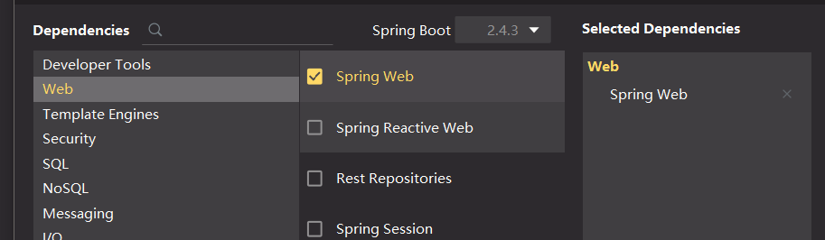


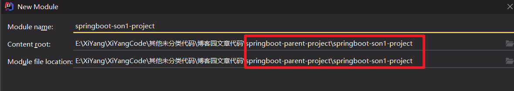

项目结构如下

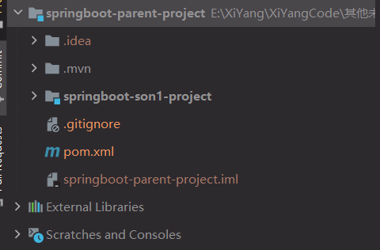


### 子工程springboot-son2-project

操作方式和创建springboot-son1-project完全一样

整个项目结构如下:

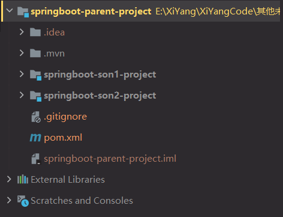

删除一些子工程中不需要的一些文件

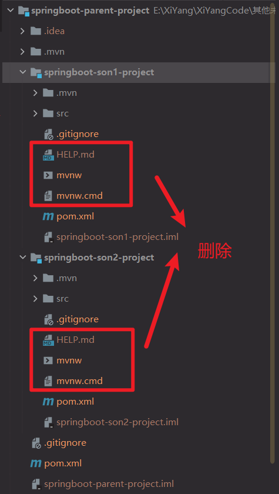

删除完成后的项目如下

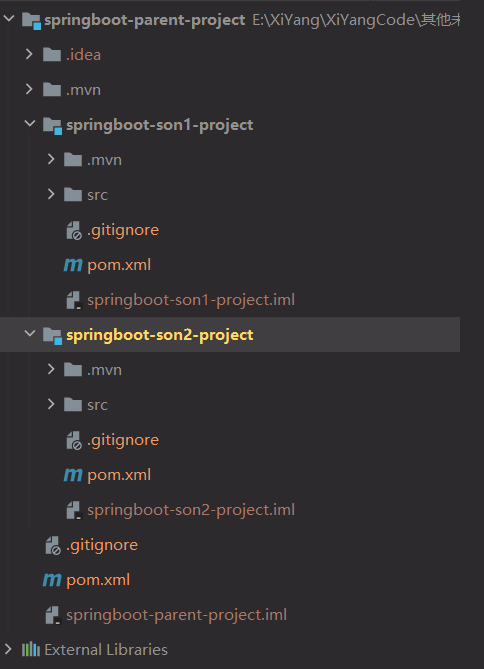

## 父项目与子项目构建关系

### 父项目的`pom.xml`设置

3步搞定副项目的pom.XML文件设置

父项目的`pom.xml`文件需要添加modules标间来关联子项目

- 父项目是使用的springboot2.2.5版本所以父项目的父依赖是springboot

  ```xml
      <!--第一步: springboot-parent-project的父项目是springboot-->
      <parent>
          <groupId>org.springframework.boot</groupId>
          <artifactId>spring-boot-starter-parent</artifactId>
          <version>2.2.5.RELEASE</version>
          <relativePath/> <!-- lookup parent from repository -->
      </parent>
  ```

- 父项目关联的两个子项目通过``<modules></modules>`

  ```xml
      <!--第二部: 关联子项目-->
      <modules>
          <module>springboot-son1-project</module>
          <module>springboot-son2-project</module>
      </modules>
  ```

- 父工程的包设置通过` <packaging></packaging> `指定

  ```xml
      <!--第三步: 父工程的包设置 注意: 子工程这里需要设置成jar-->
      <packaging>pom</packaging> 
  ```


### 子项目的`pom.xml`设置

我们以**springboot-son1-project**为例

4步搞定子项目的pom.xml配置

- 现在我们子项目是直接使用的springboot项目 ,但是我的目的是直接使用父项目,因为父项目是使用的springboot,所以我这里只要规定这个项目的父工程是springboot-parent-project就表示我子项目也可以使用springboot了

  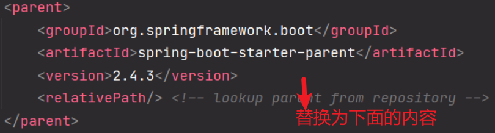

  子项目的parent设置为父项目的坐标信息

  ```xml
      <!--第一步: 不再直接使用springboot起步依赖，而是引用父工程的起步依赖（springboot起步依赖）-->
      <parent>
          <groupId>cn.codexiyang</groupId>
          <artifactId>springboot-parent-project</artifactId>
          <version>0.0.1-SNAPSHOT</version>
      </parent>
  ```

- 子模块的打包方式jar

  ```xml
      <!--第二步: 设置子模块包,否则打包会出问题-->
      <packaging>jar</packaging>
  ```

- 删除子模块的groupid,因为这里使用的是父模块的,gruouid具备传递性

  ```xml
      <!--第三步: 删除子模块的groupid,因为这里使用的是父模块的,gruouid具备传递性-->
      <!--<groupId>cn.codexiyang</groupId>-->
      <artifactId>springboot-son1-project</artifactId>
      <version>0.0.1-SNAPSHOT</version>
      <name>springboot-son1-project</name>
      <description>子项目 springboot-son1-project</description>
  ```

- 删除掉dependencies中的依赖;因为通用的依赖会在父工程中设置,这里面一般添加子工程会用到的独有的依赖

  ```xml
      <dependencies>
          <!--第4步: 使用子工程独有的依赖-->
          <!--<dependency>
              <groupId>org.springframework.boot</groupId>
              <artifactId>spring-boot-starter-web</artifactId>
          </dependency>
  
          <dependency>
              <groupId>org.springframework.boot</groupId>
              <artifactId>spring-boot-starter-test</artifactId>
              <scope>test</scope>
          </dependency>-->
      </dependencies>
  ```


### 三个项目的`pom.xml`配置如下

#### springboot-parent-project

```xml
<?xml version="1.0" encoding="UTF-8"?>
<project xmlns="http://maven.apache.org/POM/4.0.0" xmlns:xsi="http://www.w3.org/2001/XMLSchema-instance"
         xsi:schemaLocation="http://maven.apache.org/POM/4.0.0 https://maven.apache.org/xsd/maven-4.0.0.xsd">
    <modelVersion>4.0.0</modelVersion>

    <!--springboot-parent-project的父项目是springboot-->
    <parent>
        <groupId>org.springframework.boot</groupId>
        <artifactId>spring-boot-starter-parent</artifactId>
        <version>2.2.5.RELEASE</version>
        <relativePath/> <!-- lookup parent from repository -->
    </parent>

    <!--关联子项目-->
    <modules>
        <module>springboot-son1-project</module>
        <module>springboot-son2-project</module>
    </modules>

    <!--父工程的包设置-->
    <packaging>pom</packaging>


    <!--springboot-parent-project的坐标信息-->
    <groupId>cn.codexiyang</groupId>
    <artifactId>springboot-parent-project</artifactId>
    <version>0.0.1-SNAPSHOT</version>
    <name>springboot-parent-project</name>
    <description>父项目springboot-parent-project</description>


    <properties>
        <java.version>1.8</java.version>
    </properties>


    <!--依赖-->
    <dependencies>
        <dependency>
            <groupId>org.springframework.boot</groupId>
            <artifactId>spring-boot-starter-web</artifactId>
        </dependency>

        <dependency>
            <groupId>org.springframework.boot</groupId>
            <artifactId>spring-boot-starter-test</artifactId>
            <scope>test</scope>
        </dependency>
    </dependencies>

    <build>
        <plugins>
            <plugin>
                <groupId>org.springframework.boot</groupId>
                <artifactId>spring-boot-maven-plugin</artifactId>
            </plugin>
        </plugins>
    </build>

</project>

```


### springboot-son1-project

```xml
<?xml version="1.0" encoding="UTF-8"?>
<project xmlns="http://maven.apache.org/POM/4.0.0" xmlns:xsi="http://www.w3.org/2001/XMLSchema-instance"
         xsi:schemaLocation="http://maven.apache.org/POM/4.0.0 https://maven.apache.org/xsd/maven-4.0.0.xsd">
    <modelVersion>4.0.0</modelVersion>

    <!--不再直接使用springboot起步依赖，而是引用父工程的起步依赖（springboot起步依赖）-->
    <parent>
        <groupId>cn.codexiyang</groupId>
        <artifactId>springboot-parent-project</artifactId>
        <version>0.0.1-SNAPSHOT</version>
    </parent>

    <!--设置子模块包,否则打包会出问题-->
    <packaging>jar</packaging>


    <!--删除子模块的groupid,因为这里使用的是父模块的,gruouid具备传递性-->
    <!--<groupId>cn.codexiyang</groupId>-->
    <artifactId>springboot-son1-project</artifactId>
    <version>0.0.1-SNAPSHOT</version>
    <name>springboot-son1-project</name>
    <description>子项目 springboot-son1-project</description>


    <properties>
        <java.version>1.8</java.version>
    </properties>
    <dependencies>
        <!--使用子工程独有的依赖-->
        <!--<dependency>
            <groupId>org.springframework.boot</groupId>
            <artifactId>spring-boot-starter-web</artifactId>
        </dependency>

        <dependency>
            <groupId>org.springframework.boot</groupId>
            <artifactId>spring-boot-starter-test</artifactId>
            <scope>test</scope>
        </dependency>-->
    </dependencies>

    <build>
        <plugins>
            <plugin>
                <groupId>org.springframework.boot</groupId>
                <artifactId>spring-boot-maven-plugin</artifactId>
            </plugin>
        </plugins>
    </build>

</project>

```


### springboot-son2-project

```xml
<?xml version="1.0" encoding="UTF-8"?>
<project xmlns="http://maven.apache.org/POM/4.0.0" xmlns:xsi="http://www.w3.org/2001/XMLSchema-instance"
         xsi:schemaLocation="http://maven.apache.org/POM/4.0.0 https://maven.apache.org/xsd/maven-4.0.0.xsd">
    <modelVersion>4.0.0</modelVersion>

    <!--使用父工程-->
    <parent>
        <!--<groupId>org.springframework.boot</groupId>
        <artifactId>spring-boot-starter-parent</artifactId>
        <version>2.4.3</version>
        <relativePath/> &lt;!&ndash; lookup parent from repository &ndash;&gt;-->
        <groupId>cn.codexiyang</groupId>
        <artifactId>springboot-parent-project</artifactId>
        <version>0.0.1-SNAPSHOT</version>
    </parent>

    <!--设置打包方式-->
    <packaging>jar</packaging>

    <!--删除groupid-->
    <!--<groupId>cn.codexiyang</groupId>-->
    <!--子工程的坐标信息-->
    <artifactId>springboot-son2-project</artifactId>
    <version>0.0.1-SNAPSHOT</version>
    <name>springboot-son2-project</name>
    <description>Demo project for Spring Boot</description>

    <properties>
        <java.version>1.8</java.version>
    </properties>


    <dependencies>

        <!--只使用子工程中需要(特定)的依赖-->
        <!--<dependency>
            <groupId>org.springframework.boot</groupId>
            <artifactId>spring-boot-starter-web</artifactId>
        </dependency>

        <dependency>
            <groupId>org.springframework.boot</groupId>
            <artifactId>spring-boot-starter-test</artifactId>
            <scope>test</scope>
        </dependency>-->
    </dependencies>

    <build>
        <plugins>
            <plugin>
                <groupId>org.springframework.boot</groupId>
                <artifactId>spring-boot-maven-plugin</artifactId>
            </plugin>
        </plugins>
    </build>

</project>

```


### 测试父子工程是否可正常使用

通过观察,两个子项目是没有springboot-web包的,但是我们的父项目是提供了的,如果我们写的接口可以正常访问,就表示我们的工程是创建成功了的

为了方便观察实验,我们将两个项目设置不同的端口测试访问

#### 端口设置

springboot-son1-project的端口设置

```yaml
server:
  port: 8081
```

springboot-son2-project的端口设置

```yaml
server:
  port: 8082
```

#### 接口编写

springboot-son1-project的接口

```java
@RestController
public class Son1ProjectController {
    @RequestMapping("/son1")
    public String son1(){
        return "子项目son1";
    }
}
```

springboot-son2-project的接口

```java
@RestController
public class Son2ProjectController {
    @RequestMapping("/son2")
    public String son2(){
        return "子项目son2";
    }
}
```

#### 访问测试

编写完接口后,同时运行两个项目,通过浏览器地址访问,查看结果

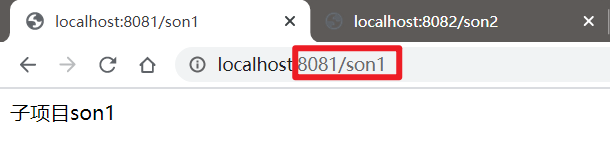

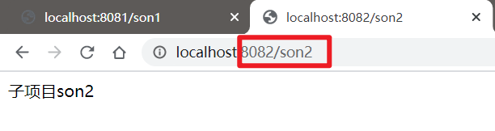


## 后续....

```

1. ${}的使用?
2. 子模块相互调用?

```


