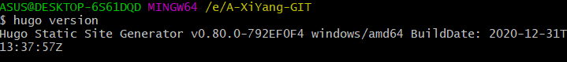

hugo搭建个人博客


mac用户下载braw工具

windows用户下载release: https://github.com/gohugoio/hugo/releases


教程: https://www.cnblogs.com/ifme/p/11934711.html

https://blog.csdn.net/weixin_33816047/article/details/112363465

https://blog.csdn.net/kikajack/article/details/80413052

https://blog.csdn.net/qq_30682027/article/details/83536577

https://dp2px.com/2019/08/30/go-hugo1/


## 1. 安装hugo

说明: win10 64位操作系统

下载exe执行文件

配置环境变量

查看是否安装好

```shell
# 查看hugo的版本
hugo version
```



## 2. 用hugo生成博客

生成hubo站点博客

```shell
# XiYangBlog就是站点博客的名字,也叫站点根目录
hugo new site XiYangBlog
```


## 3. 下载并设置主题

官方主题列表 :  https://themes.gohugo.io/

*本文以 [m10c](https://themes.gohugo.io/hugo-theme-m10c/) 主题为例子*


1. 使用git下载m10c主题

   ```shell
   git clone https://github.com/vaga/hugo-theme-m10c.git themes/m10c
   ```

   注意: 需要切换到站点根目录下的themes目录下下载,因为站点目录下的themes目录就是专门用于存放主题的

   执行成功如下图:

   

2. 本地启动博客

   ```shell
   hugo server -t m10c --buildDrafts
   ```

   ```
   通过命令行的方式使用主题：hugo -t 主题目录名
   通过在 config.toml 配置使用：theme = "主题目录名"
   ```

   

   启动成功后访问: `http://localhost:1313/`就可以看到博客了

   注意: 需要回到站点根目录下进行启动!

   


## 4. 在本地启动个人博客


## 5. 实际编写一篇文章


## 6. 将个人博客部署到远端服务器