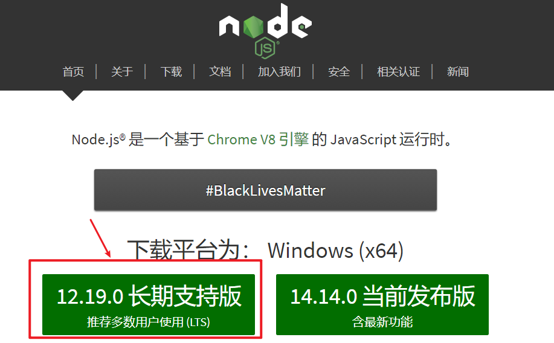
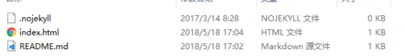

# Docsify文档框架


## 1. Docsify简介和安装

### 1.1 简介

`docsify`是由现饿了么前端团队@elemeFE的cinwell.li编写的一套文档站点生成框架，github上已有3k+ star,Docsify 是一个动态生成文档网站的工具。不同于 GitBook、Hexo 的地方是它不会生成将 .md 转成 .html 文件，所有转换工作都是在运行时进行。


### 1.2 特性

- 无需构建，写完文档直接发布

- 容易使用并且轻量 (~19kB gzipped)

- 智能的全文搜索(`搜索插件`)

- 提供多套主题

- 丰富的 API(`各种插件`)

- 支持 Emoji(`emoji表情大全`)

- 兼容 IE10+

- 支持 SSR (**example**) 


### 1.3 安装

#### 1.3.1 安装node.js



#### 1.3.2 npm安装doscify框架

推荐全局安装 `docsify-cli` 工具，可以方便地创建及在本地预览生成的文档。

```bash
npm i docsify-cli -g
```


### 1.4 样板

*其他人基于docsify框架记录笔记的样板*

https://veal98.gitee.io/cs-wiki/#/


## 2. Docsify基本操作


### 2.1 初始化Doscify

进入当前文件夹夹执行`doscify init`进行项目初始化




### 2.2 启动Doscify

启动doscify服务`doscify serve`


### 2.3 Doscify基本配置


#### 2.3.1 加载中

在文件数量过大时,想包含一个提示加载中可以在div里面编写,div的id需要通过`el`挂载到script标签里面

```html
<body>
  <div id="xiyang">
    当前正在加载中...
  </div>
  <script>
    window.$docsify = {
      el:"#xiyang",
      name: '',
      repo: ''
    }
  </script>
  <script src="//cdn.jsdelivr.net/npm/docsify/lib/docsify.min.js"></script>
</body>
```

#### 2.3.2 多页文档

当访问子文件夹的时候默认是访问该文件下的`README.md`文件


#### 2.3.3 定制侧边栏

开启`loadSidebar: true`

```html
  <script>
    window.$docsify = {
      el:"#xiyang",
      loadSidebar: true, /*开启侧边栏定制*/
      name: '',
      repo: '',
    }
  </script>
```

在当前文件夹里面创建一个文件`_sidebar.md`并写上如下内容

```markdown
* [遇见狂神说java系列学习](狂神说系列笔记/)

* [Redis5.0.8](【狂神说Java】Redis最新超详细版教程通俗易懂/)
```

*ps: 当定制侧边栏后,无法显示文章的标题侧边栏目,不推荐*


#### 2.3.4 显示文章标题

开启`subMaxLevel: 6`

```html
  <script>
    window.$docsify = {
      el:"#xiyang",
      loadSidebar: true, /*开启侧边栏定制*/
      subMaxLevel: 6, /*自定义侧边栏后默认不会再生成目录，你也可以通过设置生成目录的最大层级开启这个功能。*/
      name: '',
      repo: '',
    }
  </script>
```


#### 2.3.5 文档封面

首先需要先开启封面主题

```html
  <script>
    window.$docsify = {
      el:"#xiyang",
      loadSidebar: true, /*开启侧边栏定制*/
      subMaxLevel: 6, /*自定义侧边栏后默认不会再生成目录，你也可以通过设置生成目录的最大层级开启这个功能。*/
      coverpage: true, //启用封面页。开启后是加载 _coverpage.md 文件，也可以自定义文件名。
      name: '',
      repo: '',
    }
  </script>
```

然后在当前目录下创建一个文件`_coverpage.md` 编写以下内容;注意带`<>`是实心按钮,不带的是空心按钮

```markdown
# 遇见狂神说学习笔记

- 本文档是根据B站UP主 "遇见狂神说Java" 上传的java视频学习所做的笔记

[](https://github.com/Q-Angelo/Nodejs-Roadmap) [![forks] (https://badgen.net/github/forks/Q-Angelo/Nodejs-Roadmap?icon=github&color=4ab8a1)] (https://github.com/Q-Angelo/Nodejs-Roadmap)

[Github](地址) [xiyang](地址) [开始阅读](地址)
```

#### 2.3.6 文档主题

doscify默认提供的是vue样式的主题,可以在index.html进行引入切换

```html
<head>
  <meta charset="UTF-8">
  <title>Document</title>
  <meta http-equiv="X-UA-Compatible" content="IE=edge,chrome=1" />
  <meta name="description" content="Description">
  <meta name="viewport" content="width=device-width, user-scalable=no, initial-scale=1.0, maximum-scale=1.0, minimum-scale=1.0">
<!--  <link rel="stylesheet" href="//cdn.jsdelivr.net/npm/docsify/lib/themes/vue.css">--> <!--默认主题-->
  <link rel="stylesheet" href="//cdn.jsdelivr.net/npm/docsify/themes/dolphin.css"> <!--切换为其他主题-->
</head>
```

常用的几种主题如下:

```html
<link rel="stylesheet" href="//cdn.jsdelivr.net/npm/docsify/themes/vue.css">
<link rel="stylesheet" href="//cdn.jsdelivr.net/npm/docsify/themes/buble.css">
<link rel="stylesheet" href="//cdn.jsdelivr.net/npm/docsify/themes/dark.css">
<link rel="stylesheet" href="//cdn.jsdelivr.net/npm/docsify/themes/pure.css">
<link rel="stylesheet" href="//cdn.jsdelivr.net/npm/docsify/themes/dolphin.css">
```


####  2.3.7 搜索插件

index.html中的插件配置

```html
  <script>
    window.$docsify = {
      el:"#xiyang",
      loadSidebar: true, /*开启侧边栏定制*/
      subMaxLevel: 6, /*自定义侧边栏后默认不会再生成目录，你也可以通过设置生成目录的最大层级开启这个功能。*/
      coverpage: true, //启用封面页。开启后是加载 _coverpage.md 文件，也可以自定义文件名。
      name: '',
      repo: '',
      //搜索
      search: {
        maxAge: 86400000,//过期时间,单位毫秒,默认一天
        noData: "居然找不到搜索结果",//搜索不到结果时显示
        paths: "auto",//自动
        placeholder: "请搜索",//搜索框提示
      }
    }
  </script>
  <script src="//cdn.jsdelivr.net/npm/docsify/lib/docsify.min.js"></script>
  <!--搜索插件-->
  <script src="//cdn.jsdelivr.net/npm/docsify/lib/plugins/search.min.js"></script>
```

#### 2.3.8 拷贝插件

添加下面的内容到index.html即可使用代码拷贝

```html
<script src="//unpkg.com/docsify-copy-code"></script>
```


### 2.4 更多学习

查看官网: https://docsify.js.org/#/zh-cn/

Guide哥: https://blog.csdn.net/qq_34337272/article/details/105511189

## 参考

> 视频地址: https://www.bilibili.com/video/BV1jD4y1d7uF?from=search&seid=15932470396305688800
>
> 