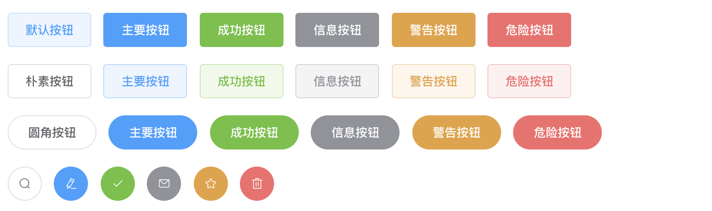
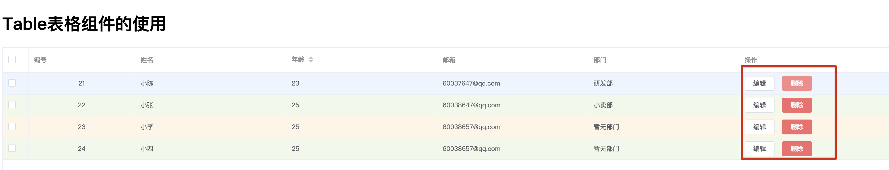
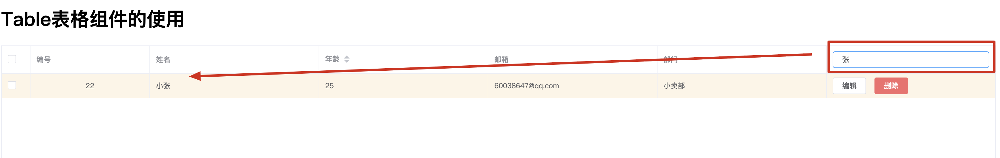

# Element UI 实战教程

> 视频: https://www.bilibili.com/video/BV1NK4y187XH
>
> - 适合后端编程人员的 ElementUI教程,结合SpringBoot项目案例

## 1.Element UI 引言 🚩

官网: https://element.eleme.io/#/zh-CN

### 1.1 官方定义

`网站快速成型工具` 和 `桌面端组件库`

### 1.2 定义

element ui 就是基于vue的一个ui框架,该框架基于vue开发了很多相关组件,方便我们快速开发页面。

### 1.3 由来

饿了么前端团队 基于vue进行开发并且进行了开源 element ui 中提供全部都是封装好组件。

---

## 2.安装Element UI

### 2.1通过vue脚手架创建项目

```js
vue init webpack element(项目名)
```

### 2.2在vue脚手架项目中安装elementui

```markdown
# 1.下载elementui的依赖
	npm i element-ui -S

# 2.指定当前项目中使用elementui
	import ElementUI from 'element-ui';
	import 'element-ui/lib/theme-chalk/index.css';

  //在vue脚手架中使用elementui
	Vue.use(ElementUI);
```

----

## 3.按钮组件(示例)



#### 3.1 默认样式按钮

```html
<el-row>
  <el-button>默认按钮</el-button>
  <el-button type="primary">主要按钮</el-button>
  <el-button type="success">成功按钮</el-button>
  <el-button type="info">信息按钮</el-button>
  <el-button type="warning">警告按钮</el-button>
  <el-button type="danger">危险按钮</el-button>
</el-row>
```

#### 3.2 简洁按钮

```html
<el-row>
  <el-button plain>朴素按钮</el-button>
  <el-button type="primary" plain>主要按钮</el-button>
  <el-button type="success" plain>成功按钮</el-button>
  <el-button type="info" plain>信息按钮</el-button>
  <el-button type="warning" plain>警告按钮</el-button>
  <el-button type="danger" plain>危险按钮</el-button>
</el-row>
```

#### 3.3 圆角按钮

```html
<el-row>
  <el-button round>圆角按钮</el-button>
  <el-button type="primary" round>主要按钮</el-button>
  <el-button type="success" round>成功按钮</el-button>
  <el-button type="info" round>信息按钮</el-button>
  <el-button type="warning" round>警告按钮</el-button>
  <el-button type="danger" round>危险按钮</el-button>
</el-row>
```

#### 3.4 图标按钮

```html
<el-row>
  <el-button icon="el-icon-search" circle></el-button>
  <el-button type="primary" icon="el-icon-edit" circle></el-button>
  <el-button type="success" icon="el-icon-check" circle></el-button>
  <el-button type="info" icon="el-icon-message" circle></el-button>
  <el-button type="warning" icon="el-icon-star-off" circle></el-button>
  <el-button type="danger" icon="el-icon-delete" circle></el-button>
</el-row>
```

----

## 4.按钮组件的详细使用

`总结:日后使用element ui的相关组件时需要注意的是 所有组件都是el-组件名称开头`

### 4.1创建按钮

```html
<el-button>默认按钮</el-button>
```

### 4.2 按钮属性使用

```html
<el-button type="primary" 属性名=属性值>默认按钮</el-button>
<el-button type="success" size="medium" plain=true round circle icon="el-icon-loading"></el-button>
```

`总结:在elementui中所有组件的属性全部写在组件标签上`

### 4.3 按钮组使用

```html
<el-button-group>
  <el-button type="primary" icon="el-icon-back">上一页</el-button>
  <el-button type="primary" icon="el-icon-right">下一页</el-button>
</el-button-group>
```

`注意:`

- 在element ui中所有组件都是 `el-组件名称` 方式进行命名
- 在element ui中组件的属性使用`都是直接将属性名=属性值方式写在对应的组件标签上`

---

## 5.Link 文字链接组件

### 5.1 文字链接组件的创建

```html
<el-link>默认链接</el-link>
```

### 5.2 文字链接组件的属性的使用

```html
<el-link  target="_blank" href="http://www.baidu.com" >默认链接</el-link>
<el-link type="primary":underline="false">默认链接</el-link>
<el-link type="success" disabled>默认链接</el-link>
<el-link type="info" icon="el-icon-platform-eleme">默认链接</el-link>
<el-link type="warning">默认链接</el-link>
<el-link type="danger">默认链接</el-link>
```

-----

## 6.Layout (栅格)布局组件的使用

`通过基础的 24 分栏，迅速简便地创建布局`

`在element ui中布局组件将页面划分为多个行row,每行最多分为24栏(列)`

### 6.1 使用Layout组件

```html
<el-row>
	<el-col :span="8">占用8份</el-col>
  <el-col :span="8">占用8份</el-col>
  <el-col :span="8">占用8份</el-col>
</el-row>
```

`注意:`

- 在一个布局组件中 是由 `row` 和 `col` 组合而成
- 在使用时要区分 `row属性` 和 `col属性`

### 6.2 属性的使用

- 行属性使用

  ```html
  <el-row :gutter="50" tag="span">
    <el-col :span="4"><div style="border: 1px red solid;">占用4份</div></el-col>
    <el-col :span="8"><div style="border: 1px red solid;">占用8份</div></el-col>
    <el-col :span="3"><div style="border: 1px red solid;">占用3份</div></el-col>
    <el-col :span="9"><div style="border: 1px red solid;">占用9份</div></el-col>
  </el-row>
  ```

- 列属性的使用

  ```html
  <el-row>
    <el-col :span="12" :offset="9" :psuh="3" xs><div style="border: 1px blue solid;">我是占用12分</div></el-col>
    <el-col :span="6"><div style="border: 1px blue solid;">我是占用6分</div></el-col>
  </el-row>
  ```

---

## 7.Container 布局容器组件

### 7.1 创建布局容器

```html
<el-container>
	
</el-container>
```

### 7.2 容器中包含的子元素

```html
<el-header>：顶栏容器。
<el-aside>：侧边栏容器。
<el-main>：主要区域容器。
<el-footer>：底栏容器。
```

### 7.3 容器的嵌套使用

```html
<!--创建容器-->
<el-container>
  <!--header-->
  <el-header><div><h1>我是标题</h1></div></el-header>
  <!--容器嵌套使用-->
  <el-container>
    <!--aside-->
    <el-aside><div><h1>我是菜单</h1></div></el-aside>
    <!--main-->
    <el-main><div><h1>我是中心内容</h1></div></el-main>
  </el-container>
  <el-footer><div><h1>我是页脚</h1></div></el-footer>
</el-container>
```

### 7.4 水平容器

```html
<el-container direction="horizontal">
  <!--header-->
  <el-header><div><h1>我是标题</h1></div></el-header>
  <el-container>
    <!--aside-->
    <el-aside><div><h1>我是菜单</h1></div></el-aside>
    <!--main-->
    <el-main><div><h1>我是中心内容</h1></div></el-main>
  </el-container>
  <el-footer><div><h1>我是页脚</h1></div></el-footer>
</el-container>
```

`注意:当子元素中没有有 el-header 或 el-footer 时容器排列为水平`

### 7.5 垂直容器

```html
<el-container direction="vertical">
  <!--header-->
  <el-header><div><h1>我是标题</h1></div></el-header>
  <el-container>
    <!--aside-->
    <el-aside><div><h1>我是菜单</h1></div></el-aside>
    <!--main-->
    <el-main><div><h1>我是中心内容</h1></div></el-main>
  </el-container>
  <!--footer-->
  <el-footer><div><h1>我是页脚</h1></div></el-footer>
</el-container>
```

----

## 8.Form相关组件

### 8.1 Radio单选按钮

#### 1.创建Radio按钮

```html
<!--组件创建-->
<el-radio v-model="label" label="男">男</el-radio>
<el-radio v-model="label" label="女">女</el-radio>
<script>
    export default {
        name: "Radio",
        data(){
            return{
                label:'男'
            }
        }
    }
</script>
```

`注意:在使用radio单选按钮是至少加入v-model和label两个属性`

#### 2.Radio按钮属性的使用

```html
<el-radio v-model="label" name="sex" disabled label="男">男</el-radio>
<el-radio v-model="label" name="sex" border size="small" label="女">女</el-radio>
<el-radio v-model="label" border size="mini" label="女">女</el-radio>
<el-radio v-model="label" border size="medium" label="女">女</el-radio>
```

`总结:属性使用还是直接卸载对应的组件标签上以 属性名=属性值 方式使用`

#### 3.Radio事件的使用

```html
<el-radio v-model="label" @change="aa" name="sex" label="男">男</el-radio>
<el-radio v-model="label" @change="aa" name="sex" border size="small" label="女">女</el-radio>


<script>
    export default {
        name: "Radio",
        data(){
            return{
                label:'男'
            }
        },
        methods:{
            aa(){ //定义的事件处理函数
                console.log(this.label);
            }
        }
    }
</script>
```

`总结:`

- ​ 事件的使用也是和属性使用是一致都是直接写在对应的组件标签上
- 事件在使用时必须使用Vue中绑定时间方式进行使用如 @事件名=事件处理函数(绑在在vue组件中对应函数)

#### 4.radio按钮组

```html
<el-radio-group v-model="radio">
  <el-radio :label="3">备选项3</el-radio>
  <el-radio :label="6">备选项6</el-radio>
  <el-radio :label="9">备选项9</el-radio>
</el-radio-group>
<script>
  export default {
    name: "Radio",
    data() {
      return {
        radio: 6
      }
    }
  }
</script>
```

----

### 8.2 checkbox组件

#### 1.创建checkbox组件

```html
<el-checkbox v-model="checked">北京</el-checkbox>
<el-checkbox v-model="checked">上海</el-checkbox>
<el-checkbox v-model="checked">天津</el-checkbox>
```

#### 2.属性使用

```html
<el-checkbox v-model="checked"  disabled true-label="北京">北京</el-checkbox>
<el-checkbox checked border true-label="上海">上海</el-checkbox>
<el-checkbox v-model="checked" true-label="天津">天津</el-checkbox>
```

#### 3.事件使用

```html
<el-checkbox @change="aa"v-model="checked"  true-label="上海">上海</el-checkbox>
<el-checkbox v-model="checked" @change="aa" true-label="天津">天津</el-checkbox>
<script>
    export default {
        name: "Checkbox",
        data(){
            return{
                checked:true
            }
        },
        methods:{
            aa(){
                console.log(this.checked);
            }
        }
    }
</script>
```

#### 4.复选框组的使用

```html
<el-checkbox-group @change="bb" :min="1" v-model="checkList">
  <el-checkbox label="复选框 A"></el-checkbox>
  <el-checkbox label="复选框 B"></el-checkbox>
  <el-checkbox label="复选框 C"></el-checkbox>
  <el-checkbox label="禁用" disabled></el-checkbox>
  <el-checkbox label="选中且禁用" disabled></el-checkbox>
</el-checkbox-group>
<script>
    export default {
        name: "Checkbox",
        data(){
            return{
                checked:true,
                checkList:[],
            }
        },
        methods:{
            aa(){
                console.log(this.checked);
            },
            bb(){
                console.log(this.checkList);
            }
        }
    }
</script>
```

---

### 8.3 Input 输入框组件

#### 1.创建Input组件

```html
<el-input v-model="name"></el-input>
<script>
    export default {
        name: "Input",
        data(){
            return {
                name:'xiaochen'
            }
        }
    }
</script>
```

#### 2.常用属性

```html
<el-input v-model="name" disabled type="textarea"></el-input>
<el-input v-model="price" :maxlength="10" show-word-limit :minlength="5"></el-input>
<el-input prefix-icon="el-icon-user-solid" placeholder="请输入用户名" clearable v-model="username"></el-input>
<el-input suffix-icon="el-icon-star-off" placeholder="请输入密码" show-password type="password" clearable v-model="password"></el-input>
<script>
    export default {
        name: "Input",
        data() {
            return {
                restaurants: [],
                state1: '',
                state2: '',
                name:'xiaochen',
                price:0.0,
                username:"",
                password:"",
            };
        },
    }
</script>
```

#### 3.事件使用

```html
<el-input v-model="username" @blur="aaa" @focus="bbb" @clear="clears" clearable @input="ccc"></el-input>
<script>
    export default {
        name: "Input",
        data() {
            return {
                restaurants: [],
                state1: '',
                state2: '',
                name:'xiaochen',
                price:0.0,
                username:"",
                password:"",
            };
        },
        methods:{
            aaa(){
                console.log('失去焦点');
                ;
            },
            bbb(){
                console.log("获取焦点");
            },
            ccc(value){
                console.log("改变:"+value);
            },
            clears(){
                console.log("清楚");
            }


        }
    }
</script>
```

#### 4.方法的使用

```html
<h1>方法的使用</h1>
<el-input v-model="username" ref="inputs"></el-input>

<el-button @click="focusInputs">focus方法</el-button>
<el-button @click="blurInputs">blur方法</el-button>

<script>
    export default {
        name: "Input",
        data() {
            return{}
        },
        methods:{
            //调用focus方法
            focusInputs(){
                this.$refs.inputs.focus();
            },
           //调用失去焦点方法
            blurInputs(){
                this.$refs.inputs.blur();
            }
        }
    }
</script>
```

`总结`

- ​ 在使用组件的方法时需要在对应的组件中加入 `ref="组件别名"`
- 在调用方法时直接使用 `this.$refs.组件别名.方法名()`

> `注意:在elementui中所有组件 都存在 属性 事件 和方法`
>
> `属性:`直接写在对应的组件标签上 使用方式:`属性名=属性值`方式
>
> `事件`: 直接使用vue绑定事件方式写在对应的组件标签上 使用方式:`@事件名=vue中事件处理函数`
>
> `方法`: 1.在对应组件标签上使用`ref=组件别名` 2.`通过使用this.$refs.组件别名.方法名()`进行调用

### 8.4 Select选择器组件的使用

#### 1.组件创建

```markdown
# 1.数据写死在页面上
<el-select v-model="cityName">
  <el-option value="北京">北京</el-option>
  <el-option value="天津">天津</el-option>
</el-select>
	注意:1.要求下拉列表中必须存在option的value属性值 2.要求select中必须使用v-model进行数据绑定

# 2.如何动态获取数据
 <el-select>
 		<el-option v-for="option in options" :label="option.name" :value="option.id" :key="option.id">
 		</el-option>
 </el-select>

  <script>
      export default {
          name: "Select",
          data(){
              return{
                  options:[
                      {id:'1',name:"研发部"},
                      {id:'2',name:"小卖部"},
                      {id:'3',name:"小米部"},
                  ]
              }
          },
      }
  </script>
  
# 3.获取下拉列表选中数据
 <el-select v-model="cityId" multiple clearable>
        <el-option v-for="option in options" :label="option.name" :value="option.id" :key="option.id"></el-option>
</el-select>
<script>
    export default {
        name: "Select",
        data(){
            return{
                options:[
                    {id:'1',name:"研发部"},
                    {id:'2',name:"小卖部"},
                    {id:'3',name:"小米部"},
                ],
                cityId:''
            }
        },
    }
</script>
```

#### 2.属性使用

```html
<el-select v-model="cityId" multiple clearable>
  ......
</el-select>
```

#### 3.事件的使用

```html
<el-select v-model="cityId" @change="aaa" multiple clearable>
  <el-option v-for="option in options" :label="option.name" :value="option.id" :key="option.id">
  </el-option>
</el-select>
<script>
    export default {
        name: "Select",
        data(){
            return{
                options:[
                    {id:'1',name:"研发部"},
                    {id:'2',name:"小卖部"},
                    {id:'3',name:"小米部"},
                ],
                cityId:'',
                cityName:''
            }
        },
        methods:{
            aaa(value){
                console.log(value);
            }
        }
    }
</script>
```

#### 4.方法的使用

```html
1.给组件通过ref起别名并绑定到vue实例中
 <el-select ref="selects" v-model="cityId" @change="aaa" multiple clearable>
       ....
 </el-select>
2.调用方法
 this.$refs.selects.focus();//方法调用
```

-----

### 8.5 Switch 开关组件

#### 1.Switch组件的创建

```html
<el-switch v-model="value"></el-switch>
<script>
  export default {
    name: "Switchs",
    data(){
      return{
        value:true
      }
    }
  }
</script>
```

#### 2.属性使用

```html
<el-switch v-model="value" active-text="打开" active-color="#13ce66" inactive-color="#ff4949" :active-
           value="true" :inactive-value="false" inactive-text="关闭" :width="200">
</el-switch>
```

#### 3.事件使用

```html
<el-switch v-model="value" @change="aaa"></el-switch>
<script>
    export default {
        name: "Switchs",
        data(){
            return{
                value:true
            }
        },
        methods:{
            aaa(value){
                console.log(value);
            }
        }
    }
</script>
```

#### 4.方法使用

```html
<el-switch ref="sw" v-model="value" @change="aaa" active-text="打开" active-color="#13ce66" inactive-color="#ff4949" :active-value="true" :inactive-value="false" inactive-text="关闭" :width="200"></el-switch>
<el-button @click="bbb">调用方法</el-button>

<script>
    export default {
        name: "Switchs",
        data(){
            return{
                value:true
            }
        }
        ,
        methods:{
            aaa(value){
                console.log(value);
            },
            bbb(){
                alert();
                this.$refs.sw.focus();//方法调用
            }
        }
    }
</script>
```

---

### 8.6 DatePicker组件

#### 1.创建

```html
<el-date-picker v-model="createDate" ></el-date-picker>
```

#### 2.属性的使用

```html
<el-date-picker
        v-model="createDate"
        :editable="false"
        :clearable="false"
        placeholder="请输入创建时间"
        type="daterange"
        start-placeholder="生产时间"
        end-placeholder="过期时间"
        format="yyyy/MM/dd"
      >
</el-date-picker>
```

#### 3.Picker Options 和 Shortcuts使用

- **Shortcuts:** 用来增加日期组件的快捷面板
- **Picker Options:** 用来对日期控件做自定义配置

##### 3.1 Shortcuts使用

```html
</el-date-picker>
<h1>日期配置</h1>
<el-date-picker
                v-model="createDate"
                type="date"
                placeholder="请输入时间"
                :picker-options="pickerOptions"
                >
</el-date-picker>
<script>
    export default {
        name: "DatePrickers",
        data(){
            return{
                createDate:"",
                pickerOptions: {
                    disabledDate(time) {
                        return time.getTime() > Date.now();
                    },
                    shortcuts: [{  //定义的shortucts
                        text: '今天',
                        onClick(picker) {
                            picker.$emit('pick', new Date());
                        }
                    }, {
                        text: '昨天',
                        onClick(picker) {
                            const date = new Date();
                            date.setTime(date.getTime() - 3600 * 1000 * 24);
                            picker.$emit('pick', date);
                        }
                    }, {
                        text: '一周前',
                        onClick(picker) {
                            const date = new Date();
                            date.setTime(date.getTime() - 3600 * 1000 * 24 * 7);
                            picker.$emit('pick', date);
                        }
                    }]
                },
            }
        }
    }
</script>
```


##### 3.2 Picker Options

```html
<el-date-picker
                v-model="createDate"
                type="date"
                placeholder="请输入时间"
                :picker-options="pickerOptions"
                >
</el-date-picker>

<script>
    export default {
        name: "DatePrickers",
        data(){
            return{
                createDate:"",
                pickerOptions: {
                    disabledDate(time) { //用来对日期进行的控制
                        return time.getTime() < Date.now();
                    }
                },
            }
        }
    }
</script>
```


#### 4.事件使用

```html
<el-date-picker
                .....
                :picker-options="pickerOptions"
                @change="aaa"
                >
</el-date-picker>

<script>
    export default {
        name: "DatePrickers",
        data(){
            return{
                createDate:"",
            }
        },
        methods:{
            aaa(value){  //发生change事件的函数
                console.log(value);
            }
        }
    }
</script>
```

----

### 8.7 Upload组件

#### 1.组件创建

```html
<el-upload action="https://jsonplaceholder.typicode.com/posts/" :file-list="fileList">
  <el-button size="small" type="primary">点击上传</el-button>
  <div slot="tip" class="el-upload__tip">只能上传jpg/png文件，且不超过500kb</div>
</el-upload>
```

`注意:在使用upload组件时必须设置action属性 action属性为必要参数不能省略`

#### 2.属性和事件的使用

```html
<el-upload :limit="3" :on-exceed="exceed" :multiple="false" :before-remove="beforeRemove" :on-remove="remove" :on-preview="show" :drag="true" accept=".txt,.png" :show-file-list="true" name="aaa" :data="info" action="https://jsonplaceholder.typicode.com/posts/"
               :file-list="fileList">
  <i class="el-icon-upload"></i>
  <div class="el-upload__text">将文件拖到此处，或<em>点击上传</em></div>
  <div class="el-upload__tip" slot="tip">只能上传jpg/png文件，且不超过500kb</div>
</el-upload>

<script>
    export default {
        name: "Uploads",
        data() {
            return {
                fileList: [{
                    name: 'food.jpeg',
                    url: 'https://fuss10.elemecdn.com/3/63/4e7f3a15429bfda99bce42a18cdd1jpeg.jpeg?imageMogr2/thumbnail/360x360/format/webp/quality/100'
                }, {
                    name: 'food2.jpeg',
                    url: 'https://fuss10.elemecdn.com/3/63/4e7f3a15429bfda99bce42a18cdd1jpeg.jpeg?imageMogr2/thumbnail/360x360/format/webp/quality/100'
                }],
                info: {id:"21"}
            }
        },
        methods:{
            show(file){
                console.log(file);
            },
            remove(file,fileList){
                console.log(file);
                console.log(fileList);
                //alert(fileList.length)
            },
            beforeRemove(file,fileList){
                if(fileList.length<3){
                    alert("上传文件不能少于3个")
                    return false;
                }
            },
            exceed(file,fileList){
                alert("文件超出上传的个数限制")
            }
        }
    }
</script>
```

- **注意:在使用upload组件时没有event事件,所有事件都是属性事件**

#### 3.方法的使用

```html
<el-upload ref="uploads" ....>........</el-upload>

方法调用:
	this.$refs.uploads.clearFiles();
	this.$refs.uploads.abort();
	this.$refs.uploads.submit();
```

----

### 8.8 Form组件

#### 1.组件的创建

```html
<el-form ref="form" :model="form" label-width="80px">
  <el-form-item label="活动名称">
    <el-input v-model="form.name"></el-input>
  </el-form-item>
  ......
  <el-form-item>
    <el-button type="primary" @click="onSubmit">立即创建</el-button>
    <el-button>取消</el-button>
  </el-form-item>
</el-form>
<script>
    export default {
        name: "Form",
        data() {
            return {
                form: {
                    name: '',
                    region: '',
                    date1: '',
                    date2: '',
                    delivery: false,
                    type: [],
                    resource: '',
                    desc: ''
                }
            }
        },
        methods: {
            onSubmit() {
                console.log('submit!');
            }
        }
    }
</script>
```

#### 2.内联表单

```html
<el-form :inline="true" :model="formInline" class="demo-form-inline">
		.......
</el-form>
```

`通过设置 inline=true方式将表单作为内联表单处理`

#### 3.表单验证

- **使用说明:**

> Form 组件提供了表单验证的功能，只需要通过 `rules` 属性传入约定的验证规则，并将 Form-Item 的 `prop` 属性设置为需校验的字段名即可。校验规则参见 [async-validator](https://github.com/yiminghe/async-validator)

##### 3.1 失去焦点自动验证

```html
<el-form :rules="rules" ...>
  <el-form-item label="活动名称" prop="name">
      <el-input v-model="form.name"></el-input>
  </el-form-item>
  ....
</el-form>
<script>
    export default {
        name: "Form",
        data() {
            return {
                form: {
                    name: '',
                    region: '',
                    date1: '',
                    date2: '',
                    delivery: false,
                    type: [],
                    resource: '',
                    desc: ''
                },
                rules: {
                    name: [
                        {required: true, message: '请输入活动名称', trigger: 'blur'},
                        {min: 3, max: 5, message: '长度在 3 到 5 个字符', trigger: 'blur'}
                    ],
                }
            }
        },
        methods: {
            onSubmit() {
                console.log('submit!');
            }
        }
    }
</script>
```

##### 3.2 表单提交调用表单组件的验证方法验证

```html
<el-form :rules="rules".... ref="form" >
    <el-form-item label="活动名称" prop="name">
      <el-input v-model="form.name"></el-input>
  	</el-form-item>
  	<el-form-item>
      <el-button type="primary" @click="onSubmit('form')">立即创建</el-button>
      <el-button>取消</el-button>
  	</el-form-item>
</el-form>
...
methods: {
            onSubmit(formName) {
                this.$refs[formName].validate((valid) => {
                    if (valid) {
                        alert('submit!');
                        //发送异步请求 到 springboot项目
                    } else {
                        console.log('error submit!!');
                        return false;
                    }
                });
            }
        }
```

#### 4.自定义表单的验证规则

```html
<el-form :model="ruleForm" :rules="rules" ref="ruleForm" label-width="100px">
  <el-form-item label="手机号" prop="phone">
    <el-input type="password" v-model="ruleForm.phone" ></el-input>
  </el-form-item>
  <el-form-item>
    <el-button type="primary" @click="submitForm('ruleForm')">提交</el-button>
    <el-button @click="resetForm('ruleForm')">重置</el-button>
  </el-form-item>
</el-form>

<script>
    export default {
        name: "Form",
        data() {
            let validatePhone = (rule,value,callback)=>{ //定义自定义的验证规则
                console.log(rule);
                console.log(value);
                console.log(callback);
                if(!value){
                    callback(new Error("手机号不能为空!"));
                }
                if(!/^1[3456789]\d{9}$/.test(value)){
                    callback(new Error("手机号码不正确!!"))
                }
            }
            return {
                form: {
                    name: '',
                    region: '',
                    date1: '',
                    date2: '',
                    delivery: false,
                    type: [],
                    resource: '',
                    desc: ''
                },
                rules: { //验证规则
                    name: [ //使用默认规则
                        {required: true, message: '请输入活动名称', trigger: 'blur'},
                        {min: 3, max: 5, message: '长度在 3 到 5 个字符', trigger: 'blur'}
                    ],
                    phone:[  //使用自定义规则
                        {validator:validatePhone,trigger: 'blur'}
                    ]
                },
                ruleForm:{
                    phone:'',
                },
            }
        },
        methods: {
           
        }
    }
</script>
```

----

## 9.消息提示

### 9.1警告提示

#### 1.1 创建警告提示

```html
<el-alert title="成功信息提示" :closable="false" type="success">
  <div slot>我是辅助信息</div>
</el-alert>
<el-alert title="成功信息提示" type="info"></el-alert>
<el-alert title="成功信息提示" type="warning"></el-alert>
<el-alert title="成功信息提示" type="error"></el-alert>
```

#### 1.2属性的使用

```html
<el-alert title="成功信息提示" effect="dark" :show-icon="true" center :closable="false" type="success">
  <div slot>我是辅助信息</div>
</el-alert>
```

### 9.2 Message消息提示

#### 2.1 创建组件

- **注意:这个组件的创建无须在页面中书写任何标签,他是一个js插件,在需要展示消息提示的位置直接调用提供的js插件方法即可**

```js
# 1.创建最简单的消息
	this.$message('这是一个消息提示!!')

# 2.自定义消息内容
	this.$message({
    message: h('p', null, [
      h('span', null, '订单创建成功,您的订单编号为: '),
      h('i', { style: 'color: teal' }, '87')
    ])
  });

# 3.不同主题的消息提示
	 this.$message({
     message:'这是信息提示',
     type:"success",
   })
		//主题样式:  success  info  warning  error

# 4.属性使用
	this.$message({
    message:'这是信息提示',
    type:"success",
    showClose:true,
    center:true,
    iconClass:'el-icon-user-solid',
    duration:0
  })
# 5.方法的使用
	this.$message.closeAll();

```

----

## 10.table表格组件

### 1.组件的创建

```html
<el-table :data="tableData">
  <el-table-column prop="id" label="编号"></el-table-column>
  <el-table-column prop="name" label="姓名"></el-table-column>
  <el-table-column prop="age" label="年龄"></el-table-column>
  <el-table-column prop="email" label="邮箱"></el-table-column>
</el-table>
<script>
    export default {
        name: "Tables",
        data(){
            return {
                tableData:[
                    {id:21,name:"小陈",age:23,email:"60037647@qq.com"},
                    {id:22,name:"小张",age:25,email:"60038647@qq.com"},
                ]
            }
        }
    }
</script>
```

### 2.表格中列属性

- **el-table-column属性**

```html
<el-table-column prop="id" :resizable="false" header-align="left" align="center" fixed="left" width="200px;" label="编号"></el-table-column>
<el-table-column prop="name" label="姓名"></el-table-column>
<el-table-column prop="age" :sort-method="sorts" sortable label="年龄"></el-table-column>
<el-table-column prop="email" label="邮箱"></el-table-column>
<el-table-column prop="dept.name" :formatter="showDept" label="部门"></el-table-column>
<script>
    export default {
        name: "Tables",
        data() {
            return {
                tableData: [
                    {
                        id: 21, name: "小陈", age: 23, email: "60037647@qq.com",
                        dept: {id: 1, name: "研发部"}
                    },
                    {
                        id: 22, name: "小张", age: 25, email: "60038647@qq.com",
                        dept: {id: 1, name: "小卖部"}
                    },
                    {
                        id: 23, name: "小李", age: 25, email: "60038657@qq.com",
                        dept:{}
                    },
                ]
            }
        },
        methods: {
            sorts(a, b) {
                return a.age - b.age;
            },
            showDept(row, column, cellValue, index){
                console.log(row);
                console.log(column);
                console.log(cellValue);
                console.log(index);
                if(cellValue){
                    return cellValue
                }
                return "暂无部门";
            }
        }
    }
</script>
```

### 3.表格属性

```html
<el-table :data="tableData" empty-text="暂无数据" :row-class-name="showCss" highlight-current-row :show-header="true" :fit="true"
              size="mini" :height="600" border>

</el-table>
<script>
  .....
	methods: {
            showCss({row, rowIndex}) {
                if (rowIndex % 2 == 0) {
                    return "warning-row";
                }
                return "success-row";
            }
        }
 </script>
```

### 4.组件事件使用

```html
<el-table @事件名="事件处理函数名"><el-table>

<script>
    export default {
        name: "Tables",
        data() {
            //....
        },
        methods: {
            //...事件处理函数
            selectRow(selection, row){
                console.log(selection);
                console.log(row);
            }
        }
    }
</script>
```

### 5.组件方法的使用

```html
<el-table  ref="mytable">........</el-table>
//调用方法
	this.$refs.mytable.方法名  
```

### 6.表格中定义操作列

```html
<el-table>
  ....
	 <el-table-column label="操作">
      <template slot-scope="scope">
        <el-button
          size="mini"
          @click="handleEdit(scope.$index, scope.row)">编辑</el-button>
        <el-button
          size="mini"
          type="danger"
          @click="handleDelete(scope.$index, scope.row)">删除</el-button>
      </template>
    </el-table-column>
</el-table>
<script>
    export default {
        name: "Tables",
        data() {
            .....
        },
        methods: {
						//用来处理编辑和删除的事件函数
            handleEdit(index,row){
                console.log(index);
                console.log(row);
            },
            handleDelete(index,row){
                console.log(index);
                console.log(row);
            }
        }
    }
</script>
```



---

### 7.自定义表头

```html
 <el-table :data="tableData.filter(data => !search || data.name.toLowerCase().includes(search.toLowerCase()))" >
   .....
   <!--展示搜索和操作-->
   <el-table-column>
        <template slot="header" slot-scope="scope">
          <el-input
            v-model="search"
            size="mini"
            placeholder="输入关键字搜索"/>
        </template>
        <template slot-scope="scope">
          <el-button
            size="mini"
            @click="handleEdit(scope.$index, scope.row)">编辑</el-button>
          <el-button
            size="mini"
            type="danger"
            @click="handleDelete(scope.$index, scope.row)">删除</el-button>
        </template>
      </el-table-column>
</el-table>
<script>
    export default {
        name: "Tables",
        data() {
            return {
                tableData: [
                    {
                        id: 21, name: "小陈", age: 23, email: "60037647@qq.com",
                        dept: {id: 1, name: "研发部"}
                    },
                    {
                        id: 22, name: "小张", age: 25, email: "60038647@qq.com",
                        dept: {id: 1, name: "小卖部"}
                    },
                    {
                        id: 23, name: "小李", age: 25, email: "60038657@qq.com",
                        dept: {}
                    },
                    {
                        id: 24, name: "小四", age: 25, email: "60038657@qq.com",
                        dept: {}
                    },
                ],
                search: ''
            }
        },
        methods: {
            sorts(a, b) {
                return a.age - b.age;
            },
            showDept(row, column, cellValue, index) {
                if (cellValue) {
                    return cellValue
                }
                return "暂无部门";
            },
            showCss({row, rowIndex}) {
                if (rowIndex % 2 == 0) {
                    return "warning-row";
                }
                return "success-row";
            },
            selectRow(selection, row){
                console.log(selection);
                console.log(row);
            },
            clearSelect(){
                this.$refs.mytable.clearSelection();
            },
            handleEdit(index,row){
                console.log(index);
                console.log(row);
            },
            handleDelete(index,row){
                console.log(index);
                console.log(row);
            }
        }
    }
</script>

```



-----


