# Redis

> 视频: https://www.bilibili.com/video/BV1jD4y1Q7tU

## 1. NoSQL的引言

**NoSQL**(` Not Only SQL` )，意即**不仅仅是SQL**, 泛指非关系型的数据库。Nosql这个技术门类,早期就有人提出,发展至2009年趋势越发高涨。

## 2. 为什么是NoSQL

随着互联网网站的兴起，传统的关系数据库在应付动态网站，特别是超大规模和高并发的纯动态网站已经显得力不从心，暴露了很多难以克服的问题。如`商城网站中对商品数据频繁查询`、`对热搜商品的排行统计`、`订单超时问题`
、以及微信朋友圈（音频，视频）存储等相关使用传统的关系型数据库实现就显得非常复杂，虽然能实现相应功能但是在性能上却不是那么乐观。nosql这个技术门类的出现，更好的解决了这些问题，它告诉了世界不仅仅是sql。

## 3. NoSQL的四大分类

### 3.1 键值(Key-Value)存储数据库

```markdown
# 1.说明: 
- 这一类数据库主要会使用到一个哈希表，这个表中有一个特定的键和一个指针指向特定的数据。

# 2.特点
- Key/value模型对于IT系统来说的优势在于简单、易部署。  
- 但是如果DBA只对部分值进行查询或更新的时候，Key/value就显得效率低下了。

# 3.相关产品
- Tokyo Cabinet/Tyrant,
- Redis
- SSDB
- Voldemort 
- Oracle BDB
```

### 3.2 列存储数据库

```markdown
# 1.说明
- 这部分数据库通常是用来应对分布式存储的海量数据。

# 2.特点
- 键仍然存在，但是它们的特点是指向了多个列。这些列是由列家族来安排的。

# 3.相关产品
- Cassandra、HBase、Riak.
```

### 3.3 文档型数据库

```markdown
# 1.说明
- 文档型数据库的灵感是来自于Lotus Notes办公软件的，而且它同第一种键值存储相类似该类型的数据模型是版本化的文档，半结构化的文档以特定的格式存储，比如JSON。文档型数据库可 以看作是键值数据库的升级版，允许之间嵌套键值。而且文档型数据库比键值数据库的查询效率更高

# 2.特点
- 以文档形式存储

# 3.相关产品
- MongoDB、CouchDB、 MongoDb(4.x). 国内也有文档型数据库SequoiaDB，已经开源。
```

### 3.4 图形(Graph)数据库

 ```markdown
# 1.说明
- 图形结构的数据库同其他行列以及刚性结构的SQL数据库不同，它是使用灵活的图形模型，并且能够扩展到多个服务器上。
- NoSQL数据库没有标准的查询语言(SQL)，因此进行数据库查询需要制定数据模型。许多NoSQL数据库都有REST式的数据接口或者查询API。

# 2.特点

# 3.相关产品
- Neo4J、InfoGrid、 Infinite Graph、
 ```

----

## 4. NoSQL应用场景

- 数据模型比较简单

- 需要灵活性更强的IT系统

- 对数据库性能要求较高

- 不需要高度的数据一致性

## 5. 什么是Redis


> Redis is an open source (BSD licensed), in-memory data structure store, used as a database, cache and message broker.

Redis 开源 遵循BSD 基于内存数据存储 被用于作为 数据库 缓存 消息中间件

- 总结: redis是一个内存型的数据库

## 6. Redis特点

- Redis是一个高性能key/value内存型数据库

- Redis支持丰富的数据类型

- Redis支持持久化

- Redis单线程,单进程

---

## 7. Redis安装

```markdown
# 0.准备环境
- vmware15.x+
- centos7.x+

# 1.下载redis源码包
- https://redis.io/
```


```markdown
# 2.下载完整源码包
- redis-4.0.10.tar.gz
```

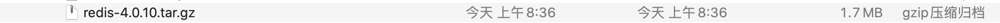

```markdown
# 3.将下载redis资料包上传到Linux中
```


```markdown
# 4.解压缩文件
[root@localhost ~]# tar -zxvf redis-4.0.10.tar.gz
[root@localhost ~]# ll
```


```markdown
# 5.安装gcc  
- yum install -y gcc

# 6.进入解压缩目录执行如下命令
- make MALLOC=libc

# 7.编译完成后执行如下命令
- make install PREFIX=/usr/redis

# 8.进入/usr/redis目录启动redis服务 
- ./redis-server
```

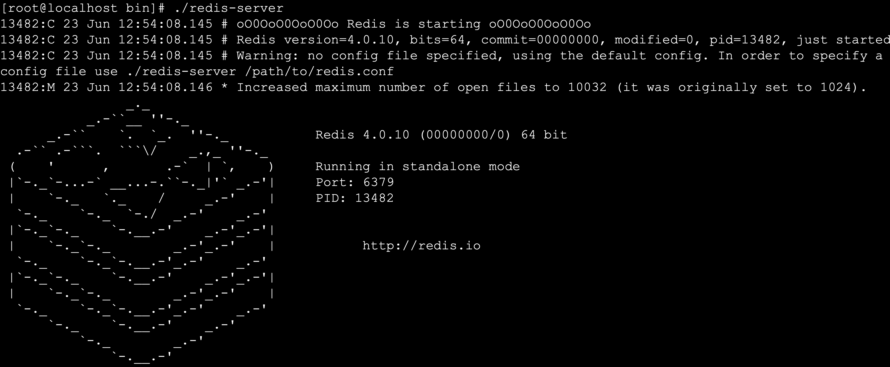

```markdown
# 9.Redis服务端口默认是 6379

# 10.进入bin目录执行客户端连接操作
- ./redis-cli –p 6379
```

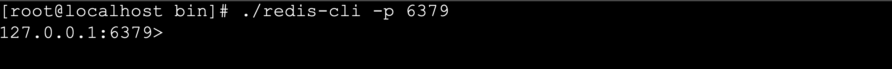

```markdown
# 11.连接成功出现上面界面连接成功
```

## 8. Redis数据库相关指令

### 8.1 数据库操作指令

```markdown
# 1.Redis中库说明
- 使用redis的默认配置器动redis服务后,默认会存在16个库,编号从0-15
- 可以使用select 库的编号 来选择一个redis的库

# 2.Redis中操作库的指令
- 清空当前的库  FLUSHDB
- 清空全部的库  FLUSHALL

# 3.redis客户端显示中文
-	./redis-cli  -p 7000 --raw
```

### 8.2 操作key相关指令

```markdown
# 1.DEL指令
- 语法 :  DEL key [key ...] 
- 作用 :  删除给定的一个或多个key 。不存在的key 会被忽略。
- 可用版本： >= 1.0.0
- 返回值： 被删除key 的数量。 

# 2.EXISTS指令
- 语法:  EXISTS key
- 作用:  检查给定key 是否存在。
- 可用版本： >= 1.0.0
- 返回值： 若key 存在，返回1 ，否则返回0。

# 3.EXPIRE
- 语法:  EXPIRE key seconds
- 作用:  为给定key 设置生存时间，当key 过期时(生存时间为0 )，它会被自动删除。
- 可用版本： >= 1.0.0
- 时间复杂度： O(1)
- 返回值：设置成功返回1 。

# 4.KEYS
- 语法 :  KEYS pattern
- 作用 :  查找所有符合给定模式pattern 的key 。
- 语法:
	KEYS * 匹配数据库中所有key 。
	KEYS h?llo 匹配hello ，hallo 和hxllo 等。
	KEYS h*llo 匹配hllo 和heeeeello 等。
	KEYS h[ae]llo 匹配hello 和hallo ，但不匹配hillo 。特殊符号用 "\" 隔开
- 可用版本： >= 1.0.0
- 返回值： 符合给定模式的key 列表。

# 5.MOVE
- 语法 :  MOVE key db
- 作用 :  将当前数据库的key 移动到给定的数据库db 当中。
- 可用版本： >= 1.0.0
- 返回值： 移动成功返回1 ，失败则返回0 。

# 6.PEXPIRE
- 语法 :  PEXPIRE key milliseconds
- 作用 :  这个命令和EXPIRE 命令的作用类似，但是它以毫秒为单位设置key 的生存时间，而不像EXPIRE 命令那样，以秒为单位。
- 可用版本： >= 2.6.0
- 时间复杂度： O(1)
- 返回值：设置成功，返回1  key 不存在或设置失败，返回0

# 7.PEXPIREAT
- 语法 :  PEXPIREAT key milliseconds-timestamp
- 作用 :  这个命令和EXPIREAT 命令类似，但它以毫秒为单位设置key 的过期unix 时间戳，而不是像EXPIREAT那样，以秒为单位。
- 可用版本： >= 2.6.0
- 返回值：如果生存时间设置成功，返回1 。当key 不存在或没办法设置生存时间时，返回0 。(查看EXPIRE 命令获取更多信息)

# 8.TTL
- 语法 :   TTL key
- 作用 :   以秒为单位，返回给定key 的剩余生存时间(TTL, time to live)。
- 可用版本： >= 1.0.0
- 返回值：
	当key 不存在时，返回-2 。
	当key 存在但没有设置剩余生存时间时，返回-1 。
	否则，以秒为单位，返回key 的剩余生存时间。
- Note : 在Redis 2.8 以前，当key 不存在，或者key 没有设置剩余生存时间时，命令都返回-1 。

# 9.PTTL
- 语法 :  PTTL key
- 作用 :  这个命令类似于TTL 命令，但它以毫秒为单位返回key 的剩余生存时间，而不是像TTL 命令那样，以秒为单位。
- 可用版本： >= 2.6.0
- 返回值： 当key 不存在时，返回-2 。当key 存在但没有设置剩余生存时间时，返回-1 。
- 否则，以毫秒为单位，返回key 的剩余生存时间。
- 注意 : 在Redis 2.8 以前，当key 不存在，或者key 没有设置剩余生存时间时，命令都返回-1 。

# 10.RANDOMKEY
- 语法 :  RANDOMKEY
- 作用 :  从当前数据库中随机返回(不删除) 一个key 。
- 可用版本： >= 1.0.0
- 返回值：当数据库不为空时，返回一个key 。当数据库为空时，返回nil 。

# 11.RENAME
- 语法 :  RENAME key newkey
- 作用 :  将key 改名为newkey 。当key 和newkey 相同，或者key 不存在时，返回一个错误。当newkey 已经存在时，RENAME 命令将覆盖旧值。
- 可用版本： >= 1.0.0
- 返回值： 改名成功时提示OK ，失败时候返回一个错误。

# 12.TYPE
- 语法 :  TYPE key
- 作用 :  返回key 所储存的值的类型。
- 可用版本： >= 1.0.0
- 返回值：
	none (key 不存在)
	string (字符串)
	list (列表)
	set (集合)
	zset (有序集)
	hash (哈希表)
```

### 8.3 String类型

#### 1. 内存存储模型


#### 2. 常用操作命令

| 命令                                       | 说明                                       |
| ------------------------------------------ | ------------------------------------------ |
| set                                        | 设置一个key/value                          |
| get                                        | 根据key获得对应的value                     |
| mset                                       | 一次设置多个key value                      |
| mget                                       | 一次获得多个key的value                     |
| getset                                     | 获得原始key的值，同时设置新值              |
| strlen                                     | 获得对应key存储value的长度                 |
| append                                     | 为对应key的value追加内容                   |
| getrange 索引0开始                         | 截取value的内容                            |
| setex                                      | 设置一个key存活的有效期（秒）              |
| psetex                                     | 设置一个key存活的有效期（毫秒）            |
| setnx                                      | 存在不做任何操作,不存在添加                |
| msetnx原子操作(只要有一个存在不做任何操作) | 可以同时设置多个key,只有有一个存在都不保存 |
| decr                                       | 进行数值类型的-1操作                       |
| decrby                                     | 根据提供的数据进行减法操作                 |
| Incr                                       | 进行数值类型的+1操作                       |
| incrby                                     | 根据提供的数据进行加法操作                 |
| Incrbyfloat                                | 根据提供的数据加入浮点数                   |

### 8.4 List类型

list 列表 相当于java中list 集合 特点 元素有序 且 可以重复

#### 1.内存存储模型


#### 2.常用操作指令

| 命令    | 说明                                 |
| ------- | ------------------------------------ |
| lpush   | 将某个值加入到一个key列表头部        |
| lpushx  | 同lpush,但是必须要保证这个key存在    |
| rpush   | 将某个值加入到一个key列表末尾        |
| rpushx  | 同rpush,但是必须要保证这个key存在    |
| lpop    | 返回和移除列表左边的第一个元素       |
| rpop    | 返回和移除列表右边的第一个元素       |
| lrange  | 获取某一个下标区间内的元素           |
| llen    | 获取列表元素个数                     |
| lset    | 设置某一个指定索引的值(索引必须存在) |
| lindex  | 获取某一个指定索引位置的元素         |
| lrem    | 删除重复元素                         |
| ltrim   | 保留列表中特定区间内的元素           |
| linsert | 在某一个元素之前，之后插入新元素     |

### 8.5 Set类型

特点: Set类型 Set集合 元素无序 不可以重复

#### 1.内存存储模型

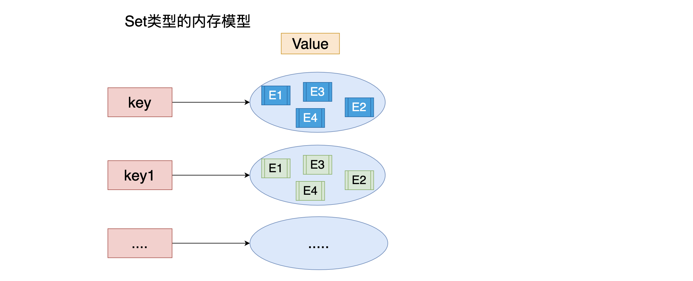

#### 2.常用命令

| 命令        | 说明                                               |
| ----------- | -------------------------------------------------- |
| sadd        | 为集合添加元素                                     |
| smembers    | 显示集合中所有元素 无序                            |
| scard       | 返回集合中元素的个数                               |
| spop        | 随机返回一个元素 并将元素在集合中删除              |
| smove       | 从一个集合中向另一个集合移动元素 必须是同一种类型 |
| srem        | 从集合中删除一个元素                               |
| sismember   | 判断一个集合中是否含有这个元素                     |
| srandmember | 随机返回元素                                       |
| sdiff       | 去掉第一个集合中其它集合含有的相同元素             |
| sinter      | 求交集                                             |
| sunion      | 求和集                                             |

### 8.6 ZSet类型

特点: 可排序的set集合 排序 不可重复

ZSET 官方 可排序SET sortSet

#### 1.内存模型


#### 2.常用命令

| 命令                       | 说明                         |
| -------------------------- | ---------------------------- |
| zadd                       | 添加一个有序集合元素         |
| zcard                      | 返回集合的元素个数           |
| zrange 升序 zrevrange 降序 | 返回一个范围内的元素         |
| zrangebyscore              | 按照分数查找一个范围内的元素 |
| zrank                      | 返回排名                     |
| zrevrank                   | 倒序排名                     |
| zscore                     | 显示某一个元素的分数         |
| zrem                       | 移除某一个元素               |
| zincrby                    | 给某个特定元素加分           |

### 8.7 hash类型

特点: value 是一个map结构 存在key value key 无序的

#### 1.内存模型


#### 2.常用命令

| 命令         | 说明                    |
| ------------ | ----------------------- |
| hset         | 设置一个key/value对     |
| hget         | 获得一个key对应的value  |
| hgetall      | 获得所有的key/value对   |
| hdel         | 删除某一个key/value对   |
| hexists      | 判断一个key是否存在     |
| hkeys        | 获得所有的key           |
| hvals        | 获得所有的value         |
| hmset        | 设置多个key/value       |
| hmget        | 获得多个key的value      |
| hsetnx       | 设置一个不存在的key的值 |
| hincrby      | 为value进行加法运算     |
| hincrbyfloat | 为value加入浮点值       |

---

## 9. 持久化机制

client redis[内存] ----->  内存数据- 数据持久化-->磁盘

Redis官方提供了两种不同的持久化方法来将数据存储到硬盘里面分别是:

- 快照(Snapshot)
- AOF (Append Only File) 只追加日志文件

### 9.1 快照(Snapshot)

#### 1. 特点

这种方式可以将某一时刻的所有数据都写入硬盘中,当然这也是**redis的默认开启持久化方式**,保存的文件是以.rdb形式结尾的文件因此这种方式也称之为RDB方式。


#### 2.快照生成方式

- 客户端方式: BGSAVE 和 SAVE指令
- 服务器配置自动触发

```markdown
# 1.客户端方式之BGSAVE
- a.客户端可以使用BGSAVE命令来创建一个快照,当接收到客户端的BGSAVE命令时,redis会调用fork¹来创建一个子进程,然后子进程负责将快照写入磁盘中,而父进程则继续处理命令请求。
	
	`名词解释: fork当一个进程创建子进程的时候,底层的操作系统会创建该进程的一个副本,在类unix系统中创建子进程的操作会进行优化:在刚开始的时候,父子进程共享相同内存,直到父进程或子进程对内存进行了写之后,对被写入的内存的共享才会结束服务`
```


```markdown
# 2.客户端方式之SAVE
- b.客户端还可以使用SAVE命令来创建一个快照,接收到SAVE命令的redis服务器在快照创建完毕之前将不再响应任何其他的命令
```


- **注意: SAVE命令并不常用,使用SAVE命令在快照创建完毕之前,redis处于阻塞状态,无法对外服务**

```markdown
# 3.服务器配置方式之满足配置自动触发
- 如果用户在redis.conf中设置了save配置选项,redis会在save选项条件满足之后自动触发一次BGSAVE命令,如果设置多个save配置选项,当任意一个save配置选项条件满足,redis也会触发一次BGSAVE命令
```


```markdown
# 4.服务器接收客户端shutdown指令
- 当redis通过shutdown指令接收到关闭服务器的请求时,会执行一个save命令,阻塞所有的客户端,不再执行客户端执行发送的任何命令,并且在save命令执行完毕之后关闭服务器
```

#### 3.配置生成快照名称和位置

```markdown
#1.修改生成快照名称
- dbfilename dump.rdb

# 2.修改生成位置
- dir ./
```


----

### 9.2 AOF 只追加日志文件

#### 1.特点

这种方式可以将所有客户端执行的写命令记录到日志文件中,AOF持久化会将被执行的写命令写到AOF的文件末尾,以此来记录数据发生的变化,因此只要redis从头到尾执行一次AOF文件所包含的所有写命令,就可以恢复AOF文件的记录的数据集.


#### 2.开启AOF持久化

在redis的默认配置中AOF持久化机制是没有开启的，需要在配置中开启

```markdown
# 1.开启AOF持久化
- a.修改 appendonly yes 开启持久化
- b.修改 appendfilename "appendonly.aof" 指定生成文件名称
```


#### 3.日志追加频率

```markdown
# 1.always 【谨慎使用】
- 说明: 每个redis写命令都要同步写入硬盘,严重降低redis速度
- 解释: 如果用户使用了always选项,那么每个redis写命令都会被写入硬盘,从而将发生系统崩溃时出现的数据丢失减到最少;遗憾的是,因为这种同步策略需要对硬盘进行大量的写入操作,所以redis处理命令的速度会受到硬盘性能的限制;
- 注意: 转盘式硬盘在这种频率下200左右个命令/s ; 固态硬盘(SSD) 几百万个命令/s;
- 警告: 使用SSD用户请谨慎使用always选项,这种模式不断写入少量数据的做法有可能会引发严重的写入放大问题,导致将固态硬盘的寿命从原来的几年降低为几个月。

# 2.everysec 【推荐】
- 说明: 每秒执行一次同步显式的将多个写命令同步到磁盘
- 解释： 为了兼顾数据安全和写入性能,用户可以考虑使用everysec选项,让redis每秒一次的频率对AOF文件进行同步;redis每秒同步一次AOF文件时性能和不使用任何持久化特性时的性能相差无几,而通过每秒同步一次AOF文件,redis可以保证,即使系统崩溃,用户最多丢失一秒之内产生的数据。

# 3.no	【不推荐】
- 说明: 由操作系统决定何时同步 
- 解释：最后使用no选项,将完全有操作系统决定什么时候同步AOF日志文件,这个选项不会对redis性能带来影响但是系统崩溃时,会丢失不定数量的数据,另外如果用户硬盘处理写入操作不够快的话,当缓冲区被等待写入硬盘数据填满时,redis会处于阻塞状态,并导致redis的处理命令请求的速度变慢。
```

#### 4.修改同步频率

```markdown
# 1.修改日志同步频率
- 修改appendfsync everysec|always|no 指定
```


----

### 9.3 AOF文件的重写

#### 1. AOF带来的问题

AOF的方式也同时带来了另一个问题。持久化文件会变的越来越大。例如我们调用incr test命令100次，文件中必须保存全部的100条命令，其实有99条都是多余的。因为要恢复数据库的状态其实文件中保存一条set test
100就够了。为了压缩aof的持久化文件Redis提供了AOF重写(ReWriter)机制。

#### 2. AOF重写

用来在一定程度上减小AOF文件的体积

#### 3. 触发重写方式

```markdown
# 1.客户端方式触发重写
- 执行BGREWRITEAOF命令  不会阻塞redis的服务

# 2.服务器配置方式自动触发
- 配置redis.conf中的auto-aof-rewrite-percentage选项 参加下图↓↓↓
- 如果设置auto-aof-rewrite-percentage值为100和auto-aof-rewrite-min-size 64mb,并且启用的AOF持久化时,那么当AOF文件体积大于64M,并且AOF文件的体积比上一次重写之后体积大了至少一倍(100%)时,会自动触发,如果重写过于频繁,用户可以考虑将auto-aof-rewrite-percentage设置为更大
```


#### 4. 重写原理

**注意：重写aof文件的操作，并没有读取旧的aof文件，而是将整个内存中的数据库内容用命令的方式重写了一个新的aof文件,替换原有的文件这点和快照有点类似。**

```markdown
# 重写流程
- 1. redis调用fork ，现在有父子两个进程 子进程根据内存中的数据库快照，往临时文件中写入重建数据库状态的命令
- 2. 父进程继续处理client请求，除了把写命令写入到原来的aof文件中。同时把收到的写命令缓存起来。这样就能保证如果子进程重写失败的话并不会出问题。
- 3. 当子进程把快照内容写入已命令方式写到临时文件中后，子进程发信号通知父进程。然后父进程把缓存的写命令也写入到临时文件。
- 4. 现在父进程可以使用临时文件替换老的aof文件，并重命名，后面收到的写命令也开始往新的aof文件中追加。
```

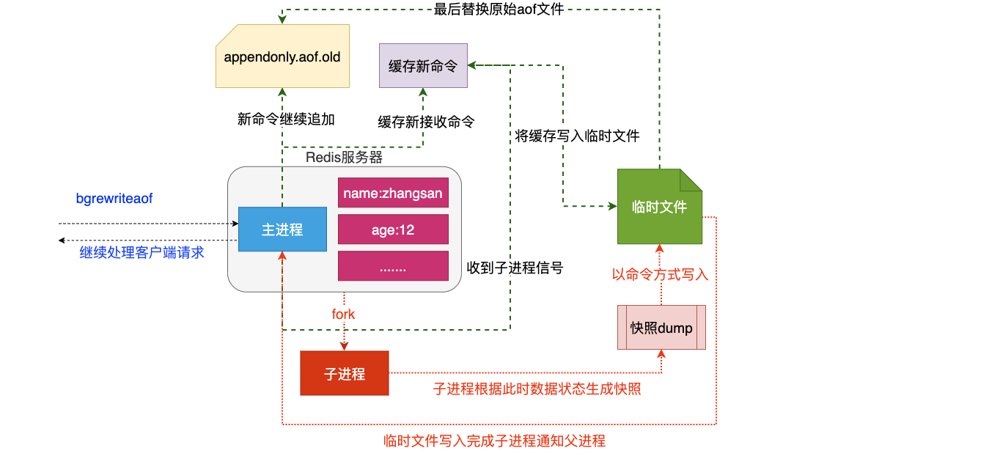

----

### 9.4 持久化总结

两种持久化方案既可以同时使用(aof),又可以单独使用,在某种情况下也可以都不使用,具体使用那种持久化方案取决于用户的数据和应用决定。

无论使用AOF还是快照机制持久化,将数据持久化到硬盘都是有必要的,除了持久化外,用户还应该对持久化的文件进行备份(最好备份在多个不同地方)。

---

## 10. java操作Redis

### 10.1 环境准备

#### 1. 引入依赖

```xml
<!--引入jedis连接依赖-->
<dependency>
  <groupId>redis.clients</groupId>
  <artifactId>jedis</artifactId>
  <version>2.9.0</version>
</dependency>
```

#### 2.创建jedis对象

```java
 public static void main(String[] args) {
   //1.创建jedis对象
   Jedis jedis = new Jedis("192.168.40.4", 6379);//1.redis服务必须关闭防火墙  2.redis服务必须开启远程连接
   jedis.select(0);//选择操作的库默认0号库
   //2.执行相关操作
   //....
   //3.释放资源
   jedis.close();
 }
```

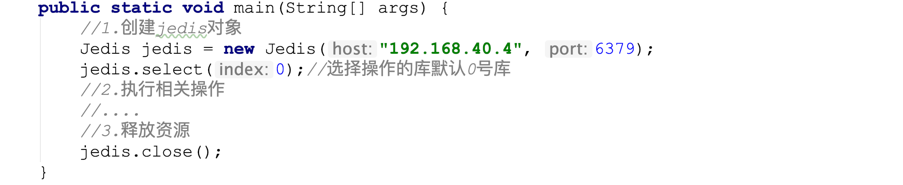

### 10.2 操作key相关API

```java
private Jedis jedis;
    @Before
    public void before(){
        this.jedis = new Jedis("192.168.202.205", 7000);
    }
    @After
    public void after(){
        jedis.close();
    }

    //测试key相关
    @Test
    public void testKeys(){
        //删除一个key
        jedis.del("name");
        //删除多个key
        jedis.del("name","age");

        //判断一个key是否存在exits
        Boolean name = jedis.exists("name");
        System.out.println(name);

        //设置一个key超时时间 expire pexpire
        Long age = jedis.expire("age", 100);
        System.out.println(age);

        //获取一个key超时时间 ttl
        Long age1 = jedis.ttl("newage");
        System.out.println(age1);

        //随机获取一个key
        String s = jedis.randomKey();

        //修改key名称
        jedis.rename("age","newage");

        //查看可以对应值的类型
        String name1 = jedis.type("name");
        System.out.println(name1);
        String maps = jedis.type("maps");
        System.out.println(maps);
    }
```


### 10.3操作String相关API

```java
//测试String相关
    @Test
    public void testString(){
        //set
        jedis.set("name","小陈");
        //get
        String s = jedis.get("name");
        System.out.println(s);
        //mset
        jedis.mset("content","好人","address","海淀区");
        //mget
        List<String> mget = jedis.mget("name", "content", "address");
        mget.forEach(v-> System.out.println("v = " + v));
        //getset
        String set = jedis.getSet("name", "小明");
        System.out.println(set);

        //............
    }
```


### 10.4操作List相关API

```java
//测试List相关
    @Test
    public void testList(){

        //lpush
        jedis.lpush("names1","张三","王五","赵柳","win7");

        //rpush
        jedis.rpush("names1","xiaomingming");

        //lrange

        List<String> names1 = jedis.lrange("names1", 0, -1);
        names1.forEach(name-> System.out.println("name = " + name));

        //lpop rpop
        String names11 = jedis.lpop("names1");
        System.out.println(names11);

        //llen
        jedis.linsert("lists", BinaryClient.LIST_POSITION.BEFORE,"xiaohei","xiaobai");

      	//........

    }

```

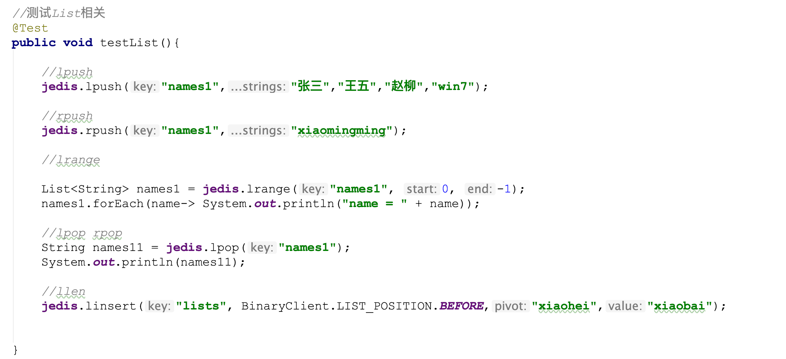

### 10.5操作Set的相关API

```java
//测试SET相关
@Test
public void testSet(){

  //sadd
  jedis.sadd("names","zhangsan","lisi");

  //smembers
  jedis.smembers("names");

  //sismember
  jedis.sismember("names","xiaochen");

  //...
}
```

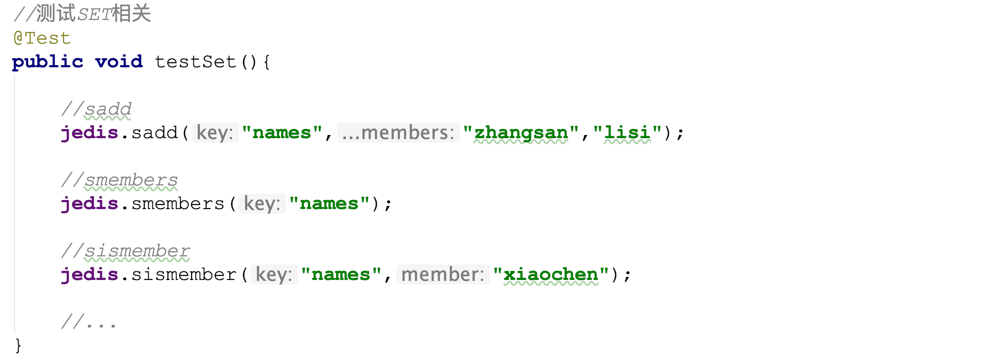

### 10.6 操作ZSet相关API

```java
//测试ZSET相关
@Test
public void testZset(){

  //zadd
  jedis.zadd("names",10,"张三");

  //zrange
  jedis.zrange("names",0,-1);

  //zcard
  jedis.zcard("names");

  //zrangeByScore
  jedis.zrangeByScore("names","0","100",0,5);

  //..

}
```

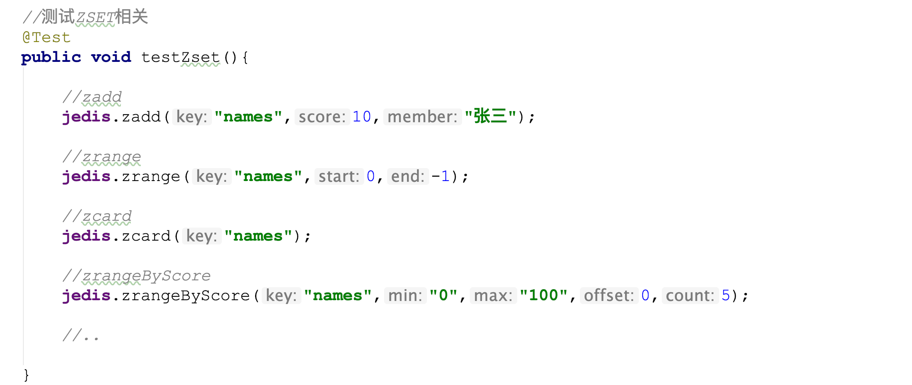

### 10.7 操作Hash相关API

```java
//测试HASH相关
@Test
public void testHash(){
  //hset
  jedis.hset("maps","name","zhangsan");
  //hget
  jedis.hget("maps","name");
  //hgetall
  jedis.hgetAll("mps");
  //hkeys
  jedis.hkeys("maps");
  //hvals
  jedis.hvals("maps");
  //....
}
```

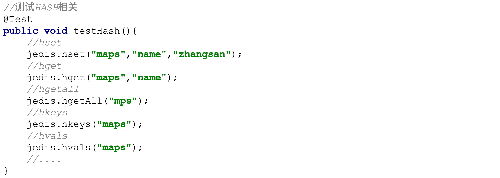

----

## 11.SpringBoot整合Redis

Spring Boot Data(数据) Redis 中提供了**RedisTemplate和StringRedisTemplate**
，其中StringRedisTemplate是RedisTemplate的子类，两个方法基本一致，不同之处主要体现在操作的数据类型不同，**
RedisTemplate中的两个泛型都是Object，意味着存储的key和value都可以是一个对象，而StringRedisTemplate的两个泛型都是String，意味着StringRedisTemplate的key和value都只能是字符串。**

`注意: 使用RedisTemplate默认是将对象序列化到Redis中,所以放入的对象必须实现对象序列化接口`

### 11.1 环境准备

#### 1.引入依赖

```xml
<dependency>
  <groupId>org.springframework.boot</groupId>
  <artifactId>spring-boot-starter-data-redis</artifactId>
</dependency>
```

#### 2.配置application.propertie

```properties
spring.redis.host=localhost
spring.redis.port=6379
spring.redis.database=0
```

### 11.2 使用StringRedisTemplate和RedisTemplate

```java
		@Autowired
    private StringRedisTemplate stringRedisTemplate;  //对字符串支持比较友好,不能存储对象
    @Autowired
    private RedisTemplate redisTemplate;  //存储对象

    @Test
    public void testRedisTemplate(){
        System.out.println(redisTemplate);
        //设置redistemplate值使用对象序列化策略
        redisTemplate.setValueSerializer(new JdkSerializationRedisSerializer());//指定值使用对象序列化
        //redisTemplate.opsForValue().set("user",new User("21","小黑",23,new Date()));
        User user = (User) redisTemplate.opsForValue().get("user");
        System.out.println(user);
//      Set keys = redisTemplate.keys("*");
//      keys.forEach(key -> System.out.println(key));
        /*Object name = redisTemplate.opsForValue().get("name");
        System.out.println(name);*/

        //Object xiaohei = redisTemplate.opsForValue().get("xiaohei");
        //System.out.println(xiaohei);
        /*redisTemplate.opsForValue().set("name","xxxx");
        Object name = redisTemplate.opsForValue().get("name");
        System.out.println(name);*/
        /*redisTemplate.opsForList().leftPushAll("lists","xxxx","1111");
        List lists = redisTemplate.opsForList().range("lists", 0, -1);
        lists.forEach(list-> System.out.println(list));*/
    }


    //key的绑定操作 如果日后对某一个key的操作及其频繁,可以将这个key绑定到对应redistemplate中,日后基于绑定操作都是操作这个key
    //boundValueOps 用来对String值绑定key
    //boundListOps 用来对List值绑定key
    //boundSetOps 用来对Set值绑定key
    //boundZsetOps 用来对Zset值绑定key
    //boundHashOps 用来对Hash值绑定key

    @Test
    public void testBoundKey(){
        BoundValueOperations<String, String> nameValueOperations = stringRedisTemplate.boundValueOps("name");
        nameValueOperations.set("1");
        //yuew
        nameValueOperations.set("2");
        String s = nameValueOperations.get();
        System.out.println(s);

    }


    //hash相关操作 opsForHash
    @Test
    public void testHash(){
        stringRedisTemplate.opsForHash().put("maps","name","小黑");
        Object o = stringRedisTemplate.opsForHash().get("maps", "name");
        System.out.println(o);
    }

    //zset相关操作 opsForZSet
    @Test
    public void testZSet(){
        stringRedisTemplate.opsForZSet().add("zsets","小黑",10);
        Set<String> zsets = stringRedisTemplate.opsForZSet().range("zsets", 0, -1);
        zsets.forEach(value-> System.out.println(value));
    }

    //set相关操作 opsForSet
    @Test
    public void testSet(){
        stringRedisTemplate.opsForSet().add("sets","xiaosan","xiaosi","xiaowu");
        Set<String> sets = stringRedisTemplate.opsForSet().members("sets");
        sets.forEach(value-> System.out.println(value));
    }

    //list相关的操作opsForList
    @Test
    public void testList(){
        // stringRedisTemplate.opsForList().leftPushAll("lists","张三","李四","王五");
        List<String> lists = stringRedisTemplate.opsForList().range("lists", 0, -1);
        lists.forEach(key -> System.out.println(key));
    }


    //String相关的操作 opsForValue
    @Test
    public void testString(){
        //stringRedisTemplate.opsForValue().set("166","好同学");
        String s = stringRedisTemplate.opsForValue().get("166");
        System.out.println(s);
        Long size = stringRedisTemplate.opsForValue().size("166");
        System.out.println(size);
    }


    //key相关的操作
    @Test
    public void test(){
        Set<String> keys = stringRedisTemplate.keys("*");//查看所有key
        Boolean name = stringRedisTemplate.hasKey("name");//判断某个key是否存在
        stringRedisTemplate.delete("age");//根据指定key删除
        stringRedisTemplate.rename("","");//修改key的名称
        stringRedisTemplate.expire("key",10, TimeUnit.HOURS);
      	//设置key超时时间 参数1:设置key名 参数2:时间 参数3:时间的单位
        stringRedisTemplate.move("",1);//移动key
    }
```

---

## 12. Redis 主从复制

### 12.1 主从复制

主从复制架构仅仅用来解决数据的冗余备份,从节点仅仅用来同步数据

**无法解决: 1.master节点出现故障的自动故障转移**

### 12.2 主从复制架构图


### 12.3 搭建主从复制

```markdown
# 1.准备3台机器并修改配置
- master
	port 6379
	bind 0.0.0.0
	
- slave1
	port 6380
	bind 0.0.0.0
	slaveof masterip masterport

- slave2
	port 6381
	bind 0.0.0.0
	slaveof masterip masterport
```


```markdown
# 2.启动3台机器进行测试
- cd /usr/redis/bin
- ./redis-server /root/master/redis.conf
- ./redis-server /root/slave1/redis.conf
- ./redis-server /root/slave2/redis.conf
```

---

## 13. Redis哨兵机制

### 13.1 哨兵Sentinel机制

Sentinel（哨兵）是Redis 的高可用性解决方案：由一个或多个Sentinel 实例 组成的Sentinel
系统可以监视任意多个主服务器，以及这些主服务器属下的所有从服务器，并在被监视的主服务器进入下线状态时，自动将下线主服务器属下的某个从服务器升级为新的主服务器。简单的说哨兵就是带有**自动故障转移功能的主从架构**。

**无法解决: 1.单节点并发压力问题 2.单节点内存和磁盘物理上限**

### 13.2 哨兵架构原理

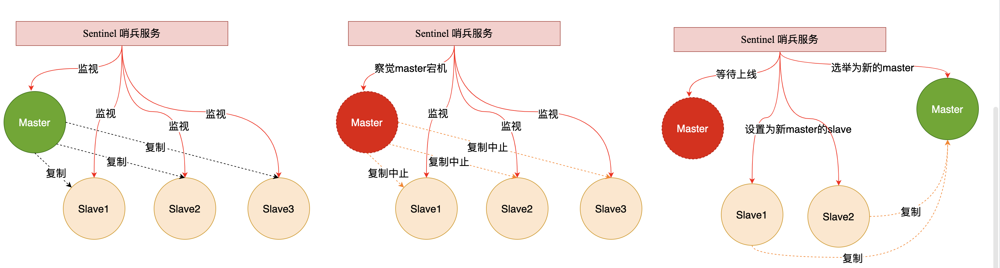

### 13.3 搭建哨兵架构

```markdown
# 1.在主节点上创建哨兵配置
- 在Master对应redis.conf同目录下新建sentinel.conf文件，名字绝对不能错；

# 2.配置哨兵，在sentinel.conf文件中填入内容：
- sentinel monitor 被监控数据库名字（自己起名字） ip port 1

# 3.启动哨兵模式进行测试
- redis-sentinel  /root/sentinel/sentinel.conf
	说明:这个后面的数字2,是指当有两个及以上的sentinel服务检测到master宕机，才会去执行主从切换的功能。
```

### 13.4 通过springboot操作哨兵

```properties
# redis sentinel 配置
# master书写是使用哨兵监听的那个名称
spring.redis.sentinel.master=mymaster
# 连接的不再是一个具体redis主机,书写的是多个哨兵节点
spring.redis.sentinel.nodes=192.168.202.206:26379
```

- **注意:如果连接过程中出现如下错误:RedisConnectionException: DENIED Redis is running in protected mode because protected mode is
  enabled, no bind address was specified, no authentication password is requested to clients. In this mode connections
  are only accepted from the loopback interface. If you want to connect from external computers to Redis you may adopt
  one of the following solutions: 1) Just disable protected mode sending the command 'CONFIG SET protected-mode no' from
  the loopback interface by connecting to Redis from the same host the server is running, however MAKE SURE Redis is not
  publicly accessible from internet if you do so. Use CONFIG REWRITE to make this change permanent. 2)**
- **解决方案:在哨兵的配置文件中加入bind 0.0.0.0 开启远程连接权限**


## 14. Redis集群

### 14.1 集群

Redis在3.0后开始支持Cluster(模式)模式,目前redis的集群支持节点的自动发现,支持slave-master选举和容错,支持在线分片(sharding shard )等特性。reshard

### 14.2 集群架构图

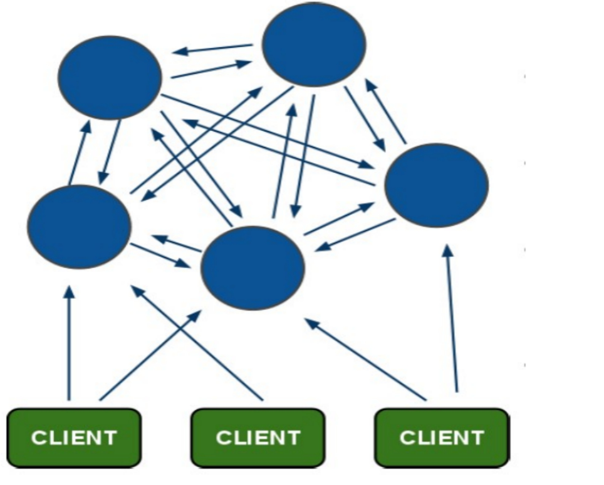

### 14.3 集群细节

```markdown
- 所有的redis节点彼此互联(PING-PONG机制),内部使用二进制协议优化传输速度和带宽.
- 节点的fail是通过集群中超过半数的节点检测失效时才生效. 
- 客户端与redis节点直连,不需要中间proxy层.客户端不需要连接集群所有节点,连接集群中任何一个可用节点即可
- redis-cluster把所有的物理节点映射到[0-16383]slot上,cluster 负责维护node<->slot<->value
```


### 14.4 集群搭建

判断一个是集群中的节点是否可用,是集群中的所用主节点选举过程,如果半数以上的节点认为当前节点挂掉,那么当前节点就是挂掉了,所以搭建redis集群时建议节点数最好为奇数，**搭建集群至少需要三个主节点,三个从节点,至少需要6个节点**。

```markdown
# 1.准备环境安装ruby以及redis集群依赖
- yum install -y ruby rubygems
- gem install redis-xxx.gem

```

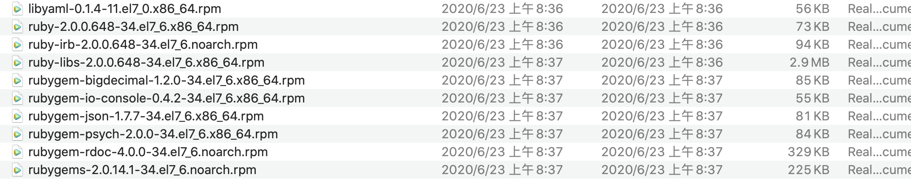


```markdown
# 2.在一台机器创建7个目录
```


```markdown
# 3.每个目录复制一份配置文件
[root@localhost ~]# cp redis-4.0.10/redis.conf 7000/
[root@localhost ~]# cp redis-4.0.10/redis.conf 7001/
[root@localhost ~]# cp redis-4.0.10/redis.conf 7002/
[root@localhost ~]# cp redis-4.0.10/redis.conf 7003/
[root@localhost ~]# cp redis-4.0.10/redis.conf 7004/
[root@localhost ~]# cp redis-4.0.10/redis.conf 7005/
[root@localhost ~]# cp redis-4.0.10/redis.conf 7006/
```


```markdown
# 4.修改不同目录配置文件
- port 	6379 .....                		 //修改端口
- bind  0.0.0.0                   		 //开启远程连接
- cluster-enabled  yes 	        			 //开启集群模式
- cluster-config-file  nodes-port.conf //集群节点配置文件
- cluster-node-timeout  5000      	   //集群节点超时时间
- appendonly  yes   		               //开启AOF持久化

# 5.指定不同目录配置文件启动七个节点
- [root@localhost bin]# ./redis-server  /root/7000/redis.conf
- [root@localhost bin]# ./redis-server  /root/7001/redis.conf
- [root@localhost bin]# ./redis-server  /root/7002/redis.conf
- [root@localhost bin]# ./redis-server  /root/7003/redis.conf
- [root@localhost bin]# ./redis-server  /root/7004/redis.conf
- [root@localhost bin]# ./redis-server  /root/7005/redis.conf
- [root@localhost bin]# ./redis-server  /root/7006/redis.conf
```


```markdown
# 6.查看进程
- [root@localhost bin]# ps aux|grep redis
```

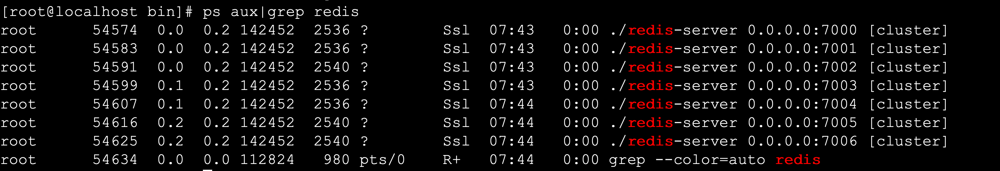

#### 1.创建集群

```markdown
# 1.复制集群操作脚本到bin目录中
- [root@localhost bin]# cp /root/redis-4.0.10/src/redis-trib.rb .

# 2.创建集群
- ./redis-trib.rb create --replicas 1 192.168.202.205:7000 192.168.202.205:7001 192.168.202.205:7002 192.168.202.205:7003 192.168.202.205:7004 192.168.202.205:7005
```

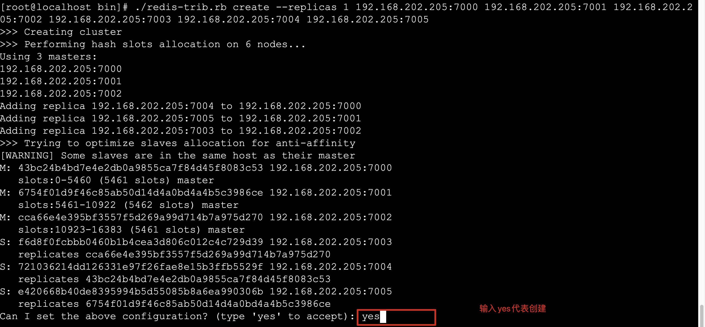

```markdown
# 3.集群创建成功出现如下提示
```


#### 2.查看集群状态

```markdown
# 1.查看集群状态 check [原始集群中任意节点] [无]
- ./redis-trib.rb check 192.168.202.205:7000

# 2.集群节点状态说明
- 主节点 
	主节点存在hash slots,且主节点的hash slots 没有交叉
	主节点不能删除
	一个主节点可以有多个从节点
	主节点宕机时多个副本之间自动选举主节点

- 从节点
	从节点没有hash slots
	从节点可以删除
	从节点不负责数据的写,只负责数据的同步
```

#### 3.添加主节点

```markdown
# 1.添加主节点 add-node [新加入节点] [原始集群中任意节点]
- ./redis-trib.rb  add-node 192.168.1.158:7006  192.168.1.158:7005
- 注意:
	1.该节点必须以集群模式启动
	2.默认情况下该节点就是以master节点形式添加
```

#### 4.添加从节点

```markdown
# 1.添加从节点 add-node --slave [新加入节点] [集群中任意节点]
- ./redis-trib.rb  add-node --slave 192.168.1.158:7006 192.168.1.158:7000
- 注意:
	当添加副本节点时没有指定主节点,redis会随机给副本节点较少的主节点添加当前副本节点
	
# 2.为确定的master节点添加主节点 add-node --slave --master-id master节点id [新加入节点] [集群任意节点]
- ./redis-trib.rb  add-node --slave --master-id 3c3a0c74aae0b56170ccb03a76b60cfe7dc1912e 127.0.0.1:7006  127.0.0.1:7000
```

#### 5.删除副本节点

```markdown
# 1.删除节点 del-node [集群中任意节点] [删除节点id]
- ./redis-trib.rb  del-node 127.0.0.1:7002 0ca3f102ecf0c888fc7a7ce43a13e9be9f6d3dd1
- 注意:
 1.被删除的节点必须是从节点或没有被分配hash slots的节点
```

#### 6.集群在线分片

```markdown
# 1.在线分片 reshard [集群中任意节点] [无]
- ./redis-trib.rb  reshard  192.168.1.158:7000
```

----

## 15.Redis实现分布式Session管理 💡

### 15.1 管理机制

**redis的session管理是利用spring提供的session管理解决方案,将一个应用session交给Redis存储,整个应用中所有session的请求都会去redis中获取对应的session数据。**


### 15.2 开发Session管理

#### 1. 引入依赖

```xml
<dependency>
  <groupId>org.springframework.session</groupId>
  <artifactId>spring-session-data-redis</artifactId>
</dependency>
```

#### 2. 开发Session管理配置类

```java
@Configuration
@EnableRedisHttpSession
public class RedisSessionManager {
   
}
```

#### 3.打包测试即可

----


