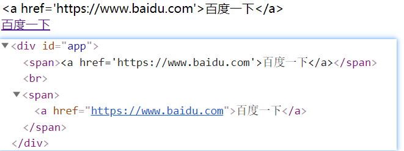

# Vue实战

> 课程名称:[Vue实战教程](https://www.bilibili.com/video/BV1SE411H7CY)
>
> 课程概述: 
>
> - 基于Vue2.x版本的教程; 新的vue3教程基于TypeScript进行了重构!
> - 需要有html和css和javascript基础就可以学习Vue
> - 适合学java的开发者学习的vue教程
> - 包含了一些vue基础的知识以及前后端数据提交的axios技术,还有工程化开发的vue-cli脚手架
> - 本文档在视频文档的基础之上添加了自己听课的一些理解
>
> 讲述人: B站-编程不良人

## 1. Vue 引言

> `渐进式` JavaScript 框架   --摘自官网

```markdown
# 渐进式的理解
1. 易用:  只需要有 html css javascript基础就可以学习Vue
2. 高效:  使用Vue开发前端页面 非常高效 
3. 灵活:  Vue开发灵活 多样性

# 总结
Vue 是一个javascript 框架

# 对于后端服务端开发人员来讲,什么是VUE?
Vue是一个渐进式javascript框架: 让我们通过操作很少的DOM,甚至不需要操作页面中任何DOM元素,就很容易的完成数据和视图绑定  双向绑定 MVVM  
	注意: 日后在使用Vue过程中页面中不要在引入Jquery框架

前端的生态发展: html-->css--->javascript ----->jquery---->angularjs -----> Vue

MVVM: M表示数据 V:表示视图 VM:用于连接数据和视图的

现在国内大部分企业都使用Vue框架,所以学会Vue是非常有必要的!

# Vue 作者
 Vue的作者是尤雨溪   国内的    
```

-------

## 2. Vue入门

### 2.1	下载Vuejs

```html
<!-- 开发版本: 开发环境版本，包含了有帮助的命令行警告,在编码的时候使用这个版本有提醒 -->
<script src="https://cdn.jsdelivr.net/npm/vue/dist/vue.js"></script>

<!--生产版本: 生产环境版本，优化了尺寸和速度,一般项目 ,编码完成后,代码上线后使用生产版可以减少网络的带宽-->
<script src="https://cdn.jsdelivr.net/npm/vue"></script>
```


### 2.2 Vue第一个入门应用

#### 入门案例

```html
<div id="app">
    
    {{ msg }}  {{username}} {{pwd}}

    <br>
    <span>
        {{ username }}
        <h1>{{ msg }}</h1>
    </span>

</div>


<!--引入vue.js-->
<script src="https://cdn.jsdelivr.net/npm/vue/dist/vue.js"></script>
<script>
    const app = new Vue({
        el:"#app",  //element 用来给Vue实例定义一个作用范围
        data:{      //用来给Vue实例定义一些相关数据
            msg:"百知欢迎你,期待你的加入!",
            username:"hello Vue!",
            pwd :"12345",
        },
    });
</script>
```

*由案例着手,一步一步的拆分入门案例中的属性的作用*

#### el属性的范围

vue实例(对象)中`el`属性: 	代表Vue的作用范围  日后在Vue的作用范围内都可以使用Vue的语法;注意:在Vue作用范围外的无法使用Vue语法

```html
{{msg}} <!--作用范围外-->
<div id="app">
    {{msg}} <!--作用范围内--> 
</div>
{{msg}} <!--作用范围外-->
<script>
    const app = new Vue({
        el:"#app", // 限定Vue的范围
    })
</script>
```

#### data属性中获取复杂数据类型的值

vue实例(对象)中`data`属性: 用来给Vue实例绑定一些相关数据, 绑定的数据可以通过`{{变量名}}` 在Vue作用范围内取出;其中`{{变量名}}` 可以是多种数据,对应的取值方式有点点不同

```html
<div id="app">
    <!--取字符串: 字符串中的msg {{变量名}}-->
    {{msg}} <br>
    <!--取对象: 取出user {{对象名}}-->
    {{user}} <br>
    <!--取对象中的属性: user中的msg {{对象名.属性名}}-->
    {{user.msg}} <br>
    <!--取数组: 取出list {{数组名}}-->
    {{list}} <br>
    <!--取数组角标的数据: {{数组名[角标]}}-->
    {{list[1]}} <br>
    <!--取出数组中的对象-->
    {{lists[0].name}}
    {{lists[1].name}}
</div>
<script>
    const app = new Vue({
        el:"#app",
        data:{
            msg:"未知错误请联系管理员", //字符串
            user:{userName:"CodeXiYang",passWorld: "1008611",msg:"登录成功"},//user对象
            list:["北京","上海","广州","重庆"],
            lists:[{name:"张三",age:18},{name:"李四",sex:"男"}]
        }
    })
</script>
```

执行结果:


#### `{{}}`语法的使用

在使用`{{}}`进行获取data中数据时,可以在`{{}}`中书写表达式,运算符,调用相关方 法,以及逻辑运算等

```html
<div id="app">
    {{msg}}! <br>
    {{msg+"!"}} <br> <!--书写表达式-->
    {{msg.toUpperCase()}} <br> <!--调用方法-->
    {{num * 2 + 1}} <!--做逻辑运算-->
</div>
<script>
    const app = new Vue({
        el:"#app",
        data:{
            msg:"hello vue",
            num:2
        }
    })
</script>
```

#### el属性的值有哪些?

el属性中的选择器可以书写任意的`CSS选择器 / jquery选择器`,但是在使用Vue开发是推荐使用 id选择器

```html
<div class="aa">
    {{msg}}
</div>
<script>
    const aa = new Vue({
        el:".aa",
        data:{
            msg:"aaaaa"
        }
    })
</script>
```


**注意:** 需要将vue的代码编写在html之后,如果编写在html之前无法挂载html元素

*下面这种就是错误的写法:*


错误显示结果:


------

## 3. v-text和v-html

### 3.1 v-text

> `v-text`:用来获取data中数据将数据以`文本`的形式渲染到指定标签内部 ,类似于javascript 中` innerText`

```html
<div id="app">
    <span>{{msg}} 原有数据</span> <br/>
    <span v-text="msg">原有数据</span>
</div>
<script src="js/vue.js"></script>
<script>
    const app = new Vue({
        el:"#app",
        data:{
            msg:"欢迎来到英雄联盟",
        }
    });
</script>
```


**小结:** `{{}}` 与 `v-text`的区别

`{{}}`这种语法叫**插值表达式** 和v-text获取数据的区别在于 

- 使用v-text取值会将标签中原有的数据覆盖 ; 使用插值表达式的形式不会覆盖标签原有的数据

- 使用v-text可以避免在网络环境较差的情况下出现插值闪烁问题(因为网络差的时候,他加载的时候是先加载的`{{msg}}`这种vue的语法,然而数据中的data还并没有渲染出来,所以会出现这种情况)

  


### 3.2 v-html

> `v-html`:用来获取data中数据将数据中含有的html标签先解析在渲染到指定标签的内部  类似于javascript中` innerHTML`

```html
<div id="app">
    <span v-text="alink"></span> <br> <!--v-text不会解析-->
    <span v-html="alink">原始数据</span> <!--v-html会解析,也会覆盖原始数据-->
</div>
<script>
    const app = new Vue({
        el:"#app",
        data:{
            alink:"<a href='https://www.baidu.com'>百度一下</a>",
        }
    });
</script>
```



----

## 4.vue中事件绑定(v-on)

vue中可以通过`v-on`来绑定事件

### 4.1 绑定事件基本语法

语法格式: `v-on:事件类型=方法名` 

- 事件类型: 原生的javascript中的事件去掉on就ok了
- 方法名就是定义在vue的**methods**区中的自定义方法!

*需求: 一个按钮,一个年龄显示区域;初始年龄为23,每次点击按钮就会触发下面显示区域增加1岁*


```html
<div id="app">
    <button v-on:click="addAge">点我</button> <!--按钮-->
    <div style="color: red"> 年龄:  {{age}}</div> <!--显示区域-->
</div>
<script>
    const app = new Vue({
        el:"#app",
        data:{
            age:23
        },
        methods:{
            addAge : function(){ //定义的方法
                this.$data.age += 1; //这里我是通过打印this,发现了$data中的age ; 由于vue中数据是双向绑定的,那么我在data中修改数据,{{}}中的数据就会自动修改,基于这个思路,那么直接改变age的值就可以达到需求的效果了
            }
        }
    });
</script>
```

**小结:**

> 事件 与 事件源的概念
>
> - 事件源:发生事件dom元素  
>
> - 事件: 发生特定的动作  click....  监听器  发生特定动作之后的事件处理程序 通常是js中函数

1. 在vue中绑定事件是通过v-on指令来完成的 `v-on:事件名` 如  `v-on:click`
2. 在v-on:事件名的赋值语句中是当前时间触发调用的函数名
3. 在vue中事件的函数统一定义在Vue实例的**methods**属性中
4. 在<u>vue定义的事件中this指的就是当前的Vue实例</u>,日后<u>可以在事件中通过使用this获取Vue实例中相关数据</u>

### 4.2 Vue中事件的简化语法

`v-on:事件类型=方法名` 可以简写为`@事件类型=方法名`

*需求:两个触发不同时间的按钮来实现点击一次年龄增加或减少一次的操作*

```html
<div id="app">
    <button v-on:click="addAge">年龄加1</button> 
    <button @click="reduceAge">年龄减1</button> <!--@符号是vue2.x中提供的写法;绑定事件的简写方式-->
    <div style="color: red"> 年龄:  {{age}}</div>
</div>
<script src="js/vue.js"></script>
<script>
    const app = new Vue({
        el:"#app", //element: 用来指定vue作用范围
        data:{ //data   : 用来定义vue实例中相关数据
            age:23
        },
        methods:{ //methods: 用来定义事件的处理函数
            addAge : function(){
                console.log(this)
                this.$data.age += 1;
            },
            reduceAge : function (){
                this.age -- ;
            }
        }
    });
</script>
```

**小结:** 日后在vue中绑定事件时<u>可以通过`@事件类型=方法名` 简化  v-on 的事件绑定</u>

### 4.3 Vue事件函数两种写法

vue的methods中自定义方法有两种方式:

**方式一:**

```javascript
funName : function(){
    //业务代码
}
```

**方式二:**

```javascript
funName(){
    //业务代码
}
```

```html
<div id="app">
    <span>{{count}}</span>
    <input type="button" value="改变count的值" @click="changecount">
</div>
<!--引入vue.js-->
<script src="https://cdn.jsdelivr.net/npm/vue/dist/vue.js"></script>
<script>
    const app = new Vue({
        el:"#app",
        data:{
            count:1,
        },
        methods:{
            /*
            //方式一:
            changecount:function(){
                   this.count++;
            }
            */
            //方式二:
            changecount(){
                this.count++;
            }
        }
    });
</script>
```

**小结:**

在Vue中事件定义存在两种写法  

- 一种是 `函数名:function(){} ` 推荐    
- 一种是  `函数名(){}` 推荐

### 4.4 Vue事件参数传递

```html
<div id="app">
    <input type="button" value="登录" @click="loginFun('admin','12345')">
    <p>账号: {{username}}</p>
    <p>密码: {{password}}</p>
</div>
<script>
    const app = new Vue({
        el:"#app",
        data:{
            username:"",
            password:"",
        },
        methods:{
            //自定义方法的参数传递
            loginFun:function (UserName,PassWord){
                this.username = UserName;
                this.password = PassWord;
            }
        }
    });
</script>
```

**小结:** 在使用事件时,可以直接在事件调用出给事件进行参数传递,在事件定义出通过定义对应变量接收传递的参数


### 案例: 购物车商品数量选择

一个购物车案例,通过事件,实现`+` 和`-`按钮改变数量和总价


```html
<!DOCTYPE html>
<html lang="en">
<head>
    <meta charset="UTF-8">
    <title>Title</title>
    <style>
        #phone{
            width: 180px;
            height: 280px;
            border: 1px solid #000;
        }
        #phone>img{
            width: 160px;
            height: 160px;
        }
        #phone span{
            color: red;
            margin-left: 30px;
        }
    </style>
</head>
<body>
<div id="app">
    <div id="phone">
         <!--v-bind:用于和标签属性绑定的-->
        <span>￥{{price}}.00</span>
        <p>
            <button @click="add(numBer)">+</button>
            <span>{{numBer}}</span>
            <button @click="reduce(numBer)">-</button>
        </p>
        总价: <span>{{numBer * price}}</span>
    </div>
</div>
<script src="js/vue.js"></script>
<script>
    const app = new Vue({
        el:"#app",
        data:{
            price:7029,
            imgSrc:"//img14.360buyimg.com/n2/jfs/t1/93232/3/15628/251953/5e723c47E54d3aff9/9d083eaea3409b83.jpg",
            numBer:1
        },
        methods:{
            add(numBer){
                if(numBer>=10){
                    alert("不得超过10件");
                }
                numBer++;
                this.numBer = numBer;
            },
            reduce(numBer){
                if(numBer<1){
                    alert("一件起购")
                }
                numBer--;
                this.numBer = numBer;
            }
        }
    });
</script>
</body>
</html>
```


-----

## 5.`v-show` `v-if` ` v-bind`

### 5.1 v-show

> `v-show`:用来控制页面中某个标签元素是否显示        底层使用控制是 `display` 属性

```html
<div id="app">
    <span v-show="true">true可以看到</span>
    <span v-show="false">false无法看到</span>
    <p v-show="show1">能看到</p>
    <p v-show="show2">不能看到</p>
</div>
<script src="js/vue.js"></script>
<script>
    const app = new Vue({
        el:"#app",
        data:{
            show1:true,
            show2:false,
        },
    });
</script>
```


**小结:**

1. 在使用v-show时可以直接通过书写boolean值(`true/false`)控制元素显示与隐藏,也可以通过data中定义的变量来控制标签展示和隐藏
2. 在v-show中可以通过boolean表达式控制标签的展示和隐藏

**需求** : 一个按钮,一个显示区域,通过按钮触发显示区域的展开与折叠功能


```html
<div id="app">
    <button v-on:click="showFun">{{oBtnValue}}</button>
    <ul v-show="show">
        <li>列表1</li>
        <li>列表2</li>
        <li>列表3</li>
    </ul>
</div>
<script>
    const app = new Vue({
        el:"#app",
        data:{
            show:false,
            oBtnValue:"展开"
        },
        methods:{
            showFun:function (){
                this.show=!this.show;
                if(this.show){
                    this.oBtnValue="折叠"
                }else{
                    this.oBtnValue="展开"
                }
            },
        }
    });
</script>
```


### 5.2 v-if 

> `v-if`: 用来控制页面元素是否展示   底层控制是DOM元素    操作DOM ; 当v-if的值为false的时候,对应的节点会从DOM模型中删除

```html
<div id="app">
    <span v-if="show">显示</span>
    <span v-if="false">隐藏</span>
</div>
<script src="js/vue.js"></script>
<script>
    const app = new Vue({
        el:"#app",
        data:{
            show:true,
        },
        methods:{

        }
    });
</script>
```


### 5.3 v-bind

> `v-bind`: 用来绑定标签的属性的    从而通过vue动态修改标签的属性 ;  例如像img标签的src属性,这种属性的值也应该是放到data中动态传递,而不是直接在src中写死的,那么就可以通过src来进行值的绑定

```html
<div id="app">

    

</div>
<!--引入vue.js-->
<script src="https://cdn.jsdelivr.net/npm/vue/dist/vue.js"></script>
<script>
    const app = new Vue({
        el:"#app",
        data:{
            msg:"百知教育官方logo!!!!",
            showCss:true,
        },
        methods:{
        }
    })
</script>
```

### 5.4 v-bind 简化写法

> ​	vue为了方便我们日后绑定标签的属性提供了对属性绑定的简化写法如 `v-bind:属性名` 简化之后 `:属性名`

```html
<div id="app">
    
    <input type="button" value="动态控制加入样式" @click="addCss">
    <input type="button" value="改变图片" @click="changeSrc">
</div>
<!--引入vue.js-->
<script src="https://cdn.jsdelivr.net/npm/vue/dist/vue.js"></script>
<script>

    const app = new Vue({
        el:"#app",
        data:{
            msg:"百知教育官方logo!!!!",
            showCss:true,
            src:"https://timgsa.baidu.com/timg?image&quality=80&size=b9999_10000&sec=1583490365568&di=52a82bd614cd4030f97ada9441bb2d0e&imgtype=0&src=http%3A%2F%2Fimg.kanzhun.com%2Fimages%2Flogo%2F20160714%2F820a68f65b4e4a3634085055779c000c.jpg"
        },
        methods:{
            addCss(){
                this.showCss= !this.showCss;
            },
            changeSrc(){
                this.src = "https://ss2.bdstatic.com/70cFvnSh_Q1YnxGkpoWK1HF6hhy/it/u=1925088662,1336364220&fm=26&gp=0.jpg";
            }
        }
    })
</script>
```

--------

## 6.v-for的使用

> `v-for`: 作用就是用来对对象进行遍历的(数组也是对象的一种)

```html
<div id="app">
    <!--遍历对象-->
    <span v-for="(value,key,index) in user">{{index}} === {{key}} === {{value}}<br></span>
    <!--遍历数组-->
    <p v-for="value,index in arr">{{index}}---{{value}}</p>
    <!--遍历数组中的对象 :key 便于vue内部做重用和排序-->
    <ul>
        <li v-for="user, index in users" v-bind:key="user.id">
            {{index+1}} {{ user.name }}  === {{ user.age }} ==== {{ user.content }}
        </li>
    </ul>

</div>
<script src="js/vue.js"></script>
<script>
    const app = new Vue({
        el:"#app",
        data:{
            user:{usrName:"CodeXiYang@163.com",usrPwd:"123456",usrSex:"男"},
            arr:["北京","上海","广州","深圳"],
            users:[
                {id:"1",name:"小黎",age:23,content:"我曾经也是一个单纯的少男!"},
                {id:"2",name:"小冯",age:22,content:"我曾经也是一个单纯的少女!"},
            ]
        }
    })
</script>
```


**小结:** 在使用v-for的时候一定要注意加入`:key `用来给vue内部提供重用和排序的唯一key 


----

## 7 .v-model 双向绑定

> `v-model`: 作用用来绑定标签元素的值与vue实例对象中data数据保持一致,从而实现双向的数据绑定机制

```html
<div id="app">
    <input type="text" v-model="msg">
    <span style="color: red">{{msg}}</span>
    <br>
    <button @click="changeValue">重置</button>
</div>
<script>
    const app = new Vue({
        el:"#app",
        data:{
            msg:""
        },
        methods:{
            changeValue:function (){
                this.msg = "随便输入一些数据"
            }
        }
    })
</script>
<!--
所谓的数据单向绑定就是 页面上的标签数据与data中的数据进行绑定 通过{{}}来进行数据渲染的
所谓的数据双向绑定就是 页面上的a标签的数据通过v-model进行数据绑定的,当v-model中的值发生变化后,数据中的值就立即发生变化,例如典型的input输入框
-->
```


**小结:**

1. 使用v-model指令可以实现数据的双向绑定 
2. 所谓双向绑定 表单中数据变化导致vue实例data数据变化   vue实例中data数据的变化导致表单中数据变化 称之为双向绑定
3. **MVVM架构**  双向绑定机制
	- Model: 数据  Vue实例中绑定数据
	- VM:   ViewModel  监听器
	- View:  页面  页面展示的数据


## 案例 :  记事本效果

结合前面学的一些基础语法的一个小案例

需求分析: 

- 输入框中输入数据,添加记录后形成流水记录,最下面有数量统计
- 每条流水记录可以删除
- 提供一个按钮,可以删除所有流水记录,并且,没有流水记录的时候不显示这个按钮,有记录才显示

思路分析: 基于数组进行实现的

- 新增一个流水记录: 输入框中的数据串到data中
- 删除一个记录: 通过索引删除
- 删除所有记录: 数组置空

```html
<div id="app">
    <!--便签记录-->
    <p>
        <input type="text" v-model="content">
        <button @click="addMemo">添加到记事本</button>
    </p>
    <!--历史便签显示与操作-->
    <div>
        <ul>
            <li v-for="memo,index in memos">
                {{index+1}} {{memo}} <a href="javascript:;" @click="delMemo(index)">删除</a>
            </li>
        </ul>
    </div>
    <!--数量统计-->
    <p>
        总数量: <span style="color:red">{{count}}</span> 条
        <a href="javascript:;" @click="delAllMemo" v-if="memos.length!=0">删除所有</a>
    </p>
</div>
<script src="js/vue.js"></script>
<script>
    const app = new Vue({
        el:"#app",
        data:{
            //便签数量统计
            count:2,
            //便签内容存储
            memos:[
                "今天中午吃了3两面条",
                "完成智慧浇灌的植物档案任务"
            ],
            //定义一个变量保存
            content:""
        },
        methods:{
            //添加一个记录
            addMemo:function (){
                this.memos.push(this.content);
                this.content="" //每次添加数据后置空
                this.count++;
            },
            //删除一个记录
            delMemo:function (index){
                //通过index来删除
                this.memos.splice(index,1);//参数1:从哪个下标开始删除  参数2:删除几个元素
                this.count--;
            },
            //删除所有记录
            delAllMemo:function (){
                this.memos  = []; //数组置空操作
                this.count = 0;
            }
        }
    })
</script>
```


-----

## 8. 事件修饰符

> `修饰符`: 作用是用来和事件连用,用来决定事件触发条件或者是阻止事件的触发机制
>
> 事件修饰符的格式是: `@事件类型.修饰符=方法`

```markdown
# 1.常用的事件修饰符
.stop 阻止事件冒泡
.prevent 阻止事件的默认行为
.capture
.self 只触发标签自己的事件
.once 只触发一次事件
.passive
```

### 8.1 stop事件修饰符

> stop事件修饰符是用来阻止事件冒泡
>
> 所谓的事件冒泡就是嵌套的元素里面,子元素触发事件后,会触发父元素中的事件

```html
<style>
    .father{
        background: red;
        width: 200px;
        height: 200px;
    }
    .son{
        background-color: green;
        width: 100px;
        height: 100px;
    }
</style>
<div id="app">
    <div class="father" @click="fatherDivClick">
        <div class="son" v-on:click="sonDivClick"></div>
    </div>
</div>
<script src="js/vue.js"></script>
<script>
    let app = new Vue({
        el:"#app",
        data:{

        },
        methods:{
            fatherDivClick(){
                alert("父亲触发事件");
            },
            sonDivClick(){
                alert("儿子触发事件")
            }
        }
    });
</script>
```

看下面的结果: 只是用鼠标触发了绿色部分的元素的事件,但是红色的父元素绑定的事件也执行了 ; 这种重下往上就是事件冒泡


vue中提供了`.stop`事件修饰符阻止事件冒泡,直接添加在子元素绑定的事件上即可,就不会触发父元素的事件了

```html
<div id="app">
    <div class="father" @click="fatherDivClick">
        <div class="son" v-on:click.stop="sonDivClick"></div>
    </div>
</div>
```


### 8.2 prevent 事件修饰符

> prevent事件修饰符是用来阻止标签的默认行为
>
> 事件的默认行为: 例如a标签,没有添加事件的时候,点击它也会自动跳转;vue中提供`.prevent`修饰符用来阻止事件的默认行为

```html
<div id="app">
    <a href="https://www.baidu.com" @click="oAclick">百度一下</a>
</div>
<script src="js/vue.js"></script>
<script>
    let app = new Vue({
        el:"#app",
        data:{
            msg:""
        },
        methods:{
            oAclick: function (){
                alert("a标签被触发了")
            },
        }
    });
</script>
```


可以看到当a链接被点击之后,首先触发的是标签上绑定的事件,然后触发了标签默认跳转的行为;

vue中提供了`.prevent`事件修饰符就是用来阻止跳转的默认行为的!

```html
<div id="app">
    <!--.prevent用来阻止事件的默认行为-->
    <a href="https://www.baidu.com" @click.prevent="oAclick">百度一下</a>
</div>
```

阻止了事件的默认行为后,就不会进行跳转了!


### 8.3 self 事件修饰符

> self事件修饰符是用来针对于当前标签的事件触发     ===========> 只触发自己标签的上特定动作的事件     
>
> 只关心自己标签上触发的事件 不监听事件冒泡

```html
<div id="app">
    <div @click="oDivClick" style="width: 100px;height: 100px;background: red">
        <button @click="oBtn1">按钮1</button>
        <button @click="oBtn2">按钮2</button>
    </div>
</div>
<script src="js/vue.js"></script>
<script>
    let app = new Vue({
        el:"#app",
        data:{
            msg:""
        },
        methods:{
            oDivClick:function (){
                alert("父元素div事件触发")
            },
            oBtn1:function (){
                alert("按钮1事件触发");
            },
            oBtn2:function (){
                alert("按钮2事件触发")
            }
        }
    });
</script>
```


例如上述例子,点击每个按钮都会触发事件冒泡,我们可以通过`.stop`添加到每个按钮上使起不会触发冒泡

```html
<div id="app">
    <div @click="oDivClick" style="width: 100px;height: 100px;background: red">
        <button @click.stop="oBtn1">按钮1</button>
        <button @click.stop="oBtn2">按钮2</button>
    </div>
</div>
```


这有存在个问题;如果有非常多的子元素都会触发事件冒泡,那么是不是每个元素都要去添加`.stop`事件呢?答案是否定的,vue给我们提供了`.self`修饰符,就是专门用来处理这种情况的;只要在父元素上添加了`.self`事件修饰符,那么当且仅当父元素自己本身触发事件才会生效,子元素冒泡来的事件不会生效!

```html
<div id="app">
    <div @click.self="oDivClick" style="width: 100px;height: 100px;background: red">
        <button @click="oBtn1">按钮1</button>
        <button @click="oBtn2">按钮2</button>
    </div>
</div>
```


### 8.4 once 事件修饰符

> once事件修饰符的作用是让指定事件只触发一次  后面点击后就无效了

```html
<div id="app">
    <button @click.once="oBtn">按钮</button>
</div>
<script src="js/vue.js"></script>
<script>
    let app = new Vue({
        el:"#app",
        methods:{
            oBtn:function (){
                alert("触发了!")
            }
        }
    });
</script>
```


### 8.5 事件修饰符串联

> 事件修饰符可以进行串联使用,其格式就是`事件类型.修饰符1.修饰符2....`

```html
<!--
.prevent : 用来阻止事件的默认行为
.once    : 用来只执行一次特定的事件
-->
<div id="app">
    <!--阻止a标签事件的默认行为,并且只会执行一次-->
    <a href="https://www.baidu.com/" @click.prevent.once="aClick">百度一下</a>
</div>
<script src="js/vue.js"></script>
<script>
    let app = new Vue({
        el:"#app",
        methods:{
            aClick(){
                alert("a标签的事件执行了!")
            }
        }
    });
</script>
```


----

## 9. 按键修饰符

> 作用: 用来与键盘中按键事件绑定在一起,用来修饰特定的按键事件的修饰符

```markdown
# 按键修饰符
	.enter
	.tab
	.delete (捕获“删除”和“退格”键)
	.esc
	.space
	.up
	.down
	.left
	.right
```

### keyup事件类型

> keyup事件是键盘抬起的时候就会触发的事件
>
> 事件修饰符可以限定键盘抬起的时候哪些键才会触发

```html
<div id="app">
    <input type="text" @keyup="keyClick">
</div>
<script src="js/vue.js"></script>
<script>
    let app = new Vue({
        el:"#app",
        methods:{
            keyClick(){
                alert("触发了吗?")
            }
        }
    });
</script>
```


### 9.1 enter 回车键

> enter用来在触发回车按键之后触发的事件

```html
<!--事件类型keyup: 表示键盘抬起就会触发的事件-->
<div id="app">
    <input type="text" @keyup.enter="keyClick">
</div>
<script src="js/vue.js"></script>
<script>
    let app = new Vue({
        el:"#app",
        methods:{
            keyClick(){
                alert("触发了吗?")
            }
        }
    });
</script>
```


### 9.2 tab 键

> tab用来捕获到tab键执行到当前标签是才会触发

```html
<input type="text" @keyup.tab="keytabs">
```


### 9.3 space 键

> 当点击键盘的空格键后触发

```html
<div id="app">
    <input type="text" @keyup.space="keyClick">
</div>
<script src="js/vue.js"></script>
<script>
    let app = new Vue({
        el:"#app",
        methods:{
            keyClick(){
                alert("触发了吗?")
            }
        }
    });
</script>
```


----

## 10. Axios 基本使用

> axios不属于vue中的内容;但是vue不再提倡操作dom元素,所以就不要在vue中使用jquery了
>
> 我们知道通过原生的js来发送ajax数据比较麻烦.选用的是jquery中封装的ajax来进行前后端数据
>
> 当不在推荐使用jquery后,vue官方推荐使用 `Axios`来进行前后端数据交互了~

### 10.1 引言

> `Axios` 是一个异步请求技术,核心作用就是用来在页面中发送异步请求,并获取对应数据在页面中渲染       页面局部更新技术  Ajax

#### 后台项目准备

在学习axios技术的时候,需要有一定的后端知识,例如我是学java的,我使用了springboot来搭建了后台服务!

##### 创建springboot项目


##### 项目结构


###### UserController

*usercontroller中的代码*

```java
@RestController
@RequestMapping("/user")
public class UserController {
    //删除数据
    @CrossOrigin
    @DeleteMapping("delete")
    public Map<String,Object> delete(String id){
        HashMap<String, Object> map = new HashMap<>();
        System.out.println("id = " + id);
        map.put("success",true);
        return map;
    }

    //保存数据
    @CrossOrigin
    @PostMapping("save")
    public Map<String,Object> save(@RequestBody User user){
        HashMap<String, Object> map = new HashMap<>();
        System.out.println("user = " + user);
        map.put("success",true);
        return map;
    }
    //展示所有
    @CrossOrigin //用于解决跨域的
    @GetMapping("findAll")
    public List<User> findAll(){
        ArrayList<User> users = new ArrayList<>();
        users.add(new User("21","陈艳男","609937647egg.com",23,"12123124"));
        users.add(new User("22","陈冠希","609937647egg.com",41,"12123124"));
        users.add(new User("23","胡歌","609937647egg.com",33,"12123124"));
        return users;
    }
    //根据名字查询用户数据
    @CrossOrigin
    @GetMapping("findByuserName")
    public User findAll(String userName){
        //System.out.println(userName);
        //伪造数据
        ArrayList<User> users = new ArrayList<>();
        users.add(new User("21","陈艳男","609937647egg.com",23,"12123124"));
        users.add(new User("22","陈冠希","609937647egg.com",41,"12123124"));
        users.add(new User("23","胡歌","609937647egg.com",33,"12123124"));
        for (User user:
             users) {
            if(user.getUserName().equals("胡歌")){
                return user;
            }
        }
        return null;
    }
}
```

###### User

*实体类中的user代码*

```java
@Data
@AllArgsConstructor
@NoArgsConstructor
public class User {
    private String id;
    private String UserName;
    private String email;
    private Integer age;
    private String phone;
}
```

###### application.properties

*项目配置文件*

```properties
server.port=8080
```

###### pom.xml依赖

```xml
<dependencies>
    <dependency>
        <groupId>org.springframework.boot</groupId>
        <artifactId>spring-boot-starter-web</artifactId>
    </dependency>

    <dependency>
        <groupId>org.springframework.boot</groupId>
        <artifactId>spring-boot-starter-test</artifactId>
        <scope>test</scope>
    </dependency>
    <dependency>
        <groupId>org.projectlombok</groupId>
        <artifactId>lombok</artifactId>
        <version>1.18.12</version>
    </dependency>
</dependencies>
```


### 10.2 Axios 第一个程序

中文网站:https://www.kancloud.cn/yunye/axios/234845

引入axios.js文件: https://unpkg.com/axios/dist/axios.js

**注意: 请启动上面搭建的后台项目!!!**

#### 10.2.1 GET方式的请求

##### 发送get请求

语法格式:`axios.get("请求地址")`

```html
<script src="js/axios.js"></script> <!--axios-->
<script>
    //axios发送GET请求
    axios.get("http://localhost:8080/user/findAll")
</script>
```


##### 操作get请求中的数据

> 当请求成功之后,可以通过axios中提供的`then(参数)`回调函数进行成功后的后续操作 ; 这里的参数就是后端响应到前端成功之后的数据!
>
> 当请求失败之后,可以通过axios中提供的`catch()` 回调函数进行失败后的后续操作
>
>  **response** 就是后台响应到前端的数据!

```js
//发送GET方式请求
<script>
    //axios发送GET请求
    axios
        .get("http://localhost:8080/user/findAll")
        //响应成功之后的操作
        .then(function(resp){
            console.log("success");
            console.log(resp);
		    console.log(resp.data);
        })
        //响应失败之后的操作
        .catch(function (){
            console.log("err");
        })
</script>
```

*浏览器中控制台打印的数据*


##### 有参数

当请求中有参数的时候,前端可以使用`?`来进行数据拼接

例如: 显示用户名为胡歌的数据

```html
<script>
    //axios发送GET请求
    axios
        .get("http://localhost:8080/user/findByuserName?userName=胡歌")
        //响应成功之后的操作
        .then(function(resp){
            console.log("success");
            console.log(resp);
            console.log(resp.data);
        })
        //响应失败之后的操作
        .catch(function (){
            console.log("err");
        })
</script>
```


#### 10.2.2 POST方式请求

```javascript
<script>
    //发送post请求 post(url,{json数据})
    axios.post("http://localhost:8080/user/save",{
        username:"张无忌",
        age:23,
        email:"CodeXiYang@163.com",
        phone:13260426185}).then(function (resp){
    }).catch(function (err){
        console.log("请求失败"+err);
    })
</script>
```

后台打印下前端发送到后端的数据:


#### 10.2.3 axios并发请求

> `并发请求`:  将多个请求在同一时刻发送到后端服务接口,最后在集中处理每个请求的响应结果
>
> 语法格式: `axios.all([方法1(),方法2()]).then(function(resp1,resp2){}).catch(function(err1,err2){})`

```js
<script>
    //1.创建一个查询所有请求
    function findAll(){
        return axios.get("http://localhost:8080/user/findByuserName?userName=胡歌");
    }

    //2.创建一个保存的请求
    function save(){
        return axios.post("http://localhost:8080/user/save",{
            username:"xiaochen",
            age:23,
            email:"xiaochen@zparkhr.com",
            phone:13260426185
        });
    }
    //3.并发执行
    axios.all([findAll(),save()]).then(
        axios.spread(function(resp1,resp2){  //用来将一组函数的响应结果汇总处理
            console.log(resp1.data);
            console.log(resp2.data);
        })
    );//用来发送一组并发请求
</script>
```


------

### 案例: axios数据交互渲染

*将要结合前面学习的vue的基础知识以及axios和springboot后台项目将后端数据渲染到前端*

#### 需求分析

- 搜索城市;显示城市名和该城市的天气信息
- 点击城市按钮;显示城市名和该城市天气信息


#### 后台准备

在之前的后台项目上添加一个CityController控制层进行测试!

```java
@RestController
@RequestMapping("/city")
public class CityControler {
    @CrossOrigin
    @GetMapping("/findcity") //根据城市名称查询天气信息
    public Map<String,String> findWeatherByCity(String cityName){
        Map<String, String> map = new HashMap<>();
        String weather = getWeathers(cityName);
        map.put("message",weather);
        return map;
    }

    //返回对应城市天气(模拟数据)
    public String getWeathers(String name){
        Map<String, String> map = new HashMap<>();
        map.put("北京","晴转多云，空气清新！");
        map.put("上海","多云转睛，空气质量不错！");
        map.put("深圳","中到暴雨，空气也很好！");
        map.put("广州","局部地区大风，空气也算不错！");
        map.put("天津","离北京比较近，和北京差不过");
        return map.get(name);
    }
}
```

后台接口测试数据


#### 前台功能

```html
<div id="app">
    <input type="text" v-model="name" @keyup.enter="search" @keyup.delete="show"> <button  @click="search">搜索</button>
    <br>
    <span v-for="city in hotCitys">
        <a href="" @click.prevent="hotCigyMsg(city)">{{city}}</a>
        &nbsp;
    </span>
    <hr>
    <span v-show="isShow">
        城市: <span style="color: red">{{name}}</span> <br>
        天气信息：<span style="color:red">{{message}}</span>
    </span>
</div>
<script src="js/vue.js"></script>
<script src="js/axios.js"></script>
<script>
    const ip = "http://localhost:8080/city";

    const app = new Vue({
        el:"#app",
        data:{
            hotCitys: ["北京","上海","广州","深圳","天津"],
            name:"", //用于输入时候的数据绑定,方便函数传参
            message:"", //天气信息
            isShow:false //控制天气信息是否显示
        },
        methods:{
            //搜索
            search: function (){
                //console.log(this.name); //获取城市名称
                let _this = this; //vue中有独立的this,axios中也有独立的this,想要在axios中使用this需要将this重新命名! 否者会造成vue中的this和axios中的this冲突;防止你所以为的this并不是vue中的this,而是axios中的this
                //axios异步请求
                axios.get(ip+"/findcity/?cityName="+_this.name).then(function (resp){
                    //console.log(resp.data); //获取到后端数据
                    //console.log(resp.data.message); //获取到城市名对应的天气信息

                    //将后端返回的resp数据赋值到vue中;方便渲染出来
                    _this.message = resp.data.message
                    //没有输入天气框就不显示天气信息
                    _this.isShow = true;
                }).catch(function (err){
                    console.log(err);
                })
            },
            //输入框没有数据时,天气信息不显示
            show(){
                this.isShow=false;
            },
            //热门城市点击,显示天气信息
            hotCigyMsg(name){
                this.name = name;
                //函数中调用函数
                this.search();
            }
        }
    })
</script>
```

## 11. Vue 生命周期

> Vue生命周期指的就是Vue实例从创建到结束的整个过程
>
> 我们可以根据这个生命周期来触发对应的程序执行;

### Vue生命周期图


### Vue生命周期三个阶段

#### 初始化阶段

```javascript
	beforeCreate(){ //1.生命周期中第一个函数,该函数在执行时Vue实例仅仅完成了自身事件的绑定和生命周期函数的初始化工作,Vue实例中还没有 Data el methods相关属性
       console.log("beforeCreate: "+this.msg);
   	},  
   	created(){ //2.生命周期中第二个函数,该函数在执行时Vue实例已经初始化了data属性和methods中相关方法
       console.log("created: "+this.msg);
   	},  
  	beforeMount(){//3.生命周期中第三个函数,该函数在执行时Vue将El中指定作用范围作为模板编译
       console.log("beforeMount: "+document.getElementById("sp").innerText);
   	},
   	mounted(){//4.生命周期中第四个函数,该函数在执行过程中,已经将数据渲染到界面中并且已经更新页面
       console.log("Mounted: "+document.getElementById("sp").innerText);
   	}
```

#### 运行阶段

```javascript
	beforeUpdate(){//5.生命周期中第五个函数,该函数是data中数据发生变化时执行 这个事件执行时仅仅是Vue实例中data数据变化页面显示的依然是原始数据
    	console.log("beforeUpdate:"+this.msg);
    	console.log("beforeUpdate:"+document.getElementById("sp").innerText);
	},
    updated(){    //6.生命周期中第六个函数,该函数执行时data中数据发生变化,页面中数据也发生了变化  页面中数据已经和data中数据一致
        console.log("updated:"+this.msg);
        console.log("updated:"+document.getElementById("sp").innerText);
    },
```

#### 销毁阶段

```javascript
	beforeDestory(){//7.生命周期第七个函数,该函数执行时,Vue中所有数据 methods componet 都没销毁

	},
    destoryed(){ //8.生命周期的第八个函数,该函数执行时,Vue实例彻底销毁

    }
```


----

## 12. Vue中组件(Component)

### 12.1 组件作用

组件作用: 用来减少Vue实例对象中代码量,日后在使用Vue开发过程中,可以根据 不能业务功能将页面中划分不同的多个组件,然后由多个组件去完成整个页面的布局,便于日后使用Vue进行开发时页面管理,方便开发人员维护。

### 12.2 组件使用

#### 12.2.1 全局组件注册

`说明:全局组件注册给Vue实例,日后可以在任意Vue实例的范围内使用该组件`

```js
//1.开发全局组件
Vue.component('login',{
    template:'<div><h1>用户登录</h1></div>'
});
//2.使用全局组件  在Vue实例范围内
<login></login>  
```

**注意:**
1. Vue.component用来开发全局组件 `参数1: 组件的名称`  `参数2: 组件配置{}  template:`''用来书写组件的html代码  template中必须有且只有一个root元素
2. 使用时需要在Vue的作用范围内根据组件名使用全局组件
3. 如果在注册组件过程中使用 驼峰命名组件的方式 在使用组件时 必须将驼峰的所有单词小写加入-线进行使用

#### 12.2.2 局部组件注册

`说明:通过将组件注册给对应Vue实例中一个components属性来完成组件注册,这种方式不会对Vue实例造成累加`

- 第一种开发方式

  ```javascript
  //局部组件登录模板声明
  let login ={   //具体局部组件名称
      template:'<div><h2>用户登录</h2></div>'
  };
  
  const app = new Vue({
      el: "#app",
      data: {},
      methods: {},
      components:{  //用来注册局部组件
          login:login  //注册局部组件
      }
  });
  
  //局部组件使用 在Vue实例范围内
  <login></login>
  ```

- 第二种开发方式

  ```js
  //1.声明局部组件模板  template 标签 注意:在Vue实例作用范围外声明
  <template id="loginTemplate">
      <h1>用户登录</h1>
  </template>
  
  //2.定义变量用来保存模板配置对象
  let login ={   //具体局部组件名称
      template:'#loginTemplate'  //使用自定义template标签选择器即可
  };
  
  //3.注册组件	
  const app = new Vue({
      el: "#app",
      data: {},
      methods: {},
      components:{  //用来注册局部组件
          login:login  //注册局部组件
      }
  });
  
  //4.局部组件使用 在Vue实例范围内
  <login></login>
  ```

### 12.3 Prop的使用

`作用:props用来给组件传递相应静态数据或者是动态数据的`

#### 12.3.1 通过在组件上声明静态数据传递给组件内部

```js
//1.声明组件模板配置对象
let login = {
    template:"<div><h1>欢迎:{{ userName }} 年龄:{{ age }}</h1></div>",
    props:['userName','age']  //props作用 用来接收使用组件时通过组件标签传递的数据
}

//2.注册组件
const app = new Vue({
    el: "#app",
    data: {},
    methods: {},
    components:{
        login //组件注册
    }
});

//3.通过组件完成数据传递
<login user-name="小陈" age="23"></login>
```

**小结:**
1. 使用组件时可以在组件上定义多个属性以及对应数据
2. 在组件内部可以使用props数组生命多个定义在组件上的属性名 日后可以在组件中通过{{ 属性名 }} 方式获取组件中属性值

#### 12.3.2 通过在组件上声明动态数据传递给组件内部

```js
//1.声明组件模板对象
const login = {
    template:'<div><h2>欢迎: {{ name }} 年龄:{{ age }}</h2></div>',
    props:['name','age']
}

//2.注册局部组件
const app = new Vue({
    el: "#app",
    data: {
        username:"小陈陈",
        age:23
    },
    methods: {},
    components:{
        login //注册组件
    }
});

//3.使用组件
<login :name="username" :age="age"></login>  //使用v-bind形式将数据绑定Vue实例中data属性,日后data属性发生变化,组件内部数据跟着变化
```

#### 12.3.3 prop的单向数据流

`单向数据流:所有的 prop 都使得其父子 prop 之间形成了一个**单向下行绑定**：父级 prop 的更新会向下流动到子组件中，但是反过来则不行。`

> 所有的 prop 都使得其父子 prop 之间形成了一个**单向下行绑定**：父级 prop 的更新会向下流动到子组件中，但是反过来则不行。这样会防止从子组件意外改变父级组件的状态，从而导致你的应用的数据流向难以理解。
>
> 额外的，每次父级组件发生更新时，子组件中所有的 prop 都将会刷新为最新的值。这意味着你**不**应该在一个子组件内部改变 prop。如果你这样做了，Vue 会在浏览器的控制台中发出警告。---摘自官网

### 12.4 组件中定义数据和事件使用

##### 1. 组件中定义属于组件的数据

```js
//组件声明的配置对象
const login = {
    template:'<div><h1>{{ msg }} 百知教育</h1><ul><li v-for="item,index in lists">{{ index }}{{ item }}</li></ul></div>',
    data(){   //使用data函数方式定义组件的数据   在templatehtml代码中通过插值表达式直接获取
        return {
            msg:"hello",
            lists:['java','spring','springboot']
        }//组件自己内部数据
    }
}
```

##### 2.组件中事件定义

```js
const login={
    template:'<div><input type="button" value="点我触发组件中事件" @click="change"></div>',
    data(){
        return {
            name:'小陈'
        };
    },
    methods:{
        change(){
            alert(this.name)
            alert('触发事件');
        }
    }
}
```

**小结:**
1. 组件中定义事件和直接在Vue中定义事件基本一致 直接在组件内部对应的html代码上加入@事件名=函数名方式即可
2. 在组件内部使用methods属性用来定义对应的事件函数即可,事件函数中this 指向的是当前组件的实例

### 12.5 向子组件中传递事件并在子组件中调用改事件

`在子组件中调用传递过来的相关事件必须使用 this.$emit('函数名') 方式调用`

```js
//1.声明组件
const login = {
    template:"<div><h1>百知教育 {{ uname }}</h1> <input type='button' value='点我' @click='change'></div>",
    data(){
        return {
            uname:this.name
        }
    },
    props:['name'],
    methods:{
        change(){
            //调用vue实例中函数
            this.$emit('aaa');  //调用组件传递过来的其他函数时需要使用 this.$emit('函数名调用')
        }
    }
}

//2.注册组件
const app = new Vue({
    el: "#app",
    data: {
        username:"小陈"
    },
    methods: {
        findAll(){  //一个事件函数  将这个函数传递给子组件
            alert('Vue 实例中定义函数');
        }
    },
    components:{
        login,//组件的注册
    }
});

//3.使用组件
<login  @find="findAll"></login>    //=====> 在组件内部使用  this.$emit('find')
```

-----

## 13.Vue中路由(VueRouter)

### 13.1 路由

`路由:根据请求的路径按照一定的路由规则进行请求的转发从而帮助我们实现统一请求的管理`

### 13.2 作用

`用来在vue中实现组件之间的动态切换`

### 13.3 使用路由

1. 引入路由

   ```js
   <script src="https://cdn.jsdelivr.net/npm/vue/dist/vue.js"></script>
   <script src="https://unpkg.com/vue-router/dist/vue-router.js"></script>  //vue 路由js
   ```

2. 创建组件对象

   ```js
   //声明组件模板
   const login = {
     template:'<h1>登录</h1>'
   };
   
   const register = {
     template:'<h1>注册</h1>'
   };
   
   ```

3. 定义路由对象的规则

   ```js
    //创建路由对象
   const router = new VueRouter({
     routes:[
       {path:'/login',component:login},   //path: 路由的路径  component:路径对应的组件
       {path:'/register',component:register}
     ]
   });
   ```

   

4. 将路由对象注册到vue实例

   ```js
   const app = new Vue({
     el: "#app",
     data: {
       username:"小陈",
     },
     methods: {},
     router:router   //设置路由对象
   });
   ```

   

5. 在页面中显示路由的组件

   ```html
   <!--显示路由的组件-->
   <router-view></router-view>
   ```

6. 根据连接切换路由

   ```html
   <a href="#/login">点我登录</a>
   <a href="#/register">点我注册</a>
   ```

### 13.4 router-link使用

`作用:用来替换我们在切换路由时使用a标签切换路由`

`好处:就是可以自动给路由路径加入#不需要手动加入`

```html
<router-link to="/login" tag="button">我要登录</router-link>
<router-link to="/register" tag="button">点我注册</router-link>
```

**小结:**
1. router-link 用来替换使用a标签实现路由切换 好处是不需要书写#号直接书写路由路径
2. router-link to属性用来书写路由路径   tag属性:用来将router-link渲染成指定的标签

### 13.5 默认路由

`作用:用来在第一次进入界面是显示一个默认的组件`

```js
const router = new VueRouter({
  routes:[
    //{ path:'/',component:login},
    { path:'/',redirect:'/login'},  //redirect: 用来当访问的是默认路由 "/" 时 跳转到指定的路由展示  推荐使用
    { path:'/login', component:login},
    { path:'/register', component:register},
  ]
});
```

### 13.6 路由中参数传递

**第一种方式传递参数 传统方式**

1. 通过?号形式拼接参数

   ```html
    <router-link to="/login?id=21&name=zhangsan">我要登录</router-link>
   ```

2. 组件中获取参数

   ```js
   const login = {
     template:'<h1>用户登录</h1>',
     data(){return {}},
     methods:{},
     created(){
       console.log("=============>"+this.$route.query.id+"======>"+this.$route.query.name);
     }
   };
   ```

**第二种方式传递参数 restful**

1. 通过使用路径方式传递参数

   ```js
   <router-link to="/register/24/张三">我要注册</router-link>
   var router = new VueRouter({
     routes:[
       {path:'/register/:id/:name',component:register}   //定义路径中获取对应参数
     ]
   });
   ```

   

2. 组件中获取参数

   ```js
   const register = {
     template:'<h1>用户注册{{ $route.params.name }}</h1>',
     created(){
       console.log("注册组件中id:   "+this.$route.params.id+this.$route.params.name);
     }
   };
   ```

### 13.7 嵌套路由

1. 声明最外层和内层路由

   ```js
   <template id="product">
       <div>
   
           <h1>商品管理</h1>
   
           <router-link to="/product/add">商品添加</router-link>
           <router-link to="/product/edit">商品编辑</router-link>
   
           <router-view></router-view>
   
       </div>
   </template>
   
   //声明组件模板
   const product={
     template:'#product'
   };
   
   const add = {
     template:'<h4>商品添加</h4>'
   };
   
   const edit = {
     template:'<h4>商品编辑</h4>'
   };
   ```

   

2. 创建路由对象含有嵌套路由

   ```js
   const router = new VueRouter({
           routes:[
               {
                   path:'/product',
                   component:product,
                   children:[
                       {path:'add',component: add},
                       {path:'edit',component: edit},
                   ]
               },
           ]
       });
   ```

   

3. 注册路由对象

   ```js
   const app = new Vue({
       el: "#app",
       data: {},
       methods: {},
       router,//定义路由对象
   });
   ```

4. 测试路由

   ```html
   <router-link to="/product">商品管理</router-link>
   <router-view></router-view>
   ```

   ---
   
   

## 14. Vue CLI 脚手架

### 14.1 什么是CLI

命令行界面（英语：command-line interface，缩写：*CLI*）是在图形用户界面得到普及之前使用最为广泛的用户界面，它通常不支持鼠标，用户通过键盘输入指令，计算机接收到指令后，予以执行。也有人称之为字符用户界面（CUI）

### 14.2 什么是Vue CLI

Vue CLI 是一个基于 Vue.js 进行快速开发的完整系统。使用Vue 脚手架之后我们开发的页面将是一个完整系统(项目)。

### 14.3 Vue CLI优势

- 通过 `vue-cli` 搭建交互式的项目脚手架。bootstrap css js jquery js     通过执行命令方式下载相关依赖
- 通过 `@vue/cli` + `@vue/cli-service-global` 快速开始零配置原型开发    vue页面 vuejs  vuerouter        axios(一条命令)
- 一个运行时依赖 (`@vue/cli-service`)，该依赖：
  - 可升级；  一条命令
  - 基于 webpack 构建，并带有合理的默认配置；  webpack  项目打包方式     编译好的项目源码===>部署到服务器上直接使用
  - 可以通过项目内的配置文件进行配置；               默认配置文件,通过修改默认配置文件达到自己想要的项目环境            
  - 可以通过插件进行扩展。                                       vue v-charts  elementui 
- 一个丰富的官方插件集合，集成了前端生态中最好的工具。Nodejs(tomcat)  Vue VueRouter webpack yarn
- 一套完全图形化的创建和管理 Vue.js 项目的用户界面

### 14.4 Vue CLI安装

#### 环境准备

```markdown
# 1.下载nodejs
http://nodejs.cn/download/
- windows系统:   .msi  安装包(exe)指定安装位置   .zip(压缩包)直接解压缩指定目录
- mac os 系统:   .pkg  安装包格式自动配置环境变量  .tar.gz(压缩包)解压缩安装到指定名

# 2.配置nodejs环境变量
windows系统:
1.计算上右键属性---->  高级属性 ---->环境变量 添加如下配置:
	NODE_HOME=  nodejs安装目录
    PATH    = xxxx;%NODE_HOME%
2.macos 系统
    推荐使用.pkg安装直接配置node环境
 
# 3.验证nodejs环境是否成功
	node -v 
		
# 4.npm介绍
		node package mangager    nodejs包管理工具       前端主流技术  npm 进行统一管理
			maven 管理java后端依赖   远程仓库(中心仓库)      阿里云镜像
			npm   管理前端系统依赖    远程仓库(中心仓库)      配置淘宝镜像
		
# 5.配置淘宝镜像
	  npm config set registry https://registry.npm.taobao.org
	  npm config get registry

# 6.配置npm下载依赖位置
	 windows:
		npm config set cache "D:\nodereps\npm-cache"
		npm config set prefix "D:\nodereps\npm_global"
	 mac os:
	 	npm config set cache "/Users/chenyannan/dev/nodereps"
		npm config set prefix "/Users/chenyannan/dev/nodereps"

# 7.验证nodejs环境配置
	npm config ls
	
    ; userconfig /Users/chenyannan/.npmrc
    cache = "/Users/chenyannan/dev/nodereps"
    prefix = "/Users/chenyannan/dev/nodereps"
    registry = "https://registry.npm.taobao.org/"

```

#### 安装脚手架

```markdown
# 0.卸载脚手架
	npm uninstall -g @vue/cli  //卸载3.x版本脚手架
	npm uninstall -g vue-cli  //卸载2.x版本脚手架

# 1.Vue Cli官方网站
		https://cli.vuejs.org/zh/guide/

# 2.安装vue Cli
		npm install -g vue-cli

```

#### 第一个vue脚手架项目

```markdown
# 1.创建vue脚手架第一个项目
	vue init webpack 项目名
# 2.创建第一个项目
	hello     ------------->项目名
    -build  ------------->用来使用webpack打包使用build依赖
    -config ------------->用来做整个项目配置目录
    -node_modules  ------>用来管理项目中使用依赖
    -src					 ------>用来书写vue的源代码[重点]
    	+assets      ------>用来存放静态资源 [重点]
      components   ------>用来书写Vue组件 [重点]
      router			 ------>用来配置项目中路由[重点]
      App.vue      ------>项目中根组件[重点]
      main.js      ------>项目中主入口[重点]
    -static        ------>其它静态
    -.babelrc      ------> 将es6语法转为es5运行
    -.editorconfig ------> 项目编辑配置
    -.gitignore    ------> git版本控制忽略文件
    -.postcssrc.js ------> 源码相关js
    -index.html    ------> 项目主页
    -package.json  ------> 类似与pom.xml 依赖管理  jquery 不建议手动修改
    -package-lock.json ----> 对package.json加锁
    -README.md         ----> 项目说明文件

# 3.如何运行在项目的根目录中执行
		npm start 运行前端系统

# 4.如何访问项目
		http://localhost:8081    

# 5.Vue Cli中项目开发方式
	 注意: 一切皆组件   一个组件中   js代码  html代码  css样式
	 
	 	1. VueCli开发方式是在项目中开发一个一个组件对应一个业务功能模块,日后可以将多个组件组合到一起形成一个前端系统
	 	2. 日后在使用vue Cli进行开发时不再书写html,编写的是一个个组件(组件后缀.vue结尾的文件),日后打包时vue cli会将组件编译成运行的html文件	  
```

#### 如何开发Vue脚手架

`注意:在Vue cli 中一切皆组件`

------

## 15.在脚手架中使用axios

### 15.1 安装axios

```markdown
# 1.安装axios
	npm install axios --save-dev

# 2.配置main.js中引入axios
	import axios from 'axios';

	Vue.prototype.$http=axios;

# 3.使用axios
	在需要发送异步请求的位置:this.$http.get("url").then((res)=>{}) this.$http.post("url").then((res)=>{})
```

---

## 16.Vue Cli脚手架项目打包和部署

```markdown
# 1.在项目根目录中执行如下命令:
	  vue run build
	  注意:vue脚手架打包的项目必须在服务器上运行不能直接双击运行

# 2.打包之后当前项目中变化
	 在打包之后项目中出现dist目录,dist目录就是vue脚手架项目生产目录或者说是直接部署目录

# 3.
```

