# JavaWEB

> 视频: https://www.bilibili.com/video/BV12J411M7Sj

## 1. 基本概念

### 1.1 前言


### 1.2 web应用程序


### 1.3 静态WEB


### 1.4 动态WEB

## 2. web服务器

### 2.1 技术讲解


### 2.2 WEB服务器

## 3. Tomcat

### 3.1 安装Tomcat


### 3.2 Tomcat启动和配置


### 3.3 配置


### 3.4 发布一个web网站

## 4. Http协议

### 4.1 什么是HTTP


### 4.2 两个时代


### 4.3 Http请求


### 4.4 Htpp响应

## 5. Maven管理工具

**我为什么要学习这个技术？**

1. 在Javaweb开发中，需要使用大量的jar包，我们手动去导入；
2. 如何能够让一个东西自动帮我导入和配置这个jar包。
由此，Maven诞生了！

*可以引入一小段的依赖来使用需要的外部jar包,解决了传统将jar包放到lib目录下的繁琐步骤*

### 5.1 Maven项目架构管理工具

我们目前用来就是方便导入jar包的！

Maven的核心思想：**约定大于配置**

有约束，不要去违反。

Maven会规定好你该如何去编写我们的Java代码，必须要按照这个规范来；

### 5.2 下载安装Maven

官网;https://maven.apache.org/

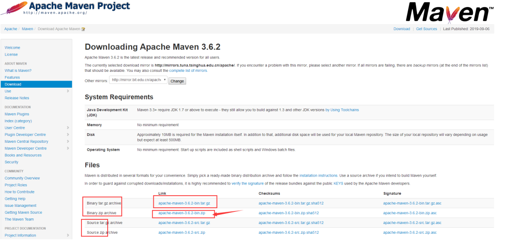

下载完成后，解压即可；

小狂神友情建议：电脑上的所有环境都放在一个文件夹下，方便管理；

### 5.3 配置maven环境变量

在我们的系统环境变量中

配置如下配置：

```java
M2_HOME  //maven目录下的bin目录
MAVEN_HOME //maven的目录
%MAVEN_HOME%\bin //在系统的path中配置
```

测试Maven是否安装成功，保证必须配置完毕！`mvn -version`


### 5.4 阿里云镜像


### 5.5 本地仓库


### 5.6 在IDEA中使用Maven


### 5.7 创建一个普通的Maven项目


### 5.8 标记文件夹功能


### 5.9 在IDEA中配置Tomcat


### 5.10 pom.xml文件


### 5.11 IDEA操作


### 5.12 解决遇到的问题

## 6. Servlet


### 6.1 Servlet简介

- Servlet就是sun公司开发动态web的一门技术
- Sun在这些API中提供一个接口叫做：Servlet，如果你想开发一个Servlet程序，只需完成两个小步骤：
  - 编写一个类，实现Servlet接口
  - 把开发好的Java类部署到web服务器中。

**把实现了Servlet接口的Java程序叫做，Servlet**


### 6.2 HelloServlet

*Serlvet接口Sun公司有两个默认的实现类：HttpServlet，GenericServlet*

1. 构建一个普通的Maven项目，删掉里面的src目录，以后我们的学习就在这个项目里面建立Moudel；这个空的工程就是Maven主工程；

2. 关于Maven父子工程的理解：

   父项目中会有

   ```xml
   <modules> 
       <module>servlet-01</module> 
   </modules>
   ```

   子项目会有

   ```xml
   <parent> 
       <artifactId>javaweb-02-servlet</artifactId> 
       <groupId>com.kuang</groupId> 
       <version>1.0-SNAPSHOT</version> 
   </parent>
   ```

   父项目中的java子项目可以直接使用`son extends father `

3. Maven环境优化

   - 修改web.xml为最新的
   - 将maven的结构搭建完整

4. 编写一个Servlet程序

   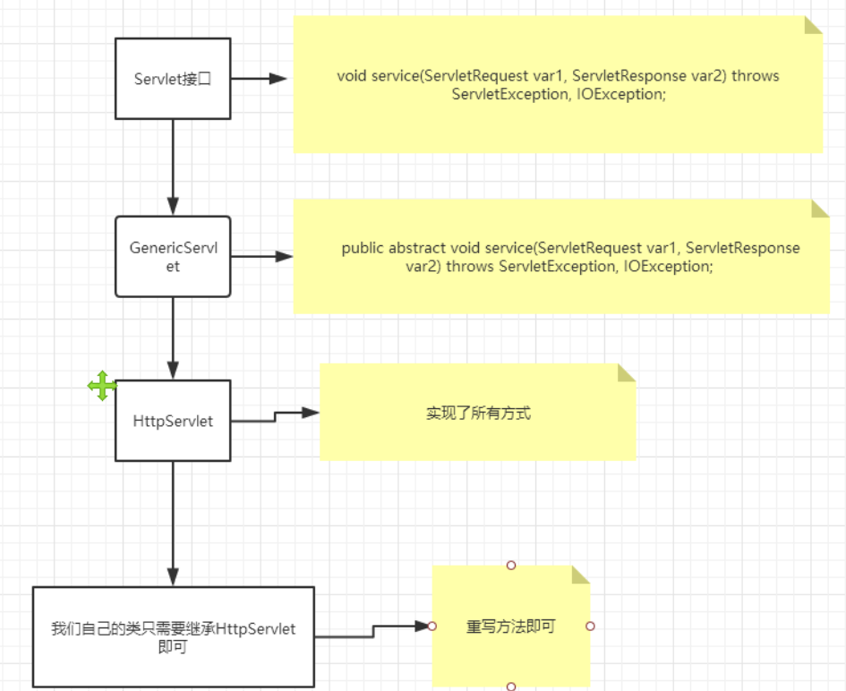

   - 编写一个普通类

   - 实现Servlet接口，这里我们直接继承HttpServlet

     ```java
     public class HelloServlet extends HttpServlet { 
         //由于get或者post只是请求实现的不同的方式，可以相互调用，业务逻辑都一样；
         @Override
         protected void doGet(HttpServletRequest req, HttpServletResponse resp) throws ServletException, IOException { 
             //ServletOutputStream outputStream = resp.getOutputStream(); 
             PrintWriter writer = resp.getWriter(); 
             //响应流 
             writer.print("Hello,Serlvet");
         }
         @Override 
         protected void doPost(HttpServletRequest req, HttpServletResponse resp) throws ServletException, IOException { 
             doGet(req, resp); 
         } 
     }
     ```

5. 编写Servlet的映射

   为什么需要映射：我们写的是JAVA程序，但是要通过浏览器访问，而浏览器需要连接web服务器，所以我们需要再web服务中注册我们写的Servlet，还需给他一个浏览器能够访问的路径；

   ```xml
   <!--注册Servlet--> 
   <servlet>
       <servlet-name>hello</servlet-name>
       <servlet-class>com.kuang.servlet.HelloServlet</servlet-class> 
   </servlet> 
   <!--Servlet的请求路径-->
   <servlet-mapping> 
       <servlet-name>hello</servlet-name>
       <url-pattern>/hello</url-pattern> 
   </servlet-mapping>
   ```

6. 配置Tomcat

   注意：配置项目发布的路径就可以了

7. 启动测试，OK！ 

### 6.3 Servlet原理

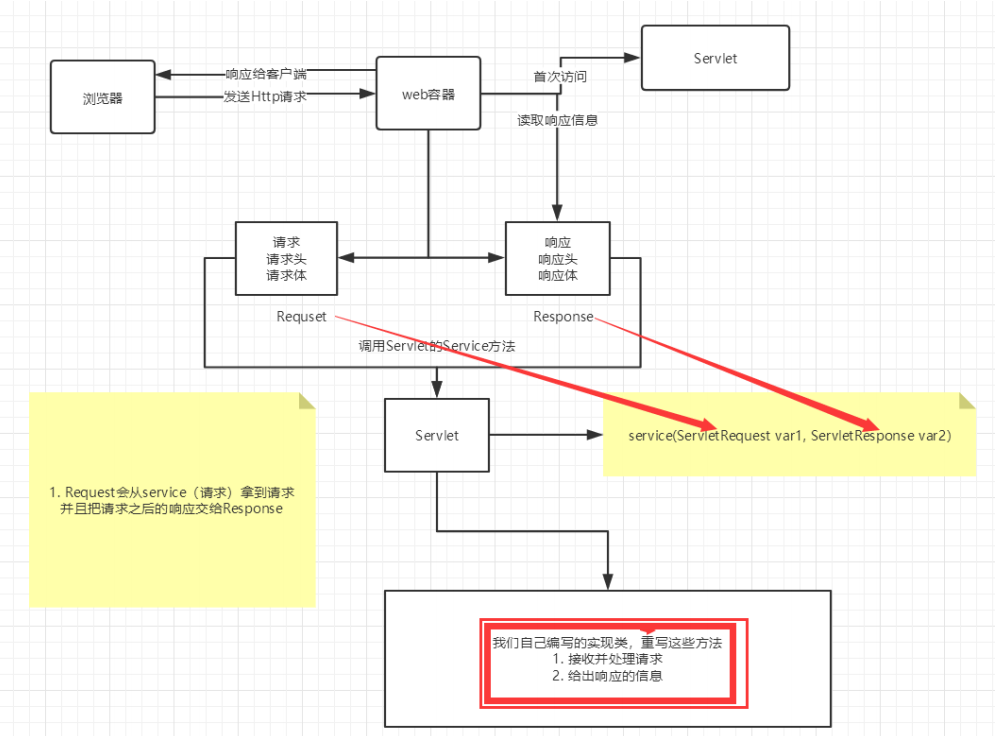

### 6.4 Mapping问题

1. 一个Servlet可以指定一个映射路径

   ```xml
   <servlet-mapping> 
       <servlet-name>hello</servlet-name>
       <url-pattern>/hello</url-pattern> 
   </servlet-mapping>
   ```

2. 一个Servlet可以指定多个映射路径

   ```xml
   <servlet-mapping> 
       <servlet-name>hello</servlet-name> 
       <url-pattern>/hello</url-pattern> 
   </servlet-mapping> 
   <servlet-mapping> 
       <servlet-name>hello</servlet-name> 
       <url-pattern>/hello2</url-pattern> 
   </servlet-mapping> 
   <servlet-mapping> 
       <servlet-name>hello</servlet-name>
       <url-pattern>/hello3</url-pattern> 
   </servlet-mapping> 
   <servlet-mapping> 
       <servlet-name>hello</servlet-name> 
       <url-pattern>/hello4</url-pattern>
   </servlet-mapping> 
   <servlet-mapping> 
       <servlet-name>hello</servlet-name>
       <url-pattern>/hello5</url-pattern>
   </servlet-mapping>
   ```

3. 一个Servlet可以指定通用映射路径

   ```xml
   <servlet-mapping>
       <servlet-name>hello</servlet-name>
       <url-pattern>/hello/*</url-pattern>
   </servlet-mapping>
   ```

4. 默认请求路径

   ```xml
   <!--默认请求路径--> 
   <servlet-mapping> 
       <servlet-name>hello</servlet-name> 
       <url-pattern>/*</url-pattern>
   </servlet-mapping>
   ```

5. 指定一些后缀或者前缀等等….

   ```xml
   <!--可以自定义后缀实现请求映射
    注意点，*前面不能加项目映射的路径 hello/sajdlkajda.qinjiang --> 
   <servlet-mapping>
       <servlet-name>hello</servlet-name>
       <url-pattern>*.qinjiang</url-pattern>
   </servlet-mapping>
   ```

6. 优先级问题

   指定了固有的映射路径优先级最高，如果找不到就会走默认的处理请求；

   ```xml
   <!--404--> 
   <servlet> 
       <servlet-name>error</servlet-name> 
       <servlet-class>com.kuang.servlet.ErrorServlet</servlet-class>
   </servlet>
   <servlet-mapping>
       <servlet-name>error</servlet-name>
       <url-pattern>/*</url-pattern>
   </servlet-mapping>
   ```

   

### 6.5 ServletContext

*web容器在启动的时候，它会为每个web程序都创建一个对应的ServletContext对象，它代表了当前的web应用；*


#### 6.5.1 共享数据

我在这个Servlet中保存的数据，可以在另外一个servlet中拿到；

```java
public class HelloServlet extends HttpServlet { 
    @Override 
    protected void doGet(HttpServletRequest req, HttpServletResponse resp) throws ServletException, IOException {
        //this.getInitParameter() 初始化参数 
        //this.getServletConfig() Servlet配置 
        //this.getServletContext() Servlet上下文 
        ServletContext context = this.getServletContext();
        String username = "秦疆"; //数据 
        context.setAttribute("username",username); //将一个数据保存在了 ServletContext中，名字为：username 。值 username
    }
}
```

```java
public class GetServlet extends HttpServlet { 
    @Override 
    protected void doGet(HttpServletRequest req, HttpServletResponse resp) throws ServletException, IOException {
        ServletContext context = this.getServletContext();
        String username = (String) context.getAttribute("username"); 
        resp.setContentType("text/html"); 
        resp.setCharacterEncoding("utf-8");
        resp.getWriter().print("名字"+username);
    }
    @Override
    protected void doPost(HttpServletRequest req, HttpServletResponse resp) throws ServletException, IOException {
        doGet(req, resp); 
    } 
}
```

```xml
<servlet> 
    <servlet-name>hello</servlet-name>
    <servlet-class>com.kuang.servlet.HelloServlet</servlet-class> 
</servlet>
<servlet-mapping>
    <servlet-name>hello</servlet-name>
    <url-pattern>/hello</url-pattern>
</servlet-mapping>
<servlet> 
    <servlet-name>getc</servlet-name>
    <servlet-class>com.kuang.servlet.GetServlet</servlet-class> 
</servlet> 
<servlet-mapping> 
    <servlet-name>getc</servlet-name>
    <url-pattern>/getc</url-pattern>
</servlet-mapping>
```

测试访问结果；


#### 6.5.2 获取初始化参数

```xml
<!--配置一些web应用初始化参数-->
<context-param>
    <param-name>url</param-name> 
    <param-value>jdbc:mysql://localhost:3306/mybatis</param-value> 
</context-param>
```

```java
protected void doGet(HttpServletRequest req, HttpServletResponse resp) throws ServletException, IOException {
    ServletContext context = this.getServletContext(); 
    String url = context.getInitParameter("url"); 
    resp.getWriter().print(url);
}
```


#### 6.5.3 请求转发

```java
@Override
protected void doGet(HttpServletRequest req, HttpServletResponse resp) throws ServletException, IOException { 
    ServletContext context = this.getServletContext(); 
    System.out.println("进入了ServletDemo04"); 
    //RequestDispatcher 
    requestDispatcher = context.getRequestDispatcher("/gp"); 
    //转发的请求路径 
    //requestDispatcher.forward(req,resp);
    //调用forward实现请求转发； 
    context.getRequestDispatcher("/gp").forward(req,resp);
}
```

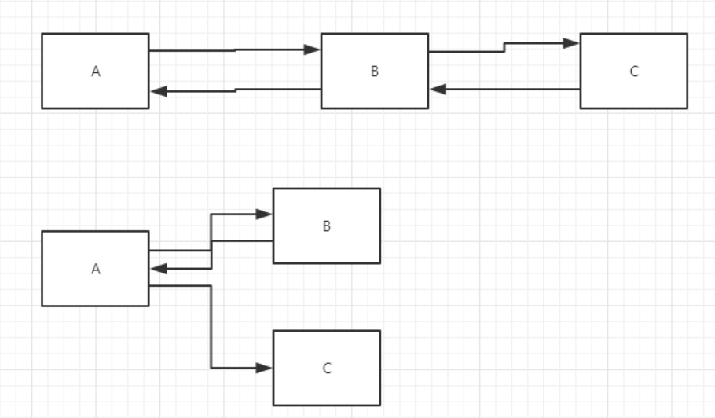

#### 6.5.4 读取资源文件

Properties

- 在java目录下新建properties
- 在resources目录下新建properties

发现：都被打包到了同一个路径下：classes，我们俗称这个路径为classpath:

思路：需要一个文件流；

```properties
username=root12312 
password=zxczxczxc
```

```java
public class ServletDemo05 extends HttpServlet {
    @Override
    protected void doGet(HttpServletRequest req, HttpServletResponse resp) throws ServletException, IOException { 
        InputStream is = this.getServletContext().getResourceAsStream("/WEB- INF/classes/com/kuang/servlet/aa.properties"); 
        Properties prop = new Properties(); prop.load(is); String user = prop.getProperty("username"); 
        String pwd = prop.getProperty("password"); 
        resp.getWriter().print(user+":"+pwd);
    }
    @Override 
    protected void doPost(HttpServletRequest req, HttpServletResponse resp) throws ServletException, IOException {
        doGet(req, resp); 
    } 
}
```

访问测试即可ok； 

### 6.6 HttpServletResponse

web服务器接收到客户端的http请求，针对这个请求，分别创建一个代表请求的HttpServletRequest对象，代表响应的一个HttpServletResponse；

- 如果要获取客户端请求过来的参数：找HttpServletRequest
- 如果要给客户端响应一些信息：找HttpServletResponse

#### 6.6.1 简单分类

负责向浏览器发送数据的方法

```java
ServletOutputStream getOutputStream() throws IOException; PrintWriter getWriter() throws IOException;
```

负责向浏览器发送响应头的方法

```java
void setCharacterEncoding(String var1);
void setContentLength(int var1); 
void setContentLengthLong(long var1);
void setContentType(String var1); 
void setDateHeader(String var1, long var2); 
void addDateHeader(String var1, long var2);
void setHeader(String var1, String var2);
void addHeader(String var1, String var2); 
void setIntHeader(String var1, int var2);
void addIntHeader(String var1, int var2);
```

响应的状态码

```java
int SC_CONTINUE = 100; 
int SC_SWITCHING_PROTOCOLS = 101; 
int SC_OK = 200; 
int SC_CREATED = 201; 
int SC_ACCEPTED = 202; 
int SC_NON_AUTHORITATIVE_INFORMATION = 203;
int SC_NO_CONTENT = 204; 
int SC_RESET_CONTENT = 205;
int SC_PARTIAL_CONTENT = 206; 
int SC_MULTIPLE_CHOICES = 300;
int SC_MOVED_PERMANENTLY = 301; 
int SC_MOVED_TEMPORARILY = 302;
int SC_FOUND = 302;
int SC_SEE_OTHER = 303; 
int SC_NOT_MODIFIED = 304;
int SC_USE_PROXY = 305;
int SC_TEMPORARY_REDIRECT = 307; 
int SC_BAD_REQUEST = 400; 
int SC_UNAUTHORIZED = 401;
int SC_PAYMENT_REQUIRED = 402;
int SC_FORBIDDEN = 403;
int SC_NOT_FOUND = 404; 
int SC_METHOD_NOT_ALLOWED = 405; 
int SC_NOT_ACCEPTABLE = 406;
int SC_PROXY_AUTHENTICATION_REQUIRED = 407;
int SC_REQUEST_TIMEOUT = 408; 
int SC_CONFLICT = 409; 
int SC_GONE = 410; 
int SC_LENGTH_REQUIRED = 411; 
int SC_PRECONDITION_FAILED = 412; 
int SC_REQUEST_ENTITY_TOO_LARGE = 413; 
int SC_REQUEST_URI_TOO_LONG = 414;
int SC_UNSUPPORTED_MEDIA_TYPE = 415; 
int SC_REQUESTED_RANGE_NOT_SATISFIABLE = 416; 
int SC_EXPECTATION_FAILED = 417;
int SC_INTERNAL_SERVER_ERROR = 500; 
int SC_NOT_IMPLEMENTED = 501; 
int SC_BAD_GATEWAY = 502; 
int SC_SERVICE_UNAVAILABLE = 503; 
int SC_GATEWAY_TIMEOUT = 504; 
int SC_HTTP_VERSION_NOT_SUPPORTED = 505;
```


#### 6.6.2 下载文件

1. 向浏览器输出消息 （一直在讲，就不说了）

2. 下载文件

   1. 要获取下载文件的路径
   2. 下载的文件名是啥？
   3. 设置想办法让浏览器能够支持下载我们需要的东西
   4. 获取下载文件的输入流
   5. 创建缓冲区
   6. 获取OutputStream对象
   7. 将FileOutputStream流写入到buffer缓冲区
   8. 使用OutputStream将缓冲区中的数据输出到客户端！

   ```java
   @Override 
   protected void doGet(HttpServletRequest req, HttpServletResponse resp) throws ServletException, IOException {
       // 1. 要获取下载文件的路径
       String realPath = "F:\\班级管理\\西开【19525】\\2、代码\\JavaWeb\\javaweb- 02-servlet\\response\\target\\classes\\秦疆.png"; 
       System.out.println("下载文件的路径："+realPath);
       // 2. 下载的文件名是啥？
       String fileName = realPath.substring(realPath.lastIndexOf("\\") + 1);
       // 3. 设置想办法让浏览器能够支持(Content-Disposition)下载我们需要的东西,中文文件 名URLEncoder.encode编码，否则有可能乱码 
       resp.setHeader("Content- Disposition","attachment;filename="+URLEncoder.encode(fileName,"UTF-8")); 
       // 4. 获取下载文件的输入流
       FileInputStream in = new FileInputStream(realPath); 
       // 5. 创建缓冲区
       int len = 0; byte[] buffer = new byte[1024]; 
       // 6. 获取OutputStream对象 
       ServletOutputStream out = resp.getOutputStream(); 
       // 7. 将FileOutputStream流写入到buffer缓冲区,使用OutputStream将缓冲区中的数据 输出到客户端！
       while ((len=in.read(buffer))>0){
           out.write(buffer,0,len); 
       }
       in.close();
       out.close(); 
   }
   ```

   

#### 6.6.3 验证码功能

验证怎么来的？

- 前端实现

- 后端实现，需要用到 Java 的图片类，生产一个图片

  ```java
  public class ImageServlet extends HttpServlet { 
      @Override 
      protected void doGet(HttpServletRequest req, HttpServletResponse resp) throws ServletException, IOException {
          //如何让浏览器3秒自动刷新一次; 
          resp.setHeader("refresh","3"); 
          //在内存中创建一个图片 
          BufferedImage image = new BufferedImage(80,20,BufferedImage.TYPE_INT_RGB);
          //得到图片 
          Graphics2D g = (Graphics2D) image.getGraphics(); 
          //笔 
          //设置图片的背景颜色 
          g.setColor(Color.white);
          g.fillRect(0,0,80,20);
          //给图片写数据
          g.setColor(Color.BLUE);
          g.setFont(new Font(null,Font.BOLD,20)); 
          g.drawString(makeNum(),0,20); 
          //告诉浏览器，这个请求用图片的方式打开 
          resp.setContentType("image/jpeg");
          //网站存在缓存，不让浏览器缓存 
          resp.setDateHeader("expires",-1);
          resp.setHeader("Cache-Control","no-cache"); 
          resp.setHeader("Pragma","no-cache");
          //把图片写给浏览器 
          ImageIO.write(image,"jpg", resp.getOutputStream());
      }
      //生成随机数
      private String makeNum(){ 
          Random random = new Random(); 
          String num = random.nextInt(9999999) + "";
          StringBuffer sb = new StringBuffer(); 
          for (int i = 0; i < 7-num.length() ; i++) {
              sb.append("0"); 
          }
          num = sb.toString() + num; return num; 
      }
      @Override 
      protected void doPost(HttpServletRequest req, HttpServletResponse resp) throws ServletException, IOException { 
          doGet(req, resp);
      } 
  }
  ```

  

#### 6.6.4 实现重定向

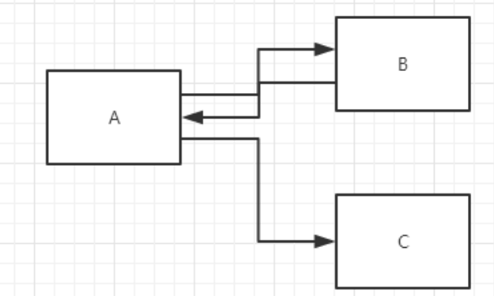

B一个web资源收到客户端A请求后，B他会通知A客户端去访问另外一个web资源C，这个过程叫重定向

常见场景：

- 用户登录

  ```java
  void sendRedirect(String var1) throws IOException;
  ```

  测试：

  ```java
  @Override 
  protected void doGet(HttpServletRequest req, HttpServletResponse resp) throws ServletException, IOException { 
      /* resp.setHeader("Location","/r/img"); resp.setStatus(302); */ 
      resp.sendRedirect("/r/img");
      //重定向
  }
  ```

面试题：请你聊聊重定向和转发的区别？

**相同点**

- 页面都会实现跳转

**不同点**

- 请求转发的时候，url不会产生变化
- 重定向时候，url地址栏会发生变化；

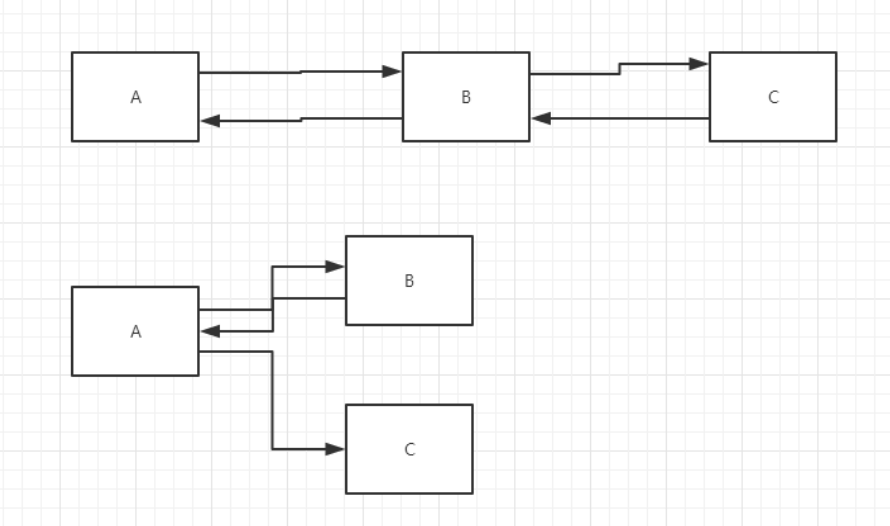

#### 6.6.5 简单实现登录重定向

```html
<%--这里提交的路径，需要寻找到项目的路径--%>
    <%--${pageContext.request.contextPath}代表当前的项目--%> 
        <form action="${pageContext.request.contextPath}/login" method="get"> 
            用户名：<input type="text" name="username"> <br> 
            密码：<input type="password" name="password"> <br> 
            <input type="submit"> 
        </form>
```

```java
@Override 
protected void doGet(HttpServletRequest req, HttpServletResponse resp) throws ServletException, IOException { 
    //处理请求 
    String username = req.getParameter("username"); 
    String password = req.getParameter("password"); 
    System.out.println(username+":"+password); 
    //重定向时候一定要注意，路径问题，否则404； 
    resp.sendRedirect("/r/success.jsp");
}
```

```xml
<servlet>
    <servlet-name>requset</servlet-name>
    <servlet-class>com.kuang.servlet.RequestTest</servlet-class> 
</servlet>
<servlet-mapping>
    <servlet-name>requset</servlet-name>
    <url-pattern>/login</url-pattern>
</servlet-mapping>
```


```html
<%@ page contentType="text/html;charset=UTF-8" language="java" %> 
    <html>
        <head>
            <title>Title</title>
        </head>
        <body> 
            <h1>Success</h1>
        </body>
    </html>
```


### 6.7 HttpServeltRequest

HttpServletRequest代表客户端的请求，用户通过Http协议访问服务器，HTTP请求中的所有信息会被封装到HttpServletRequest，通过这个HttpServletRequest的方法，获得客户端的所有信息；

#### 6.7.1 获取参数,请求转发

```java
@Override
protected void doGet(HttpServletRequest req, HttpServletResponse resp) throws ServletException, IOException { 
    req.setCharacterEncoding("utf-8");
    resp.setCharacterEncoding("utf-8"); 
    String username = req.getParameter("username"); 
    String password = req.getParameter("password");
    String[] hobbys = req.getParameterValues("hobbys"); 
    System.out.println("=============================");
    //后台接收中文乱码问题 
    System.out.println(username);
    System.out.println(password); 
    System.out.println(Arrays.toString(hobbys)); 
    System.out.println("============================="); 
    System.out.println(req.getContextPath()); 
    //通过请求转发 //这里的 / 代表当前的web应用 
    req.getRequestDispatcher("/success.jsp").forward(req,resp); 
}
```

**面试题：请你聊聊重定向和转发的区别？**

**相同点**

- 页面都会实现跳转

**不同点**

- 请求转发的时候，url不会产生变化 307
- 重定向时候，url地址栏会发生变化； 302

## 7. Cookie和Session


### 7.1 会话

**会话**：用户打开一个浏览器，点击了很多超链接，访问多个web资源，关闭浏览器，这个过程可以称之为会话；

**有状态会话**：一个同学来过教室，下次再来教室，我们会知道这个同学，曾经来过，称之为有状态会话；

**你能怎么证明你是西开的学生？**

你 西开

1. 发票 西开给你发票

2. 学校登记 西开标记你来过了


**一个网站，怎么证明你来过？**

客户端 服务端

1. 服务端给客户端一个 信件，客户端下次访问服务端带上信件就可以了； cookie

2. 服务器登记你来过了，下次你来的时候我来匹配你； seesion

### 7.2 保存会话的两种技术

**cookie**

- 客户端技术 （响应，请求）

**session**

- 服务器技术，利用这个技术，可以保存用户的会话信息？ 我们可以把信息或者数据放在Session

中！

常见常见：网站登录之后，你下次不用再登录了，第二次访问直接就上去了！

### 7.3 Cookie

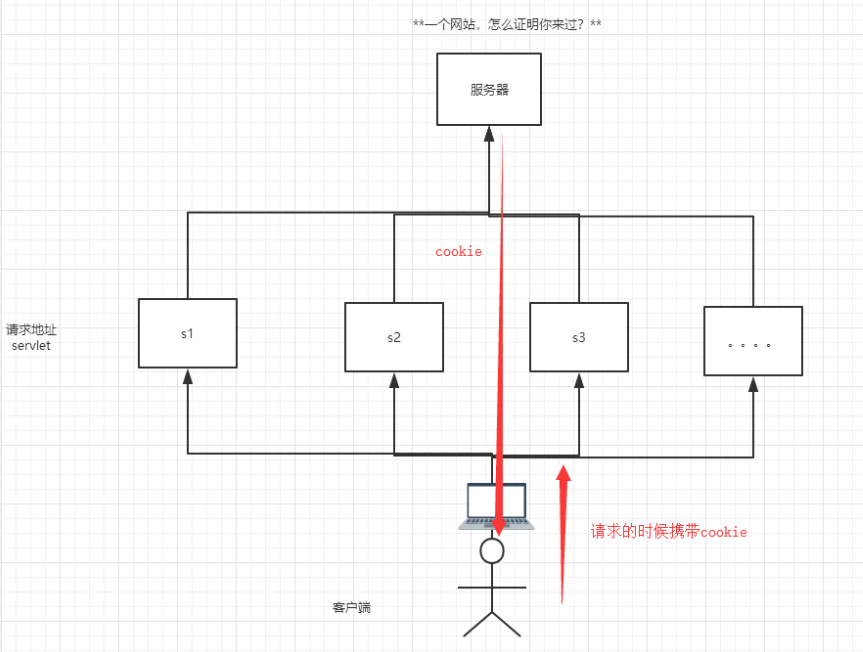

1. 从请求中拿到cookie信息

2. 服务器响应给客户端cookie

   ```java
   Cookie[] cookies = req.getCookies(); 
   //获得Cookie
   cookie.getName();
   //获得cookie中的key 
   cookie.getValue(); 
   //获得cookie中的vlaue
   new Cookie("lastLoginTime", System.currentTimeMillis()+"");
   //新建一个cookie 
   cookie.setMaxAge(24*60*60); 
   //设置cookie的有效期 
   resp.addCookie(cookie);
   //响应给客户端一个cookie
   ```

   **cookie：一般会保存在本地的 用户目录下 appdata；**

一个网站cookie是否存在上限！**聊聊细节问题**

- 一个Cookie只能保存一个信息；
- 一个web站点可以给浏览器发送多个cookie，最多存放20个cookie；
- Cookie大小有限制4kb；
- 300个cookie浏览器上限

**删除Cookie；**

- 不设置有效期，关闭浏览器，自动失效；
- 设置有效期时间为 0 ；


**编码解码：**

```java
URLEncoder.encode("秦疆","utf-8") 
URLDecoder.decode(cookie.getValue(),"UTF-8")
```


### 7.4 Session(重难点)

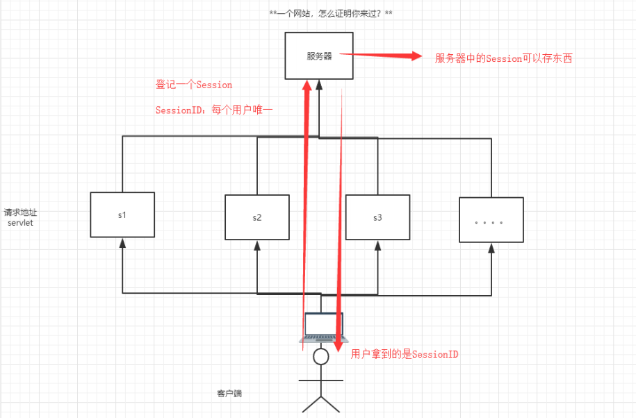

什么是Session：

- 服务器会给每一个用户（浏览器）创建一个Seesion对象；
- 一个Seesion独占一个浏览器，只要浏览器没有关闭，这个Session就存在；
- 用户登录之后，整个网站它都可以访问！--> 保存用户的信息；保存购物车的信息…..


**Session和cookie的区别：**

- Cookie是把用户的数据写给用户的浏览器，浏览器保存 （可以保存多个）
- Session把用户的数据写到用户独占Session中，服务器端保存 （保存重要的信息，减少服务器资源的浪费）
- Session对象由服务创建；


**使用场景：**

- 保存一个登录用户的信息；
- 购物车信息；
- 在整个网站中经常会使用的数据，我们将它保存在Session中；

**使用Session：** 

```java
public class SessionDemo01 extends HttpServlet {
    @Override 
    protected void doGet(HttpServletRequest req, HttpServletResponse resp) throws ServletException, IOException {
        //解决乱码问题
        req.setCharacterEncoding("UTF-8");
        resp.setCharacterEncoding("UTF-8"); 
        resp.setContentType("text/html;charset=utf-8");
        //得到Session 
        HttpSession session = req.getSession();
        //给Session中存东西 
        session.setAttribute("name",new Person("秦疆",1));
        //获取Session的ID 
        String sessionId = session.getId(); 
        //判断Session是不是新创建 
        if (session.isNew()){ 
            resp.getWriter().write("session创建成功,ID:"+sessionId);
        }else { 
            resp.getWriter().write("session以及在服务器中存在 了,ID:"+sessionId);
        }
        //Session创建的时候做了什么事情；
        // Cookie
        cookie = new Cookie("JSESSIONID",sessionId); // resp.addCookie(cookie); 
    }
    @Override 
    protected void doPost(HttpServletRequest req, HttpServletResponse resp) throws ServletException, IOException {
        doGet(req, resp);
    } 
}
//得到Session 
HttpSession session = req.getSession();
Person person = (Person) session.getAttribute("name"); 
System.out.println(person.toString()); 
HttpSession session = req.getSession();
session.removeAttribute("name"); 
//手动注销Session
session.invalidate();
```

**会话自动过期：web.xml配置**

```xml
<!--设置Session默认的失效时间--> 
<session-config>
    <!--15分钟后Session自动失效，以分钟为单位-->
    <session-timeout>15</session-timeout>
</session-config>
```

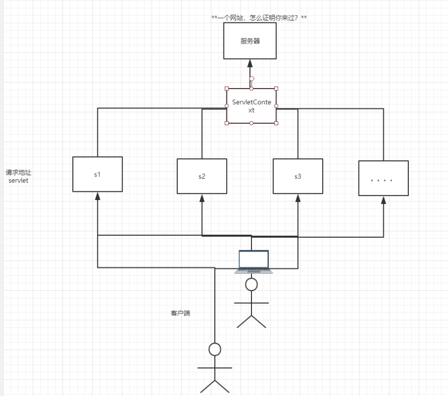


## 8. JSP


### 8.1 什么是JSP

Java Server Pages ： Java服务器端页面，也和Servlet一样，用于动态Web技术！

最大的特点：

- 写JSP就像在写HTML
- 区别：
  - HTML只给用户提供静态的数据
  - JSP页面中可以嵌入JAVA代码，为用户提供动态数据；

### 8.2 JSP原理


### 8.3 JSP基础语法

#### 8.3.1 JSP表达式

#### 8.3.2 JSP脚本片段

#### 8.3.3 JSP声明

### 8.4 JSP指令


### 8.5. 九大内置对象


### 8.6. JSP标签丶JSTL标签丶EL表达式

## 9. JavaBean


**实体类**

JavaBean有特定的写法：

- 必须要有一个无参构造
- 属性必须私有化
- 必须有对应的get/set方法；

一般用来和数据库的字段做映射 ORM；

ORM ：对象关系映射

- 表--->类
- 字段-->属性
- 行记录---->对象


**people表**

| id   | name    | age  | address |
| ---- | ------- | ---- | ------- |
| 1    | 秦疆1号 | 3    | 西安    |
| 2    | 秦疆2号 | 18   | 西安    |
| 3    | 秦疆3号 | 100  | 西安    |

```java
class People{
    private int id; 
    private String name; 
    private int id;
    private String address; 
}
class A{ 
    new People(1,"秦疆1号",3，"西安");
    new People(2,"秦疆2号",3，"西安");
    new People(3,"秦疆3号",3，"西安");
}
```


## 10. MVC三层架构


*什么是MVC： Model view Controller 模型、视图、控制器*

### 10.1 早些年

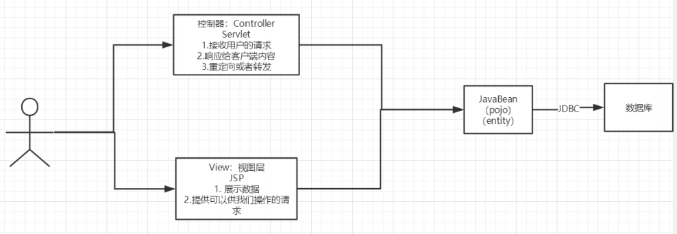

用户直接访问控制层，控制层就可以直接操作数据库；

```
servlet--CRUD-->数据库 
弊端：程序十分臃肿，不利于维护 
servlet的代码中：处理请求、响应、视图跳转、处理JDBC、处理业务代码、处理逻辑代码 

架构：没有什么是加一层解决不了的！ 
程序猿调用
|
JDBC
|
Mysql Oracle SqlServer ....
```


### 10.2 MVC三层架构

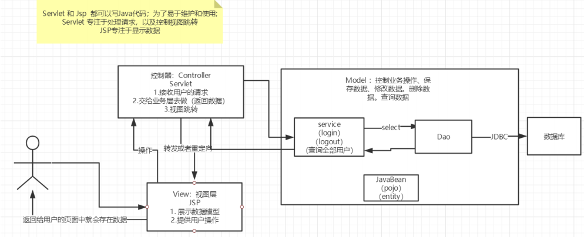

**Model**

- 业务处理 ：业务逻辑（Service）
- 数据持久层：CRUD （Dao）

**View**

- 展示数据

- 提供链接发起Servlet请求 （a，form，img…）Controller （Servlet）

- 接收用户的请求 ：（req：请求参数、Session信息….）

- 交给业务层处理对应的代码

- 控制视图的跳转 

  ```
  登录--->接收用户的登录请求--->处理用户的请求（获取用户登录的参数，username， password）---->交给业务层处理登录业务（判断用户名密码是否正确：事务）--->Dao层查询用 户名和密码是否正确-->数据库
  ```

  

## 11. Filter过滤器


### 11.1 Filter作用

Filter：过滤器 ，用来过滤网站的数据；

- 处理中文乱码
- 登录验证….

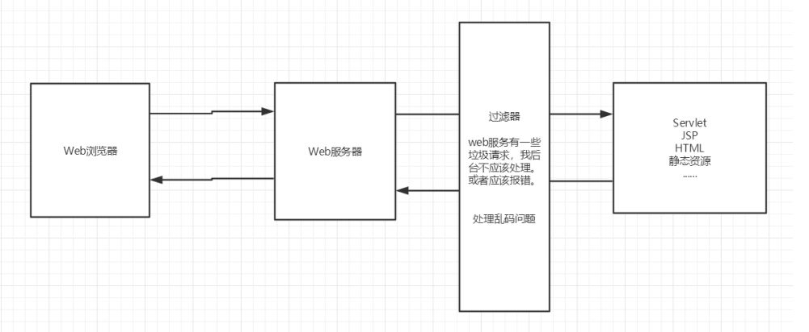


### 11.2 Filter开发步骤

1. 导包

2. 编写过滤器

   - 导包不要错

     实现Filter接口，重写对应的方法即可

     ```java
     public class CharacterEncodingFilter implements Filter { 
         //初始化：web服务器启动，就以及初始化了，随时等待过滤对象出现！
         public void init(FilterConfig filterConfig) throws ServletException {
             System.out.println("CharacterEncodingFilter初始化"); 
         }
         //Chain : 链 
         /*
         1. 过滤中的所有代码，在过滤特定请求的时候都会执行
         2. 必须要让过滤器继续同行
         chain.doFilter(request,response);
         */ 
         public void doFilter(ServletRequest request, ServletResponse response, FilterChain chain) throws IOException, ServletException {
             request.setCharacterEncoding("utf-8"); 
             response.setCharacterEncoding("utf-8"); 
             response.setContentType("text/html;charset=UTF-8"); 
             System.out.println("CharacterEncodingFilter执行前....");
             chain.doFilter(request,response);//让我们的请求继续走，如果不 写，程序到这里就被拦截停止！ 
             System.out.println("CharacterEncodingFilter执行后...."); }
         //销毁：web服务器关闭的时候，过滤会销毁 
         public void destroy() { 
             System.out.println("CharacterEncodingFilter销毁");
         } 
     }
     ```

3. 在web.xml中配置 Filter

   ```xml
   <filter> 
       <filter-name>CharacterEncodingFilter</filter-name>
       <filter-class>com.kuang.filter.CharacterEncodingFilter</filter- class>
   </filter>
   <filter-mapping> 
       <filter-name>CharacterEncodingFilter</filter-name>
       <!--只要是 /servlet的任何请求，会经过这个过滤器--> 
       <url-pattern>/servlet/*</url-pattern>
       <!--<url-pattern>/*</url-pattern>--> 
   </filter-mapping>
   ```

   

## 12. Listener监听器


*实现一个监听器的接口；（有N种）*

1. 编写一个监听器

   实现监听器的接口… 

   ```java
   //统计网站在线人数 ： 统计session 
   public class OnlineCountListener implements HttpSessionListener {
       //创建session监听： 看你的一举一动
       //一旦创建Session就会触发一次这个事件！ 
       public void sessionCreated(HttpSessionEvent se) { 
           ServletContext ctx = se.getSession().getServletContext(); 
           System.out.println(se.getSession().getId());
           Integer onlineCount = (Integer) ctx.getAttribute("OnlineCount");
           if (onlineCount==null){
               onlineCount = new Integer(1);
           }else { 
               int count = onlineCount.intValue(); 
               onlineCount = new Integer(count+1); 
           }ctx.setAttribute("OnlineCount",onlineCount);
       }
       //销毁session监听
       //一旦销毁Session就会触发一次这个事件！ 
       public void sessionDestroyed(HttpSessionEvent se) { 
           ServletContext ctx = se.getSession().getServletContext(); 
           Integer onlineCount = (Integer) ctx.getAttribute("OnlineCount");
           if (onlineCount==null){
               onlineCount = new Integer(0);
           }else {
               int count = onlineCount.intValue();
               onlineCount = new Integer(count-1); 
           }ctx.setAttribute("OnlineCount",onlineCount);
       }
       /*Session销毁：
       1. 手动销毁 getSession().invalidate(); 
       2. 自动销毁
       */
   }
   ```

2. web.xml中注册监听器

   ```xml
   <!--注册监听器--> 
   <listener> 
       <listener-class>com.kuang.listener.OnlineCountListener</listener- class> 
   </listener>
   ```

3. 看情况是否使用！

## 13. 过滤器 & 监听器常见应用


监听器：GUI编程中经常使用；

```java
public class TestPanel { 
    public static void main(String[] args) {
        Frame frame = new Frame("中秋节快乐"); 
        //新建一个窗体 
        Panel panel = new Panel(null);
        //面板
        frame.setLayout(null); 
        //设置窗体的布局 
        frame.setBounds(300,300,500,500);
        frame.setBackground(new Color(0,0,255)); 
        //设置背景颜色 
        panel.setBounds(50,50,300,300);
        panel.setBackground(new Color(0,255,0)); 
        //设置背景颜色 
        frame.add(panel);
        frame.setVisible(true); 
        //监听事件，监听关闭事件
        frame.addWindowListener(new WindowAdapter() {
            @Override 
            public void windowClosing(WindowEvent e) { 
                super.windowClosing(e); 
            }
        }); 
    } 
}
```


用户登录之后才能进入主页！用户注销后就不能进入主页了！

1. 用户登录之后，向Sesison中放入用户的数据

2. 进入主页的时候要判断用户是否已经登录；要求：在过滤器中实现！

   ```java
   HttpServletRequest request = (HttpServletRequest) req; 
   HttpServletResponse response = (HttpServletResponse) resp; 
   if (request.getSession().getAttribute(Constant.USER_SESSION)==null){ 
       response.sendRedirect("/error.jsp"); 
   }
   chain.doFilter(request,response);
   ```

   

## 14. JDBC


### 14.1 什么是JDBC

*什么是JDBC ： Java连接数据库！*

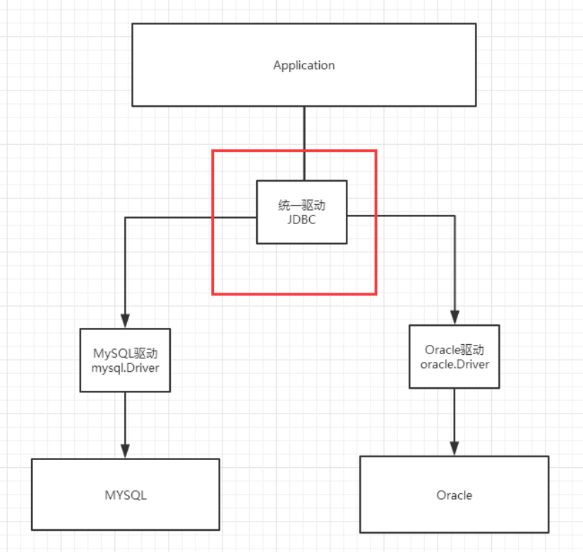

### 14.2 实验环境搭建

*需要的jar包*

- java.sql
- javax.sql
- mysql-conneter-java… 连接驱动（必须要导入）

#### 14.2.1 需要的数据库

```sql
CREATE TABLE users( 
    id INT PRIMARY KEY, 
    `name` VARCHAR(40), 
    `password` VARCHAR(40), 
    email VARCHAR(60), 
    birthday DATE 
);
INSERT INTO users(id,`name`,`password`,email,birthday) VALUES(1,'张三','123456','zs@qq.com','2000-01-01'); 
INSERT INTO users(id,`name`,`password`,email,birthday) VALUES(2,'李四','123456','ls@qq.com','2000-01-01'); 
INSERT INTO users(id,`name`,`password`,email,birthday) VALUES(3,'王五','123456','ww@qq.com','2000-01-01'); 
SELECT * FROM users;
```

#### 14.2.2 导入数据库依赖

```xml
<!--mysql的驱动--> 
<dependency>
    <groupId>mysql</groupId> 
    <artifactId>mysql-connector-java</artifactId> 
    <version>5.1.47</version>
</dependency>
```

2.3 IDEA中连接数据库


### 14.3. JDBC相关操作


#### 14.3.1 JDBC固定步骤

1. 加载驱动
2. 连接数据库,代表数据库
3. 向数据库发送SQL的对象Statement : CRUD
4. 编写SQL （根据业务，不同的SQL） 5. 执行SQL
5. 关闭连接

```java
public class TestJdbc { 
    public static void main(String[] args) throws ClassNotFoundException, SQLException { 
        //配置信息 
        //useUnicode=true&characterEncoding=utf-8 解决中文乱码 
        String url="jdbc:mysql://localhost:3306/jdbc? useUnicode=true&characterEncoding=utf-8"; 
        String username = "root"; 
        String password = "123456";
        //1.加载驱动 
        Class.forName("com.mysql.jdbc.Driver");
        //2.连接数据库,代表数据库
        Connection connection = DriverManager.getConnection(url, username, password);
        //3.向数据库发送SQL的对象Statement,PreparedStatement : CRUD 
        Statement statement = connection.createStatement(); 
        //4.编写SQL 
        String sql = "select * from users"; 
        //5.执行查询SQL，返回一个 ResultSet ： 结果集 
        ResultSet rs = statement.executeQuery(sql);
        while (rs.next()){ 
            System.out.println("id="+rs.getObject("id")); 
            System.out.println("name="+rs.getObject("name")); 
            System.out.println("password="+rs.getObject("password")); 
            System.out.println("email="+rs.getObject("email")); 
            System.out.println("birthday="+rs.getObject("birthday")); 
        }
        //6.关闭连接，释放资源（一定要做） 先开后关 
        rs.close(); 
        statement.close();
        connection.close();
    } 
}
```


#### 14.3.2 预编译SQL

```java
public class TestJDBC2 { 
    public static void main(String[] args) throws Exception {
        //配置信息 
        //useUnicode=true&characterEncoding=utf-8 解决中文乱码
        String url="jdbc:mysql://localhost:3306/jdbc? useUnicode=true&characterEncoding=utf-8"; 
        String username = "root";
        String password = "123456";
        //1.加载驱动 
        Class.forName("com.mysql.jdbc.Driver"); 
        //2.连接数据库,代表数据库 
        Connection connection = DriverManager.getConnection(url, username, password);
        //3.编写SQL 
        String sql = "insert into users(id, name, password, email, birthday) values (?,?,?,?,?);"; 
        //4.预编译 
        PreparedStatement preparedStatement = connection.prepareStatement(sql); 
        preparedStatement.setInt(1,2);
        //给第一个占位符？ 的值赋值为1；
        preparedStatement.setString(2,"狂神说Java");
        //给第二个占位符？ 的值赋值为 狂神说Java；
        preparedStatement.setString(3,"123456");
        //给第三个占位符？ 的值赋值为 123456； 
        preparedStatement.setString(4,"24736743@qq.com");
        //给第四个占位符？ 的 值赋值为1；
        preparedStatement.setDate(5,new Date(new java.util.Date().getTime()));
        //给第五个占位符？ 的值赋值为new Date(new java.util.Date().getTime();
        //5.执行SQL 
        int i = preparedStatement.executeUpdate(); 
        if (i>0){ 
            System.out.println("插入成功@"); 
        }
        //6.关闭连接，释放资源（一定要做） 先开后关
        preparedStatement.close(); 
        connection.close();
    } 
}
```

#### 14.3.3 事务

要么都成功，要么都失败！

ACID原则：保证数据的安全。

```
开启事务 事务提交 
commit() 事务回滚 
rollback() 关闭事务 
转账： 
	A:1000 
	B:1000 
	A(900) --100--> B(1100)
```


### 14.4 junit单元测试

#### 14.4.1 依赖

```xml
<!--单元测试--> 
<dependency> 
    <groupId>junit</groupId>
    <artifactId>junit</artifactId>
    <version>4.12</version> 
</dependency>
```

#### 14.4.2 简单使用

@Test注解只有在方法上有效，只要加了这个注解的方法，就可以直接运行！

```java
@Test
public void test(){ 
    System.out.println("Hello");
}
```

#### 14.4.3 搭建一个环境

```sql
CREATE TABLE account(
    id INT PRIMARY KEY AUTO_INCREMENT, 
    `name` VARCHAR(40),
    money FLOAT 
);

INSERT INTO account(`name`,money) VALUES('A',1000); 
INSERT INTO account(`name`,money) VALUES('B',1000);
INSERT INTO account(`name`,money) VALUES('C',1000);
```


#### 14.4.4 测试

```java
@Test
public void test() { 
    //配置信息 
    //useUnicode=true&characterEncoding=utf-8 解决中文乱码 String url="jdbc:mysql://localhost:3306/jdbc? useUnicode=true&characterEncoding=utf-8"; 
    String username = "root"; 
    String password = "123456"; 
    Connection connection = null; 
    //1.加载驱动 
    try {
        Class.forName("com.mysql.jdbc.Driver"); 
        //2.连接数据库,代表数据库 
        connection = DriverManager.getConnection(url, username, password);
        //3.通知数据库开启事务,false 开启 
        connection.setAutoCommit(false); 
        String sql = "update account set money = money-100 where name = 'A'"; 
        connection.prepareStatement(sql).executeUpdate();
        //制造错误
        //int i = 1/0; 
        String sql2 = "update account set money = money+100 where name = 'B'"; 
        connection.prepareStatement(sql2).executeUpdate(); connection.commit();
        //以上两条SQL都执行成功了，就提交事务！ 
        System.out.println("success"); 
    } catch (Exception e) { 
        try {
            //如果出现异常，就通知数据库回滚事务 
            connection.rollback();
        } catch (SQLException e1) {
            e1.printStackTrace();
        }e.printStackTrace(); 
    }finally { 
        try {
            connection.close();
        } catch (SQLException e) {
            e.printStackTrace(); 
        }
    }
}
```

