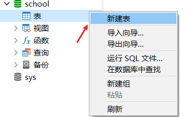

# MySQL基础

## 1. 初识MySQL


**JavaEE：** 企业级Java开发Web

**前端:** 页面,用于展示数据

**后台:** 连接点,连接数据库例如:JDBC,mybatis，用于链接前端（控制，控制视图跳转，和给前端传递数据））

**数据库:** 用于存数据;存数据的其他方式: Txt，Excel，word

> **计算机科普:** 只会写代码的是码农；学好数据库，基本能混口饭吃；在此基础上再学好<u>操作系统</u>和<u>计算机网络</u>，就能当一个不错的程序员。如果能再把<u>离散数学</u>、<u>数字电路</u>、<u>体系结构</u>、<u>数据结构/算法</u>、<u>编译原理</u>学通透，再加上丰富的实践经验与领域特定知识，就能算是一个优秀的工程师了。

### 1. 为什么学习数据库

1、岗位技能需求

2、现在的世界，得数据者得天下

3、存储数据的方法

4、程序，网站中，大量数据如何长久保存？

5、**数据库是几乎软件体系中最核心的一个存在** DBA(数据库管理员)。

### 2. 什么是数据库

数据库（DataBase，简称DB）

**概念:** 长期存放在计算机内，有组织，可共享的大量数据的集合，是一个数据“仓库”
**作用:** 保存，并能安全管理数据（如：增删改查等），减少冗余.…
**数据库总览:**

- <u>关系型数据库</u>（SQL）
  - MySQL，Oracle，SQL Server，SQLite，DB2，.…
  - 关系型数据库通过外键关联来建立表与表之间的关系
- <u>非关系型数据库</u>（NOSQL）Not only SQL
  - Redis，MongoDB，…
  - 非关系型数据库通常指数据以对象的形式存储在数据库中，而对象之间的关系通过每个对象自身的属性来决定 

### 3. 什么是DBMS

数据库管理系统（**D**ata**B**ase **M**anagement **S**ystem）
数据库管理软件，科学组织和存储数据，高效地获取和维护数据,MySQL应该算是一个数据库管理系统


### 4. MySQL简介

**概念：**是现在流行的开源的，免费的关系型数据库

**历史：**由瑞典MySQL AB公司开发，目前属于Oracle 旗下产品。

**特点：**

- 免费，开源数据库
- 小巧，功能齐全
- 使用便捷
- 可运行于Windows或Linux操作系统
- 可适用于中小型甚至大型网站应用

**官网：**https://www.mysql.com/

### 5. Windows安装MySQL5.7绿色版

建议使用压缩版，安装快，方便.不复杂.建议不要使用exe版本,卸载时不方便

#### 5.1 软件下载

mysql5.7 64位下载地址: https://dev.mysql.com/get/Downloads/MySQL-5.7/mysql-5.7.19-winx64.zip

#### 5.2 安装步骤

1. 下载后得到zip压缩包. 

2. 解压到自己想要安装到的目录

   - 例如: 解压到的是D:\environment\mysql-5.7.19
   - 友情提示: 最好将所有的开发环境都装到非系统盘的自建环境文件夹下方便管理

   

3. 添加环境变量：我的电脑->属性->高级->环境变量

   > 在DOS命令行窗口进入 **安装目录****\mysql\bin**
   >
   > 可设置环境变量，设置了环境变量，可以在任意目录打开！

   - 创建`MYSQL_HOME`

     

   - 配置`path` ,配置mysql的bin

     

4. mysql安装目录下新建mysql配置文件my.ini添加如下内容

   ```ini
   # mysqld组表示mysql的服务启动参数配置
   [mysqld] 
   # 基础目录,即mysql的解压目录
   basedir=D:\environment\mysql-5.7.19-winx64
   # 数据目录,这样配置后会自动创建data目录
   datadir=D:\environment\mysql-5.7.19-winx64\data\ 
   # 端口号配置
   port=3306  
   # 跳过权限验证(密码验证)
   skip-grant-tables
   ```

5. 启动**管理员模式下的CMD**，并将路径切换至mysql下的bin目录，然后输入`mysqld –install `(安装mysql服务)  *ps: 删除mysql服务: sc delete mysql*

6. 再输入 `mysqld --initialize-insecure --user=mysql` 初始化数据文件

   

7. 启动mysql服务`net start mysql`

   

   

8. 然后再次启动mysql 然后用命令 mysql –u root –p 进入mysql管理界面（密码为空,直接回车）

   

9. 进入界面后更改root密码

   ```sql
   update mysql.user set authentication_string=password('1234') where user='root' and Host = 'localhost';
   ```

10. 刷新权限

    ```sql
    flush privileges;
    ```

11. 注释掉my.ini文件删除最后一句skip-grant-tables

12. 重启mysql即可正常使用

    ```bash
    # 停止mysql服务
    net stop mysql 
    # 开启mysql服务
    net start mysql
    ```

13. 连接上测试出现以下结果就安装好了

    


### 6. SQLyog

可手动操作,管理MySQL数据库的软件工具

特点 : 简洁 , 易用 , 图形化


*ps: 课程用的是sqlyog,我自己用的是navicate15,操作都差不多 ;[Navicate15安装教程]()*

使用~~SQLyog~~ **Navicate15** 管理工具自己完成以下操作 : 

1. 连接本地MySQL数据库

   

   

   

2. 新建school数据库

   

   

3. 新建一张表student

   

   创建列

   

   插入数据

   

   ```sql
   -- 字段 
   GradeID : int(11) , Primary Key (pk)
   GradeName : varchar(50)
   ```

4. 在历史记录中可以看到相对应的数据库操作的语句 


### 7.  MySQL基本常用命令

```sql
-- 1. 查看MySQL版本
select version();
-- 2. 修改密码
update user set password=password('123456')where user='root'; 
-- 3. 刷新数据库
flush privileges;
-- 4. 显示所有数据库
show databases;
-- 5. 打开某个数据库
use dbname； 
-- 6. 显示数据库mysql中所有的表
show tables; 
-- 7. 显示表mysql数据库中user表的列信息
describe student; 
desc student; -- 简写方式
-- 8. 创建数据库
create database school; 
-- 9. 选择数据库
use databasename; 
-- 10. 退出Mysql
exit; 
-- 11. 寻求帮助
? 命令关键词 ;
-- 12. MySQL的表示注释
-- (sql只有单行注释) 其他编辑器中可以使用 # /**/
```


## 2. 操作数据库


本章的本质就是对数据库的CRUD(增,删,改,查)操作

### 1. 结构化查询语句分类

| 名称                 | 解释                                       | 命令                    |
| -------------------- | ------------------------------------------ | ----------------------- |
| DDL （数据定义语言） | **定义**和管理数据对象，如数据库，数据表等 | CREATE、DROP、ALTER     |
| DML （数据操作语言） | 用于**操作**数据库对象中所包含的数据       | INSERT、UPDATE、DELETE  |
| DQL （数据查询语言） | 用于**查询**数据库数据                     | SELECT                  |
| DCL （数据控制语言） | 用于管理数据库的语言，包括管理权限及数     | GRANT、commit、rollback |


### 2. 数据库操作

*操作数据库>操作数据库中的表>操作数据库中表的数据*

创建数据库：`create database [if not exists] 数据库名;`

```sql
-- 创建一个westos数据库
CREATE DATABASE IF NOT EXISTS westos;
```


删除数据库：`drop database [if exists]数据库名;`

```sql
-- 删除westos数据库
DROP DATABASE IF EXISTS westos;
```

使用数据库：`use 数据库名;`

```sql
-- 使用school数据库
USE school;
```

查看数据库：`show databases;`

```sql
SHOW DATABASES;
```

### 3. 数据值和列类型

列类型 : 规定数据库中该列存放的数据类型

*mysql的数据类型,其概念和java中的数据类型相同*

#### 3.1 数值类型


#### 3.2 字符串类型


#### 3.3 日期和时间型数值类型


#### 3.4 NULL值

理解为 "没有值" 或 "未知值"

不要用NULL进行算术运算 , 结果仍为NULL


### 4. 数据字段属性(约束)

*用于约束数据的*

**UnSigned**

- 无符号的
- 声明该数据列不允许负数 

**ZEROFILL**

- 0填充的
- 不足位数的用0来填充 , 如int(3),5则为005

**Auto_InCrement**

- 自动增长的 , 每添加一条数据 , 自动在上一个记录数上加 1(默认)
- 通常用于设置**主键** , 且为整数类型
- 可定义起始值和步长
  - 当前表设置步长(AUTO_INCREMENT=100) : 只影响当前表
  - SET @@auto_increment_increment=5 ; 影响所有使用自增的表(全局)

**NULL** **和** **NOT NULL**

- 默认为NULL , 即没有插入该列的数值
- 如果设置为NOT NULL , 则该列必须有值

**DEFAULT**

- 默认的
- 用于设置默认值
- 例如,性别字段,默认为"男" , 否则为 "女" ; 若无指定该列的值 , 则默认值为"男"的值

*建表小科普*: 在编写项目的时候,创建的表最好应该包含如下这几个字段,用于表示每一个记录存在的意义*

```sql
/*
id 主键
`version` 版本号,设置乐观锁
is_delete 逻辑删除
gmt_create 创建时间
gmt_update 更新时间
*/
```

### 5. 创建数据表

```sql
-- 目标 : 创建一个school数据库 
-- 创建学生表(列,字段) 
-- 学号int 登录密码varchar(20) 姓名,性别varchar(2),出生日期(datatime),家庭住 址,email 
-- ps: 创建表之前 , 一定要先选择数据库
-- 注意点: 使用英文（），表的名称和字段尽量使用``括起来
-- 注意点: PRIMARY KEY 主键，一般一个表只有一个唯一的主键！
CREATE TABLE IF NOT EXISTS `student`(
	`id` INT(4) NOT NULL AUTO_INCREMENT COMMENT '学号',
	`name` VARCHAR(30) NOT NULL DEFAULT '匿名' COMMENT '姓名',
	`pwd` VARCHAR(30) NOT NULL DEFAULT '123456' COMMENT '密码',
	`sex` VARCHAR(2) NOT NULL DEFAULT '男' COMMENT '性别',
	`address` VARCHAR(100) DEFAULT NULL COMMENT '家庭住址',
	`birthday` DATETIME DEFAULT NULL COMMENT '出生日期',
	`email` VARCHAR(50) DEFAULT NULL COMMENT '邮箱',
	PRIMARY KEY (`id`)
) ENGINE=INNODB DEFAULT CHARSET=utf8;

-- -------------------------------------------------------

-- 查看数据库的定义 
SHOW CREATE DATABASE school; 
-- 查看数据表的定义 
SHOW CREATE TABLE student; 
-- 显示表结构 
DESC student; 
-- 设置严格检查模式(不能容错了)
SET sql_mode='STRICT_TRANS_TABLES';
```

建表的语法格式

```sql
create table [if not exists] `表名`( 
    '字段名1' 列类型 [属性] [索引] [注释],
    '字段名2' 列类型 [属性] [索引] [注释],
    -- ... 
    '字段名n' 列类型 [属性] [索引] [注释] 
)[表类型] [表字符集] [注释];
```


### 6. 数据表的类型(引擎)

Mysql有多种数据存储引擎: **MyISAM** , **InnoDB** , HEAP , BOB , CSV

给表设置引擎和字符集

```sql
CREATE TABLE 表名( 
-- 省略一些代码 
-- Mysql注释 
-- 1. # 单行注释 
-- 2. /*...*/ 多行注释 
)ENGINE = MyISAM (or InnoDB) 
-- 查看mysql所支持的引擎类型 (表类型) 
SHOW ENGINES;
```


#### 6.1 INNODB和MYISM区别

*mysql常用两种引擎,一种是INNODB,一种是MYISM,两种存储引擎有如下区别*

| **名称**   | **MyISAM** | **InnoDB**                |
| ---------- | ---------- | ------------------------- |
| 事务处理   | 不支持     | 支持                      |
| 数据行锁定 | 不支持     | 支持                      |
| 外键约束   | 不支持     | 支持                      |
| 全文索引   | 支持       | 不支持                    |
| 表空间大小 | 较小       | 较大，约为MyISAM的 2 倍！ |

两种引擎如何去选择?

- 适用 MyISAM : 节约空间及相应速度
- 适用 InnoDB : 安全性搞 , 事务处理及多用户操作数据表

#### 6.2 数据表的存储位置

MySQL数据表本质上还是以文件方式存放在磁盘中

- 包括表文件 , 数据文件 , 以及数据库的选项文件

- 位置 : Mysql安装目录\data\下存放数据表 . 目录名对应数据库名 , 该目录下文件名对应数据表

  

  

#### 6.3 InnoDB和MyISAM文件类型

**InnoDB类型数据表只有一个 *.frm文件 , 以及上一级目录的ibdata1文件**


**MyISAM类型数据表对应三个文件 **

```sql
-- 创建MyISAM引擎的数据
CREATE TABLE IF NOT EXISTS `teacher`(
	`id` INT(4) NOT NULL AUTO_INCREMENT COMMENT '教师号',
	`email` VARCHAR(50) DEFAULT NULL COMMENT '邮箱',
	PRIMARY KEY (`id`)
) ENGINE=MYISAM DEFAULT CHARSET=utf8;
```


- \* . frm -- 表结构定义文件
- \* . MYD -- 数据文件 ( data )
- \* . MYI -- 索引文件 ( index )

#### 6.4 设置数据表字符集

我们可为数据库,数据表,数据列设定不同的字符集，不设置的话，会是mysql默认的字符集编码~（mysql默认的字符编码`Latin1`不支持中文！）

设定方法 :

1. 创建时通过命令来设置 , 如 : 

   ```sql
   CREATE TABLE 表名(
   
   )CHARSET = utf8; -- 设置编码
   ```

2. 如无设定 , 则根据MySQL数据库配置文件 my.ini 中的参数设定

   ```ini
   # 配置编码
   character-set-server=utf8
   ```

   


### 7. 修改删除表以及字段

> 修改删除表,以及修改删除字段

修改表的名字 :` ALTER TABLE 旧表名 RENAME AS 新表名`

```sql
-- 将teacher表名修改为teacher1
ALTER TABLE teacher RENAME AS teacher1;
```

添加表的字段 : `ALTER TABLE 表名 ADD 字段名 列属性[属性]`

```sql
-- 添加一个字段ageage
ALTER TABLE teacher1 add ageage int(10) COMMENT '年龄年龄';
```

修改表的字段的约束 : `ALTER TABLE 表名 MODIFY 字段名 列类型[属性]`

```sql
-- 修改字段ageage的约束int(10) 改为varchar(10)
ALTER TABLE teacher1 MODIFY ageage VARCHAR(10) COMMENT '年龄年龄';
```

对表的字段重新命名:`ALTER TABLE 表名 CHANGE 旧字段名 新字段名 列属性[属性]`

```sql
-- 修改字段ageage为新的名字newage 并添加int(10)约束
ALTER TABLE teacher1 CHANGE ageage newage int(10) COMMENT '年龄年龄';
```

删除表的字段 :` ALTER TABLE 表名 DROP 字段名`

```sql
-- 删除newage字段
ALTER TABLE teacher1 DROP newage;
```

删除整个表: `DROP TABLE [IF EXISTS] 表名`IF EXISTS 为可选 , 判断是否存在该数据表,如删除不存在的数据表会抛出错误

```sql
-- 删除teacher1表
DROP TABLES IF EXISTS teacher1;
```


## 3. MySQL数据管理


### 1. 外键

#### 1.1 外键的概念

**什么是外键:** 如果公共关键字在一个关系中是主关键字，那么这个公共关键字被称为另一个关系的外键。由此可见，外键表示了两个关系之间的相关联系。

**什么是主表和从表:** 以另一个关系的外键作主关键字的表被称为<u>主表</u>，具有此外键的表被称为主表的<u>从表</u>。

在实际操作中，将一个表的值放入第二个表来表示关联，所使用的值是第一个表的主键值(在必要时可包括复合主键值)。此时，第二个表中保存这些值的属性称为外键(**foreign key**)。

**外键作用**: 保持数据**一致性**，**完整性**，主要目的是控制存储在外键表中的数据,**约束**。 使两张表形成关联，外键只能

引用外表中的列的值或使用空值。


#### 1.2 创建从表的同时创建外键

```sql
-- 创建外键的方式一 : 创建表同时创建外键 
-- 年级表 (id\年级名称) 主表
CREATE TABLE `grade` ( 
    `gradeid` INT(10) NOT NULL AUTO_INCREMENT COMMENT '年级ID', 
    `gradename` VARCHAR(50) NOT NULL COMMENT '年级名称',
    PRIMARY KEY (`gradeid`) 
) ENGINE=INNODB DEFAULT CHARSET=utf8;
-- 学生信息表 (学号,姓名,性别,年级,手机,地址,出生日期,邮箱,身份证号) 从表
CREATE TABLE `student` ( 
    `studentno` INT(4) NOT NULL COMMENT '学号',
    `studentname` VARCHAR(20) NOT NULL DEFAULT '匿名' COMMENT '姓名',
    `sex` TINYINT(1) DEFAULT '1' COMMENT '性别',
    -- 年级表id
    `gradeid` INT(10) DEFAULT NULL COMMENT '年级', 
    `phoneNum` VARCHAR(50) NOT NULL COMMENT '手机', 
    `address` VARCHAR(255) DEFAULT NULL COMMENT '地址', 
    `borndate` DATETIME DEFAULT NULL COMMENT '生日', 
    `email` VARCHAR(50) DEFAULT NULL COMMENT '邮箱', 
    `idCard` VARCHAR(18) DEFAULT NULL COMMENT '身份证号', 
    PRIMARY KEY (`studentno`), 
    KEY `FK_gradeid` (`gradeid`), 
    CONSTRAINT `FK_gradeid` FOREIGN KEY (`gradeid`) REFERENCES `grade` (`gradeid`) 
) ENGINE=INNODB DEFAULT CHARSET=utf8
```


#### 1.3 建表后创建外键

```sql
-- 创建外键的方式一 : 创建表同时创建外键 
-- 年级表 (id\年级名称) 主表
CREATE TABLE `grade` ( 
    `gradeid` INT(10) NOT NULL AUTO_INCREMENT COMMENT '年级ID', 
    `gradename` VARCHAR(50) NOT NULL COMMENT '年级名称',
    PRIMARY KEY (`gradeid`) 
) ENGINE=INNODB DEFAULT CHARSET=utf8;
-- 学生信息表 (学号,姓名,性别,年级,手机,地址,出生日期,邮箱,身份证号) 从表
CREATE TABLE `student` ( 
    `studentno` INT(4) NOT NULL COMMENT '学号',
    `studentname` VARCHAR(20) NOT NULL DEFAULT '匿名' COMMENT '姓名',
    `sex` TINYINT(1) DEFAULT '1' COMMENT '性别',
    -- 年级表id
    `gradeid` INT(10) DEFAULT NULL COMMENT '年级', 
    `phoneNum` VARCHAR(50) NOT NULL COMMENT '手机', 
    `address` VARCHAR(255) DEFAULT NULL COMMENT '地址', 
    `borndate` DATETIME DEFAULT NULL COMMENT '生日', 
    `email` VARCHAR(50) DEFAULT NULL COMMENT '邮箱', 
    `idCard` VARCHAR(18) DEFAULT NULL COMMENT '身份证号', 
    PRIMARY KEY (`studentno`)
) ENGINE=INNODB DEFAULT CHARSET=utf8
```

创建外键语法: `ALTER TABLE 表 ADD CONSTRAINT 约束名 FOREIGNKEY（作为外键的列）REFERENCES 哪个表（哪个字段）`

```sql
-- 创建外键方式二 : 创建子表完毕后,修改子表添加外键 
ALTER TABLE `student` ADD CONSTRAINT `FK_gradeid` FOREIGN KEY (`gradeid`) REFERENCES `grade` (`gradeid`);
```


#### 1.4 删除外键

```sql
-- 删除外键 
ALTER TABLE student DROP FOREIGN KEY FK_gradeid; 
-- 发现执行完上面的,索引还在,所以还要删除索引 
-- 注:这个索引是建立外键的时候默认生成的 
ALTER TABLE student DROP INDEX FK_gradeid;
```

#### 1.5 外键注意点

1. 以上的操作都是物理外键，数据库级别的外键，我们不建议使用！（避免数据库过多造成困扰）

   最佳实践

   - 数据库就是单纯的表，只用来存数据，只有行（数据）和列（字段）
   - 我们想使用多张表的数据，想使用外键（程序去实现）

2. 删除具有主外键关系的表时 , 要先删从表(引用别人的表) , 后删主表(被应用的表),顺序反了会报错

   


### 2. DML语言

**数据库的意义:**  数据存储、数据管理

**管理数据库数据方法**：

- 通过可视化管理工具管理数据库数据(SQLyog,Navicate)
- 通过DML语句管理数据库数据

**DML语言:**  数据操作语言

- 用于操作数据库对象中所包含的数据
- 包括 :`INSERT (添加数据语句)` `UPDATE (更新数据语句) ` `DELETE (删除数据语句) `


#### 2.1 添加数据(INSERT)

**语法**: `INSERT INTO 表名[(字段1,字段2,字段3,...)] VALUES('值1'),('值2'),('值3');`

```sql
-- 像年级表grade中插入一条数据
INSERT INTO `grade` (`gradename`) VALUES ('大四');
```

**注意点:**

1. 字段或值之间用英文逗号隔开 .

2. `' 字段1,字段2...' `该部分可省略 , 但添加的值务必与表结构,数据列,顺序相对应,且数量一致 

   ```sql
   -- 向年级表grade中插入一条数据
   INSERT INTO `grade` (`gradeid`,`gradename`) VALUES (2,'大三');
   -- 向学生表中插入一条数据
   INSERT INTO `student` (`studentno`,`studentname`,`email`,`address`,`phoneNum`) VALUES (001,'张三','codexiyang@163.com','重庆观音桥','13132321144');
   ```

3. 可同时插入多条数据 , values 后用英文逗号隔开 .

   ```sql
   -- 向年级表grade中插入多条数据
   INSERT INTO `grade` (`gradename`) VALUES('大一'),('大二');
   -- 向学生表中插入多条数据
   INSERT INTO `student` (`studentno`,`studentname`,`email`,`address`,`phoneNum`) VALUES 
   (002,'张三','codexiyang@163.com','重庆观音桥','13132321144'),
   (003,'李四','codexiyang@qq.com','重庆观音桥','13232321143'),
   (004,'王五','codexiyang@mail.com','重庆观音桥','13332321142');
   ```

   

#### 2.2 修改数据

**语法:** `UPDATE 表名 SET column_name=value,[column_name2=value2,...] [WHERE condition]; `

```sql
-- 将年级表grade中的大四修改为大大四
UPDATE `grade` SET `gradename`='大大四' WHERE `gradename` = '大四';
-- 将学生表student中的学号studentno为4的名字修改为王五他爹
UPDATE `student` SET `studentname`='王五他爹' WHERE `studentno` = '4';
```


**注意点:**

1. column_name 为要更改的数据列

2. value 为修改后的数据 , 可以为变量 , 具体指 , 表达式或者嵌套的SELECT结果

3. condition 为筛选条件 , 如不指定则修改该表的所有列数据 !!一定不要这么操作!!

4. 可以同时修改多个字段的值

   ```sql
   -- 将学生表student中的学号studentno为4的名字修改为王五他爹,address改为红旗河沟
   UPDATE `student` SET `studentname`='王五他爹',`address`='红旗河沟' WHERE `studentno` = '4';
   ```

   

**where条件子句**

可以简单的理解为 : 有条件地从表中筛选数据

| 运算符    | 含义           | 范围             | 结果  |
| --------- | -------------- | ---------------- | ----- |
| =         | 等于           | 5=6              | false |
| <> 或  != | 不等于         | 5!=6             | true  |
| \>        | 大于           | 5>6              | false |
| <         | 小于           | 5<6              | true  |
| \>=       | 大于等于       | 5>=6             | false |
| <=        | 小于等于       | 5<=6             | true  |
| BETWEEN   | 在某个范围之间 | BETWEEN 5 AND 10 | false |
| AND       | 并且`&`        | 5 > 1 AND 1 > 2  | false |
| OR        | 或`||`         | 5 > 1 OR 1 > 2   | true  |

#### 2.3 删除数据

##### 2.3.1 DELETE

**语法:** `DELETE FROM 表名 [WHERE condition]; `

```sql
-- 将学生表student中的学号studentno为1的数据删除
DELETE FROM `student` WHERE `studentno` = 1;
-- 删除grade表中的最后一个数据 
DELETE FROM grade WHERE gradeid = 4;
```

**注意: **

condition为筛选条件 , 如不指定则删除该表的所有列数据

```sql
-- 删除student表中的所有数据
DELETE FROM student;
```

##### 2.3.2 TRUNCATE

**语法:** `TRUNCATE [TABLE] table_name; `

```sql
-- 清空grade整表的数据
TRUNCATE grade;
```


**注意: **

删除整表数据的时候不要使用delete,应该使用truncate

- `TRUNCATE` 用于完全清空表数据 , 但表结构 , 索引 , 约束等不变 


##### 2.3.3 DELETE和TRUNCATE区别

**相同点:** 都能删除数据 , 不删除表结构, 但TRUNCATE速度更快

**不同点:**

1. 使用TRUNCATE TABLE 重新设置AUTO_INCREMENT计数器

   ```sql
   -- 创建一个测试表 
   CREATE TABLE `test` ( 
   	`id` INT(4) NOT NULL AUTO_INCREMENT, 
   	`coll` VARCHAR(20) NOT NULL, 
   	PRIMARY KEY (`id`) 
   ) ENGINE=INNODB DEFAULT CHARSET=utf8;
   
   -- 插入几个测试数据 
   INSERT INTO test(coll) VALUES('row1'),('row2'),('row3');
   
   -- 删除表数据(不带where条件的delete);然后重新执行插入测试的sql,观察id的变化 
   DELETE FROM test; 
   -- 结论:如不指定Where则删除该表的所有列数据,自增当前值依然从原来基础上进行,会记录日志. 
   
   -- 删除表数据(truncate) ;然后重新执行插入测试的sql,观察id的变化 
   TRUNCATE TABLE test; 
   -- 结论:truncate删除数据,自增当前值会恢复到初始值重新开始;不会记录日志.
   ```

2. 使用TRUNCATE TABLE不会对事务有影响

3. 使用DELETE清空不同引擎的数据库表数据.重启数据库服务后(~8.0后修复~)

   - InnoDB : 自增列从初始值重新开始 (因为是存储在内存中,断电即失) 
   - MyISAM : 自增列依然从上一个自增数据基础上开始 (存在文件中,不会丢失) 


## 4. 使用DQL查询数据


### 1. DQL查询语句

**DQL（Data Query Language 数据查询语言）**

- 查询数据库数据，如SELECT语句
- 简单的单表查询或多表的复杂查询和嵌套查询
- 是数据库语言中最核心，最重要的语句
- 使用频率最高的语句

### 2. 基础查询

#### 2.1 *通配符查询

**语法:** `SELECT * FROM 表名;`

`*` 用于查询表的所有列

```sql
-- 查询所有学生
SELECT * FROM student;
-- 查询所有成绩
SELECT * FROM result;
```

#### 2.2 指定字段查询

**语法:** `SELECT 字段1,[字段2,字段3]... FROM 表名;`

```sql
-- 查询所有学生表的姓名
SELECT studentname FROM student;
-- 查询所有学生表的姓名和性别
SELECT studentname,sex FROM student;
```

#### 2.3 AS起别名

由于查询出来的结果集的列是数据库中的列,不利于查看,可以通过`AS`	取一个别名;

as不仅仅可以给字段取别名,也可以给表取别名

**语法:** `SELECT 字段名 [AS] '别名' FROM 表名 AS 表别名;`

```sql
-- 查询所有学生表的姓名和性别
SELECT studentname AS '姓名',sex AS '性别' FROM student;
-- AS可以省略不写
SELECT studentname '姓名',sex '性别' FROM student;
-- 查询所有学生表的姓名和性别,给表取别名s
SELECT studentname AS '姓名',sex AS '性别' FROM student AS s;
```

**注意点:**

可以搭配mysql中的一些函数使用,例如concat

```sql
-- 函数concat(a,b) 用于拼接a和b
SELECT CONCAT("姓名: ",studentname) AS '姓名列' FROM student AS s;
```

#### 2.4 DISTINCT去重

去掉SELECT查询返回的记录结果中重复的记录 ( 返回所有列的值都相同 ) , 只返回一条

**语法:** `SELECT DISTINCT [* || 字段] FROM 表名;`

```sql
-- # 查看哪些同学参加了考试(学号) 去除重复项 
SELECT * FROM result; 
-- 查看考试成绩 
SELECT studentno FROM result; 
-- 查看哪些同学参加了考试 
SELECT DISTINCT studentno FROM result; 
-- 了解:DISTINCT 去除重复项 , (默认是ALL)
```

#### 2.5 使用表达式的列

<span style="color:red">数据库中的表达式 : 一般由文本值 , 列值 , NULL , 函数和操作符等组成</span>

**语法:** `SELECT 表达式 FROM 表名;`

**应用场景 :** 

1. SELECT语句返回结果列中使用

2. SELECT语句中的ORDER BY , HAVING等子句中使用

3. DML语句中的 where 条件语句中使用表达式

   ```sql
   -- 查看mysql系统版本
   SELECT version();
   -- 查询自己自增步长
   SELECT @@auto_increment_increment;
   -- 计算结果
   SELECT 100*3-1 AS 计算结果;
   -- 学员考试成绩集体提分一分查看
   SELECT studentno,StudentResult+1 AS '提分后' FROM result;
   ```

**注意:** 

避免SQL返回结果中包含 ' . ' , ' * ' 和括号等干扰开发语言程序. 

### 3. where条件语句

**where作用:** 用于检索数据表中 符合条件 的记录

搜索条件可由一个或多个逻辑表达式组成 , 结果一般为真或假.

where可以搭配不同类型的操作符一起使用

#### 3.1 逻辑操作符

| 操作符名称 | 语法                | 描述                               |
| ---------- | ------------------- | ---------------------------------- |
| AND 或 &&  | `a AND b 或 a && b` | 逻辑与，同时为真结果才为真         |
| OR 或 \|\| | `a OR b 或 a`       | 逻辑或，只要一个为真，则结果为真   |
| NOT 或 ！  | `NOT a 或 ！a`      | 逻辑非，若操作数为假，则结果为真！ |

```sql
-- 满足条件的查询(where) 
SELECT Studentno,StudentResult FROM result; 
-- 查询考试成绩在95-100之间的 
SELECT Studentno,StudentResult FROM result WHERE StudentResult>=95 AND StudentResult<=100; 
-- AND也可以写成 && 
SELECT Studentno,StudentResult FROM result WHERE StudentResult>=95 && StudentResult<=100; 
-- 模糊查询(对应的词:精确查询)
SELECT Studentno,StudentResult FROM result WHERE StudentResult BETWEEN 95 AND 100; 
-- 除了1001号同学,要其他同学的成绩 
SELECT studentno,studentresult FROM result WHERE studentno!=1001; 
-- 使用NOT 
SELECT studentno,studentresult FROM result WHERE NOT studentno=1001;
```


#### 3.2  模糊查询

<span style="color:red">模糊查询的本质其实就是比较操作符</span>

| 操作符名称  | 语法                        | 描述                                        |
| ----------- | --------------------------- | ------------------------------------------- |
| IS NULL     | `a IS NULL`                 | 若操作符为NULL，则结果为真                  |
| IS NOT NULL | `a IS NOT NULL`             | 若操作符不为NULL，则结果为真                |
| BETWEEN     | `a BETWEEN b AND c`         | 若 a 范围在 b 与 c 之间，则结果为真         |
| LIKE        | `a LIKE b`                  | SQL 模式匹配，若a匹配b，则结果为真          |
| IN          | `a IN (a1，a2，a3，......)` | 若 a 等于 a1,a2..... 中的某一个，则结果为真 |


**注意点:**

1. 数值数据类型的记录之间才能进行算术运算 ;
2. 相同数据类型的数据之间才能进行比较 ;

**LIKE查询:** `_` `%`

```sql
-- 模糊查询 between and \ like \ in \ null 
-- ============================================= 
-- LIKE 
-- ============================================= 
-- 查询姓刘的同学的学号及姓名 
-- like结合使用的通配符 : % (代表0到任意个字符) _ (一个字符) 
SELECT studentno,studentname FROM student WHERE studentname LIKE '刘%'; 
-- 查询姓刘的同学,后面只有一个字的 
SELECT studentno,studentname FROM student WHERE studentname LIKE '刘_'; 
-- 查询姓刘的同学,后面只有两个字的 
SELECT studentno,studentname FROM student WHERE studentname LIKE '刘__'; 
-- 查询姓名中含有 嘉 字的
SELECT studentno,studentname FROM student WHERE studentname LIKE '%嘉%'; 
-- 查询姓名中含有特殊字符的需要使用转义符号 '\' 
-- 自定义转义符关键字: ESCAPE ':' 
```

**IN查询:** 什么什么里面

```sql
-- ============================================= 
-- IN 
-- ============================================= 
-- 查询学号为1000,1001,1002的学生姓名 
SELECT studentno,studentname FROM student WHERE studentno IN (1000,1001,1002); 
-- 查询地址在北京,南京,河南洛阳的学生 
SELECT studentno,studentname,address FROM student WHERE address IN ('北京','南京','河南洛阳'); 
```

**NULL查询:** 是否为空

```sql
-- ============================================= 
-- NULL 空 
-- ============================================= 
-- 查询出生日期没有填写的同学 
-- 不能直接写=NULL , 这是代表错误的 , 用 is null 
SELECT studentname FROM student WHERE BornDate IS NULL; 
-- 查询出生日期填写的同学 
SELECT studentname FROM student WHERE BornDate IS NOT NULL; 
-- 查询没有写家庭住址的同学(空字符串不等于null) 
SELECT studentname FROM student WHERE Address='' OR Address IS NULL;
```


### 4. 连接查询

**连接查询的关键字是join,连接查询分为 内连接,左连接,右连接**

#### 4.1 三种连接对比

| 操作符名称 | 描述                                                  |
| ---------- | ----------------------------------------------------- |
| INNER JOIN | 如果表中有至少一个匹配，则返回行 **内连接**           |
| LEFT JOIN  | 即使右表中没有匹配，也从左表中返回所有的行 **左连接** |
| RIGHT JOIN | 即使左表中没有匹配，也从右表中返回所有的行 **右连接** |


```sql
/*
连接查询如需要多张数据表的数据进行查询,则可通过连接运算符实现多个查询 
内连接 inner join 查询两个表中的结果集中的交集 
外连接 outer join 
	左外连接 left join (以左表作为基准,右边表来一一匹配,匹配不上的,返回左表的记录,右表以NULL填充) 
	右外连接 right join (以右表作为基准,左边表来一一匹配,匹配不上的,返回右表的记录,左表以NULL填充) 
等值连接和非等值连接 
自连接 
*/
-- 查询参加了考试的同学信息(学号,学生姓名,科目编号,分数) 
SELECT * FROM student; -- 同学信息
SELECT * FROM result; -- 参加考试说明有成绩的同学
/*
思路: 
	(1):分析需求,确定查询的列来源于两个类,student result,连接查询 
	(2):确定使用哪种连接查询?(内连接) 
*/
SELECT s.studentno,studentname,subjectno,StudentResult FROM student s INNER JOIN result r ON r.studentno = s.studentno
-- 右连接(也可实现) 
SELECT s.studentno,studentname,subjectno,StudentResult FROM student s RIGHT JOIN result r ON r.studentno = s.studentno 
-- 等值连接 
SELECT s.studentno,studentname,subjectno,StudentResult FROM student s , result r WHERE r.studentno = s.studentno 
-- 左连接 (查询了所有同学,不考试的也会查出来) 
SELECT s.studentno,studentname,subjectno,StudentResult FROM student s LEFT JOIN result r ON r.studentno = s.studentno 
-- 查一下缺考的同学(左连接应用场景) 
SELECT s.studentno,studentname,subjectno,StudentResult FROM student s LEFT JOIN result r ON r.studentno = s.studentno WHERE StudentResult IS NULL 
-- 思考题:查询参加了考试的同学信息(学号,学生姓名,科目名,分数) 
SELECT s.studentno,studentname,subjectname,StudentResult FROM student s INNER JOIN result r ON r.studentno = s.studentno INNER JOIN `subject` sub ON sub.subjectno = r.subjectno
```

**面试点:** where和on的区别

当我们使用连接操作，关联两张或多张表来返回记录时，数据库都会生成一张临时表，最后将这张临时表返回给用户。以 LEFT JOIN 为例：在使用 LEFT JOIN 时，ON 和 WHERE 过滤条件的区别如下：

- <span style="color:red">ON 条件是在生成临时表时使用的条件</span>，它不管 ON 中的条件是否为真，都会返回左边表中的记录；
- WHERE 条件是在临时表已经生成后，对<span style="color:red">临时表进行的过滤条件</span>。因为此时已经没有 LEFT JOIN 的含义（必须返回左侧表的记录）了，所以如果 WHERE 条件不为真的记录就会被过滤掉。

参考博客: https://blog.csdn.net/liitdar/article/details/80817957


#### 4.2 自连接

自己的表和自己的表连接,其核心就是: 一张表拆成两张一样的表即可

```sql
-- 需求:从一个包含栏目ID , 栏目名称和父栏目ID的表中 查询父栏目名称和其他子栏目名称 
-- 编写SQL语句,将栏目的父子关系呈现出来 (父栏目名称,子栏目名称) 
-- 核心思想:把一张表看成两张一模一样的表,然后将这两张表连接查询(自连接) 
SELECT a.categoryName AS '父栏目',b.categoryName AS '子栏目' FROM category AS a,category AS b WHERE a.`categoryid`=b.`pid` 

-- 思考题:查询参加了考试的同学信息(学号,学生姓名,科目名,分数) 
SELECT s.studentno,studentname,subjectname,StudentResult FROM student s INNER JOIN result r ON r.studentno = s.studentno INNER JOIN `subject` sub ON sub.subjectno = r.subjectno 

-- 查询学员及所属的年级(学号,学生姓名,年级名) 
SELECT studentno AS 学号,studentname AS 学生姓名,gradename AS 年级名称 FROM student s INNER JOIN grade g ON s.`GradeId` = g.`GradeID`

-- 查询科目及所属的年级(科目名称,年级名称) 
SELECT subjectname AS 科目名称,gradename AS 年级名称 FROM SUBJECT sub INNER JOIN grade g ON sub.gradeid = g.gradeid 

-- 查询 数据库结构-1 的所有考试结果(学号 学生姓名 科目名称 成绩) 
SELECT s.studentno,studentname,subjectname,StudentResult FROM student s INNER JOIN result r ON r.studentno = s.studentno INNER JOIN `subject` sub ON r.subjectno = sub.subjectno WHERE subjectname='数据库结构-1'
```


#### 4.3 扩展七种JOIN理论


### 排序和分页


### 子查询


### SELECT完整语法


### 附录: sql参考文件

```sql
/*
 Navicat Premium Data Transfer

 Source Server         : mysql5.7
 Source Server Type    : MySQL
 Source Server Version : 50719
 Source Host           : localhost:3306
 Source Schema         : school

 Target Server Type    : MySQL
 Target Server Version : 50719
 File Encoding         : 65001

 Date: 28/10/2020 17:39:33
*/

SET NAMES utf8mb4;
SET FOREIGN_KEY_CHECKS = 0;

-- ----------------------------
-- Table structure for category
-- ----------------------------
DROP TABLE IF EXISTS `category`;
CREATE TABLE `category`  (
  `categoryid` int(10) UNSIGNED NOT NULL AUTO_INCREMENT COMMENT '主题id',
  `pid` int(10) NOT NULL COMMENT '父id',
  `categoryName` varchar(50) CHARACTER SET utf8 COLLATE utf8_general_ci NOT NULL COMMENT '主题名字',
  PRIMARY KEY (`categoryid`) USING BTREE
) ENGINE = InnoDB AUTO_INCREMENT = 9 CHARACTER SET = utf8 COLLATE = utf8_general_ci ROW_FORMAT = Dynamic;

-- ----------------------------
-- Records of category
-- ----------------------------
INSERT INTO `category` VALUES (2, 1, '信息技术');
INSERT INTO `category` VALUES (3, 1, '软件开发');
INSERT INTO `category` VALUES (4, 3, '数据库');
INSERT INTO `category` VALUES (5, 1, '美术设计');
INSERT INTO `category` VALUES (6, 3, 'web开发');
INSERT INTO `category` VALUES (7, 5, 'ps技术');
INSERT INTO `category` VALUES (8, 2, '办公信息');

-- ----------------------------
-- Table structure for grade
-- ----------------------------
DROP TABLE IF EXISTS `grade`;
CREATE TABLE `grade`  (
  `gradeid` int(11) NOT NULL AUTO_INCREMENT COMMENT '年级编号',
  `gradename` varchar(50) CHARACTER SET utf8 COLLATE utf8_general_ci NOT NULL COMMENT '年级名称',
  PRIMARY KEY (`gradeid`) USING BTREE
) ENGINE = InnoDB AUTO_INCREMENT = 6 CHARACTER SET = utf8 COLLATE = utf8_general_ci ROW_FORMAT = Dynamic;

-- ----------------------------
-- Records of grade
-- ----------------------------
INSERT INTO `grade` VALUES (1, '大一');
INSERT INTO `grade` VALUES (2, '大二');
INSERT INTO `grade` VALUES (3, '大三');
INSERT INTO `grade` VALUES (4, '大四');
INSERT INTO `grade` VALUES (5, '预科班');

-- ----------------------------
-- Table structure for result
-- ----------------------------
DROP TABLE IF EXISTS `result`;
CREATE TABLE `result`  (
  `studentno` int(4) NOT NULL COMMENT '学号',
  `subjectno` int(4) NOT NULL COMMENT '课程编号',
  `examdate` datetime(0) NOT NULL COMMENT '考试日期',
  `studentresult` int(4) NOT NULL COMMENT '考试成绩',
  INDEX `subjectno`(`subjectno`) USING BTREE
) ENGINE = InnoDB CHARACTER SET = utf8 COLLATE = utf8_general_ci ROW_FORMAT = Dynamic;

-- ----------------------------
-- Records of result
-- ----------------------------
INSERT INTO `result` VALUES (1000, 1, '2013-11-11 16:00:00', 85);
INSERT INTO `result` VALUES (1000, 2, '2013-11-12 16:00:00', 70);
INSERT INTO `result` VALUES (1000, 3, '2013-11-11 09:00:00', 68);
INSERT INTO `result` VALUES (1000, 4, '2013-11-13 16:00:00', 98);
INSERT INTO `result` VALUES (1000, 5, '2013-11-14 16:00:00', 58);

-- ----------------------------
-- Table structure for student
-- ----------------------------
DROP TABLE IF EXISTS `student`;
CREATE TABLE `student`  (
  `studentno` int(4) NOT NULL COMMENT '学号',
  `loginpwd` varchar(20) CHARACTER SET utf8 COLLATE utf8_general_ci NULL DEFAULT NULL COMMENT '登录密码',
  `studentname` varchar(20) CHARACTER SET utf8 COLLATE utf8_general_ci NULL DEFAULT NULL COMMENT '学生姓名',
  `sex` tinyint(1) NULL DEFAULT NULL COMMENT '性别，0或1',
  `gradeid` int(11) NULL DEFAULT NULL COMMENT '年级编号',
  `phone` varchar(50) CHARACTER SET utf8 COLLATE utf8_general_ci NOT NULL COMMENT '联系电话，允许为空',
  `address` varchar(255) CHARACTER SET utf8 COLLATE utf8_general_ci NOT NULL COMMENT '地址，允许为空',
  `borndate` datetime(0) NULL DEFAULT NULL COMMENT '出生时间',
  `email` varchar(50) CHARACTER SET utf8 COLLATE utf8_general_ci NOT NULL COMMENT '邮箱账号允许为空',
  `identitycard` varchar(18) CHARACTER SET utf8 COLLATE utf8_general_ci NULL DEFAULT NULL COMMENT '身份证号',
  PRIMARY KEY (`studentno`) USING BTREE,
  UNIQUE INDEX `identitycard`(`identitycard`) USING BTREE,
  INDEX `email`(`email`) USING BTREE
) ENGINE = MyISAM CHARACTER SET = utf8 COLLATE = utf8_general_ci ROW_FORMAT = Dynamic;

-- ----------------------------
-- Records of student
-- ----------------------------
INSERT INTO `student` VALUES (1000, '123456', '张伟', 0, 2, '13800001234', '北京朝阳', '1980-01-01 00:00:00', 'text123@qq.com', '123456198001011234');
INSERT INTO `student` VALUES (1001, '123456', '赵强', 1, 3, '13800002222', '广东深圳', '1990-01-01 00:00:00', 'text111@qq.com', '123456199001011233');
INSERT INTO `student` VALUES (1002, '123456', '刘邦', 1, 1, '13132323232', '重庆观音桥', '2020-10-15 16:30:46', 'text@163com', '123456199001011235');
INSERT INTO `student` VALUES (1003, '123456', '刘备', 0, 4, '13232423546', '', '2020-10-16 16:32:11', 'text@110.cm', '123456199001011236');
INSERT INTO `student` VALUES (1004, '123456', '刘一手', 1, 3, '13232145345', '南京', '2020-10-15 16:34:01', 'text@1224qq.com', '123456199001011232');
INSERT INTO `student` VALUES (1005, '123456', '刘嘉玲', NULL, 5, '12123423525', '上海', '2020-10-22 16:38:01', 'text#123qq.com', '123456199001032321');

-- ----------------------------
-- Table structure for subject
-- ----------------------------
DROP TABLE IF EXISTS `subject`;
CREATE TABLE `subject`  (
  `subjectno` int(11) NOT NULL AUTO_INCREMENT COMMENT '课程编号',
  `subjectname` varchar(50) CHARACTER SET utf8 COLLATE utf8_general_ci NULL DEFAULT NULL COMMENT '课程名称',
  `classhour` int(4) NULL DEFAULT NULL COMMENT '学时',
  `gradeid` int(4) NULL DEFAULT NULL COMMENT '年级编号',
  PRIMARY KEY (`subjectno`) USING BTREE
) ENGINE = InnoDB AUTO_INCREMENT = 19 CHARACTER SET = utf8 COLLATE = utf8_general_ci ROW_FORMAT = Dynamic;

-- ----------------------------
-- Records of subject
-- ----------------------------
INSERT INTO `subject` VALUES (1, '高等数学-1', 110, 1);
INSERT INTO `subject` VALUES (2, '高等数学-2', 110, 2);
INSERT INTO `subject` VALUES (3, '高等数学-3', 100, 3);
INSERT INTO `subject` VALUES (4, '高等数学-4', 130, 4);
INSERT INTO `subject` VALUES (5, 'C语言-1', 110, 1);
INSERT INTO `subject` VALUES (6, 'C语言-2', 110, 2);
INSERT INTO `subject` VALUES (7, 'C语言-3', 100, 3);
INSERT INTO `subject` VALUES (8, 'C语言-4', 130, 4);
INSERT INTO `subject` VALUES (9, 'Java程序设计-1', 110, 1);
INSERT INTO `subject` VALUES (10, 'Java程序设计-2', 110, 2);
INSERT INTO `subject` VALUES (11, 'Java程序设计-3', 100, 3);
INSERT INTO `subject` VALUES (12, 'Java程序设计-4', 130, 4);
INSERT INTO `subject` VALUES (13, '数据库结构-1', 110, 1);
INSERT INTO `subject` VALUES (14, '数据库结构-2', 110, 2);
INSERT INTO `subject` VALUES (15, '数据库结构-3', 100, 3);
INSERT INTO `subject` VALUES (16, '数据库结构-4', 130, 4);
INSERT INTO `subject` VALUES (17, 'C#基础', 130, 1);

SET FOREIGN_KEY_CHECKS = 1;
```


## 5. MySQL函数


## 6. 事务


## 7. 索引


## 8. 权限管理


## 9. 规范化数据库设计


## 10. JDBC


> 学习地址: https://www.bilibili.com/video/BV1NJ411J79W
>
> 秦疆老师Java系列课程之MySQL系列 SQL基础语法、函数、索引、sql编程、事务、事务原则、备份恢复，权限 数据库设计、三大范式、JDBC、SQL注入、数据库连接池。等所有知识都在这里了 狂神说Java系列，努力打造通俗易懂的教程 QQ交流群 : 664386224

