# MyBatis3

>  课程名称: [【狂神说Java】Mybatis最新完整教程IDEA版通俗易懂](https://www.bilibili.com/video/BV1NE411Q7Nx  )
>
>  课程概述: 使用mybatis进行crud操作,动态sql,对应关系,缓存
>
>  讲述人: B站-遇见狂神说

## 1. MyBatis简介

### 1.1 什么是MyBatis

**什么是MyBatis**

- MyBatis 是一款优秀的**持久层框架** .
- MyBatis 避免了几乎所有的 JDBC 代码和手动设置参数以及获取结果集的过程
- MyBatis 可以使用简单的 XML 或注解来配置和映射原生信息，将接口和 Java 的 实体类 【PlainOld Java Objects,普通的 Java对象】映射成数据库中的记录。
- MyBatis 本是apache的一个开源项目**ibatis**, 2010年这个项目由apache 迁移到了google code，并且改名为MyBatis 。2013年11月迁移到**Github** .

**MyBatis官方文档**

<u>MyBatis官方文档</u> : http://www.mybatis.org/mybatis-3/zh/index.html


 **MyBatis源码地址**

<u>GitHub地址</u> : https://github.com/mybatis/mybatis-3


**MyBaits的jar包**

```xml
<dependency>
  <groupId>org.mybatis</groupId>
  <artifactId>mybatis</artifactId>
  <version>3.5.2</version>
</dependency>
```


### 1.2 持久化

**什么是持久化? 持久化是将程序数据在持久状态和瞬时状态间转换的机制。**

- 即把数据（如内存中的对象）保存到可永久保存的存储设备中（如磁盘）。持久化的主要应用是将内存中的对象存储在数据库中，或者存储在磁盘文件中、XML数据文件中等等。

- 数据库(JDBC)就是一种持久化机制。文件IO也是一种持久化机制。

- 在生活中 : 将鲜肉冷藏，吃的时候再解冻的方法也是。将水果做成罐头的方法也是。

**为什么需要持久化服务呢？那是由于内存本身的缺陷引起的**

- <u>内存断电后数据会丢失</u>，但有一些对象是无论如何都不能丢失的，比如银行账号等，遗憾的是，人们还无法保证内存永不掉电。

- 内存过于昂贵，与硬盘、光盘等外存相比，内存的价格要高2~3个数量级，而且维持成本也高，至少需要一直供电吧。所以即使对象不需要永久保存，也会因为内存的容量限制不能一直呆在内存中，需要持久化来缓存到外存。

### 1.3 持久层

*什么是持久层？*

- 完成持久化工作的代码块 . ----> dao层 【DAO (Data Access Object) 数据访问对象】
- 大多数情况下特别是企业级应用，数据持久化往往也就意味着将内存中的数据保存到磁盘上加以固化，而持久化的实现过程则大多通过各种**关系数据库**来完成。
- 不过这里有一个字需要特别强调，也就是所谓的“层”。对于应用系统而言，数据持久功能大多是必不可少的组成部分。也就是说，我们的系统中，已经天然的具备了“持久层”概念？也许是，但也许实际情况并非如此。之所以要独立出一个“持久层”的概念,而不是“持久模块”，“持久单元”，也就意味着，我们的系统架构中，应该有一个相对独立的逻辑层面，专著于数据持久化逻辑的实现.
- 与系统其他部分相对而言，这个层面应该具有一个较为清晰和严格的逻辑边界。 【说白了就是用来操作数据库存在的！】


### 1.4 为什么需要MyBatis

- Mybatis就是帮助程序猿将数据存入数据库中 , 和从数据库中取数据 .
- 传统的jdbc操作 , 有很多重复代码块 .比如 : 数据取出时的封装 , 数据库的建立连接等等... , 通过框架可以减少重复代码,提高开发效率 .
- MyBatis 是一个半自动化的**ORM**框架 (Object Relationship Mapping) -->对象关系映射
- 所有的事情，不用Mybatis依旧可以做到，只是用了它，所有实现会更加简单！**技术没有高低之分，只有使用这个技术的人有高低之别**

- MyBatis的优点
  - 简单易学：本身就很小且简单。没有任何第三方依赖，最简单安装只要两个jar文件+配置几个sql映射文件就可以了，易于学习，易于使用，通过文档和源代码，可以比较完全的掌握它的设计思路和实现。
  - 灵活：mybatis不会对应用程序或者数据库的现有设计强加任何影响。 sql写在xml里，便于统一管理和优化。通过sql语句可以满足操作数据库的所有需求。
  - 解除sql与程序代码的耦合：通过提供DAO层，将业务逻辑和数据访问逻辑分离，使系统的设计更清晰，更易维护，更易单元测试。sql和代码的分离，提高了可维护性。
  - 提供xml标签，支持编写动态sql。
  - .......
  - 最重要的一点，使用的人多！公司需要！


## 2. Mybatis第一个程序


*思路流程：搭建项目(Maven项目)环境--> 导入Mybatis ---> 编写代码 ---> 测试*


### 2.1 项目搭建

#### 2.1.1 编写数据库

```sql
CREATE DATABASE `mybatis`; 
USE `mybatis`; 
DROP TABLE IF EXISTS `user`; 
CREATE TABLE `user` ( 
    `id` int(20) NOT NULL,
    `name` varchar(30) DEFAULT NULL, 
    `pwd` varchar(30) DEFAULT NULL, 
PRIMARY KEY (`id`) ) ENGINE=InnoDB DEFAULT CHARSET=utf8;
insert into `user`(`id`,`name`,`pwd`) values (1,'狂神','123456'),(2,'张 三','abcdef'),(3,'李四','987654');
```

#### 2.1.2 新建一个普通的Maven项目

创建maven项目

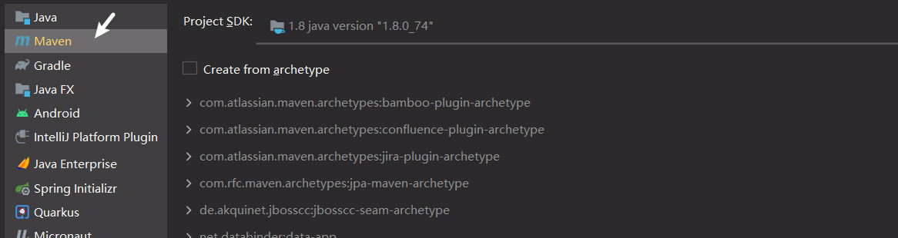

规定项目结构


检查maven是自己的还是idea的


删除本项目的src目录,让此项目作为一个父工程

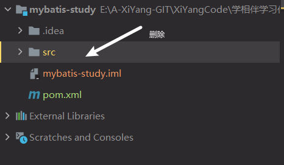

#### 2.1.3  导入mybatis相关jar包

mybatis核心

```xml
<!--1. 导入mybatis依赖-->
<dependency>
    <groupId>org.mybatis</groupId>
    <artifactId>mybatis</artifactId>
    <version>3.5.2</version>
</dependency>
```

其他需要的包

```xml
<!--2. 使用mysql-->
<dependency>
    <groupId>mysql</groupId>
    <artifactId>mysql-connector-java</artifactId>
    <version>5.1.47</version>
</dependency>
<!--3. 使用测试的junit-->
<dependency>
    <groupId>junit</groupId>
    <artifactId>junit</artifactId>
    <version>4.12</version>
</dependency>
```


#### 2.1.4  父项目下创建一个子项目

*在mybaits-study父工程下创建一个mybatis-01的子工程*


工程结构如下图


### 2.2 代码编写

#### 2.2.1  编写mybatis核心配置文件


*[官方文档](https://mybatis.org/mybatis-3/zh/getting-started.html)* 从 XML 中构建 SqlSessionFactory

*XML 配置文件中包含了对 MyBatis 系统的核心设置，包括获取数据库连接实例的数据源（DataSource）以及决定事务作用域和控制方式的事务管理器（TransactionManager）。后面会再探讨 XML 配置文件的详细内容，这里先给出一个简单的示例：*

**在mybatis-01的resources中创建一个mybatis-config.xml文件**


**mybatis-config.xml文件如下配置**

```xml
<?xml version="1.0" encoding="UTF-8" ?>
<!DOCTYPE configuration
        PUBLIC "-//mybatis.org//DTD Config 3.0//EN"
        "http://mybatis.org/dtd/mybatis-3-config.dtd">
<!--configuration代表mybatis的核心配置文件-->
<configuration>
    <!--environments可以配置多套环境-->
    <environments default="development">
        <!--environment某一套环境,环境名通过id区分-->
        <environment id="development">
            <!--transactionManager事务管理-->
            <transactionManager type="JDBC"/>
            <!--dataSource数据源配置-->
            <dataSource type="POOLED">
                <property name="driver" value="com.mysql.jdbc.Driver"/>
                <property name="url" value="jdbc:mysql://localhost:3306/mybatis? useSSL=true&amp;useUnicode=true&amp;characterEncoding=utf8"/>
                <property name="username" value="root"/>
                <property name="password" value="1234"/>
            </dataSource>
        </environment>
    </environments>
    <mappers>
        <mapper resource="com/kuang/dao/userMapper.xml"/>
    </mappers>
</configuration>
```


#### 2.2.2 编写mybatis工具类

- 每个基于 MyBatis 的应用都是以一个 SqlSessionFactory 的实例为核心的。
- SqlSessionFactory 的实例可以通过 SqlSessionFactoryBuilder 获得。
- 而 SqlSessionFactoryBuilder 则可以从 XML 配置文件或一个预先配置的 Configuration 实例来构建出 SqlSessionFactory 实例

**编写一个工具类**


**工具类编写如下**

```java
public class MybatisUtils {
    private static SqlSessionFactory sqlSessionFactory;
    static {
        try {
            //1. mybatis核心配置的路径
            String resource = "mybatis-config.xml";
            //2. 通过流读取路径
            InputStream inputStream = Resources.getResourceAsStream(resource);
            //3. 通过SqlSessionFactoryBuilder构建sqlSessionFactory
            sqlSessionFactory = new SqlSessionFactoryBuilder().build(inputStream);
        } catch (IOException e) {
            e.printStackTrace();
        }
    }
    //获取SqlSession连接
    public static SqlSession getSession(){
        //4. 通过构建的sqlSessionFactory获取SqlSession.我们可以拿到SqlSession进行SQL语句的crud操作
        return sqlSessionFactory.openSession();
    }
}
```


#### 2.2.3 创建实体类


```java
public class User {
    private int id; //id
    private String name; //姓名
    private String pwd; //密码
    public User() {
    }
    public User(int id, String name, String pwd) {
        this.id = id;
        this.name = name;
        this.pwd = pwd;
    }

    public int getId() {
        return id;
    }

    public void setId(int id) {
        this.id = id;
    }

    public String getName() {
        return name;
    }

    public void setName(String name) {
        this.name = name;
    }

    public String getPwd() {
        return pwd;
    }

    public void setPwd(String pwd) {
        this.pwd = pwd;
    }

    @Override
    public String toString() {
        return "User{" +
                "id=" + id +
                ", name='" + name + '\'' +
                ", pwd='" + pwd + '\'' +
                '}';
    }
}

```


#### 2.2.4 编写mapper接口


**编写如下**

```java
public interface UserMapper {
    List<User> getUserList();
}
```


#### 2.2.5 编写mapper.xml文件


**编写userMapper.xml文件如下**

namespace 十分重要，不能写错！

```xml
<?xml version="1.0" encoding="UTF-8" ?>
<!DOCTYPE mapper
        PUBLIC "-//mybatis.org//DTD Mapper 3.0//EN"
        "http://mybatis.org/dtd/mybatis-3-mapper.dtd">
<!--namespace绑定一个对应的dao的mapper接口-->
<mapper namespace="com.kuang.dao.UserMapper">
    <!--
	id: 接口中的方法名
	resultType:返回的对象类型
	-->
    <select id="getUserList" resultType="com.kuang.pojo.User">
        SELECT * FROM mybatis.user
    </select>
</mapper>
```


#### 2.2.6 编写测试类并运行测试

Junit 包测试

```java
public class MybatisTest {
    @Test
    public void test(){
        //1.通过工具类获取sqlsession
        SqlSession sqlSession = MybatisUtils.getSession();
        //2. 获取mapper接口
        UserMapper mapper = sqlSession.getMapper(UserMapper.class);
        //3. 调用接口中的方法
        List<User> userList = mapper.getUserList();
        //4. 遍历打印
        for (User user : userList) {
            System.out.println(user);
        }
        //5. 关闭sqlsession
        sqlSession.close();
    }
}
```

**测试结果如下:**

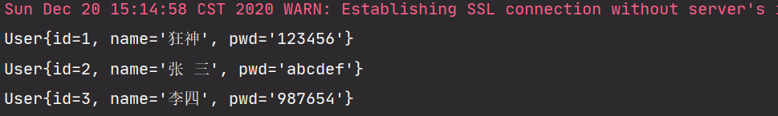

补充说明: *Maven静态资源过滤问题*

```xml
 <build>
        <!--maven静态资源过滤-->
        <resources>
            <resource>
                <directory>src/main/java</directory>
                <includes>
                    <include>**/*.properties</include>
                    <include>**/*.xml</include>
                </includes>
                <filtering>false</filtering>
            </resource>
            <resource>
                <directory>src/main/resources</directory>
                <includes>
                    <include>**/*.properties</include>
                    <include>**/*.xml</include>
                </includes>
                <filtering>false</filtering>
            </resource>
        </resources>
    </build>
```


### 2.3 总结

**mybatis的执行流程**

1. 通过SqlSessionFactoryBuilder构建SqlSessionFactory
   - SqlSessionFactoryBuilder会调用build(流)找到核心xml配置文件
2. 通过SqlSessionFactory构建SqlSession
   - 通过调用sqlSessionFactory.openSession()可获取sqlsession
3. 拿到SqlSession可用于数据库的crud操作

**代码编写的步骤**

1. mybatis的核心配置文件mybatis-config.xml
2. 工具类的编写,用于获取sqlsession
3. 接口,用于提供方法
4. xml文件,用于编写接口中提供方法的对应的sql语句
5. 测试
   - 获取sqlsession
   - 获取对应的接口(xx.class)
   - 调用接口中的方法,获取结果

**注意点**

其他的mapper.xml文件需要注册到mybatis的核心xml文件中


**整个工程结构如下**

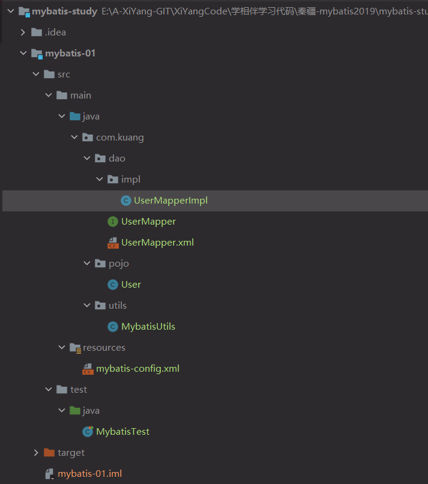

## 3. CRUD操作

*使用mybatis框架进行数据库的CURD操作~*

### 3.1 namespace属性

通过入门案例可以看到mapper的标签中有一个namespace的属性,其作用就是用于xml与指定java接口相互绑定

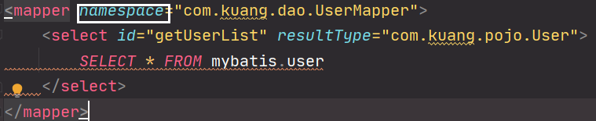

**注意:** 配置文件中namespace中的名称为对应Mapper接口或者Dao接口的<u>完整包名,必须一致</u>！ 否则报错

### 3.2 select标签 🚩

*select标签是mybatis中最常用的标签之一*

select语句有很多属性可以详细配置每一条SQL语句;select标签的常见属性

- `id` 
  - 命名空间中唯一的标识符
  - 接口中的方法名与映射文件中的SQL语句ID 一一对应
- `parameterType`: 传入SQL语句的参数类型 。【万能的Map，可以多尝试使用】
- `resultType`: SQL语句返回值类型。【完整的类名或者别名】

---

**【案例】**：根据id查询用户

在UserMapper中添加对应方法

```java
public interface UserMapper {
    /*查询所有用户*/
    List<User> getUserList();
    /*根据id查询*/
    User selectUserById(int id);
}
```

 在UserMapper.xml中添加Select语句

```xml
    <!--根据id查询用户-->
    <select id="selectUserById" parameterType="int" resultType="com.kuang.pojo.User">
        SELECT * FROM mybatis.user WHERE id=#{id}
    </select>
```

 测试类中测试

```java
    @Test
    public void selectUserById(){
        //1.通过工具类获取sqlsession
        SqlSession sqlSession = MybatisUtils.getSession();
        //2. 获取mapper接口
        UserMapper mapper = sqlSession.getMapper(UserMapper.class);
        //3. 调用接口中的方法
        User user = mapper.selectUserById(1);
        System.out.println(user);
        //关闭连接
        sqlSession.close();
    }
```

测试结果


### 3.3 insert标签

*我们一般使用insert标签进行插入操作，它的配置和select标签差不多！*

**【案例】**：给数据库增加一个用户

1. 在UserMapper接口中添加对应的方法

   ```java
   /*添加一个用户*/
   void addUser(User user);
   ```

2. 在UserMapper.xml中添加insert语句

   ```xml
   <!--增加一个用户-->
   <insert id="addUser" parameterType="com.kuang.pojo.User">
       INSERT INTO mybatis.user(id,name,pwd) VALUES(#{id},#{name},#{pwd})
   </insert>
   ```

3. 测试

   ```java
   @Test
   public void addUser(){
       //1.通过工具类获取sqlsession
       SqlSession sqlSession = MybatisUtils.getSession();
       //2. 获取mapper接口
       UserMapper mapper = sqlSession.getMapper(UserMapper.class);
       //构建一个用户
       User user = new User(4, "小明", "123");
       //3. 调用接口中的方法
       mapper.addUser(user);
       //提交事务
       sqlSession.commit(); //提交事务,重点!不写的话不会提交到数据库
       //关闭sqlsession
       sqlSession.close();
   }
   ```

   测试结果

   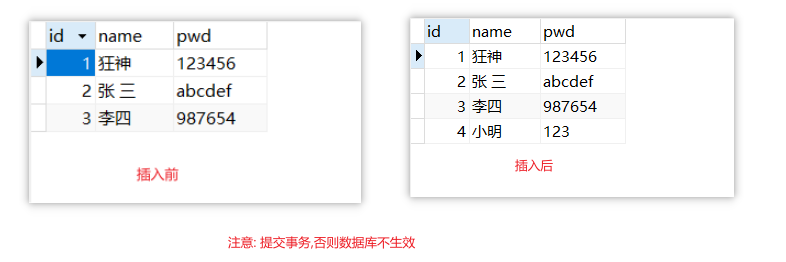

**注意点**：[增、删、改] / [写]  操作需要提交事务！否则不会在数据库中生效!

```java
sqlSession.commit();
```


### 3.4 update标签

*我们一般使用update标签进行更新操作，它的配置和select标签差不多！*

**【案例】**：修改用户的信息

1. 同理，编写接口方法

   ```java
   /*修改用户信息*/
   void updateUser(User user);
   ```

2. 编写对应的配置文件SQL

   ```xml
   <!--修改用户信息-->
   <update id="updateUser" parameterType="com.kuang.pojo.User">
       UPDATE mybatis.user SET name=#{name},pwd=#{pwd} WHERE id=#{id}
   </update>
   ```

3. 测试

   ```java
   @Test
   public void updateUser(){
       //1.通过工具类获取sqlsession
       SqlSession sqlSession = MybatisUtils.getSession();
       //2. 获取mapper接口
       UserMapper mapper = sqlSession.getMapper(UserMapper.class);
       //查询到需要修改信息的用户
       User user = mapper.selectUserById(4);
       //修改用户的信息
       user.setName("大明");
       user.setPwd("123321");
    //3. 调用接口中的方法
       mapper.updateUser(user);
       //提交事务
       sqlSession.commit();
       //关闭sqlsession
       sqlSession.close();
   }
   ```

   测试结果

   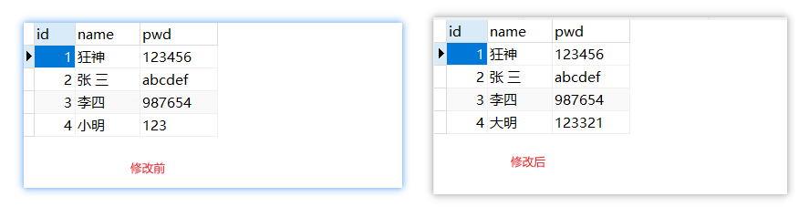


### 3.5 delete标签

*我们一般使用delete标签进行删除操作，它的配置和select标签差不多！*

**【案例】**：根据id删除一个用户

1. 同理，编写接口方法

   ```java
   //根据id删除用户 
   int deleteUser(int id);
   ```

2. 编写对应的配置文件SQL

   ```xml
   <!--删除用户根据ID-->
   <delete id="deleteUser" parameterType="int">
       DELETE FROM mybatis.user WHERE id=#{id}
   </delete>
   ```

3. 测试

   ```java
   @Test
   public void deleteUser(){
       //1.通过工具类获取sqlsession
       SqlSession sqlSession = MybatisUtils.getSession();
       //2. 获取mapper接口
       UserMapper mapper = sqlSession.getMapper(UserMapper.class);
       //3. 调用接口中的方法 删除id为4的用户
       mapper.deleteUser(4);
       //提交事务
       sqlSession.commit();
       //关闭连接
       sqlSession.close();
   }
   ```

   测试结果:

   

**crud操作中可能出现的错误分析**

- 标签不要匹配错
- resource绑定mapper，需要使用路径！
- 程序配置文件必须符合规范！
- NullpointerException，mapper.xml没有注册到config.xml！
- 输出的xml文件中存在中文乱码问题！
- maven资源没有导出问题！


### 3.6 CRUD操作注意事项

1. **所有的增删改操作都需要提交事务**！
2. 接口所有的普通参数，尽量都写上`@Param`参数，尤其是多个参数时，必须写上！
3. 有时候根据业务的需求，可以考虑使用map传递参数！
4. 为了规范操作，在SQL的配置文件中，我们尽量将Parameter参数和resultType都写上！

### 3.7 Map封装数据

*假设，我们的实体类，或者数据库中的表，字段或者参数过多，我们应当考虑map*

**【案例一】**: 使用map封装用户后添加到数据库中

1. 编写接口

   ```java
   /*使用map的方式新增一个用户*/
   int insertUserByMap(Map<String,Object> map);
   ```

2. 编写sql语句

   ```xml
   <!--使用map的方式新增一个用户-->
   <insert id="insertUserByMap" parameterType="map">
       INSERT INTO mybatis.user(id,name,pwd) VALUES (#{mapUserID},#{mapUserName},#{mapUserPwd})
   </insert>
   ```

   

3. 测试执行

   ```java
   @Test
   public void insertUserByMap(){
       //1.通过工具类获取sqlsession
       SqlSession sqlSession = MybatisUtils.getSession();
       //2. 获取mapper接口
       UserMapper mapper = sqlSession.getMapper(UserMapper.class);
       //创建map,将数据封装到map中
       Map<String, Object> map = new HashMap<String, Object>();
       map.put("mapUserID",4);
       map.put("mapUserName","xiyang");
       map.put("mapUserPwd","12345");
       //3. 调用接口中的方法
       mapper.insertUserByMap(map);
       //提交事务
       sqlSession.commit();
       //关闭sqlSession
       sqlSession.close();
   }
   ```

   测试结果

   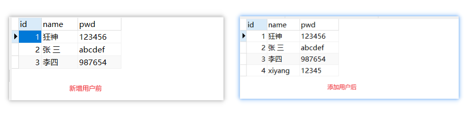

**【案例二】**: 根据 密码 和 名字 查询用户

<u>思路一：直接在方法中传递参数</u>

1. 在接口方法的参数前加 @Param属性

2. Sql语句编写的时候，直接取@Param中设置的值即可，不需要单独设置参数类型

   ```java
   //通过密码和名字查询用户 
   User selectUserByNP(@Param("username") String username,@Param("pwd") String pwd); 
   /* 
   <select id="selectUserByNP" resultType="com.kuang.pojo.User"> 
   	select * from user where name = #{username} and pwd = #{pwd} 
   </select> 
   */
   ```

<u>思路二：使用万能的Map</u>

1. 在接口方法中，参数直接传递Map； 

   ```java
   User selectUserByNP2(Map<String,Object> map);
   ```

2. 编写sql语句的时候，需要传递参数类型，参数类型为map

   ```xml
   <select id="selectUserByNP2" parameterType="map" resultType="com.kuang.pojo.User"> 
       select * from user where name = #{username} and pwd = #{pwd} 
   </select>
   ```

3. 在使用方法的时候，Map的 key 为 sql中取的值即可，没有顺序要求！

   ```java
   Map<String, Object> map = new HashMap<String, Object>(); 
   map.put("username","小明"); 
   map.put("pwd","123456"); 
   User user = mapper.selectUserByNP2(map);
   ```


**总结：**如果参数过多，我们可以考虑直接使用Map实现，如果参数比较少，直接传递参数即可

### 思考

*模糊查询like语句该怎么写?*

1. 第1种：在Java代码中添加sql通配符。

   ```xml
   string wildcardname = “%smi%”; 
   list<name> names = mapper.selectlike(wildcardname); 
   <select id=”selectlike”> 
       select * from foo where bar like #{value} 
   </select>
   ```

2. 第2种：在sql语句中拼接通配符，会引起sql注入

   ```xml
   string wildcardname = “smi”; 
   list<name> names = mapper.selectlike(wildcardname); 
   <select id=”selectlike”> 
       select * from foo where bar like "%"#{value}"%" 
   </select>
   ```

   

## 4. 配置解析

### 4.1 核心配置文件

1. mybatis-confifig.xml 系统核心配置文件

2. MyBatis 的配置文件包含了会深深影响 MyBatis 行为的设置和属性信息。

3. 能配置的内容如下：

   ```
   configuration（配置） 
   	properties（属性） 
   	settings（设置） 
   	typeAliases（类型别名） 
   	typeHandlers（类型处理器） 
   	objectFactory（对象工厂） 
   	plugins（插件） 
   	environments（环境配置） 
   	environment（环境变量） 
   	transactionManager（事务管理器） 
   	dataSource（数据源） 
   	databaseIdProvider（数据库厂商标识） 
   	mappers（映射器） 
   <!-- 注意元素节点的顺序！顺序不对会报错 -->
   ```

   我们可以阅读 mybatis-confifig.xml 上面的dtd的头文件！

### 4.2 environments元素

```xml
<environments default="development"> 
    <environment id="development"> 
        <transactionManager type="JDBC"> 
            <property name="..." value="..."/> 
        </transactionManager> 
        <dataSource type="POOLED"> 
            <property name="driver" value="${driver}"/> 
            <property name="url" value="${url}"/> 
            <property name="username" value="${username}"/> 
            <property name="password" value="${password}"/> 
        </dataSource> 
    </environment> 
</environments>
```

1. 配置MyBatis的多套运行环境，将SQL映射到多个不同的数据库上，必须指定其中一个为默认运行环境（通过default指定）

2. 子元素节点：environment

   - 具体的一套环境，通过设置id进行区别，id保证唯一！

   - 子元素节点：transactionManager - [ 事务管理器 ]

     ```xml
     <!-- 语法 --> 
     <transactionManager type="[ JDBC | MANAGED ]"/>
     ```

     - 详情：点击查看[官方文档](http://www.mybatis.org/mybatis-3/zh/configuration.html#environments)
     - 这两种事务管理器类型都不需要设置任何属性。

   - 子元素节点：数据源（dataSource）

     - dataSource 元素使用标准的 JDBC 数据源接口来配置 JDBC 连接对象的资源。

     - 数据源是必须配置的。

     - 有三种内建的数据源类型

       ```
       type="[UNPOOLED|POOLED|JNDI]"）
       ```

     - unpooled： 这个数据源的实现只是每次被请求时打开和关闭连接。

     - **pooled**： 这种数据源的实现利用“池”的概念将 JDBC 连接对象组织起来 , 这是一种使得并发 Web 应用快速响应请求的流行处理方式。

     - jndi：这个数据源的实现是为了能在如 Spring 或应用服务器这类容器中使用，容器可以集中或在外部配置数据源，然后放置一个 JNDI 上下文的引用。

     - 数据源也有很多第三方的实现，比如dbcp，c3p0，druid等等....

### 4.3 mapper元素

#### 4.3.1 mappers

映射器 : 定义映射SQL语句文件

既然 MyBatis 的行为其他元素已经配置完了，我们现在就要定义 SQL 映射语句了。但是首先我们需要告诉 MyBatis 到哪里去找到这些语句。 Java 在自动查找这方面没有提供一个很好的方法，所以最佳的方式是告诉 MyBatis 到哪里去找映射文件。你可以使用相对于类路径的资源引用， 或完全限定资源定位符（包括 `file:///` 的 URL），或类名和包名等。映射器是MyBatis中最核心的组件之一，在MyBatis 3之前，只支持xml映射器，即：所有的SQL语句都必须在xml文件中配置。而从MyBatis 3开始，还支持接口映射器，这种映射器方式允许以Java代码的方式注解定义SQL语句，非常简洁。

#### 4.3.2 引入资源方式

```xml
<!-- 使用相对于类路径的资源引用 --> 
<mappers> 
    <mapper resource="org/mybatis/builder/PostMapper.xml"/> 
</mappers>
```

```xml
<!-- 使用完全限定资源定位符（URL） --> 
<mappers> 
    <mapper url="file:///var/mappers/AuthorMapper.xml"/> 
</mappers>
```

```xml
<!-- 使用映射器接口实现类的完全限定类名 需要配置文件名称和接口名称一致，并且位于同一目录下 --> 
<mappers> 
    <mapper class="org.mybatis.builder.AuthorMapper"/> 
</mappers>
```

```xml
<!-- 将包内的映射器接口实现全部注册为映射器 但是需要配置文件名称和接口名称一致，并且位于同一目录下 --> 
<mappers> 
    <package name="org.mybatis.builder"/> 
</mappers>
```

#### 4.3.3 Mapper文件

```xml
<?xml version="1.0" encoding="UTF-8" ?> 
<!DOCTYPE mapper 
		PUBLIC "-//mybatis.org//DTD Mapper 3.0//EN" 
		"http://mybatis.org/dtd/mybatis-3-mapper.dtd"> 
<mapper namespace="com.kuang.mapper.UserMapper"> 

</mapper>
```

namespace中文意思：命名空间，作用如下：

1.  namespace和子元素的id联合保证唯一 , 区别不同的mapper
2.  绑定DAO接口
    - namespace的命名必须跟某个接口同名
    - 接口中的方法与映射文件中sql语句id应该一一对应
3.  namespace命名规则 : 包名+类名

MyBatis 的真正强大在于它的映射语句，这是它的魔力所在。由于它的异常强大，映射器的 XML 文件就显得相对简单。如果拿它跟具有相同功能的 JDBC 代码进行对比，你会立即发现省掉了将近 95% 的代码。MyBatis 为聚焦于 SQL 而构建，以尽可能地为你减少麻烦。

### 4.4 propertis优化

数据库这些属性都是可外部配置且可动态替换的，既可以在典型的 Java 属性文件中配置，亦可通过properties 元素的子元素来传递。具体的[官方文档](http://www.mybatis.org/mybatis-3/zh/configuration.html#properties)

我们来优化我们的配置文件

第一步 ; 在资源目录下新建一个db.properties

```properties
driver=com.mysql.jdbc.Driver 
url=jdbc:mysql://localhost:3306/mybatis?useSSL=true&useUnicode=true&characterEncoding=utf8 
username=root 
password=123456
```

第二步 : 将文件导入properties 配置文件

```xml
<configuration> 
    <!--导入properties文件--> 
    <properties resource="db.properties"/> 
    <environments default="development"> 
        <environment id="development"> 
            <transactionManager type="JDBC"/> 
            <dataSource type="POOLED"> 
                <property name="driver" value="${driver}"/> 
                <property name="url" value="${url}"/> 
                <property name="username" value="${username}"/> 
                <property name="password" value="${password}"/> 
            </dataSource> 
        </environment> 
    </environments> 
    <mappers> 
        <mapper resource="mapper/UserMapper.xml"/> 
    </mappers> 
</configuration>
```

更多操作，可以查看官方文档！

- 配置文件优先级问题
- 新特性：使用占位符


### 4.5 typeAliases优化

*类型别名是为 Java 类型设置一个短的名字。它只和 XML 配置有关，存在的意义仅在于用来减少类完全限定名的冗余。*

```xml
<!--配置别名,注意顺序--> 
<typeAliases> 
    <typeAlias type="com.kuang.pojo.User" alias="User"/> 
</typeAliases>
```

当这样配置时， User 可以用在任何使用 com.kuang.pojo.User 的地方。

也可以指定一个包名，MyBatis 会在包名下面搜索需要的 Java Bean，比如:

```xml
<typeAliases> 
    <package name="com.kuang.pojo"/> 
</typeAliases>
```

每一个在包 com.kuang.pojo 中的 Java Bean，在没有注解的情况下，会使用 Bean 的首字母小写的非限定类名来作为它的别名。

若有注解，则别名为其注解值。见下面的例子：

```java
@Alias("user") 
public class User { 
    ... 
}
```


### 4.6 其他配置浏览

#### 6.1 设置

- [设置（settings）](http://www.mybatis.org/mybatis-3/zh/configuration.html#settings)相关 => 查看帮助文档

  - 懒加载
  - 日志实现
  - 缓存开启关闭

- 一个配置完整的 settings 元素的示例如下：

  ```xml
  <settings> 
      <setting name="cacheEnabled" value="true"/> 
      <setting name="lazyLoadingEnabled" value="true"/> 
      <setting name="multipleResultSetsEnabled" value="true"/> 
      <setting name="useColumnLabel" value="true"/> 
      <setting name="useGeneratedKeys" value="false"/> 
      <setting name="autoMappingBehavior" value="PARTIAL"/> 
      <setting name="autoMappingUnknownColumnBehavior" value="WARNING"/> 
      <setting name="defaultExecutorType" value="SIMPLE"/> 
      <setting name="defaultStatementTimeout" value="25"/> 
      <setting name="defaultFetchSize" value="100"/> 
      <setting name="safeRowBoundsEnabled" value="false"/>
      <setting name="mapUnderscoreToCamelCase" value="false"/> 
      <setting name="localCacheScope" value="SESSION"/> 
      <setting name="jdbcTypeForNull" value="OTHER"/> 
      <setting name="lazyLoadTriggerMethods" value="equals,clone,hashCode,toString"/> 
  </settings>
  ```

  

#### 6.2 类型处理器

[官方文档](http://www.mybatis.org/mybatis-3/zh/configuration.html#typeHandlers)

- 无论是 MyBatis 在预处理语句（PreparedStatement）中设置一个参数时，还是从结果集中取出一个值时， 都会用类型处理器将获取的值以合适的方式转换成 Java 类型。
- 你可以重写类型处理器或创建你自己的类型处理器来处理不支持的或非标准的类型。【了解即可】

#### 6.3 对象工厂

[官方文档](http://www.mybatis.org/mybatis-3/zh/configuration.html#objectFactory)

- MyBatis 每次创建结果对象的新实例时，它都会使用一个对象工厂（ObjectFactory）实例来完成。
- 默认的对象工厂需要做的仅仅是实例化目标类，要么通过默认构造方法，要么在参数映射存在的时候通过有参构造方法来实例化。
- 如果想覆盖对象工厂的默认行为，则可以通过创建自己的对象工厂来实现。【了解即可】

#### 6.4 生命周期和作用域

理解我们目前已经讨论过的不同作用域和生命周期类是至关重要的，因为错误的使用会导致非常严重的并发问题。

我们可以先画一个流程图，分析一下Mybatis的执行过程！

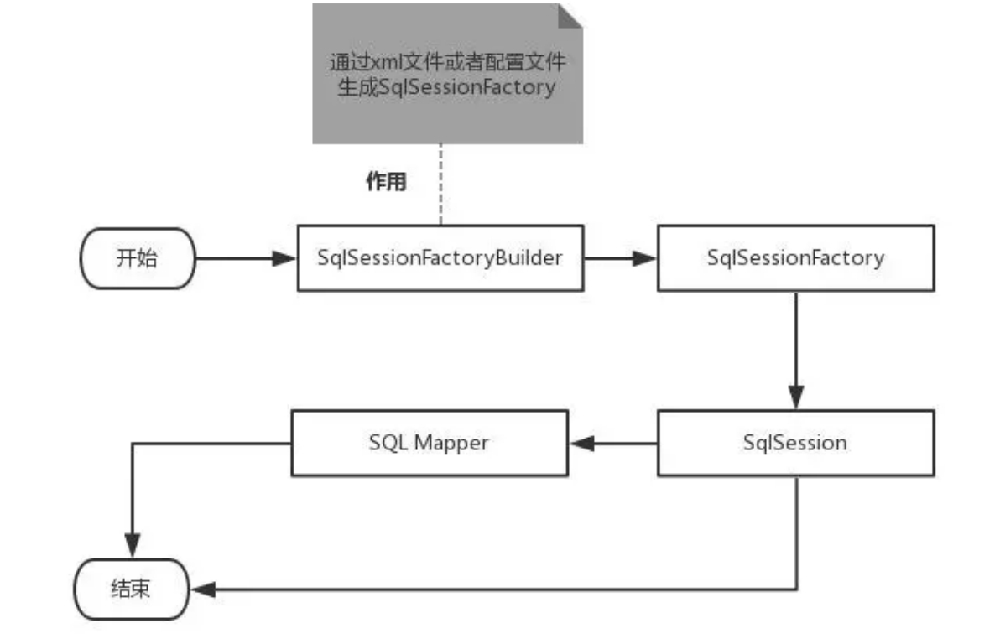

**作用域理解**

1. SqlSessionFactoryBuilder 的作用在于创建 SqlSessionFactory，创建成功后，SqlSessionFactoryBuilder 就失去了作用，所以它只能存在于创建 SqlSessionFactory 的方法中，而不要让其长期存在。因此 **SqlSessionFactoryBuilder** **实例的最佳作用域是方法作用域**（也就是局部方法变量）。
2. SqlSessionFactory 可以被认为是一个数据库连接池，它的作用是创建 SqlSession 接口对象。因为MyBatis 的本质就是 Java 对数据库的操作，所以 SqlSessionFactory 的生命周期存在于整个MyBatis 的应用之中，所以一旦创建了 SqlSessionFactory，就要长期保存它，直至不再使用MyBatis 应用，所以可以认为 SqlSessionFactory 的生命周期就等同于 MyBatis 的应用周期。
3. 由于 SqlSessionFactory 是一个对数据库的连接池，所以它占据着数据库的连接资源。如果创建多个 SqlSessionFactory，那么就存在多个数据库连接池，这样不利于对数据库资源的控制，也会导致数据库连接资源被消耗光，出现系统宕机等情况，所以尽量避免发生这样的情况。
4. 因此在一般的应用中我们往往希望 SqlSessionFactory 作为一个单例，让它在应用中被共享。所以说 **SqlSessionFactory** **的最佳作用域是应用作用域。**
5. 如果说 SqlSessionFactory 相当于数据库连接池，那么 SqlSession 就相当于一个数据库连接（Connection 对象），你可以在一个事务里面执行多条 SQL，然后通过它的 commit、rollback等方法，提交或者回滚事务。所以它应该存活在一个业务请求中，处理完整个请求后，应该关闭这条连接，让它归还给 SqlSessionFactory，否则数据库资源就很快被耗费精光，系统就会瘫痪，所以用 try...catch...fifinally... 语句来保证其正确关闭。
6. **所以** **SqlSession** **的最佳的作用域是请求或方法作用域。**

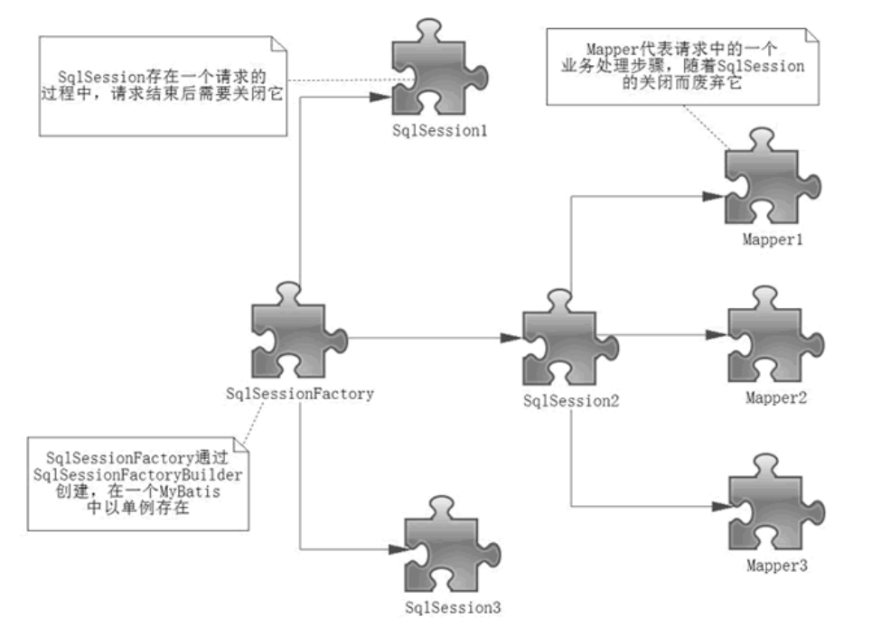


## 5. ReultMap

*ResultMap用于解决属性名和字段名不一致的问题*


### 5.1 查询为null的问题

1. 查看之前的数据库的字段名

2. Java中的实体类设计

   ```java
   public class User { 
       private int id; //id 
       private String name; //姓名 
       private String password; //密码和数据库不一样！ 
       //构造 
       //set/get 
       //toString() 
   }
   ```

3. 接口

   ```java
   //根据id查询用户 
   User selectUserById(int id);
   ```

4. mapper映射文件

   ```xml
   <select id="selectUserById" resultType="user"> 
       select * from user where id = #{id} 
   </select>
   ```

5. 测试

   ```java
   @Test public void testSelectUserById() { 
       SqlSession session = MybatisUtils.getSession(); 
       //获取SqlSession连接 
       UserMapper mapper = session.getMapper(UserMapper.class); 
       User user = mapper.selectUserById(1); 
       System.out.println(user); 
       session.close(); 
   }
   ```

**结果**: 

- `User{id=1, name='狂神', password='null'}`
- 查询出来发现 password 为空 . 说明出现了问题！

**分析：**

- `select * from user where id = #{id}` 可以看做`select id,name,pwd from user where id = #{id}`
- mybatis会根据这些查询的列名(会将列名转化为小写,数据库不区分大小写) , 去对应的实体类中查找相应列名的set方法设值 , 由于找不到setPwd() , 所以password返回null ; 【自动映射】


### 5.2 解决方案

方案一：为列名指定别名 , 别名和java实体类的属性名一致 

```xml
<select id="selectUserById" resultType="User"> 
    select id , name , pwd as password from user where id = #{id} 
</select>
```


方案二：使用结果集映射->ResultMap 【推荐】

```xml
<resultMap id="UserMap" type="User"> 
    <!-- id为主键 --> 
    <id column="id" property="id"/> 
    <!-- column是数据库表的列名 , property是对应实体类的属性名 --> 
    <result column="name" property="name"/> 
    <result column="pwd" property="password"/> 
</resultMap> 
<select id="selectUserById" resultMap="UserMap"> 
    select id , name , pwd from user where id = #{id} 
</select>
```


### 5.3 ResultMap

#### 5.3.1 自动映射

- resultMap 元素是 MyBatis 中最重要最强大的元素。它可以让你从 90% 的 JDBCResultSets 数据提取代码中解放出来。

- 实际上，在为一些比如连接的复杂语句编写映射代码的时候，一份 resultMap 能够代替实现同等功能的长达数千行的代码。

- ResultMap 的设计思想是，对于简单的语句根本不需要配置显式的结果映射，而对于复杂一点的语句只需要描述它们的关系就行了。

你已经见过简单映射语句的示例了，但并没有显式指定 resultMap 。比如：

```xml
<select id="selectUserById" resultType="map"> 
    select id , name , pwd from user where id = #{id} 
</select>
```

上述语句只是简单地将所有的列映射到 HashMap 的键上，这由 resultType 属性指定。虽然在大部分情况下都够用，但是 HashMap 不是一个很好的模型。你的程序更可能会使用 JavaBean 或POJO（Plain Old Java Objects，普通老式 Java 对象）作为模型。

ResultMap 最优秀的地方在于，虽然你已经对它相当了解了，但是根本就不需要显式地用到他们。

#### 5.3.2 手动映射

1. 返回值类型为resultMap

   ```xml
   <select id="selectUserById" resultMap="UserMap"> 
       select id , name , pwd from user where id = #{id} 
   </select>
   ```

2. 编写resultMap，实现手动映射！

   ```xml
   <resultMap id="UserMap" type="User"> 
       <!-- id为主键 --> 
       <id column="id" property="id"/> 
       <!-- column是数据库表的列名 , property是对应实体类的属性名 --> 
       <result column="name" property="name"/> 
       <result column="pwd" property="password"/> 
   </resultMap>
   ```

如果世界总是这么简单就好了。但是肯定不是的，数据库中，存在一对多，多对一的情况，我们之后会使用到一些高级的结果集映射，association，collection这些，我们将在之后讲解，今天你们需要把这些知识都消化掉才是最重要的！理解结果集映射的这个概念！


## 6. 分页的实现

### 6.1 日志工厂

思考：我们在测试SQL的时候，要是能够在控制台输出 SQL 的话，是不是就能够有更快的排错效率？

如果一个 数据库相关的操作出现了问题，我们可以根据输出的SQL语句快速排查问题。

对于以往的开发过程，我们会经常使用到debug模式来调节，跟踪我们的代码执行过程。但是现在使用Mybatis是基于接口，配置文件的源代码执行过程。因此，我们必须选择日志工具来作为我们开发，调节程序的工具。

Mybatis内置的日志工厂提供日志功能，具体的日志实现有以下几种工具：

- SLF4J
- Apache Commons Logging
- Log4j 2
- Log4j
- JDK logging

具体选择哪个日志实现工具由MyBatis的内置日志工厂确定。它会使用最先找到的（按上文列举的顺序查找）。 如果一个都未找到，日志功能就会被禁用。

**标准日志实现**

指定 MyBatis 应该使用哪个日志记录实现。如果此设置不存在，则会自动发现日志记录实现。

```xml
<settings>
    <setting name="logImpl" value="STDOUT_LOGGING"/> 
</settings>
```

测试，可以看到控制台有大量的输出！我们可以通过这些输出来判断程序到底哪里出了Bug

### 6.2 Log4j

**简介：**

- Log4j是Apache的一个开源项目
- 通过使用Log4j，我们可以控制日志信息输送的目的地：控制台，文本，GUI组件....
- 我们也可以控制每一条日志的输出格式；
- 通过定义每一条日志信息的级别，我们能够更加细致地控制日志的生成过程。最令人感兴趣的就是，这些可以通过一个配置文件来灵活地进行配置，而不需要修改应用的代码。

**使用步骤：**

1. 导入log4j的包

   ```xml
   <dependency> 
       <groupId>log4j</groupId> 
       <artifactId>log4j</artifactId> 
       <version>1.2.17</version> 
   </dependency>
   ```

2. 配置文件编写

   ```properties
   #将等级为DEBUG的日志信息输出到console和file这两个目的地，console和file的定义在下 面的代码 
   log4j.rootLogger=DEBUG,console,file 
   #控制台输出的相关设置 
   log4j.appender.console = org.apache.log4j.ConsoleAppender 
   log4j.appender.console.Target = System.out 
   log4j.appender.console.Threshold=DEBUG 
   log4j.appender.console.layout = org.apache.log4j.PatternLayout 
   log4j.appender.console.layout.ConversionPattern=[%c]-%m%n 
   #文件输出的相关设置 
   log4j.appender.file = org.apache.log4j.RollingFileAppender 
   log4j.appender.file.File=./log/kuang.log log4j.appender.file.MaxFileSize=10mb 
   log4j.appender.file.Threshold=DEBUG log4j.appender.file.layout=org.apache.log4j.PatternLayout 
   log4j.appender.file.layout.ConversionPattern=[%p][%d{yy-MM-dd}][%c]%m%n 
   #日志输出级别 
   log4j.logger.org.mybatis=DEBUG 
   log4j.logger.java.sql=DEBUG 
   log4j.logger.java.sql.Statement=DEBUG 
   log4j.logger.java.sql.ResultSet=DEBUG 
   log4j.logger.java.sql.PreparedStatement=DEBUG
   ```

3. setting设置日志实现

   ```xml
   <settings> 
       <setting name="logImpl" value="LOG4J"/> 
   </settings>
   ```

4. 在程序中使用Log4j进行输出！

   ```java
   //注意导包：org.apache.log4j.Logger 
   static Logger logger = Logger.getLogger(MyTest.class); 
   @Test public void selectUser() { 
       logger.info("info：进入selectUser方法"); 
       logger.debug("debug：进入selectUser方法"); 
       logger.error("error: 进入selectUser方法"); 
       SqlSession session = MybatisUtils.getSession();
       UserMapper mapper = session.getMapper(UserMapper.class); 
       List<User> users = mapper.selectUser(); 
       for (User user: users){ 
           System.out.println(user); 
       }
       session.close(); 
   }
   ```

5. 测试，看控制台输出！

   - 使用Log4j 输出日志
   - 可以看到还生成了一个日志的文件 【需要修改fifile的日志级别】

### 6.3 limit实现分页

**思考：为什么需要分页？**

在学习mybatis等持久层框架的时候，会经常对数据进行增删改查操作，使用最多的是对数据库进行查询操作，如果查询大量数据的时候，我们往往使用分页进行查询，也就是每次处理小部分数据，这样对数据库压力就在可控范围内。

**使用Limit实现分页**

```sql
# 语法 
SELECT * FROM table LIMIT stratIndex，pageSize 
SELECT * FROM table LIMIT 5,10; // 检索记录行 6-15 
#为了检索从某一个偏移量到记录集的结束所有的记录行，可以指定第二个参数为 -1： 
SELECT * FROM table LIMIT 95,-1; // 检索记录行 96-last. 
#如果只给定一个参数，它表示返回最大的记录行数目： 
SELECT * FROM table LIMIT 5; //检索前 5 个记录行 
#换句话说，LIMIT n 等价于 LIMIT 0,n。
```

**步骤：**

1. 修改Mapper文件

   ```xml
   <select id="selectUser" parameterType="map" resultType="user"> 
       select * from user limit #{startIndex},#{pageSize} 
   </select>
   ```

2. Mapper接口，参数为map

   ```java
   //选择全部用户实现分页 
   List<User> selectUser(Map<String,Integer> map);
   ```

3. 在测试类中传入参数测试

   - 推断：起始位置 = （当前页面 - 1 ） * 页面大小

     ```java
     //分页查询 , 两个参数startIndex , pageSize 
     @Test public void testSelectUser() { 
         SqlSession session = MybatisUtils.getSession();
         UserMapper mapper = session.getMapper(UserMapper.class); 
         int currentPage = 1; //第几页 
         int pageSize = 2; //每页显示几个 
         Map<String,Integer> map = new HashMap<String,Integer>(); 
         map.put("startIndex",(currentPage-1)*pageSize); 
         map.put("pageSize",pageSize); 
         List<User> users = mapper.selectUser(map); 
         for (User user: users){ 
             System.out.println(user); 
         }
         session.close(); 
     }
     ```

     


### 6.4 RowBounds分页

*我们除了使用Limit在SQL层面实现分页，也可以使用RowBounds在Java代码层面实现分页，当然此种方式作为了解即可。我们来看下如何实现的！*

**步骤：**

1. mapper接口

   ```java
   //选择全部用户RowBounds实现分页 
   List<User> getUserByRowBounds();
   ```

2. mapper文件

   ```xml
   <select id="getUserByRowBounds" resultType="user"> 
       select * from user 
   </select>
   ```

3. 测试类; 在这里，我们需要使用RowBounds类 

   ```java
   @Test public void testUserByRowBounds() { 
       SqlSession session = MybatisUtils.getSession(); 
       int currentPage = 2; //第几页 
       int pageSize = 2; //每页显示几个 
       RowBounds rowBounds = new RowBounds((currentPage- 1)*pageSize,pageSize); 
       //通过session.**方法进行传递rowBounds，[此种方式现在已经不推荐使用了] 
       List<User> users = session.selectList("com.kuang.mapper.UserMapper.getUserByRowBounds", null, rowBounds); 
       for (User user: users){ 
           System.out.println(user); 
       }
       session.close(); 
   }
   ```

   


### 6.5 PageHelper

官方文档：https://pagehelper.github.io/


## 7. 使用注解开发


### 7.1 面向接口编程

1. 大家之前都学过面向对象编程，也学习过接口，但在真正的开发中，很多时候我们会选择面向接口编程
2. 根本原因 : 解耦 , 可拓展 , 提高复用 , 分层开发中 , 上层不用管具体的实现 , 大家都遵守共同的标准, 使得开发变得容易 , 规范性更好
3. 在一个面向对象的系统中，系统的各种功能是由许许多多的不同对象协作完成的。在这种情况下，各个对象内部是如何实现自己的,对系统设计人员来讲就不那么重要了；
4. 而各个对象之间的协作关系则成为系统设计的关键。小到不同类之间的通信，大到各模块之间的交互，在系统设计之初都是要着重考虑的，这也是系统设计的主要工作内容。面向接口编程就是指按照这种思想来编程。

**关于接口的理解**

- 接口从更深层次的理解，应是定义（规范，约束）与实现（名实分离的原则）的分离。
- 接口的本身反映了系统设计人员对系统的抽象理解。
- 接口应有两类：
  - 第一类是对一个个体的抽象，它可对应为一个抽象体(abstract class)；
  - 第二类是对一个个体某一方面的抽象，即形成一个抽象面（interface）；
- 一个体有可能有多个抽象面。抽象体与抽象面是有区别的。

**三个面向区别**

- 面向对象是指，我们考虑问题时，以对象为单位，考虑它的属性及方法 
- 面向过程是指，我们考虑问题时，以一个具体的流程（事务过程）为单位，考虑它的实现 
- 接口设计与非接口设计是针对复用技术而言的，与面向对象（过程）不是一个问题.更多的体现就是对系统整体的架构


### 7.2 利用注解开发

- mybatis最初配置信息是基于 XML ,映射语句(SQL)也是定义在 XML 中的。而到MyBatis 3提供了新的基于注解的配置。不幸的是，Java 注解的的表达力和灵活性十分有限。最强大的 MyBatis 映射并不能用注解来构建
- sql 类型主要分成 :
  - `@select ()`
  - `@update ()`
  - `@Insert ()`
  - `@delete ()`

**【注意】**利用注解开发就不需要mapper.xml映射文件了 

1. 我们在我们的接口中添加注解

   ```java
   //查询全部用户 
   @Select("select id,name,pwd password from user") 
   public List<User> getAllUser();
   ```

2. 在mybatis的核心配置文件中注入

   ```xml
   <!--使用class绑定接口--> 
   <mappers> 
       <mapper class="com.kuang.mapper.UserMapper"/> 
   </mappers>
   ```

3. 我们去进行测试

   ```java
   @Test public void testGetAllUser() { 
       SqlSession session = MybatisUtils.getSession(); //本质上利用了jvm的动态代理机制 
       UserMapper mapper = session.getMapper(UserMapper.class); 
       List<User> users = mapper.getAllUser(); 
       for (User user : users){ 
           System.out.println(user); 
       }
       session.close(); 
   }
   ```

4. 利用Debug查看本质

5. 本质上利用了jvm的动态代理机制

   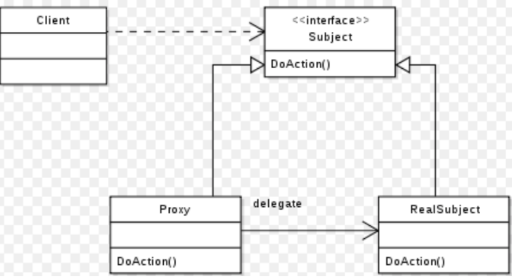

6. Mybatis详细的执行流程

   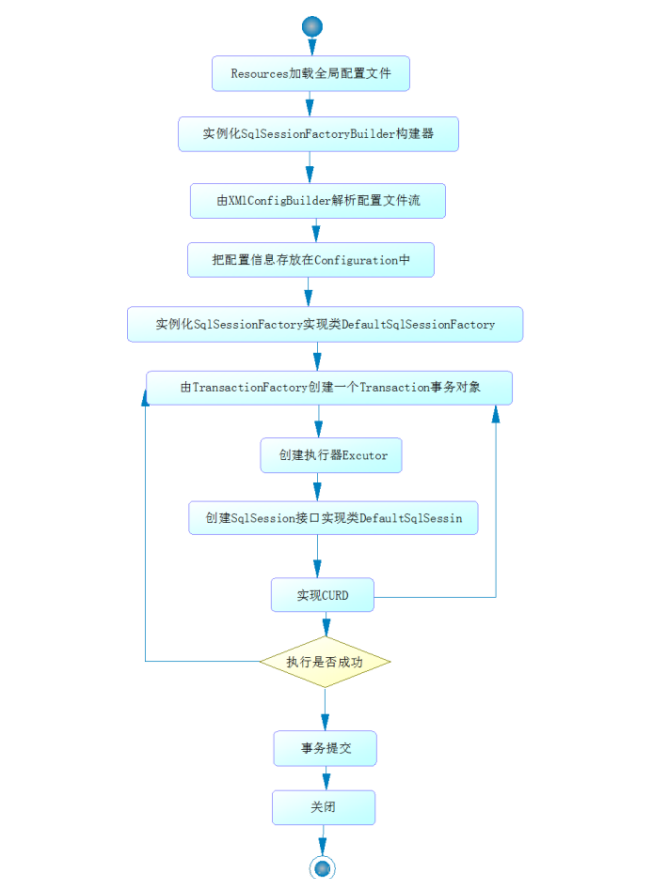

   


### 7.3 注解增删改查

*改造MybatisUtils工具类的getSession( ) 方法，重载实现。【鸡汤：多看源码实现】*

```java
//获取SqlSession连接 
public static SqlSession getSession(){ 
    return getSession(true);//事务自动提交 
}
public static SqlSession getSession(boolean flag){ 
    return sqlSessionFactory.openSession(flag); 
}
```

【注意】确保实体类和数据库字段对应

**查询：**

1. 编写接口方法注解

   ```java
   //根据id查询用户 
   @Select("select * from user where id = #{id}") 
   User selectUserById(@Param("id") int id);
   ```

2. 测试

   ```java
   @Test public void testSelectUserById() { 
       SqlSession session = MybatisUtils.getSession(); 
       UserMapper mapper = session.getMapper(UserMapper.class); 
       User user = mapper.selectUserById(1); 
       System.out.println(user); 
       session.close(); 
   }
   ```

**新增：**

1. 编写接口方法注解

   ```java
   //添加一个用户 
   @Insert("insert into user (id,name,pwd) values (#{id},#{name},#{pwd})") 
   int addUser(User user);
   ```

2. 测试

   ```java
   @Test public void testAddUser() { 
       SqlSession session = MybatisUtils.getSession(); 
       UserMapper mapper = session.getMapper(UserMapper.class); 
       User user = new User(6, "秦疆", "123456"); 
       mapper.addUser(user); 
       session.close(); 
   }
   ```

**修改：**

1. 编写接口方法注解

   ```java
   //修改一个用户 
   @Update("update user set name=#{name},pwd=#{pwd} where id = #{id}") 
   int updateUser(User user);
   ```

2. 测试

   ```java
   @Test public void testUpdateUser() { 
       SqlSession session = MybatisUtils.getSession(); 
       UserMapper mapper = session.getMapper(UserMapper.class); 
       User user = new User(6, "秦疆", "zxcvbn");
       mapper.updateUser(user); 
       session.close(); 
   }
   ```

**删除：**

1. 编写接口方法注解

   ```java
   //根据id删除用 
   @Delete("delete from user where id = #{id}") 
   int deleteUser(@Param("id")int id);
   ```

2. 测试

   ```java
   @Test public void testDeleteUser() { 
       SqlSession session = MybatisUtils.getSession(); 
       UserMapper mapper = session.getMapper(UserMapper.class); 
       mapper.deleteUser(6); 
       session.close(); 
   }
   ```

**【注意点：增删改一定记得对事务的处理】**

### 7.4 关于@param

`@Param`注解用于给方法参数起一个名字。以下是总结的使用原则：

- 在方法只接受一个参数的情况下，可以不使用@Param。
- 在方法接受多个参数的情况下，建议一定要使用@Param注解给参数命名。
- 如果参数是 JavaBean ， 则不能使用@Param。
- 不使用@Param注解时，参数只能有一个，并且是Javabean。 

### 7.5 #与$的区别

`#{}` 的作用主要是替换预编译语句(PrepareStatement)中的占位符? 【推荐使用】

```sql
INSERT INTO user (name) VALUES (#{name}); 
INSERT INTO user (name) VALUES (?);
```


`${}` 的作用是直接进行字符串替换

```sql
INSERT INTO user (name) VALUES ('${name}'); 
INSERT INTO user (name) VALUES ('kuangshen');
```


## 8. 多对一的处理


> 多对一的理解：
>
> - 多个学生对应一个老师
>
> - 如果对于学生这边，就是一个多对一的现象，即从学生这边关联一个老师！

### 8.1 数据库设计

```sql
CREATE TABLE `teacher` ( 
    `id` INT(10) NOT NULL, 
    `name` VARCHAR(30) DEFAULT NULL, 
    PRIMARY KEY (`id`) 
) ENGINE=INNODB DEFAULT CHARSET=utf8 
INSERT INTO teacher(`id`, `name`) VALUES (1, '秦老师'); 

CREATE TABLE `student` ( 
    `id` INT(10) NOT NULL, 
    `name` VARCHAR(30) DEFAULT NULL, 
    `tid` INT(10) DEFAULT NULL, 
    PRIMARY KEY (`id`),
    KEY `fktid` (`tid`), 
    CONSTRAINT `fktid` FOREIGN KEY (`tid`) REFERENCES `teacher` (`id`) 
) ENGINE=INNODB DEFAULT CHARSET=utf8 
INSERT INTO `student` (`id`, `name`, `tid`) VALUES ('1', '小明', '1'); 
INSERT INTO `student` (`id`, `name`, `tid`) VALUES ('2', '小红', '1'); 
INSERT INTO `student` (`id`, `name`, `tid`) VALUES ('3', '小张', '1'); 
INSERT INTO `student` (`id`, `name`, `tid`) VALUES ('4', '小李', '1'); 
INSERT INTO `student` (`id`, `name`, `tid`) VALUES ('5', '小王', '1');
```


### 8.2 搭建测试环境

【Lombok的使用】

1. IDEA安装Lombok插件

2. 引入Maven依赖

   ```xml
   <!-- https://mvnrepository.com/artifact/org.projectlombok/lombok --> 
   <dependency> 
       <groupId>org.projectlombok</groupId> 
       <artifactId>lombok</artifactId> 
       <version>1.16.10</version> 
   </dependency>
   ```

3. 在代码中增加注解

   ```java
   @Data //GET,SET,ToString，有参，无参构造 
   public class Teacher { 
       private int id; private String name; 
   }
   ```

   ```java
   @Data 
   public class Student { 
       private int id; 
       private String name; //多个学生可以是同一个老师，即多对一 
       private Teacher teacher; 
   }
   ```

4. 编写实体类对应的Mapper接口 【两个】**ps: 无论有没有需求，都应该写上，以备后来之需！**

   ```java
   public interface StudentMapper {
       
   }
   ```

   ```java
   public interface TeacherMapper {
       
   }
   ```

5. 编写Mapper接口对应的 mapper.xml配置文件 【两个】**ps:无论有没有需求，都应该写上，以备后来之需！ **

   ```xml
   <?xml version="1.0" encoding="UTF-8" ?> 
   		<!DOCTYPE mapper PUBLIC "-//mybatis.org//DTD Mapper 3.0//EN" 
   		"http://mybatis.org/dtd/mybatis-3-mapper.dtd"> 
   <mapper namespace="com.kuang.mapper.StudentMapper"> 
   
   </mapper>
   ```

   ```xml
   <?xml version="1.0" encoding="UTF-8" ?> 
   		<!DOCTYPE mapper PUBLIC "-//mybatis.org//DTD Mapper 3.0//EN" 
   		"http://mybatis.org/dtd/mybatis-3-mapper.dtd"> 
   <mapper namespace="com.kuang.mapper.TeacherMapper"> 
   
   </mapper>
   ```

   

   


### 8.3 按查询嵌套处理

1. 给StudentMapper接口增加方法

   ```java
   //获取所有学生及对应老师的信息 
   public List<Student> getStudents();
   ```

2. 编写对应的Mapper文件

   ```xml
   <?xml version="1.0" encoding="UTF-8" ?> 
   		<!DOCTYPE mapper PUBLIC "-//mybatis.org//DTD Mapper 3.0//EN" 
   		"http://mybatis.org/dtd/mybatis-3-mapper.dtd"> 
   <mapper namespace="com.kuang.mapper.StudentMapper"> 
       <!-- 需求：获取所有学生及对应老师的信息 
      思路：1. 获取所有学生的信息 
        2. 根据获取的学生信息的老师ID->获取该老师的信息 
        3. 思考问题，这样学生的结果集中应该包含老师，该如何处理呢，数据库中我们一般 使用关联查询？ 
        	1. 做一个结果集映射：StudentTeacher 
        	2. StudentTeacher结果集的类型为 Student 
        	3. 学生中老师的属性为teacher，对应数据库中为tid。 多个 [1,...）学生关联一个老师=> 一对一，一对多 	
        	4. 查看官网找到：association – 一个复杂类型的关联；使用它来处理关联查 询 
      --> 
       <select id="getStudents" resultMap="StudentTeacher"> 
           select * from student 
       </select> 
       <resultMap id="StudentTeacher" type="Student"> 
           <!--association关联属性 property属性名 javaType属性类型 column在多 的一方的表中的列名-->
           <association property="teacher" column="tid" javaType="Teacher" select="getTeacher"/> 
       </resultMap> 
       <!-- 这里传递过来的id，只有一个属性的时候，下面可以写任何值 association中column多参数配置： column="{key=value,key=value}" 其实就是键值对的形式，key是传给下个sql的取值名称，value是片段一中sql查询的 字段名。--> 
       <select id="getTeacher" resultType="teacher"> 
           select * from teacher where id = #{id} 
       </select> 
   </mapper>
   ```

3. 编写完毕去Mybatis配置文件中，注册Mapper！ 

4. 注意点说明：

   ```xml
   <resultMap id="StudentTeacher" type="Student"> 
       <!--association关联属性 property属性名 javaType属性类型 column在多的一方 的表中的列名--> 
       <association property="teacher" column="{id=tid,name=tid}" javaType="Teacher" select="getTeacher"/> 
   </resultMap> 
   <!-- 这里传递过来的id，只有一个属性的时候，下面可以写任何值 association中column多参数配置： column="{key=value,key=value}" 其实就是键值对的形式，key是传给下个sql的取值名称，value是片段一中sql查询的字段 名。--> 
   <select id="getTeacher" resultType="teacher"> 
       select * from teacher where id = #{id} and name = #{name} 
   </select>
   ```

5. 测试

   ```java
   @Test public void testGetStudents(){ 
       SqlSession session = MybatisUtils.getSession(); 
       StudentMapper mapper = session.getMapper(StudentMapper.class); 
       List<Student> students = mapper.getStudents(); 
       for (Student student : students){ 
           System.out.println( "学生名:"+ student.getName() +"\t老师:"+student.getTeacher().getName()); 
       } 
   }
   ```

   

### 8.4 按结果嵌套处理

除了上面这种方式，还有其他思路吗？

我们还可以按照结果进行嵌套处理；

1. 接口方法编写

   ```java
   public List<Student> getStudents2();
   ```

2. 编写对应的mapper文件

   ```xml
   <!-- 按查询结果嵌套处理 
   思路：1. 直接查询出结果，进行结果集的映射 
   --> 
   <select id="getStudents2" resultMap="StudentTeacher2" > 
       select s.id sid, s.name sname , t.name tname from student s,teacher t where s.tid = t.id </select> 
   <resultMap id="StudentTeacher2" type="Student"> 
       <id property="id" column="sid"/>
       <result property="name" column="sname"/> <!--关联对象property 关联对象在Student实体类中的属性--> 
       <association property="teacher" javaType="Teacher"> 
           <result property="name" column="tname"/> 
       </association> 
   </resultMap>
   ```

3. 去mybatis-confifig文件中注入【此处应该处理过了】

4. 测试

   ```java
   @Test public void testGetStudents2(){ 
       SqlSession session = MybatisUtils.getSession(); 
       StudentMapper mapper = session.getMapper(StudentMapper.class); 
       List<Student> students = mapper.getStudents2(); 
       for (Student student : students){ 
           System.out.println( "学生名:"+ student.getName() +"\t老师:"+student.getTeacher().getName()); 
       } 
   }
   ```

   


### 8.5 小结 

- 按照查询进行嵌套处理就像SQL中的子查询
- 按照结果进行嵌套处理就像SQL中的联表查询


## 9. 一对多的处理


> 一对多的理解：
>
> - 一个老师拥有多个学生
> - 如果对于老师这边，就是一个一对多的现象，即从一个老师下面拥有一群学生（集合）！

### 9.1 实体类编写

```java
@Data 
public class Student { 
    private int id; 
    private String name; 
    private int tid; 
}
```

```java
@Data 
public class Teacher { 
    private int id; 
    private String name;
    //一个老师多个学生 private List<Student> students; 
}
```

..... 和之前一样，搭建测试的环境！

### 9.2 按结果嵌套处理

1. TeacherMapper接口编写方法

   ```java
   //获取指定老师，及老师下的所有学生 
   public Teacher getTeacher(int id);
   ```

2. 编写接口对应的Mapper配置文件

   ```xml
   <mapper namespace="com.kuang.mapper.TeacherMapper"> 
       <!-- 思路:
   		1. 从学生表和老师表中查出学生id，学生姓名，老师姓名 
   		2. 对查询出来的操作做结果集映射 
   			1. 集合的话，使用collection！ 
   				JavaType和ofType都是用来指定对象类型的 
   				JavaType是用来指定pojo中属性的类型 
   				ofType指定的是映射到list集合属性中pojo的类型。 
   	--> 
       <select id="getTeacher" resultMap="TeacherStudent"> 
           select s.id sid, s.name sname , t.name tname, t.id tid from student s,teacher t where s.tid = t.id and t.id=#{id} 
       </select> 
       <resultMap id="TeacherStudent" type="Teacher"> 
           <result property="name" column="tname"/> 
           <collection property="students" ofType="Student"> 
               <result property="id" column="sid" /> 
               <result property="name" column="sname" /> 
               <result property="tid" column="tid" /> 
           </collection> 
       </resultMap> 
   </mapper>
   ```

3. 将Mapper文件注册到MyBatis-confifig文件中

   ```xml
   <mappers> 
       <mapper resource="mapper/TeacherMapper.xml"/> 
   </mappers>
   ```

4. 测试

   ```java
   @Test public void testGetTeacher(){ 
       SqlSession session = MybatisUtils.getSession(); 
       TeacherMapper mapper = session.getMapper(TeacherMapper.class);
       Teacher teacher = mapper.getTeacher(1); 
       System.out.println(teacher.getName()); 
       System.out.println(teacher.getStudents());
   }
   ```

   


### 9.3 按查询嵌套处理

1. TeacherMapper接口编写方

   ```java
   public Teacher getTeacher2(int id);
   ```

2. 编写接口对应的Mapper配置文件

   ```xml
   <select id="getTeacher2" resultMap="TeacherStudent2"> 
       select * from teacher where id = #{id} 
   </select> 
   <resultMap id="TeacherStudent2" type="Teacher"> 
       <!--column是一对多的外键 , 写的是一的主键的列名--> 
       <collection property="students" javaType="ArrayList" ofType="Student" column="id" select="getStudentByTeacherId"/> 
   </resultMap> 
   <select id="getStudentByTeacherId" resultType="Student"> 
       select * from student where tid = #{id} 
   </select>
   ```

3. 将Mapper文件注册到MyBatis-confifig文件中

4. 测试

   ```java
   @Test 
   public void testGetTeacher2(){ 
       SqlSession session = MybatisUtils.getSession(); 
       TeacherMapper mapper = session.getMapper(TeacherMapper.class); 
       Teacher teacher = mapper.getTeacher2(1); 
       System.out.println(teacher.getName()); 
       System.out.println(teacher.getStudents()); 
   }
   ```


   


### 9.4 小结

1. 关联-association
2. 集合-collection
3. 所以association是用于一对一和多对一，而collection是用于一对多的关系
4. JavaType和ofType都是用来指定对象类型的
   - JavaType是用来指定pojo中属性的类型
   - ofType指定的是映射到list集合属性中pojo的类型。

**注意说明：**

1. 保证SQL的可读性，尽量通俗易懂
2. 根据实际要求，尽量编写性能更高的SQL语句
3. 注意属性名和字段不一致的问题
4. 注意一对多和多对一 中：字段和属性对应的问题
5. 尽量使用Log4j，通过日志来查看自己的错误


## 10. 动态SQL

> [官方文文档](http://www.mybatis.org/mybatis-3/zh/dynamic-sql.html)

### 10.1介绍

**什么是动态SQL**：动态SQL指的是根据不同的查询条件 , 生成不同的Sql语句.


官网描述： 
MyBatis 的强大特性之一便是它的动态 SQL。如果你有使用 JDBC 或其它类似框架的经验，你 就能体会到根据不同条件拼接 SQL 语句的痛苦。例如拼接时要确保不能忘记添加必要的空格，还要注意 去掉列表最后一个列名的逗号。利用动态 SQL 这一特性可以彻底摆脱这种痛苦。 
虽然在以前使用动态 SQL 并非一件易事，但正是 MyBatis 提供了可以被用在任意 SQL 映射语 句中的强大的动态 SQL 语言得以改进这种情形。 

动态 SQL 元素和 JSTL 或基于类似 XML 的文本处理器相似。在 MyBatis 之前的版本中，有 很多元素需要花时间了解。MyBatis 3 大大精简了元素种类，现在只需学习原来一半的元素便可。 MyBatis 采用功能强大的基于 OGNL 的表达式来淘汰其它大部分元素。 

- if 
- choose (when, otherwise) 
- trim (where, set) 
- foreach 
-------------------------------
我们之前写的 SQL 语句都比较简单，如果有比较复杂的业务，我们需要写复杂的 SQL 语句，往往需要拼接，而拼接 SQL ，稍微不注意，由于引号，空格等缺失可能都会导致错误。

那么怎么去解决这个问题呢？这就要使用 mybatis 动态SQL，通过 if, choose, when, otherwise,trim, where, set, foreach等标签，可组合成非常灵活的SQL语句，从而在提高 SQL 语句的准确性的同时，也大大提高了开发人员的效率。


### 10.2 搭建环境

**新建一个数据库表：blog**

字段：id，title，author，create_time，views

```sql
CREATE TABLE `blog` ( 
    `id` varchar(50) NOT NULL COMMENT '博客id', 
    `title` varchar(100) NOT NULL COMMENT '博客标题', 
    `author` varchar(30) NOT NULL COMMENT '博客作者', 
    `create_time` datetime NOT NULL COMMENT '创建时间', 
    `views` int(30) NOT NULL COMMENT '浏览量' 
) ENGINE=InnoDB DEFAULT CHARSET=utf8
```

1. 创建Mybatis基础工程

2. IDutil工具类

   ```java
   public class IDUtil { 
       public static String genId(){ 
           return UUID.randomUUID().toString().replaceAll("-",""); 
       } 
   }
   ```

3. 实体类编写 【注意set方法作用】

   ```java
   public class Blog { 
       private String id; 
       private String title; 
       private String author; 
       private Date createTime;
       private int views; 
       //set，get.... 
   }
   ```

4. 编写Mapper接口及xml文件

   ```java
   public interface BlogMapper { 
   
   }
   ```

   ```xml
   <?xml version="1.0" encoding="UTF-8" ?> 
   		<!DOCTYPE mapper PUBLIC "-//mybatis.org//DTD Mapper 3.0//EN" 
   		"http://mybatis.org/dtd/mybatis-3-mapper.dtd"> 
   <mapper namespace="com.kuang.mapper.BlogMapper"> 
   
   </mapper>
   ```

5. mybatis核心配置文件，下划线驼峰自动转换

   ```xml
   <settings> 
       <setting name="mapUnderscoreToCamelCase" value="true"/> 
       <setting name="logImpl" value="STDOUT_LOGGING"/> 
   </settings> 
   <!--注册Mapper.xml--> 
   <mappers> 
       <mapper resource="mapper/BlogMapper.xml"/> 
   </mappers>
   ```

6. 插入初始数据

   编写接口

   ```java
   //新增一个博客 
   int addBlog(Blog blog);
   ```

   sql配置文件

   ```xml
   <insert id="addBlog" parameterType="blog"> 
       insert into blog (id, title, author, create_time, views) values (#{id},#{title},#{author},#{createTime},#{views});
   </insert>
   ```

   初始化博客方法

   ```java
   @Test public void addInitBlog(){ 
       SqlSession session = MybatisUtils.getSession(); 
       BlogMapper mapper = session.getMapper(BlogMapper.class); 
       Blog blog = new Blog(); 
       blog.setId(IDUtil.genId()); 
       blog.setTitle("Mybatis如此简单"); 
       blog.setAuthor("狂神说"); 
       blog.setCreateTime(new Date()); 
       blog.setViews(9999); 
       mapper.addBlog(blog); 
       blog.setId(IDUtil.genId()); 
       blog.setTitle("Java如此简单"); 
       mapper.addBlog(blog); 
       blog.setId(IDUtil.genId()); 
       blog.setTitle("Spring如此简单"); 
       mapper.addBlog(blog); 
       blog.setId(IDUtil.genId()); 
       blog.setTitle("微服务如此简单"); 
       mapper.addBlog(blog); 
       session.close(); 
   }
   ```

   初始化数据完毕！


### 10.3 if

**【需求】：**根据作者名字和博客名字来查询博客！如果作者名字为空，那么只根据博客名字查询，反之，则根据作者名来查询

1. 编写接口类

   ```java
   //需求1 
   List<Blog> queryBlogIf(Map map);
   ```

2. 编写SQL语句

   ```xml
   <!--需求1： 
   根据作者名字和博客名字来查询博客！ 
   如果作者名字为空，那么只根据博客名字查询，
   反之，则根据作者名来查询 
   select * from blog where title = #{title} and author = #{author} 
   --> 
   <select id="queryBlogIf" parameterType="map" resultType="blog"> 
       select * from blog where 
       <if test="title != null"> 
           title = #{title} 
       </if> 
       <if test="author != null"> 
           and author = #{author} 
       </if> 
   </select>
   ```

3. 测试

   ```java
   @Test public void testQueryBlogIf(){ 
       SqlSession session = MybatisUtils.getSession(); 
       BlogMapper mapper = session.getMapper(BlogMapper.class); 
       HashMap<String, String> map = new HashMap<String, String>(); 
       map.put("title","Mybatis如此简单"); 
       map.put("author","狂神说"); 
       List<Blog> blogs = mapper.queryBlogIf(map); 
       System.out.println(blogs); 
       session.close(); 
   }
   ```

   这样写我们可以看到，如果 author 等于 null，那么查询语句为 `select * from user where title=#{title}`,但是如果title为空呢？那么查询语句为 `select * from user where and author=#{author}`，这是错误的SQL 语句，如何解决呢？请看下面的 where 语句！

### 10.4 where

*修改上面的SQL语句；*

```xml
<select id="queryBlogIf" parameterType="map" resultType="blog"> 
    select * from blog 
    <where> 
        <if test="title != null"> 
            title = #{title} 
        </if> 
        <if test="author != null"> 
            and author = #{author} 
        </if> 
    </where> 
</select>
```

这个“where”标签会知道如果它包含的标签中有返回值的话，它就插入一个‘where’。此外，如果标签返回的内容是以AND 或OR 开头的，则它会剔除掉。【这是我们使用的最多的案例】


### 10.5 set

同理，上面的对于查询 SQL 语句包含 where 关键字，如果在进行更新操作的时候，含有 set 关键词，我们怎么处理呢？

1. 编写接口方法

   ```java
   int updateBlog(Map map);
   ```

2. sql配置文件

   ```xml
   <!--注意set是用的逗号隔开--> 
   <update id="updateBlog" parameterType="map"> 
       update blog 
       <set>
           <if test="title != null"> 
               title = #{title}, 
           </if> 
           <if test="author != null"> 
               author = #{author} 
           </if> 
       </set> 
       where id = #{id}; 
   </update>
   ```

3. 测试

   ```java
   @Test public void testUpdateBlog(){ 
       SqlSession session = MybatisUtils.getSession(); 
       BlogMapper mapper = session.getMapper(BlogMapper.class); 
       HashMap<String, String> map = new HashMap<String, String>();
       map.put("title","动态SQL"); 
       map.put("author","秦疆"); 
       map.put("id","9d6a763f5e1347cebda43e2a32687a77"); 
       mapper.updateBlog(map); 
       session.close(); 
   }
   ```

   


### 10.6 choose

有时候，我们不想用到所有的查询条件，只想选择其中的一个，查询条件有一个满足即可，使用 choose标签可以解决此类问题，类似于 Java 的 switch 语句

1. 编写接口方法

   ```java
   List<Blog> queryBlogChoose(Map map);
   ```

2. sql配置文件

   ```xml
   <select id="queryBlogChoose" parameterType="map" resultType="blog"> 
       select * from blog 
       <where> 
           <choose> 
               <when test="title != null"> 
                   title = #{title} 
               </when> <when test="author != null"> 
               and author = #{author} 
               </when> 
               <otherwise> 
                   and views = #{views} 
               </otherwise> 
           </choose> 
       </where> 
   </select>
   ```

3. 测试类

   ```java
   @Test public void testQueryBlogChoose(){ 
       SqlSession session = MybatisUtils.getSession(); 
       BlogMapper mapper = session.getMapper(BlogMapper.class); 
       HashMap<String, Object> map = new HashMap<String, Object>();
       map.put("title","Java如此简单"); 
       map.put("author","狂神说"); 
       map.put("views",9999); 
       List<Blog> blogs = mapper.queryBlogChoose(map); 
       System.out.println(blogs); 
       session.close(); 
   }
   ```

   


### 10.7 SQL片段

有时候可能某个 sql 语句我们用的特别多，为了增加代码的重用性，简化代码，我们需要将这些代码抽取出来，然后使用时直接调用。

**提取SQL片段：**

```xml
<sql id="if-title-author"> 
    <if test="title != null"> 
        title = #{title} 
    </if> 
    <if test="author != null"> 
        and author = #{author} 
    </if> 
</sql>
```

**引用SQL片段：**

```xml
<select id="queryBlogIf" parameterType="map" resultType="blog">
    select * from blog <where> 
    <!-- 引用 sql 片段，如果refid 指定的不在本文件中，那么需要在前面加上 namespace --> 
    <include refid="if-title-author"></include> 
    <!-- 在这里还可以引用其他的 sql 片段 --> 
    </where> 
</select>
```

注意：

①、最好基于 单表来定义 sql 片段，提高片段的可重用性

②、在 sql 片段中不要包括 where 


### 10.8 foreach

将数据库中前三个数据的id修改为1,2,3；

**【案例】**：我们需要查询 blog 表中 id 分别为1,2,3的博客信息

1. 编写接口

   ```java
   List<Blog> queryBlogForeach(Map map);
   ```

2. 编写SQL语句

   ```xml
   <select id="queryBlogForeach" parameterType="map" resultType="blog"> 
       select * from blog 
       <where> 
           <!-- collection:指定输入对象中的集合属性 
   			item:每次遍历生成的对象 
   			open:开始遍历时的拼接字符串 
   			close:结束时拼接的字符串 
   			separator:遍历对象之间需要拼接的字符串 
   			select * from blog where 1=1 and (id=1 or id=2 or id=3) 
   		-->
           <foreach collection="ids" item="id" open="and (" close=")" separator="or"> 
               id=#{id} 
           </foreach> 
       </where> 
   </select>
   ```

3. 测试

   ```java
   @Test public void testQueryBlogForeach(){ 
       SqlSession session = MybatisUtils.getSession(); 
       BlogMapper mapper = session.getMapper(BlogMapper.class); 
       HashMap map = new HashMap(); 
       List<Integer> ids = new ArrayList<Integer>(); 
       ids.add(1); 
       ids.add(2); 
       ids.add(3); 
       map.put("ids",ids); 
       List<Blog> blogs = mapper.queryBlogForeach(map); 
       System.out.println(blogs);
       session.close(); 
   }
   ```

**小结**：其实动态 sql 语句的编写往往就是一个拼接的问题，为了保证拼接准确，我们最好首先要写原生的 sql 语句出来，然后在通过 mybatis 动态sql 对照着改，防止出错。多在实践中使用才是熟练掌握它的技巧


## 11. 缓存


### 11.1 简介

什么是缓存 [ Cache ]？

- 存在内存中的临时数据。
- 将用户经常查询的数据放在缓存（内存）中，用户去查询数据就不用从磁盘上(关系型数据库数据文件)查询，从缓存中查询，从而提高查询效率，解决了高并发系统的性能问题。

为什么使用缓存？

- 减少和数据库的交互次数，减少系统开销，提高系统效率。

什么样的数据能使用缓存？

- 经常查询并且不经常改变的数据。

### 11.2 MyBatis缓存

MyBatis包含一个非常强大的查询缓存特性，它可以非常方便地定制和配置缓存。缓存可以极大的提升查询效率。

MyBatis系统中默认定义了两级缓存：**一级缓存和二级缓存**

- 默认情况下，只有一级缓存开启。（SqlSession级别的缓存，也称为本地缓存）
- 二级缓存需要手动开启和配置，他是基于namespace级别的缓存。
- 为了提高扩展性，MyBatis定义了缓存接口Cache。我们可以通过实现Cache接口来自定义二级缓存


### 11.3 一级缓存

一级缓存也叫本地缓存：

- 与数据库同一次会话期间查询到的数据会放在本地缓存中。
- 以后如果需要获取相同的数据，直接从缓存中拿，没必须再去查询数据库；

#### 11.3.1 初体验测试

1. 在mybatis中加入日志，方便测试结果

2. 编写接口方法

   ```java
   //根据id查询用户 
   User queryUserById(@Param("id") int id);
   ```

3. 接口对应的Mapper文件

   ```xml
   <select id="queryUserById" resultType="user"> 
       select * from user where id = #{id} 
   </select>
   ```

4. 测试

   ```java
   @Test public void testQueryUserById(){ 
       SqlSession session = MybatisUtils.getSession(); 
       UserMapper mapper = session.getMapper(UserMapper.class);
       User user = mapper.queryUserById(1); 
       System.out.println(user); 
       User user2 = mapper.queryUserById(1); 
       System.out.println(user2); 
       System.out.println(user==user2); 
       session.close(); 
   }
   ```

5. 结果分析

   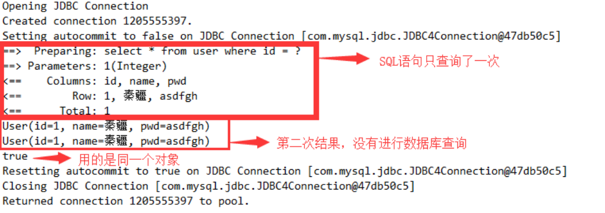

   

#### 11.3.2 一级缓存失效的四种情况

一级缓存是SqlSession级别的缓存，是一直开启的，我们关闭不了它；

一级缓存失效情况：没有使用到当前的一级缓存，效果就是，还需要再向数据库中发起一次查询请求！

1. sqlSession不同

   ```java
   @Test public void testQueryUserById(){ 
       SqlSession session = MybatisUtils.getSession(); 
       SqlSession session2 = MybatisUtils.getSession(); 
       UserMapper mapper = session.getMapper(UserMapper.class); 
       UserMapper mapper2 = session2.getMapper(UserMapper.class);
       User user = mapper.queryUserById(1); 
       System.out.println(user); 
       User user2 = mapper2.queryUserById(1); 
       System.out.println(user2); 
       System.out.println(user==user2); 
       session.close(); 
       session2.close(); 
   }
   ```

   观察结果：发现发送了两条SQL语句！

   **结论：**每个sqlSession中的缓存相互独立

2. sqlSession相同，查询条件不同

   ```java
   @Test public void testQueryUserById(){ 
       SqlSession session = MybatisUtils.getSession(); 
       UserMapper mapper = session.getMapper(UserMapper.class);
       UserMapper mapper2 = session.getMapper(UserMapper.class);
       User user = mapper.queryUserById(1);
       System.out.println(user); 
       User user2 = mapper2.queryUserById(2); 
       System.out.println(user2); 
       System.out.println(user==user2); 
       session.close(); 
   }
   ```

   观察结果：发现发送了两条SQL语句！很正常的理解

   **结论：**当前缓存中，不存在这个数据

3. sqlSession相同，两次查询之间执行了增删改操作！

   - 增加方法

     ```java
     //修改用户 
     int updateUser(Map map);
     ```

   - 编写SQL

     ```xml
     <update id="updateUser" parameterType="map"> 
         update user set name = #{name} where id = #{id} 
     </update>
     ```

   - 测试

     ```java
     @Test public void testQueryUserById(){ 
         SqlSession session = MybatisUtils.getSession();
         UserMapper mapper = session.getMapper(UserMapper.class); 
         User user = mapper.queryUserById(1); 
         System.out.println(user); 
         HashMap map = new HashMap(); 
         map.put("name","kuangshen"); 
         map.put("id",4); 
         mapper.updateUser(map); 
         User user2 = mapper.queryUserById(1);
         System.out.println(user2); 
         System.out.println(user==user2); 
         session.close(); 
     }
     ```

     观察结果：查询在中间执行了增删改操作后，重新执行了

     **结论：**因为增删改操作可能会对当前数据产生影响

4. sqlSession相同，手动清除一级缓存

   ```java
   @Test public void testQueryUserById(){ 
       SqlSession session = MybatisUtils.getSession(); 
       UserMapper mapper = session.getMapper(UserMapper.class); 
       User user = mapper.queryUserById(1); 
       System.out.println(user);
       session.clearCache();//手动清除缓存 
       User user2 = mapper.queryUserById(1); 
       System.out.println(user2); 
       System.out.println(user==user2); 
       session.close(); 
   }
   ```

**一级缓存就是一个map**

### 11.4 二级缓存

二级缓存也叫全局缓存，一级缓存作用域太低了，所以诞生了二级缓存

基于namespace级别的缓存，一个名称空间，对应一个二级缓存；

工作机制

- 一个会话查询一条数据，这个数据就会被放在当前会话的一级缓存中；
- 如果当前会话关闭了，这个会话对应的一级缓存就没了；但是我们想要的是，会话关闭了，一级缓存中的数据被保存到二级缓存中；
- 新的会话查询信息，就可以从二级缓存中获取内容；
- 不同的mapper查出的数据会放在自己对应的缓存（map）中；

#### 11.4.1 使用步骤

[官方文档](http://www.mybatis.org/mybatis-3/zh/sqlmap-xml.html#cache)

1. 开启全局缓存 【mybatis-confifig.xml】 

   ```xml
   <setting name="cacheEnabled" value="true"/>
   ```

2. 去每个mapper.xml中配置使用二级缓存，这个配置非常简单；【xxxMapper.xml】 

   ```xml
   <cache/> 
   官方示例=====>查看官方文档 
   <cache 
          eviction="FIFO" 
          flushInterval="60000" 
          size="512" 
          readOnly="true"/> 
   这个更高级的配置创建了一个 FIFO 缓存，每隔 60 秒刷新，最多可以存储结果对象或列表的 512 个引用，而且返回的对象被认为是只读的，因此对它们进行修改可能会在不同线程中的调用者 产生冲突。
   ```

3. 代码测试

   - 所有的实体类先实现序列化接口

   - 测试代码

     ```java
     @Test public void testQueryUserById(){ 
         SqlSession session = MybatisUtils.getSession(); 
         SqlSession session2 = MybatisUtils.getSession(); 
         UserMapper mapper = session.getMapper(UserMapper.class); 
         UserMapper mapper2 = session2.getMapper(UserMapper.class); 
         User user = mapper.queryUserById(1); 
         System.out.println(user); session.close(); 
         User user2 = mapper2.queryUserById(1); 
         System.out.println(user2); 
         System.out.println(user==user2); 
         session2.close(); 
     }
     ```

     


#### 11.4.2 结论

- 只要开启了二级缓存，我们在同一个Mapper中的查询，可以在二级缓存中拿到数据
- 查出的数据都会被默认先放在一级缓存中
- 只有会话提交或者关闭以后，一级缓存中的数据才会转到二级缓存中

### 11.5 缓存原理

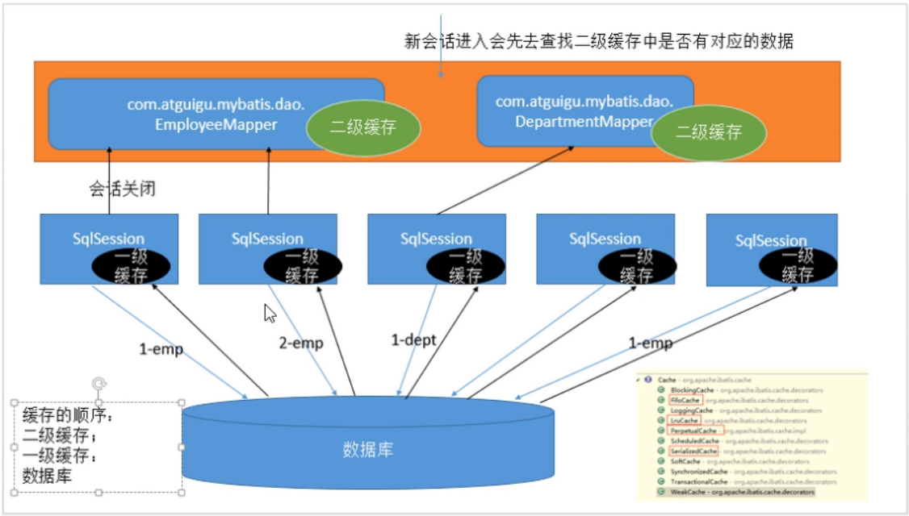


### 11.6 EhCache

*第三方缓存实现--EhCache: 查看百度百科*

- [官方文档](http://www.mybatis.org/ehcache-cache/)

- Ehcache是一种广泛使用的java分布式缓存，用于通用缓存；

- 要在应用程序中使用Ehcache，需要引入依赖的jar包 

  ```xml
  <!-- https://mvnrepository.com/artifact/org.mybatis.caches/mybatis- ehcache --> 
  <dependency> 
      <groupId>org.mybatis.caches</groupId> 
      <artifactId>mybatis-ehcache</artifactId> 
      <version>1.1.0</version> 
  </dependency>
  ```

- 在mapper.xml中使用对应的缓存即可

  ```xml
  <mapper namespace = “org.acme.FooMapper” > 
      <cache type = “org.mybatis.caches.ehcache.EhcacheCache” /> 
  </mapper>
  ```

- 编写ehcache.xml文件，如果在 加载时 未找到 /ehcache.xml 资源或出现问题，则将使用默认配置。

  ```xml
  <?xml version="1.0" encoding="UTF-8"?> 
  <ehcache xmlns:xsi="http://www.w3.org/2001/XMLSchema-instance" 
           xsi:noNamespaceSchemaLocation="http://ehcache.org/ehcache.xsd" 
           updateCheck="false"> 
      <!--
  		diskStore：为缓存路径，ehcache分为内存和磁盘两级，此属性定义磁盘的缓存位 置。
  		参数解释如下： 
  			user.home – 用户主目录 
  			user.dir – 用户当前工作目录 
  			java.io.tmpdir – 默认临时文件路径 
  	--> 
      <diskStore path="./tmpdir/Tmp_EhCache"/>
      <defaultCache 
                    eternal="false" 
                    maxElementsInMemory="10000" 
                    overflowToDisk="false" 
                    diskPersistent="false" 
                    timeToIdleSeconds="1800" 
                    timeToLiveSeconds="259200" 
                    memoryStoreEvictionPolicy="LRU"/> 
      <cache 
             name="cloud_user" 
             eternal="false" 
             maxElementsInMemory="5000" 
             overflowToDisk="false" 
             diskPersistent="false" 
             timeToIdleSeconds="1800" 
             timeToLiveSeconds="1800" 
             memoryStoreEvictionPolicy="LRU"/> 
      <!--defaultCache：默认缓存策略，当ehcache找不到定义的缓存时，则使用这个缓存策 略。只能定义一个。 --> 
      <!--name:缓存名称。 
  		maxElementsInMemory:缓存最大数目 
  		maxElementsOnDisk：硬盘最大缓存个数。 
  		eternal:对象是否永久有效，一但设置了，timeout将不起作用。 
  		overflowToDisk:是否保存到磁盘，当系统当机时 
  		timeToIdleSeconds:设置对象在失效前的允许闲置时间（单位：秒）。仅当 eternal=false对象不是永久有效时使用，可选属性，默认值是0，也就是可闲置时间无穷大。 
  		timeToLiveSeconds:设置对象在失效前允许存活时间（单位：秒）。最大时间介于创建 时间和失效时间之间。仅当eternal=false对象不是永久有效时使用，默认是0.，也就是对象存 活时间无穷大。 
  		diskPersistent：是否缓存虚拟机重启期数据 Whether the disk store persists between restarts of the Virtual Machine. The default value is false.diskSpoolBufferSizeMB：这个参数设置DiskStore（磁盘缓存）的缓存区大小。默 认是30MB。每个Cache都应该有自己的一个缓冲区。 
  		diskExpiryThreadIntervalSeconds：磁盘失效线程运行时间间隔，默认是120秒。 		
  		memoryStoreEvictionPolicy：当达到maxElementsInMemory限制时，Ehcache将 会根据指定的策略去清理内存。默认策略是LRU（最近最少使用）。你可以设置为FIFO（先进先 出）或是LFU（较少使用）。 	
  		clearOnFlush：内存数量最大时是否清除。 
  		memoryStoreEvictionPolicy:可选策略有：
  			LRU（最近最少使用，默认策略）、
  			FIFO（先进先出）、
  			LFU（最少访问次数）。 
  			FIFO，first in first out，这个是大家最熟的，先进先出。 LFU， Less Frequently Used，就是上面例子中使用的策略，直白一点就是讲一直以 来最少被使用的。如上面所讲，缓存的元素有一个hit属性，hit值最小的将会被清出缓存。 LRU，Least Recently Used，最近最少使用的，缓存的元素有一个时间戳，当缓存容 量满了，而又需要腾出地方来缓存新的元素的时候，那么现有缓存元素中时间戳离当前时间最远的 元素将被清出缓存。 
  --> 
  </ehcache>
  ```

  


