# Redis5.x

> 视频: https://www.bilibili.com/video/BV1S54y1R7SB
>
>  从Nosql聊起，深入redis基本类型使用，拓展特殊类型 连接jedis，使用springboot集成，上手实战开发 事务、配置文件详解、发布订阅、持久化机制、主从复制、哨兵模式、缓存穿透和雪崩处理 给你带来最全面的Redis讲解

## 1. NoSQL概述

## 2. Redis入门

### 1. Redis概述

**1.1 Redis是什么?**

- Redis: (REmote DIctionary Server)远程字典服务器
- Redis是完全开源免费的,用C语言编写的,遵守BSD协议,是一个高性能的key-value分布式数据库
- redis基于内存运行,并支持持久化的NoSQL数据库,是当前最rem的NoSQL数据库之一,也被称为数据结构服务器
- redis不仅仅局限于java语言,市面上的热门语言比如java,go,python...都支持redis

**1.2 Redis相比于其他key-value缓存产品的几个特点**

- Redis支持数据的持久化,可以将内存中的数据保存在磁盘中,重启的时候可以再次加载进行使用,redis实现持久化的方式有两种(RDB,AOF)
- Redis不仅仅支持简单的key-value类型的数据,同时还提供list,set,zset,hash等数据结构的存储
- Redis支持数据的备份,即master-slave模式的数据备份

**1.3 Redis能干嘛**

- 内存存储和持久化: redis支持异步将内存中的数据写到硬盘上,同时不影响继续服务取最新N个数据的操作,如:可以将最新的10条评论的ID房在redis的list集合里面
- 发布丶订阅消息系统
- 地图信息分析
- 定时器丶计数器

**1.4 Redis特性**

- 数据类型丶基本操作和配置
- 持久化和复制,RDB,AOF
- 事务的控制
- 支持集群

**1.5 Redis文档**

- https://redis.io/ redis官网

- http://www.redis.cn redis中文网


### 2. Windows安装Redis(了解)

2.1 下载地址：https://github.com/dmajkic/redis/downloads 

2.2 解压

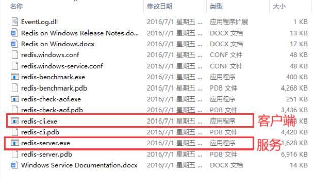

2.3 双击redis-server.exe**启动服务**完事

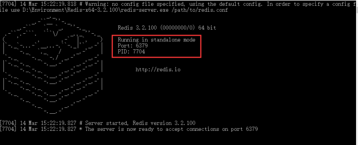

2.4 双击redis-cli.ext 客户端去访问(注意:服务端不能关闭)

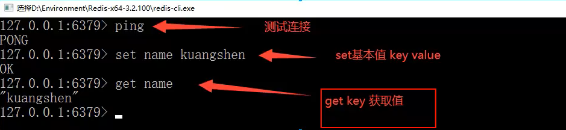


### 3. Linux安装Redis(重点)

下载地址: http://download.redis.io/releases/redis-5.0.7.tar.gz

#### 3.1 安装包移动到linux中

- 程序安装包一般放到/opt目录下

- 通过xftp将下载redis-5.0.7.tar.gz移动到服务器的opt目录下面并使用` tar -zxvf redis-5.0.7.tar.gz `命令进行解压

  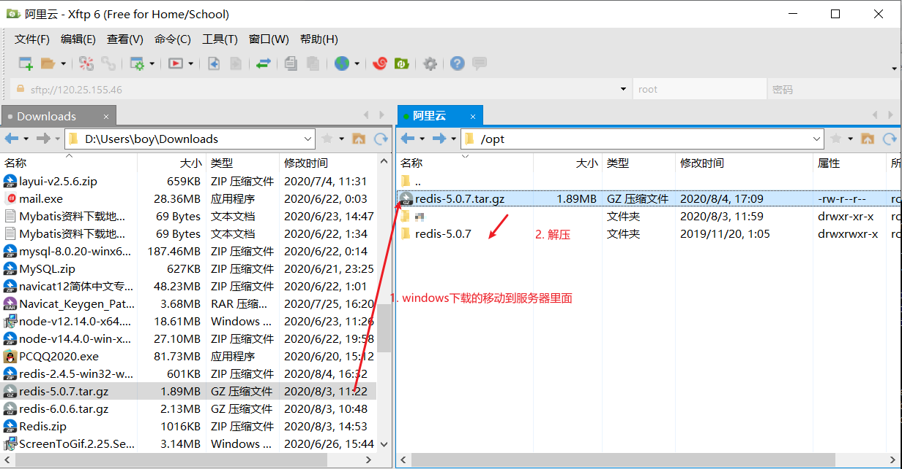

- 进入解压后的文件可以看到redis的配置文件redis.conf(可修改)

  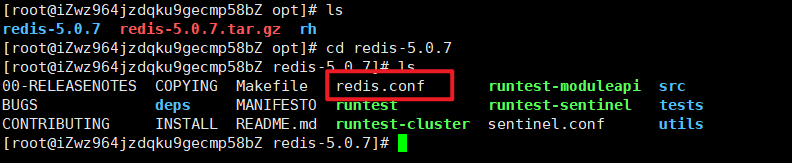

#### 3.2 安装GCC

redis需要基础的gcc环境所以需要安装gcc

- ` yum install gcc-c++ `
- 查看gcc版本`gcc-v` 
- ps: 如果出现了问题可以升级gcc版本

#### 3.3 执行make

- 执行`make`命令,会自动进行安装等待就行(可以多make几次)

  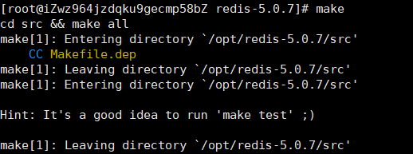

- 或者执行`make install` 来确定是否安装成功注意:如果不执行(usr/bin是空的)

  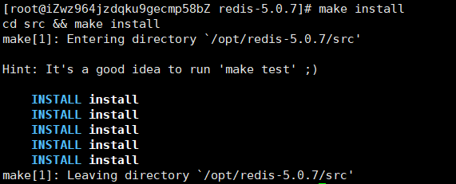

#### 3.4 redis的默认安装路径

- linu中安装程序默认在在usr目录里面

- redis程序在usr/local/bin里面

  - redis-server ==> 服务端 
  - redis-cli==>客户端

  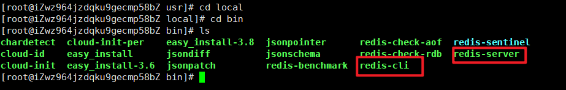

#### 3.5 复制redis.config

将/opt/redis-5.0.8/redis.config中的文件复制到安装路径下

保证好的习惯: 不改变原来的配置文件内容,配置的时候使用的是copy的所以可以自由发挥,想怎么玩怎么玩

```bash
[root@iZwz964jzdqku9gecmp58bZ /]# cd usr/local/bin  # 进入usr/local/bin中 这个目录主要用于放安装程序的
[root@iZwz964jzdqku9gecmp58bZ bin]# ls
chardetect  cloud-init-per    easy_install-3.8  jsonpointer      redis-check-aof  redis-sentinel
cloud-id    easy_install      jsondiff          jsonschema       redis-check-rdb  redis-server
cloud-init  easy_install-3.6  jsonpatch         redis-benchmark  redis-cli
[root@iZwz964jzdqku9gecmp58bZ bin]# mkdir myconfig  # 创建一个文件夹用于存放redis.conf配置文件
[root@iZwz964jzdqku9gecmp58bZ bin]# cp /opt/redis-5.0.7/redis.conf myconfig  # 将前面解压的配置文件copy到这里
[root@iZwz964jzdqku9gecmp58bZ bin]# ls
chardetect  cloud-init-per    easy_install-3.8  jsonpointer  redis-benchmark  redis-cli
cloud-id    easy_install      jsondiff          jsonschema   redis-check-aof  redis-sentinel
cloud-init  easy_install-3.6  jsonpatch         myconfig     redis-check-rdb  redis-server
[root@iZwz964jzdqku9gecmp58bZ bin]# cd myconfig
[root@iZwz964jzdqku9gecmp58bZ myconfig]# ls
redis.conf  # 自己创建的目录中有redis.conf文件了,启动redis时都通过这个配置文件启动!!!
[root@iZwz964jzdqku9gecmp58bZ myconfig]# 

```

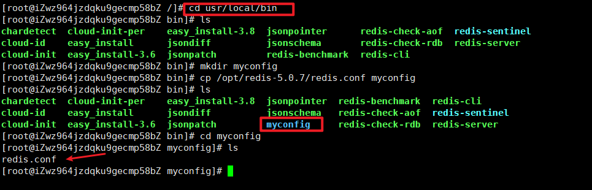

#### 3.6 启动redis

由于启动redis是通过配置文件启动的,我们可以配置一个自己的配置文件,每次通过这个配置文件来启动

修改自己的配置文件中的一些内容如下:

##### 3.6.1 修改ip

默认是127.0.0.1 修改为0.0.0.0 表示所有

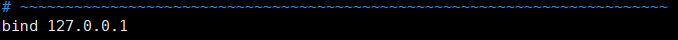

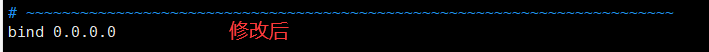

##### 3.6.2 修改daemonize 为yes

redis默认不是后台启动的,需要修改配置文件,值为yes就是以后台方式启动

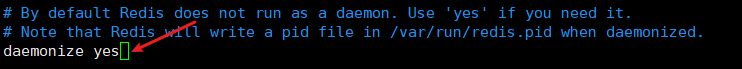

daemonize:yes和daemonize:no

- redis采用的是单进程多线程的模式。当redis.conf中选项daemonize设置成yes时，代表开启守护进程模式。在该模式下，redis会在后台运行，并将进程pid号写入redis.conf选项pidfifile设置的文件中，此时redis将一直运行，除非手动kill该进程。
- 当daemonize选项设置成no时，当前界面将进入redis的命令行界面，exit强制退出或者关闭连接工具(putty,xshell等)都会导致redis进程退出。

##### 3.6.3 启动reids服务端

```bash
#查看当前目录
[root@iZwz964jzdqku9gecmp58bZ bin]# pwd  
/usr/local/bin
# 通过指定的配置的redis.conf文件启动Redis服务
[root@iZwz964jzdqku9gecmp58bZ bin]# redis-server myconfig/redis.conf 

```

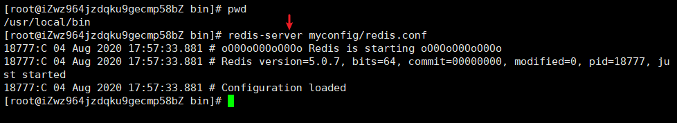

##### 3.6.4 启动redis客户端

```bash
[root@iZwz964jzdqku9gecmp58bZ bin]# pwd
/usr/local/bin
# 客户端     ip(用的阿里云)     端口     服务器密码
[root@iZwz964jzdqku9gecmp58bZ bin]# redis-cli -h 120.25.155.46 -p 6379 -a ws1baba..
Warning: Using a password with '-a' or '-u' option on the command line interface may not be safe.
# [测试]查看所有的键 也可以使用ping 如果是PONG也是成功!
120.25.155.46:6379> keys *
1) "key"
2) "keyUser"

```

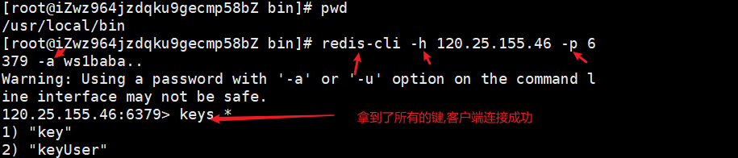

##### 3.6.5 查看redis的进程是否开启

```bash
[root@iZwz964jzdqku9gecmp58bZ ~]# ps -ef | grep redis
root     15998     1  0 Aug03 ?        00:01:57 ./redis-server 0.0.0.0:6379
root     21910 21814  0 18:56 pts/2    00:00:00 redis-cli -h 120.25.155.46 -p 6379 -a ws1baba..
root     22706 21693  0 19:09 pts/0    00:00:00 grep --color=auto redis
```

##### 3.6.6 关闭redis

```bash
# 【redis】关闭连接 
120.25.155.46:6379> shutdown 
# 表示未连接
not connected> exit
[root@iZwz964jzdqku9gecmp58bZ ~]#
```


### 4. Redis-banchmark

官方自带的一款Redis性能测试工具,可以有效的测试Redis服务的性能


`redis-banchmark 命令参数`

| 序号 | 选项      | 描述                                       | 默认值    |
| ---- | --------- | ------------------------------------------ | --------- |
| 1    | **-h**    | 指定服务器主机名                           | 127.0.0.1 |
| 2    | **-p**    | 指定服务器端口                             | 6379      |
| 3    | **-s**    | 指定服务器 socket                          |           |
| 4    | **-c**    | 指定并发连接数                             | 50        |
| 5    | **-n**    | 指定请求数                                 | 10000     |
| 6    | **-d**    | 以字节的形式指定 SET/GET 值的数据大小      | 2         |
| 7    | **-k**    | 1=keep alive 0=reconnect                   | 1         |
| 8    | **-r**    | SET/GET/INCR 使用随机 key, SADD 使用随机值 |           |
| 9    | **-P**    | 通过管道传输 请求                          | 1         |
| 10   | **-q**    | 强制退出 redis。仅显示 query/sec 值        |           |
| 11   | **--csv** | 以 CSV 格式输出                            |           |
| 12   | **-l**    | 生成循环，永久执行测试                     |           |
| 13   | **-t**    | 仅运行以逗号分隔的测试命令列表。           |           |
| 14   | **-I**    | Idle 模式。仅打开 N 个 idle 连接并等待。   |           |

压力测试例子

```bash
[root@iZwz964jzdqku9gecmp58bZ /]# cd usr/local/bin
[root@iZwz964jzdqku9gecmp58bZ bin]# ls
chardetect  cloud-init-per    easy_install-3.8  jsonpointer  redis-benchmark  redis-cli
cloud-id    easy_install      jsondiff          jsonschema   redis-check-aof  redis-sentinel
cloud-init  easy_install-3.6  jsonpatch         myconfig     redis-check-rdb  redis-server
#  测试一：100个并发连接，100000个请求，检测host为120.25.155.46 端口为6379的redis服务器性能
[root@iZwz964jzdqku9gecmp58bZ bin]# redis-benchmark -h 120.redis-benchmark -h 120.25.155.46 -p 6379 -c 100 -n 1000
```

参数分析

```bash
====== SET ======
  1000 requests completed in 1.64 seconds # 对集合写入测试
  100 parallel clients  # 每次请求有100个并发客户端
  3 bytes payload # 每次写入3个字节的数据，有效载荷
  keep alive: 1 # 保持一个连接，一台服务器来处理这些请求

0.10% <= 1 milliseconds
10.50% <= 2 milliseconds
70.20% <= 3 milliseconds
84.50% <= 202 milliseconds
84.60% <= 204 milliseconds
87.20% <= 205 milliseconds
87.40% <= 207 milliseconds
87.50% <= 226 milliseconds
87.80% <= 283 milliseconds
87.90% <= 405 milliseconds
88.10% <= 407 milliseconds
88.20% <= 408 milliseconds
90.10% <= 539 milliseconds
90.70% <= 607 milliseconds
90.90% <= 610 milliseconds
91.40% <= 662 milliseconds
91.80% <= 697 milliseconds
93.90% <= 808 milliseconds
94.20% <= 809 milliseconds
94.50% <= 811 milliseconds
94.80% <= 813 milliseconds
95.00% <= 814 milliseconds
95.50% <= 892 milliseconds
95.70% <= 897 milliseconds
95.80% <= 926 milliseconds
95.90% <= 1094 milliseconds
96.00% <= 1096 milliseconds
98.40% <= 1149 milliseconds
98.70% <= 1150 milliseconds
99.10% <= 1152 milliseconds
99.70% <= 1168 milliseconds
99.90% <= 1217 milliseconds
100.00% <= 1629 milliseconds  # 所有请求在 1629 毫秒内完成
608.64 requests per second  # 每秒处理 608.64 次请求
```

### 5. 基础知识

#### 5.1 redis默认有16个数据库

可以到 opt/redis.conf通过vim进行查看;数据库的索引是0~15

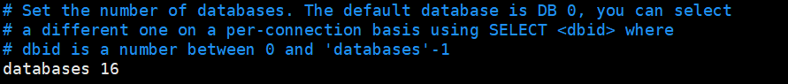

默认使用的第0个数据库


select进行数据库切换

`select 数据库索引` 


dbsize查看数据库的大小 ; keys * 查看数据库中所有键

`dbsize` 就是里面存键有多少

`keys *` 查看所有的键

```bash
# 从第4个数据库切换到第1个数据库
120.25.155.46:6379[3]> select 0
OK
# 查看所有的键
120.25.155.46:6379> keys *
1) "name2"
2) "name3"
3) "name1"
# 查看长度
120.25.155.46:6379> dbsize
(integer) 3
```

`flushall` 清空所有数据库(0-15号数据库中的所有数据都被清空)

`flushdb` 清空当前的数据库(只清除掉当前数据库中的数据)

#### 5.2 redis是单线程

**5.2.1redis为什么是单线程的?** 

- 我们首先要明白，Redis很快！官方表示，因为Redis是基于内存的操作，CPU不是Redis的瓶颈，Redis的瓶颈最有可能是机器内存的大小或者网络带宽。既然单线程容易实现，而且CPU不会成为瓶颈，那就顺理成章地采用单线程的方案了！
- Redis采用的是基于内存的采用的是单进程单线程模型的 KV 数据库，由C语言编写，官方提供的数据是可以达到100000+的QPS（每秒内查询次数）。这个数据不比采用单进程多线程的同样基于内存的 KV数据库 Memcached 差！

**5.2.2 redis为什么单线程还这么快?**

- redis是将所有的数据全部放在内存中的没所以说使用单线程去操作效率就是最高的
- 对于内存系统来说,如果没有上下文切换效率就是最高的
- 多次读写都是一个cpu上的,在内存下,这个就是最佳解决方案

**5.2.3 误区:**

- 误区1: 高性能的服务器一定是多线程的(不一定) [比如redis就是高性能但不是多线程的]

- 误区2: 多线程一定比单线程效率高(不一定) [比如redis是单线程的效率就特别高,执行效率基于内存]


## 3. 五大基本数据类型


## 4. 三种特殊数据类型


## 5. 配置文件


## 6. Redis持久化


## 7. Redis事务


## 8. Redis发布订阅


## 9. Redis主重复制


## 10. 缓存穿透和雪崩


## 11. Jedis


## 12. SpringBoot整合Redis


