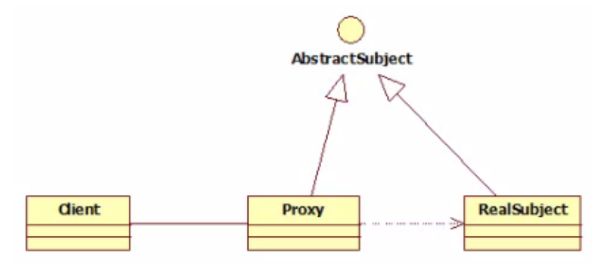
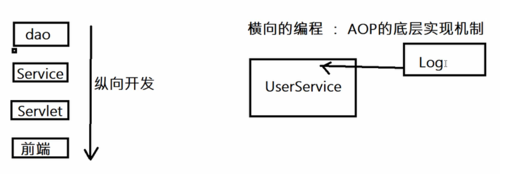
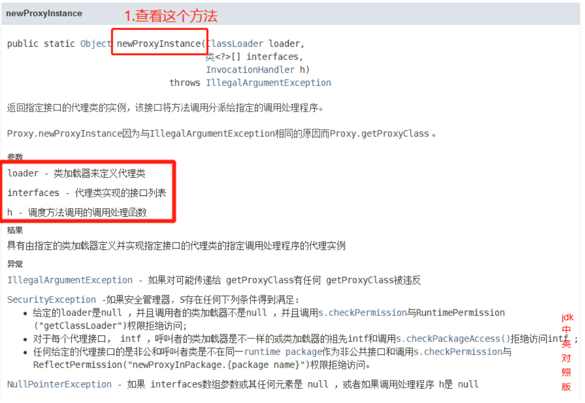

# 代理模式

*为什么要学习代理模式，因为AOP的底层机制就是动态代理！*

代理模式分类：

- 静态代理
- 动态代理

学习aop之前 , 我们要先了解一下代理模式！



## 1. 静态代理

**静态代理角色分析**

- 抽象角色 : 一般使用接口或者抽象类来实现
- 真实角色 : 被代理的角色
- 代理角色 : 代理真实角色 ; 代理真实角色后 , 一般会做一些附属的操作 .
- 客户 : 使用代理角色来进行一些操作 .

**代码实现**

1. Rent . java 即抽象角色

   ```java
   //抽象角色：租房 
   public interface Rent { 
       public void rent();
   }
   ```

2. Host . java 即真实角色

   ```java
   //真实角色: 房东，房东要出租房子 
   public class Host implements Rent{ 
       public void rent() { 
           System.out.println("房屋出租"); 
       } 
   }
   ```

3. Proxy . java 即代理角色

   ```java
   //代理角色：中介
   public class Proxy implements Rent {
       private Host host;
       public Proxy() { }
       public Proxy(Host host) {
           this.host = host; 
       }
       //租房 
       public void rent(){ 
           seeHouse(); 
           host.rent();
           fare(); 
       }
       //看房 
       public void seeHouse(){
           System.out.println("带房客看房"); 
       }
       //收中介费 
       public void fare(){ 
           System.out.println("收中介费");
       } 
   }
   ```

4. Client . java 即客户

   ```java
   //客户类，一般客户都会去找代理！ 
   public class Client { 
       public static void main(String[] args) { 
           //房东要租房 
           Host host = new Host(); 
           //中介帮助房东
           Proxy proxy = new Proxy(host); 
           //你去找中介！ 
           proxy.rent(); 
       } 
   }
   ```

**分析**： 在这个过程中，你直接接触的就是中介，就如同现实生活中的样子，你看不到房东，但是你依旧租到了房东的房子通过代理，这就是所谓的代理模式，程序源自于生活，所以学编程的人，一般能够更加抽象的看待生活中发生的事情。


## 2. 静态代理的好处

**优点:**

- 可以使得我们的真实角色更加纯粹 . 不再去关注一些公共的事情 .
- 公共的业务由代理来完成 . 实现了业务的分工 ,
- 公共业务发生扩展时变得更加集中和方便 .

**缺点 :**

- 类多了 , 多了代理类 , 工作量变大了 . 开发效率降低 .

*我们想要静态代理的好处，又不想要静态代理的缺点，所以 , 就有了动态代理 !*

## 3. 静态代理再理解

*同学们练习完毕后，我们再来举一个例子，巩固大家的学习！*

**练习步骤：**

1. 创建一个抽象角色，比如咋们平时做的用户业务，抽象起来就是增删改查！

   ```java
   //抽象角色：增删改查业务 
   public interface UserService {
       void add();
       void delete();
       void update();
       void query(); 
   }
   ```

2. 我们需要一个真实对象来完成这些增删改查操作

   ```java
   //真实对象，完成增删改查操作的人 
   public class UserServiceImpl implements UserService { 
       public void add() { 
           System.out.println("增加了一个用户");
       }
       public void delete() {
           System.out.println("删除了一个用户");
       }
       public void update() { 
           System.out.println("更新了一个用户");
       }
       public void query() {
           System.out.println("查询了一个用户");
       }
   }
   ```

**需求来了**，现在我们需要增加一个日志功能，怎么实现！

- 思路1 ：在实现类上增加代码 【麻烦！】
- 思路2：使用代理来做，能够不改变原来的业务情况下，实现此功能就是最好的了！

设置一个代理类来处理日志！ 代理角色

```java
//代理角色，在这里面增加日志的实现 
public class UserServiceProxy implements UserService { 
    private UserServiceImpl userService; 
    public void setUserService(UserServiceImpl userService) { 
        this.userService = userService; 
    }
    public void add() { 
        log("add"); 
        userService.add(); 
    }
    public void delete() {
        log("delete"); 
        userService.delete();
    }
    public void update() {
        log("update"); 
        userService.update(); 
    }
    public void query() {
        log("query");
        userService.query(); 
    }
    public void log(String msg){
        System.out.println("执行了"+msg+"方法");
    } 
}
```

 测试访问类：

```java
public class Client { 
    public static void main(String[] args) {
        //真实业务 
        UserServiceImpl userService = new UserServiceImpl(); 
        //代理类 
        UserServiceProxy proxy = new UserServiceProxy(); 
        //使用代理类实现日志功能！ 
        proxy.setUserService(userService); proxy.add();
    } 
}
```

OK，到了现在代理模式大家应该都没有什么问题了，重点大家需要理解其中的思想；

**我们在不改变原来的代码的情况下，实现了对原有功能的增强，这是AOP中最核心的思想**

【聊聊AOP：纵向开发，横向开发】



## 4. 动态代理

动态代理的角色和静态代理的一样 .

动态代理的代理类是动态生成的 . 静态代理的代理类是我们提前写好的

动态代理分为两类 : 一类是基于接口动态代理 , 一类是基于类的动态代理

- 基于接口的动态代理----JDK动态代理

- 基于类的动态代理--cglib

- 现在用的比较多的是 javasist 来生成动态代理 . 百度一下javasist
- 我们这里使用JDK的原生代码来实现，其余的道理都是一样的！

**JDK的动态代理需要了解两个类:** 核心 :` InvocationHandler `和 `Proxy `， 打开JDK帮助文档看看

【InvocationHandler：调用处理程序】


```java
Object invoke(Object proxy, 方法 method, Object[] args)；
    //参数 
    //proxy - 调用该方法的代理实例 
    //method -所述方法对应于调用代理实例上的接口方法的实例。 方法对象的声明类将是该方法声明的接 口，它可以是代理类继承该方法的代理接口的超级接口。 
    //args -包含的方法调用传递代理实例的参数值的对象的阵列，或null如果接口方法没有参数。 原始 类型的参数包含在适当的原始包装器类的实例中，例如java.lang.Integer或java.lang.Boolean 。
```

【Proxy : 代理】




```java
//生成代理类 
public Object getProxy(){ 
    return Proxy.newProxyInstance(this.getClass().getClassLoader(),
                                  rent.getClass().getInterfaces(),this); 
}
```

**代码实现**

*抽象角色和真实角色和之前的一样*

1. Rent . java 即抽象角色

   ```java
   //抽象角色：租房 
   public interface Rent { 
       public void rent();
   }
   ```

2. Host . java 即真实角色

   ```java
   //真实角色: 房东，房东要出租房子 
   public class Host implements Rent{
       public void rent() { 
           System.out.println("房屋出租"); 
       }
   }
   ```

3. ProxyInvocationHandler. java 即代理角色

   ```java
   public class ProxyInvocationHandler implements InvocationHandler { 
       private Rent rent;
       public void setRent(Rent rent) { 
           this.rent = rent;
       }
       //生成代理类，重点是第二个参数，获取要代理的抽象角色！之前都是一个角色，现在可以代理一 类角色
       public Object getProxy(){ 
           return Proxy.newProxyInstance(this.getClass().getClassLoader(), 
                                         rent.getClass().getInterfaces(),this); 
       }
       // proxy : 代理类 method : 代理类的调用处理程序的方法对象. 
       // 处理代理实例上的方法调用并返回结果 
       @Override 
       public Object invoke(Object proxy, Method method, Object[] args) throws Throwable { 
           seeHouse(); 
           //核心：本质利用反射实现！ 
           Object result = method.invoke(rent, args); 
           fare(); 
           return result; 
       }
       //看房 
       public void seeHouse(){ 
           System.out.println("带房客看房"); 
       }
       //收中介费
       public void fare(){ 
           System.out.println("收中介费"); 
       } 
   }
   ```

4. Client . java

   ```java
   //租客 
   public class Client { 
       public static void main(String[] args) {
           //真实角色
           Host host = new Host(); 
           //代理实例的调用处理程序 
           ProxyInvocationHandler pih = new ProxyInvocationHandler();
           pih.setRent(host); 
           //将真实角色放置进去！ 
           Rent proxy = (Rent)pih.getProxy(); 
           //动态生成对应的代理类！ 
           proxy.rent(); 
       } 
   }
   ```

   

**核心**：一个动态代理 , 一般代理某一类业务 , 一个动态代理可以代理多个类，代理的是接口！、


## 5. 深化代理

我们来使用动态代理实现代理我们后面写的UserService！

我们也可以编写一个通用的动态代理实现的类！所有的代理对象设置为Object即可！

```java
public class ProxyInvocationHandler implements InvocationHandler { 
    private Object target; public void setTarget(Object target) { 
        this.target = target;
    }
    //生成代理类
    public Object getProxy(){
        return Proxy.newProxyInstance(this.getClass().getClassLoader(), 
                                      target.getClass().getInterfaces(),this);
    }
    // proxy : 代理类 
    // method : 代理类的调用处理程序的方法对象. 
    public Object invoke(Object proxy, Method method, Object[] args) throws Throwable { 
        log(method.getName());
        Object result = method.invoke(target, args); 
        return result; 
    }
    public void log(String methodName){ 
        System.out.println("执行了"+methodName+"方法"); 
    } 
}
```

测试:

```java
public class Test {
    public static void main(String[] args) { 
        //真实对象
        UserServiceImpl userService = new UserServiceImpl(); 
        //代理对象的调用处理程序
        ProxyInvocationHandler pih = new ProxyInvocationHandler();
        pih.setTarget(userService);
        //设置要代理的对象 
        UserService proxy = (UserService)pih.getProxy(); 
        //动态生成代理类！
        proxy.delete();
    }
}
```

【测试，增删改查，查看结果】

## 6. 动态代理的好处

*静态代理有的它都有，静态代理没有的，它也有！*

- 可以使得我们的真实角色更加纯粹 . 不再去关注一些公共的事情 .
- 公共的业务由代理来完成 . 实现了业务的分工 ,
- 公共业务发生扩展时变得更加集中和方便 .
- 一个动态代理 , 一般代理某一类业务
- 一个动态代理可以代理多个类，代理的是接口！


