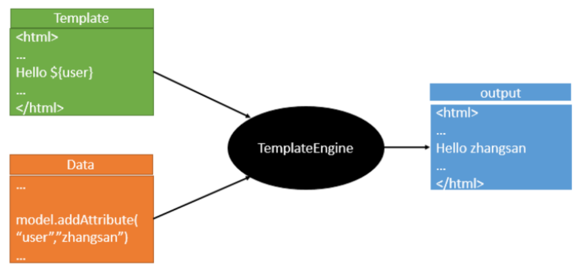
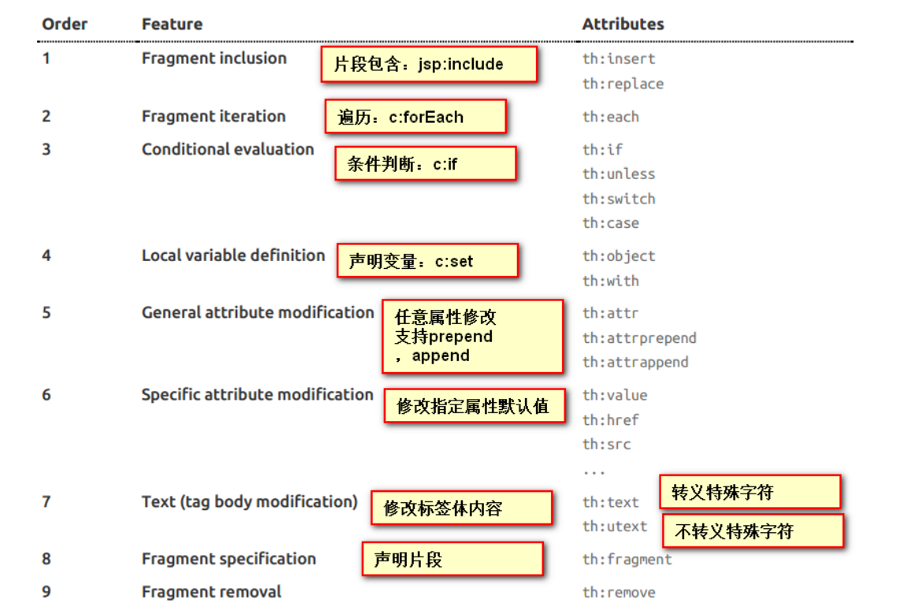

# SpringBoot开发单体应用

##  1. Web开发探究

**简介**

好的，同学们，那么接下来呢，我们开始学习SpringBoot与Web开发，从这一章往后，就属于我们实战部分的内容了；

其实SpringBoot的东西用起来非常简单，因为SpringBoot最大的特点就是自动装配。

**使用SpringBoot的步骤：**

1、创建一个SpringBoot应用，选择我们需要的模块，SpringBoot就会默认将我们的需要的模块自动配置好。

2、手动在配置文件中配置部分配置项目就可以运行起来了。

3、专注编写业务代码，不需要考虑以前那样一大堆的配置了。

要熟悉掌握开发，之前学习的自动配置的原理一定要搞明白！

比如SpringBoot到底帮我们配置了什么？我们能不能修改？我们能修改哪些配置？我们能不能扩展？

- 向容器中自动配置组件 ： *** Autoconfifiguration
- 自动配置类，封装配置文件的内容：***Properties

没事就找找类，看看自动装配原理！

我们之后来进行一个单体项目的小项目测试，让大家能够快速上手开发！


##  2. 静态资源处理

### 2.1 静态资源映射规则

首先，我们搭建一个普通的SpringBoot项目，回顾一下HelloWorld程序！【演示】

写请求非常简单，那我们要引入我们前端资源，我们项目中有许多的静态资源，比如css，js等文件，这个SpringBoot怎么处理呢？

如果我们是一个web应用，我们的main下会有一个webapp，我们以前都是将所有的页面导在这里面的，对吧！但是我们现在的pom呢，打包方式是为jar的方式，那么这种方式SpringBoot能不能来给我们写页面呢？当然是可以的，但是SpringBoot对于静态资源放置的位置，是有规定的！

**我们先来聊聊这个静态资源映射规则：**

SpringBoot中，SpringMVC的web配置都在 WebMvcAutoConfifiguration 这个配置类里面；

我们可以去看看 WebMvcAutoConfifigurationAdapter 中有很多配置方法；

有一个方法： `addResourceHandlers `添加资源处理

```java
@Override public void addResourceHandlers(ResourceHandlerRegistry registry) { if (!this.resourceProperties.isAddMappings()) {// 已禁用默认资源处理 logger.debug("Default resource handling disabled"); return; }// 缓存控制 Duration cachePeriod = this.resourceProperties.getCache().getPeriod(); CacheControl cacheControl = this.resourceProperties.getCache().getCachecontrol().toHttpCacheControl(); // webjars 配置 if (!registry.hasMappingForPattern("/webjars/**")) { customizeResourceHandlerRegistration(registry.addResourceHandler("/webjars/ **") .addResourceLocations("classpath:/META-INF/resources/webjars/") .setCachePeriod(getSeconds(cachePeriod)).setCacheControl(cacheControl)); }// 静态资源配置 String staticPathPattern = this.mvcProperties.getStaticPathPattern(); if (!registry.hasMappingForPattern(staticPathPattern)) { customizeResourceHandlerRegistration(registry.addResourceHandler(staticPath Pattern) .addResourceLocations(getResourceLocations(this.resourceProperties.getStatic Locations())) .setCachePeriod(getSeconds(cachePeriod)).setCacheControl(cacheControl)); } }
```

读一下源代码：比如所有的 /webjars/** ， 都需要去 classpath:/META-INF/resources/webjars/ 找对应的资源；


### 2.2 那什么是webjars呢？

Webjars本质就是以jar包的方式引入我们的静态资源 ， 我们以前要导入一个静态资源文件，直接导入即可。

使用SpringBoot需要使用Webjars，我们可以去搜索一下：

- 网站：https://www.webjars.org 【网站带看，并引入jQuery测试】

要使用jQuery，我们只要要引入jQuery对应版本的pom依赖即可！

```xml
<dependency> <groupId>org.webjars</groupId> <artifactId>jquery</artifactId> <version>3.4.1</version> </dependency>
```

导入完毕，查看webjars目录结构，并访问Jquery.js文件！

访问：只要是静态资源，SpringBoot就会去对应的路径寻找资源，我们这里访问 ：`http://localhost:8080/webjars/jquery/3.4.1/jquery.js`

### 2.3 第二种静态资源映射规则

那我们项目中要是使用自己的静态资源该怎么导入呢？我们看下一行代码；

我们去找staticPathPattern发现第二种映射规则 ： /** , 访问当前的项目任意资源，它会去找resourceProperties 这个类，我们可以点进去看一下分析：

```java
// 进入方法 public String[] getStaticLocations() { return this.staticLocations; }// 找到对应的值 private String[] staticLocations = CLASSPATH_RESOURCE_LOCATIONS; // 找到路径 private static final String[] CLASSPATH_RESOURCE_LOCATIONS = { "classpath:/META-INF/resources/", "classpath:/resources/", "classpath:/static/", "classpath:/public/" };
```

ResourceProperties 可以设置和我们静态资源有关的参数；这里面指向了它会去寻找资源的文件夹，即上面数组的内容。

所以得出结论，以下四个目录存放的静态资源可以被我们识别：

```
"classpath:/META-INF/resources/" "classpath:/resources/" "classpath:/static/" "classpath:/public/"
```

我们可以在resources根目录下新建对应的文件夹，都可以存放我们的静态文件；

比如我们访问 http://localhost:8080/1.js , 他就会去这些文件夹中寻找对应的静态资源文件;

### 2.4 自定义静态资源路径

我们也可以自己通过配置文件来指定一下，哪些文件夹是需要我们放静态资源文件的，在application.properties中配置；

```properties
spring.resources.static-locations=classpath:/coding/,classpath:/kuang/
```

一旦自己定义了静态文件夹的路径，原来的自动配置就都会失效了！

##  3. 首页处理

静态资源文件夹说完后，我们继续向下看源码！可以看到一个欢迎页的映射，就是我们的首页！

```java
@Bean public WelcomePageHandlerMapping welcomePageHandlerMapping(ApplicationContext applicationContext, FormattingConversionService mvcConversionService, ResourceUrlProvider mvcResourceUrlProvider) { WelcomePageHandlerMapping welcomePageHandlerMapping = new WelcomePageHandlerMapping( new TemplateAvailabilityProviders(applicationContext), applicationContext, getWelcomePage(), // getWelcomePage 获得欢迎页 this.mvcProperties.getStaticPathPattern()); welcomePageHandlerMapping.setInterceptors(getInterceptors(mvcConversionServ ice, mvcResourceUrlProvider)); return welcomePageHandlerMapping; }
```

点进去继续看

```java
private Optional<Resource> getWelcomePage() { String[] locations = getResourceLocations(this.resourceProperties.getStaticLocations()); // ::是java8 中新引入的运算符 // Class::function的时候function是属于Class的，应该是静态方法。 // this::function的funtion是属于这个对象的。 // 简而言之，就是一种语法糖而已，是一种简写 return Arrays.stream(locations).map(this::getIndexHtml).filter(this::isReadable).fi ndFirst(); }// 欢迎页就是一个location下的的 index.html 而已 private Resource getIndexHtml(String location) { return this.resourceLoader.getResource(location + "index.html"); }
```

欢迎页，静态资源文件夹下的所有 index.html 页面；被 /** 映射。

比如我访问 http://localhost:8080/ ，就会找静态资源文件夹下的 index.html 【可以测试一下】

新建一个 index.html ，在我们上面的3个目录中任意一个；然后访问测试 http://localhost:8080/ 看结果！

**关于网站图标说明**：

与其他静态资源一样，Spring Boot在配置的静态内容位置中查找 favicon.ico。如果存在这样的文件，它将自动用作应用程序的favicon。 

1. 关闭SpringBoot默认图标

   ```properties
   #关闭默认图标 spring.mvc.favicon.enabled=false
   ```

2. 自己放一个图标在静态资源目录下，我放在 public 目录下

3. 清除浏览器缓存！刷新网页，发现图标已经变成自己的了！

##  4. Thymeleaf

### 4.1 模板引擎

前端交给我们的页面，是html页面。如果是我们以前开发，我们需要把他们转成jsp页面，jsp好处就是当我们查出一些数据转发到JSP页面以后，我们可以用jsp轻松实现数据的显示，及交互等。

jsp支持非常强大的功能，包括能写Java代码，但是呢，我们现在的这种情况，SpringBoot这个项目首先是以jar的方式，不是war，像第二，我们用的还是嵌入式的Tomcat，所以呢，**他现在默认是不支持jsp的**。

那不支持jsp，如果我们直接用纯静态页面的方式，那给我们开发会带来非常大的麻烦，那怎么办呢？

**SpringBoot推荐你可以来使用模板引擎：**

模板引擎，我们其实大家听到很多，其实jsp就是一个模板引擎，还有以用的比较多的freemarker，包括SpringBoot给我们推荐的Thymeleaf，模板引擎有非常多，但再多的模板引擎，他们的思想都是一样的，什么样一个思想呢我们来看一下这张图：



模板引擎的作用就是我们来写一个页面模板，比如有些值呢，是动态的，我们写一些表达式。而这些值，从哪来呢，就是我们在后台封装一些数据。然后把这个模板和这个数据交给我们模板引擎，模板引擎按照我们这个数据帮你把这表达式解析、填充到我们指定的位置，然后把这个数据最终生成一个我们想要的内容给我们写出去，这就是我们这个模板引擎，不管是jsp还是其他模板引擎，都是这个思想。只不过呢，就是说不同模板引擎之间，他们可能这个语法有点不一样。其他的我就不介绍了，我主要来介绍一下SpringBoot给我们推荐的Thymeleaf模板引擎，这模板引擎呢，是一个高级语言的模板引擎，他的这个语法更简单。而且呢，功能更强大。

我们呢，就来看一下这个模板引擎，那既然要看这个模板引擎。首先，我们来看SpringBoot里边怎么用。

### 4.2 引入Thymeleaf

怎么引入呢，对于springboot来说，什么事情不都是一个start的事情嘛，我们去在项目中引入一下。给大家三个网址：

Thymeleaf 官网：https://www.thymeleaf.org/

Thymeleaf 在Github 的主页：https://github.com/thymeleaf/thymeleaf

Spring官方文档： 找到我们对应的版本https://docs.spring.io/spring-boot/docs/2.2.5.RELEASE/reference/htmlsingle/#using-boot-starter

找到对应的pom依赖：可以适当点进源码看下本来的包！

```xml
<!--thymeleaf--> <dependency> <groupId>org.springframework.boot</groupId> <artifactId>spring-boot-starter-thymeleaf</artifactId> </dependency>
```

Maven会自动下载jar包，我们可以去看下下载的东西；

### 4.3 thymeleaf 分析

前面呢，我们已经引入了Thymeleaf，那这个要怎么使用呢？

我们首先得按照SpringBoot的自动配置原理看一下我们这个Thymeleaf的自动配置规则，在按照那个规则，我们进行使用。

我们去找一下Thymeleaf的自动配置类：ThymeleafProperties

```java
@ConfigurationProperties( prefix = "spring.thymeleaf" )public class ThymeleafProperties { private static final Charset DEFAULT_ENCODING; public static final String DEFAULT_PREFIX = "classpath:/templates/"; public static final String DEFAULT_SUFFIX = ".html"; private boolean checkTemplate = true; private boolean checkTemplateLocation = true; private String prefix = "classpath:/templates/"; private String suffix = ".html"; private String mode = "HTML"; private Charset encoding; }
```

我们可以在其中看到默认的前缀和后缀！我们只需要把我们的html页面放在类路径下的templates下，thymeleaf就可以帮我们自动渲染了。使用thymeleaf什么都不需要配置，只需要将他放在指定的文件夹下即可！

**测试：**

1. 编写一个TestController

   ```java
   @Controller public class TestController { @RequestMapping("/t1") public String test1(){ //classpath:/templates/test.html return "test"; } }
   ```

2. 编写一个测试页面 test.html 放在 templates 目录下

   ```html
   <!DOCTYPE html> <html lang="en"> <head><meta charset="UTF-8"> <title>Title</title> </head> <body> <h1>测试页面</h1> </body> </html>
   ```

3. 启动项目请求测试

### 4.4 Thymeleaf 语法学习

要学习语法，还是参考官网文档最为准确，我们找到对应的版本看一下；Thymeleaf 官网：https://www.thymeleaf.org/ ， 简单看一下官网！我们去下载Thymeleaf的官方文档！

**我们做个最简单的练习 ： 我们需要查出一些数据，在页面中展示**

1、修改测试请求，增加数据传输；

```java
@RequestMapping("/t1") public String test1(Model model){ //存入数据 model.addAttribute("msg","Hello,Thymeleaf"); //classpath:/templates/test.html return "test"; }
```

2、我们要使用thymeleaf，需要在html文件中导入命名空间的约束，方便提示。

我们可以去官方文档的#3中看一下命名空间拿来过来：

```
xmlns:th="http://www.thymeleaf.org"
```

3、我们去编写下前端页面

```html
<!DOCTYPE html> <html lang="en" xmlns:th="http://www.thymeleaf.org"> <head><meta charset="UTF-8"> <title>狂神说</title> </head> <body> <h1>测试页面</h1> <!--th:text就是将div中的内容设置为它指定的值，和之前学习的Vue一样--> <div th:text="${msg}"></div> </body> </html>
```

4、启动测试！


OK，入门搞定，我们来认真研习一下Thymeleaf的使用语法！

1、我们可以使用任意的 th:attr 来替换Html中原生属性的值！参考官网文档#10； th语法



2、我们能写那些表达式呢？我们可以看到官方文档 #4

```
Simple expressions:（表达式语法） Variable Expressions: ${...}：获取变量值；OGNL；
1）、获取对象的属性、调用方法 2）、使用内置的基本对象： #18 #ctx : the context object. #vars: the context variables. #locale : the context locale. #request : (only in Web Contexts) the HttpServletRequest object. #response : (only in Web Contexts) the HttpServletResponse object. #session : (only in Web Contexts) the HttpSession object. #servletContext : (only in Web Contexts) the ServletContext object. 3）、内置的一些工具对象： #execInfo : information about the template being processed. #uris : methods for escaping parts of URLs/URIs #conversions : methods for executing the configured conversion service (if any). #dates : methods for java.util.Date objects: formatting, component extraction, etc. #calendars : analogous to #dates , but for java.util.Calendar objects. #numbers : methods for formatting numeric objects. #strings : methods for String objects: contains, startsWith, prepending/appending, etc. #objects : methods for objects in general. #bools : methods for boolean evaluation. #arrays : methods for arrays. #lists : methods for lists. #sets : methods for sets. #maps : methods for maps. #aggregates : methods for creating aggregates on arrays or collections. ============================================================================ ======Selection Variable Expressions: *{...}：选择表达式：和${}在功能上是一样； Message Expressions: #{...}：获取国际化内容 Link URL Expressions: @{...}：定义URL； Fragment Expressions: ~{...}：片段引用表达式 Literals（字面量） Text literals: 'one text' , 'Another one!' ,… Number literals: 0 , 34 , 3.0 , 12.3 ,… Boolean literals: true , false Null literal: null Literal tokens: one , sometext , main ,… Text operations:（文本操作） String concatenation: + Literal substitutions: |The name is ${name}| Arithmetic operations:（数学运算） Binary operators: + , - , * , / , % Minus sign (unary operator): - Boolean operations:（布尔运算） Binary operators: and , or Boolean negation (unary operator): ! , not Comparisons and equality:（比较运算）Comparators: > , < , >= , <= ( gt , lt , ge , le ) Equality operators: == , != ( eq , ne ) Conditional operators:条件运算（三元运算符） If-then: (if) ? (then) If-then-else: (if) ? (then) : (else) Default: (value) ?: (defaultvalue) Special tokens: No-Operation: _
```

**练习测试：**

1、 我们编写一个Controller，放一些数据

```java
@RequestMapping("/t2") public String test2(Map<String,Object> map){ //存入数据 map.put("msg","<h1>Hello</h1>"); map.put("users", Arrays.asList("qinjiang","kuangshen")); //classpath:/templates/test.html return "test"; }
```

2、测试页面取出数据

```html
<!DOCTYPE html> <html lang="en" xmlns:th="http://www.thymeleaf.org"> <head><meta charset="UTF-8"> <title>狂神说</title> </head> <body> <h1>测试页面</h1> <div th:text="${msg}"></div> <!--不转义--> <div th:utext="${msg}"></div> <!--遍历数据--> <!--th:each每次遍历都会生成当前这个标签：官网#9--> <h4 th:each="user :${users}" th:text="${user}"></h4> <h4><!--行内写法：官网#12--> <span th:each="user:${users}">[[${user}]]</span> </h4> </body> </html>
```

3、启动项目测试！

**我们看完语法，很多样式，我们即使现在学习了，也会忘记，所以我们在学习过程中，需要使用什么，根据官方文档来查询，才是最重要的，要熟练使用官方文档！**


##  5. MVC自动配置原理

### 5.1 官网阅读

### 5.2 ContentNegotiatingViewResolver 内容协商视图解析器

### 5.3 转换器和格式化器

### 5.4 修改SpringBoot的默认配置

### 5.5 全面接管SpringMVC


## 6. 员工管理系统

###  6.1 配置项目环境及首页

6.1.1 把昨天的 mybatis 整合代码拿过来

6.1.2 导入静态资源

6.1.3 首页实现

###  6.2 页面国际化

6.2.1 准备工作

6.2.2 配置文件编写

6.2.3 配置文件生效探究

6.2.4 配置页面国际化值

6.2.5 配置国际化解析

###  6.3 登录和拦截器

6.3.1 禁用模板缓存

6.3.2 登录

6.2.3 登录拦截器

###  6.4 员工列表实现

6.4.1 RestFul 风格

6.4.2 员工列表页面跳转

6.4.3 Thymeleaf 公共页面元素抽取

6.4.4 员工信息页面展示


###  6.5 添加员工实现

6.5.1 表单及细节优化

6.5.2 完整增加员工功能，我们来具体实现添加功能；

6.5.3 启动测试，前端填写数据，注意时间问题：


###  6.6 员工信息修改

6.6.1 实现

###  6.7 删除员工实现

###  6.8 404及注销

6.8.1 404

6.8.2 注销


###  6.9 定制错误数据

6.9.1 SpringBoot 默认的错误处理机制

6.9.2 错误处理原理分析

