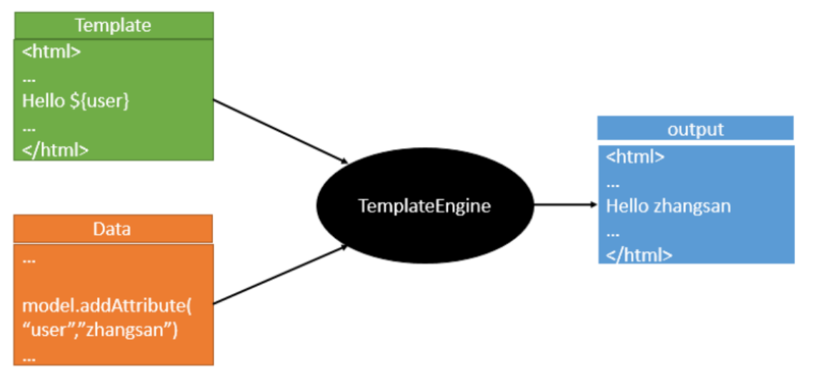
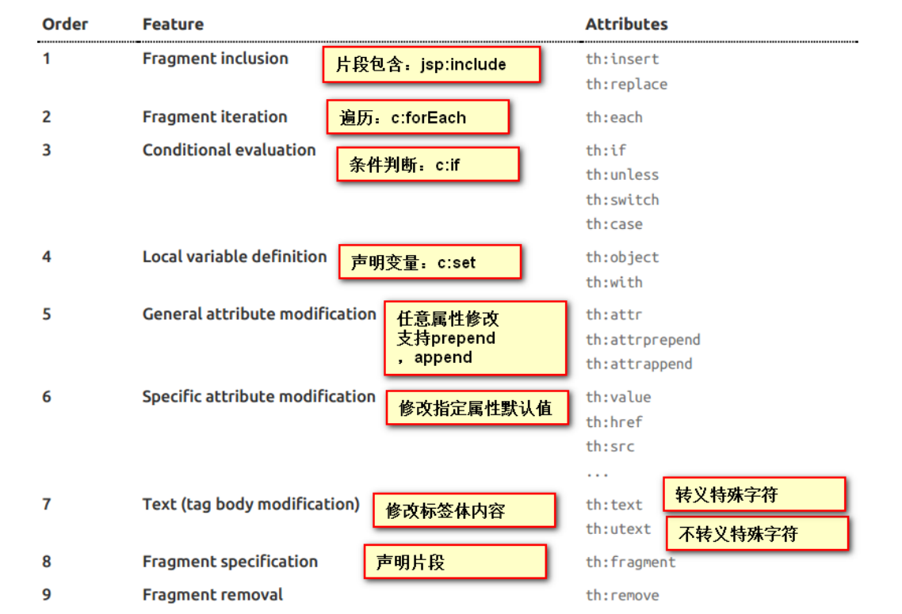
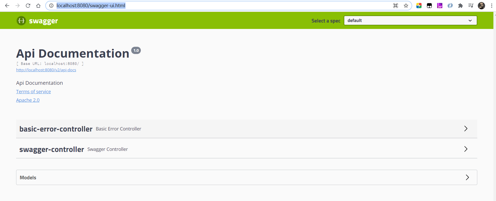
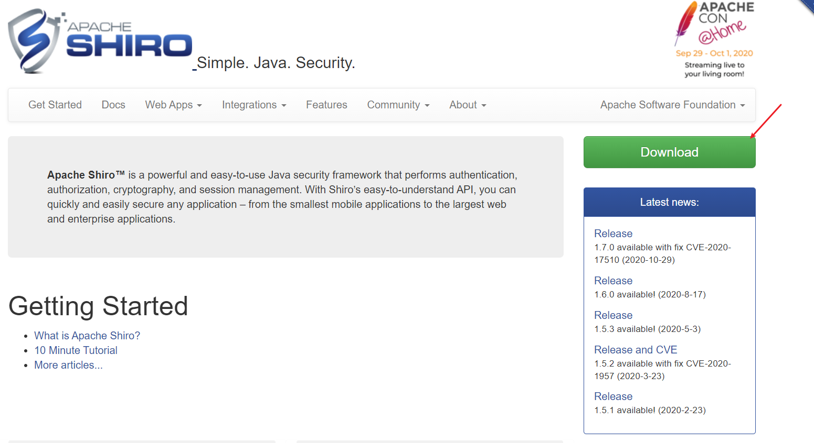
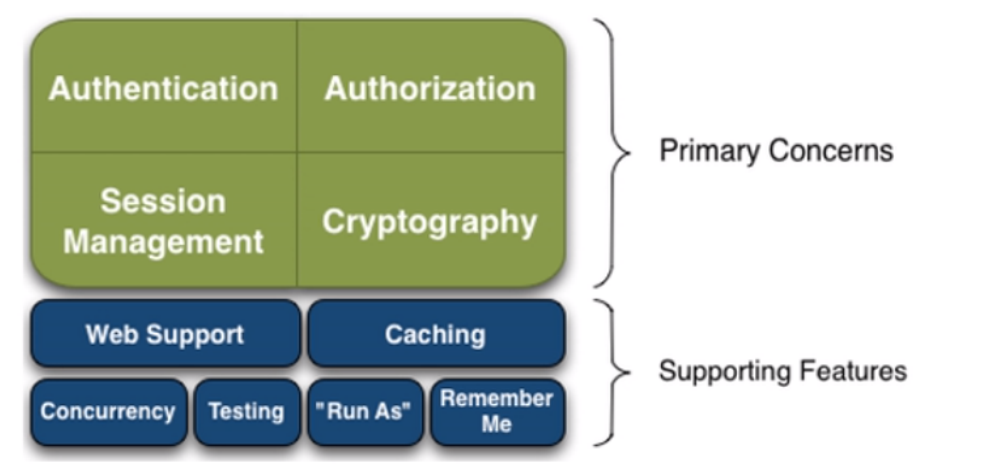
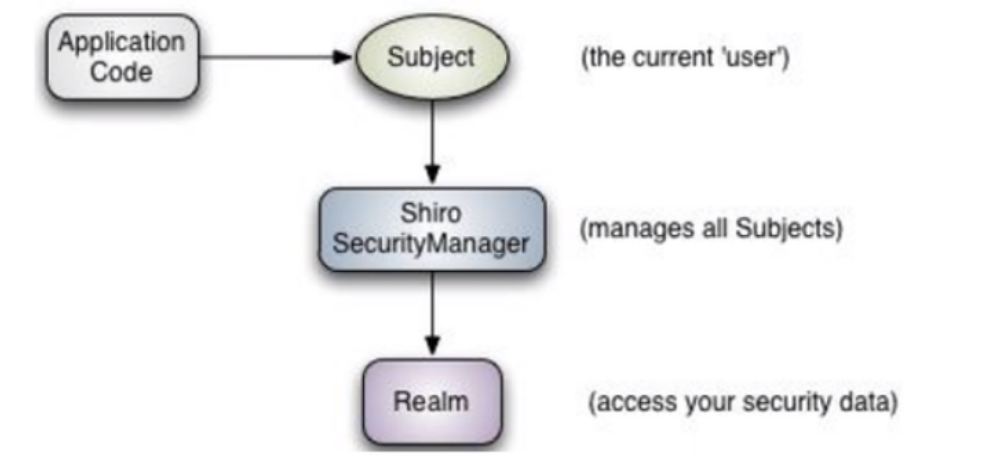
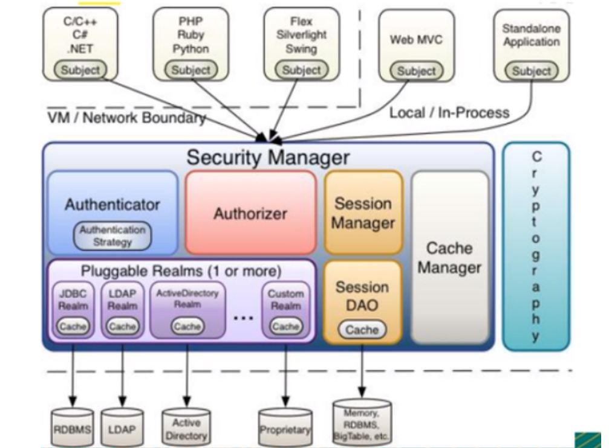
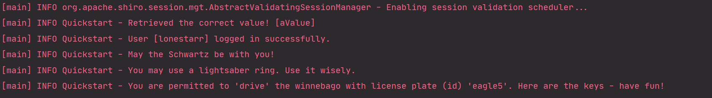
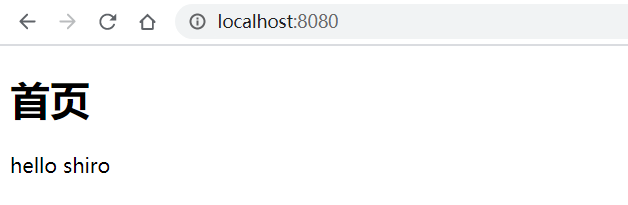

# SpringBoot2.2.5

> 课程名称: [Springboot2.2.5](https://www.bilibili.com/video/BV1PE411i7CV?from=search&seid=6853131319374438557) 
>
> 课程概述: 从初识SpringBoot，然后进入web开发，原理探究，再到数据库连接，然后集成一些常用的框架，由易到难，层层递进
>
> 讲述人:B站-遇见狂神说

## 第 1 章: 微服务阶段学习路线及说明


### 1. 微服务前的网站开发技术栈

微服务前开发网站使用由前期的javaweb+jdbc+html+css+js就可以开发简单的应用了;这时的项目就是传统的MVC原始架构

然后是ssm开发网站(Spring,SpringMVC,MyBatis进行网站开发),框架的应用简化了开发流程,配置比较复杂,Spring俗称配置地狱

由于Spring繁琐的配置,后来优化除了SpringBoot,一站式解决方案,就可以快速的开发网站,而且配置更少了

需要注意的是: 之前的项目需要打成war包在tomcat容器上面运行,然而SpringBoot可以直接打包成jar运行,SpringBoot中内嵌了Tomcat,所以也可以打包成war运行


### 2. 微服务网站开发技术栈

>  微服务阶段需要学习的大体方向有两个框架,一个是SpringBoot,本比较使用的SpringBoot版本是`2.2.5` ;SpringBoot框架是用来做后端web开发的,每个SrpingBoot项目就是一个服务,当服务太多不好管理的时,SpringCloud应运而生,也就是说SpringCloud就是专门用来管理SpringBoot编写的独立的项目,就是大家常说的微服务开发

#### 2.1 SpringBoot学习目标

1.SpringBoot是什么

2.SpringBoot如何配置,可以使用properties配置文件进行配置;但是SpringBoot官方推荐使用yaml语法进行文件配置

3.SpringBoot集成web开发

4.SpringBoot集成数据库开发

5.Swagger文档的使用(工具,非技术)

6.SpringBoot中的任务掉度

7.SpringBoot中使用权限框架;可选的有两个(SpringSecurity,Shiro)

8.分布式开发:Dubbo+zookeeper(微服务中简单的一套,必须掌握)

#### 2.3 SpringCloud入门学习目标

1.微服务

2.什么是SpringCloud框架

3.Restful风格

4.Eureka

5.Ribbon负载均衡

6.Feigon调用接口

7.HyStrix

8.Zuul路由网关

9.SpringCloud Config


## 第 2 章 : SpringBoot如门及原理


### 1. SpringBoot简介

#### 1.1 什么是Spring

Spring是一个开源框架，2003 年兴起的一个轻量级的Java 开发框架，作者：Rod Johnson 。

**Spring是为了解决企业级应用开发的复杂性而创建的，简化开发。**


#### 1.2 Spring如何简化开发的

*为了降低Java开发的复杂性，Spring采用了以下4种关键策略：*

1、基于POJO的轻量级和最小侵入性编程，所有东西都是bean； 

2、通过IOC，依赖注入（DI）和面向接口实现松耦合；

3、基于切面（AOP）和惯例进行声明式编程；

4、通过切面和模版减少样式代码，RedisTemplate，xxxTemplate；

#### 1.3 什么是SpringBoot

学过javaweb的同学就知道，开发一个web应用，从最初开始接触Servlet结合Tomcat, 跑出一个HelloWolrld程序，是要经历特别多的步骤； 后来就用了框架Struts，再后来是SpringMVC，到了现在的SpringBoot，过一两年又会有其他web框架出现；你们有经历过框架不断的演进，然后自己开发项目所有的技术也再不断的变化、改造吗？建议都可以去经历一遍；

---

言归正传，什么是SpringBoot呢，就是一个javaweb的开发框架，和SpringMVC类似，对比其他javaweb框架的好处，官方说是简化开发，约定大于配置， you can "just run"，能迅速的开发web应用，几行代码开发一个http接口。

---

所有的技术框架的发展似乎都遵循了一条主线规律：从一个复杂应用场景 衍生 一种规范框架，人们只需要进行各种配置而不需要自己去实现它，这时候强大的配置功能成了优点；发展到一定程度之后，人们根据实际生产应用情况，选取其中实用功能和设计精华，重构出一些轻量级的框架；之后为了提高开发效率，嫌弃原先的各类配置过于麻烦，于是开始提倡“约定大于配置”，进而衍生出一些一站式的解决方案。

---

是的这就是Java企业级应用->J2EE->spring->springboot的过程。

---

随着 Spring 不断的发展，涉及的领域越来越多，项目整合开发需要配合各种各样的文件，慢慢变得不那么易用简单，违背了最初的理念，甚至人称配置地狱。Spring Boot 正是在这样的一个背景下被抽象出来的开发框架，目的为了让大家更容易的使用 Spring 、更容易的集成各种常用的中间件、开源软件；

---

Spring Boot 基于 Spring 开发，Spirng Boot 本身并不提供 Spring 框架的核心特性以及扩展功能，只是用于快速、敏捷地开发新一代基于 Spring 框架的应用程序。也就是说，它并不是用来替代 Spring 的解决方案，而是和 Spring 框架紧密结合用于提升 Spring 开发者体验的工具。Spring Boot 以**约定大于配**置的核心思想，默认帮我们进行了很多设置，多数 Spring Boot 应用只需要很少的 Spring 配置。同时它集成了大量常用的第三方库配置（例如 Redis、MongoDB、Jpa、RabbitMQ、Quartz 等等），SpringBoot 应用中这些第三方库几乎可以零配置的开箱即用。

---

简单来说就是SpringBoot其实不是什么新的框架，它默认配置了很多框架的使用方式，就像maven整合了所有的jar包，spring boot整合了所有的框架 。

---

Spring Boot 出生名门，从一开始就站在一个比较高的起点，又经过这几年的发展，生态足够完善，Spring Boot 已经当之无愧成为 Java 领域最热门的技术。

---

Spring Boot的主要优点：

- 为所有Spring开发者更快的入门
- 开箱即用，提供各种默认配置来简化项目配置
- 内嵌式容器简化Web项目
- 没有冗余代码生成和XML配置的要求


### 2. SpringBoot-HelloWorld

*使用SpringBoot框架编写一个hello-world程序*

#### 2.1 准备工作

我们将学习如何快速的创建一个Spring Boot应用，并且实现一个简单的Http请求处理。通过这个例子对Spring Boot有一个初步的了解，并体验其结构简单、开发快速的特性。

我的环境准备：

- java version "1.8.0_181"
- Maven-3.6.1
- SpringBoot 2.x 最新版

开发工具：

- IDEA

#### 2.2 创建基础项目

*Spring官方提供了非常方便的工具让我们快速构建应用 , Spring Initializr： https://start.spring.io/*

##### 2.2.1 方式一: **：**使用Spring Initializr 的 Web页面创建项目

1、打开 https://start.spring.io/

2、填写项目信息

3、点击”Generate Project“按钮生成项目；下载此项目

4、解压项目包，并用IDEA以Maven项目导入，一路下一步即可，直到项目导入完毕。

5、如果是第一次使用，可能速度会比较慢，包比较多、需要耐心等待一切就绪。

##### 2.2.2 方式二: 使用 IDEA 直接创建项目

1、创建一个新项目

2、选择spring initalizr ， 可以看到默认就是去官网的快速构建工具那里实现

3、填写项目信息

4、选择初始化的组件（初学勾选 Web 即可）

5、填写项目路径

6、等待项目构建成功

 **项目结构分析：**

通过上面步骤完成了基础项目的创建。就会自动生成以下文件。

1、程序的主启动类

2、一个 application.properties 配置文件

3、一个 测试类

4、一个 pom.xml

#### 2.3 pom.xml 分析

打开 pom.xml ，看看Spring Boot项目的依赖：

```xml
<!-- 父依赖 --> <parent> <groupId>org.springframework.boot</groupId> <artifactId>spring-boot-starter-parent</artifactId> <version>2.2.5.RELEASE</version> <relativePath/> </parent> <dependencies> <!-- web场景启动器 --> <dependency> <groupId>org.springframework.boot</groupId> <artifactId>spring-boot-starter-web</artifactId> </dependency> <!-- springboot单元测试 --> <dependency> <groupId>org.springframework.boot</groupId> <artifactId>spring-boot-starter-test</artifactId> <scope>test</scope> <!-- 剔除依赖 --> <exclusions> <exclusion> <groupId>org.junit.vintage</groupId> <artifactId>junit-vintage-engine</artifactId></exclusion> </exclusions> </dependency> </dependencies> <build> <plugins> <!-- 打包插件 --> <plugin> <groupId>org.springframework.boot</groupId> <artifactId>spring-boot-maven-plugin</artifactId> </plugin> </plugins> </build>
```


#### 2.4 编写HTTP接口

1、在主程序的同级目录下，新建一个controller包，<u>一定要在同级目录下，否则识别不到</u>

2、在包中新建一个HelloController类 

```java
@RestController public class HelloController { @RequestMapping("/hello") public String hello() { return "Hello World"; } }
```

3、编写完毕后，从主程序启动项目，浏览器发起请求，看页面返回；控制台输出了 Tomcat 访问的端口号！


*简单几步，就完成了一个web接口的开发，SpringBoot就是这么简单。所以我们常用它来建立我们的微服务项目！*

#### 2.5 将项目打成jar包

*将项目打成jar包，点击 maven的 package*


如果遇到以上错误，可以配置打包时 跳过项目运行测试用例

```xml
<!--在工作中,很多情况下我们打包是不想执行测试用例的 可能是测试用例不完事,或是测试用例会影响数据库数据 跳过测试用例执 --> <plugin> <groupId>org.apache.maven.plugins</groupId> <artifactId>maven-surefire-plugin</artifactId> <configuration> <!--跳过项目运行测试用例--> <skipTests>true</skipTests> </configuration> </plugin>
```

如果打包成功，则会在target目录下生成一个 jar 包

打成了jar包后，就可以在任何地方运行了！OK `java -jar xxx.jar` 


#### 2.6 SpringBoot彩蛋

如何更改启动时显示的字符拼成的字母，SpringBoot呢？ 也就是 banner 图案

只需一步：到项目下的 resources 目录下新建一个banner.txt 即可。

图案可以到：https://www.bootschool.net/ascii 这个网站生成，然后拷贝到文件中即可！


**SpringBoot这么简单的东西背后一定有故事，我们之后去进行一波源码分析！**


### 3. 运行原理探究

*我们之前写的HelloSpringBoot，到底是怎么运行的呢，Maven项目，我们一般从pom.xml文件探究起;*


#### 3.1 SpringBoot依赖

##### 3.1.1 pom.xml父依赖

```xml
<parent> <groupId>org.springframework.boot</groupId> <artifactId>spring-boot-starter-parent</artifactId> <version>2.2.5.RELEASE</version> <relativePath/> <!-- lookup parent from repository --> </parent>
```

点进去，发现还有一个父依赖

```xml
<parent> <groupId>org.springframework.boot</groupId> <artifactId>spring-boot-dependencies</artifactId> <version>2.2.5.RELEASE</version> <relativePath>../../spring-boot-dependencies</relativePath> </parent>
```

这里才是真正管理SpringBoot应用里面所有依赖版本的地方，SpringBoot的版本控制中心；

**以后我们导入依赖默认是不需要写版本；但是如果导入的包没有在依赖中管理着就需要手动配置版本了；**

##### 3.1.2 启动器 spring-boot-starter

```xml
<dependency> <groupId>org.springframework.boot</groupId> <artifactId>spring-boot-starter-web</artifactId> </dependency>
```

**springboot-boot-starter-xxx**：就是spring-boot的场景启动器

**spring-boot-starter-web**：帮我们导入了web模块正常运行所依赖的组件；

SpringBoot将所有的功能场景都抽取出来，做成一个个的starter （启动器），只需要在项目中引入这些starter即可，所有相关的依赖都会导入进来 ， 我们要用什么功能就导入什么样的场景启动器即可 ；我们未来也可以自己自定义 starter； 


#### 3.2 主启动类程序分析

分析完了 pom.xml 来看看这个启动类

##### 3.2.1 启动类中涉及到的注解

##### 3.2.2 启动类的作用

##### 3.2.3 run()方法干了什么


#### 3.3 SpringBoot运行原理小结

1. SpringBoot在启动的时候从类路径下的META-INF/spring.factories中获取EnableAutoConfifiguration指定的值
2. 将这些值作为自动配置类导入容器 ， 自动配置类就生效 ， 帮我们进行自动配置工作；
3. 整个J2EE的整体解决方案和自动配置都在springboot-autoconfifigure的jar包中；
4. 它会给容器中导入非常多的自动配置类 （xxxAutoConfifiguration）, 就是给容器中导入这个场景需要的所有组件 ， 并配置好这些组件 ； 
5. 有了自动配置类 ， 免去了我们手动编写配置注入功能组件等的工作；

### 4. Yaml语法学习


#### 4.1 SpringBoot的两种配置文件


#### 4.2 yaml概述


#### 4.3 yaml基础语法

### 5. 注入配置文件

#### 5.1 yaml注入配置文件


#### 5.2 加载指定配置文件


#### 5.3 回顾properties配置文件


#### 5.4 properties和yaml的对比


#### 5.5 JSR303数据校验


### 6. 多环境切换

#### 6.1yml的多文档块


#### 6.2 配置文件加载位置

### 7. 自动配置原理

#### 7.1 分析自动装配原理


#### 7.2 自动装配的精髓


#### 7.3 @Conditional

### 8. 自定义starter

#### 8.1 说明


#### 8.2 编写启动器


#### 8.3 新建项目测试手写的启动器


---

## 第 3 章 : SpringBoot操作数据库


###  1. SpringData简介

对于数据访问层，无论是 SQL(关系型数据库) 还是 NOSQL(非关系型数据库)，Spring Boot 底层都是采用 Spring Data 的方式进行统一处理。

Spring Boot 底层都是采用 Spring Data 的方式进行统一处理各种数据库，Spring Data 也是 Spring 中 与 Spring Boot、Spring Cloud 等齐名的知名项目。

Sping Data 官网：https://spring.io/projects/spring-data

数据库相关的启动器 ： 可以参考官方文档：https://docs.spring.io/spring-boot/docs/2.2.5.RELEASE/reference/htmlsingle/#using-boot-starter


---

###  2. 集成JDBC

#### 2.1 导入测试数据库

```sql
CREATE DATABASE /*!32312 IF NOT EXISTS*/`springboot` /*!40100 DEFAULT CHARACTER SET utf8 */;
USE `springboot`; /*Table structure for table `department` */ 
DROP TABLE IF EXISTS `department`; 
CREATE TABLE `department` ( 
    `id` int(3) NOT NULL AUTO_INCREMENT COMMENT '部门id', 
    `department_name` varchar(20) NOT NULL COMMENT '部门名字', 
    PRIMARY KEY (`id`) 
) ENGINE=InnoDB AUTO_INCREMENT=106 DEFAULT CHARSET=utf8; /*Data for the table `department` */ 
insert into `department`(`id`,`department_name`) values (101,'技术部'), (102,'销售部'),(103,'售后部'),(104,'后勤部'),(105,'运营部');
/*Table structure for table `employee` */ 
DROP TABLE IF EXISTS `employee`; 
CREATE TABLE `employee` ( 
    `id` int(5) NOT NULL AUTO_INCREMENT COMMENT '雇员id', 
    `last_name` varchar(100) NOT NULL COMMENT '名字',
    `email` varchar(100) NOT NULL COMMENT '邮箱', 
    `gender` int(2) NOT NULL COMMENT '性别1 男, 0 女',
    `department` int(3) NOT NULL COMMENT '部门id',
    `birth` datetime NOT NULL COMMENT '生日',
    PRIMARY KEY (`id`) 
) ENGINE=InnoDB AUTO_INCREMENT=1006 DEFAULT CHARSET=utf8;
/*Data for the table `employee` */ 
insert into `employee`(`id`,`last_name`,`email`,`gender`,`department`,`birth`) values (1001,'张三','24736743@qq.com',1,101,'2020-03-06 15:04:33'),(1002,'李 四','24736743@qq.com',1,102,'2020-03-06 15:04:36'),(1003,'王 五','24736743@qq.com',0,103,'2020-03-06 15:04:37'),(1004,'赵 六','24736743@qq.com',1,104,'2020-03-06 15:04:39'),(1005,'孙 七','24736743@qq.com',0,105,'2020-03-06 15:04:45');
```


#### 2.2 创建测试项目测试数据源

1. 我去新建一个项目测试：springboot-data-jdbc ; 引入相应的模块！基础模块

2. 项目建好之后，发现自动帮我们导入了如下的启动器：

   ```xml
   <dependency> 
       <groupId>org.springframework.boot</groupId>
       <artifactId>spring-boot-starter-jdbc</artifactId>
   </dependency> 
   <dependency> 
       <groupId>mysql</groupId>
       <artifactId>mysql-connector-java</artifactId>
       <scope>runtime</scope> 
   </dependency>
   ```

3. 编写yaml配置文件连接数据库；

   ```yml
   spring: 
   	datasource: 
   		username: root 
   		password: 123456 
   		#?serverTimezone=UTC解决时区的报错 
   		url: jdbc:mysql://localhost:3306/springboot? serverTimezone=UTC&useUnicode=true&characterEncoding=utf-8 
   		driver-class-name: com.mysql.cj.jdbc.Driver
   ```

4. 配置完这一些东西后，我们就可以直接去使用了，因为SpringBoot已经默认帮我们进行了自动配置；去测试类测试一下

   ```java
   @SpringBootTest
   class SpringbootDataJdbcApplicationTests {
       //DI注入数据源 
       @Autowired
       DataSource dataSource;
       @Test 
       public void contextLoads() throws SQLException {
           //看一下默认数据源 
           System.out.println(dataSource.getClass()); 
           //获得连接 
           Connection connection = dataSource.getConnection();
           System.out.println(connection); 
           //关闭连接 
           connection.close(); 
       } 
   }
   ```

   结果：我们可以看到他默认给我们配置的数据源为 : class com.zaxxer.hikari.HikariDataSource ， 我们并没有手动配置

   我们来全局搜索一下，找到数据源的所有自动配置都在 ：DataSourceAutoConfifiguration文件：

   ```java
   @Import( 
       {Hikari.class, Tomcat.class, Dbcp2.class, Generic.class, DataSourceJmxConfiguration.class} 
   )
   protected static class PooledDataSourceConfiguration { 
       protected PooledDataSourceConfiguration() {
       } 
   }
   ```

   这里导入的类都在 DataSourceConfifiguration 配置类下，可以看出 Spring Boot 2.2.5 默认使用HikariDataSource 数据源，而以前版本，如 Spring Boot 1.5 默认使用org.apache.tomcat.jdbc.pool.DataSource 作为数据源；

   HikariDataSource 号称 Java WEB 当前速度最快的数据源，相比于传统的 C3P0 、DBCP、Tomcatjdbc 等连接池更加优秀；

   可以使用 spring.datasource.type 指定自定义的数据源类型，值为 要使用的连接池实现的完全限定名。

   关于数据源我们并不做介绍，有了数据库连接，显然就可以 CRUD 操作数据库了。但是我们需要先了解一个对象 `JdbcTemplate`

#### 2.3 JdbcTemplate

1. 有了数据源(com.zaxxer.hikari.HikariDataSource)，然后可以拿到数据库连接(java.sql.Connection)，有了连接，就可以使用原生的 JDBC 语句来操作数据库；
2. 即使不使用第三方第数据库操作框架，如 MyBatis等，Spring 本身也对原生的JDBC 做了轻量级的封装，即 JdbcTemplate 。 
3. 数据库操作的所有 CRUD 方法都在 JdbcTemplate 中。
4. Spring Boot 不仅提供了默认的数据源，同时默认已经配置好了 JdbcTemplate 放在了容器中，程序员只需自己注入即可使用
5. JdbcTemplate 的自动配置是依赖 org.springframework.boot.autoconfifigure.jdbc 包下的JdbcTemplateConfifiguration 类

**JdbcTemplate主要提供以下几类方法：**

- execute方法：可以用于执行任何SQL语句，一般用于执行DDL语句；

- update方法及batchUpdate方法：update方法用于执行新增、修改、删除等语句；batchUpdate方法用于执行批处理相关语句；

- query方法及queryForXXX方法：用于执行查询相关语句；

- call方法：用于执行存储过程、函数相关语句。


#### 2.4 测试

编写一个Controller，注入 jdbcTemplate，编写测试方法进行访问测试；

```java
package com.kuang.controller;
import org.springframework.beans.factory.annotation.Autowired; 
import org.springframework.jdbc.core.JdbcTemplate; 
import org.springframework.web.bind.annotation.GetMapping;
import org.springframework.web.bind.annotation.PathVariable;
import org.springframework.web.bind.annotation.RequestMapping;
import org.springframework.web.bind.annotation.RestController;
import java.util.Date; 
import java.util.List; 
import java.util.Map;
@RestController 
@RequestMapping("/jdbc") 
public class JdbcController { 
    /**
     * Spring Boot 默认提供了数据源，默认提供了 org.springframework.jdbc.core.JdbcTemplate 
     * JdbcTemplate 中会自己注入数据源，用于简化 JDBC操作 
     * 还能避免一些常见的错误,使用起来也不用再自己来关闭数据库连接 */ 
    @Autowired 
    JdbcTemplate jdbcTemplate; 
    //查询employee表中所有数据 
    //List 中的1个 Map 对应数据库的 1行数据 
    //Map 中的 key 对应数据库的字段名，value 对应数据库的字段值
    @GetMapping("/list") 
    public List<Map<String, Object>> userList(){ 
        String sql = "select * from employee"; 
        List<Map<String, Object>> maps = jdbcTemplate.queryForList(sql); 
        return maps;
    }
    //新增一个用户 
    @GetMapping("/add") 
    public String addUser(){ 
        //插入语句，注意时间问题
        String sql = "insert into employee(last_name, email,gender,department,birth)" + " values ('狂神说','24736743@qq.com',1,101,'"+ new Date().toLocaleString() +"')";
        jdbcTemplate.update(sql);
        //查询
        return "addOk";
    }
    //修改用户信息
    @GetMapping("/update/{id}")
    public String updateUser(@PathVariable("id") int id){ 
        //插入语句 
        String sql = "update employee set last_name=?,email=? where id="+id; 
        //数据 
        Object[] objects = new Object[2];
        objects[0] = "秦疆";
        objects[1] = "24736743@sina.com"; 
        jdbcTemplate.update(sql,objects); 
        //查询
        return "updateOk"; 
    }
    //删除用户
    @GetMapping("/delete/{id}") 
    public String delUser(@PathVariable("id") int id){ 
        //插入语句 
        String sql = "delete from employee where id=?"; 
        jdbcTemplate.update(sql,id);
        //查询 
        return "deleteOk";
    } 
}
```

到此，CURD的基本操作，使用 JDBC 就搞定了

---

###  3. 集成Druid

#### 3.1 Druid 简介

Java程序很大一部分要操作数据库，为了提高性能操作数据库的时候，又不得不使用数据库连接池。

Druid 是阿里巴巴开源平台上一个数据库连接池实现，结合了 C3P0、DBCP 等 DB 池的优点，同时加入了日志监控。

Druid 可以很好的监控 DB 池连接和 SQL 的执行情况，天生就是针对监控而生的 DB 连接池。

Druid已经在阿里巴巴部署了超过600个应用，经过一年多生产环境大规模部署的严苛考验。

Spring Boot 2.0 以上默认使用 Hikari 数据源，可以说 Hikari 与 Driud 都是当前 Java Web 上最优秀的数据源，我们来重点介绍 Spring Boot 如何集成 Druid 数据源，如何实现数据库监控。

Github地址：https://github.com/alibaba/druid/

**com.alibaba.druid.pool.DruidDataSource** **基本配置参数如下：**

| 配置                          | 缺省值             | 说明                                                         |
| ----------------------------- | ------------------ | ------------------------------------------------------------ |
| name                          |                    | 配置这个属性的意义在于，如果存在多个数据源，监控的 时候可以通过名字来区分开来。 如果没有配置，将会生成 一个名字，格式是："DataSource-" + System.identityHashCode(this). |
| url                           |                    | 连接数据库的url，不同数据库不一样。例如： mysql : jdbc:mysql://10.20.153.104:3306/druid2 oracle : jdbc:oracle:thin:@10.20.149.85:1521:ocnauto |
| username                      |                    | 连接数据库的用户名                                           |
| password                      |                    | 连接数据库的密码。如果你不希望密码直接写在配置文件 中，可以使用ConfigFilter。 |
| driverClassName               | 根据url自 动识别   | 这一项可配可不配，如果不配置druid会根据url自动识别 dbType，然后选择相应的driverClassName |
| initialSize                   | 0                  | 初始化时建立物理连接的个数。初始化发生在显示调用init 方法，或者第一次getConnection时 |
| maxActive                     | 8                  | 最大连接池数量                                               |
| maxIdle                       | 8                  | 已经不再使用，配置了也没效果                                 |
| minIdle                       |                    | 最小连接池数量                                               |
| maxWait                       |                    | 获取连接时最大等待时间，单位毫秒。配置了maxWait之 后，缺省启用公平锁，并发效率会有所下降，如果需要可 以通过配置useUnfairLock属性为true使用非公平锁。 |
| poolPreparedStatements        | false              | 是否缓存preparedStatement，也就是PSCache。 PSCache对支持游标的数据库性能提升巨大，比如说 oracle。在mysql下建议关闭。 |
| poolPreparedStatements        | -1                 | 要启用PSCache，必须配置大于0，当大于0时， poolPreparedStatements自动触发修改为true。在Druid 中，不会存在Oracle下PSCache占用内存过多的问题，可 以把这个数值配置大一些，比如说100 |
| validationQuery               |                    | 用来检测连接是否有效的sql，要求是一个查询语句。如果 validationQuery为null，testOnBorrow、 testOnReturn、testWhileIdle都不会其作用。 |
| validationQueryTimeout        |                    | 单位：秒，检测连接是否有效的超时时间。底层调用jdbc Statement对象的void setQueryTimeout(int seconds)方 法 |
| testOnBorrow                  | true               | 申请连接时执行validationQuery检测连接是否有效，做了 这个配置会降低性能。 |
| testOnReturn                  | false              | 归还连接时执行validationQuery检测连接是否有效，做了 这个配置会降低性能 |
| testWhileIdle                 | false              | 建议配置为true，不影响性能，并且保证安全性。申请连 接的时候检测，如果空闲时间大于 timeBetweenEvictionRunsMillis，执行validationQuery 检测连接是否有效。 |
| timeBetweenEvictionRunsMillis | 1分钟（1.0.14）    | 有两个含义： 1) Destroy线程会检测连接的间隔时间，如 果连接空闲时间大于等于minEvictableIdleTimeMillis则关 闭物理连接 2) testWhileIdle的判断依据，详细看 testWhileIdle属性的说明 |
| numTestsPerEvictionRun        |                    | 不再使用，一个DruidDataSource只支持一个EvictionRun           |
| minEvictableIdleTimeMillis    | 30分钟（1.0.14）   | 连接保持空闲而不被驱逐的最长时间                             |
| connectionInitSqls            |                    | 物理连接初始化的时候执行的sql                                |
| exceptionSorter               | 根据dbType自动识别 | 当数据库抛出一些不可恢复的异常时，抛弃连接                   |
| fifilters                     |                    | 属性类型是字符串，通过别名的方式配置扩展插件，常用 的插件有： 监控统计用的filter:stat 日志用的filter:log4j 防御sql注入的filter:wall |
| proxyFilters                  |                    | 类型是List<com.alibaba.druid.filter.Filter>，如果同时配 置了filters和proxyFilters，是组合关系，并非替换关系 |


#### 3.2 配置数据源

1. 添加上 Druid 数据源依赖。

   ```xml
   <!-- https://mvnrepository.com/artifact/com.alibaba/druid --> 
   <dependency> 
       <groupId>com.alibaba</groupId> 
       <artifactId>druid</artifactId> 
       <version>1.1.21</version> 
   </dependency>
   ```

2. 切换数据源；之前已经说过 Spring Boot 2.0 以上默认使用 com.zaxxer.hikari.HikariDataSource 数据源，但可以 通过 spring.datasource.type 指定数据源。

   ```yml
   spring:
   	datasource: 
   		username: root 
   		password: 123456 
   		url: jdbc:mysql://localhost:3306/springboot? serverTimezone=UTC&useUnicode=true&characterEncoding=utf-8 
   		driver-class-name: com.mysql.cj.jdbc.Driver 
   		type: com.alibaba.druid.pool.DruidDataSource # 自定义数据源
   ```

3. 数据源切换之后，在测试类中注入 DataSource，然后获取到它，输出一看便知是否成功切换；

4. 切换成功！既然切换成功，就可以设置数据源连接初始化大小、最大连接数、等待时间、最小连接数等设置项；可以查看源码

   ```yml
   spring:
   	datasource: 
   		username: root 
   		password: 123456 
   		#?serverTimezone=UTC解决时区的报错
   		url: jdbc:mysql://localhost:3306/springboot? serverTimezone=UTC&useUnicode=true&characterEncoding=utf-8 
   		driver-class-name: com.mysql.cj.jdbc.Driver 
   		type: com.alibaba.druid.pool.DruidDataSource 
   		#Spring Boot 默认是不注入这些属性值的，需要自己绑定 
   		#druid 数据源专有配置 
   		initialSize: 5 
   		minIdle: 5 
   		maxActive: 20 
   		maxWait: 60000 
   		timeBetweenEvictionRunsMillis: 60000 
   		minEvictableIdleTimeMillis: 300000 
   		validationQuery: SELECT 1 FROM DUAL 
   		testWhileIdle: true 
   		testOnBorrow: false 
   		testOnReturn: false 
   		poolPreparedStatements: true 
   		#配置监控统计拦截的filters，stat:监控统计、log4j：日志记录、wall：防御sql注入 
   		#如果允许时报错 java.lang.ClassNotFoundException: org.apache.log4j.Priority 
   		#则导入 log4j 依赖即可，Maven 地址： https://mvnrepository.com/artifact/log4j/log4j 
   		filters: stat,wall,log4j
           maxPoolPreparedStatementPerConnectionSize: 20 
           useGlobalDataSourceStat: true 
           connectionProperties: druid.stat.mergeSql=true;druid.stat.slowSqlMillis=500
   ```

5. 导入Log4j 的依赖

   ```xml
   <!-- https://mvnrepository.com/artifact/log4j/log4j --> 
   <dependency> 
       <groupId>log4j</groupId>
       <artifactId>log4j</artifactId>
       <version>1.2.17</version> 
   </dependency>
   ```

6. 现在需要程序员自己为 DruidDataSource 绑定全局配置文件中的参数，再添加到容器中，而不再使用 Spring Boot 的自动生成了；我们需要 自己添加 DruidDataSource 组件到容器中，并绑定属性；

   ```java
   package com.kuang.config; 
   import com.alibaba.druid.pool.DruidDataSource; 
   import org.springframework.boot.context.properties.ConfigurationProperties; 
   import org.springframework.context.annotation.Bean; 
   import org.springframework.context.annotation.Configuration;
   import javax.sql.DataSource; 
   @Configuration
   public class DruidConfig { 
       /* 将自定义的 Druid数据源添加到容器中，不再让 Spring Boot 自动创建 绑定全局配置文件中的 druid 数据源属性到 com.alibaba.druid.pool.DruidDataSource从而让它们生效@ConfigurationProperties(prefix = "spring.datasource")：作用就是将 全局 配置文件中前缀为 spring.datasource的属性值注入到 com.alibaba.druid.pool.DruidDataSource 的同名参数中 */ 
       @ConfigurationProperties(prefix = "spring.datasource") 
       @Bean 
       public DataSource druidDataSource() { 
           return new DruidDataSource();
       }
   }
   ```

7. 去测试类中测试一下；看是否成功！

   ```java
   @SpringBootTest 
   class SpringbootDataJdbcApplicationTests { 
       //DI注入数据源 
       @Autowired DataSource dataSource;
       @Test
       public void contextLoads() throws SQLException { 
           //看一下默认数据源 
           System.out.println(dataSource.getClass()); 
           //获得连接 
           Connection connection = dataSource.getConnection(); 
           System.out.println(connection);
           DruidDataSource druidDataSource = (DruidDataSource) dataSource; 
           System.out.println("druidDataSource 数据源最大连接数：" + druidDataSource.getMaxActive()); 
           System.out.println("druidDataSource 数据源初始化连接数：" + druidDataSource.getInitialSize()); 
           //关闭连接 
           connection.close(); 
       }
   }
   ```

   输出结果 ：可见配置参数已经生效！

   

#### 3.3 配置 Druid 数据源监控

Druid 数据源具有监控的功能，并提供了一个 web 界面方便用户查看，类似安装 路由器 时，人家也提供了一个默认的 web 页面。

所以第一步需要设置 Druid 的后台管理页面，比如 登录账号、密码 等；配置后台管理；

```java
//配置 Druid 监控管理后台的Servlet； 
//内置 Servlet 容器时没有web.xml文件，所以使用 Spring Boot 的注册 Servlet 方式 
@Bean
public ServletRegistrationBean statViewServlet() { 
    ServletRegistrationBean bean = new ServletRegistrationBean(new StatViewServlet(), "/druid/*");
    // 这些参数可以在 com.alibaba.druid.support.http.StatViewServlet 
    // 的父类 com.alibaba.druid.support.http.ResourceServlet 中找到 
    Map<String, String> initParams = new HashMap<>();
    initParams.put("loginUsername", "admin");     //后台管理界面的登录账号 
    initParams.put("loginPassword", "123456");      //后台管理界面的登录密码
    //后台允许谁可以访问 
    //initParams.put("allow", "localhost")：表示只有本机可以访问 
    //initParams.put("allow", "")：为空或者为null时，表示允许所有访问 
    initParams.put("allow", ""); 
    //deny：Druid 后台拒绝谁访问 
    //initParams.put("kuangshen", "192.168.1.20");表示禁止此ip访问 
    //设置初始化参数 
    bean.setInitParameters(initParams); 
    return bean; 
}
```

配置完毕后，我们可以选择访问 ： http://localhost:8080/druid/login.html


进入之后


**配置** **Druid web** **监控** **fifilter** **过滤器**

```java
//配置 Druid 监控 之 web 监控的 filter 1
//WebStatFilter：用于配置Web和Druid数据源之间的管理关联监控统计
@Bean 
public FilterRegistrationBean webStatFilter() { 
    FilterRegistrationBean bean = new FilterRegistrationBean();
    bean.setFilter(new WebStatFilter());
    //exclusions：设置哪些请求进行过滤排除掉，从而不进行统计 
    Map<String, String> initParams = new HashMap<>(); 
    initParams.put("exclusions", "*.js,*.css,/druid/*,/jdbc/*");
    bean.setInitParameters(initParams);
    //"/*" 表示过滤所有请求 
    bean.setUrlPatterns(Arrays.asList("/*")); 
    return bean;
}
```

平时在工作中，按需求进行配置即可，主要用作监控！

---

###  4. 集成MyBatis

> 官方文档：http://mybatis.org/spring-boot-starter/mybatis-spring-boot-autoconfifigure/
>
> Maven仓库地址：https://mvnrepository.com/artifact/org.mybatis.spring.boot/mybatis-spring-boot-starter/2.1.1

SpringBoot整合mybatis步骤

**1. 导入MyBatis所需要的依赖**

```xml
<dependency> 
    <groupId>org.mybatis.spring.boot</groupId> 
    <artifactId>mybatis-spring-boot-starter</artifactId>
    <version>2.1.1</version> 
</dependency>
```

**2. 配置数据库连接信息（不变）**

```yml
spring:
  datasource:
    username: root
    password: 123456 #?serverTimezone=UTC解决时区的报错
    url: jdbc:mysql://localhost:3306/springboot? serverTimezone=UTC&useUnicode=true&characterEncoding=utf-8
    driver-class-name: com.mysql.cj.jdbc.Driver
    type: com.alibaba.druid.pool.DruidDataSource
    #Spring Boot 默认是不注入这些属性值的，需要自己绑定
    #druid 数据源专有配置
    initialSize: 5
    minIdle: 5
    maxActive: 20
    maxWait: 60000
    timeBetweenEvictionRunsMillis: 60000
    minEvictableIdleTimeMillis: 300000
    validationQuery: SELECT 1 FROM DUAL
    testWhileIdle: true
    testOnBorrow: false
    testOnReturn: false
    poolPreparedStatements: true
    #配置监控统计拦截的filters，stat:监控统计、log4j：日志记录、wall：防御sql注入
    #如果允许时报错 java.lang.ClassNotFoundException: org.apache.log4j.Priority
    #则导入 log4j 依赖即可，Maven 地址： https://mvnrepository.com/artifact/log4j/log4j
    filters: stat,wall,log4j
    maxPoolPreparedStatementPerConnectionSize: 20
    useGlobalDataSourceStat: true
    connectionProperties: druid.stat.mergeSql=true;druid.stat.slowSqlMillis=500
```

**3. 测试数据库是否连接成功！**

**4. 创建实体类，导入 Lombok！**

Department.java

```java
package com.kuang.pojo; 
import lombok.AllArgsConstructor; 
import lombok.Data; 
import lombok.NoArgsConstructor; 
@Data 
@NoArgsConstructor
@AllArgsConstructor 
public class Department { 
    private Integer id; 
    private String departmentName; 
}
```

**5. 创建mapper目录以及对应的 Mapper 接口**

DepartmentMapper.java

```java
//@Mapper : 表示本类是一个 MyBatis 的 Mapper 
@Mapper 
@Repository 
public interface DepartmentMapper { 
    // 获取所有部门信息 
    List<Department> getDepartments(); 
    // 通过id获得部门 
    Department getDepartment(Integer id); 
}
```

**6. 对应的Mapper映射文件**

DepartmentMapper.xml

```xml
<?xml version="1.0" encoding="UTF-8" ?> 
<!DOCTYPE mapper 
		PUBLIC "-//mybatis.org//DTD Mapper 3.0//EN" 
		"http://mybatis.org/dtd/mybatis-3-mapper.dtd"> 
<mapper namespace="com.kuang.mapper.DepartmentMapper"> 
    <select id="getDepartments" resultType="Department"> select * from department; </select> 
    <select id="getDepartment" resultType="Department" parameterType="int"> 
        select * from department where id = #{id}; 
    </select> 
</mapper>
```

**8. maven配置资源过滤问题**

```xml
<resources> 
    <resource> 
        <directory>src/main/java</directory> 
        <includes> 
            <include>**/*.xml</include> 
        </includes> 
        <filtering>true</filtering> 
    </resource>
</resources>
```

> **既然已经提供了** **myBatis** **的映射配置文件，自然要告诉** **spring boot** **这些文件的位置**

```yml
#指定myBatis的核心配置文件与Mapper映射文件 
mybatis.mapper-locations=classpath:mybatis/mapper/*.xml 
# 注意：对应实体类的路径 
mybatis.type-aliases-package=com.kuang.mybatis.pojo
```

**8. 编写部门的 DepartmentController 进行测试！**

```java
@RestController 
public class DepartmentController { 
    @Autowired
    DepartmentMapper departmentMapper; // 查询全部部门
    @GetMapping("/getDepartments") 
    public List<Department> getDepartments(){ 
        return departmentMapper.getDepartments();
    }
    // 查询全部部门 
    @GetMapping("/getDepartment/{id}") 
    public Department getDepartment(@PathVariable("id") Integer id){
        return departmentMapper.getDepartment(id); 
    }
}
```

启动项目访问进行测试！


**我们增加一个员工类再测试下，为之后做准备**

1. 新建一个pojo类 Employee ； 

   ```java
   @Data 
   @AllArgsConstructor 
   @NoArgsConstructor 
   public class Employee { 
       private Integer id; 
       private String lastName;
       private String email; //1 male, 0 female 
       private Integer gender; 
       private Integer department;
       private Date birth; 
       private Department eDepartment; // 冗余设计
   }
   ```

2. 新建一个 EmployeeMapper 接口

   ```java
   //@Mapper : 表示本类是一个 MyBatis 的 Mapper
   @Mapper
   @Repository 
   public interface EmployeeMapper { 
       // 获取所有员工信息 
       List<Employee> getEmployees();
       // 新增一个员工
       int save(Employee employee);
       // 通过id获得员工信息
       Employee get(Integer id); 
       // 通过id删除员工
       int delete(Integer id); 
   }
   ```

3. 编写 EmployeeMapper.xml 配置文件

   ```xml
   <?xml version="1.0" encoding="UTF-8" ?> 
   <!DOCTYPE mapper 
   		PUBLIC "-//mybatis.org//DTD Mapper 3.0//EN" 
   		"http://mybatis.org/dtd/mybatis-3-mapper.dtd">
   <mapper namespace="com.kuang.mapper.EmployeeMapper">
       <resultMap id="EmployeeMap" type="Employee"> 
           <id property="id" column="eid"/>
           <result property="lastName" column="last_name"/>
           <result property="email" column="email"/>
           <result property="gender" column="gender"/> 
           <result property="birth" column="birth"/> 
           <association property="eDepartment" javaType="Department">
               <id property="id" column="did"/>
               <result property="departmentName" column="dname"/>
           </association> 
       </resultMap> 
       <select id="getEmployees" resultMap="EmployeeMap">
           select e.id as eid,last_name,email,gender,birth,d.id as did,d.department_name as dname from department d,employee e where d.id = e.department 
       </select>
       <insert id="save" parameterType="Employee">
           insert into employee (last_name,email,gender,department,birth) values (#{lastName},#{email},#{gender},#{department},#{birth}); 
       </insert> 
       <select id="get" resultType="Employee">
           select * from employee where id = #{id} 
       </select> 
       <delete id="delete" parameterType="int">
           delete from employee where id = #{id}
       </delete>
   </mapper>
   ```

4. 编写EmployeeController类进行测试

   ```java
   @RestController 
   public class EmployeeController { 
       @Autowired 
       EmployeeMapper employeeMapper; // 获取所有员工信息
       @GetMapping("/getEmployees") 
       public List<Employee> getEmployees(){ 
           return employeeMapper.getEmployees();
       }
       @GetMapping("/save") 
       public int save(){
           Employee employee = new Employee(); 
           employee.setLastName("kuangshen"); 
           employee.setEmail("qinjiang@qq.com");
           employee.setGender(1); 
           employee.setDepartment(101);
           employee.setBirth(new Date());
           return employeeMapper.save(employee);
       }
       // 通过id获得员工信息
       @GetMapping("/get/{id}")
       public Employee get(@PathVariable("id") Integer id){
           return employeeMapper.get(id);
       }
       // 通过id删除员工
       @GetMapping("/delete/{id}")
       public int delete(@PathVariable("id") Integer id){
           return employeeMapper.delete(id);
       }
   }
   ```

   测试结果完成，搞定收工


---

## 第 4 章 : SpringBoot开发单体应用


###  1. Web开发探究

**简介**

好的，同学们，那么接下来呢，我们开始学习SpringBoot与Web开发，从这一章往后，就属于我们实战部分的内容了；

其实SpringBoot的东西用起来非常简单，因为SpringBoot最大的特点就是自动装配。

**使用SpringBoot的步骤：**

1、创建一个SpringBoot应用，选择我们需要的模块，SpringBoot就会默认将我们的需要的模块自动配置好。

2、手动在配置文件中配置部分配置项目就可以运行起来了。

3、专注编写业务代码，不需要考虑以前那样一大堆的配置了。

要熟悉掌握开发，之前学习的自动配置的原理一定要搞明白！

比如SpringBoot到底帮我们配置了什么？我们能不能修改？我们能修改哪些配置？我们能不能扩展？

- 向容器中自动配置组件 ： *** Autoconfifiguration
- 自动配置类，封装配置文件的内容：***Properties

没事就找找类，看看自动装配原理！

我们之后来进行一个单体项目的小项目测试，让大家能够快速上手开发！


###  2. 静态资源处理

#### 2.1 静态资源映射规则

首先，我们搭建一个普通的SpringBoot项目，回顾一下HelloWorld程序！【演示】

写请求非常简单，那我们要引入我们前端资源，我们项目中有许多的静态资源，比如css，js等文件，这个SpringBoot怎么处理呢？

如果我们是一个web应用，我们的main下会有一个webapp，我们以前都是将所有的页面导在这里面的，对吧！但是我们现在的pom呢，打包方式是为jar的方式，那么这种方式SpringBoot能不能来给我们写页面呢？当然是可以的，但是SpringBoot对于静态资源放置的位置，是有规定的！

**我们先来聊聊这个静态资源映射规则：**

SpringBoot中，SpringMVC的web配置都在 WebMvcAutoConfifiguration 这个配置类里面；

我们可以去看看 WebMvcAutoConfifigurationAdapter 中有很多配置方法；

有一个方法： `addResourceHandlers `添加资源处理

```java
@Override public void addResourceHandlers(ResourceHandlerRegistry registry) { if (!this.resourceProperties.isAddMappings()) {// 已禁用默认资源处理 logger.debug("Default resource handling disabled"); return; }// 缓存控制 Duration cachePeriod = this.resourceProperties.getCache().getPeriod(); CacheControl cacheControl = this.resourceProperties.getCache().getCachecontrol().toHttpCacheControl(); // webjars 配置 if (!registry.hasMappingForPattern("/webjars/**")) { customizeResourceHandlerRegistration(registry.addResourceHandler("/webjars/ **") .addResourceLocations("classpath:/META-INF/resources/webjars/") .setCachePeriod(getSeconds(cachePeriod)).setCacheControl(cacheControl)); }// 静态资源配置 String staticPathPattern = this.mvcProperties.getStaticPathPattern(); if (!registry.hasMappingForPattern(staticPathPattern)) { customizeResourceHandlerRegistration(registry.addResourceHandler(staticPath Pattern) .addResourceLocations(getResourceLocations(this.resourceProperties.getStatic Locations())) .setCachePeriod(getSeconds(cachePeriod)).setCacheControl(cacheControl)); } }
```

读一下源代码：比如所有的 /webjars/** ， 都需要去 classpath:/META-INF/resources/webjars/ 找对应的资源；


#### 2.2 那什么是webjars呢？

Webjars本质就是以jar包的方式引入我们的静态资源 ， 我们以前要导入一个静态资源文件，直接导入即可。

使用SpringBoot需要使用Webjars，我们可以去搜索一下：

- 网站：https://www.webjars.org 【网站带看，并引入jQuery测试】

要使用jQuery，我们只要要引入jQuery对应版本的pom依赖即可！

```xml
<dependency> <groupId>org.webjars</groupId> <artifactId>jquery</artifactId> <version>3.4.1</version> </dependency>
```

导入完毕，查看webjars目录结构，并访问Jquery.js文件！

访问：只要是静态资源，SpringBoot就会去对应的路径寻找资源，我们这里访问 ：`http://localhost:8080/webjars/jquery/3.4.1/jquery.js`

#### 2.3 第二种静态资源映射规则

那我们项目中要是使用自己的静态资源该怎么导入呢？我们看下一行代码；

我们去找staticPathPattern发现第二种映射规则 ： /** , 访问当前的项目任意资源，它会去找resourceProperties 这个类，我们可以点进去看一下分析：

```java
// 进入方法 public String[] getStaticLocations() { return this.staticLocations; }// 找到对应的值 private String[] staticLocations = CLASSPATH_RESOURCE_LOCATIONS; // 找到路径 private static final String[] CLASSPATH_RESOURCE_LOCATIONS = { "classpath:/META-INF/resources/", "classpath:/resources/", "classpath:/static/", "classpath:/public/" };
```

ResourceProperties 可以设置和我们静态资源有关的参数；这里面指向了它会去寻找资源的文件夹，即上面数组的内容。

所以得出结论，以下四个目录存放的静态资源可以被我们识别：

```
"classpath:/META-INF/resources/" "classpath:/resources/" "classpath:/static/" "classpath:/public/"
```

我们可以在resources根目录下新建对应的文件夹，都可以存放我们的静态文件；

比如我们访问 http://localhost:8080/1.js , 他就会去这些文件夹中寻找对应的静态资源文件;

#### 2.4 自定义静态资源路径

我们也可以自己通过配置文件来指定一下，哪些文件夹是需要我们放静态资源文件的，在application.properties中配置；

```properties
spring.resources.static-locations=classpath:/coding/,classpath:/kuang/
```

一旦自己定义了静态文件夹的路径，原来的自动配置就都会失效了！

###  3. 首页处理

静态资源文件夹说完后，我们继续向下看源码！可以看到一个欢迎页的映射，就是我们的首页！

```java
@Bean public WelcomePageHandlerMapping welcomePageHandlerMapping(ApplicationContext applicationContext, FormattingConversionService mvcConversionService, ResourceUrlProvider mvcResourceUrlProvider) { WelcomePageHandlerMapping welcomePageHandlerMapping = new WelcomePageHandlerMapping( new TemplateAvailabilityProviders(applicationContext), applicationContext, getWelcomePage(), // getWelcomePage 获得欢迎页 this.mvcProperties.getStaticPathPattern()); welcomePageHandlerMapping.setInterceptors(getInterceptors(mvcConversionServ ice, mvcResourceUrlProvider)); return welcomePageHandlerMapping; }
```

点进去继续看

```java
private Optional<Resource> getWelcomePage() { String[] locations = getResourceLocations(this.resourceProperties.getStaticLocations()); // ::是java8 中新引入的运算符 // Class::function的时候function是属于Class的，应该是静态方法。 // this::function的funtion是属于这个对象的。 // 简而言之，就是一种语法糖而已，是一种简写 return Arrays.stream(locations).map(this::getIndexHtml).filter(this::isReadable).fi ndFirst(); }// 欢迎页就是一个location下的的 index.html 而已 private Resource getIndexHtml(String location) { return this.resourceLoader.getResource(location + "index.html"); }
```

欢迎页，静态资源文件夹下的所有 index.html 页面；被 /** 映射。

比如我访问 http://localhost:8080/ ，就会找静态资源文件夹下的 index.html 【可以测试一下】

新建一个 index.html ，在我们上面的3个目录中任意一个；然后访问测试 http://localhost:8080/ 看结果！

**关于网站图标说明**：

与其他静态资源一样，Spring Boot在配置的静态内容位置中查找 favicon.ico。如果存在这样的文件，它将自动用作应用程序的favicon。 

1. 关闭SpringBoot默认图标

   ```properties
   #关闭默认图标 spring.mvc.favicon.enabled=false
   ```

2. 自己放一个图标在静态资源目录下，我放在 public 目录下

3. 清除浏览器缓存！刷新网页，发现图标已经变成自己的了！

###  4. Thymeleaf

#### 4.1 模板引擎

前端交给我们的页面，是html页面。如果是我们以前开发，我们需要把他们转成jsp页面，jsp好处就是当我们查出一些数据转发到JSP页面以后，我们可以用jsp轻松实现数据的显示，及交互等。

jsp支持非常强大的功能，包括能写Java代码，但是呢，我们现在的这种情况，SpringBoot这个项目首先是以jar的方式，不是war，像第二，我们用的还是嵌入式的Tomcat，所以呢，**他现在默认是不支持jsp的**。

那不支持jsp，如果我们直接用纯静态页面的方式，那给我们开发会带来非常大的麻烦，那怎么办呢？

**SpringBoot推荐你可以来使用模板引擎：**

模板引擎，我们其实大家听到很多，其实jsp就是一个模板引擎，还有以用的比较多的freemarker，包括SpringBoot给我们推荐的Thymeleaf，模板引擎有非常多，但再多的模板引擎，他们的思想都是一样的，什么样一个思想呢我们来看一下这张图：



模板引擎的作用就是我们来写一个页面模板，比如有些值呢，是动态的，我们写一些表达式。而这些值，从哪来呢，就是我们在后台封装一些数据。然后把这个模板和这个数据交给我们模板引擎，模板引擎按照我们这个数据帮你把这表达式解析、填充到我们指定的位置，然后把这个数据最终生成一个我们想要的内容给我们写出去，这就是我们这个模板引擎，不管是jsp还是其他模板引擎，都是这个思想。只不过呢，就是说不同模板引擎之间，他们可能这个语法有点不一样。其他的我就不介绍了，我主要来介绍一下SpringBoot给我们推荐的Thymeleaf模板引擎，这模板引擎呢，是一个高级语言的模板引擎，他的这个语法更简单。而且呢，功能更强大。

我们呢，就来看一下这个模板引擎，那既然要看这个模板引擎。首先，我们来看SpringBoot里边怎么用。

#### 4.2 引入Thymeleaf

怎么引入呢，对于springboot来说，什么事情不都是一个start的事情嘛，我们去在项目中引入一下。给大家三个网址：

Thymeleaf 官网：https://www.thymeleaf.org/

Thymeleaf 在Github 的主页：https://github.com/thymeleaf/thymeleaf

Spring官方文档： 找到我们对应的版本https://docs.spring.io/spring-boot/docs/2.2.5.RELEASE/reference/htmlsingle/#using-boot-starter

找到对应的pom依赖：可以适当点进源码看下本来的包！

```xml
<!--thymeleaf--> <dependency> <groupId>org.springframework.boot</groupId> <artifactId>spring-boot-starter-thymeleaf</artifactId> </dependency>
```

Maven会自动下载jar包，我们可以去看下下载的东西；

#### 4.3 thymeleaf 分析

前面呢，我们已经引入了Thymeleaf，那这个要怎么使用呢？

我们首先得按照SpringBoot的自动配置原理看一下我们这个Thymeleaf的自动配置规则，在按照那个规则，我们进行使用。

我们去找一下Thymeleaf的自动配置类：ThymeleafProperties

```java
@ConfigurationProperties( prefix = "spring.thymeleaf" )public class ThymeleafProperties { private static final Charset DEFAULT_ENCODING; public static final String DEFAULT_PREFIX = "classpath:/templates/"; public static final String DEFAULT_SUFFIX = ".html"; private boolean checkTemplate = true; private boolean checkTemplateLocation = true; private String prefix = "classpath:/templates/"; private String suffix = ".html"; private String mode = "HTML"; private Charset encoding; }
```

我们可以在其中看到默认的前缀和后缀！我们只需要把我们的html页面放在类路径下的templates下，thymeleaf就可以帮我们自动渲染了。使用thymeleaf什么都不需要配置，只需要将他放在指定的文件夹下即可！

**测试：**

1. 编写一个TestController

   ```java
   @Controller public class TestController { @RequestMapping("/t1") public String test1(){ //classpath:/templates/test.html return "test"; } }
   ```

2. 编写一个测试页面 test.html 放在 templates 目录下

   ```html
   <!DOCTYPE html> <html lang="en"> <head><meta charset="UTF-8"> <title>Title</title> </head> <body> <h1>测试页面</h1> </body> </html>
   ```

3. 启动项目请求测试

#### 4.4 Thymeleaf 语法学习

要学习语法，还是参考官网文档最为准确，我们找到对应的版本看一下；Thymeleaf 官网：https://www.thymeleaf.org/ ， 简单看一下官网！我们去下载Thymeleaf的官方文档！

**我们做个最简单的练习 ： 我们需要查出一些数据，在页面中展示**

1、修改测试请求，增加数据传输；

```java
@RequestMapping("/t1") public String test1(Model model){ //存入数据 model.addAttribute("msg","Hello,Thymeleaf"); //classpath:/templates/test.html return "test"; }
```

2、我们要使用thymeleaf，需要在html文件中导入命名空间的约束，方便提示。

我们可以去官方文档的#3中看一下命名空间拿来过来：

```
xmlns:th="http://www.thymeleaf.org"
```

3、我们去编写下前端页面

```html
<!DOCTYPE html> <html lang="en" xmlns:th="http://www.thymeleaf.org"> <head><meta charset="UTF-8"> <title>狂神说</title> </head> <body> <h1>测试页面</h1> <!--th:text就是将div中的内容设置为它指定的值，和之前学习的Vue一样--> <div th:text="${msg}"></div> </body> </html>
```

4、启动测试！


OK，入门搞定，我们来认真研习一下Thymeleaf的使用语法！

1、我们可以使用任意的 th:attr 来替换Html中原生属性的值！参考官网文档#10； th语法



2、我们能写那些表达式呢？我们可以看到官方文档 #4

```
Simple expressions:（表达式语法） Variable Expressions: ${...}：获取变量值；OGNL；
1）、获取对象的属性、调用方法 2）、使用内置的基本对象： #18 #ctx : the context object. #vars: the context variables. #locale : the context locale. #request : (only in Web Contexts) the HttpServletRequest object. #response : (only in Web Contexts) the HttpServletResponse object. #session : (only in Web Contexts) the HttpSession object. #servletContext : (only in Web Contexts) the ServletContext object. 3）、内置的一些工具对象： #execInfo : information about the template being processed. #uris : methods for escaping parts of URLs/URIs #conversions : methods for executing the configured conversion service (if any). #dates : methods for java.util.Date objects: formatting, component extraction, etc. #calendars : analogous to #dates , but for java.util.Calendar objects. #numbers : methods for formatting numeric objects. #strings : methods for String objects: contains, startsWith, prepending/appending, etc. #objects : methods for objects in general. #bools : methods for boolean evaluation. #arrays : methods for arrays. #lists : methods for lists. #sets : methods for sets. #maps : methods for maps. #aggregates : methods for creating aggregates on arrays or collections. ============================================================================ ======Selection Variable Expressions: *{...}：选择表达式：和${}在功能上是一样； Message Expressions: #{...}：获取国际化内容 Link URL Expressions: @{...}：定义URL； Fragment Expressions: ~{...}：片段引用表达式 Literals（字面量） Text literals: 'one text' , 'Another one!' ,… Number literals: 0 , 34 , 3.0 , 12.3 ,… Boolean literals: true , false Null literal: null Literal tokens: one , sometext , main ,… Text operations:（文本操作） String concatenation: + Literal substitutions: |The name is ${name}| Arithmetic operations:（数学运算） Binary operators: + , - , * , / , % Minus sign (unary operator): - Boolean operations:（布尔运算） Binary operators: and , or Boolean negation (unary operator): ! , not Comparisons and equality:（比较运算）Comparators: > , < , >= , <= ( gt , lt , ge , le ) Equality operators: == , != ( eq , ne ) Conditional operators:条件运算（三元运算符） If-then: (if) ? (then) If-then-else: (if) ? (then) : (else) Default: (value) ?: (defaultvalue) Special tokens: No-Operation: _
```

**练习测试：**

1、 我们编写一个Controller，放一些数据

```java
@RequestMapping("/t2") public String test2(Map<String,Object> map){ //存入数据 map.put("msg","<h1>Hello</h1>"); map.put("users", Arrays.asList("qinjiang","kuangshen")); //classpath:/templates/test.html return "test"; }
```

2、测试页面取出数据

```html
<!DOCTYPE html> <html lang="en" xmlns:th="http://www.thymeleaf.org"> <head><meta charset="UTF-8"> <title>狂神说</title> </head> <body> <h1>测试页面</h1> <div th:text="${msg}"></div> <!--不转义--> <div th:utext="${msg}"></div> <!--遍历数据--> <!--th:each每次遍历都会生成当前这个标签：官网#9--> <h4 th:each="user :${users}" th:text="${user}"></h4> <h4><!--行内写法：官网#12--> <span th:each="user:${users}">[[${user}]]</span> </h4> </body> </html>
```

3、启动项目测试！

**我们看完语法，很多样式，我们即使现在学习了，也会忘记，所以我们在学习过程中，需要使用什么，根据官方文档来查询，才是最重要的，要熟练使用官方文档！**


###  5. MVC自动配置原理

#### 5.1 官网阅读

#### 5.2 ContentNegotiatingViewResolver 内容协商视图解析器

#### 5.3 转换器和格式化器

#### 5.4 修改SpringBoot的默认配置

#### 5.5 全面接管SpringMVC


### 6. 员工管理系统

####  6.1 配置项目环境及首页

6.1.1 把昨天的 mybatis 整合代码拿过来

6.1.2 导入静态资源

6.1.3 首页实现

####  6.2 页面国际化

6.2.1 准备工作

6.2.2 配置文件编写

6.2.3 配置文件生效探究

6.2.4 配置页面国际化值

6.2.5 配置国际化解析

####  6.3 登录和拦截器

6.3.1 禁用模板缓存

6.3.2 登录

6.2.3 登录拦截器

####  6.4 员工列表实现

6.4.1 RestFul 风格

6.4.2 员工列表页面跳转

6.4.3 Thymeleaf 公共页面元素抽取

6.4.4 员工信息页面展示


####  6.5 添加员工实现

6.5.1 表单及细节优化

6.5.2 完整增加员工功能，我们来具体实现添加功能；

6.5.3 启动测试，前端填写数据，注意时间问题：


####  6.6 员工信息修改

6.6.1 实现

####  6.7 删除员工实现

####  6.8 404及注销

6.8.1 404

6.8.2 注销


####  6.9 定制错误数据

6.9.1 SpringBoot 默认的错误处理机制

6.9.2 错误处理原理分析


## 第 5 章: SpringBootWeb开发提升

### 5.1 集成Swagger

> 学习目标: 
>
> - 了解Swagger的概念及作用
>
> - 掌握在项目中集成Swagger自动生成API文档

#### Swagger简介

> 当前主流的前后端技术栈就是 Vue+SpringBoot

**后端时代**

- 前端值用管理静态页面;html页面写完后交给后端
- 模板引擎 jsp;后端是主力

**前后端分离**

- 后端: 后端控制层, 服务层, 数据访问层.(这些都是由后端团队开发)
- 前端: 前端控制层,视图层(这些都是交给前端团队)
- 伪造数据: 前后端通过json数据来进行交互的,前端在开发的时候不需要后端提供的后台接口,前端工程也可以动起来
- 前后端交互: 前后端交互是通过后端提供的api进行交互的

前后端分离的优势: 

- 前后端优势: 相对独立;松耦合
- 前后端项目可以部署在不同的服务器上

前后端会产生的问题:

- 前后端集成，前端或者后端无法做到“及时协商，尽早解决”，最终导致问题集中爆发

- 解决方案:

  - 首先定义schema [ 计划的提纲 ]，并实时跟踪最新的API，降低集成风险

  - swagger接口文档

    

**Swagger**

- 号称世界上最流行的API框架
- Restful Api 文档在线自动生成器 => **API 文档 与API定义同步更新**
- 直接运行，在线测试后端API
- 支持多种语言 （如：Java，PHP等）
- 官网：https://swagger.io/

*牛逼吹了这么多,最终目的是将swagger用在项目上才是王道!!~,下面将介绍如何把Swagger集成到SpringBoot项目中去!*


#### SpringBoot集成Swagger

使用swagger的要求: jdk 1.8 + 否则swagger2无法运行

##### 创建项目

创建一个springboot-web项目,确保项目运行成功

```java
@Controller
@ResponseBody
@RequestMapping("/swagger")
public class SwaggerController {
    @GetMapping("/swaggertest")
    public String swaggertest(){
        return "swagger !";
    }
}
```


##### 引入依赖

使用swagger需要两个jar

- Springfox-swagger2
- swagger-springmvc

```xml
<!-- https://mvnrepository.com/artifact/io.springfox/springfox-swagger2 --> 
<dependency> 
    <groupId>io.springfox</groupId> 
    <artifactId>springfox-swagger2</artifactId> 
    <version>2.9.2</version> 
</dependency> 
<!-- https://mvnrepository.com/artifact/io.springfox/springfox-swagger- ui --> 
<dependency> 
    <groupId>io.springfox</groupId> 
    <artifactId>springfox-swagger-ui</artifactId> 
    <version>2.9.2</version> 
</dependency>
```

访问测试: http://localhost:8080/swagger-ui.html ,可以看到swagger的界面；



##### 配置Swagger

在项目的config的包下创建一个`Swagger.java`

1.  Swagger实例Bean是Docket，所以通过配置Docket实例来配置Swaggger。 

   ```java
   @Bean 
   //配置docket以配置Swagger具体参数 
   public Docket docket() { 
       return new Docket(DocumentationType.SWAGGER_2); 
   }
   ```

2. 可以通过apiInfo()属性配置文档信息

   ```java
   //配置文档信息 
   private ApiInfo apiInfo() { 
       Contact contact = new Contact("联系人名字", "http://xxx.xxx.com/联系人 访问链接", "联系人邮箱"); 
       return new ApiInfo( "Swagger学习", // 标题 
                          "学习演示如何配置Swagger", // 描述 
                          "v1.0", // 版本
                          "http://terms.service.url/组织链接", // 组织链接 
                          contact, // 联系人信息 
                          "Apach 2.0 许可", // 许可 
                          "许可链接", // 许可连接 
                          new ArrayList<>()// 扩展 
                         );
   }
   ```

3. Docket 实例关联上 `apiInfo()`

   ```java
   @Bean 
   public Docket docket() { 
       return new Docket(DocumentationType.SWAGGER_2).apiInfo(apiInfo()); 
   }
   ```

4. 重启项目，访问测试 http://localhost:8080/swagger-ui.html 看下效果；


##### 配置扫描接口

1. 构建Docket时通过select()方法配置怎么扫描接口。

   ```java
   @Bean public Docket docket() { return new Docket(DocumentationType.SWAGGER_2) .apiInfo(apiInfo()) .select()// 通过.select()方法，去配置扫描接口,RequestHandlerSelectors 配置如何扫描接口 .apis(RequestHandlerSelectors.basePackage("com.kuang.swagger.controller") ) .build(); }
   ```

2. 重启项目测试，由于我们配置根据包的路径扫描接口，所以我们只能看到一个类

3.  除了通过包路径配置扫描接口外，还可以通过配置其他方式扫描接口，这里注释一下所有的配置方

   式：

   ```java
   any() // 扫描所有，项目中的所有接口都会被扫描到 none() // 不扫描接口 // 通过方法上的注解扫描，如withMethodAnnotation(GetMapping.class)只扫描get请求 withMethodAnnotation(final Class<? extends Annotation> annotation) // 通过类上的注解扫描，如.withClassAnnotation(Controller.class)只扫描有 controller注解的类中的接口 withClassAnnotation(final Class<? extends Annotation> annotation) basePackage(final String basePackage) // 根据包路径扫描接口
   ```

4. 除此之外，我们还可以配置接口扫描过滤：

   ```java
   @Bean public Docket docket() { return new Docket(DocumentationType.SWAGGER_2) .apiInfo(apiInfo()) .select()// 通过.select()方法，去配置扫描接 口,RequestHandlerSelectors配置如何扫描接口 .apis(RequestHandlerSelectors.basePackage("com.kuang.swagger.controller" )) // 配置如何通过path过滤,即这里只扫描请求以/kuang开头的接口 .paths(PathSelectors.ant("/kuang/**")) .build(); }
   ```

5. 这里的可选值还有

   ```java
   any() // 任何请求都扫描 none() // 任何请求都不扫描 regex(final String pathRegex) // 通过正则表达式控制 ant(final String antPattern) // 通过ant()控制
   ```

##### 配置swagger开关

1. 通过enable()方法配置是否启用swagger，如果是false，swagger将不能在浏览器中访问了

   ```java
   @Bean public Docket docket() { return new Docket(DocumentationType.SWAGGER_2) .apiInfo(apiInfo()) .enable(false) //配置是否启用Swagger，如果是false，在浏览器将无法访问 .select()// 通过.select()方法，去配置扫描接 口,RequestHandlerSelectors配置如何扫描接口 .apis(RequestHandlerSelectors.basePackage("com.kuang.swagger.controller" )) // 配置如何通过path过滤,即这里只扫描请求以/kuang开头的接口 .paths(PathSelectors.ant("/kuang/**")) .build(); }
   ```

2. 如何动态配置当项目处于test、dev环境时显示swagger，处于prod时不显示？

   ```java
   @Bean public Docket docket(Environment environment) { // 设置要显示swagger的环境 Profiles of = Profiles.of("dev", "test"); // 判断当前是否处于该环境 // 通过 enable() 接收此参数判断是否要显示 boolean b = environment.acceptsProfiles(of); return new Docket(DocumentationType.SWAGGER_2) .apiInfo(apiInfo()) .enable(b) //配置是否启用Swagger，如果是false，在浏览器将无法访问 .select()// 通过.select()方法，去配置扫描接 口,RequestHandlerSelectors配置如何扫描接口.apis(RequestHandlerSelectors.basePackage("com.kuang.swagger.controller" )) // 配置如何通过path过滤,即这里只扫描请求以/kuang开头的接口 .paths(PathSelectors.ant("/kuang/**")) .build(); }
   ```

3. 可以在项目中增加一个dev的配置文件查看效果！

##### 配置分组API

1. 如果没有配置分组，默认是default。通过groupName()方法即可配置分组：

   ```java
   @Bean public Docket docket(Environment environment) { return new Docket(DocumentationType.SWAGGER_2).apiInfo(apiInfo()) .groupName("hello") // 配置分组 // 省略配置.... }
   ```

2. 重启项目查看分组

3. 如何配置多个分组？配置多个分组只需要配置多个docket即可：

   ```java
   @Bean public Docket docket1() { return new Docket(DocumentationType.SWAGGER_2).groupName("group1"); }@Bean public Docket docket2() { return new Docket(DocumentationType.SWAGGER_2).groupName("group2"); }@Bean public Docket docket3() { return new Docket(DocumentationType.SWAGGER_2).groupName("group3"); }
   ```

4.  重启项目查看

##### 实体配置

1. 新建一个实体类

   ```java
   @ApiModel("用户实体") 
   public class User { @ApiModelProperty("用户名") public String username; @ApiModelProperty("密码") public String password; }
   ```

2. 只要这个实体在**请求接口**的返回值上（即使是泛型），都能映射到实体项中：

   ```java
   @RequestMapping("/getUser") public User getUser(){ return new User(); }
   ```

3.  重启查看测试

注：并不是因为@ApiModel这个注解让实体显示在这里了，而是只要出现在接口方法的返回值上的实体

都会显示在这里，而@ApiModel和@ApiModelProperty这两个注解只是为实体添加注释的。

@ApiModel为类添加注释

@ApiModelProperty为类属性添加注释

##### Swagger常用注解

Swagger的所有注解定义在io.swagger.annotations包下

下面列一些经常用到的，未列举出来的可以另行查阅说明：

| Swagger注解                                              | 简单说明                                             |
| -------------------------------------------------------- | ---------------------------------------------------- |
| `@Api(tags = "xxx模块说明")`                             | 作用在模块类上                                       |
| `@ApiOperation("xxx接口说明")`                           | 作用在接口方法上                                     |
| `@ApiModel("xxxPOJO说明")`                               | 作用在模型类上：如VO、BO                             |
| `@ApiModelProperty(value = "xxx属性说明",hidden = true)` | 作用在类方法和属性上，hidden设置为true可以隐藏该属性 |
| `@ApiParam("xxx参数说明")`                               | 作用在参数、方法和字段上，类似@ApiModelProperty      |


我们也可以给请求的接口配置一些注释

```java
@ApiOperation("狂神的接口") 
@PostMapping("/kuang") 
@ResponseBody 
public String kuang(@ApiParam("这个名字会被返回")String username){ 
    return username; 
}
```

这样的话，可以给一些比较难理解的属性或者接口，增加一些配置信息，让人更容易阅读！

相较于传统的Postman或Curl方式测试接口，使用swagger简直就是傻瓜式操作，不需要额外说明文档

(写得好本身就是文档)而且更不容易出错，只需要录入数据然后点击Execute，如果再配合自动化框架，

可以说基本就不需要人为操作了。


Swagger是个优秀的工具，现在国内已经有很多的中小型互联网公司都在使用它，相较于传统的要先出

Word接口文档再测试的方式，显然这样也更符合现在的快速迭代开发行情。当然了，提醒下大家在正式

环境要记得关闭Swagger，一来出于安全考虑二来也可以节省运行时内存。


##### Swagger其他皮肤

我们可以导入不同的包实现不同的皮肤定义：

1. 默认的 **访问** **http://localhost:8080/swagger-ui.html**

   ```xml
   <dependency> 
       <groupId>io.springfox</groupId> 
       <artifactId>springfox-swagger-ui</artifactId> 
       <version>2.9.2</version> 
   </dependency>
   ```

2. bootstrap-ui **访问** **http://localhost:8080/doc.html**

   ```xml
   <!-- 引入swagger-bootstrap-ui包 /doc.html--> 
   <dependency> 
       <groupId>com.github.xiaoymin</groupId> 
       <artifactId>swagger-bootstrap-ui</artifactId> 
       <version>1.9.1</version> 
   </dependency>
   ```

3. Layui-ui **访问** **http://localhost:8080/docs.html**

   ```xml
   <!-- 引入swagger-ui-layer包 /docs.html--> 
   <dependency> 
       <groupId>com.github.caspar-chen</groupId> 
       <artifactId>swagger-ui-layer</artifactId> 
       <version>1.1.3</version> 
   </dependency>
   ```

4. mg-ui **访问** **http://localhost:8080/document.html**

   ```xml
   <!-- 引入swagger-ui-layer包 /document.html--> 
   <dependency> 
       <groupId>com.zyplayer</groupId> 
       <artifactId>swagger-mg-ui</artifactId> 
       <version>1.0.6</version> 
   </dependency>
   ```

   


###  5.2 异步任务


###  5.3 定时任务


###  5.4 邮件任务


###  5.5 富文本编辑器


## 第 6 章: SprringSecurity权限控制

###  1. SpringSecurity简介

###  2. SpringSecurity实战测试

###  3. 完整配置代码


---

## 第 7 章: 整合Dubbo+Zookeeper===

###  1. 分布式基础知识

###  2. Dubbo

###  3. SpringBoot丶Dubbo丶zookeeper


---

## 第 8 章 : Shiro


###  1. Shiro简介

#### 1.1 什么是Shiro

- Apache Shiro 是一个Java 的安全（权限）框架。

- Shiro 可以非常容易的开发出足够好的应用，其不仅可以用在JavaSE环境，也可以用在JavaEE环境。

- Shiro可以完成，认证，授权，加密，会话管理，Web集成，缓存等。

- 下载地址：http://shiro.apache.org/

  

#### 1.2 Shiro有哪些功能



- **Authentication**：身份认证、登录，验证用户是不是拥有相应的身份；
- **Authorization**：授权，即权限验证，验证某个已认证的用户是否拥有某个权限，即判断用户能否进行什么操作，如：验证某个用户是否拥有某个角色，或者细粒度的验证某个用户对某个资源是否具有某个权限！
- **Session Manager**：会话管理，即用户登录后就是第一次会话，在没有退出之前，它的所有信息都在会话中；会话可以是普通的JavaSE环境，也可以是Web环境；
- **Cryptography**：加密，保护数据的安全性，如密码加密存储到数据库中，而不是明文存储；
- **Web Support**：Web支持，可以非常容易的集成到Web环境；
- **Caching**：缓存，比如用户登录后，其用户信息，拥有的角色、权限不必每次去查，这样可以提高效率
- **Concurrency**：Shiro支持多线程应用的并发验证，即，如在一个线程中开启另一个线程，能把权限自动的传播过去
- **Testing**：提供测试支持；
- **Run As**：允许一个用户假装为另一个用户（如果他们允许）的身份进行访问；
- **Remember Me**：记住我，这个是非常常见的功能，即一次登录后，下次再来的话不用登录了

#### 1.3 Shiro架构(外部)

**shiro的核心三大对象:**

- <span style="color:red">Subject</span> : 用户
- <span style="color:red">ShiroSecurityManager</span>  : 管理所有用户
- <span style="color:red">Realm</span>  : 连接数据

从外部来看Shiro，即从应用程序角度来观察如何使用shiro完成工作：



- **subject**： 应用代码直接交互的对象是Subject，也就是说Shiro的对外API核心就是Subject，Subject代表了当前的用户，这个用户不一定是一个具体的人，与当前应用交互的任何东西都是Subject，如网络爬虫，机器人等，与Subject的所有交互都会委托给SecurityManager；Subject其实是一个门面，SecurityManageer 才是实际的执行者
- **SecurityManager**：安全管理器，即所有与安全有关的操作都会与SercurityManager交互，并且它管理着所有的Subject，可以看出它是Shiro的核心，它负责与Shiro的其他组件进行交互，它相当于SpringMVC的DispatcherServlet的角色
- **Realm**：Shiro从Realm获取安全数据（如用户，角色，权限），就是说SecurityManager 要验证用户身份，那么它需要从Realm 获取相应的用户进行比较，来确定用户的身份是否合法；也需要从Realm得到用户相应的角色、权限，进行验证用户的操作是否能够进行，可以把Realm看成DataSource； 

#### 1.4 Shiro架构(内部)



- **Subject**：任何可以与应用交互的 ‘用户’；
- **Security Manager**：相当于SpringMVC中的DispatcherServlet；是Shiro的心脏，所有具体的交互都通过Security Manager进行控制，它管理者所有的Subject，且负责进行认证，授权，会话，及缓存的管理。
- **Authenticator**：负责Subject认证，是一个扩展点，可以自定义实现；可以使用认证策略（Authentication Strategy），即什么情况下算用户认证通过了；
- **Authorizer**：授权器，即访问控制器，用来决定主体是否有权限进行相应的操作；即控制着用户能访问应用中的那些功能；
- **Realm**：可以有一个或者多个的realm，可以认为是安全实体数据源，即用于获取安全实体的，可以用JDBC实现，也可以是内存实现等等，由用户提供；所以一般在应用中都需要实现自己的realm
- **SessionManager**：管理Session生命周期的组件，而Shiro并不仅仅可以用在Web环境，也可以用在普通的JavaSE环境中
- **CacheManager**：缓存控制器，来管理如用户，角色，权限等缓存的；因为这些数据基本上很少改变，放到缓存中后可以提高访问的性能；
- **Cryptography**：密码模块，Shiro 提高了一些常见的加密组件用于密码加密，解密等

###  2. Shiro-HelloWorld

#### 2.1 快速实践

查看官网文档：http://shiro.apache.org/tutorial.html

官方的quickstart：https://github.com/apache/shiro/tree/master/samples/quickstart/

1. 创建一个maven父工程: springboot-08-shiro，用于学习Shiro，删掉不必要的东西(src)

2. 创建一个普通的Maven子工程：shiro-01-helloworld

3. 根据官方文档，我们来导入Shiro的依赖

   ```xml
   <dependencies>
       <dependency>
           <groupId>org.apache.shiro</groupId>
           <artifactId>shiro-core</artifactId>
           <version>1.4.1</version>
       </dependency>
       <!-- Shiro uses SLF4J for logging. We'll use the 'simple' binding in this example app. See http://www.slf4j.org for more info. -->
       <dependency>
           <groupId>org.slf4j</groupId>
           <artifactId>slf4j-simple</artifactId>
           <version>1.7.21</version>
       </dependency>
       <dependency>
           <groupId>org.slf4j</groupId>
           <artifactId>jcl-over-slf4j</artifactId>
           <version>1.7.21</version>
       </dependency>
       <!-- https://mvnrepository.com/artifact/commons-logging/commons-logging -->
       <dependency>
           <groupId>commons-logging</groupId>
           <artifactId>commons-logging</artifactId>
           <version>1.2</version>
       </dependency>
   </dependencies>
   ```

4. 编写Shiro配置

   log4j.properties

   ```properties
   log4j.rootLogger=INFO, stdout
   log4j.appender.stdout=org.apache.log4j.ConsoleAppender
   log4j.appender.stdout.layout=org.apache.log4j.PatternLayout
   log4j.appender.stdout.layout.ConversionPattern=%d %p [%c] - %m %n
   # General Apache libraries
   log4j.logger.org.apache=WARN
   # Spring
   log4j.logger.org.springframework=WARN
   # Default Shiro logging
   log4j.logger.org.apache.shiro=INFO
   # Disable verbose logging
   log4j.logger.org.apache.shiro.util.ThreadContext=WARN
   log4j.logger.org.apache.shiro.cache.ehcache.EhCache=WARN
   ```

   shiro.ini

   ```ini
   # ----------------------------------------------------------------------------- 
   # Users and their assigned roles 
   # Each line conforms to the format defined in the
   # org.apache.shiro.realm.text.TextConfigurationRealm#setUserDefinitions JavaDoc
   # -----------------------------------------------------------------------------
   [users] 
   # user 'root' with password 'secret' and the 'admin' role
   root = secret, admin 
   # user 'guest' with the password 'guest' and the 'guest' role 
   guest = guest, guest 
   # user 'presidentskroob' with password '12345' ("That's the same combination on
   # my luggage!!!" ;)), and role 'president'
   presidentskroob = 12345, president
   # user 'darkhelmet' with password 'ludicrousspeed' and roles 'darklord' and 'schwartz'
   darkhelmet = ludicrousspeed, darklord, schwartz
   # user 'lonestarr' with password 'vespa' and roles 'goodguy' and 'schwartz'
   lonestarr = vespa, goodguy, schwartz
   # ---------------------------------------------------------------------- -------
   # Roles with assigned permissions
   # Each line conforms to the format defined in the
   # org.apache.shiro.realm.text.TextConfigurationRealm#setRoleDefinitions JavaDoc
   # ---------------------------------------------------------------------- -------
   [roles]
   # 'admin' role has all permissions, indicated by the wildcard '*'
   admin = *
   # The 'schwartz' role can do anything (*) with any lightsaber:
   schwartz = lightsaber:*
   # The 'goodguy' role is allowed to 'drive' (action) the winnebago (type) with
   # license plate 'eagle5' (instance specific id)
   goodguy = winnebago:drive:eagle5
   ```

5. 编写我们的QuickStrat

   ```java
   import org.apache.shiro.SecurityUtils; 
   import org.apache.shiro.authc.*; 
   import org.apache.shiro.config.IniSecurityManagerFactory;
   import org.apache.shiro.mgt.SecurityManager;
   import org.apache.shiro.session.Session; 
   import org.apache.shiro.subject.Subject;
   import org.apache.shiro.util.Factory; 
   import org.slf4j.Logger; import org.slf4j.LoggerFactory;
   /**
    * Simple Quickstart application showing how to use Shiro's API. 
    */ 
   public class Quickstart {
       private static final transient Logger log = LoggerFactory.getLogger(Quickstart.class);
       public static void main(String[] args) {
           // The easiest way to create a Shiro SecurityManager with configured
           // realms, users, roles and permissions is to use the simple INI config. 
           // We'll do that by using a factory that can ingest a .ini file and
           // return a SecurityManager instance: 
           // Use the shiro.ini file at the root of the classpath 
           // (file: and url: prefixes load from files and urls respectively):
           Factory<SecurityManager> factory = new IniSecurityManagerFactory("classpath:shiro.ini"); 
           SecurityManager securityManager = factory.getInstance();
           // for this simple example quickstart, make the SecurityManager
           // accessible as a JVM singleton. Most applications wouldn't do this 
           // and instead rely on their container configuration or web.xml for 
           // webapps. That is outside the scope of this simple quickstart, so 
           // we'll just do the bare minimum so you can continue to get a feel 
           // for things.
           SecurityUtils.setSecurityManager(securityManager);
           // Now that a simple Shiro environment is set up, let's see what you can do:
           // get the currently executing user:
           Subject currentUser = SecurityUtils.getSubject();
           // Do some stuff with a Session (no need for a web or EJB container!!!)
           Session session = currentUser.getSession();
           session.setAttribute("someKey", "aValue");
           String value = (String) session.getAttribute("someKey"); 
           if (value.equals("aValue")) {
               log.info("Retrieved the correct value! [" + value + "]");
           }
           // let's login the current user so we can check against roles and permissions:
           if (!currentUser.isAuthenticated()) {
               UsernamePasswordToken token = new UsernamePasswordToken("lonestarr", "vespa"); 
               token.setRememberMe(true);
               try {
                   currentUser.login(token); 
               } catch (UnknownAccountException uae) {
                   log.info("There is no user with username of " + token.getPrincipal());
               } catch (IncorrectCredentialsException ice) {
                   log.info("Password for account " + token.getPrincipal() + " was incorrect!");
               } catch (LockedAccountException lae) { 
                   log.info("The account for username " + token.getPrincipal() + " is locked. " + "Please contact your administrator to unlock it."); 
               }
               // ... catch more exceptions here (maybe custom ones specific to your application?
               catch (AuthenticationException ae) { 
                   //unexpected condition? error? 
               }
           }
           //say who they are: //print their identifying principal (in this case, a username):
           log.info("User [" + currentUser.getPrincipal() + "] logged in successfully."); 
           //test a role: 
           if (currentUser.hasRole("schwartz")) { 
               log.info("May the Schwartz be with you!"); 
           } else {
               log.info("Hello, mere mortal."); 
           }
           //test a typed permission (not instance-level) 
           if (currentUser.isPermitted("lightsaber:wield")) { 
               log.info("You may use a lightsaber ring. Use it wisely.");
           } else { 
               log.info("Sorry, lightsaber rings are for schwartz masters only.");
           }
           //a (very powerful) Instance Level permission: 
           if (currentUser.isPermitted("winnebago:drive:eagle5")) {
               log.info("You are permitted to 'drive' the winnebago with license plate (id) 'eagle5'. " + "Here are the keys - have fun!");
           } else { 
               log.info("Sorry, you aren't allowed to drive the 'eagle5' winnebago!"); 
           }
           //all done - log out! 
           currentUser.logout();
           System.exit(0); 
       } 
   }
   ```

6. 测试运行运行

   - 报错，则导入一下 `commons-logging` 的依赖

     ```xml
     <!-- https://mvnrepository.com/artifact/commons-logging/commons-logging -->
     <dependency> 
         <groupId>commons-logging</groupId> 
         <artifactId>commons-logging</artifactId> 
         <version>1.2</version> 
     </dependency>
     ```

   - 发现，执行完毕什么都没有，可能是maven依赖中的作用域问题，我们需要将scope作用域删掉，默认是在test，然后重启，那么我们的quickstart就结束了，默认的日志消息！

     

**代码解释如下:**

#### 2.2 代码解释

1. 导入了一堆包！

   ```java
   import org.apache.shiro.SecurityUtils;
   import org.apache.shiro.authc.*;
   import org.apache.shiro.config.IniSecurityManagerFactory;
   import org.apache.shiro.mgt.SecurityManager;
   import org.apache.shiro.session.Session;
   import org.apache.shiro.subject.Subject;
   import org.apache.shiro.util.Factory;
   import org.slf4j.Logger; import org.slf4j.LoggerFactory;
   ```

   

2. 类的描述

   ```java
   /** 
    * Simple Quickstart application showing how to use Shiro's API. 
    * 简单的快速启动应用程序，演示如何使用Shiro的API。 
    */
   ```

3. **通过工厂模式创建SecurityManager的实例对象**

   ```java
   // The easiest way to create a Shiro SecurityManager with configured 
   // realms, users, roles and permissions is to use the simple INI config.
   // We'll do that by using a factory that can ingest a .ini file and 
   // return a SecurityManager instance:
   // 使用类路径根目录下的shiro.ini文件 
   // Use the shiro.ini file at the root of the classpath 
   // (file: and url: prefixes load from files and urls respectively): 
   Factory<SecurityManager> factory = new IniSecurityManagerFactory("classpath:shiro.ini"); 
   SecurityManager securityManager = factory.getInstance(); 
   // for this simple example quickstart, make the SecurityManager 
   // accessible as a JVM singleton. Most applications wouldn't do this 
   // and instead rely on their container configuration or web.xml for
   // webapps. That is outside the scope of this simple quickstart, so 
   // we'll just do the bare minimum so you can continue to get a feel 
   // for things.SecurityUtils.setSecurityManager(securityManager); 
   // 现在已经建立了一个简单的Shiro环境，让我们看看您可以做什么： 
   // Now that a simple Shiro environment is set up, let's see what you can do:
   ```

4. **获取当前的Subject**

   ```java
   // get the currently executing user: 获取当前正在执行的用户
   Subject currentUser = SecurityUtils.getSubject();
   ```

5. **获取session**

   ```java
   // 用会话做一些事情（不需要web或EJB容器！!!) 
   // Do some stuff with a Session (no need for a web or EJB container!!!) 
   Session session = currentUser.getSession(); //获得session 
   session.setAttribute("someKey", "aValue"); //设置Session的值！ 
   String value = (String) session.getAttribute("someKey"); //从session中获取 值
   if (value.equals("aValue")) { //判断session中是否存在这个值！ 
       log.info("==Retrieved the correct value! [" + value + "]"); 
   }
   ```

6. **用户认证功能**

   ```java
   // 测试当前的用户是否已经被认证，即是否已经登录！ 
   // let's login the current user so we can check against roles and permissions: 
   if (!currentUser.isAuthenticated()) { 
       // isAuthenticated();是否认证 
       //将用户名和密码封装为 UsernamePasswordToken ；
       UsernamePasswordToken token = new UsernamePasswordToken("lonestarr", "vespa"); 
       token.setRememberMe(true); //记住我功能 
       try {
           currentUser.login(token); //执行登录，可以登录成功的！ 
       } catch (UnknownAccountException uae) { //如果没有指定的用户，则 UnknownAccountException异常 
           log.info("There is no user with username of " + token.getPrincipal()); 
       } catch (IncorrectCredentialsException ice) {//密码不对的异常！ 
           log.info("Password for account " + token.getPrincipal() + " was incorrect!"); 
       } catch (LockedAccountException lae) { //用户被锁定的异常 
           log.info("The account for username " + token.getPrincipal() + " is locked. " + "Please contact your administrator to unlock it."); 
       }// ... catch more exceptions here (maybe custom ones specific to your application? 
       catch (AuthenticationException ae) { //认证异常，上面的异常都是它的子类 
           //unexpected condition? error? 
       } 
   }
   //说出他们是谁： 
   //say who they are: 
   //打印他们的标识主体（在本例中为用户名）： 
   //print their identifying principal (in this case, a username):
   log.info("User [" + currentUser.getPrincipal() + "] logged in successfully.");
   ```

7. **角色检查**

   ```java
   //test a role: 
   //是否存在某一个角色 
   if (currentUser.hasRole("schwartz")) {
       log.info("May the Schwartz be with you!");
   } else { 
       log.info("Hello, mere mortal.");
   }
   ```

8. **权限检查，粗粒度**

   ```java
   //测试用户是否具有某一个权限，行为 
   //test a typed permission (not instance-level) 
   if (currentUser.isPermitted("lightsaber:wield")) {
       log.info("You may use a lightsaber ring. Use it wisely."); 
   } else { 
       log.info("Sorry, lightsaber rings are for schwartz masters only.");
   }
   ```

9. **权限检查，细粒度**

   ```java
   //测试用户是否具有某一个权限，行为，比上面更加的具体！
   //a (very powerful) Instance Level permission:
   if (currentUser.isPermitted("winnebago:drive:eagle5")) { 
       log.info("You are permitted to 'drive' the winnebago with license plate (id) 'eagle5'. " + "Here are the keys - have fun!");
   } else { 
       log.info("Sorry, you aren't allowed to drive the 'eagle5' winnebago!"); 
   }
   ```

10. **注销操作**

    ```java
    //执行注销操作！
    //all done - log out! 
    currentUser.logout();
    ```

11. 退出程序

    ```java
    System.exit(0);
    ```

*OK，一个简单的Shiro程序体验，我们就在官方的带领下初步认识了！*


#### 2.3 官方shiro示例代码完整解释

```java
public class Quickstart {
    private static final transient Logger log = LoggerFactory.getLogger(Quickstart.class);
    public static void main(String[] args) {

        //1. 通过工厂模式创建了securytyManager对象
        Factory<SecurityManager> factory = new IniSecurityManagerFactory("classpath:shiro.ini");
        SecurityManager securityManager = factory.getInstance();

        SecurityUtils.setSecurityManager(securityManager);

        //2. 获取到subject对象
        Subject currentUser = SecurityUtils.getSubject();

        //3. session操作
        Session session = currentUser.getSession();
        session.setAttribute("someKey", "aValue");
        String value = (String) session.getAttribute("someKey");
        if (value.equals("aValue")) {
            log.info("subject=>session:" + value); //[main] INFO Quickstart - subject=>session:aValue
        }
        //4. 判断当前用户是否被认证
        if (!currentUser.isAuthenticated()) {
            //token
            UsernamePasswordToken token = new UsernamePasswordToken("lonestarr", "vespa");
            token.setRememberMe(true); //设置记住我
            try {
                currentUser.login(token);// 执行了登录操作!!!
            } catch (UnknownAccountException uae) { //未知账户异常
                log.info("There is no user with username of " + token.getPrincipal());
            } catch (IncorrectCredentialsException ice) { //密码异常
                log.info("Password for account " + token.getPrincipal() + " was incorrect!");
            } catch (LockedAccountException lae) { //用户锁定
                log.info("The account for username " + token.getPrincipal() + " is locked. " + "Please contact your administrator to unlock it.");
            }
            catch (AuthenticationException ae) { //
                //unexpected condition? error?
            }
        }
        //currentUser.getPrincipal(): 获取当前用户的认证码
        log.info("User [" + currentUser.getPrincipal() + "] logged in successfully.");

        //5. 测试角色
        if (currentUser.hasRole("schwartz")) {
            log.info("May the Schwartz be with you!");
        } else {
            log.info("Hello, mere mortal.");
        }
        //6. 是否拥有什么样的权限(粗粒度的)
        if (currentUser.isPermitted("lightsaber:wield")) {
            log.info("You may use a lightsaber ring. Use it wisely.");
        } else {
            log.info("Sorry, lightsaber rings are for schwartz masters only.");
        }
       //7. 是否拥有什么样的权限(细粒度的)
        if (currentUser.isPermitted("winnebago:drive:eagle5")) {
            log.info("You are permitted to 'drive' the winnebago with license plate (id) 'eagle5'. " + "Here are the keys - have fun!");
        } else {
            log.info("Sorry, you aren't allowed to drive the 'eagle5' winnebago!");
        }
        //8.注销功能
        currentUser.logout();
        //退出程序
        System.exit(0);
    }
}
```

**需要关注的点:**

```java
//1. 获取subject
Subject currentUser = SecurityUtils.getSubject();
//2. 获取session
Session session = currentUser.getSession();
//3. 判断当前用户是否被认证
currentUser.isAuthenticated();
//4. 获取认证码
currentUser.getPrincipal();
//5. 用户是否拥有什么角色
currentUser.hasRole("schwartz");
//6. 是否拥有什么样的权限
currentUser.isPermitted("lightsaber:wield");
//7. 注销
currentUser.logout();
```


###  3. SpringBoot集成Shiro

#### 3.1 准备工作

1. 搭建一个SpringBoot项目、选中web模块即可！项目名称: shiro-springboot

2. 导入thymeleaf 依赖

   ```xml
   <!--thymeleaf模板--> 
   <dependency> 
       <groupId>org.thymeleaf</groupId>
       <artifactId>thymeleaf-spring5</artifactId>
   </dependency> 
   <dependency> 
       <groupId>org.thymeleaf.extras</groupId>
       <artifactId>thymeleaf-extras-java8time</artifactId>
   </dependency>
   ```

3. 在templates 文件夹中编写一个页面 index.html

   ```html
   <!DOCTYPE html> 
   <html lang="en"xmlns:th="http://www.thymeleaf.org">
       <head>
           <meta charset="UTF-8"> 
           <title>Title</title>
       </head> 
       <body> 
           <h1>首页</h1> 
           <p th:text="${msg}"></p> 
       </body> 
   </html>
   ```

4. 编写controller进行访问测试

   ```java
   @Controller 
   public class MyController { 
       @RequestMapping({"/","/index"})
       public String toIndex(Model model){ 
           model.addAttribute("msg","hello,Shiro");
           return "index";
       }
   }
   ```

5. 测试访问首页！

   

#### 3.2 整合Shiro

**回顾核心API：** 

1. Subject：用户主体
2. SecurityManager：安全管理器
3. Realm：Shiro 连接数据

**SpringBoot整合Shiro步骤:**

1. 导入Shiro 和 spring整合的依赖

   ```xml
   <dependency> 
       <groupId>org.apache.shiro</groupId> 
       <artifactId>shiro-spring</artifactId>
       <version>1.4.1</version> 
   </dependency>
   ```

2. 编写Shiro 配置类 config包 

   ```java
   //声明为配置类 
   @Configuration
   public class ShiroConfig {
       //创建 ShiroFilterFactoryBean 
       //创建 DefaultWebSecurityManager
       //创建 realm 对象 
   }
   ```

3. 我们倒着来，先想办法创建一个 realm 对象

4. 我们需要自定义一个 realm 的类，用来编写一些查询的方法，或者认证与授权的逻辑

   ```java
   //自定义Realm 
   public class UserRealm extends AuthorizingRealm { 
       //执行授权逻辑
       @Override 
       protected AuthorizationInfo doGetAuthorizationInfo(PrincipalCollection principals) { 
           System.out.println("执行了=>授权逻辑PrincipalCollection"); 
           return null; 
       }
       //执行认证逻辑 
       @Override 
       protected AuthenticationInfo doGetAuthenticationInfo(AuthenticationToken token) throws AuthenticationException { 
           System.out.println("执行了=>认证逻辑AuthenticationToken");
           return null;
       } 
   }
   ```

5. 将这个类注册到我们的Bean中！ ShiroConfig 

   ```java
   @Configuration 
   public class ShiroConfig { 
       //创建 ShiroFilterFactoryBean 
       //创建 DefaultWebSecurityManager 
       //创建 realm 对象 
       @Bean 
       public UserRealm userRealm(){ 
           return new UserRealm();
       }
   }
   ```

6. 接下来我们该去创建 DefaultWebSecurityManager 了 

   ```java
   //创建 DefaultWebSecurityManager 
   @Bean(name = "securityManager") 
   public DefaultWebSecurityManager getDefaultWebSecurityManager(@Qualifier("userRealm")UserRealm userRealm){ 
       DefaultWebSecurityManager securityManager = new DefaultWebSecurityManager(); 
       //关联Realm 
       securityManager.setRealm(userRealm); 
       return securityManager; 
   }
   ```

7. 接下来我们该去创建 ShiroFilterFactoryBean 了

   ```java
   //创建 ShiroFilterFactoryBean 
   @Bean 
   public ShiroFilterFactoryBean getShiroFilterFactoryBean(@Qualifier("securityManager")DefaultWebSecurity Manager securityManager){ 
       ShiroFilterFactoryBean shiroFilterFactoryBean = new ShiroFilterFactoryBean(); //设置安全管理器 
       shiroFilterFactoryBean.setSecurityManager(securityManager); 
       return shiroFilterFactoryBean; 
   }
   ```

8. 最后上完整的配置：

   ```java
   //声明为配置类 
   @Configuration public class ShiroConfig {
       //创建 ShiroFilterFactoryBean 
       @Bean 
       public ShiroFilterFactoryBean getShiroFilterFactoryBean(@Qualifier("securityManager")DefaultWebSecurityMan ager securityManager){ 
           ShiroFilterFactoryBean shiroFilterFactoryBean = new ShiroFilterFactoryBean(); //设置安全管理器 shiroFilterFactoryBean.setSecurityManager(securityManager); 
           return shiroFilterFactoryBean;
       }
       //创建 DefaultWebSecurityManager 
       @Bean(name = "securityManager") 
       public DefaultWebSecurityManager getDefaultWebSecurityManager(@Qualifier("userRealm")UserRealm userRealm){ 
           DefaultWebSecurityManager securityManager = new DefaultWebSecurityManager();
           //关联Realm 
           securityManager.setRealm(userRealm);
           return securityManager; 
       }
       //创建 realm 对象 
       @Bean 
       public UserRealm userRealm(){
           return new UserRealm();
       }
   }
   ```

   


#### 3.3 页面拦截实现

1. 编写两个页面、在templates目录下新建一个 user 目录 add.html update.html 

   ```html
   <body> 
       <h1>add</h1> 
   </body>
   ```

   ```html
   <body>
       <h1>update</h1>
   </body>
   ```

2. 编写跳转到页面的controller

   ```java
   @RequestMapping("/user/add") 
   public String toAdd(){ 
       return "user/add";
   }
   @RequestMapping("/user/update") 
   public String toUpdate(){
       return "user/update";
   }
   ```

3. 在index页面上，增加跳转链接

   ```html
   <a th:href="@{/user/add}">add</a> | <a th:href="@{/user/update}">update</a>
   ```

4. 测试页面跳转是否OK

5. 准备添加Shiro的内置过滤器

   ```java
   @Bean 
   public ShiroFilterFactoryBean getShiroFilterFactoryBean(@Qualifier("securityManager")DefaultWebSecurit yManager securityManager){ 
       ShiroFilterFactoryBean shiroFilterFactoryBean = new ShiroFilterFactoryBean(); 
       //设置安全管理器 
       shiroFilterFactoryBean.setSecurityManager(securityManager); 
       /* 添加Shiro内置过滤器，常用的有如下过滤器： 
       anon： 无需认证就可以访问 
       authc： 必须认证才可以访问
       user： 如果使用了记住我功能就可以直接访问
       perms: 拥有某个资源权限才可以访问
       role： 拥有某个角色权限才可以访问 */ 
       Map<String,String> filterMap = new LinkedHashMap<String, String>(); 
       filterMap.put("/user/add","authc"); 
       filterMap.put("/user/update","authc"); 
       shiroFilterFactoryBean.setFilterChainDefinitionMap(filterMap);
       return shiroFilterFactoryBean; 
   }
   ```

6. 再起启动测试，访问链接进行测试！拦截OK！但是发现，点击后会跳转到一个Login.jsp页面，这个不是我们想要的效果，我们需要自己定义一个Login页面！

7. 我们编写一个自己的Login页面

   ```html
   <!DOCTYPE html>
   <html lang="en"> 
       <head>
           <meta charset="UTF-8"> 
           <title>登录页面</title> 
       </head>
       <body>
           <h1>登录页面</h1>
           <hr> 
           <form action=""> 
               <p> 用户名： <input type="text" name="username"> </p> 
               <p> 密码： <input type="text" name="password"> </p> 
               <p> <input type="submit"> </p> 
           </form> 
       </body> 
   </html>
   ```

8. 编写跳转的controller

   ```java
   @RequestMapping("/toLogin") 
   public String toLogin(){ 
       return "login"; 
   }
   ```

9. 在shiro中配置一下！ ShiroFilterFactoryBean() 方法下面

   ```java
   //修改到要跳转的login页面；
   shiroFilterFactoryBean.setLoginUrl("/toLogin");
   ```

10. 再次测试，成功的跳转到了我们指定的Login页面！

11. 优化一下代码，我们这里的拦截可以使用 通配符来操作

    ```java
    Map<String,String> filterMap = new LinkedHashMap<String, String>(); //filterMap.put("/user/add","authc"); 
    //filterMap.put("/user/update","authc"); 
    filterMap.put("/user/*","authc"); 
    shiroFilterFactoryBean.setFilterChainDefinitionMap(filterMap);
    ```

12. 测试，完全OK！ 

#### 3.4 登录认证操作

1. 编写一个登录的controller

   ```java
   //登录操作 
   @RequestMapping("/login") 
   public String login(String username,String password,Model model){ 
       //使用shiro，编写认证操作 
       //1. 获取Subject 
       Subject subject = SecurityUtils.getSubject(); 
       //2. 封装用户的数据 
       UsernamePasswordToken token = new UsernamePasswordToken(username, password); 
       //3. 执行登录的方法，只要没有异常就代表登录成功！
       try {
           subject.login(token); 
           //登录成功！返回首页 
           return "index"; 
       } catch (UnknownAccountException e) {
           //用户名不存在 
           model.addAttribute("msg","用户名不存在");
           return "login"; 
       } catch (IncorrectCredentialsException e) {
           //密码错误 
           model.addAttribute("msg","密码错误");
           return "login"; 
       } 
   }
   ```

2. 在前端修改对应的信息输出或者请求！

   登录页面增加一个 msg 提示：

   ```html
   <p style="color:red;" th:text="${msg}"></p>
   ```

   给表单增加一个提交地址：

   ```html
   <form th:action="@{/login}"> 
       <p>用户名： <input type="text" name="username"></p>
       <p>密码： <input type="text" name="password"></p> 
       <p> <input type="submit"> </p> 
   </form>
   ```

3. 理论，假设我们提交了表单，他会经过我们刚才编写的UserRealm，我们提交测试一下

4. 在 UserRealm 中编写用户认证的判断逻辑

   ```java
   //执行认证逻辑 
   @Override 
   protected AuthenticationInfo doGetAuthenticationInfo(AuthenticationToken token) throws AuthenticationException { 
       System.out.println("执行了=>认证逻辑AuthenticationToken"); 
       //假设数据库的用户名和密码 
       String name = "root"; String password = "123456"; 
       //1.判断用户名 
       UsernamePasswordToken userToken = (UsernamePasswordToken)token; 
       if (!userToken.getUsername().equals(name)){ 
           //用户名不存在 
           return null; 
           //shiro底层就会抛出 UnknownAccountException}
           //2. 验证密码,我们可以使用一个AuthenticationInfo实现类 SimpleAuthenticationInfo 
           // shiro会自动帮我们验证！重点是第二个参数就是要验证的密码！
           return new SimpleAuthenticationInfo("", password, "");
       }
   ```

5. 测试一下！成功实现登录的认证操作！

#### 3.5 整合数据库

1. 导入Mybatis相关依赖

   ```xml
   <!-- 引入 myBatis，这是 MyBatis官方提供的适配 Spring Boot 的，而不是Spring Boot自己的--> 
   <dependency>
       <groupId>org.mybatis.spring.boot</groupId> 
       <artifactId>mybatis-spring-boot-starter</artifactId> 
       <version>2.1.0</version> 
   </dependency> 
   <dependency>
       <groupId>mysql</groupId>
       <artifactId>mysql-connector-java</artifactId>
       <scope>runtime</scope>
   </dependency>
   <!-- https://mvnrepository.com/artifact/log4j/log4j -->
   <dependency> 
       <groupId>log4j</groupId> 
       <artifactId>log4j</artifactId> 
       <version>1.2.17</version> 
   </dependency> 
   <!-- https://mvnrepository.com/artifact/com.alibaba/druid -->
   <dependency> 
       <groupId>com.alibaba</groupId> 
       <artifactId>druid</artifactId>
       <version>1.1.12</version>
   </dependency>
   ```

2. 编写配置文件-连接配置 application.yml 

   ```yaml
   spring:datasource: username: root password: 123456 #?serverTimezone=UTC解决时区的报错 url: jdbc:mysql://localhost:3306/mybatis? serverTimezone=UTC&useUnicode=true&characterEncoding=utf-8 driver-class-name: com.mysql.jdbc.Driver type: com.alibaba.druid.pool.DruidDataSource #Spring Boot 默认是不注入这些属性值的，需要自己绑定 #druid 数据源专有配置 initialSize: 5 minIdle: 5maxActive: 20 maxWait: 60000 timeBetweenEvictionRunsMillis: 60000 minEvictableIdleTimeMillis: 300000 validationQuery: SELECT 1 FROM DUAL testWhileIdle: true testOnBorrow: false testOnReturn: false poolPreparedStatements: true #配置监控统计拦截的filters，stat:监控统计、log4j：日志记录、wall：防御sql注入 #如果允许时报错 java.lang.ClassNotFoundException: org.apache.log4j.Priority #则导入 log4j 依赖即可，Maven 地址： https://mvnrepository.com/artifact/log4j/log4j filters: stat,wall,log4j maxPoolPreparedStatementPerConnectionSize: 20 useGlobalDataSourceStat: true connectionProperties: druid.stat.mergeSql=true;druid.stat.slowSqlMillis=500
   ```

3. 编写mybatis的配置 application.properties 

   ```properties
   #别名配置 
   mybatis.type-aliases-package=com.kuang.pojo
   mybatis.mapper-locations=classpath:mapper/*.xml
   ```

4. 编写实体类,引入Lombok

   ```xml
   <dependency>
       <groupId>org.projectlombok</groupId>
       <artifactId>lombok</artifactId>
       <version>1.16.10</version> 
   </dependency>
   ```

   ```java
   @Data
   @AllArgsConstructor
   @NoArgsConstructor 
   public class User { 
       private int id; 
       private String name;
       private String pwd;
   }
   ```

5. 编写Mapper接口

   ```java
   @Repository 
   @Mapper 
   public interface UserMapper { 
       public User queryUserByName(String name);
   }
   ```

6. 编写Mapper配置文件

   ```xml
   <?xml version="1.0" encoding="UTF-8" ?>
   <!DOCTYPE mapper PUBLIC "-//mybatis.org//DTD Mapper 3.0//EN" 
   	"http://mybatis.org/dtd/mybatis-3-mapper.dtd"> 
   <mapper namespace="com.kuang.mapper.UserMapper">
       <select id="queryUserByName" parameterType="String" resultType="User">
           select * from user where name = #{name} 
       </select> 
   </mapper>
   ```

7. 编写UserService 层 

   ```java
   public interface UserService { 
       public User queryUserByName(String name);
   }
   ```

   ```java
   @Service
   public class UserServiceImpl implements UserService { 
       @Autowired 
       UserMapper userMapper;
       @Override
       public User queryUserByName(String name) {
           return userMapper.queryUserByName(name); 
       } 
   }
   ```

8. 好了，一口气写了这些常规操作，可以去测试一下了，保证能够从数据库中查询出来

   ```java
   class Shiro02SpringbootApplicationTests {
       @Autowired
       UserServiceImpl userService;
       @Test
       void contextLoads() {
           User user = userService.queryUserByName("root");
           System.out.println(user);
       } 
   }
   ```

   完全OK，成功查询出来了！

9. 改造UserRealm，连接到数据库进行真实的操作！

   ```java
   //自定义Realm 
   public class UserRealm extends AuthorizingRealm { 
       @Autowired 
       UserService userService; //执行授权逻辑 
       @Override 
       protected AuthorizationInfo doGetAuthorizationInfo(PrincipalCollection principals) {
           System.out.println("执行了=>授权逻辑PrincipalCollection"); 
           return null; 
       }
       //执行认证逻辑 
       @Override 
       protected AuthenticationInfo doGetAuthenticationInfo(AuthenticationToken token) throws AuthenticationException { 
           System.out.println("执行了=>认证逻辑AuthenticationToken");
           UsernamePasswordToken userToken = (UsernamePasswordToken)token; 
           //真实连接数据库 
           User user = userService.queryUserByName(userToken.getUsername()); 
           if (user==null){ 
               //用户名不存在 
               return null; 
               //shiro底层就会抛出 UnknownAccountException 
           }
           return new SimpleAuthenticationInfo("", user.getPwd(), "");
       }
   }
   ```

10. 测试，现在查询都是从数据库查询的了！

#### 3.6 思考: 密码比对原理探究

思考？这个Shiro，是怎么帮我们实现密码自动比对的呢？

我们可以去 realm的父类 AuthorizingRealm 的父类 AuthenticatingRealm 中找一个方法

核心： getCredentialsMatcher() 翻译过来：获取证书匹配器

我们去看这个接口 CredentialsMatcher 有很多的实现类，MD5盐值加密

我们的密码一般都不能使用明文保存？需要加密处理；思路分析

1. 如何把一个字符串加密为MD5

2. 替换当前的Realm 的 CredentialsMatcher 属性，直接使用 Md5CredentialsMatcher 对象，并设置加密算法

#### 3.7 用户授权操作

使用shiro的过滤器来拦截请求即可！

1. 在 ShiroFilterFactoryBean 中添加一个过滤器

   ```java
   //授权过滤器 
   filterMap.put("/user/add","perms[user:add]"); //大家记得注意顺序！
   ```

2. 我们再次启动测试一下，访问add，发现以下错误！未授权错误！

3. 注意：当我们实现权限拦截后，shiro会自动跳转到未授权的页面，但我们没有这个页面，所有401了

4. 配置一个未授权的提示的页面，增加一个controller提示

   ```java
   @RequestMapping("/noauth")
   @ResponseBody public String noAuth(){ 
       return "未经授权不能访问此页面";
   }
   ```

   然后再 shiroFilterFactoryBean 中配置一个未授权的请求页面！

   ```java
   shiroFilterFactoryBean.setUnauthorizedUrl("/noauth");
   ```

5. 测试，现在没有授权，可以跳转到我们指定的位置了！

#### 3.8 Shiro授权

在UserRealm 中添加授权的逻辑，增加授权的字符串！

```java
//执行授权逻辑 
@Override 
protected AuthorizationInfo doGetAuthorizationInfo(PrincipalCollection principals) { 
    System.out.println("执行了=>授权逻辑PrincipalCollection"); //给资源进行授权 
    SimpleAuthorizationInfo info = new SimpleAuthorizationInfo(); //添加资源的授权字符串 
    info.addStringPermission("user:add"); return info; 
}
```

我们再次登录测试，发现登录的用户是可以进行访问add 页面了！授权成功！

问题，我们现在完全是硬编码，无论是谁登录上来，都可以实现授权通过，但是真实的业务情况应该是，每个用户拥有自己的一些权限，从而进行操作，所以说，权限，应该在用户的数据库中，正常的情况下，应该数据库中是由一个权限表的，我们需要联表查询，但是这里为了大家操作理解方便一些，我们直接在数据库表中增加一个字段来进行操作！

1. 修改实体类，增加一个字段

   ```java
   @Data
   @AllArgsConstructor
   @NoArgsConstructor public class User { 
       private int id; 
       private String name;
       private String pwd; 
       private String perms; 
   }
   ```

2. 我们现在需要再自定义的授权认证中，获取登录的用户，从而实现动态认证授权操作！

   - 在用户登录授权的时候，将用户放在 Principal 中，改造下之前的代码

     ```java
     return new SimpleAuthenticationInfo(user, user.getPwd(), "");
     ```

   - 然后再授权的地方获得这个用户，从而获得它的权限

     ```java
     //执行授权逻辑 
     @Override 
     protected AuthorizationInfo doGetAuthorizationInfo(PrincipalCollection principals) { 
         System.out.println("执行了=>授权逻辑PrincipalCollection"); //给资源进行授权 
         SimpleAuthorizationInfo info = new SimpleAuthorizationInfo(); //添加资源的授权字符串 
         //info.addStringPermission("user:add"); 
         Subject subject = SecurityUtils.getSubject(); //获得当前对象
         User currentUser = (User) subject.getPrincipal(); //拿到User对象 
         info.addStringPermission(currentUser.getPerms()); //设置权限 return info;
     }
     ```

3. 我们给数据库中的用户增加一些权限

4. 在过滤器中，将 update 请求也进行权限拦截下

   ```java
   //授权过滤器 
   filterMap.put("/user/add","perms[user:add]"); 
   filterMap.put("/user/update","perms[user:update]");
   ```

5. 我们启动项目，登录不同的账户，进行测试一下！

6. 测试完美通过OK！ 

#### 3.9 整合Thymeleaf

根据权限展示不同的前端页面

1. 添加Maven的依赖；

   ```xml
   <!-- https://mvnrepository.com/artifact/com.github.theborakompanioni/thymeleaf -extras-shiro --> 
   <dependency>
       <groupId>com.github.theborakompanioni</groupId>
       <artifactId>thymeleaf-extras-shiro</artifactId>
       <version>2.0.0</version>
   </dependency>
   ```

2. 配置一个shiro的Dialect ，在shiro的配置中增加一个Bean

   ```java
   //配置ShiroDialect：方言，用于 thymeleaf 和 shiro 标签配合使用
   @Bean
   public ShiroDialect getShiroDialect(){ 
       return new ShiroDialect();
   }
   ```

3. 修改前端的配置

   ```html
   <div shiro:hasPermission="user:add">
       <a th:href="@{/user/add}">add</a> 
   </div> 
   <div shiro:hasPermission="user:update">
       <a th:href="@{/user/update}">update</a> 
   </div>
   ```

4. 我们在去测试一下，可以发现，现在首页什么都没有了，因为我们没有登录，我们可以尝试登录下，来判断这个Shiro的效果！登录后，可以看到不同的用户，有不同的效果，现在就已经接近完美了~！还不是最完美

5. 为了完美，我们在用户登录后应该把信息放到Session中，我们完善下！在执行认证逻辑时候，加入session

   ```java
   Subject subject = SecurityUtils.getSubject();
   subject.getSession().setAttribute("loginUser",user);
   ```

6. 前端从session中获取，然后用来判断是否显示登录

   ```html
   <p th:if="${session.loginUser==null}">
       <a th:href="@{/toLogin}">登录</a>
   </p>
   ```

7. 测试，效果完美~ 


#### 3.10 小结

今天花了一天时间给大家讲解了SpringSecurity 和 Shiro 两个安全的框架，主要是想让大家多一些思路，其实什么都不用，我们靠拦截器也可以实现这些功能对吧，但是可能需要花费大量的时间和代码，还有就是Bug多，思考不全，而现在，我们两个框架都会使用了，也给大家对比的进行学习了，当然真实的工作中，可能代码会更加的复杂。需要大家在工作中再多去练习和使用，将这些框架可以运用到自己的项目中才是王道，不然学了也是白学对吧，几天就忘记了，没有什么用，关于底层的实现原理，也希望大家下去可以多看源码学习，后面的学习中已经带大家看了很多源码了，希望大家能够自己多去总结和吸收！