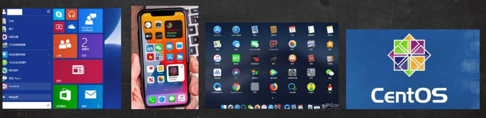
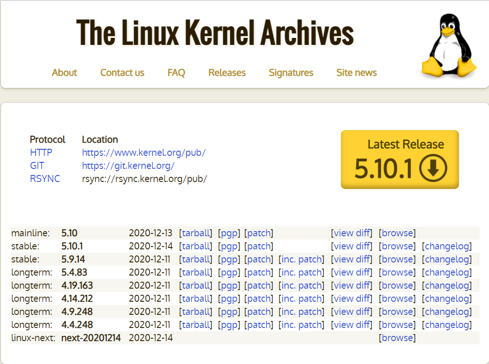
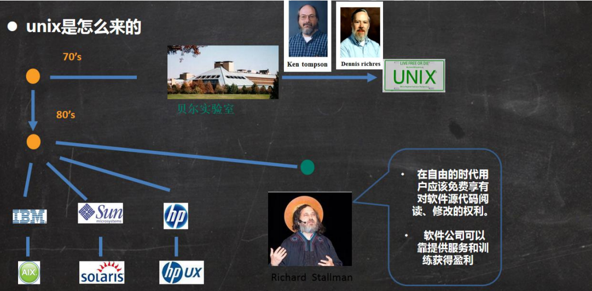
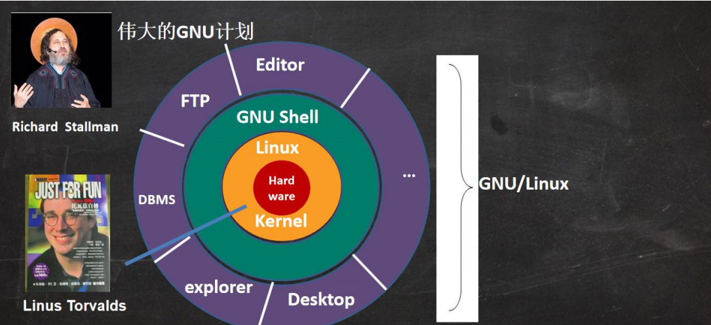

## 第 2 章: Linux入门

### 1. Linux介绍

#### 1.1 概述

1. linux 怎么读， 不下 10 种

2. linux 是一个开源、免费的操作系统，其稳定性、安全性、处理多并发已经得到业界的认可，目前很多企业级的项目

   (c/c++/php/python/java/go)都会部署到 Linux/unix 系统上。

3. 常见的操作系统(windows、IOS、Android、MacOS, Linux, Unix)

   

4. Linux 吉祥物

   

5. Linux 之父

   Linus Torvalds

    - 同时也是git的作者
    - 世界著名黑客

*Linux的源码内心从0.0.1学起*

Linux内核网站: https://www.kernel.org/

#### 1.2 Linux和Unix的关系

Ubuntu(乌班图)、RedHat(红帽)、CentOS、Debain[蝶变]、Fedora、SuSE、OpenSUSE [示意图]

### 2. Linux和Unix的关系图

#### 2.1 unix 是怎么来的

#### 2.2 Linux 是怎么来的

#### 2.3 Linux 和 Unix 关系图

