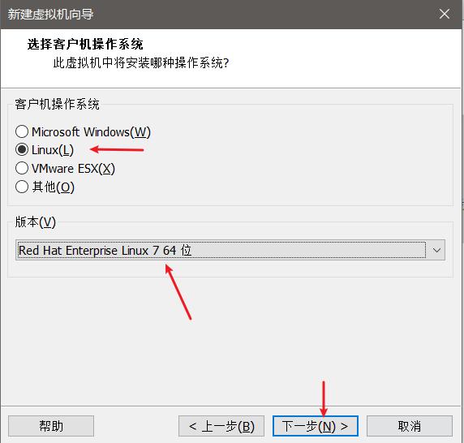
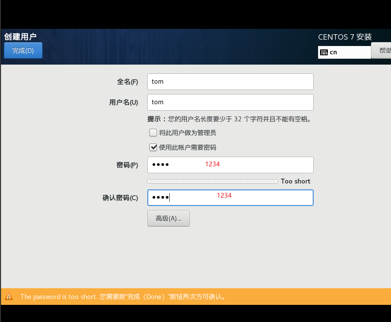
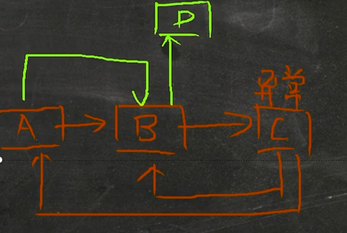
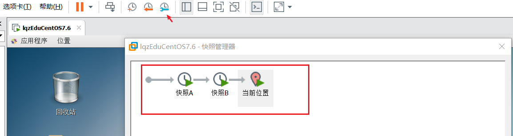
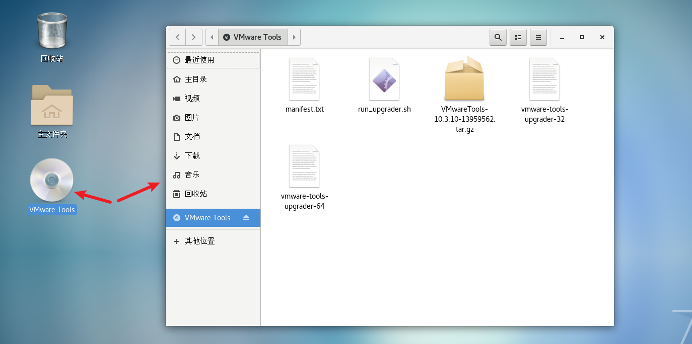

## 第 3 章: VM和Linux的安装

### 1. 安装VM和Centos

#### 1.1 基本说明

学习 Linux 需要一个环境，我们需要创建一个虚拟机，然后在虚拟机上安装一个 Centos 系统来学习

1. 先安装 virtual machine 15.5(虚拟机,可以用于安装虚拟系统)

2. 再安装 Linux (CentOS 7.6(常用)/centOS8.1(当前发行最新2020))

3. VM和Linux的关系图 (真实操作平台下安装虚拟机,虚拟机里面安装虚拟系统)

   

### 2. vmware15.5下载

1. 官方地址：https://www.vmware.com/cn.html

   

   

2. 其它地址：https://www.nocmd.com/windows/740.html

   

### 3. VM的安装步骤(VM15.5)

> 首先需要去 BIOS 里修改设置开启虚拟化设备支持 [参考](https://jingyan.baidu.com/article/ab0b56305f2882c15afa7dda.html);保证vm虚拟机的正常安装
>
> 
>
> 然后根据下面的步骤进行安装即可
>
> 注意: 打开下载的软件的时候需要以管理员身份进行


输入许可证

```
YG5H2-ANZOH-M8ERY-TXZZZ-YKRV8 
UG5J2-0ME12-M89WY-NPWXX-WQH88 
UASDR-2ZD4H-089FY-6YQ5T-YPRX6
```

安装成功后的界面如下


### 4. Centos下载地址

> 可以在迅雷上输入下面对应的地址就可以直接下载了

- CentOS-7-x86_64-DVD-1810.iso CentOS 7.6 DVD 版 4G (目前主流的生产环境)

  http://mirrors.163.com/centos/7.6.1810/isos/x86_64/CentOS-7-x86_64-DVD-1810.iso

- CentOS-8.1.1911-x86_64-dvd1.iso CentOS 8.1 DVD 版 8G (未来的主流.)

  https://mirrors.aliyun.com/centos/8.1.1911/isos/x86_64/CentOS-8.1.1911-x86_64-dvd1.iso

### 5. Centos安装步骤

#### 5.1 创建虚拟机





#### 5.2 开始安装系统(CentOS7.6)的步骤

> 这里可以按ctrl+alt退出屏幕独占模式,解决鼠标无法使用的情况


这一步完成后需要等待几分钟(友情提示,不要瞎点,会卡死)


设计分区


提示生成复杂密码:https://suijimimashengcheng.51240.com/

一般linux不推荐root用户登录,推荐权限相对低一点的其他用户登录

静静的等待很久很久.....

安装成功后如下图所示:


#### 5.3 CentOS 安装难点-网络连接方式理解


##### 5.3.1 概念

1. 网段

   `192.168.0.20` `192.168.0.50` `192.168.0.30`

   同一个192.168.0就表示同一个网段,具备相同网段的ip地址可以相互通讯

2. 桥接模式

   桥接模式,虚拟系统可以和外部系统通讯,但是容易照成IP冲突.(双向的)

3. NAT模式

   NAT模式,网络地址转换模式,虚拟系统可以和外部系统通讯,而且不会造成IP冲突(单向的)

4. 主机模式

   主机模式: 独立的系统不和外部发生连接

##### 5.3.2 图解三种网络模式


### 6. 虚拟机克隆

*如果你已经安装了一台 linux 操作系统，你还想再更多的，没有必要再重新安装，你只需要克隆就可 以。*

方式一: 直接拷贝一份安装好的虚拟机文件


方式二: 使用 vmware 的克隆操作，注意， 克隆时，需要先关闭 linux 系统

关机


### 7. 虚拟机快照

*如果你在使用虚拟机系统的时候(比如 linux)，你想回到原先的某一个状态，也就是说你担心可能有些误操作造成系 统异常，需要回到原先某个正常运行的状态，vmware 也提供了这样的功能，就叫快照管理*

**【应用实例】**



1. 安装好系统以后，先做一个快照 A

2. 进入到系统。创建一个文件夹，再保存一个快照 B

3. 回到系统刚刚安装好的状态 , 即 快照 A

4. 试试看，是否还能再次回到快照 B (可以)

   

### 8. 虚拟机迁移和删除

虚拟系统安装好了，它的本质就是文件(放在文件夹的)。因此虚拟系统的迁移很方便，你可以把安 装好的虚拟系统这个**文件夹整体拷贝或者剪切**到另外位置使用。删除也很简单，用 **vmware** **进行移除**，再点击菜单->
从磁盘删除即可，或者直**接手动删除虚拟系统对应的文件夹**即可。

### 9. 安装vmtools

#### 9.1 vmtools介绍

1. vmtools 安装后，可以让我们在 windows 下更好的管理 vm 虚拟机
2. 可以设置 windows 和 centos 的共享文件夹


#### 9.2 安装vmtools的步骤

1. 进入 centos

2. 点击 vm 菜单的->install vmware tools

   

   

3. centos 会出现一个 vm 的安装包, xx.tar.gz

   

4. 拷贝到 /opt目录


5. 使用解压命令 tar, 得到一个安装文件

   ```shell
   # cd /opt [进入到 opt 目录]
   
   # tar -zxvf xx.tar.gz
   ```


6. 进入该 vm 解压的目录 , /opt 目录下

   cd vmware...

7. 安装 ./vmware-install.pl

8. 全部使用默认设置即可, 就可以安装成功

9. 注意：安装 vmtools 需要有 gcc .

   gcc -v

安装成功后如下图所示

#### 9.3 设置共享文件

1. 基本介绍

   为了方便，可以设置一个共享文件夹，比如 d:/myshare

2. 具体步骤

   1. 菜单->vm->setting, 如图设置即可注意:设置选项为 always enable ,这样可以读写了
   2. windows 和 centos 可共享 d:/myshare 目录可以读写文件了
   3. 共享文件夹在 centos 的 /mnt/hgfs/ 下

   注意事项和细节说明

    - windows 和 contos 就可以共享文件了，但是在实际开发中，文件的上传下载是需要使用 远程方式完成的
    - 远程方式登录，我们后面会具体讲解