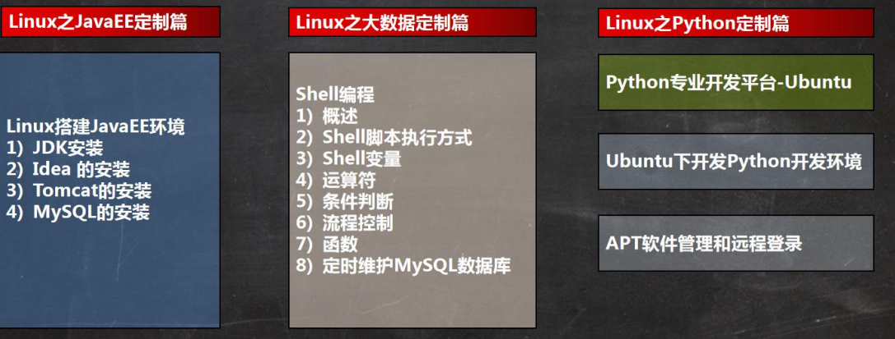
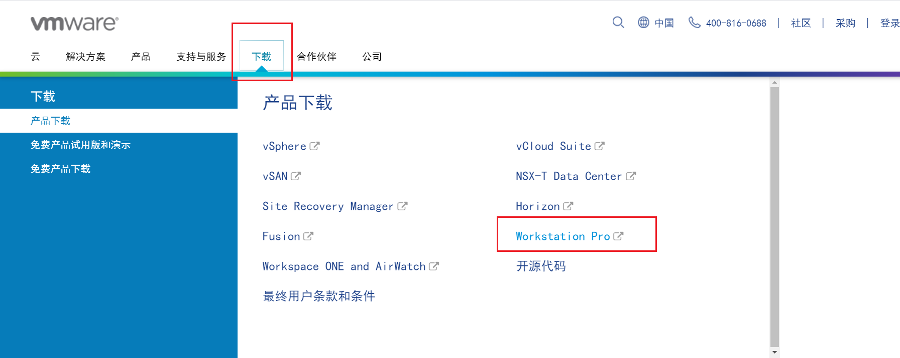
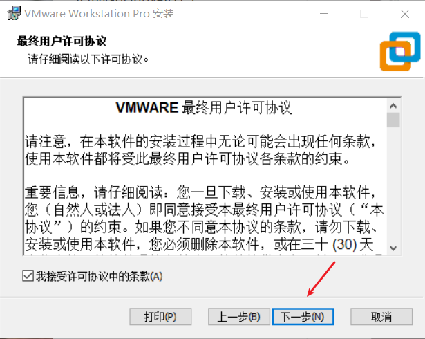
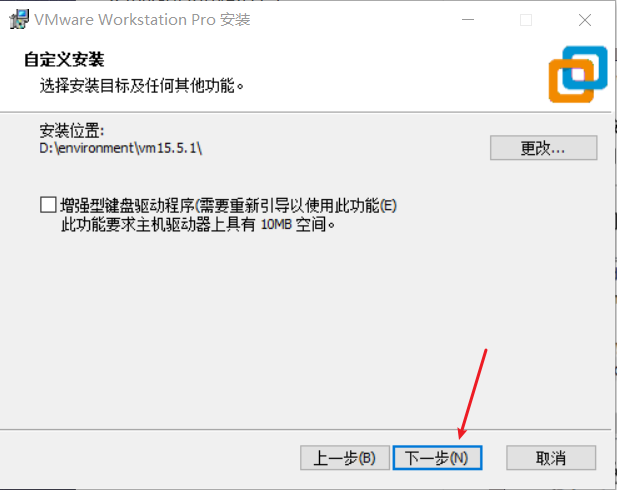
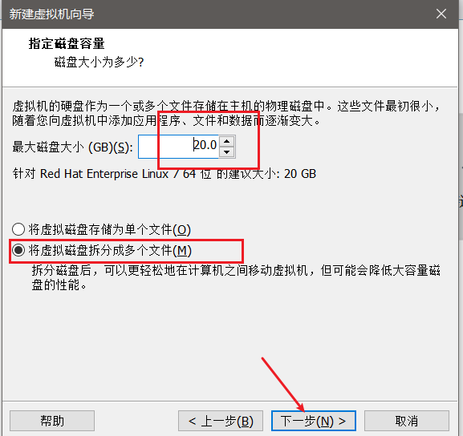
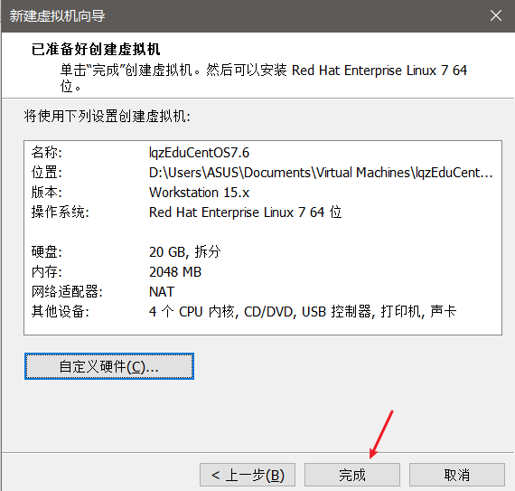
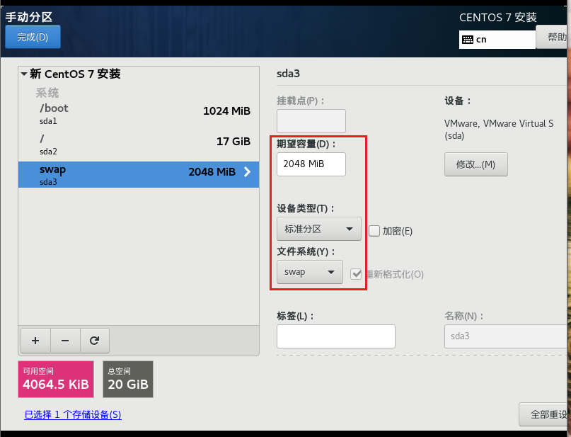
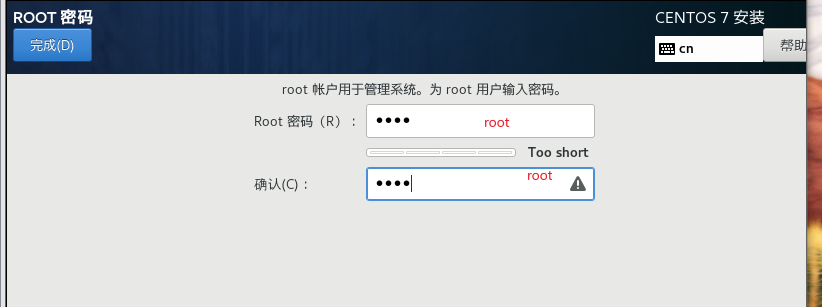

# Linux CentOS7.6 

>  课程名称: [【小白入门 通俗易懂】2021韩顺平 一周学会Linux](https://www.bilibili.com/video/BV1Sv411r7vd)
>
>  课程概述: 课程内容分为七部分，涵盖Linux方方面面。包括基础篇,实操篇,高级篇,java定制篇,大数据定制篇, python定制篇, 企业面试题讲解篇。, 既让初学者快速掌握Linux，也能让Linux老手更全面、系统的学习到技术细节, 是 java c c++ php python 程序员学linux优质资源
>
>  讲述人: 韩顺平

<span style="font-size:35px;color:red">基础篇</span>

## 第 1 章: 内容介绍

### 1. 本套Linux课程内容





### 2. Linux使用在哪些地方


### 3. Linux的应用领域

#### 3.1 个人桌面领域的应用

此领域是传统 linux 应用薄弱的环节，近些年来随着 ubuntu、fedora [fɪˈdɔ:rə] 等优秀桌面环境的兴起，linux 在个人 桌面领域的占有率在逐渐的提高。


#### 3.2 服务器领域

linux 在**服务器领域**的应用是最强的。

linux **免费、稳定、高效**等特点在这里得到了很好的体现，尤其在一些高端领域尤为广泛（c/c++/php/java/python/go）。

#### 3.3 嵌入式领域

linux 运行稳定、对网络的良好支持性、低成本，且可以根据需要进行**软件裁剪**，内核最小可以达到几百 KB 等特点， 使其近些年来在**嵌入式领域**的应用得到非常大的提高 

主要应用：机顶盒、数字电视、网络电话、程控交换机、手机、PDA、智能家居、智能硬件等都是其应用领域。以 后在**物联网中应用会更加广泛**。


## 第 2 章: Linux入门


### 1. Linux介绍

#### 1.1 概述

1. linux 怎么读， 不下 10 种 

2. linux 是一个开源、免费的操作系统，其稳定性、安全性、处理多并发已经得到业界的认可，目前很多企业级的项目 

   (c/c++/php/python/java/go)都会部署到 Linux/unix 系统上。

3. 常见的操作系统(windows、IOS、Android、MacOS, Linux, Unix)

   

4. Linux 吉祥物

   

5. Linux 之父

   Linus Torvalds

   - 同时也是git的作者
   - 世界著名黑客

*Linux的源码内心从0.0.1学起*

Linux内核网站: https://www.kernel.org/


#### 1.2 Linux和Unix的关系

Ubuntu(乌班图)、RedHat(红帽)、CentOS、Debain[蝶变]、Fedora、SuSE、OpenSUSE [示意图]


### 2. Linux和Unix的关系图

#### 2.1 unix 是怎么来的 


#### 2.2 Linux 是怎么来的


#### 2.3 Linux 和 Unix 关系图


## 第 3 章: VM和Linux的安装


### 1. 安装VM和Centos

#### 1.1 基本说明

学习 Linux 需要一个环境，我们需要创建一个虚拟机，然后在虚拟机上安装一个 Centos 系统来学习

1. 先安装 virtual machine 15.5(虚拟机,可以用于安装虚拟系统)

2. 再安装 Linux (CentOS 7.6(常用)/centOS8.1(当前发行最新2020)) 

3. VM和Linux的关系图 (真实操作平台下安装虚拟机,虚拟机里面安装虚拟系统)

   


### 2. vmware15.5下载

1. 官方地址：https://www.vmware.com/cn.html 

   

   

2. 其它地址：https://www.nocmd.com/windows/740.html

   

### 3. VM的安装步骤(VM15.5)

> 首先需要去 BIOS 里修改设置开启虚拟化设备支持 [参考](https://jingyan.baidu.com/article/ab0b56305f2882c15afa7dda.html);保证vm虚拟机的正常安装
>
> 
>
> 然后根据下面的步骤进行安装即可
>
> 注意: 打开下载的软件的时候需要以管理员身份进行








输入许可证

```
YG5H2-ANZOH-M8ERY-TXZZZ-YKRV8 
UG5J2-0ME12-M89WY-NPWXX-WQH88 
UASDR-2ZD4H-089FY-6YQ5T-YPRX6
```

安装成功后的界面如下


### 4. Centos下载地址

> 可以在迅雷上输入下面对应的地址就可以直接下载了

- CentOS-7-x86_64-DVD-1810.iso CentOS 7.6 DVD 版 4G (目前主流的生产环境)

  http://mirrors.163.com/centos/7.6.1810/isos/x86_64/CentOS-7-x86_64-DVD-1810.iso 

- CentOS-8.1.1911-x86_64-dvd1.iso CentOS 8.1 DVD 版 8G (未来的主流.)

  https://mirrors.aliyun.com/centos/8.1.1911/isos/x86_64/CentOS-8.1.1911-x86_64-dvd1.iso

### 5. Centos安装步骤

#### 5.1 创建虚拟机








#### 5.2 开始安装系统(CentOS7.6)的步骤 

> 这里可以按ctrl+alt退出屏幕独占模式,解决鼠标无法使用的情况


这一步完成后需要等待几分钟(友情提示,不要瞎点,会卡死)


设计分区





提示生成复杂密码:https://suijimimashengcheng.51240.com/ 


一般linux不推荐root用户登录,推荐权限相对低一点的其他用户登录

静静的等待很久很久.....

安装成功后如下图所示:


#### 5.3 CentOS 安装难点-网络连接方式理解 


##### 5.3.1 概念

1. 网段

   `192.168.0.20` `192.168.0.50` `192.168.0.30`

   同一个192.168.0就表示同一个网段,具备相同网段的ip地址可以相互通讯

2. 桥接模式

   桥接模式,虚拟系统可以和外部系统通讯,但是容易照成IP冲突.(双向的)

3. NAT模式

   NAT模式,网络地址转换模式,虚拟系统可以和外部系统通讯,而且不会造成IP冲突(单向的)

4. 主机模式

   主机模式: 独立的系统不和外部发生连接

##### 5.3.2 图解三种网络模式


### 6. 虚拟机克隆

*如果你已经安装了一台 linux 操作系统，你还想再更多的，没有必要再重新安装，你只需要克隆就可 以。*

方式一: 直接拷贝一份安装好的虚拟机文件


方式二: 使用 vmware 的克隆操作，注意， 克隆时，需要先关闭 linux 系统

关机


### 7. 虚拟机快照

*如果你在使用虚拟机系统的时候(比如 linux)，你想回到原先的某一个状态，也就是说你担心可能有些误操作造成系 统异常，需要回到原先某个正常运行的状态，vmware 也提供了这样的功能，就叫快照管理*


**【应用实例】**


1. 安装好系统以后，先做一个快照 A

2. 进入到系统。创建一个文件夹，再保存一个快照 B

3. 回到系统刚刚安装好的状态 , 即 快照 A

4. 试试看，是否还能再次回到快照 B (可以)

   

   

### 8. 虚拟机迁移和删除

虚拟系统安装好了，它的本质就是文件(放在文件夹的)。因此虚拟系统的迁移很方便，你可以把安 装好的虚拟系统这个**文件夹整体拷贝或者剪切**到另外位置使用。删除也很简单，用 **vmware** **进行移除**，再点击菜单->从磁盘删除即可，或者直**接手动删除虚拟系统对应的文件夹**即可。 

### 9. 安装vmtools

#### 9.1 vmtools介绍

1. vmtools 安装后，可以让我们在 windows 下更好的管理 vm 虚拟机
2. 可以设置 windows 和 centos 的共享文件夹


#### 9.2 安装vmtools的步骤

1. 进入 centos

2. 点击 vm 菜单的->install vmware tools

   

   

3. centos 会出现一个 vm 的安装包, xx.tar.gz

   

4. 拷贝到 /opt目录

    

5. 使用解压命令 tar, 得到一个安装文件

   ```shell
   # cd /opt [进入到 opt 目录]
   
   # tar -zxvf xx.tar.gz
   ```

   

6. 进入该 vm 解压的目录 , /opt 目录下

   cd vmware...

7. 安装 ./vmware-install.pl 

8. 全部使用默认设置即可, 就可以安装成功 

9. 注意：安装 vmtools 需要有 gcc .

   gcc -v 

安装成功后如下图所示


#### 9.3 设置共享文件

1. 基本介绍 

   为了方便，可以设置一个共享文件夹，比如 d:/myshare 

2. 具体步骤

   1. 菜单->vm->setting, 如图设置即可注意:设置选项为 always enable ,这样可以读写了
   2. windows 和 centos 可共享 d:/myshare 目录可以读写文件了
   3. 共享文件夹在 centos 的 /mnt/hgfs/ 下

   注意事项和细节说明 

   - windows 和 contos 就可以共享文件了，但是在实际开发中，文件的上传下载是需要使用 远程方式完成的
   - 远程方式登录，我们后面会具体讲解

## 第 4 章: 目录结构


### 1. Linux目录结构

#### 1.1 基本介绍

1. linux 的文件系统是采用级层式的树状目录结构，在此结构中的最上层是根目录“/”，然后在此目录下再创建其他的 目录。

2. 深刻理解 linux 树状文件目录是非常重要的

3. 记住一句经典的话：在 Linux 世界里，一切皆文件(!!)

   

#### 1.2 结构图如下


### 2. 具体结构

1. `/` linux根目录
2. `/bin` [常用] (/usr/bin 、 /usr/local/bin) 是 Binary 的缩写, 这个目录存放着最经常使用的命令 
3. `/sbin` (/usr/sbin 、 /usr/local/sbin) s 就是 Super User 的意思，这里存放的是系统管理员使用的系统管理程序。 
4. `/home` [常用] 存放普通用户的主目录，在 Linux 中每个用户都有一个自己的目录，一般该目录名是以用户的账号命名, 老师演示，体验
5. `/root` [常用] 该目录为系统管理员，也称作超级权限者的用户主目录 
6. `/lib` 系统开机所需要最基本的动态连接共享库，其作用类似于 Windows 里的 DLL 文件。几乎所有的应用程序都需要 用到这些共享库 
7. `/lost+found` 这个目录一般情况下是空的，当系统非法关机后，这里就存放了一些文件 
8. `/etc` [常用] 所有的系统管理所需要的配置文件和子目录, 比如安装 mysql 数据库 my.conf 
9. `/usr` [常用] 这是一个非常重要的目录，用户的很多应用程序和文件都放在这个目录下，类似与 windows 下的 program files 目录。 
10. `/boot` [常用] 存放的是启动 Linux 时使用的一些核心文件，包括一些连接文件以及镜像文件 
11. `/proc` [不能动] 这个目录是一个虚拟的目录，它是系统内存的映射，访问这个目录来获取系统信息 
12. `/srv` [不能动] service 缩写，该目录存放一些服务启动之后需要提取的数据 
13. `/sys` [不能动]这是 linux2.6 内核的一个很大的变化。该目录下安装了 2.6 内核中新出现的一个文件系统 sysfs =》【别 动】 
14. `/tmp` 这个目录是用来存放一些临时文件的 
15. `/dev` 类似于 windows 的设备管理器，把所有的硬件用文件的形式存储 
16. `/media` [常用] linux 系统会自动识别一些设备，例如 U 盘、光驱等等，当识别后，linux 会把识别的设备挂载到这个 目录下 
17. `/mnt` [常用] 系统提供该目录是为了让用户临时挂载别的文件系统的，我们可以将外部的存储挂载在/mnt/上，然后进入该目录就可以查看里的内容了。 d:/myshare
18. `/opt` 这是给主机额外安装软件所存放的目录。如安装 ORACLE 数据库就可放到该目录下。默认为空 
19. `/usr/local` [常用] 这是另一个给主机额外安装软件所安装的目录。一般是通过编译源码方式安装的程序 
20. `/var` [常用] 这个目录中存放着在不断扩充着的东西，习惯将经常被修改的目录放在这个目录下。包括各种日志文件 
21. `/selinux` [security-enhanced linux] SELinux 是一种安全子系统,它能控制程序只能访问特定文件, 有三种工作模式，可以自行设置.


## 第 5 章: 远程登录到Linux服务器


### 1. 为什么需要远程Linux


### 2. 远程Linux-Xshell6


### 3. 下载-安装-配置和使用


### 4. 远程上传下载文件-Xftp6


### 5. Xftp6和XShell6的使用


## 第 6 章: Vi和Vim编辑器


### 1. vi和vim介绍


### 2. vi和vim的三种模式


### 3. vi和vim基本使用


### 4. 各种模式的相互切换


### 5. vi和vim快捷键


### 6. vi和vim课堂练习


## 第 7 章: 开机丶重启和用户登录注销


### 1. 关机&重启命令


### 2. 用户登录和注销


## 第 8 章: 用户管理


### 1. 基本介绍


### 2. 添加用户


### 3. 指定/修改密码


### 4. 删除用户


### 5. 查询用户信息指令


### 6. 切换用户


### 7. 查看当前用户/登录用户


### 8. 用户组


### 9. 用户组和相关文件


## 第 9 章: 实用指令


### 1. 指定运行级别


### 2. 找回root密码


### 3. 帮助指令


### 4. 文件目录类


### 5. 时间日期类


### 6. 搜索查找类


### 7. 压缩和解压类


## 第 10 章: 组管理和权限管理


### 1. Linux组基本介绍


### 2. 文件/目录 所有者


### 3. 组的创建


### 4. 文件/目录 所在组


### 5. 其他组


### 6. 改变用户所在组


### 7. 权限的抽介绍


### 8. rwx权限讲解,难点


### 9. 文件及目录权限实际案例


### 10. 修改权限-chmod


### 11. 修改文件所有者-chown


### 12. 修改文件/目录所在组-chgrp


### 13. 最佳实践-警察和土匪游戏


### 14. 课后练习


### 15. 课堂练习2,完成如下操作


## 第 11 章: 定时任务调度


### 1. crond任务调度


### 2. at定时任务


## 第 12 章: Linux磁盘分区和挂载

### 1. Linux分区


### 2. 挂载的经典案例


### 3. 磁盘情况查询


### 4. 磁盘情况-工作实用指令

## 第 13 章: 网络配置

### 1. Linux网络配置原理图


### 2. 查看网络IP和网关


### 3. 查看Windows环境中VMnet8网络配置(ipconfig指令)


### 4. 查看Linux的网络配置(ifconfig)


### 5. ping测试主机之间网络连通性


### 6. Linux网络环境配置


### 7. 设置主机名和hosts映射


### 8. 主机名解析过程分析(Hosts丶DNS)

## 第 14 章: 进程管理

### 1. 基本介绍


### 2. 显示系统执行的进程


### 3. 终止进程kill和killall


### 4. 查看进程树pstree


### 5. 服务(Service)管理


### 6. 动态监控进程


### 7. 监控网络状态

## 第 15 章: RPM与YUM


### 1. rpm包的管理

#### 1.1 介绍

rpm 用于互联网下载包的打包及安装工具，它包含在某些 Linux 分发版中。它生成具有.RPM 扩展名的文件。RPM 是 RedHat Package Manager（RedHat 软件包管理工具）的缩写，类似 windows 的 setup.exe，这一文件格式名称虽然打上 了 RedHat 的标志，但理念是通用的。

Linux 的分发版本都有采用（suse,redhat, centos 等等），可以算是公认的行业标准了。

#### 1.2 rpm 包的简单查询指令

```shell
# 查询已安装的 rpm 列表 
rpm –qa | grep xx 
# 举例： 看看当前系统，是否安装了 firefox 
rpm -qa | grep firefox
```


#### 1.3 rpm 包名基本格式

```shell
一个 rpm 包名：firefox-60.2.2-1.el7.centos.x86_64 
名称:firefox 
版本号：60.2.2-1 
适用操作系统: el7.centos.x86_64 
表示 centos7.x 的 64 位系统 
如果是 i686、i386 表示 32 位系统，noarch 表示通用
```


#### 1.4 rpm 包的其它查询指令

```shell
rpm -qa :查询所安装的所有 rpm 软件包 
rpm -qa | more 
rpm -qa | grep X [rpm -qa | grep firefox ]
rpm -q 软件包名 :查询软件包是否安装 
# 案例：rpm -q firefox
rpm -qi 软件包名 ：查询软件包信息 
# 案例: rpm -qi firefox 
rpm -ql 软件包名 :查询软件包中的文件 
比如： rpm -ql firefox

rpm -qf 文件全路径名 查询文件所属的软件包 
rpm -qf /etc/passwd 
rpm -qf /root/install.log
```


#### 1.5 卸载 rpm 包

```shell
# 基本语法
rpm -e RPM 包的名称 //erase
# 应用案例
# 删除 firefox 软件包
rpm -e firefox
# 细节讨论
# 1. 如果其它软件包依赖于您要卸载的软件包，卸载时则会产生错误信息。
如： $ rpm -e foo
removing these packages would break dependencies:foo is needed by bar-1.0-1
# 2. 如果我们就是要删除 foo 这个 rpm 包，可以增加参数 --nodeps ,就可以强制删除，但是一般不推荐这样做，因为依 赖于该软件包的程序可能无法运行
如：$ rpm -e --nodeps foo
```


#### 1.6 安装 rpm 包

```shell
# 基本语法
rpm -ivh RPM 包全路径名称
# 参数说明
# i=install 安装
# v=verbose 提示
# h=hash 进度条

# 应用实例
# 演示卸载和安装 firefox 浏览器
rpm -e firefox
rpm -ivh firefox
```


### 2. yum

#### 2.1 介绍

Yum 是一个 Shell 前端软件包管理器。基于 RPM 包管理，能够从指定的服务器自动 下载 RPM 包并且安装，可以自动处理依赖性关系，并且一次安装所有依赖的软件包。


#### 2.2 yum 的基本指令

```shell
# 查询 yum 服务器是否有需要安装的软件 
yum list|grep xx 软件列表
```


#### 2.3 安装指定的 yum 包

```shell
yum install xxx 下载安装
```


#### 2.4 yum 应用实例

```shell
# 案例：请使用 yum 的方式来安装 firefox 
rpm -e firefox 
yum list | grep firefox 
yum install firefox
```


<span style="font-size:35px;color:red">定制篇</span>

## 第 16 章: JavaEE定制篇-搭建JavaEE环境

# 

### 1. 概述


### 2. 安装JDK


### 3. Tomcat的安装


### 4. idea2020的安装


### 5. MySQL5.7的安装

## 第 17 章: 大数据定制篇-Shell编程

### 1. 为什么要学习Shell编程


### 2. Shell是什么


### 3. Shell脚本的执行方式


### 4. Shell的变量


### 5. 设置环境变量


### 6. 位置参数变量


### 7. 预定义变量


### 8. 运算符


### 9. 条件判断


### 10. 流程控制


### 11. read读取控制台输入


### 12. 函数


### 13. Shell编程综合案例

## 第 18 章: Python定制篇-Python开发平台Ubuntu

### 1. Ubuntu介绍


### 2. 安装的步骤


### 3. 设置Ubuntu支持中文


### 4. Ubuntu的root用户


### 5. Ubuntu下开发Python


## 第 19 章: Python定制篇-APT软件管理和远程登录

### 1. apt介绍


### 2. Ubuntu软件操作的相关命令


### 3. 更新Ubuntu软件下载地址


### 4. Ubuntu软件安装丶卸载的最佳实践


### 5. 远程登录Ubuntu


<span style="font-size:35px;color:red">高级篇</span>

## 第 20 章: Centos8.1的使用

### 1. 安装CentOS8.1/8/2


### 2. CentOS8.0 vs CentOS7.0比较(了解)

## 第 21 章: 日志管理

### 1. 基本介绍


### 2. 系统常用的日志


### 3. 日志管理服务 rsyslogd


### 4. 日志轮替


### 5. 日志轮替机制原理


### 6. 查看内存日志


## 第 22 章: 定制自己的Linux系统

### 1. 基本介绍


### 2. 基本原理


### 3. 制作min linux思路分析


### 4. 操作步骤

## 第 23 章: 介绍与内核升级

### 1. 为什么要阅读Linux内核


### 2. Linux0.0.1内核


### 3. Linux内核最新版本和内核升级

## 第 24 章: 备份与恢复

### 1. 基本介绍


### 2. 安装dump和restore


### 3. 使用dump完成备份


### 4. 使用restore完成恢复

## 第 25 章: webmin和bt运维工具

### 1. webmin


### 2. bt(宝塔)

## 第 26 章 : 面试题

*腾讯,百度,美团,滴滴,等大厂linux面试题*

1. 分析日志tlog（访问量），将各个ip地址截取，并统计出现次数，并按从大到小排序（腾讯）


2. 统计连接到服务器的各个ip情况，并按连接数从大到小排序（腾讯）


3. 问题：如忘记了mysq15.7数据库的ROOT用户的密码，如何找回？（滴滴）


4. 写出指令：统计ip访问情况，要求分析nginx访问日志（access.log），找出访问页面数量在前2位的ip（美团）


5. ，使用tepdump监听本机，将来自ip 192.168.200.1，tcp端口为22的数据，保存输出到tepdump.log，用做将来数据分析（美团）>>


6. 常用的Nginx模块，用来做什么（头条）


7. 如果你是系统管理员，在进行Linux系统权限划分时，应考虑哪些因素？（腾讯）


8. 权限操作思考题


9. 说明Centos7启动流程，并说明和CentOS6相同和不同的地方（腾讯）


10. 问题：列举Linux高级命令，至少6个（百度）


11. 问题：Linux查看内存、io读写、磁盘存储、端口占用、进程查看命令是什么？（瓜子）


12. 使用Linux命令计算t2.txt第二列的和并输出（美团）


13. Shell脚本里如何检查一个文件是否存在？并给出提示（百度）


14. 用shell写一个脚本，对文本13.txt中无序的一列数字排序，并将总和输出（百度）


15. 请用指令写出查找当前文件夹（home）下所有的文本文件内容中包含有字符"cat"


16. 请写出统计/home目录下所有文件个数和所有文件总行数的指令（在金山面试题扩展）


17. 列出你了解的web服务器负载架构（滴滴）


18. 每天晚上10点30分，打包站点目录/var/spool/mail备份到/ome目录下（每次备份按时间生成不同的备份包比如按照年月日时分秒）（滴滴）


19. 如何优化Linux 系统，i出IE法（Л}）


20. 

