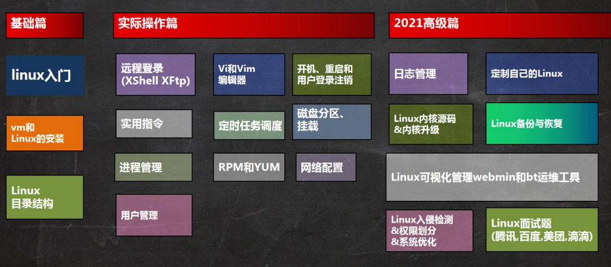
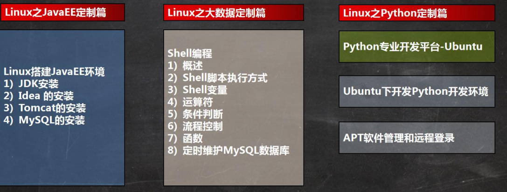
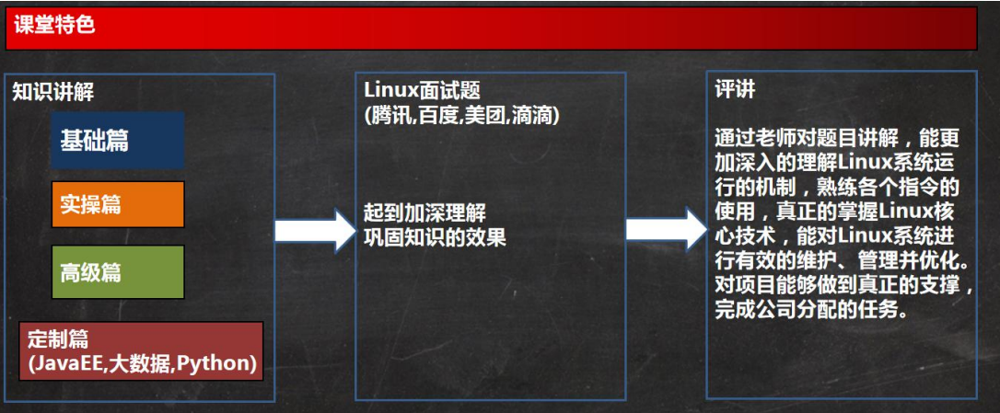
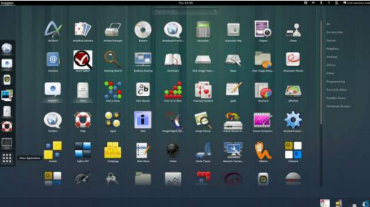

# 内容介绍

## 1. 本套Linux课程内容

## 2. Linux使用在哪些地方

## 3. Linux的应用领域

### 3.1 个人桌面领域的应用

此领域是传统 linux 应用薄弱的环节，近些年来随着 ubuntu、fedora [fɪˈdɔ:rə] 等优秀桌面环境的兴起，linux 在个人 桌面领域的占有率在逐渐的提高。

### 3.2 服务器领域

linux 在**服务器领域**的应用是最强的。

linux **免费、稳定、高效**等特点在这里得到了很好的体现，尤其在一些高端领域尤为广泛（c/c++/php/java/python/go）。

### 3.3 嵌入式领域

linux 运行稳定、对网络的良好支持性、低成本，且可以根据需要进行**软件裁剪**，内核最小可以达到几百 KB 等特点， 使其近些年来在**嵌入式领域**的应用得到非常大的提高 

主要应用：机顶盒、数字电视、网络电话、程控交换机、手机、PDA、智能家居、智能硬件等都是其应用领域。以 后在**物联网中应用会更加广泛**。

