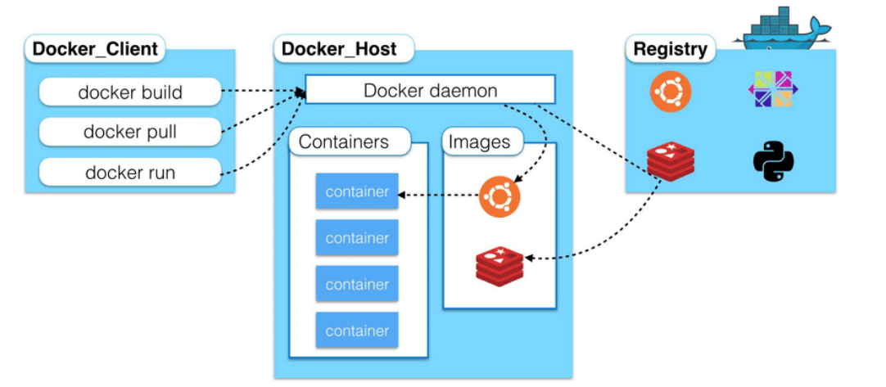
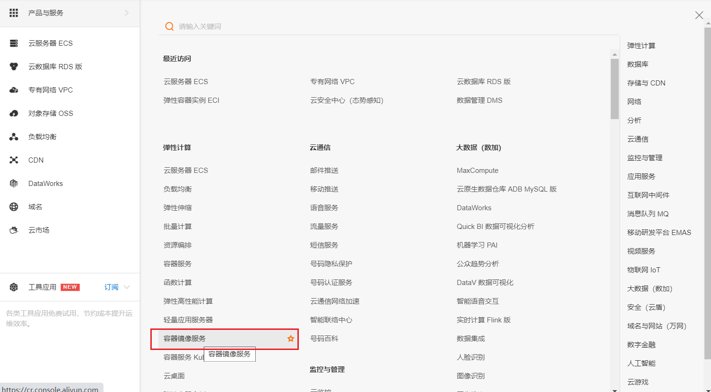
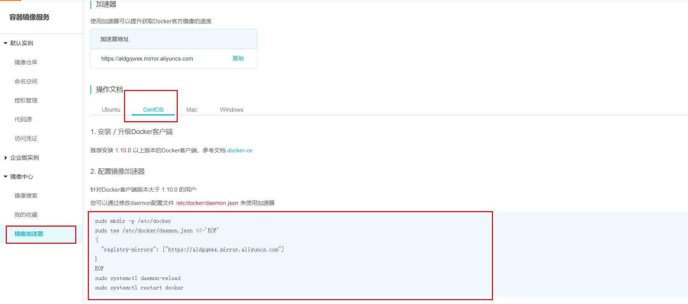
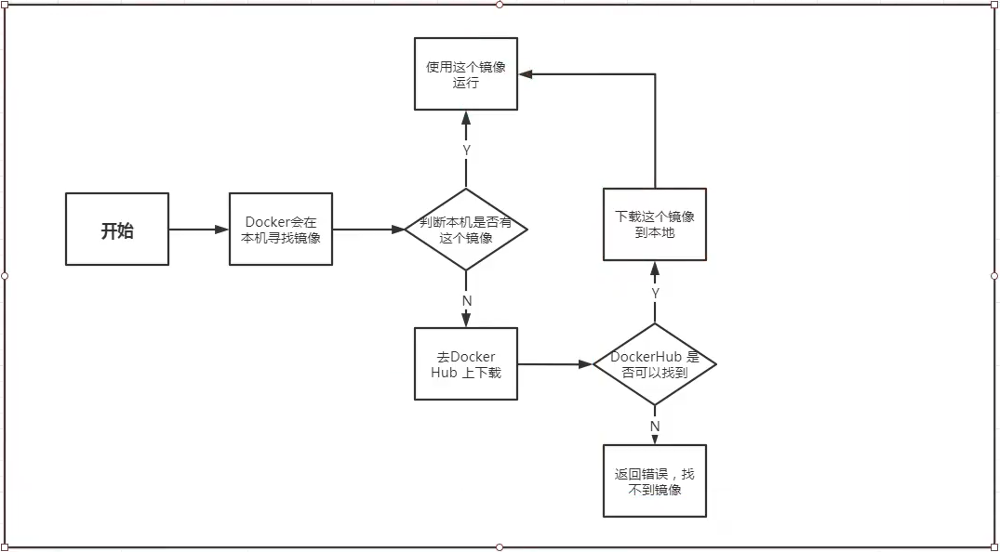
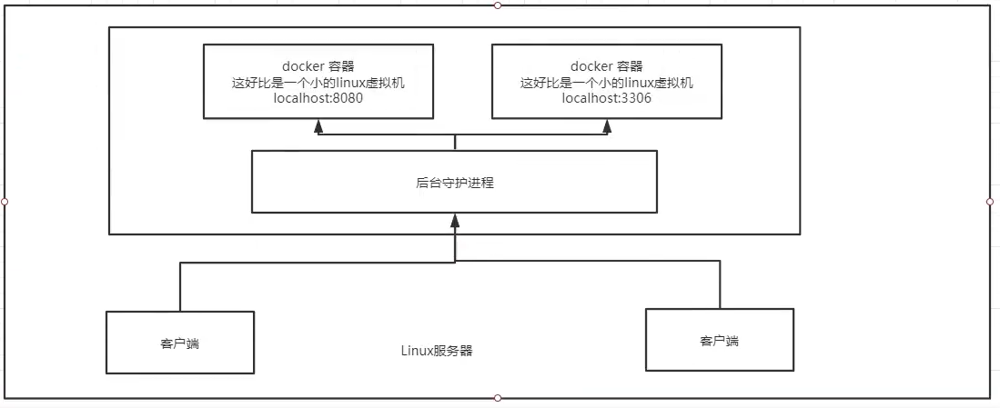
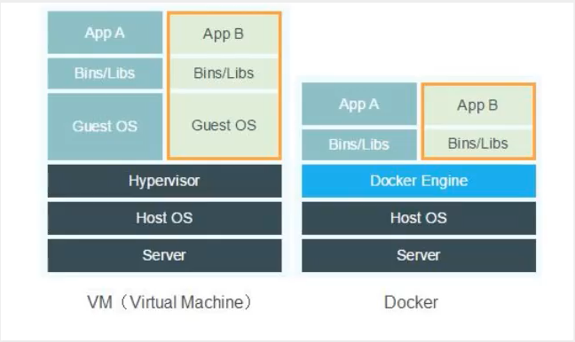

# Docker安装

## 1. Docker的基本组成

### 1.1 Docker的架构图



### 1.2 镜像(image)

Docker 镜像（Image）就是一个**只读的模板**。镜像可以用来创建 Docker 容器，一个镜像可以创建很多容器。 就好似 Java 中的 类和对象，类就是镜像，容器就是对象！

### 1.3 容器(container)

Docker 利用容器（Container）独立运行的一个或一组应用。容器是用镜像创建的运行实例。 它可以被启动、开始、停止、删除。每个容器都是相互隔离的，保证安全的平台。 

可以把容器看做是一个简易版的 Linux 环境（包括root用户权限、进程空间、用户空间和网络空间等） 和运行在其中的应用程序。 容器的定义和镜像几乎一模一样，也是一堆层的统一视角，唯一区别在于容器的最上面那一层是可读可写 的。


### 1.4 仓库(repository)

仓库（Repository）是集中存放镜像文件的场所。 

仓库(Repository)和仓库注册服务器（Registry）是有区别的。仓库注册服务器上往往存放着多个仓 库，每个仓库中又包含了多个镜像，每个镜像有不同的标签（tag）。 仓库分为公开仓库（Public）和私有仓库（Private）两种形式。 

最大的公开仓库是 Docker Hub(https://hub.docker.com/)，存放了数量庞大的镜像供用户下载。 

国内的公开仓库包括阿里云 、网易云 等


### 1.5 小结

1. Docker 本身是一个容器运行载体或称之为管理引擎。我们把应用程序和配置依赖打包好形成一个可交付的运行环境，这个打包好的运行环境就似乎 image镜像文件。只有通过这个镜像文件才能生成 Docker 容器。image 文件可以看作是容器的模板。Docker 根据 image 文件生成容器的实例。同一个 image 文件，可以生成多个同时运行的容器实例。
2. image 文件生成的容器实例，本身也是一个文件，称为镜像文件。
3. 一个容器运行一种服务，当我们需要的时候，就可以通过docker客户端创建一个对应的运行实例，也就是我们的容器
4. 至于仓库，就是放了一堆镜像的地方，我们可以把镜像发布到仓库中，需要的时候从仓库中拉下来就可以了。

## 2. 环境说明

> 我们使用的是 CentOS 7 (64-bit)目前，CentOS 仅发行版本中的内核支持 Docker。Docker 运行在 CentOS 7 上，要求系统为64位、系统内核版本为 3.10 以上。

**查看自己的内核：**

`uname -r`命令用于打印当前系统相关信息（内核版本号、硬件架构、主机名称和操作系统类型等）。

```shell
# 系统内核是3.10以上的
[root@xiyang ~]# uname -r
3.10.0-957.21.3.el7.x86_64
```

**查看版本信息：**

`cat /etc/os-release`

```shell
[root@xiyang ~]# cat /etc/os-release
NAME="CentOS Linux"
VERSION="7 (Core)"
ID="centos"
ID_LIKE="rhel fedora"
VERSION_ID="7"
PRETTY_NAME="CentOS Linux 7 (Core)"
ANSI_COLOR="0;31"
CPE_NAME="cpe:/o:centos:centos:7"
HOME_URL="https://www.centos.org/"
BUG_REPORT_URL="https://bugs.centos.org/"

CENTOS_MANTISBT_PROJECT="CentOS-7"
CENTOS_MANTISBT_PROJECT_VERSION="7"
REDHAT_SUPPORT_PRODUCT="centos"
REDHAT_SUPPORT_PRODUCT_VERSION="7"
```


## 3. 安装步骤

> 安装前准备: 
>
> - 官网安装参考手册：https://docs.docker.com/engine/install/centos/
>
> - 确定你是CentOS7及以上版本
>
> - yum安装gcc相关环境（需要确保 虚拟机可以上外网 ） 
>
>   ```shell
>   yum -y install gcc 
>   yum -y install gcc-c++
>   ```

1. 卸载旧版本(如果你之前安装了docker需要卸载)

   ```shell
   # 1. 卸载旧版本的docker
   sudo yum remove docker \
                     docker-client \
                     docker-client-latest \
                     docker-common \
                     docker-latest \
                     docker-latest-logrotate \
                     docker-logrotate \
                     docker-engine
   ```

5. 安装Docker需要的安装包

   ```shell
   yum install -y yum-utils
   ```

3. 设置阿里镜像仓库

   ```shell
   # 不推荐使用国外的镜像,较慢
   sudo yum-config-manager \
   	--add-repo \
   	https://download.docker.com/linux/centos/docker-ce.repo 
   ## 报错 [Errno 14] curl#35 - TCP connection reset by peer [Errno 12] curl#35 - Timeout 
   
   ## -----------------
   
   # 正确推荐使用国内的阿里云镜像
   sudo yum-config-manager \
       --add-repo \
       http://mirrors.aliyun.com/docker-ce/linux/centos/docker-ce.repo
   ```

4. 更新yum软件包索引

   ```shell
   yum makecache fast
   ```

5. 安装docker相关的内容( Docker CE社区版的Docker)

   ```shell
   # docker-ce: 社区, ee是企业版的
   sudo yum install docker-ce docker-ce-cli containerd.io
   # 后续安装需要输入几次y
   ```

6. 启动 Docker

   ```shell
   systemctl start docker
   ```

7. 测试命令

   ```shell
   # 查看docker版本
   docker version 
   # 使用docker运行hello-world
   docker run hello-world 
   # docker的镜像
   docker images
   ```

   ```shell
   # 安装成功后下面的命令是可以正常运行的表明docker已经正常启动
   # 启动docker容器
   [root@xiyang ~]# systemctl start docker
   # 查看docker的版本
   [root@xiyang ~]# docker version
   # 查看docker的进程
   [root@xiyang ~]# docker ps
   CONTAINER ID   IMAGE     COMMAND   CREATED   STATUS    PORTS     NAMES
   
   ```

   

8. 卸载docker

   ```shell
   # 停止docker
   systemctl stop docker 
   # 删除docker相关内容
   yum -y remove docker-ce docker-ce-cli containerd.io 
   # 删除docker文件夹 /var/lib/docker: 是docker的默认工作路径
   rm -rf /var/lib/docker
```
   

```shell
# 运行hello-world(检验docker是否安装成功)
docker run hello-world
# 查看hello-world的镜像
docker images
```


## 4. 阿里云镜像加速

*阿里云控制台配置后更快*


进入阿里云控制台找到镜像加速器






1. 介绍：https://www.aliyun.com/product/acr

2. 注册一个属于自己的阿里云账户(可复用淘宝账号) 

3. 进入管理控制台设置密码，开通

4. 查看镜像加速器自己的

5. 配置镜像加速

   ```shell
   # 创建一个目录
   sudo mkdir -p /etc/docker
   # 在上面目录下的json中配置一个阿里云的地址
   sudo tee /etc/docker/daemon.json <<-'EOF'
   {
     "registry-mirrors": ["https://aldgqwxx.mirror.aliyuncs.com"]
   }
   EOF
   # 重启镜像
   sudo systemctl daemon-reload
   # 重启docker
   sudo systemctl restart docker
   ```

   


## 5. 镜像执行流程

通过前面的docker image查看到了hello-world镜像,以此为例子,了解docker运行镜像的大致流程

docker运行镜像的流程分析图: 




## 6. docker运行原理

*Docker是如何工作的?*



## 7. Docker为什么比虚拟机快

1. Docker有着比虚拟机更少的抽象层。

   

2. docker利用的是宿主机的内核，vm需要是Guest OS.

   所以说，新建一个容器的时候，docker不需要想虚拟机一样重新加载一个操作系统内核，避免一些引导操作。虚拟机是加载Guest OS，<u>分钟</u>级别的，而docker是利用宿主机的操作系统吗，省略了这个复杂的过程，<u>秒级</u>！