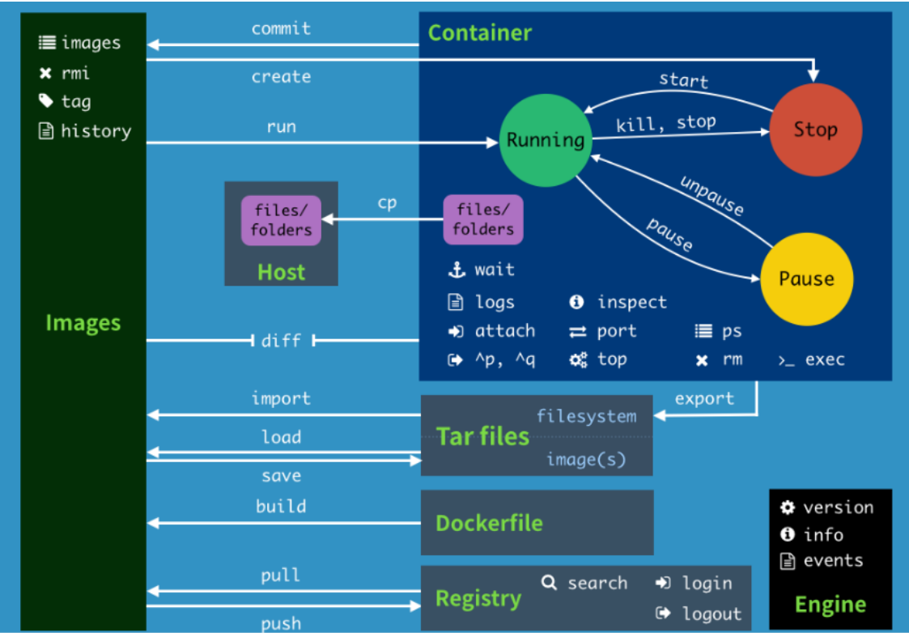

# Docker常用命令

## 1. Docker帮助命令

```shell
docker version # 显示 Docker 版本信息。 
docker info # 显示 Docker 系统信息，包括镜像和容器数。
docker --help # docker所有的帮助命令
	# docker 命令 --help # docker指定命令的帮助命令
	#例如
	docker run --help # docker 的run帮助命令
```

*[docker命令文档地址](https://docs.docker.com/engine/reference/commandline/)*

## 2. 镜像命令

### 2.1 docker images

`docker images`用于显示本地镜像

```shell
# 查询本地主机上的所有镜像 
[root@xiyang ~]# docker images
REPOSITORY    TAG       IMAGE ID       CREATED         SIZE
hello-world   latest    bf756fb1ae65   11 months ago   13.3kB
```

```shell
# 解释 
# REPOSITORY 镜像的仓库源 
# TAG 镜像的标签 
# IMAGE ID 镜像的ID 
# CREATED 镜像创建时间 
# SIZE 镜像大小 

# 同一个仓库源可以有多个 TAG，代表这个仓库源的不同版本，我们使用REPOSITORY：TAG 定义不同 的镜像，如果你不定义镜像的标签版本，docker将默认使用 lastest 镜像！ 
# 可选项 
-a： 显示出本地所有镜像 
-q： 显示出本地所有镜像镜像id 
--digests： 显示镜像的摘要信息
```


### 2.2 docker search

`docker search 镜像名`根据镜像名搜索远程仓库对应的镜像

```shell
# 搜索镜像(搜索mysql的镜像)
# docker search 某个镜像的名称 对应DockerHub仓库中的镜像 
[root@xiyang ~]# docker search mysql
NAME                              DESCRIPTION                                     STARS     OFFICIAL   AUTOMATED
mysql                             MySQL is a widely used, open-source relation…   10269     [OK]       
mariadb                           MariaDB is a community-developed fork of MyS…   3794      [OK]       
mysql/mysql-server                Optimized MySQL Server Docker images. Create…   749                  [OK]
percona                           Percona Server is a fork of the MySQL relati…   515       [OK]       
centos/mysql-57-centos7           MySQL 5.7 SQL database server                   86                   
...
```

```shell
# 可选项 
--filter=stars=50 ： 列出收藏数不小于指定值的镜像。
[root@xiyang ~]# docker search mysql --filter=stars=5000;
NAME      DESCRIPTION                                     STARS     OFFICIAL   AUTOMATED
mysql     MySQL is a widely used, open-source relation…   10269     [OK]  
```


### 2.3 docker pull

`docker pull 镜像名[:tag]` 根据镜像名从远程仓库拉取指定的镜像

```shell
# 下载mysql镜像 
[root@xiyang ~]# docker pull mysql
Using default tag: latest # 如果不写tag(版本),会下载所有,默认使用最后一个latest
latest: Pulling from library/mysql
6ec7b7d162b2: Pull complete # 分层下载,docker images的核心 
fedd960d3481: Pull complete 
7ab947313861: Pull complete 
64f92f19e638: Pull complete 
3e80b17bff96: Pull complete 
014e976799f9: Pull complete 
59ae84fee1b3: Pull complete 
ffe10de703ea: Pull complete 
657af6d90c83: Pull complete 
98bfb480322c: Pull complete 
9f2c4202ac29: Pull complete 
a369b92bfc99: Pull complete 
Digest: sha256:365e891b22abd3336d65baefc475b4a9a1e29a01a7b6b5be04367fcc9f373bb7 # 签名防伪
Status: Downloaded newer image for mysql:latest
docker.io/library/mysql:latest # 真实地址
# docker pull mysql <==等价于==> docker pull docker.io/library/mysql:latest
```

```shell
# 指定版本下载 
[root@xiyang ~]# docker pull mysql:5.7
5.7: Pulling from library/mysql
6ec7b7d162b2: Already exists 
fedd960d3481: Already exists 
7ab947313861: Already exists 
64f92f19e638: Already exists 
3e80b17bff96: Already exists 
014e976799f9: Already exists 
59ae84fee1b3: Already exists 
7d1da2a18e2e: Pull complete 
301a28b700b9: Pull complete 
979b389fc71f: Pull complete 
403f729b1bad: Pull complete 
Digest: sha256:d4ca82cee68dce98aa72a1c48b5ef5ce9f1538265831132187871b78e768aed1
Status: Downloaded newer image for mysql:5.7
docker.io/library/mysql:5.7
```


### 2.4 docker rmi

`docker rmi 镜像名` 删除指定的镜像

注意: 需要在容器停止后才可以删除镜像,否则会报错

```shell
# 删除镜像 
docker rmi -f 镜像id # 删除单个镜像 
docker rmi -f 镜像名:tag 镜像名:tag # 删除多个 
docker rmi -f $(docker images -qa) # 删除全部(递归删除)
```

```shell
# 删除指定id的镜像
[root@xiyang ~]# docker images
REPOSITORY    TAG       IMAGE ID       CREATED         SIZE
mysql         5.7       697daaecf703   4 days ago      448MB
mysql         latest    ab2f358b8612   4 days ago      545MB
hello-world   latest    bf756fb1ae65   11 months ago   13.3kB
[root@xiyang ~]# docker rmi -f 697daaecf703
Untagged: mysql:5.7
Untagged: mysql@sha256:d4ca82cee68dce98aa72a1c48b5ef5ce9f1538265831132187871b78e768aed1
Deleted: sha256:697daaecf703e82e8755034e816282fc3e912151b7818c85af8647fdcdcee517
Deleted: sha256:5214ea7c0bfb5429533d91b143604067a50042ae7b371dddb6ae53baadd3f7ef
Deleted: sha256:e9082a53da66fba9c49f51580500919310a36722cc4d3eb0c78e7000ad058655
Deleted: sha256:8615ae1ee613441540ee54a2c517eb0600a6c83667a79f7ca74acc9ffec4c9a4
Deleted: sha256:252efab3ecb7891820c5a340645044850d6edc7815c6588450d74b0a743424f4
[root@xiyang ~]# docker images
REPOSITORY    TAG       IMAGE ID       CREATED         SIZE
mysql         latest    ab2f358b8612   4 days ago      545MB
hello-world   latest    bf756fb1ae65   11 months ago   13.3kB
```


## 3. 容器命令

 **说明**：有镜像才能创建容器，我们这里使用 centos 的镜像来测试，就是虚拟一个 centos ！

```shell
# 通过docker下载centos
[root@xiyang ~]# docker pull centos
```

### 3.1 新建容器并启动

```shell
# 命令 
docker run [可选参数] IMAGE [COMMAND][ARG...] # docker run -it centos /bin/bash
docker run [可选参数] CONTAINER ID # docker run -it 300e315adb2f
# 常用参数说明 
--name="Name" # 给容器指定一个名字 
-d # 后台方式运行容器，并返回容器的id！ 
-i # 以交互模式运行容器，通常和 -t 一起使用 
-t # 给容器重新分配一个终端，通常和 -i 一起使用 
-P # 随机端口映射（大写） 
-p # 指定端口映射（小结），一般可以有四种写法 
	ip:hostPort:containerPort # 主机端口映射到容器端口
	ip::containerPort 
	hostPort:containerPort (常用) 
	containerPort 
```

```shell
# 测试 
[root@xiyang ~]# docker images
REPOSITORY   TAG       IMAGE ID       CREATED      SIZE
centos       latest    300e315adb2f   8 days ago   209MB
# 使用centos进行交互(it)模式启动容器，在容器内执行/bin/bash命令！ 
[root@xiyang ~]# docker run -it centos /bin/bash
# 注意地址，已经切换到容器内部了! 
[root@3b82a54d32d7 /]# ls
bin  dev  etc  home  lib  lib64  lost+found  media  mnt  opt  proc  root  run  sbin  srv  sys  tmp  usr  var
# 使用 exit 退出容器(从容器中退出到主机中) 
[root@3b82a54d32d7 /]# exit
exit
```


### 3.2 列出所有运行的容器

```shell
# 命令 
docker ps [OPTIONS] 
# 常用参数说明 
-a # 列出当前所有正在运行的容器 + 历史运行过的容器 
-l # 显示最近创建的容器 
-n=? # 显示最近n个创建的容器;其中?表示个数,例如-n=2,显示的就是最近创建的2个容器 
-q # 静默模式，只显示容器编号。
```

```shell
# 测试
[root@xiyang ~]# docker ps -a
CONTAINER ID   IMAGE          COMMAND       CREATED          STATUS                          PORTS     NAMES
844ea68968c0   centos         "/bin/bash"   27 seconds ago   Exited (127) 16 seconds ago               eager_roentgen
3b82a54d32d7   centos         "/bin/bash"   2 minutes ago    Exited (0) About a minute ago             musing_bohr
80b9e4bd54c9   bf756fb1ae65   "/hello"      2 hours ago      Exited (0) 2 hours ago                    admiring_noyce
```


### 3.3 退出容器

```shell
# 命令
# 停止容器并退出 
[root@844ea68968c0 /]# exit
exit
# 不停止容器退出
ctrl+P+Q 
```


### 3.4 启动停止容器

```shell
# 命令
docker start 容器id # 通过容器id 启动容器 
docker restart 容器id # 通过容器id 重启容器 
docker stop 容器id # 通过容器id 停止容器 
docker kill 容器id # 通过容器id 强制停止容器
```


### 3.5 删除容器

```shell
# 命令
docker rm 容器id # 删除指定容器;注意不能删除正在运行的容器,如果要强制删除需要使用 rm -f 
docker rm -f $(docker ps -a -q) # 删除所有容器(递归删除)
docker ps -a -q|xargs docker rm # 删除所有容器(通过linux中的管道来删除)
```


## 4. 常用其他命令

### 4.1 后台启动容器

```shell
# 命令 
docker run -d 镜像名 
```

```shell
# 例子 
# 使用后台方式启动 centos
[root@xiyang ~]# docker run -d centos
Unable to find image 'centos:latest' locally
latest: Pulling from library/centos
7a0437f04f83: Already exists 
Digest: sha256:5528e8b1b1719d34604c87e11dcd1c0a20bedf46e83b5632cdeac91b8c04efc1
Status: Downloaded newer image for centos:latest
91f15d9eed0d91be80d2a2c79798d31da77fc277e7630e67c424aaae2a7497f3

# 问题： 使用docker ps 查看，发现容器已经退出了！ 
[root@xiyang ~]# docker ps
CONTAINER ID   IMAGE     COMMAND   CREATED   STATUS    PORTS     NAMES

# 解释：Docker容器后台运行，就必须有一个前台进程，容器运行的命令如果不是那些一直挂起的命 令，就会自动退出。 
# 比如，你运行了nginx服务，但是docker前台没有运行应用，这种情况下，容器启动后，会立即自 杀，因为他觉得没有程序了，所以最好的情况是，将你的应用使用前台进程(-it)的方式运行启动。
```


### 4.2 查看日志

```shell
# 命令 
docker logs -f -t [--tail 条数] 容器id # 不加--tail 条数会打印所有日志

# -t 显示时间戳 
# -f 打印最新的日志 
# --tail 数字 显示多少条！ 
```

```shell
# 例子：启动 centos，并编写一段脚本来测试玩玩！最后查看日志
[root@xiyang ~]# docker run -d centos /bin/bash -c "while true;do echo xiyang;sleep 3;done"
[root@xiyang ~]# docker ps
CONTAINER ID   IMAGE     COMMAND                  CREATED         STATUS         PORTS     NAMES
58856b0cc808   centos    "/bin/bash -c 'while…"   4 seconds ago   Up 3 seconds             great_carver

[root@xiyang ~]# docker logs -tf --tail 5 58856b0cc808
2020-12-17T02:57:13.334676955Z xiyang
2020-12-17T02:57:16.336714923Z xiyang
2020-12-17T02:57:19.338698615Z xiyang
2020-12-17T02:57:22.340680724Z xiyang
2020-12-17T02:57:25.342643495Z xiyang
```


### 4.3 查看容器中运行的进程信息，

*支持 ps 命令参数*

```shell
# 命令 
docker top 容器id 
```

```shell
# 测试 
[root@xiyang ~]# docker top 58856b0cc808
UID                 PID                 PPID                C                   STIME               TTY                 TIME                CMD
root                16979               16960               0                   10:54               ?                   00:00:00            /bin/bash -c while true;do echo xiyang;sleep 3;done
root                17209               16979               0                   11:01               ?                   00:00:00            /usr/bin/coreutils --coreutils-prog-shebang=sleep /usr/bin/sleep 3
```


### 4.4 查看容器/镜像的元数据

```shell
# 命令 
docker inspect 容器id
```

### 4.5 进入正在运行的容器

*我们通常容器都是使用后台方式(-d)运行的,当而我们需要进入容器,修改一些配置时,可以使用下面的两个命令进入运行中的*

`docker exec -it 容器id bashShell`

`docker attach 容器id`

**两种命令的区别:**

`exec` 是在容器中打开新的终端，并且可以启动新的进程 

`attach` 直接进入容器启动命令的终端，不会启动新的进程

```shell
# 命令1 
docker exec -it 容器id bashShell
# 测试1 
[root@xiyang ~]# docker ps
CONTAINER ID   IMAGE     COMMAND                  CREATED          STATUS          PORTS     NAMES
58856b0cc808   centos    "/bin/bash -c 'while…"   21 minutes ago   Up 21 minutes             great_carver
[root@xiyang ~]# docker exec -it 58856b0cc808 /bin/bash
[root@58856b0cc808 /]# ps -ef
UID        PID  PPID  C STIME TTY          TIME CMD
root         1     0  0 02:54 ?        00:00:00 /bin/bash -c while true;do echo xiyang;sleep 3;done
root       447     0  0 03:16 pts/0    00:00:00 /bin/bash
root       466   447  0 03:16 pts/0    00:00:00 ps -ef
root       467     1  0 03:16 ?        00:00:00 /usr/bin/coreutils --coreutils-prog-shebang=sleep /usr/bin/sleep 3
```

```shell
# 命令2 
docker attach 容器id
# 测试2 
[root@xiyang ~]# docker attach 58856b0cc808
xiyang
xiyang
xiyang
...#正在执行的代码
```


### 4.6 从容器内拷贝文件到主机上

*拷贝是一个手动过程,后面可以使用-v卷的技术,可以实现docker容器与主机自动同步;例如可以将主机中的home目录与容器中的home目录打通,实现自动同步*

```shell
# 命令 
docker cp 容器id:容器内路径 目的主机路径 
```

```shell
# 测试 : 在centos容器中创建一个文件拷贝到主机上
# 查看当前运行的容器
[root@xiyang ~]# docker ps
CONTAINER ID   IMAGE     COMMAND   CREATED   STATUS    PORTS     NAMES
# 运行centos容器
[root@xiyang ~]# docker run -it centos
# 进入centos容器的home目录
[root@dad1f67965a4 /]# cd home
# 在centos容器内的home目录创建一个SpringApplication.java文件
[root@dad1f67965a4 home]# touch SpringApplication.java
# 查看centos容器内的home目录下的文件
[root@dad1f67965a4 home]# ls
SpringApplication.java
# 不关闭centos容器退出到主机
[root@dad1f67965a4 home]# [root@xiyang ~]# cd /
# 进入主机的home目录
[root@xiyang /]# cd home
# 查看主机home目录的文件
[root@xiyang home]# ls
# 查看运行的容器
[root@xiyang home]# docker ps
CONTAINER ID   IMAGE     COMMAND       CREATED          STATUS          PORTS     NAMES
dad1f67965a4   centos    "/bin/bash"   53 seconds ago   Up 52 seconds             competent_williams
# 将容器下的home目录中创建的java文件复制到主机上的home目录里面
[root@xiyang home]# docker cp dad1f67965a4:/home/SpringApplication.java /home
# 查看主机上当前目录下的文件
[root@xiyang home]# ls
SpringApplication.java
```


## 5. 命令小结

### 5.1 图解



### 5.2 命令

```shell
attach 	Attach to a running container # 当前 shell 下 attach 连接指定运行镜像 
build 	Build an image from a Dockerfile # 通过 Dockerfile 定 制镜像 
commit 	Create a new image from a container changes # 提交当前容器为新的镜像 
cp 		Copy files/folders from the containers filesystem to the host path #从容器中拷贝指定文件或者目录到宿主机中 
create 	Create a new container # 创建一个新的容器，同 run，但不启动容器 
diff 	Inspect changes on a container's filesystem # 查看 docker 容器变化 
events 	Get real time events from the server # 从 docker 服务获取容 器实时事件 
exec 	Run a command in an existing container # 在已存在的容器上运行命 令
export 	Stream the contents of a container as a tar archive # 导出容器的内 容流作为一个 tar 归档文件[对应 import ] 
history Show the history of an image # 展示一个镜像形成历史 
images 	List images # 列出系统当前镜像
import 	Create a new filesystem image from the contents of a tarball # 从 tar包中的内容创建一个新的文件系统映像[对应export] 
info 	Display system-wide information # 显示系统相关信息 
inspect Return low-level information on a container # 查看容器详细信息 
kill 	Kill a running container # kill 指定 docker 容 器
load 	Load an image from a tar archive # 从一个 tar 包中加载一 个镜像[对应 save] 
login 	Register or Login to the docker registry server # 注册或者登陆一个 docker 源服务器 
logout 	Log out from a Docker registry server # 从当前 Docker registry 退出 
logs 	Fetch the logs of a container # 输出当前容器日志信息 
port 	Lookup the public-facing port which is NAT-ed to PRIVATE_PORT # 查看映射端口对应的容器内部源端口 
pause 	Pause all processes within a container # 暂停容器 
ps 		List containers # 列出容器列表 
pull 	Pull an image or a repository from the docker registry server # 从docker镜像源服务器拉取指定镜像或者库镜像 
push 	Push an image or a repository to the docker registry server # 推送指定镜像或者库镜像至docker源服务器 
restart Restart a running container # 重启运行的容器 
rm 		Remove one or more containers # 移除一个或者多个容器 
rmi 	Remove one or more images # 移除一个或多个镜像[无容器使用该 镜像才可删除，否则需删除相关容器才可继续或 -f 强制删除] 
run 	Run a command in a new container # 创建一个新的容器并运行 一个命令 
save 	Save an image to a tar archive # 保存一个镜像为一个 tar 包[对应 load] 
search 	Search for an image on the Docker Hub # 在 docker hub 中搜 索镜像 
start 	Start a stopped containers # 启动容器 
stop 	Stop a running containers # 停止容器 
tag 	Tag an image into a repository # 给源中镜像打标签 
top 	Lookup the running processes of a container # 查看容器中运行的进程信 息
unpause Unpause a paused container # 取消暂停容器 
version Show the docker version information # 查看 docker 版本号 
wait 	Block until a container stops, then print its exit code # 截取容 器停止时的退出状态值
```


## 6. Docker安装实战

### 6.1 使用Docker安装Nginx

```shell
# 1. 搜索nginx镜像
[root@xiyang ~]# docker search nginx --filter=stars=6000
NAME      DESCRIPTION                STARS     OFFICIAL   AUTOMATED
nginx     Official build of Nginx.   14163     [OK]   
# 2. 拉取镜像
[root@xiyang ~]# docker pull nginx
Using default tag: latest
latest: Pulling from library/nginx
6ec7b7d162b2: Already exists 
cb420a90068e: Pull complete 
2766c0bf2b07: Pull complete 
e05167b6a99d: Pull complete 
70ac9d795e79: Pull complete 
Digest: sha256:4cf620a5c81390ee209398ecc18e5fb9dd0f5155cd82adcbae532fec94006fb9
Status: Downloaded newer image for nginx:latest
docker.io/library/nginx:latest
# 3. 启动容器
[root@xiyang ~]# docker images
REPOSITORY   TAG       IMAGE ID       CREATED        SIZE
nginx        latest    ae2feff98a0c   31 hours ago   133MB
mysql        5.7       697daaecf703   5 days ago     448MB
mysql        latest    ab2f358b8612   5 days ago     545MB
redis        latest    ef47f3b6dc11   5 days ago     104MB
centos       latest    300e315adb2f   9 days ago     209MB
[root@xiyang ~]# docker run -d --name mynginx -p 3500:80 nginx
6fc6fabb38bdc214b9df83a6e36033712cff3f774ee7410b9b9dcc614fd98daa
[root@xiyang ~]# docker ps
CONTAINER ID   IMAGE     COMMAND                  CREATED          STATUS          PORTS                  NAMES
6fc6fabb38bd   nginx     "/docker-entrypoint.…"   6 seconds ago    Up 5 seconds    0.0.0.0:3500->80/tcp   mynginx
dad1f67965a4   centos    "/bin/bash"              22 minutes ago   Up 22 minutes                          competent_williams
# 4. 测试访问
[root@xiyang ~]# curl localhost:3500
<!DOCTYPE html>
<html>
<head>
<title>Welcome to nginx!</title>
<style>
    body {
        width: 35em;
        margin: 0 auto;
        font-family: Tahoma, Verdana, Arial, sans-serif;
    }
</style>
</head>
<body>
<h1>Welcome to nginx!</h1>
<p>If you see this page, the nginx web server is successfully installed and
working. Further configuration is required.</p>

<p>For online documentation and support please refer to
<a href="http://nginx.org/">nginx.org</a>.<br/>
Commercial support is available at
<a href="http://nginx.com/">nginx.com</a>.</p>

<p><em>Thank you for using nginx.</em></p>
</body>
</html>
# 5. 进入容器
[root@xiyang ~]# docker exec -it mynginx /bin/bash
# 寻找nginx
root@6fc6fabb38bd:/# whereis nginx 
nginx: /usr/sbin/nginx /usr/lib/nginx /etc/nginx /usr/share/nginx
# nginx的路径
root@6fc6fabb38bd:/# cd /usr/share/nginx
# 首页的路径
root@6fc6fabb38bd:/usr/share/nginx# ls
html
# 进入首页路径
root@6fc6fabb38bd:/usr/share/nginx# cd html 
root@6fc6fabb38bd:/usr/share/nginx/html# ls
50x.html  index.html
root@6fc6fabb38bd:/usr/share/nginx/html# cat index.html
<!DOCTYPE html>
<html>
<head>
<title>Welcome to nginx!</title>
<style>
    body {
        width: 35em;
        margin: 0 auto;
        font-family: Tahoma, Verdana, Arial, sans-serif;
    }
</style>
</head>
<body>
<h1>Welcome to nginx!</h1>
<p>If you see this page, the nginx web server is successfully installed and
working. Further configuration is required.</p>

<p>For online documentation and support please refer to
<a href="http://nginx.org/">nginx.org</a>.<br/>
Commercial support is available at
<a href="http://nginx.com/">nginx.com</a>.</p>

<p><em>Thank you for using nginx.</em></p>
</body>
</html>

```


### 6.2 使用docker安装 tomcat

```shell
# 官方文档解释 
# -it ：交互模式 
# --rm：容器启动成功并退出以后容器就自动移除，一般在测试情况下使用！
# docker run -it --rm tomcat:9.0

# 搜索镜像
[root@xiyang ~]# docker search tomcat --filter=stars=1000
NAME      DESCRIPTION                                     STARS     OFFICIAL   AUTOMATED
tomcat    Apache Tomcat is an open source implementati…   2900      [OK]     

# 1、下载tomcat镜像
[root@xiyang ~]# docker pull tomcat
Using default tag: latest
latest: Pulling from library/tomcat
6c33745f49b4: Pull complete 
c87cd3c61e27: Pull complete 
05a3c799ec37: Pull complete 
a61c38f966ac: Pull complete 
396b39798a69: Pull complete 
576b6480761a: Pull complete 
0d66e5d46fdf: Pull complete 
c9a19e25684c: Pull complete 
511576b95265: Pull complete 
7cbc3d736630: Pull complete 
Digest: sha256:f728ca177fee0851aea29499fbb2013737231a00264f517cc3d185f6f8bf09a8
Status: Downloaded newer image for tomcat:latest
docker.io/library/tomcat:latest

# 2、启动tomcat
[root@xiyang ~]# docker run -d -p 8080:8080 --name tomcat9 tomcat
9ac377a8a379d06e00fe3c3d1b87a2f75d4d7977f5aabdae192ea0025f1fd145

# 3、进入tomcat
[root@xiyang ~]# docker exec -it tomcat9 /bin/bash
root@9ac377a8a379:/usr/local/tomcat

# 4、思考：
	# 我们以后要部署项目，还需要进入容器中，是不是十分麻烦，要是有一种技术，可以将容器 内和我们Linux进行映射挂载就好了？
	# 我们后面会将数据卷技术来进行挂载操作，也是一个核心内容，这 里大家先听听名词就好，我们很快就会讲到！
```


### 6.3 使用docker 部署 es + kibana

```shell

```


## 7. Docker可视化安装

*Docker可视化可使用Rancher(先使用),和Rancher(CI/CD)时使用*

### 7.1 Portainer

**介绍:**

Portainer是Docker的图形化管理工具，提供状态显示面板、应用模板快速部署、容器镜像网络数据卷的基本操作（包括上传下载镜像，创建容器等操作）、事件日志显示、容器控制台操作、Swarm集群和服务等集中管理和操作、登录用户管理和控制等功能。功能十分全面，基本能满足中小型单位对容器管理的全部需求。

**安装Portainer**

```shell
# 安装并运行docker
docker run -d -p 9000:9000 --restart=always --name portainer -v /var/run/docker.sock:/var/run/docker.sock -v /Users/lee/dev/docker_file/portainer/data:/data docker.io/portainer/portainer

docker run -d -p 8088:9000 \ 
--restart=always -v /var/run/docker.sock:/var/run/docker.sock -- privileged=true portainer/portainer
```

**访问测试**


### 7.2 Rancher

```shell
# 1.拉取 rancher 镜像
 docker pull rancher:v2.4.4
# 2.查看镜像列表是否存在
 docker images
# 3.在宿主机上创建Rancher的挂载目录：
 mkdir -p /docker_volume/rancher_home/rancher
 mkdir -p /docker_volume/rancher_home/auditlog
# 4. 启动 rancher 容器
 docker run -d --restart=unless-stopped -p 80:80 -p 443:443 \
 -v /docker_volume/rancher_home/rancher:/var/lib/rancher \
 -v /docker_volume/rancher_home/auditlog:/var/log/auditlog \
 --name rancher rancher/rancher:v2.4.4  
# 5. 登录配置
 http://[宿主机IP]
```

