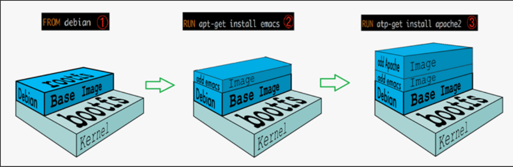
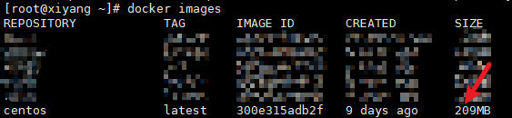
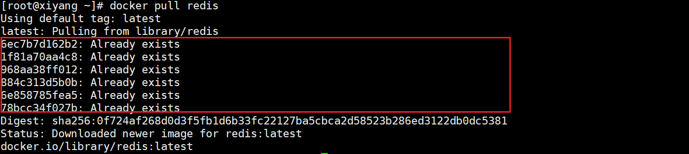
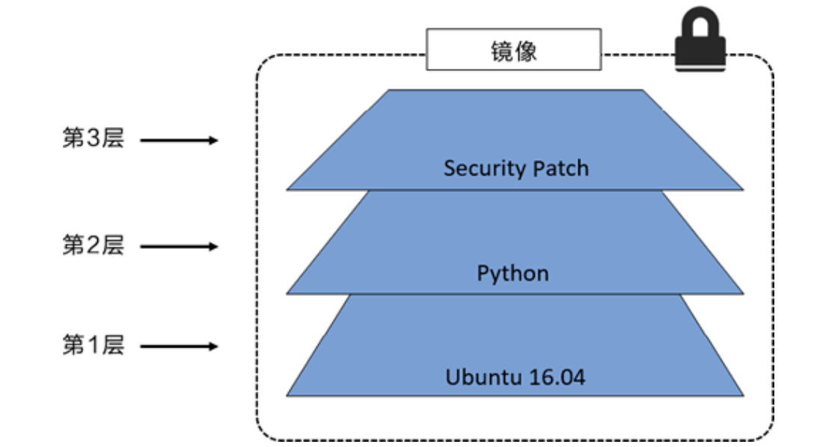
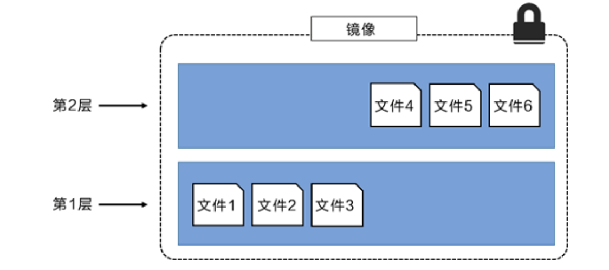
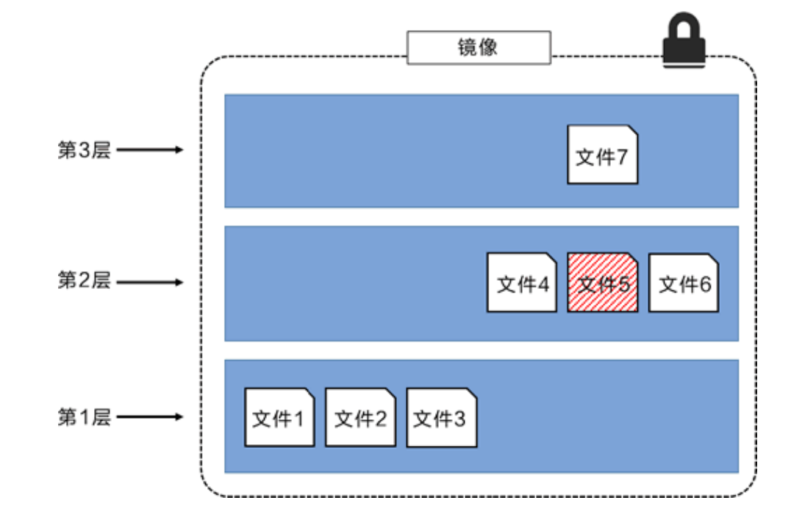
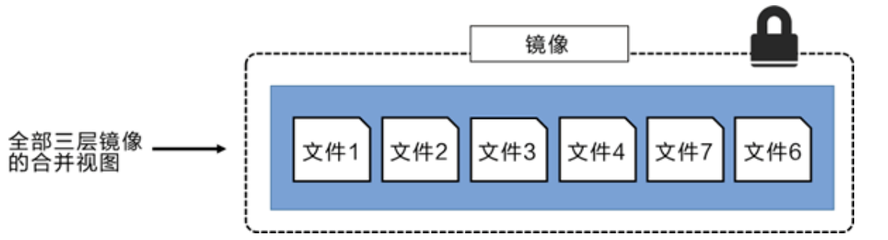

# Docker镜像

## 1. 镜像是什么

镜像是一种轻量级、可执行的独立软件包，用来打包软件运行环境和基于运行环境开发的软件，它包含运行某个软件所需的所有内容，包括代码、运行时、库、环境变量和配置文件。

**所有的应用，直接打包docker镜像，就可以直接跑起来！**


## 2. Docker镜像加载原理

### 2.1 UnionFS （联合文件系统）

UnionFS（联合文件系统）：Union文件系统（UnionFS）是一种分层、轻量级并且高性能的文件系统，它支持对文件系统的修改作为一次提交来一层层的叠加，同时可以将不同目录挂载到同一个虚拟文件系统下(unite several directories into a single virtual fifilesystem)。Union 文件系统是 Docker 镜像的基础。镜像可以通过分层来进行继承，基于基础镜像（没有父镜像），可以制作各种具体的应用镜像。

特性：一次同时加载多个文件系统，但从外面看起来，只能看到一个文件系统，联合加载会把各层文件系统叠加起来，这样最终的文件系统会包含所有底层的文件和目录

### 2.2 Docker镜像加载原理

docker的镜像实际上由一层一层的文件系统组成，这种层级的文件系统UnionFS。bootfs(boot fifile system)主要包含bootloader和kernel, bootloader主要是引导加载kernel, Linux刚启动时会加载bootfs文件系统，在Docker镜像的最底层是bootfs。这一层与我们典型的Linux/Unix系统是一样的，包含boot加载器和内核。当boot加载完成之后整个内核就都在内存中了，此时内存的使用权已由bootfs转交给内核，此时系统也会卸载bootfs。 rootfs (root fifile system) ，在bootfs之上。包含的就是典型 Linux 系统中的 /dev, /proc, /bin, /etc 等标准目录和文件。rootfs就是各种不同的操作系统发行版，比如Ubuntu，Centos等等。



平时我们安装进虚拟机的CentOS都是好几个G，为什么Docker这里才200M？



对于一个精简的OS，rootfs 可以很小，只需要包含最基本的命令，工具和程序库就可以了，因为底层直接用Host的kernel，自己只需要提供rootfs就可以了。由此可见对于不同的linux发行版, bootfs基本是一致的, rootfs会有差别, 因此不同的发行版可以公用bootfs。 

## 3. 分层理解

### 3.1 分层的镜像

#### 3.1.1 分层的表现

我们可以去下载一个镜像，注意观察下载的日志输出，可以看到是一层一层的在下载！



思考: 为什么Docker镜像要采用这种分层的结构呢？

最大的好处: 在于是资源共享了,比如有多个镜像都从相同的Base镜像构建而来，那么宿主机只需在磁盘上保留一份base镜像，同时内存中也只需要加载一份base镜像，这样就可以为所有的容器服务了，而且镜像的每一层都可以被共享。

查看镜像分层的方式可以通过 `docker image inspect `命令！

```shell
[root@xiyang ~]# docker image inspect redis:latest
[
    {
        "Id": "sha256:ef47f3b6dc11e8f17fb39a6e46ecaf4efd47b3d374e92aeb9f2606896b751251",
        "RepoTags": [
            "redis:latest"
        ],
        "RepoDigests": [
            "redis@sha256:0f724af268d0d3f5fb1d6b33fc22127ba5cbca2d58523b286ed3122db0dc5381"
        ],
        "Parent": "",
        "Comment": "",
        "Created": "2020-12-11T16:25:00.990749243Z",
        "Container": "6da61e8ec8c774f324d488c6047bd913d6f379855b7abcb08be9f41acee6e3ab",
        "ContainerConfig": {
            "Hostname": "6da61e8ec8c7",
            "Domainname": "",
            "User": "",
            "AttachStdin": false,
            "AttachStdout": false,
            "AttachStderr": false,
            "ExposedPorts": {
                "6379/tcp": {}
            },
            "Tty": false,
            "OpenStdin": false,
            "StdinOnce": false,
            "Env": [
                "PATH=/usr/local/sbin:/usr/local/bin:/usr/sbin:/usr/bin:/sbin:/bin",
                "GOSU_VERSION=1.12",
                "REDIS_VERSION=6.0.9",
                "REDIS_DOWNLOAD_URL=http://download.redis.io/releases/redis-6.0.9.tar.gz",
                "REDIS_DOWNLOAD_SHA=dc2bdcf81c620e9f09cfd12e85d3bc631c897b2db7a55218fd8a65eaa37f86dd"
            ],
            "Cmd": [
                "/bin/sh",
                "-c",
                "#(nop) ",
                "CMD [\"redis-server\"]"
            ],
            "Image": "sha256:d9311f71736ce563d01280a6cc23530a3f838f6f6c4c245b2b99919594b67b7b",
            "Volumes": {
                "/data": {}
            },
            "WorkingDir": "/data",
            "Entrypoint": [
                "docker-entrypoint.sh"
            ],
            "OnBuild": null,
            "Labels": {}
        },
        "DockerVersion": "19.03.12",
        "Author": "",
        "Config": {
            "Hostname": "",
            "Domainname": "",
            "User": "",
            "AttachStdin": false,
            "AttachStdout": false,
            "AttachStderr": false,
            "ExposedPorts": {
                "6379/tcp": {}
            },
            "Tty": false,
            "OpenStdin": false,
            "StdinOnce": false,
            "Env": [
                "PATH=/usr/local/sbin:/usr/local/bin:/usr/sbin:/usr/bin:/sbin:/bin",
                "GOSU_VERSION=1.12",
                "REDIS_VERSION=6.0.9",
                "REDIS_DOWNLOAD_URL=http://download.redis.io/releases/redis-6.0.9.tar.gz",
                "REDIS_DOWNLOAD_SHA=dc2bdcf81c620e9f09cfd12e85d3bc631c897b2db7a55218fd8a65eaa37f86dd"
            ],
            "Cmd": [
                "redis-server"
            ],
            "Image": "sha256:d9311f71736ce563d01280a6cc23530a3f838f6f6c4c245b2b99919594b67b7b",
            "Volumes": {
                "/data": {}
            },
            "WorkingDir": "/data",
            "Entrypoint": [
                "docker-entrypoint.sh"
            ],
            "OnBuild": null,
            "Labels": null
        },
        "Architecture": "amd64",
        "Os": "linux",
        "Size": 104252176,
        "VirtualSize": 104252176,
        "GraphDriver": {
            "Data": {
                "LowerDir": "/var/lib/docker/overlay2/bee07b9eefc7220ed126cf5bb8f6a5b55364b27a84173d4684d8f4f49687296d/diff:/var/lib/docker/overlay2/e0db0ca85805e0edd2e461e090ffda1ac56ecd3a1007cb5a8223e881c20cc3b6/diff:/var/lib/docker/overlay2/f893e55e0378bc0c5a3ee4bfe92ea8b9388fba527d103e623ec33fddb090830c/diff:/var/lib/docker/overlay2/20132b2bdad979a6fdbd283071d85e0186d83df0ff329b74fa0d8b3f12b79b0d/diff:/var/lib/docker/overlay2/42b6ba498107f8a325fe75832be5dc05b92bd68b44e0d0e6bb4f3c3c7e971326/diff",
                "MergedDir": "/var/lib/docker/overlay2/d23a201a818742f5c2173ff6fcab624da90cf16ee00d8ad1ea744892f1c216e9/merged",
                "UpperDir": "/var/lib/docker/overlay2/d23a201a818742f5c2173ff6fcab624da90cf16ee00d8ad1ea744892f1c216e9/diff",
                "WorkDir": "/var/lib/docker/overlay2/d23a201a818742f5c2173ff6fcab624da90cf16ee00d8ad1ea744892f1c216e9/work"
            },
            "Name": "overlay2"
        },
        "RootFS": {
            "Type": "layers",
            "Layers": [
                "sha256:87c8a1d8f54f3aa4e05569e8919397b65056aa71cdf48b7f061432c98475eee9",
                "sha256:25075874ce886bd3adb3b75298622e6297c3f893e169f18703019e4abc8f13f0",
                "sha256:caafc8119413c94f1e4b888128e2f337505fb57e217931a9b3a2cd7968340a9e",
                "sha256:e5d940a579ec4a80b6ec8571cb0fecf640dba14ccfd6de352977fd379a254053",
                "sha256:2a1c28c532d20c3b8af8634d72a4d276a67ce5acb6d186ac937c13bd6493c972",
                "sha256:1540b8226044ed5ce19cc0fec7fbfb36a00bb15f4e882d6affbd147a48249574"
            ]
        },
        "Metadata": {
            "LastTagTime": "0001-01-01T00:00:00Z"
        }
    }
]
```

#### 3.1.2 分层的原理分析

所有的 Docker 镜像都起始于一个基础镜像层，当进行修改或增加新的内容时，就会在当前镜像层之上，创建新的镜像层。

举一个简单的例子，假如基于 Ubuntu Linux 16.04 创建一个新的镜像，这就是新镜像的第一层；如果在该镜像中添加 Python包，就会在基础镜像层之上创建第二个镜像层；如果继续添加一个安全补丁，就会创建第三个镜像层。

该镜像当前已经包含 3 个镜像层，如下图所示（这只是一个用于演示的很简单的例子）。



在<u>添加额外的镜像层的同时，镜像始终保持是当前所有镜像的组合</u>，理解这一点非常重要。

下图中举了一个简单的例子，每个镜像层包含 3 个文件，而镜像包含了来自两个镜像层的 6 个文件。



上图中的镜像层跟之前图中的略有区别，主要目的是便于展示文件。

下图中展示了一个稍微复杂的三层镜像，在外部看来整个镜像只有 6 个文件，这是因为最上层中的文件7 是文件 5 的一个更新版本。



这种情况下，上层镜像层中的文件覆盖了底层镜像层中的文件。这样就使得文件的更新版本作为一个新镜像层添加到镜像当中。

<u>Docker 通过存储引擎（新版本采用快照机制）的方式来实现镜像层堆栈</u>，并保证多镜像层对外展示为统一的文件系统。

Linux 上可用的存储引擎有 AUFS、Overlay2、Device Mapper、Btrfs 以及 ZFS。顾名思义，每种存储引擎都基于 Linux 中对应的文件系统或者块设备技术，并且每种存储引擎都有其独有的性能特点。

Docker 在 Windows 上仅支持 windowsfifilter 一种存储引擎，该引擎基于 NTFS 文件系统之上实现了分层和 CoW[1]。

下图展示了与系统显示相同的三层镜像。所有镜像层堆叠并合并，对外提供统一的视图。



### 3.2 特点

- Docker镜像都是只读的，当容器启动时，一个新的可写层被加载到镜像的顶部！
- 这一层就是我们通常说的容器层，容器之下的都叫镜像层！

## 4. 镜像Commit

*docker commit 从容器创建一个新的镜像。*

```shell
docker commit 提交容器副本使之成为一个新的镜像！ 
# 语法 
docker commit -m="提交的描述信息" -a="作者" 容器id 要创建的目标镜像名:[标签名]
```

```shell
# 测试


```


