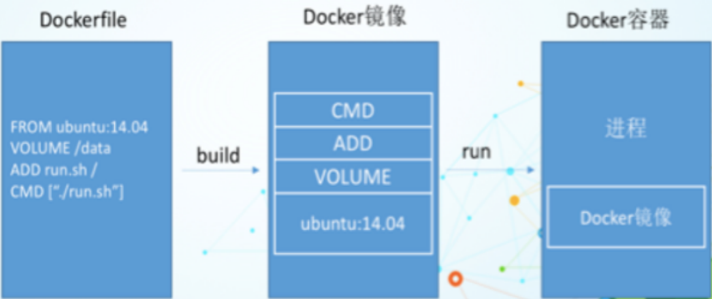
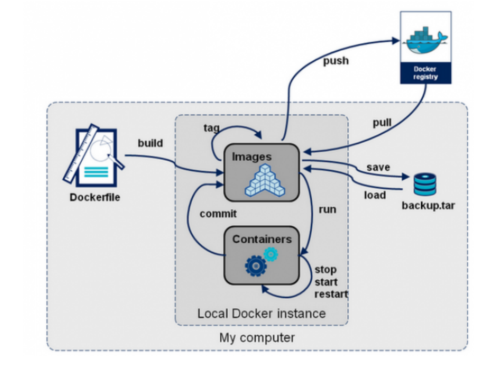

# DockerFile

大家想想，Nginx，tomcat，mysql 这些镜像都是哪里来的？官方能写，我们不能写吗？

我们要研究自己如何做一个镜像，而且我们写的微服务项目以及springboot打包上云部署，Docker就是最方便的。

微服务打包成镜像，任何装了Docker的地方，都可以下载使用，极其的方便。

流程：开发应用=>DockerFile=>打包为镜像=>上传到仓库（私有仓库，公有仓库）=> 下载镜像 => 启动运行。

还可以方便移植！

## 1. 什么是DockerFile

dockerfifile是用来构建Docker镜像的构建文件，是由一系列命令和参数构成的脚本。

构建步骤：

1、编写DockerFile文件

2、docker build 构建镜像

3、docker run

dockerfifile文件我们刚才已经编写过了一次，这里我们继续使用 centos 来看！

地址：https://hub.docker.com/_/centos


## 2. DockerFile构建过程

**基础知识**

1、每条保留字指令都必须为大写字母且后面要跟随至少一个参数

2、指令按照从上到下，顺序执行

3、# 表示注释

4、每条指令都会创建一个新的镜像层，并对镜像进行提交

**流程：**

1、docker从基础镜像运行一个容器

2、执行一条指令并对容器做出修改

3、执行类似 docker commit 的操作提交一个新的镜像层

4、Docker再基于刚提交的镜像运行一个新容器

5、执行dockerfifile中的下一条指令直到所有指令都执行完成！

**说明：**

从应用软件的角度来看，DockerFile，docker镜像与docker容器分别代表软件的三个不同阶段。

DockerFile 是软件的原材料 （代码）

Docker 镜像则是软件的交付品 （.apk）

Docker 容器则是软件的运行状态 （客户下载安装执行）

DockerFile 面向开发，Docker镜像成为交付标准，Docker容器则涉及部署与运维，三者缺一不可！



**DockerFile**：需要定义一个DockerFile，DockerFile定义了进程需要的一切东西。DockerFile涉及的内容包括执行代码或者是文件、环境变量、依赖包、运行时环境、动态链接库、操作系统的发行版、服务进程和内核进程（当引用进行需要和系统服务和内核进程打交道，这时需要考虑如何设计 namespace的权限控制）等等。

**Docker镜像**：在DockerFile 定义了一个文件之后，Docker build 时会产生一个Docker镜像，当运行Docker 镜像时，会真正开始提供服务；

**Docker容器**：容器是直接提供服务的。

## 3. DockerFile指令

```shell
FROM # 基础镜像，当前新镜像是基于哪个镜像的 
MAINTAINER # 镜像维护者的姓名混合邮箱地址 
RUN # 容器构建时需要运行的命令 
EXPOSE # 当前容器对外保留出的端口 
WORKDIR # 指定在创建容器后，终端默认登录的进来工作目录，一个落脚点 
ENV # 用来在构建镜像过程中设置环境变量 
ADD # 将宿主机目录下的文件拷贝进镜像且ADD命令会自动处理URL和解压tar压缩包 
COPY # 类似ADD，拷贝文件和目录到镜像中！ 
VOLUME # 容器数据卷，用于数据保存和持久化工作 
CMD # 指定一个容器启动时要运行的命令，dockerFile中可以有多个CMD指令，但只有最 后一个生效！ 
ENTRYPOINT # 指定一个容器启动时要运行的命令！和CMD一样 
ONBUILD # 当构建一个被继承的DockerFile时运行命令，父镜像在被子镜像继承后，父镜像的 ONBUILD被触发
```


## 4. 实战测试

*Docker Hub 中99% 的镜像都是通过在base镜像（Scratch）中安装和配置需要的软件构建出来的*

### 4.1 自定义一个 centos

### 4.2 CMD 和 ENTRYPOINT 的区别

### 4.3 自定义镜像 tomcat

## 5. 发布镜像

### 5.1 DockerHub


### 5.2 阿里云镜像服务


## 6. DockerFile总结

