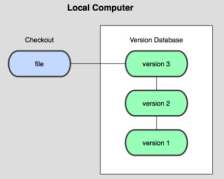
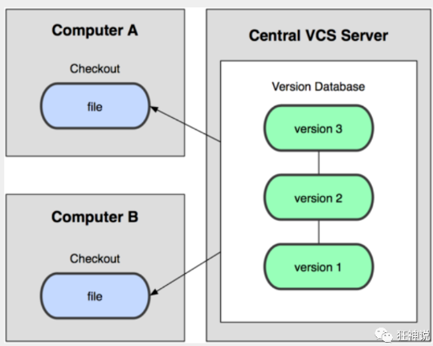

[TOC]

# 版本控制入门

## 1. 什么是版本控制

1. 版本控制是一种在开发过程中用于管理我们对文件丶目录或工程内容的修改历史,方便查看更改历史记录,备份以便恢复以前的版本的软件工程技术

2. 版本控制可以用于管理多人协同开发项目的技术

3. 如图: 版本控制修改历史

   

## 2. 常见的版本控制工具介绍

> git     svn     cvs     vss     TFS

重点GIT  SVN


## 3. 版本控制分类

### 3.1 本地版本控制

> 适合个人使用,例如RCS  记录文件每次的更新,可以对每个版本做一个快照,或是记录补丁文件,适合个人使用;



### 3.2 集中式版本控制

> 所有的版本更改数据都保存在同一个服务器上,个人是没有版本控制信息的,所有的版本控制信息都在远程服务器上
>
> 缺点:
>
> - 用户的本地只有自己以前所同步的版本，如果不连网的话，用户就看不到历史版本
> - 无法切换版本验证问题，或在不同分支工作
> - 所有数据都保存在单一的服务器上，有很大的风险这个服务器会损坏，这样就会丢失所有的数据，当然可以定期备份



### 3.3 分布式版本控制

> 所有授权的人都拥有全部代码


## 4. GIT和SVN的区别

- **SVN是集中式版本控制系统**，版本库是集中放在中央服务器的，而工作的时候，用的都是自己的电脑，所以首先要从中央服务器得到最新的版本，然后工作，完成工作后，需要把自己做完的活推送到中央服务器。
- **Git是分布式版本控制系统**，没有中央服务器，每个人的电脑就是一个完整的版本库，工作的时候不需要联网了，因为版本都在自己电脑上。协同的方法是这样的：比如说自己在电脑上改了文件A，其他人也在电脑上改了文件A，这时，你们两之间只需把各自的修改推送给对方，就可以互相看到对方的修改了


## 5. git的下载安装

> 淘宝镜像: http://npm.taobao.org/mirrors/git-for-windows/

任意文件夹右键都有如下,一般使用linux模式命令,效率高,安装git后他会自动配置环境变量,如果需要删除就需要删除环境变量!!


## 6. 常用linux命令

> 如上,支持linux的vi命令,所以可以使用一些常用的linux命令

| 指令        | 含义                                                         |
| ----------- | ------------------------------------------------------------ |
| cd 目录名称 | 进入指定目录名称的目录,如果直接`cd` 可进入默认目录`~`        |
| cd ..       | 回到上级目录                                                 |
| pwd         | 显示当前所在的文件路径                                       |
| `ls(ll)`    | 查看当前目录中的所有文件,如果添加了ll文件信息会更详细 注意:不同的文件类型使用颜色去区分的 |
| `touch`     | 创建一个文件,例如创建一个index.html文件touch index.html      |
| `rm`        | 删除一个文件,例如删除刚创建的index.html文件rm index.html     |
| `mkdir`     | 新建一个目录,新建一个目录A <u>mkdir 目录A</u>                |
| `rm -r`     | 删除一个目录,例如删除目录A可使用 <u>rm -r 目录A</u>          |
| `mv`        | 移动目录中的文件,例如将目录A中的file.txt文件移动到目录B中 mv |
| reset       | 效果和reset一样都是用来清屏的                                |
| clear       | linux中清屏可使用clear                                       |
| history     | 查看前面写了哪些命令                                         |
| help        | linuc帮着命令                                                |
| #           | 注释                                                         |
| exit        | 退出                                                         |

## 7. Git配置

7.1 查看所有配置的命令

```visual basic
git config -l
```

7.2 查看不同级别的配置文件

```shell
# 查看系统配置命令
git config --system --list
# 查看用户配置命令
git config --global --list
```

7.3 配置用户名和email(必要)

安装git后的第一步就是设置用户名和email地址,每次提交都会使用这个信息,它会永远的嵌入到提交中

```shell
# 配置用户名
git config --global user.name "黎秦赭"
# 配置邮箱
git config --global user.email "CodeXiYang@163.com"
# 查看配置新
$ git config --global --list
user.name=黎秦赭
user.email=CodeXiYang@163.com
```


7.4 查看本地配置文件


