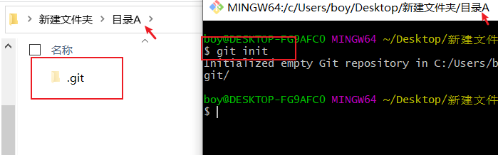
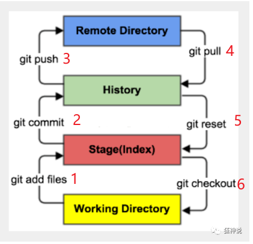
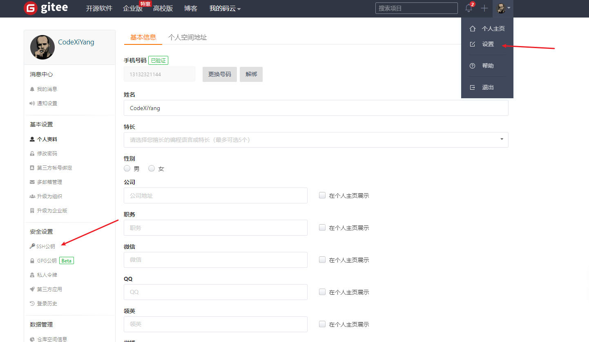
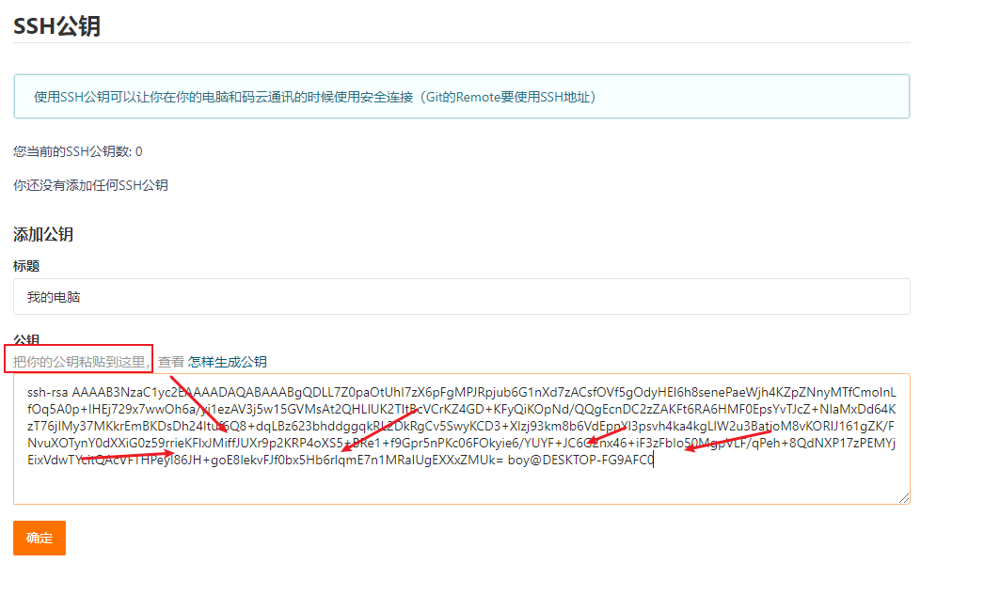
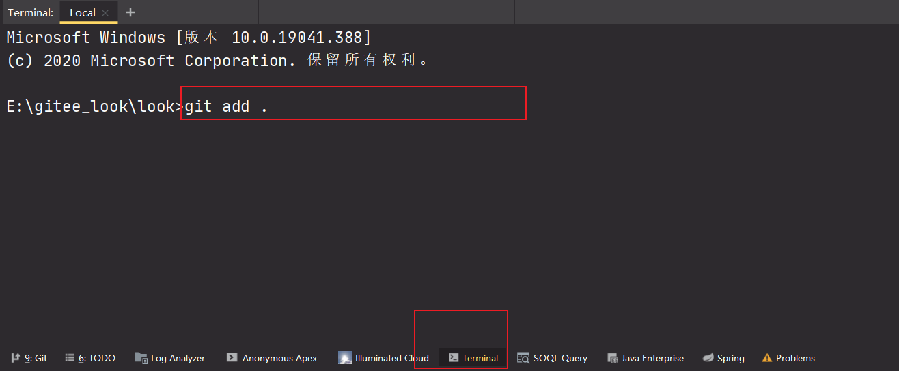

#  GIT基本操作


## 1. git操作本地仓库

### 1.1 创建一个本地仓库

可以使用`git init`创建一个本地仓库



这时候这个目录A就是一个本地仓库

### 1.2 git分为4个区域

- 工作区: 平时编写代码的地方(除开.git外的区域)
- 暂缓区: 用于临时存放你的改动，事实上它只是一个文件，保存即将提交到文件列表信息
- 仓库区: 仓库区（或本地仓库），就是安全存放数据的位置，这里面有你提交到所有版本的数据。其中HEAD指向最新放入仓库的版本
- 远程仓库: 托管代码的服务器，可以简单的认为是你项目组中的一台电脑用于远程数据交换



### 1.3 git工作流程

1. 在工作区修改文件
2. 将需要进行管理的文件添加到暂缓区`git add .`
3. 将暂缓去中的文件提交到本地仓库`git commit -m"提交信息"`

### 1.3 git管理文件的三种状态

通过git的工作流程可以知道git管理的文件有三种状态,**已修改,已暂存,已提交**可以通过`git status`查看;不同的状态的文件有不同颜色;touch index.html创建一个文件进行如下测试


## 2. git操作远程仓库

我们可以在本地操作远程仓库,远程仓库有github和gitee...但是gitee国内的比较快

### 2.1  注册gitee账号创建一个仓库


- 公开的,任何人都可以访问
- 私有的,只有自己或者授权的人可以访问


### 2.2 .gitignore和README.md

- .gitignore文件是用来设定你想提交哪些东西,不想提交哪些东西的

  ```bash
  # 不想提交所有的jar和war
  !*.war
  !*.jar
  # 一般的不管是前端项目还是后端sringboot项目创建的时候都有这个玩意
  
  # 一个很香的网站;会自动生成一些你当前环境的配置,copy就完事了
  	# https://gitignore.io/
  ```

- README.md是用来介绍你这个项目的一些信息的,也可以将个人简历写上去,面试的时候装逼的丢个链接上去(你需要会使用markdown语法才行)

### 2.3 克隆远程仓库的地址

使用`git clone [url]`

这时候这个Demo就是远程仓库了


然后我们就可以使用前面使用过的操作本地仓库的那3个命令了;增加一个新的命令就是每次先git pull一次,拉取最新的信息

```bash
# 拉取远程仓库最新的信息到本地厂库
git pull
# 将工作区的代码提交到暂缓区
git add . 

# 将暂缓区的代码提交到缓存区
git commit -m"提交"

# 将缓存区中的代码提交到远程仓库
git push
```

**ps: 上面4个命令基本上就是万年命令,常用操作,感觉不太复杂的开发模式这3个基本够用!!复杂的开发模式需要使用分支模型**


小故事理解这几个命令

```txt
	又是周一了,某公司开始了一个新的项目;项目经理在远程仓库以及把厂库创建好了,给小王分配了开发权限,地址是xxx;小王打开电脑进入平时编写代码的文件夹下;使用git clone xxx将项目克隆下来,然后开始写代码...,到了晚上11点,使用git add .将代码提交到暂缓区,然后使用git commit -m"写了个hello word"将暂存区中的代码提交到了缓存区,最后git push到了远程厂库...关电脑下班回家...12点,小李也push了代码
	到了第二天,小王打开电脑,首先git pull,将项目拉取到本地(因为小李也提交了)为了保证最新代码,需要拉取最新项目,顺便还可以瞅瞅小李写的代码如何,然后摸了一天的鱼,写了2个hello word,然后git add . == git commit -m"提交"  == git push一顿操作,然后下班回家...
	到了第三天,小王被开除了.....
```

### 2.4 ssh

我们在执行git clone命令的时候,这里是有两种命令的一种是https的地址,一种是ssh的地址


如果是使用了https的地址,你进行提交的时候会每次输入用户名和密码,麻烦

#### 2.4.1 ssh的好处

在于你配置后,就是免登陆的,你推送(git push)可以不用输入密码,因为你的电脑已经和远程的仓库关联了

#### 2.4.2 配置ssh

1. 生成公钥`ssh-keygen -t rsa`

   输入这个命令后3次回车完事,出现那个方块图就ok

   

2. 命令查看公钥`cat ~/.ssh/id_rsa.pub`

   

3. 打开文件查看

   

4. 将公钥配置到gitee

   

   

5. 进行愉快的操作就不用频繁的输入用户名和密码了

   


## 3. idea中使用git

3.1 idea中集成了git的,不喜欢使用命令的手残党福利,不过我不是手残党,点点点就完事


第一个拉取,第二个提交并推送到远程仓库(不喜欢这种方式..)

3.2 可以在idea中提供的命令行进行操作就是上面那几个万年git操作..



## 6. git分支

我们之前的所有操作就是在master(主分支上的)可以切换到其他分支进行开发;分支模型还没使用到过,等使用完后在来补充下!

常用命令如下:

```bash

# 列出所有本地分支
git branch

# 列出所有远程分支
git branch -r

# 新建一个分支，但依然停留在当前分支
git branch [branch-name]

# 新建一个分支，并切换到该分支
git checkout -b [branch]

# 合并指定分支到当前分支
$ git merge [branch]

# 删除分支
$ git branch -d [branch-name]

# 删除远程分支
$ git push origin --delete [branch-name]
$ git branch -dr [remote/branch]
```

## 7. git命令学习

马云上有的亲.....


<span style="font-size:40px">git基本使用完结撒花!</span>

<span style="font-size:40px">2020年7月31日00:49:41</span>


## 拓展笔记

1. 查看当前仓库的大小

   ```bash
   git count-objects -vH
   ```

   

2. 当远程仓库的代码发生变化后进行强制更新到本地

   ```bash
   E:\魔法森林科技有限公司\device-admin>git fetch --all  #强制更新所有
   Fetching origin
   
   E:\魔法森林科技有限公司\device-admin>git reset --hard origin/develop #重定向到本地仓库的develop分支
   HEAD is now at e24fdf8 Delete 新建文本文档.txt
   
   E:\魔法森林科技有限公司\device-admin>git pull origin/develop 
   fatal: 'origin/develop' does not appear to be a git repository
   fatal: Could not read from remote repository.
   
   Please make sure you have the correct access rights
   and the repository exists.
   
   E:\魔法森林科技有限公司\device-admin>git pull #刷新
   Already up to date.
   ```

   