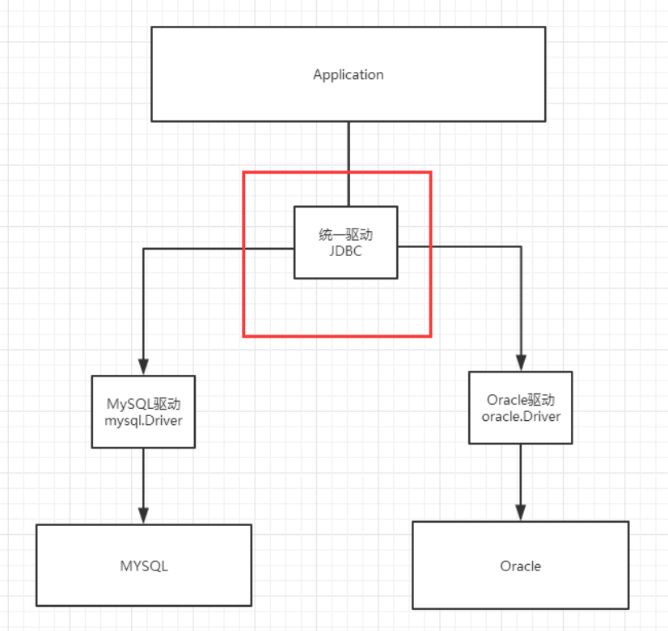

# JDBC

## 1. 什么是JDBC

*什么是JDBC ： Java连接数据库！*



## 2. 实验环境搭建

*需要的jar包*

- java.sql
- javax.sql
- mysql-conneter-java… 连接驱动（必须要导入）

### 2.1 需要的数据库

```sql
CREATE TABLE users( 
    id INT PRIMARY KEY, 
    `name` VARCHAR(40), 
    `password` VARCHAR(40), 
    email VARCHAR(60), 
    birthday DATE 
);
INSERT INTO users(id,`name`,`password`,email,birthday) VALUES(1,'张三','123456','zs@qq.com','2000-01-01'); 
INSERT INTO users(id,`name`,`password`,email,birthday) VALUES(2,'李四','123456','ls@qq.com','2000-01-01'); 
INSERT INTO users(id,`name`,`password`,email,birthday) VALUES(3,'王五','123456','ww@qq.com','2000-01-01'); 
SELECT * FROM users;
```

### 2.2 导入数据库依赖

```xml
<!--mysql的驱动--> 
<dependency>
    <groupId>mysql</groupId> 
    <artifactId>mysql-connector-java</artifactId> 
    <version>5.1.47</version>
</dependency>
```

2.3 IDEA中连接数据库


## 3. JDBC相关操作


### 3.1 JDBC固定步骤

1. 加载驱动
2. 连接数据库,代表数据库
3. 向数据库发送SQL的对象Statement : CRUD
4. 编写SQL （根据业务，不同的SQL） 5. 执行SQL
6. 关闭连接

```java
public class TestJdbc { 
    public static void main(String[] args) throws ClassNotFoundException, SQLException { 
        //配置信息 
        //useUnicode=true&characterEncoding=utf-8 解决中文乱码 
        String url="jdbc:mysql://localhost:3306/jdbc? useUnicode=true&characterEncoding=utf-8"; 
        String username = "root"; 
        String password = "123456";
        //1.加载驱动 
        Class.forName("com.mysql.jdbc.Driver");
        //2.连接数据库,代表数据库
        Connection connection = DriverManager.getConnection(url, username, password);
        //3.向数据库发送SQL的对象Statement,PreparedStatement : CRUD 
        Statement statement = connection.createStatement(); 
        //4.编写SQL 
        String sql = "select * from users"; 
        //5.执行查询SQL，返回一个 ResultSet ： 结果集 
        ResultSet rs = statement.executeQuery(sql);
        while (rs.next()){ 
            System.out.println("id="+rs.getObject("id")); 
            System.out.println("name="+rs.getObject("name")); 
            System.out.println("password="+rs.getObject("password")); 
            System.out.println("email="+rs.getObject("email")); 
            System.out.println("birthday="+rs.getObject("birthday")); 
        }
        //6.关闭连接，释放资源（一定要做） 先开后关 
        rs.close(); 
        statement.close();
        connection.close();
    } 
}
```


### 3.2 预编译SQL

```java
public class TestJDBC2 { 
    public static void main(String[] args) throws Exception {
        //配置信息 
        //useUnicode=true&characterEncoding=utf-8 解决中文乱码
        String url="jdbc:mysql://localhost:3306/jdbc? useUnicode=true&characterEncoding=utf-8"; 
        String username = "root";
        String password = "123456";
        //1.加载驱动 
        Class.forName("com.mysql.jdbc.Driver"); 
        //2.连接数据库,代表数据库 
        Connection connection = DriverManager.getConnection(url, username, password);
        //3.编写SQL 
        String sql = "insert into users(id, name, password, email, birthday) values (?,?,?,?,?);"; 
        //4.预编译 
        PreparedStatement preparedStatement = connection.prepareStatement(sql); 
        preparedStatement.setInt(1,2);
        //给第一个占位符？ 的值赋值为1；
        preparedStatement.setString(2,"狂神说Java");
        //给第二个占位符？ 的值赋值为 狂神说Java；
        preparedStatement.setString(3,"123456");
        //给第三个占位符？ 的值赋值为 123456； 
        preparedStatement.setString(4,"24736743@qq.com");
        //给第四个占位符？ 的 值赋值为1；
        preparedStatement.setDate(5,new Date(new java.util.Date().getTime()));
        //给第五个占位符？ 的值赋值为new Date(new java.util.Date().getTime();
        //5.执行SQL 
        int i = preparedStatement.executeUpdate(); 
        if (i>0){ 
            System.out.println("插入成功@"); 
        }
        //6.关闭连接，释放资源（一定要做） 先开后关
        preparedStatement.close(); 
        connection.close();
    } 
}
```

### 3.3 事务

要么都成功，要么都失败！

ACID原则：保证数据的安全。

```
开启事务 事务提交 
commit() 事务回滚 
rollback() 关闭事务 
转账： 
	A:1000 
	B:1000 
	A(900) --100--> B(1100)
```


## 4. junit单元测试

### 4.1 依赖

```xml
<!--单元测试--> 
<dependency> 
    <groupId>junit</groupId>
    <artifactId>junit</artifactId>
    <version>4.12</version> 
</dependency>
```

### 4.2 简单使用

@Test注解只有在方法上有效，只要加了这个注解的方法，就可以直接运行！

```java
@Test
public void test(){ 
    System.out.println("Hello");
}
```

### 4.3 搭建一个环境

```sql
CREATE TABLE account(
    id INT PRIMARY KEY AUTO_INCREMENT, 
    `name` VARCHAR(40),
    money FLOAT 
);

INSERT INTO account(`name`,money) VALUES('A',1000); 
INSERT INTO account(`name`,money) VALUES('B',1000);
INSERT INTO account(`name`,money) VALUES('C',1000);
```


### 4.4 测试

```java
@Test
public void test() { 
    //配置信息 
    //useUnicode=true&characterEncoding=utf-8 解决中文乱码 String url="jdbc:mysql://localhost:3306/jdbc? useUnicode=true&characterEncoding=utf-8"; 
    String username = "root"; 
    String password = "123456"; 
    Connection connection = null; 
    //1.加载驱动 
    try {
        Class.forName("com.mysql.jdbc.Driver"); 
        //2.连接数据库,代表数据库 
        connection = DriverManager.getConnection(url, username, password);
        //3.通知数据库开启事务,false 开启 
        connection.setAutoCommit(false); 
        String sql = "update account set money = money-100 where name = 'A'"; 
        connection.prepareStatement(sql).executeUpdate();
        //制造错误
        //int i = 1/0; 
        String sql2 = "update account set money = money+100 where name = 'B'"; 
        connection.prepareStatement(sql2).executeUpdate(); connection.commit();
        //以上两条SQL都执行成功了，就提交事务！ 
        System.out.println("success"); 
    } catch (Exception e) { 
        try {
            //如果出现异常，就通知数据库回滚事务 
            connection.rollback();
        } catch (SQLException e1) {
            e1.printStackTrace();
        }e.printStackTrace(); 
    }finally { 
        try {
            connection.close();
        } catch (SQLException e) {
            e.printStackTrace(); 
        }
    }
}
```

