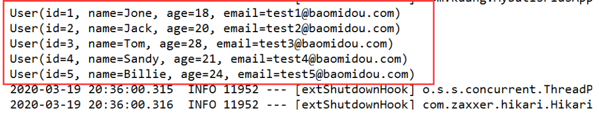

# MyBatis Plus快速入门

地址：https://mp.baomidou.com/guide/quick-start.html#初始化工程

使用第三方组件：

1、导入对应的依赖

2、研究依赖如何配置

3、代码如何编写

4、提高扩展技术能力！


## 1. MyBatisPlus使用步骤

1. 创建数据库` mybatis_plus `

2. 创建user表

   ```sql
   DROP TABLE IF EXISTS user; 
   CREATE TABLE user ( 
       id BIGINT(20) NOT NULL COMMENT '主键ID', 
       name VARCHAR(30) NULL DEFAULT NULL COMMENT '姓名', 
       age INT(11) NULL DEFAULT NULL COMMENT '年龄', 
       email VARCHAR(50) NULL DEFAULT NULL COMMENT '邮箱', 
       PRIMARY KEY (id) 
   );
   INSERT INTO user (id, name, age, email) VALUES 
   (1, 'Jone', 18, 'test1@baomidou.com'), 
   (2, 'Jack', 20, 'test2@baomidou.com'), 
   (3, 'Tom', 28, 'test3@baomidou.com'), 
   (4, 'Sandy', 21, 'test4@baomidou.com'), 
   (5, 'Billie', 24, 'test5@baomidou.com'); 
   -- 真实开发中，version（乐观锁）、deleted（逻辑删除）、gmt_create、gmt_modified
   ```

3. 编写项目，初始化项目！使用SpringBoot初始化！

4. 导入依赖

   ```xml
   <!-- 数据库驱动 --> 
   <dependency> 
       <groupId>mysql</groupId> 
       <artifactId>mysql-connector-java</artifactId> 
   </dependency> 
   <!-- lombok --> 
   <dependency> 
       <groupId>org.projectlombok</groupId> 
       <artifactId>lombok</artifactId> 
   </dependency> 
   <!-- mybatis-plus -->
   <!-- mybatis-plus 是自己开发，并非官方的！ --> 
   <dependency> <groupId>com.baomidou</groupId> 
       <artifactId>mybatis-plus-boot-starter</artifactId> 
       <version>3.0.5</version> 
   </dependency>
   ```

   说明：我们使用 mybatis-plus 可以节省我们大量的代码，尽量不要同时导入 mybatis 和 mybatis-plus！会有版本的差异！

5. 连接数据库！这一步和 mybatis 相同！

   ```properties
   # mysql 5 驱动不同 com.mysql.jdbc.Driver 
   # mysql 8 驱动不同com.mysql.cj.jdbc.Driver、需要增加时区的配置 serverTimezone=GMT%2B8 
   spring.datasource.username=root 
   spring.datasource.password=123456 
   spring.datasource.url=jdbc:mysql://localhost:3306/mybatis_plususeSSL=false&useUnicode=true&characterEncoding=utf-8&serverTimezone=GMT%2B8 
   spring.datasource.driver-class-name=com.mysql.cj.jdbc.Driver
   ```

   ps: 传统方式pojo-dao（连接mybatis，配置mapper.xml文件）-service-controller

6. 使用了mybatis-plus 之后

   POJO

   ```java
   @Data 
   @AllArgsConstructor 
   @NoArgsConstructor public class User { 
       private Long id; 
       private String name; 
       private Integer age; 
       private String email; 
   }
   ```

   mapper接口

   ```java
   package com.kuang.mapper; 
   import com.baomidou.mybatisplus.core.mapper.BaseMapper; 
   import com.kuang.pojo.User; 
   import org.springframework.stereotype.Repository; 
   // 在对应的Mapper上面继承基本的类 BaseMapper 
   @Repository // 代表持久层 
   public interface UserMapper extends BaseMapper<User> { 
       // 所有的CRUD操作都已经编写完成了 
       // 你不需要像以前的配置一大堆文件了！ 
   }
   ```

   注意点，我们需要在主启动类上去扫描我们的mapper包下的所有接口`@MapperScan("com.kuang.mapper")`

   测试类中测试

   ```java
   @SpringBootTest 
   class MybatisPlusApplicationTests { 
       // 继承了BaseMapper，所有的方法都来自己父类 
       // 我们也可以编写自己的扩展方法！
       @Autowired 
       private UserMapper userMapper;
       @Test void contextLoads() { 
           // 参数是一个 Wrapper ，条件构造器，这里我们先不用 null 
           // 查询全部用户 
           List<User> users = userMapper.selectList(null); 
           users.forEach(System.out::println);
       }
   }
   ```

   测试结果

   


## 2. 思考

1. SQL谁帮我们写的 ? 
   - MyBatis-Plus 都写好了
2. 方法哪里来的？ 
   - MyBatis-Plus 都写好了


## 3. 配置日志

*我们所有的sql现在是不可见的，我们希望知道它是怎么执行的，所以我们必须要看日志！*

```properties
# 配置日志 
mybatis-plus.configuration.log-impl=org.apache.ibatis.logging.stdout.StdOutImpl
```

配置完毕日志之后，后面的学习就需要注意这个自动生成的SQL，你们就会喜欢上 MyBatis-Plus！ 


