# MyBatis第一个程序

*思路流程：搭建项目(Maven项目)环境--> 导入Mybatis ---> 编写代码 ---> 测试*


## 1. 项目搭建

### 1.1 编写数据库

```sql
CREATE DATABASE `mybatis`; 
USE `mybatis`; 
DROP TABLE IF EXISTS `user`; 
CREATE TABLE `user` ( 
    `id` int(20) NOT NULL,
    `name` varchar(30) DEFAULT NULL, 
    `pwd` varchar(30) DEFAULT NULL, 
PRIMARY KEY (`id`) ) ENGINE=InnoDB DEFAULT CHARSET=utf8;
insert into `user`(`id`,`name`,`pwd`) values (1,'狂神','123456'),(2,'张 三','abcdef'),(3,'李四','987654');
```

### 1.2 新建一个普通的Maven项目

创建maven项目

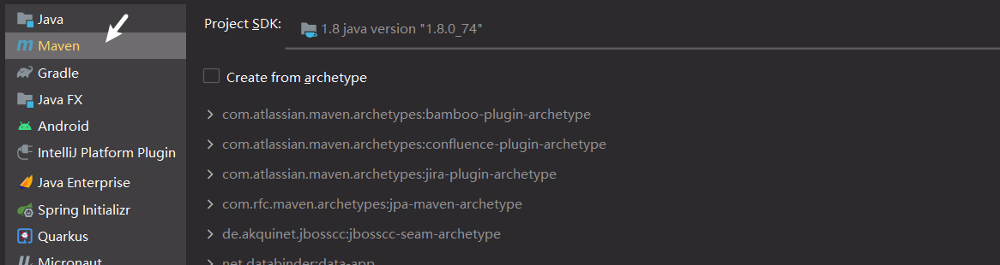

规定项目结构

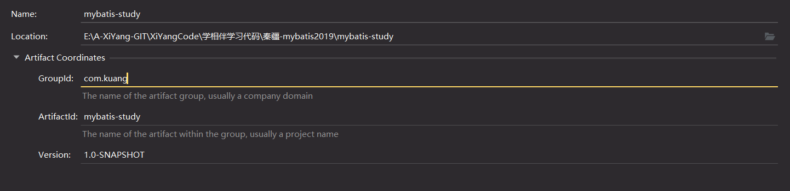

检查maven是自己的还是idea的

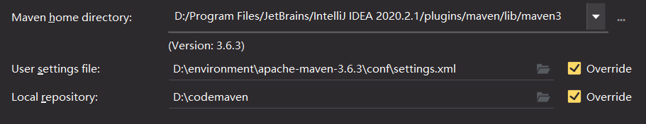

删除本项目的src目录,让此项目作为一个父工程


### 1.3  导入mybatis相关jar包

mybatis核心

```xml
<!--1. 导入mybatis依赖-->
<dependency>
    <groupId>org.mybatis</groupId>
    <artifactId>mybatis</artifactId>
    <version>3.5.2</version>
</dependency>
```

其他需要的包

```xml
<!--2. 使用mysql-->
<dependency>
    <groupId>mysql</groupId>
    <artifactId>mysql-connector-java</artifactId>
    <version>5.1.47</version>
</dependency>
<!--3. 使用测试的junit-->
<dependency>
    <groupId>junit</groupId>
    <artifactId>junit</artifactId>
    <version>4.12</version>
</dependency>
```


### 1.4  父项目下创建一个子项目

*在mybaits-study父工程下创建一个mybatis-01的子工程*

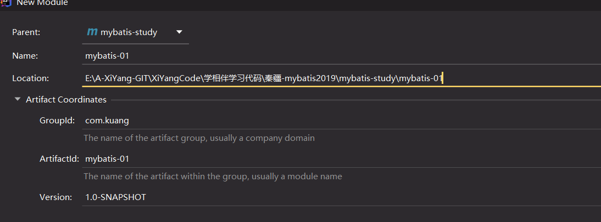

工程结构如下图

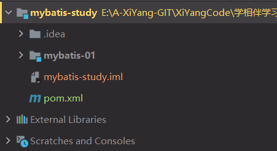


## 2. 代码编写

### 2.1  编写mybatis核心配置文件


*[官方文档](https://mybatis.org/mybatis-3/zh/getting-started.html)* 从 XML 中构建 SqlSessionFactory

*XML 配置文件中包含了对 MyBatis 系统的核心设置，包括获取数据库连接实例的数据源（DataSource）以及决定事务作用域和控制方式的事务管理器（TransactionManager）。后面会再探讨 XML 配置文件的详细内容，这里先给出一个简单的示例：*

**在mybatis-01的resources中创建一个mybatis-config.xml文件**

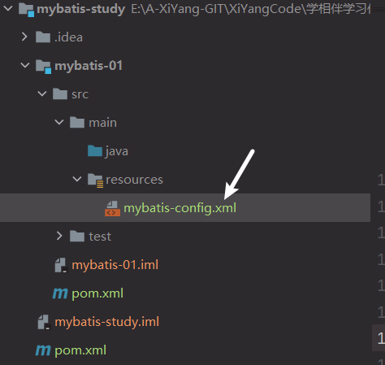

**xml文件如下配置**

```xml
<?xml version="1.0" encoding="UTF-8" ?>
<!DOCTYPE configuration
        PUBLIC "-//mybatis.org//DTD Config 3.0//EN"
        "http://mybatis.org/dtd/mybatis-3-config.dtd">
<!--configuration代表mybatis的核心配置文件-->
<configuration>
    <!--environments可以配置多套环境-->
    <environments default="development">
        <!--environment某一套环境,环境名通过id区分-->
        <environment id="development">
            <!--transactionManager事务管理-->
            <transactionManager type="JDBC"/>
            <!--dataSource数据源配置-->
            <dataSource type="POOLED">
                <property name="driver" value="com.mysql.jdbc.Driver"/>
                <property name="url" value="jdbc:mysql://localhost:3306/mybatis? useSSL=true&amp;useUnicode=true&amp;characterEncoding=utf8"/>
                <property name="username" value="root"/>
                <property name="password" value="1234"/>
            </dataSource>
        </environment>
    </environments>
    <mappers>
        <mapper resource="com/kuang/dao/userMapper.xml"/>
    </mappers>
</configuration>
```


### 2.2 编写mybatis工具类

- 每个基于 MyBatis 的应用都是以一个 SqlSessionFactory 的实例为核心的。
- SqlSessionFactory 的实例可以通过 SqlSessionFactoryBuilder 获得。
- 而 SqlSessionFactoryBuilder 则可以从 XML 配置文件或一个预先配置的 Configuration 实例来构建出 SqlSessionFactory 实例

**编写一个工具类**

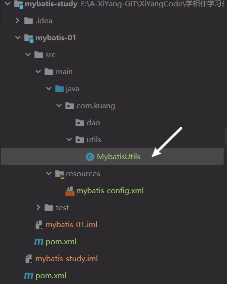


**工具类编写如下**

```java
public class MybatisUtils {
    private static SqlSessionFactory sqlSessionFactory;
    static {
        try {
            //1. mybatis核心配置的路径
            String resource = "mybatis-config.xml";
            //2. 通过流读取路径
            InputStream inputStream = Resources.getResourceAsStream(resource);
            //3. 通过SqlSessionFactoryBuilder构建sqlSessionFactory
            sqlSessionFactory = new SqlSessionFactoryBuilder().build(inputStream);
        } catch (IOException e) {
            e.printStackTrace();
        }
    }
    //获取SqlSession连接
    public static SqlSession getSession(){
        //4. 通过构建的sqlSessionFactory获取SqlSession.我们可以拿到SqlSession进行SQL语句的crud操作
        return sqlSessionFactory.openSession();
    }
}
```


### 2.3 创建实体类


```java
public class User {
    private int id; //id
    private String name; //姓名
    private String pwd; //密码
    public User() {
    }
    public User(int id, String name, String pwd) {
        this.id = id;
        this.name = name;
        this.pwd = pwd;
    }

    public int getId() {
        return id;
    }

    public void setId(int id) {
        this.id = id;
    }

    public String getName() {
        return name;
    }

    public void setName(String name) {
        this.name = name;
    }

    public String getPwd() {
        return pwd;
    }

    public void setPwd(String pwd) {
        this.pwd = pwd;
    }

    @Override
    public String toString() {
        return "User{" +
                "id=" + id +
                ", name='" + name + '\'' +
                ", pwd='" + pwd + '\'' +
                '}';
    }
}

```


### 2.4 编写mapper接口

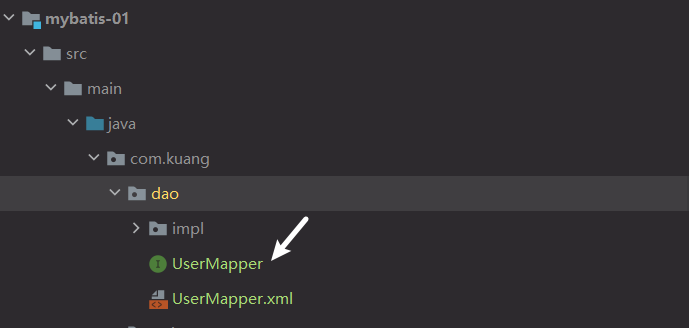

**编写如下**

```java
public interface UserMapper {
    List<User> getUserList();
}
```


### 2.5 编写mapper.xml文件

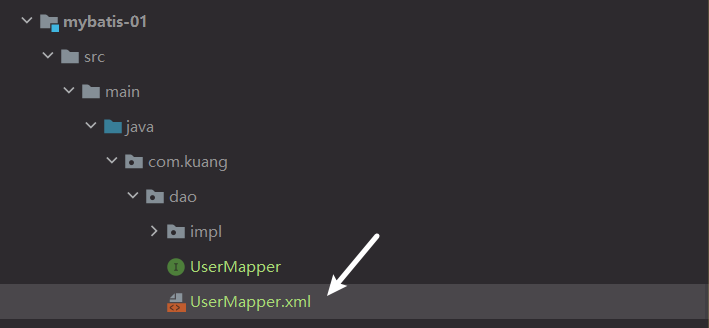

**编写userMapper.xml文件如下**

namespace 十分重要，不能写错！

```xml
<?xml version="1.0" encoding="UTF-8" ?>
<!DOCTYPE mapper
        PUBLIC "-//mybatis.org//DTD Mapper 3.0//EN"
        "http://mybatis.org/dtd/mybatis-3-mapper.dtd">
<!--namespace绑定一个对应的dao的mapper接口-->
<mapper namespace="com.kuang.dao.UserMapper">
    <!--
	id: 接口中的方法名
	resultType:返回的对象类型
	-->
    <select id="getUserList" resultType="com.kuang.pojo.User">
        SELECT * FROM mybatis.user
    </select>
</mapper>
```


### 2.6 编写测试类并运行测试

Junit 包测试

```java
public class MybatisTest {
    @Test
    public void test(){
        //1.通过工具类获取sqlsession
        SqlSession sqlSession = MybatisUtils.getSession();
        //2. 获取mapper接口
        UserMapper mapper = sqlSession.getMapper(UserMapper.class);
        //3. 调用接口中的方法
        List<User> userList = mapper.getUserList();
        //4. 遍历打印
        for (User user : userList) {
            System.out.println(user);
        }
        //5. 关闭sqlsession
        sqlSession.close();
    }
}
```

**测试结果如下:**

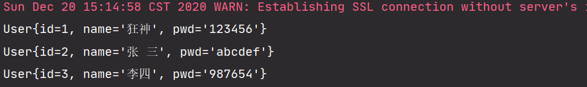


补充说明: *Maven静态资源过滤问题*

```xml
 <build>
        <!--maven静态资源过滤-->
        <resources>
            <resource>
                <directory>src/main/java</directory>
                <includes>
                    <include>**/*.properties</include>
                    <include>**/*.xml</include>
                </includes>
                <filtering>false</filtering>
            </resource>
            <resource>
                <directory>src/main/resources</directory>
                <includes>
                    <include>**/*.properties</include>
                    <include>**/*.xml</include>
                </includes>
                <filtering>false</filtering>
            </resource>
        </resources>
    </build>
```


## 3. 总结

**mybatis的执行流程**

1. 通过SqlSessionFactoryBuilder构建SqlSessionFactory
	- SqlSessionFactoryBuilder会调用build(流)找到核心xml配置文件
2. 通过SqlSessionFactory构建SqlSession
	- 通过调用sqlSessionFactory.openSession()可获取sqlsession
3. 拿到SqlSession可用于数据库的crud操作

**代码编写的步骤**

1. mybatis的核心配置文件mybatis-config.xml
2. 工具类的编写,用于获取sqlsession
3. 接口,用于提供方法
4. xml文件,用于编写接口中提供方法的对应的sql语句
5. 测试
   - 获取sqlsession
   - 获取对应的接口(xx.class)
   - 调用接口中的方法,获取结果

**注意点**

其他的mapper.xml文件需要注册到mybatis的核心xml文件中


**整个工程结构如下**

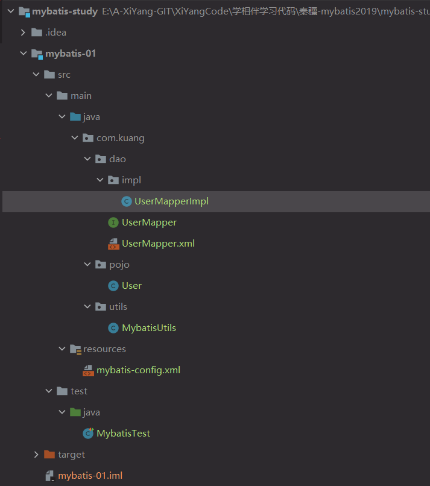