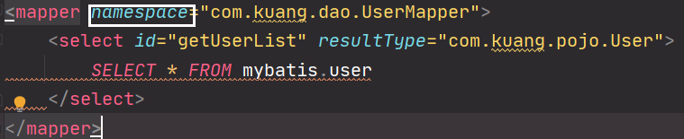
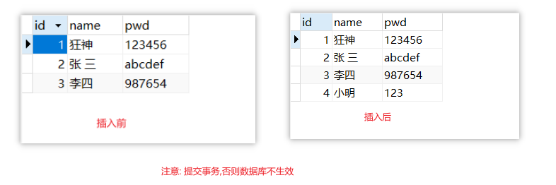
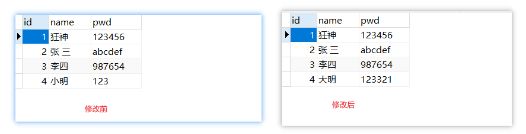
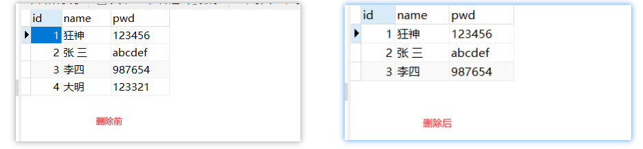
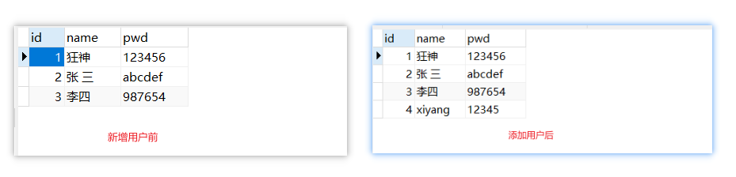

# MyBatis进行CRUD操作

## 1. namespace属性

通过入门案例可以看到mapper的标签中有一个namespace的属性,其作用就是用于xml与指定接口相互绑定



**注意:** 配置文件中namespace中的名称为对应Mapper接口或者Dao接口的<u>完整包名,必须一致</u>！ 否则报错

## 2. select标签

*select标签是mybatis中最常用的标签之一*

select语句有很多属性可以详细配置每一条SQL语句;select标签的常见属性

- `id` 
  - 命名空间中唯一的标识符
  - 接口中的方法名与映射文件中的SQL语句ID 一一对应
- `parameterType`: 传入SQL语句的参数类型 。【万能的Map，可以多尝试使用】
- `resultType`: SQL语句返回值类型。【完整的类名或者别名】

---

**【案例】**：根据id查询用户

在UserMapper中添加对应方法

```java
public interface UserMapper {
    /*查询所有用户*/
    List<User> getUserList();
    /*根据id查询*/
    User selectUserById(int id);
}
```

 在UserMapper.xml中添加Select语句

```xml
    <!--根据id查询用户-->
    <select id="selectUserById" parameterType="int" resultType="com.kuang.pojo.User">
        SELECT * FROM mybatis.user WHERE id=#{id}
    </select>
```

 测试类中测试

```java
    @Test
    public void selectUserById(){
        //1.通过工具类获取sqlsession
        SqlSession sqlSession = MybatisUtils.getSession();
        //2. 获取mapper接口
        UserMapper mapper = sqlSession.getMapper(UserMapper.class);
        //3. 调用接口中的方法
        User user = mapper.selectUserById(1);
        System.out.println(user);
        //关闭连接
        sqlSession.close();
    }
```

测试结果


## 3. insert标签

*我们一般使用insert标签进行插入操作，它的配置和select标签差不多！*

**【案例】**：给数据库增加一个用户

1. 在UserMapper接口中添加对应的方法

   ```java
   /*添加一个用户*/
   void addUser(User user);
   ```

2. 在UserMapper.xml中添加insert语句

   ```xml
   <!--增加一个用户-->
   <insert id="addUser" parameterType="com.kuang.pojo.User">
       INSERT INTO mybatis.user(id,name,pwd) VALUES(#{id},#{name},#{pwd})
   </insert>
   ```

3. 测试

   ```java
   @Test
   public void addUser(){
       //1.通过工具类获取sqlsession
       SqlSession sqlSession = MybatisUtils.getSession();
       //2. 获取mapper接口
       UserMapper mapper = sqlSession.getMapper(UserMapper.class);
       //构建一个用户
       User user = new User(4, "小明", "123");
       //3. 调用接口中的方法
       mapper.addUser(user);
       //提交事务
       sqlSession.commit(); //提交事务,重点!不写的话不会提交到数据库
       //关闭sqlsession
       sqlSession.close();
   }
   ```
   
   测试结果
   
   

**注意点**：[增、删、改] / [写]  操作需要提交事务！否则不会在数据库中生效!

```java
sqlSession.commit();
```


## 4. update标签

*我们一般使用update标签进行更新操作，它的配置和select标签差不多！*

**【案例】**：修改用户的信息

1. 同理，编写接口方法

   ```java
   /*修改用户信息*/
   void updateUser(User user);
   ```

2. 编写对应的配置文件SQL

   ```xml
   <!--修改用户信息-->
   <update id="updateUser" parameterType="com.kuang.pojo.User">
       UPDATE mybatis.user SET name=#{name},pwd=#{pwd} WHERE id=#{id}
   </update>
   ```

3. 测试

   ```java
   @Test
   public void updateUser(){
       //1.通过工具类获取sqlsession
       SqlSession sqlSession = MybatisUtils.getSession();
       //2. 获取mapper接口
       UserMapper mapper = sqlSession.getMapper(UserMapper.class);
       //查询到需要修改信息的用户
       User user = mapper.selectUserById(4);
       //修改用户的信息
       user.setName("大明");
       user.setPwd("123321");
    //3. 调用接口中的方法
       mapper.updateUser(user);
       //提交事务
       sqlSession.commit();
       //关闭sqlsession
       sqlSession.close();
   }
   ```
   
   测试结果
   
   


## 6. delete标签

*我们一般使用delete标签进行删除操作，它的配置和select标签差不多！*

**【案例】**：根据id删除一个用户

1.  同理，编写接口方法

   ```java
   //根据id删除用户 
   int deleteUser(int id);
   ```

2. 编写对应的配置文件SQL

   ```xml
   <!--删除用户根据ID-->
   <delete id="deleteUser" parameterType="int">
       DELETE FROM mybatis.user WHERE id=#{id}
   </delete>
   ```

3. 测试

   ```java
   @Test
   public void deleteUser(){
       //1.通过工具类获取sqlsession
       SqlSession sqlSession = MybatisUtils.getSession();
       //2. 获取mapper接口
       UserMapper mapper = sqlSession.getMapper(UserMapper.class);
       //3. 调用接口中的方法 删除id为4的用户
       mapper.deleteUser(4);
       //提交事务
       sqlSession.commit();
       //关闭连接
       sqlSession.close();
   }
   ```
   
   测试结果:
   
   

**crud操作中可能出现的错误分析**

- 标签不要匹配错
- resource绑定mapper，需要使用路径！
- 程序配置文件必须符合规范！
- NullpointerException，mapper.xml没有注册到config.xml！
- 输出的xml文件中存在中文乱码问题！
- maven资源没有导出问题！


## 7. CRUD操作注意事项

1. **所有的增删改操作都需要提交事务**！
2. 接口所有的普通参数，尽量都写上`@Param`参数，尤其是多个参数时，必须写上！
3. 有时候根据业务的需求，可以考虑使用map传递参数！
4. 为了规范操作，在SQL的配置文件中，我们尽量将Parameter参数和resultType都写上！

## 8. Map封装数据

*假设，我们的实体类，或者数据库中的表，字段或者参数过多，我们应当考虑map*

**【案例一】**: 使用map封装用户后添加到数据库中

1. 编写接口

   ```java
   /*使用map的方式新增一个用户*/
   int insertUserByMap(Map<String,Object> map);
   ```

2. 编写sql语句

   ```xml
   <!--使用map的方式新增一个用户-->
   <insert id="insertUserByMap" parameterType="map">
       INSERT INTO mybatis.user(id,name,pwd) VALUES (#{mapUserID},#{mapUserName},#{mapUserPwd})
   </insert>
   ```

   

3. 测试执行

   ```java
   @Test
   public void insertUserByMap(){
       //1.通过工具类获取sqlsession
       SqlSession sqlSession = MybatisUtils.getSession();
       //2. 获取mapper接口
       UserMapper mapper = sqlSession.getMapper(UserMapper.class);
       //创建map,将数据封装到map中
       Map<String, Object> map = new HashMap<String, Object>();
       map.put("mapUserID",4);
       map.put("mapUserName","xiyang");
       map.put("mapUserPwd","12345");
       //3. 调用接口中的方法
       mapper.insertUserByMap(map);
       //提交事务
       sqlSession.commit();
       //关闭sqlSession
       sqlSession.close();
   }
   ```

   测试结果

   

**【案例二】**: 根据 密码 和 名字 查询用户

<u>思路一：直接在方法中传递参数</u>

1. 在接口方法的参数前加 @Param属性

2. Sql语句编写的时候，直接取@Param中设置的值即可，不需要单独设置参数类型

   ```java
   //通过密码和名字查询用户 
   User selectUserByNP(@Param("username") String username,@Param("pwd") String pwd); 
   /* 
   <select id="selectUserByNP" resultType="com.kuang.pojo.User"> 
   	select * from user where name = #{username} and pwd = #{pwd} 
   </select> 
   */
   ```

<u>思路二：使用万能的Map</u>

1. 在接口方法中，参数直接传递Map； 

   ```java
   User selectUserByNP2(Map<String,Object> map);
   ```

2. 编写sql语句的时候，需要传递参数类型，参数类型为map

   ```xml
   <select id="selectUserByNP2" parameterType="map" resultType="com.kuang.pojo.User"> 
       select * from user where name = #{username} and pwd = #{pwd} 
   </select>
   ```

3. 在使用方法的时候，Map的 key 为 sql中取的值即可，没有顺序要求！

   ```java
   Map<String, Object> map = new HashMap<String, Object>(); 
   map.put("username","小明"); 
   map.put("pwd","123456"); 
   User user = mapper.selectUserByNP2(map);
   ```


**总结：**如果参数过多，我们可以考虑直接使用Map实现，如果参数比较少，直接传递参数即可

## 思考

*模糊查询like语句该怎么写?*

1. 第1种：在Java代码中添加sql通配符。

   ```xml
   string wildcardname = “%smi%”; 
   list<name> names = mapper.selectlike(wildcardname); 
   <select id=”selectlike”> 
       select * from foo where bar like #{value} 
   </select>
   ```

2. 第2种：在sql语句中拼接通配符，会引起sql注入

   ```xml
   string wildcardname = “smi”; 
   list<name> names = mapper.selectlike(wildcardname); 
   <select id=”selectlike”> 
       select * from foo where bar like "%"#{value}"%" 
   </select>
   ```

   