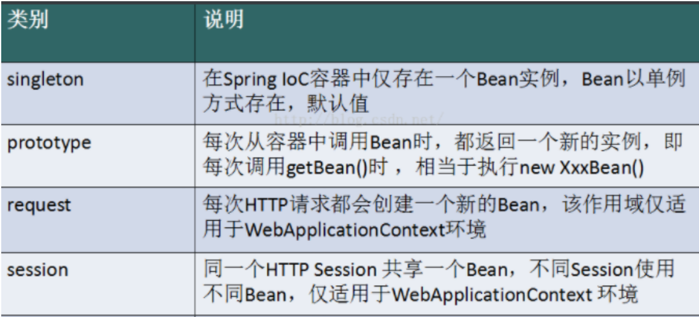

# 依赖注入(DI)

## 1. 构造器注入

*我们在之前的案例4已经详细讲过了*

## 2. set注入(重点)

要求被注入的属性 , 必须有set方法 , set方法的方法名由set + 属性首字母大写 , 如果属性是boolean类型, 没有set方法 , 是 is .

测试pojo类 :

Address.java

```java
public class Address { private String address; public String getAddress() { return address; }public void setAddress(String address) { this.address = address; } }
```

Student.java

```java
public class Student { 
    private String name; 
    private Address address; 
    private String[] books; 
    private List<String> hobbys; 
    private Map<String,String> card; 
    private Set<String> games; 
    private String wife; 
    private Properties info;
    public void setName(String name) { 
        this.name = name; 
    }
    public void setAddress(Address address) { 
        this.address = address; 
    }
    public void setBooks(String[] books) { 
        this.books = books; 
    }
    public void setHobbys(List<String> hobbys) {
        this.hobbys = hobbys;
    }
    public void setCard(Map<String, String> card) { 
        this.card = card; 
    }
    public void setGames(Set<String> games) { 
        this.games = games; 
    }
    public void setWife(String wife) { 
        this.wife = wife; 
    }
    public void setInfo(Properties info) { 
        this.info = info; 
    }
    public void show(){ 
        System.out.println("name="+ name + ",address="+ address.getAddress() + ",books=" );
        for (String book:books){ 
            System.out.print("<<"+book+">>\t"); 
        }
        System.out.println("\n爱好:"+hobbys);
        System.out.println("card:"+card); 
        System.out.println("games:"+games);
        System.out.println("wife:"+wife); 
        System.out.println("info:"+info); 
    } 
}
```

### 2.1 常量注入

```xml
<bean id="student" class="com.kuang.pojo.Student"> 
    <property name="name" value="小明"/> 
</bean>
```

测试：

```java
@Test 
public void test01(){ 
    ApplicationContext context = new ClassPathXmlApplicationContext("applicationContext.xml"); 
    Student student = (Student) context.getBean("student"); 
    System.out.println(student.getName());
}
```


### 2.2 Bean注入

注意点：这里的值是一个引用，ref

```xml
<bean id="addr" class="com.kuang.pojo.Address">
    <property name="address" value="重庆"/>
</bean> 
<bean id="student" class="com.kuang.pojo.Student"> 
    <property name="name" value="小明"/> 
    <property name="address" ref="addr"/> 
</bean>
```


### 2.3 数组注入

```xml
<bean id="student" class="com.kuang.pojo.Student"> 
    <property name="name" value="小明"/>
    <property name="address" ref="addr"/> 
    <property name="books">
        <array> 
            <value>西游记</value> 
            <value>红楼梦</value> 
            <value>水浒传</value> 
        </array> 
    </property>
</bean>
```


### 2.4 List注入

```xml
<property name="hobbys"> 
    <list><value>听歌</value> 
        <value>看电影</value> 
        <value>爬山</value> 
    </list> 
</property>
```


### 2.5 Map注入

```xml
<property name="card">
    <map><entry key="中国邮政" value="456456456465456"/>
        <entry key="建设" value="1456682255511"/>
    </map> 
</property>
```


### 2.6 Set注入

```xml
<property name="games"> 
    <set><value>LOL</value>
        <value>BOB</value>
        <value>COC</value> 
    </set> 
</property>
```


### 2.7 Null注入

```xml
<property name="wife"><null/></property>
```


### 2.8 Properties注入

```xml
<property name="info"> 
    <props> 
        <prop key="学号">20190604</prop> 
        <prop key="性别">男</prop> 
        <prop key="姓名">小明</prop> 
    </props>
</property>
```

测试结果：


## 3. 拓展注入实现

User.java ： 【注意：这里没有有参构造器！】

```java
public class User { 
    private String name; 
    private int age; 
    public void setName(String name) { 
        this.name = name; 
    }
    public void setAge(int age) {
        this.age = age;
    }
    @Override 
    public String toString() { 
        return "User{" + "name='" + name + '\'' + ", age=" + age + '}'; 
    } 
}
```

### 3.1 P命名空间注入 

 *需要在头文件中假如约束文件*

```xml
导入约束 : xmlns:p="http://www.springframework.org/schema/p" 
<!--P(属性: properties)命名空间 , 属性依然要设置set方法--> 
<bean id="user" class="com.kuang.pojo.User" p:name="狂神" p:age="18"/>
```

### 3.2 c 命名空间注入 

*需要在头文件中假如约束文件*

```xml
导入约束 : xmlns:c="http://www.springframework.org/schema/c" 
<!--C(构造: Constructor)命名空间 , 属性依然要设置set方法--> 
<bean id="user" class="com.kuang.pojo.User" c:name="狂神" c:age="18"/>
```

发现问题：爆红了，刚才我们没有写有参构造！

解决：把有参构造器加上，这里也能知道，c 就是所谓的构造器注入！

测试代码：

```java
@Test 
public void test02(){
    ApplicationContext context = new ClassPathXmlApplicationContext("applicationContext.xml"); 
    User user = (User) context.getBean("user"); 
    System.out.println(user); 
}
```


## 4. Bean的作用域

在Spring中，那些组成应用程序的主体及由Spring IoC容器所管理的对象，被称之为bean。简单地讲，bean就是由IoC容器初始化、装配及管理的对象 .



几种作用域中，request、session作用域仅在基于web的应用中使用（不必关心你所采用的是什么web应用框架），只能用在基于web的Spring ApplicationContext环境。

### 4.1  Singleton

当一个bean的作用域为Singleton，那么Spring IoC容器中只会存在一个共享的bean实例，并且所有对bean的请求，只要id与该bean定义相匹配，则只会返回bean的同一实例。Singleton是单例类型，就是在创建起容器时就同时自动创建了一个bean的对象，不管你是否使用，他都存在了，每次获取到的对象都是同一个对象。注意，Singleton作用域是Spring中的缺省作用域。要在XML中将bean定义成singleton，可以这样配置：

```xml
<bean id="ServiceImpl" class="cn.csdn.service.ServiceImpl" scope="singleton">
```

测试：

```java
@Test 
public void test03(){ 
    ApplicationContext context = new ClassPathXmlApplicationContext("applicationContext.xml"); 
    User user = (User) context.getBean("user"); 
    User user2 = (User) context.getBean("user");
    System.out.println(user==user2); 
}
```


### 4.2 Prototype

当一个bean的作用域为Prototype，表示一个bean定义对应多个对象实例。Prototype作用域的bean会导致在每次对该bean请求（将其注入到另一个bean中，或者以程序的方式调用容器的getBean()方法）时都会创建一个新的bean实例。Prototype是原型类型，它在我们创建容器的时候并没有实例化，而是当我们获取bean的时候才会去创建一个对象，而且我们每次获取到的对象都不是同一个对象。根据经验，对有状态的bean应该使用prototype作用域，而对无状态的bean则应该使用singleton作用域。在XML中将bean定义成prototype，可以这样配置：

```xml
<bean id="account" class="com.foo.DefaultAccount" scope="prototype"/> 
或者 
<bean id="account" class="com.foo.DefaultAccount" singleton="false"/>
```


### 4.3 Request

当一个bean的作用域为Request，表示在一次HTTP请求中，一个bean定义对应一个实例；即每个HTTP请求都会有各自的bean实例，它们依据某个bean定义创建而成。该作用域仅在基于web的SpringApplicationContext情形下有效。考虑下面bean定义：

```xml
<bean id="loginAction" class=cn.csdn.LoginAction scope="request"/>
```

针对每次HTTP请求，Spring容器会根据loginAction bean的定义创建一个全新的LoginAction bean实例，且该loginAction bean实例仅在当前HTTP request内有效，因此可以根据需要放心的更改所建实例的内部状态，而其他请求中根据loginAction bean定义创建的实例，将不会看到这些特定于某个请求的状态变化。当处理请求结束，request作用域的bean实例将被销毁。


### 4.4 Session

当一个bean的作用域为Session，表示在一个HTTP Session中，一个bean定义对应一个实例。该作用域仅在基于web的Spring ApplicationContext情形下有效。考虑下面bean定义：

```xml
<bean id="userPreferences" class="com.foo.UserPreferences" scope="session"/>
```

针对某个HTTP Session，Spring容器会根据userPreferences bean定义创建一个全新的userPreferences bean实例，且该userPreferences bean仅在当前HTTP Session内有效。与request作用域一样，可以根据需要放心的更改所创建实例的内部状态，而别的HTTP Session中根据userPreferences创建的实例，将不会看到这些特定于某个HTTP Session的状态变化。当HTTP Session最终被废弃的时候，在该HTTP Session作用域内的bean也会被废弃掉。

