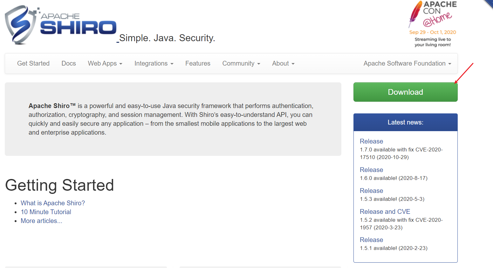
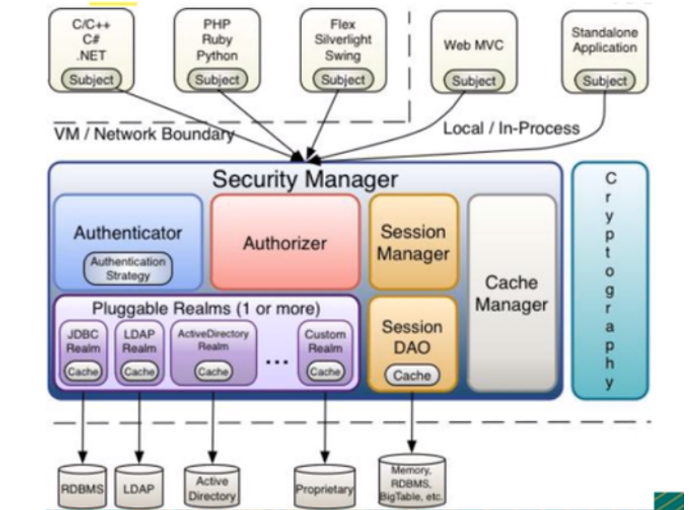

# Shiro

##  1. Shiro简介

### 1.1 什么是Shiro

- Apache Shiro 是一个Java 的安全（权限）框架。

- Shiro 可以非常容易的开发出足够好的应用，其不仅可以用在JavaSE环境，也可以用在JavaEE环境。

- Shiro可以完成，认证，授权，加密，会话管理，Web集成，缓存等。

- 下载地址：http://shiro.apache.org/

  

### 1.2 Shiro有哪些功能


- **Authentication**：身份认证、登录，验证用户是不是拥有相应的身份；
- **Authorization**：授权，即权限验证，验证某个已认证的用户是否拥有某个权限，即判断用户能否进行什么操作，如：验证某个用户是否拥有某个角色，或者细粒度的验证某个用户对某个资源是否具有某个权限！
- **Session Manager**：会话管理，即用户登录后就是第一次会话，在没有退出之前，它的所有信息都在会话中；会话可以是普通的JavaSE环境，也可以是Web环境；
- **Cryptography**：加密，保护数据的安全性，如密码加密存储到数据库中，而不是明文存储；
- **Web Support**：Web支持，可以非常容易的集成到Web环境；
- **Caching**：缓存，比如用户登录后，其用户信息，拥有的角色、权限不必每次去查，这样可以提高效率
- **Concurrency**：Shiro支持多线程应用的并发验证，即，如在一个线程中开启另一个线程，能把权限自动的传播过去
- **Testing**：提供测试支持；
- **Run As**：允许一个用户假装为另一个用户（如果他们允许）的身份进行访问；
- **Remember Me**：记住我，这个是非常常见的功能，即一次登录后，下次再来的话不用登录了

### 1.3 Shiro架构(外部)

**shiro的核心三大对象:**

- <span style="color:red">Subject</span> : 用户
- <span style="color:red">ShiroSecurityManager</span>  : 管理所有用户
- <span style="color:red">Realm</span>  : 连接数据

从外部来看Shiro，即从应用程序角度来观察如何使用shiro完成工作：


- **subject**： 应用代码直接交互的对象是Subject，也就是说Shiro的对外API核心就是Subject，Subject代表了当前的用户，这个用户不一定是一个具体的人，与当前应用交互的任何东西都是Subject，如网络爬虫，机器人等，与Subject的所有交互都会委托给SecurityManager；Subject其实是一个门面，SecurityManageer 才是实际的执行者
- **SecurityManager**：安全管理器，即所有与安全有关的操作都会与SercurityManager交互，并且它管理着所有的Subject，可以看出它是Shiro的核心，它负责与Shiro的其他组件进行交互，它相当于SpringMVC的DispatcherServlet的角色
- **Realm**：Shiro从Realm获取安全数据（如用户，角色，权限），就是说SecurityManager 要验证用户身份，那么它需要从Realm 获取相应的用户进行比较，来确定用户的身份是否合法；也需要从Realm得到用户相应的角色、权限，进行验证用户的操作是否能够进行，可以把Realm看成DataSource； 

### 1.4 Shiro架构(内部)



- **Subject**：任何可以与应用交互的 ‘用户’；
- **Security Manager**：相当于SpringMVC中的DispatcherServlet；是Shiro的心脏，所有具体的交互都通过Security Manager进行控制，它管理者所有的Subject，且负责进行认证，授权，会话，及缓存的管理。
- **Authenticator**：负责Subject认证，是一个扩展点，可以自定义实现；可以使用认证策略（Authentication Strategy），即什么情况下算用户认证通过了；
- **Authorizer**：授权器，即访问控制器，用来决定主体是否有权限进行相应的操作；即控制着用户能访问应用中的那些功能；
- **Realm**：可以有一个或者多个的realm，可以认为是安全实体数据源，即用于获取安全实体的，可以用JDBC实现，也可以是内存实现等等，由用户提供；所以一般在应用中都需要实现自己的realm
- **SessionManager**：管理Session生命周期的组件，而Shiro并不仅仅可以用在Web环境，也可以用在普通的JavaSE环境中
- **CacheManager**：缓存控制器，来管理如用户，角色，权限等缓存的；因为这些数据基本上很少改变，放到缓存中后可以提高访问的性能；
- **Cryptography**：密码模块，Shiro 提高了一些常见的加密组件用于密码加密，解密等

##  2. Shiro-HelloWorld

### 2.1 快速实践

查看官网文档：http://shiro.apache.org/tutorial.html

官方的quickstart：https://github.com/apache/shiro/tree/master/samples/quickstart/

1. 创建一个maven父工程: springboot-08-shiro，用于学习Shiro，删掉不必要的东西(src)

2. 创建一个普通的Maven子工程：shiro-01-helloworld

3. 根据官方文档，我们来导入Shiro的依赖

   ```xml
   <dependencies>
       <dependency>
           <groupId>org.apache.shiro</groupId>
           <artifactId>shiro-core</artifactId>
           <version>1.4.1</version>
       </dependency>
       <!-- Shiro uses SLF4J for logging. We'll use the 'simple' binding in this example app. See http://www.slf4j.org for more info. -->
       <dependency>
           <groupId>org.slf4j</groupId>
           <artifactId>slf4j-simple</artifactId>
           <version>1.7.21</version>
       </dependency>
       <dependency>
           <groupId>org.slf4j</groupId>
           <artifactId>jcl-over-slf4j</artifactId>
           <version>1.7.21</version>
       </dependency>
       <!-- https://mvnrepository.com/artifact/commons-logging/commons-logging -->
       <dependency>
           <groupId>commons-logging</groupId>
           <artifactId>commons-logging</artifactId>
           <version>1.2</version>
       </dependency>
   </dependencies>
   ```

4.  编写Shiro配置

   log4j.properties

   ```properties
   log4j.rootLogger=INFO, stdout
   log4j.appender.stdout=org.apache.log4j.ConsoleAppender
   log4j.appender.stdout.layout=org.apache.log4j.PatternLayout
   log4j.appender.stdout.layout.ConversionPattern=%d %p [%c] - %m %n
   # General Apache libraries
   log4j.logger.org.apache=WARN
   # Spring
   log4j.logger.org.springframework=WARN
   # Default Shiro logging
   log4j.logger.org.apache.shiro=INFO
   # Disable verbose logging
   log4j.logger.org.apache.shiro.util.ThreadContext=WARN
   log4j.logger.org.apache.shiro.cache.ehcache.EhCache=WARN
   ```

   shiro.ini

   ```ini
   # ----------------------------------------------------------------------------- 
   # Users and their assigned roles 
   # Each line conforms to the format defined in the
   # org.apache.shiro.realm.text.TextConfigurationRealm#setUserDefinitions JavaDoc
   # -----------------------------------------------------------------------------
   [users] 
   # user 'root' with password 'secret' and the 'admin' role
   root = secret, admin 
   # user 'guest' with the password 'guest' and the 'guest' role 
   guest = guest, guest 
   # user 'presidentskroob' with password '12345' ("That's the same combination on
   # my luggage!!!" ;)), and role 'president'
   presidentskroob = 12345, president
   # user 'darkhelmet' with password 'ludicrousspeed' and roles 'darklord' and 'schwartz'
   darkhelmet = ludicrousspeed, darklord, schwartz
   # user 'lonestarr' with password 'vespa' and roles 'goodguy' and 'schwartz'
   lonestarr = vespa, goodguy, schwartz
   # ---------------------------------------------------------------------- -------
   # Roles with assigned permissions
   # Each line conforms to the format defined in the
   # org.apache.shiro.realm.text.TextConfigurationRealm#setRoleDefinitions JavaDoc
   # ---------------------------------------------------------------------- -------
   [roles]
   # 'admin' role has all permissions, indicated by the wildcard '*'
   admin = *
   # The 'schwartz' role can do anything (*) with any lightsaber:
   schwartz = lightsaber:*
   # The 'goodguy' role is allowed to 'drive' (action) the winnebago (type) with
   # license plate 'eagle5' (instance specific id)
   goodguy = winnebago:drive:eagle5
   ```

5. 编写我们的QuickStrat

   ```java
   import org.apache.shiro.SecurityUtils; 
   import org.apache.shiro.authc.*; 
   import org.apache.shiro.config.IniSecurityManagerFactory;
   import org.apache.shiro.mgt.SecurityManager;
   import org.apache.shiro.session.Session; 
   import org.apache.shiro.subject.Subject;
   import org.apache.shiro.util.Factory; 
   import org.slf4j.Logger; import org.slf4j.LoggerFactory;
   /**
    * Simple Quickstart application showing how to use Shiro's API. 
    */ 
   public class Quickstart {
       private static final transient Logger log = LoggerFactory.getLogger(Quickstart.class);
       public static void main(String[] args) {
           // The easiest way to create a Shiro SecurityManager with configured
           // realms, users, roles and permissions is to use the simple INI config. 
           // We'll do that by using a factory that can ingest a .ini file and
           // return a SecurityManager instance: 
           // Use the shiro.ini file at the root of the classpath 
           // (file: and url: prefixes load from files and urls respectively):
           Factory<SecurityManager> factory = new IniSecurityManagerFactory("classpath:shiro.ini"); 
           SecurityManager securityManager = factory.getInstance();
           // for this simple example quickstart, make the SecurityManager
           // accessible as a JVM singleton. Most applications wouldn't do this 
           // and instead rely on their container configuration or web.xml for 
           // webapps. That is outside the scope of this simple quickstart, so 
           // we'll just do the bare minimum so you can continue to get a feel 
           // for things.
           SecurityUtils.setSecurityManager(securityManager);
           // Now that a simple Shiro environment is set up, let's see what you can do:
           // get the currently executing user:
           Subject currentUser = SecurityUtils.getSubject();
           // Do some stuff with a Session (no need for a web or EJB container!!!)
           Session session = currentUser.getSession();
           session.setAttribute("someKey", "aValue");
           String value = (String) session.getAttribute("someKey"); 
           if (value.equals("aValue")) {
               log.info("Retrieved the correct value! [" + value + "]");
           }
           // let's login the current user so we can check against roles and permissions:
           if (!currentUser.isAuthenticated()) {
               UsernamePasswordToken token = new UsernamePasswordToken("lonestarr", "vespa"); 
               token.setRememberMe(true);
               try {
                   currentUser.login(token); 
               } catch (UnknownAccountException uae) {
                   log.info("There is no user with username of " + token.getPrincipal());
               } catch (IncorrectCredentialsException ice) {
                   log.info("Password for account " + token.getPrincipal() + " was incorrect!");
               } catch (LockedAccountException lae) { 
                   log.info("The account for username " + token.getPrincipal() + " is locked. " + "Please contact your administrator to unlock it."); 
               }
               // ... catch more exceptions here (maybe custom ones specific to your application?
               catch (AuthenticationException ae) { 
                   //unexpected condition? error? 
               }
           }
           //say who they are: //print their identifying principal (in this case, a username):
           log.info("User [" + currentUser.getPrincipal() + "] logged in successfully."); 
           //test a role: 
           if (currentUser.hasRole("schwartz")) { 
               log.info("May the Schwartz be with you!"); 
           } else {
               log.info("Hello, mere mortal."); 
           }
           //test a typed permission (not instance-level) 
           if (currentUser.isPermitted("lightsaber:wield")) { 
               log.info("You may use a lightsaber ring. Use it wisely.");
           } else { 
               log.info("Sorry, lightsaber rings are for schwartz masters only.");
           }
           //a (very powerful) Instance Level permission: 
           if (currentUser.isPermitted("winnebago:drive:eagle5")) {
               log.info("You are permitted to 'drive' the winnebago with license plate (id) 'eagle5'. " + "Here are the keys - have fun!");
           } else { 
               log.info("Sorry, you aren't allowed to drive the 'eagle5' winnebago!"); 
           }
           //all done - log out! 
           currentUser.logout();
           System.exit(0); 
       } 
   }
   ```

6. 测试运行运行

   - 报错，则导入一下 `commons-logging` 的依赖

     ```xml
     <!-- https://mvnrepository.com/artifact/commons-logging/commons-logging -->
     <dependency> 
         <groupId>commons-logging</groupId> 
         <artifactId>commons-logging</artifactId> 
         <version>1.2</version> 
     </dependency>
     ```

   - 发现，执行完毕什么都没有，可能是maven依赖中的作用域问题，我们需要将scope作用域删掉，默认是在test，然后重启，那么我们的quickstart就结束了，默认的日志消息！

     

**代码解释如下:**

### 2.2 代码解释

1. 导入了一堆包！

   ```java
   import org.apache.shiro.SecurityUtils;
   import org.apache.shiro.authc.*;
   import org.apache.shiro.config.IniSecurityManagerFactory;
   import org.apache.shiro.mgt.SecurityManager;
   import org.apache.shiro.session.Session;
   import org.apache.shiro.subject.Subject;
   import org.apache.shiro.util.Factory;
   import org.slf4j.Logger; import org.slf4j.LoggerFactory;
   ```

   

2. 类的描述

   ```java
   /** 
    * Simple Quickstart application showing how to use Shiro's API. 
    * 简单的快速启动应用程序，演示如何使用Shiro的API。 
    */
   ```

3. **通过工厂模式创建SecurityManager的实例对象**

   ```java
   // The easiest way to create a Shiro SecurityManager with configured 
   // realms, users, roles and permissions is to use the simple INI config.
   // We'll do that by using a factory that can ingest a .ini file and 
   // return a SecurityManager instance:
   // 使用类路径根目录下的shiro.ini文件 
   // Use the shiro.ini file at the root of the classpath 
   // (file: and url: prefixes load from files and urls respectively): 
   Factory<SecurityManager> factory = new IniSecurityManagerFactory("classpath:shiro.ini"); 
   SecurityManager securityManager = factory.getInstance(); 
   // for this simple example quickstart, make the SecurityManager 
   // accessible as a JVM singleton. Most applications wouldn't do this 
   // and instead rely on their container configuration or web.xml for
   // webapps. That is outside the scope of this simple quickstart, so 
   // we'll just do the bare minimum so you can continue to get a feel 
   // for things.SecurityUtils.setSecurityManager(securityManager); 
   // 现在已经建立了一个简单的Shiro环境，让我们看看您可以做什么： 
   // Now that a simple Shiro environment is set up, let's see what you can do:
   ```

4. **获取当前的Subject**

   ```java
   // get the currently executing user: 获取当前正在执行的用户
   Subject currentUser = SecurityUtils.getSubject();
   ```

5. **获取session**

   ```java
   // 用会话做一些事情（不需要web或EJB容器！!!) 
   // Do some stuff with a Session (no need for a web or EJB container!!!) 
   Session session = currentUser.getSession(); //获得session 
   session.setAttribute("someKey", "aValue"); //设置Session的值！ 
   String value = (String) session.getAttribute("someKey"); //从session中获取 值
   if (value.equals("aValue")) { //判断session中是否存在这个值！ 
       log.info("==Retrieved the correct value! [" + value + "]"); 
   }
   ```

6. **用户认证功能**

   ```java
   // 测试当前的用户是否已经被认证，即是否已经登录！ 
   // let's login the current user so we can check against roles and permissions: 
   if (!currentUser.isAuthenticated()) { 
       // isAuthenticated();是否认证 
       //将用户名和密码封装为 UsernamePasswordToken ；
       UsernamePasswordToken token = new UsernamePasswordToken("lonestarr", "vespa"); 
       token.setRememberMe(true); //记住我功能 
       try {
           currentUser.login(token); //执行登录，可以登录成功的！ 
       } catch (UnknownAccountException uae) { //如果没有指定的用户，则 UnknownAccountException异常 
           log.info("There is no user with username of " + token.getPrincipal()); 
       } catch (IncorrectCredentialsException ice) {//密码不对的异常！ 
           log.info("Password for account " + token.getPrincipal() + " was incorrect!"); 
       } catch (LockedAccountException lae) { //用户被锁定的异常 
           log.info("The account for username " + token.getPrincipal() + " is locked. " + "Please contact your administrator to unlock it."); 
       }// ... catch more exceptions here (maybe custom ones specific to your application? 
       catch (AuthenticationException ae) { //认证异常，上面的异常都是它的子类 
           //unexpected condition? error? 
       } 
   }
   //说出他们是谁： 
   //say who they are: 
   //打印他们的标识主体（在本例中为用户名）： 
   //print their identifying principal (in this case, a username):
   log.info("User [" + currentUser.getPrincipal() + "] logged in successfully.");
   ```

7.  **角色检查**

   ```java
   //test a role: 
   //是否存在某一个角色 
   if (currentUser.hasRole("schwartz")) {
       log.info("May the Schwartz be with you!");
   } else { 
       log.info("Hello, mere mortal.");
   }
   ```

8. **权限检查，粗粒度**

   ```java
   //测试用户是否具有某一个权限，行为 
   //test a typed permission (not instance-level) 
   if (currentUser.isPermitted("lightsaber:wield")) {
       log.info("You may use a lightsaber ring. Use it wisely."); 
   } else { 
       log.info("Sorry, lightsaber rings are for schwartz masters only.");
   }
   ```

9. **权限检查，细粒度**

   ```java
   //测试用户是否具有某一个权限，行为，比上面更加的具体！
   //a (very powerful) Instance Level permission:
   if (currentUser.isPermitted("winnebago:drive:eagle5")) { 
       log.info("You are permitted to 'drive' the winnebago with license plate (id) 'eagle5'. " + "Here are the keys - have fun!");
   } else { 
       log.info("Sorry, you aren't allowed to drive the 'eagle5' winnebago!"); 
   }
   ```

10.  **注销操作**

    ```java
    //执行注销操作！
    //all done - log out! 
    currentUser.logout();
    ```

11. 退出程序

    ```java
    System.exit(0);
    ```

*OK，一个简单的Shiro程序体验，我们就在官方的带领下初步认识了！*


### 2.3 官方shiro示例代码完整解释

```java
public class Quickstart {
    private static final transient Logger log = LoggerFactory.getLogger(Quickstart.class);
    public static void main(String[] args) {

        //1. 通过工厂模式创建了securytyManager对象
        Factory<SecurityManager> factory = new IniSecurityManagerFactory("classpath:shiro.ini");
        SecurityManager securityManager = factory.getInstance();

        SecurityUtils.setSecurityManager(securityManager);

        //2. 获取到subject对象
        Subject currentUser = SecurityUtils.getSubject();

        //3. session操作
        Session session = currentUser.getSession();
        session.setAttribute("someKey", "aValue");
        String value = (String) session.getAttribute("someKey");
        if (value.equals("aValue")) {
            log.info("subject=>session:" + value); //[main] INFO Quickstart - subject=>session:aValue
        }
        //4. 判断当前用户是否被认证
        if (!currentUser.isAuthenticated()) {
            //token
            UsernamePasswordToken token = new UsernamePasswordToken("lonestarr", "vespa");
            token.setRememberMe(true); //设置记住我
            try {
                currentUser.login(token);// 执行了登录操作!!!
            } catch (UnknownAccountException uae) { //未知账户异常
                log.info("There is no user with username of " + token.getPrincipal());
            } catch (IncorrectCredentialsException ice) { //密码异常
                log.info("Password for account " + token.getPrincipal() + " was incorrect!");
            } catch (LockedAccountException lae) { //用户锁定
                log.info("The account for username " + token.getPrincipal() + " is locked. " + "Please contact your administrator to unlock it.");
            }
            catch (AuthenticationException ae) { //
                //unexpected condition? error?
            }
        }
        //currentUser.getPrincipal(): 获取当前用户的认证码
        log.info("User [" + currentUser.getPrincipal() + "] logged in successfully.");

        //5. 测试角色
        if (currentUser.hasRole("schwartz")) {
            log.info("May the Schwartz be with you!");
        } else {
            log.info("Hello, mere mortal.");
        }
        //6. 是否拥有什么样的权限(粗粒度的)
        if (currentUser.isPermitted("lightsaber:wield")) {
            log.info("You may use a lightsaber ring. Use it wisely.");
        } else {
            log.info("Sorry, lightsaber rings are for schwartz masters only.");
        }
       //7. 是否拥有什么样的权限(细粒度的)
        if (currentUser.isPermitted("winnebago:drive:eagle5")) {
            log.info("You are permitted to 'drive' the winnebago with license plate (id) 'eagle5'. " + "Here are the keys - have fun!");
        } else {
            log.info("Sorry, you aren't allowed to drive the 'eagle5' winnebago!");
        }
        //8.注销功能
        currentUser.logout();
        //退出程序
        System.exit(0);
    }
}
```

**需要关注的点:**

```java
//1. 获取subject
Subject currentUser = SecurityUtils.getSubject();
//2. 获取session
Session session = currentUser.getSession();
//3. 判断当前用户是否被认证
currentUser.isAuthenticated();
//4. 获取认证码
currentUser.getPrincipal();
//5. 用户是否拥有什么角色
currentUser.hasRole("schwartz");
//6. 是否拥有什么样的权限
currentUser.isPermitted("lightsaber:wield");
//7. 注销
currentUser.logout();
```


##  3. SpringBoot集成Shiro

### 3.1 准备工作

1.  搭建一个SpringBoot项目、选中web模块即可！项目名称: shiro-springboot

2. 导入thymeleaf 依赖

   ```xml
   <!--thymeleaf模板--> 
   <dependency> 
       <groupId>org.thymeleaf</groupId>
       <artifactId>thymeleaf-spring5</artifactId>
   </dependency> 
   <dependency> 
       <groupId>org.thymeleaf.extras</groupId>
       <artifactId>thymeleaf-extras-java8time</artifactId>
   </dependency>
   ```

3. 在templates 文件夹中编写一个页面 index.html

   ```html
   <!DOCTYPE html> 
   <html lang="en"xmlns:th="http://www.thymeleaf.org">
       <head>
           <meta charset="UTF-8"> 
           <title>Title</title>
       </head> 
       <body> 
           <h1>首页</h1> 
           <p th:text="${msg}"></p> 
       </body> 
   </html>
   ```

4. 编写controller进行访问测试

   ```java
   @Controller 
   public class MyController { 
       @RequestMapping({"/","/index"})
       public String toIndex(Model model){ 
           model.addAttribute("msg","hello,Shiro");
           return "index";
       }
   }
   ```

5.  测试访问首页！

   

### 3.2 整合Shiro

**回顾核心API：** 

1. Subject：用户主体
2. SecurityManager：安全管理器
3. Realm：Shiro 连接数据

**SpringBoot整合Shiro步骤:**

1. 导入Shiro 和 spring整合的依赖

   ```xml
   <dependency> 
       <groupId>org.apache.shiro</groupId> 
       <artifactId>shiro-spring</artifactId>
       <version>1.4.1</version> 
   </dependency>
   ```

2. 编写Shiro 配置类 config包 

   ```java
   //声明为配置类 
   @Configuration
   public class ShiroConfig {
       //创建 ShiroFilterFactoryBean 
       //创建 DefaultWebSecurityManager
       //创建 realm 对象 
   }
   ```

3. 我们倒着来，先想办法创建一个 realm 对象

4. 我们需要自定义一个 realm 的类，用来编写一些查询的方法，或者认证与授权的逻辑

   ```java
   //自定义Realm 
   public class UserRealm extends AuthorizingRealm { 
       //执行授权逻辑
       @Override 
       protected AuthorizationInfo doGetAuthorizationInfo(PrincipalCollection principals) { 
           System.out.println("执行了=>授权逻辑PrincipalCollection"); 
           return null; 
       }
       //执行认证逻辑 
       @Override 
       protected AuthenticationInfo doGetAuthenticationInfo(AuthenticationToken token) throws AuthenticationException { 
           System.out.println("执行了=>认证逻辑AuthenticationToken");
           return null;
       } 
   }
   ```

5. 将这个类注册到我们的Bean中！ ShiroConfig 

   ```java
   @Configuration 
   public class ShiroConfig { 
       //创建 ShiroFilterFactoryBean 
       //创建 DefaultWebSecurityManager 
       //创建 realm 对象 
       @Bean 
       public UserRealm userRealm(){ 
           return new UserRealm();
       }
   }
   ```

6. 接下来我们该去创建 DefaultWebSecurityManager 了 

   ```java
   //创建 DefaultWebSecurityManager 
   @Bean(name = "securityManager") 
   public DefaultWebSecurityManager getDefaultWebSecurityManager(@Qualifier("userRealm")UserRealm userRealm){ 
       DefaultWebSecurityManager securityManager = new DefaultWebSecurityManager(); 
       //关联Realm 
       securityManager.setRealm(userRealm); 
       return securityManager; 
   }
   ```

7. 接下来我们该去创建 ShiroFilterFactoryBean 了

   ```java
   //创建 ShiroFilterFactoryBean 
   @Bean 
   public ShiroFilterFactoryBean getShiroFilterFactoryBean(@Qualifier("securityManager")DefaultWebSecurity Manager securityManager){ 
       ShiroFilterFactoryBean shiroFilterFactoryBean = new ShiroFilterFactoryBean(); //设置安全管理器 
       shiroFilterFactoryBean.setSecurityManager(securityManager); 
       return shiroFilterFactoryBean; 
   }
   ```

8. 最后上完整的配置：

   ```java
   //声明为配置类 
   @Configuration public class ShiroConfig {
       //创建 ShiroFilterFactoryBean 
       @Bean 
       public ShiroFilterFactoryBean getShiroFilterFactoryBean(@Qualifier("securityManager")DefaultWebSecurityMan ager securityManager){ 
           ShiroFilterFactoryBean shiroFilterFactoryBean = new ShiroFilterFactoryBean(); //设置安全管理器 shiroFilterFactoryBean.setSecurityManager(securityManager); 
           return shiroFilterFactoryBean;
       }
       //创建 DefaultWebSecurityManager 
       @Bean(name = "securityManager") 
       public DefaultWebSecurityManager getDefaultWebSecurityManager(@Qualifier("userRealm")UserRealm userRealm){ 
           DefaultWebSecurityManager securityManager = new DefaultWebSecurityManager();
           //关联Realm 
           securityManager.setRealm(userRealm);
           return securityManager; 
       }
       //创建 realm 对象 
       @Bean 
       public UserRealm userRealm(){
           return new UserRealm();
       }
   }
   ```

   


### 3.3 页面拦截实现

1. 编写两个页面、在templates目录下新建一个 user 目录 add.html update.html 

   ```html
   <body> 
       <h1>add</h1> 
   </body>
   ```

   ```html
   <body>
       <h1>update</h1>
   </body>
   ```

2.  编写跳转到页面的controller

   ```java
   @RequestMapping("/user/add") 
   public String toAdd(){ 
       return "user/add";
   }
   @RequestMapping("/user/update") 
   public String toUpdate(){
       return "user/update";
   }
   ```

3. 在index页面上，增加跳转链接

   ```html
   <a th:href="@{/user/add}">add</a> | <a th:href="@{/user/update}">update</a>
   ```

4. 测试页面跳转是否OK

5. 准备添加Shiro的内置过滤器

   ```java
   @Bean 
   public ShiroFilterFactoryBean getShiroFilterFactoryBean(@Qualifier("securityManager")DefaultWebSecurit yManager securityManager){ 
       ShiroFilterFactoryBean shiroFilterFactoryBean = new ShiroFilterFactoryBean(); 
       //设置安全管理器 
       shiroFilterFactoryBean.setSecurityManager(securityManager); 
       /* 添加Shiro内置过滤器，常用的有如下过滤器： 
       anon： 无需认证就可以访问 
       authc： 必须认证才可以访问
       user： 如果使用了记住我功能就可以直接访问
       perms: 拥有某个资源权限才可以访问
       role： 拥有某个角色权限才可以访问 */ 
       Map<String,String> filterMap = new LinkedHashMap<String, String>(); 
       filterMap.put("/user/add","authc"); 
       filterMap.put("/user/update","authc"); 
       shiroFilterFactoryBean.setFilterChainDefinitionMap(filterMap);
       return shiroFilterFactoryBean; 
   }
   ```

6. 再起启动测试，访问链接进行测试！拦截OK！但是发现，点击后会跳转到一个Login.jsp页面，这个不是我们想要的效果，我们需要自己定义一个Login页面！

7. 我们编写一个自己的Login页面

   ```html
   <!DOCTYPE html>
   <html lang="en"> 
       <head>
           <meta charset="UTF-8"> 
           <title>登录页面</title> 
       </head>
       <body>
           <h1>登录页面</h1>
           <hr> 
           <form action=""> 
               <p> 用户名： <input type="text" name="username"> </p> 
               <p> 密码： <input type="text" name="password"> </p> 
               <p> <input type="submit"> </p> 
           </form> 
       </body> 
   </html>
   ```

8.  编写跳转的controller

   ```java
   @RequestMapping("/toLogin") 
   public String toLogin(){ 
       return "login"; 
   }
   ```

9. 在shiro中配置一下！ ShiroFilterFactoryBean() 方法下面

   ```java
   //修改到要跳转的login页面；
   shiroFilterFactoryBean.setLoginUrl("/toLogin");
   ```

10. 再次测试，成功的跳转到了我们指定的Login页面！

11. 优化一下代码，我们这里的拦截可以使用 通配符来操作

    ```java
    Map<String,String> filterMap = new LinkedHashMap<String, String>(); //filterMap.put("/user/add","authc"); 
    //filterMap.put("/user/update","authc"); 
    filterMap.put("/user/*","authc"); 
    shiroFilterFactoryBean.setFilterChainDefinitionMap(filterMap);
    ```

12. 测试，完全OK！ 

### 3.4 登录认证操作

1. 编写一个登录的controller

   ```java
   //登录操作 
   @RequestMapping("/login") 
   public String login(String username,String password,Model model){ 
       //使用shiro，编写认证操作 
       //1. 获取Subject 
       Subject subject = SecurityUtils.getSubject(); 
       //2. 封装用户的数据 
       UsernamePasswordToken token = new UsernamePasswordToken(username, password); 
       //3. 执行登录的方法，只要没有异常就代表登录成功！
       try {
           subject.login(token); 
           //登录成功！返回首页 
           return "index"; 
       } catch (UnknownAccountException e) {
           //用户名不存在 
           model.addAttribute("msg","用户名不存在");
           return "login"; 
       } catch (IncorrectCredentialsException e) {
           //密码错误 
           model.addAttribute("msg","密码错误");
           return "login"; 
       } 
   }
   ```

2.  在前端修改对应的信息输出或者请求！

   登录页面增加一个 msg 提示：

   ```html
   <p style="color:red;" th:text="${msg}"></p>
   ```

   给表单增加一个提交地址：

   ```html
   <form th:action="@{/login}"> 
       <p>用户名： <input type="text" name="username"></p>
       <p>密码： <input type="text" name="password"></p> 
       <p> <input type="submit"> </p> 
   </form>
   ```

3. 理论，假设我们提交了表单，他会经过我们刚才编写的UserRealm，我们提交测试一下

4. 在 UserRealm 中编写用户认证的判断逻辑

   ```java
   //执行认证逻辑 
   @Override 
   protected AuthenticationInfo doGetAuthenticationInfo(AuthenticationToken token) throws AuthenticationException { 
       System.out.println("执行了=>认证逻辑AuthenticationToken"); 
       //假设数据库的用户名和密码 
       String name = "root"; String password = "123456"; 
       //1.判断用户名 
       UsernamePasswordToken userToken = (UsernamePasswordToken)token; 
       if (!userToken.getUsername().equals(name)){ 
           //用户名不存在 
           return null; 
           //shiro底层就会抛出 UnknownAccountException}
           //2. 验证密码,我们可以使用一个AuthenticationInfo实现类 SimpleAuthenticationInfo 
           // shiro会自动帮我们验证！重点是第二个参数就是要验证的密码！
           return new SimpleAuthenticationInfo("", password, "");
       }
   ```

5. 测试一下！成功实现登录的认证操作！

### 3.5 整合数据库

1. 导入Mybatis相关依赖

   ```xml
   <!-- 引入 myBatis，这是 MyBatis官方提供的适配 Spring Boot 的，而不是Spring Boot自己的--> 
   <dependency>
       <groupId>org.mybatis.spring.boot</groupId> 
       <artifactId>mybatis-spring-boot-starter</artifactId> 
       <version>2.1.0</version> 
   </dependency> 
   <dependency>
       <groupId>mysql</groupId>
       <artifactId>mysql-connector-java</artifactId>
       <scope>runtime</scope>
   </dependency>
   <!-- https://mvnrepository.com/artifact/log4j/log4j -->
   <dependency> 
       <groupId>log4j</groupId> 
       <artifactId>log4j</artifactId> 
       <version>1.2.17</version> 
   </dependency> 
   <!-- https://mvnrepository.com/artifact/com.alibaba/druid -->
   <dependency> 
       <groupId>com.alibaba</groupId> 
       <artifactId>druid</artifactId>
       <version>1.1.12</version>
   </dependency>
   ```

2. 编写配置文件-连接配置 application.yml 

   ```yaml
   spring:datasource: username: root password: 123456 #?serverTimezone=UTC解决时区的报错 url: jdbc:mysql://localhost:3306/mybatis? serverTimezone=UTC&useUnicode=true&characterEncoding=utf-8 driver-class-name: com.mysql.jdbc.Driver type: com.alibaba.druid.pool.DruidDataSource #Spring Boot 默认是不注入这些属性值的，需要自己绑定 #druid 数据源专有配置 initialSize: 5 minIdle: 5maxActive: 20 maxWait: 60000 timeBetweenEvictionRunsMillis: 60000 minEvictableIdleTimeMillis: 300000 validationQuery: SELECT 1 FROM DUAL testWhileIdle: true testOnBorrow: false testOnReturn: false poolPreparedStatements: true #配置监控统计拦截的filters，stat:监控统计、log4j：日志记录、wall：防御sql注入 #如果允许时报错 java.lang.ClassNotFoundException: org.apache.log4j.Priority #则导入 log4j 依赖即可，Maven 地址： https://mvnrepository.com/artifact/log4j/log4j filters: stat,wall,log4j maxPoolPreparedStatementPerConnectionSize: 20 useGlobalDataSourceStat: true connectionProperties: druid.stat.mergeSql=true;druid.stat.slowSqlMillis=500
   ```

3.  编写mybatis的配置 application.properties 

   ```properties
   #别名配置 
   mybatis.type-aliases-package=com.kuang.pojo
   mybatis.mapper-locations=classpath:mapper/*.xml
   ```

4.  编写实体类,引入Lombok

   ```xml
   <dependency>
       <groupId>org.projectlombok</groupId>
       <artifactId>lombok</artifactId>
       <version>1.16.10</version> 
   </dependency>
   ```

   ```java
   @Data
   @AllArgsConstructor
   @NoArgsConstructor 
   public class User { 
       private int id; 
       private String name;
       private String pwd;
   }
   ```

5. 编写Mapper接口

   ```java
   @Repository 
   @Mapper 
   public interface UserMapper { 
       public User queryUserByName(String name);
   }
   ```

6. 编写Mapper配置文件

   ```xml
   <?xml version="1.0" encoding="UTF-8" ?>
   <!DOCTYPE mapper PUBLIC "-//mybatis.org//DTD Mapper 3.0//EN" 
   	"http://mybatis.org/dtd/mybatis-3-mapper.dtd"> 
   <mapper namespace="com.kuang.mapper.UserMapper">
       <select id="queryUserByName" parameterType="String" resultType="User">
           select * from user where name = #{name} 
       </select> 
   </mapper>
   ```

7. 编写UserService 层 

   ```java
   public interface UserService { 
       public User queryUserByName(String name);
   }
   ```

   ```java
   @Service
   public class UserServiceImpl implements UserService { 
       @Autowired 
       UserMapper userMapper;
       @Override
       public User queryUserByName(String name) {
           return userMapper.queryUserByName(name); 
       } 
   }
   ```

8. 好了，一口气写了这些常规操作，可以去测试一下了，保证能够从数据库中查询出来

   ```java
   class Shiro02SpringbootApplicationTests {
       @Autowired
       UserServiceImpl userService;
       @Test
       void contextLoads() {
           User user = userService.queryUserByName("root");
           System.out.println(user);
       } 
   }
   ```

   完全OK，成功查询出来了！

9. 改造UserRealm，连接到数据库进行真实的操作！

   ```java
   //自定义Realm 
   public class UserRealm extends AuthorizingRealm { 
       @Autowired 
       UserService userService; //执行授权逻辑 
       @Override 
       protected AuthorizationInfo doGetAuthorizationInfo(PrincipalCollection principals) {
           System.out.println("执行了=>授权逻辑PrincipalCollection"); 
           return null; 
       }
       //执行认证逻辑 
       @Override 
       protected AuthenticationInfo doGetAuthenticationInfo(AuthenticationToken token) throws AuthenticationException { 
           System.out.println("执行了=>认证逻辑AuthenticationToken");
           UsernamePasswordToken userToken = (UsernamePasswordToken)token; 
           //真实连接数据库 
           User user = userService.queryUserByName(userToken.getUsername()); 
           if (user==null){ 
               //用户名不存在 
               return null; 
               //shiro底层就会抛出 UnknownAccountException 
           }
           return new SimpleAuthenticationInfo("", user.getPwd(), "");
       }
   }
   ```

10. 测试，现在查询都是从数据库查询的了！

### 3.6 思考: 密码比对原理探究

思考？这个Shiro，是怎么帮我们实现密码自动比对的呢？

我们可以去 realm的父类 AuthorizingRealm 的父类 AuthenticatingRealm 中找一个方法

核心： getCredentialsMatcher() 翻译过来：获取证书匹配器

我们去看这个接口 CredentialsMatcher 有很多的实现类，MD5盐值加密

我们的密码一般都不能使用明文保存？需要加密处理；思路分析

1. 如何把一个字符串加密为MD5

2. 替换当前的Realm 的 CredentialsMatcher 属性，直接使用 Md5CredentialsMatcher 对象，并设置加密算法

### 3.7 用户授权操作

使用shiro的过滤器来拦截请求即可！

1. 在 ShiroFilterFactoryBean 中添加一个过滤器

   ```java
   //授权过滤器 
   filterMap.put("/user/add","perms[user:add]"); //大家记得注意顺序！
   ```

2. 我们再次启动测试一下，访问add，发现以下错误！未授权错误！

3. 注意：当我们实现权限拦截后，shiro会自动跳转到未授权的页面，但我们没有这个页面，所有401了

4. 配置一个未授权的提示的页面，增加一个controller提示

   ```java
   @RequestMapping("/noauth")
   @ResponseBody public String noAuth(){ 
       return "未经授权不能访问此页面";
   }
   ```

   然后再 shiroFilterFactoryBean 中配置一个未授权的请求页面！

   ```java
   shiroFilterFactoryBean.setUnauthorizedUrl("/noauth");
   ```

5. 测试，现在没有授权，可以跳转到我们指定的位置了！

### 3.8 Shiro授权

在UserRealm 中添加授权的逻辑，增加授权的字符串！

```java
//执行授权逻辑 
@Override 
protected AuthorizationInfo doGetAuthorizationInfo(PrincipalCollection principals) { 
    System.out.println("执行了=>授权逻辑PrincipalCollection"); //给资源进行授权 
    SimpleAuthorizationInfo info = new SimpleAuthorizationInfo(); //添加资源的授权字符串 
    info.addStringPermission("user:add"); return info; 
}
```

我们再次登录测试，发现登录的用户是可以进行访问add 页面了！授权成功！

问题，我们现在完全是硬编码，无论是谁登录上来，都可以实现授权通过，但是真实的业务情况应该是，每个用户拥有自己的一些权限，从而进行操作，所以说，权限，应该在用户的数据库中，正常的情况下，应该数据库中是由一个权限表的，我们需要联表查询，但是这里为了大家操作理解方便一些，我们直接在数据库表中增加一个字段来进行操作！

1. 修改实体类，增加一个字段

   ```java
   @Data
   @AllArgsConstructor
   @NoArgsConstructor public class User { 
       private int id; 
       private String name;
       private String pwd; 
       private String perms; 
   }
   ```

2. 我们现在需要再自定义的授权认证中，获取登录的用户，从而实现动态认证授权操作！

   - 在用户登录授权的时候，将用户放在 Principal 中，改造下之前的代码

     ```java
     return new SimpleAuthenticationInfo(user, user.getPwd(), "");
     ```

   - 然后再授权的地方获得这个用户，从而获得它的权限

     ```java
     //执行授权逻辑 
     @Override 
     protected AuthorizationInfo doGetAuthorizationInfo(PrincipalCollection principals) { 
         System.out.println("执行了=>授权逻辑PrincipalCollection"); //给资源进行授权 
         SimpleAuthorizationInfo info = new SimpleAuthorizationInfo(); //添加资源的授权字符串 
         //info.addStringPermission("user:add"); 
         Subject subject = SecurityUtils.getSubject(); //获得当前对象
         User currentUser = (User) subject.getPrincipal(); //拿到User对象 
         info.addStringPermission(currentUser.getPerms()); //设置权限 return info;
     }
     ```

3. 我们给数据库中的用户增加一些权限

4. 在过滤器中，将 update 请求也进行权限拦截下

   ```java
   //授权过滤器 
   filterMap.put("/user/add","perms[user:add]"); 
   filterMap.put("/user/update","perms[user:update]");
   ```

5. 我们启动项目，登录不同的账户，进行测试一下！

6. 测试完美通过OK！ 

### 3.9 整合Thymeleaf

根据权限展示不同的前端页面

1. 添加Maven的依赖；

   ```xml
   <!-- https://mvnrepository.com/artifact/com.github.theborakompanioni/thymeleaf -extras-shiro --> 
   <dependency>
       <groupId>com.github.theborakompanioni</groupId>
       <artifactId>thymeleaf-extras-shiro</artifactId>
       <version>2.0.0</version>
   </dependency>
   ```

2. 配置一个shiro的Dialect ，在shiro的配置中增加一个Bean

   ```java
   //配置ShiroDialect：方言，用于 thymeleaf 和 shiro 标签配合使用
   @Bean
   public ShiroDialect getShiroDialect(){ 
       return new ShiroDialect();
   }
   ```

3. 修改前端的配置

   ```html
   <div shiro:hasPermission="user:add">
       <a th:href="@{/user/add}">add</a> 
   </div> 
   <div shiro:hasPermission="user:update">
       <a th:href="@{/user/update}">update</a> 
   </div>
   ```

4. 我们在去测试一下，可以发现，现在首页什么都没有了，因为我们没有登录，我们可以尝试登录下，来判断这个Shiro的效果！登录后，可以看到不同的用户，有不同的效果，现在就已经接近完美了~！还不是最完美

5. 为了完美，我们在用户登录后应该把信息放到Session中，我们完善下！在执行认证逻辑时候，加入session

   ```java
   Subject subject = SecurityUtils.getSubject();
   subject.getSession().setAttribute("loginUser",user);
   ```

6. 前端从session中获取，然后用来判断是否显示登录

   ```html
   <p th:if="${session.loginUser==null}">
       <a th:href="@{/toLogin}">登录</a>
   </p>
   ```

7.  测试，效果完美~ 


### 3.10 小结

今天花了一天时间给大家讲解了SpringSecurity 和 Shiro 两个安全的框架，主要是想让大家多一些思路，其实什么都不用，我们靠拦截器也可以实现这些功能对吧，但是可能需要花费大量的时间和代码，还有就是Bug多，思考不全，而现在，我们两个框架都会使用了，也给大家对比的进行学习了，当然真实的工作中，可能代码会更加的复杂。需要大家在工作中再多去练习和使用，将这些框架可以运用到自己的项目中才是王道，不然学了也是白学对吧，几天就忘记了，没有什么用，关于底层的实现原理，也希望大家下去可以多看源码学习，后面的学习中已经带大家看了很多源码了，希望大家能够自己多去总结和吸收！