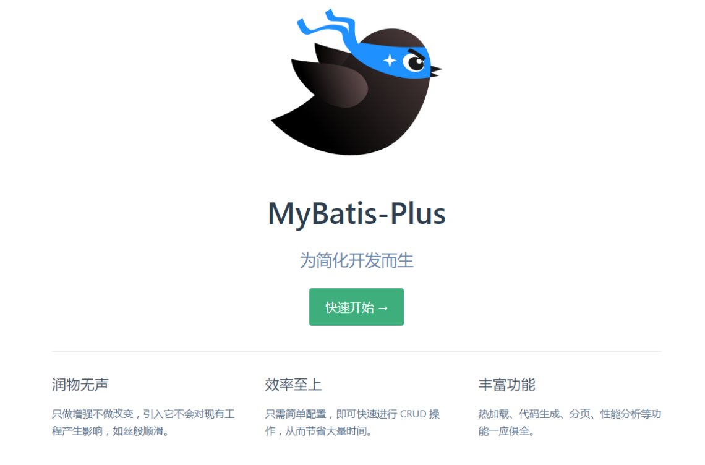

# MyBatis Plus

> 课程名称: [【狂神说Java】MyBatisPlus最新完整教程通俗易懂](https://www.bilibili.com/video/BV17E411N7KN)
>
> 课程概述:深入浅出的讲解了MyBatisPlus使用的全流程以及实战教学！
>
> 讲述人: B站-遇见狂神说(秦疆)

## 1. MybatisPlus概述

### 1.1 为什么要学习MyBatisPlus

为什么要学习它呢？MyBatisPlus可以节省我们大量工作时间，所有的CRUD代码它都可以自动化完成！JPA 、 tk-mapper、MyBatisPlus

MyBatisPlus在mybatis的基础上进行了简化,<u>偷懒的！</u>

### 1.2 MyBaitsPlus简介

MyBatis是什么？ MyBatis 本来就是简化 JDBC 操作的！

官网：https://mp.baomidou.com/ MyBatis Plus，简化 MyBatis ！




### 1.3 特性

**无侵入**：只做增强不做改变，引入它不会对现有工程产生影响，如丝般顺滑

**损耗小**：启动即会自动注入基本 CURD，性能基本无损耗，直接面向对象操作， BaseMapper

**强大的 CRUD 操作**：内置通用 Mapper、通用 Service，仅仅通过少量配置即可实现单表大部分CRUD 操作，更有强大的条件构器，满足各类使用需求, 以后简单的CRUD操作，它不用自己编写了！

**支持 Lambda 形式调用**：通过 Lambda 表达式，方便的编写各类查询条件，无需再担心字段写错

**支持主键自动生成**：支持多达 4 种主键策略（内含分布式唯一 ID 生成器 - Sequence），可自由配置，完美解决主键问题

**支持 ActiveRecord 模式**：支持 ActiveRecord 形式调用，实体类只需继承 Model 类即可进行强大的 CRUD 操作

**支持自定义全局通用操作**：支持全局通用方法注入（ Write once, use anywhere ）

**内置代码生成器**：采用代码或者 Maven 插件可快速生成 Mapper 、 Model 、 Service 、Controller 层代码，支持模板引擎，更有超多自定义配置等您来使用（自动帮你生成代码）

**内置分页插件**：基于 MyBatis 物理分页，开发者无需关心具体操作，配置好插件之后，写分页等同于普通 List 查询

**分页插件支持多种数据库**：支持 MySQL、MariaDB、Oracle、DB2、H2、HSQL、SQLite、Postgre、SQLServer 等多种数据库

**内置性能分析插件**：可输出 Sql 语句以及其执行时间，建议开发测试时启用该功能，能快速揪出慢查询

**内置全局拦截插件**：提供全表 delete 、 update 操作智能分析阻断，也可自定义拦截规则，预防误操作

## 2. MybatisPlus快速入门

地址：https://mp.baomidou.com/guide/quick-start.html#初始化工程

使用第三方组件：

1、导入对应的依赖

2、研究依赖如何配置

3、代码如何编写

4、提高扩展技术能力！

### 2.1 MyBatisPlus使用步骤

1. 创建数据库` mybatis_plus `

2. 创建user表

   ```sql
   DROP TABLE IF EXISTS user; 
   CREATE TABLE user ( 
       id BIGINT(20) NOT NULL COMMENT '主键ID', 
       name VARCHAR(30) NULL DEFAULT NULL COMMENT '姓名', 
       age INT(11) NULL DEFAULT NULL COMMENT '年龄', 
       email VARCHAR(50) NULL DEFAULT NULL COMMENT '邮箱', 
       PRIMARY KEY (id) 
   );
   INSERT INTO user (id, name, age, email) VALUES 
   (1, 'Jone', 18, 'test1@baomidou.com'), 
   (2, 'Jack', 20, 'test2@baomidou.com'), 
   (3, 'Tom', 28, 'test3@baomidou.com'), 
   (4, 'Sandy', 21, 'test4@baomidou.com'), 
   (5, 'Billie', 24, 'test5@baomidou.com'); 
   -- 真实开发中，version（乐观锁）、deleted（逻辑删除）、gmt_create、gmt_modified
   ```

3. 编写项目，初始化项目！使用SpringBoot初始化！

4. 导入依赖

   ```xml
   <!-- 数据库驱动 --> 
   <dependency> 
       <groupId>mysql</groupId> 
       <artifactId>mysql-connector-java</artifactId> 
   </dependency> 
   <!-- lombok --> 
   <dependency> 
       <groupId>org.projectlombok</groupId> 
       <artifactId>lombok</artifactId> 
   </dependency> 
   <!-- mybatis-plus  mybatis-plus 是自己开发，并非官方的！-->
   <dependency> 
       <groupId>com.baomidou</groupId> 
       <artifactId>mybatis-plus-boot-starter</artifactId> 
       <version>3.0.5</version> 
   </dependency>
   ```

   <span style="color:red">说明：我们使用 mybatis-plus 可以节省我们大量的代码，尽量不要同时导入 mybatis 和 mybatis-plus！会有版本的差异！</span>

5. 连接数据库！这一步和 mybatis 相同！

   ```properties
   server:
     port: 8081
   spring:
     datasource:
       username: root
       password: 1234
       # mysql 5 驱动不同 com.mysql.jdbc.Driver 
       # mysql 8 驱动不同com.mysql.cj.jdbc.Driver、需要增加时区的配置 ==> serverTimezone=GMT%2B8 
       url: jdbc:mysql://localhost:3306/qinjiang-mybatisplus-code?useSSL=false&useUnicode=true&characterEncoding=utf-8&serverTimezone=GMT%2B8 #
       driver-class-name: com.mysql.cj.jdbc.Driver
   ```

   ps: 传统方式pojo-dao（连接mybatis，配置mapper.xml文件）-service-controller

6. 使用了mybatis-plus 之后

   POJO

   ```java
   package cn.codexiyang.mybatisplus01base.entity;
   
   import lombok.Data;
   
   @Data
   public class User {
       private Long id;
       private String name;
       private Integer age;
    private String email;
   }

   ```
   
   mapper接口
   
   ```java
   package cn.codexiyang.mybatisplus01base.mapper;
   
   import cn.codexiyang.mybatisplus01base.entity.User;
   import com.baomidou.mybatisplus.core.mapper.BaseMapper;
   import org.springframework.stereotype.Repository;
   
   // 在对应的Mapper上面继承基本的类 BaseMapper
@Repository // 代表持久层
   public interface UserMapper extends BaseMapper<User> { //注意: 这里继承了MyBatisPlus中的 BaseMapper接口
    // 所有的CRUD操作都已经编写完成了
       // 你不需要像以前的配置一大堆文件了！
}
   ```
   
   注意点，我们需要在**主启动类**上去扫描我们的mapper包下的所有接口`@MapperScan("mapper接口的路径")`
   
   ```java
   @SpringBootApplication
   @MapperScan("cn.codexiyang.mybatisplus01base.mapper") //这是我的mapper接口的路径
   public class Mybatisplus01BaseApplication {
   
       public static void main(String[] args) {
           SpringApplication.run(Mybatisplus01BaseApplication.class, args);
       }
   
   }
   ```

   

   测试类中测试
   
   ```java
   @SpringBootTest 
   class MybatisPlusApplicationTests { 
       // 继承了BaseMapper，所有的方法都来自己父类 
       // 我们也可以编写自己的扩展方法！
       @Autowired 
       private UserMapper userMapper;
       @Test 
       void 
           contextLoads() { 
           // 参数是一个 Wrapper ，条件构造器，这里我们先不用 null 
           // 查询全部用户 
           List<User> users = userMapper.selectList(null); 
           users.forEach(System.out::println);
       }
   }
   ```
   
   测试结果
   
   

### 2.2 思考

1. SQL谁帮我们写的 ? : MyBatis-Plus 都写好了
2. 方法哪里来的？ : MyBatis-Plus 都写好了

### 2.3 配置日志

*我们所有的sql现在是不可见的，我们希望知道它是怎么执行的，所以我们必须要看日志！*

```properties
# 配置日志 
mybatis-plus.configuration.log-impl=org.apache.ibatis.logging.stdout.StdOutImpl
```

配置完毕日志之后，后面的学习就需要注意这个自动生成的SQL，你们就会喜欢上 MyBatis-Plus！

## 3. CRUD及其扩展

### 3.1 插入操作

```java
// 测试插入 
@Test 
public void testInsert(){ 
    User user = new User(); 
    user.setName("狂神说Java"); 
    user.setAge(3); 
    user.setEmail("24736743@qq.com"); 
    int result = userMapper.insert(user); // 帮我们自动生成id 
    System.out.println(result); // 受影响的行数 
    System.out.println(user); // 发现，id会自动回填 
}
```

**ps: 数据库插入的id的默认值为：全局的唯一id**

#### 1.1 主键生成策略

默认 ID_WORKER 全局唯一id

分布式系统唯一id生成：https://www.cnblogs.com/haoxinyue/p/5208136.html

**雪花算法：**

snowflflake是Twitter开源的分布式ID生成算法，结果是一个long型的ID。其核心思想是：使用41bit作为毫秒数，10bit作为机器的ID（5个bit是数据中心，5个bit的机器ID），12bit作为毫秒内的流水号（意味着每个节点在每毫秒可以产生
4096 个 ID），最后还有一个符号位，永远是0。可以保证几乎全球唯一！

**主键自增**

我们需要配置主键自增：

1. 实体类字段上 @TableId(type = IdType.AUTO)
2. 数据库字段一定要是自增！
3. 再次测试插入即可！

**其余的源码解释**

```java
public enum IdType { 
    AUTO(0), // 数据库id自增 
    NONE(1), // 未设置主键 
    INPUT(2), // 手动输入 
    ID_WORKER(3), // 默认的全局唯一id 
    UUID(4), // 全局唯一id 
    uuid ID_WORKER_STR(5); //ID_WORKER 字符串表示法 
}
```

### 3.2 更新操作

```java
// 测试更新
@Test 
public void testUpdate(){ 
    User user = new User(); // 通过条件自动拼接动态sql 
    user.setId(6L); 
    user.setName("关注公众号：狂神说"); 
    user.setAge(18); 
    // 注意：updateById 但是参数是一个 对象！ 
    int i = userMapper.updateById(user); 
    System.out.println(i); 
}
```

所有的sql都是自动帮你动态配置的！

#### 3.2.1 自动填充

创建时间、修改时间！这些个操作一遍都是自动化完成的，我们不希望手动更新！

阿里巴巴开发手册：所有的数据库表：gmt_create、gmt_modifified几乎所有的表都要配置上！而且需要自动化！

**方式一:数据库级别（工作中不允许你修改数据库）**

1. 在表中新增字段 create_time, update_time

2. 再次测试插入方法，我们需要先把实体类同步！

   ```java
   private Date createTime; 
   private Date updateTime;
   ```

3. 再次更新查看结果即可

**方式二：代码级别**

1. 删除数据库的默认值、更新操作！

2. 实体类字段属性上需要增加注解

   ```java
   // 字段添加填充内容 
   @TableField(fill = FieldFill.INSERT) 
   private Date createTime; 
   @TableField(fill = FieldFill.INSERT_UPDATE) 
   private Date updateTime;
   ```

3. 编写处理器来处理这个注解即可！

   ```java
   @Slf4j 
   @Component // 一定不要忘记把处理器加到IOC容器中！ 
   public class MyMetaObjectHandler implements MetaObjectHandler { 
       // 插入时的填充策略 
       @Override 
       public void insertFill(MetaObject metaObject) { 
           log.info("start insert fill....."); 
           // setFieldValByName(String fieldName, Object fieldVal, MetaObject metaObjectthis.setFieldValByName("createTime",new Date(),metaObject); this.setFieldValByName("updateTime",new Date(),metaObject); }// 更新时的填充策略 @Override public void updateFill(MetaObject metaObject) { log.info("start update fill....."); this.setFieldValByName("updateTime",new Date(),metaObject); } }
   ```

4. 测试插入

5. 测试更新、观察时间即可！

#### 3.2.2 乐观锁

在面试过程中，我们经常会被问道乐观锁，悲观锁！这个其实非常简单！

**乐观锁** : 故名思意十分乐观，它总是认为不会出现问题，无论干什么不去上锁！如果出现了问题，再次更新值测试

**悲观锁**：故名思意十分悲观，它总是认为总是出现问题，无论干什么都会上锁！再去操作！

我们这里主要讲解 乐观锁机制！

乐观锁实现方式：

- 取出记录时，获取当前 version
- 更新时，带上这个version
- 执行更新时， set version = newVersion where version = oldVersion
- 如果version不对，就更新失败

```sql
乐观锁：1、先查询，获得版本号 version = 1 
-- A 
update user set name = "kuangshen", version = version + 1 where id = 2 and version = 1 
-- B 线程抢先完成，这个时候 version = 2，会导致 A 修改失败！ 
update user set name = "kuangshen", version = version + 1 where id = 2 and version = 1
```

**测试一下MP的乐观锁插件**

1. 给数据库中增加version字段！

2. 我们实体类加对应的字段

   ```java
   @Version //乐观锁Version注解 
   private Integer version;
   ```

3. 注册组件

   ```java
   // 扫描我们的 mapper 文件夹 
   @MapperScan("com.kuang.mapper") 
   @EnableTransactionManagement 
   @Configuration // 配置类 
   public class MyBatisPlusConfig { 
       // 注册乐观锁插件
       @Bean public OptimisticLockerInterceptor optimisticLockerInterceptor() { 
           return new OptimisticLockerInterceptor();
       } 
   }
   ```

4. 测试一下！

   ```java
   // 测试乐观锁成功！ 
   @Test public void testOptimisticLocker(){ 
       // 1、查询用户信息 
       User user = userMapper.selectById(1L); 
       // 2、修改用户信息 
       user.setName("kuangshen"); 
       user.setEmail("24736743@qq.com"); 
       // 3、执行更新操作 
       userMapper.updateById(user); 
   }
   // 测试乐观锁失败！多线程下
   @Test public void testOptimisticLocker2(){ 
       // 线程 1 
       User user = userMapper.selectById(1L); 
       user.setName("kuangshen111"); 
       user.setEmail("24736743@qq.com"); 
       // 模拟另外一个线程执行了插队操作 
       User user2 = userMapper.selectById(1L); 
       user2.setName("kuangshen222"); 
       user2.setEmail("24736743@qq.com"); 
       userMapper.updateById(user2); // 自旋锁来多次尝试提交！ 
       userMapper.updateById(user); // 如果没有乐观锁就会覆盖插队线程的值！ 
   }
   ```

### 3.3 查询操作

```java
// 测试查询 
@Test public void testSelectById(){ 
    User user = userMapper.selectById(1L); 
    System.out.println(user); 
}
// 测试批量查询！
@Test public void testSelectByBatchId(){ 
    List<User> users = userMapper.selectBatchIds(Arrays.asList(1, 2, 3)); 
    users.forEach(System.out::println); 
}
// 按条件查询之一使用map操作 
@Test public void testSelectByBatchIds(){ 
    HashMap<String, Object> map = new HashMap<>(); 
    // 自定义要查询 
    map.put("name","狂神说Java"); 
    map.put("age",3);
    List<User> users = userMapper.selectByMap(map); 
    users.forEach(System.out::println); 
}
```

#### 3.3.1 分页操作

*分页在网站使用的十分之多！*

1、原始的 limit 进行分页

2、pageHelper 第三方插件

3、MP 其实也内置了分页插件！

**如何使用**

1. 配置拦截器组件即可

   ```java
   // 分页插件 
   @Bean public PaginationInterceptor paginationInterceptor() { 
       return new PaginationInterceptor(); 
   }
   ```

2. 直接使用Page对象即可！

   ```java
   // 测试分页查询 
   @Test public void testPage(){ 
       // 参数一：当前页 
       // 参数二：页面大小 
       // 使用了分页插件之后，所有的分页操作也变得简单的！ 
       Page<User> page = new Page<>(2,5); 
       userMapper.selectPage(page,null); 
       page.getRecords().forEach(System.out::println); 
       System.out.println(page.getTotal()); 
   }
   ```

### 3.4 删除操作

1. 根据 id 删除记录

   ```java
   // 测试删除 
   @Test public void testDeleteById(){ 
       userMapper.deleteById(1240620674645544965L); 
   }
   // 通过id批量删除 
   @Test public void testDeleteBatchId(){ 
       userMapper.deleteBatchIds(Arrays.asList(1240620674645544961L,124062067464554496 2L)); 
   }
   // 通过map删除 
   @Test public void testDeleteMap(){ 
       HashMap<String, Object> map = new HashMap<>(); 
       map.put("name","狂神说Java"); 
       userMapper.deleteByMap(map);
   }
   ```

   我们在工组中会遇到一些问题：逻辑删除！

#### 3.4.1 逻辑删除

*物理删除 ：从数据库中直接移除*

*逻辑删除 ：再数据库中没有被移除，而是通过一个变量来让他失效！ deleted = 0 => deleted = 1*

管理员可以查看被删除的记录！防止数据的丢失，类似于回收站！

测试一下：

1. 在数据表中增加一个 deleted 字段

2. 实体类中增加属性

   ```java
   @TableLogic //逻辑删除 
   private Integer deleted;
   ```

3. 配置！

   ```java
   // 逻辑删除组件！
   @Bean 
   public ISqlInjector sqlInjector() { 
       return new LogicSqlInjector(); 
   }
   ```

   ```properties
   # 配置逻辑删除 
   mybatis-plus.global-config.db-config.logic-delete-value=1 
   mybatis-plus.global-config.db-config.logic-not-delete-value=0
   ```

4. 测试一下删除！

   记录依旧在数据库，但是值确已经变化了！

### 3.5 性能分析插件

*我们在平时的开发中，会遇到一些慢sql。测试！ druid,,,,,*

作用：性能分析拦截器，用于输出每条 SQL 语句及其执行时间

MP也提供性能分析插件，如果超过这个时间就停止运行！

1. 导入插件

   ```java
   /** * SQL执行效率插件 */
   @Bean 
   @Profile({"dev","test"})// 设置 dev test 环境开启，保证我们的效率 
   public PerformanceInterceptor performanceInterceptor() { 
       PerformanceInterceptor performanceInterceptor = new PerformanceInterceptor(); 
       performanceInterceptor.setMaxTime(100); 
       // ms设置sql执行的最大时间，如果超过了则不 执行 
       performanceInterceptor.setFormat(true); 
       // 是否格式化代码 
       return performanceInterceptor; 
   }
   ```

   记住，要在SpringBoot中配置环境为dev或者 test 环境！

2. 测试使用！

   ```java
   @Test 
   void contextLoads() { 
       // 参数是一个 Wrapper ，条件构造器，这里我们先不用 null 
       // 查询全部用户 
       List<User> users = userMapper.selectList(null); 
       users.forEach(System.out::println); 
   }
   ```


   使用性能分析插件，可以帮助我们提高效率！

### 3.6 条件构造器

*十分重要：Wrapper*

我们写一些复杂的sql就可以使用它来替代！

1. 测试一，记住查看输出的SQL进行分析

   ```java
   @Test 
   void contextLoads() { 
       // 查询name不为空的用户，并且邮箱不为空的用户，年龄大于等于12 
       QueryWrapper<User> wrapper = new QueryWrapper<>(); 
       wrapper .isNotNull("name") .isNotNull("email") .ge("age",12); 
       userMapper.selectList(wrapper).forEach(System.out::println); 
       // 和我们刚才学习 的map对比一下 
   }
   ```


2. 测试二，记住查看输出的SQL进行分析

   ```java
   @Test 
   void test2(){ 
       // 查询名字狂神说 
       QueryWrapper<User> wrapper = new QueryWrapper<>(); 
       wrapper.eq("name","狂神说"); 
       User user = userMapper.selectOne(wrapper); // 查询一个数据，出现多个结果使用List 或者 Map 
       System.out.println(user); 
   }
   ```

3. 测试三，记住查看输出的SQL进行分析

   ```java
   @Test 
   void test3(){ 
       // 查询年龄在 20 ~ 30 岁之间的用户 
       QueryWrapper<User> wrapper = new QueryWrapper<>(); 
       wrapper.between("age",20,30); // 区间 
       Integer count = userMapper.selectCount(wrapper); // 查询结果数 
       System.out.println(count); 
   }
   ```

4. 测试四，记住查看输出的SQL进行分析

   ```java
   // 模糊查询 
   @Test 
   void test4(){ 
       // 查询年龄在 20 ~ 30 岁之间的用户 
       QueryWrapper<User> wrapper = new QueryWrapper<>(); 
       // 左和右 t% 
       wrapper 
           .notLike("name","e") 
           .likeRight("email","t"); 
       List<Map<String, Object>> maps = userMapper.selectMaps(wrapper); 
       maps.forEach(System.out::println); 
   }
   ```

5. 测试五

   ```java
   // 模糊查询 
   @Test 
   void test5(){ 
       QueryWrapper<User> wrapper = new QueryWrapper<>(); // id 在子查询中查出来 
       wrapper.inSql("id","select id from user where id<3");
       List<Object> objects = userMapper.selectObjs(wrapper); 
       objects.forEach(System.out::println); 
   }
   ```

6. 测试六

   ```java
   //测试六 
   @Test 
   void test6(){ 
       QueryWrapper<User> wrapper = new QueryWrapper<>(); 
       // 通过id进行排序 
       wrapper.orderByAsc("id"); 
       List<User> users = userMapper.selectList(wrapper); 
       users.forEach(System.out::println); 
   }
   ```


   


### 3.7 代码自动生成器

*有了代码生成器,我们不需要去编写dao、pojo、service、controller,所有的事情都交给mybatisplus去帮我编写完成！*

AutoGenerator 是 MyBatis-Plus 的代码生成器，通过 AutoGenerator 可以快速生成 Entity、Mapper、Mapper XML、Service、Controller 等各个模块的代码，极大的提升了开发效率。

```java
// 代码自动生成器 
public class KuangCode {
    public static void main(String[] args) { 
        // 需要构建一个 代码自动生成器 对象 
        AutoGenerator mpg = new AutoGenerator(); 
        // 配置策略 
        // 1、全局配置 
        GlobalConfig gc = new GlobalConfig(); 
        String projectPath = System.getProperty("user.dir"); 
        gc.setOutputDir(projectPath+"/src/main/java"); 
        gc.setAuthor("狂神说"); 
        gc.setOpen(false); 
        gc.setFileOverride(false); 
        // 是否覆盖 
        gc.setServiceName("%sService"); 
        // 去Service的I前缀 
        gc.setIdType(IdType.ID_WORKER); 
        gc.setDateType(DateType.ONLY_DATE); 
        gc.setSwagger2(true); 
        mpg.setGlobalConfig(gc); 
        //2、设置数据源 
        DataSourceConfig dsc = new DataSourceConfig(); 
        dsc.setUrl("jdbc:mysql://localhost:3306/kuang_community? useSSL=false&useUnicode=true&characterEncoding=utf-8&serverTimezone=GMT%2B8"); 
        dsc.setDriverName("com.mysql.cj.jdbc.Driver"); 
        dsc.setUsername("root"); 
        dsc.setPassword("123456"); 
        dsc.setDbType(DbType.MYSQL); 
        mpg.setDataSource(dsc); 
        //3、包的配置 
        PackageConfig pc = new PackageConfig(); 
        pc.setModuleName("blog"); 
        pc.setParent("com.kuang"); 
        pc.setEntity("entity"); 
        pc.setMapper("mapper"); 
        pc.setService("service"); 
        pc.setController("controller"); 
        mpg.setPackageInfo(pc); 
        //4、策略配置 
        StrategyConfig strategy = new StrategyConfig(); 
        strategy.setInclude("blog_tags","course","links","sys_settings","user_record"," user_say"); // 设置要映射的表名 
        strategy.setNaming(NamingStrategy.underline_to_camel); 
        strategy.setColumnNaming(NamingStrategy.underline_to_camel); 
        strategy.setEntityLombokModel(true); // 自动lombok； 
        strategy.setLogicDeleteFieldName("deleted"); // 自动填充配置 
        TableFill gmtCreate = new TableFill("gmt_create", FieldFill.INSERT); 
        TableFill gmtModified = new TableFill("gmt_modified", FieldFill.INSERT_UPDATE); 
        ArrayList<TableFill> tableFills = new ArrayList<>(); tableFills.add(gmtCreate); 
        tableFills.add(gmtModified); 
        strategy.setTableFillList(tableFills); // 乐观锁 
        strategy.setVersionFieldName("version");
        strategy.setRestControllerStyle(true);
        strategy.setControllerMappingHyphenStyle(true); // localhost:8080/hello_id_2 mpg.setStrategy(strategy); 
        mpg.execute(); //执行 
    } 
}
```

测试结果


