# Docker基础

> 课程名称:  [【狂神说Java】Docker最新超详细版教程通俗易懂](https://www.bilibili.com/video/BV1og4y1q7M4)
>
> 课程概述:
>
> - 从Docker历史，概念，到命令的详解 从使用到深入原理和网络，大量的实战
> - Docker Compose 、DockerSwarm及学习方法的分享。
>
> 讲述人: B站-遇见狂神说
>
> 学前准备:
>
> 1. 会一点Linux基础
> 2. 最好会springboot,会有项目做部署

## 第 1 章: Docker概述

### 1.1 Docker为什么出现

一款产品从开发到上线，从操作系统，到运行环境，再到应用配置。作为开发+运维之间的协作我们需要关心很多东西，这也是很多互联网公司都不得不面对的问题，特别是各种版本的迭代之后，不同版本环境的兼容，对运维人员是极大的考验！

---

环境配置如此麻烦，换一台机器，就要重来一次，费力费时。很多人想到，能不能从根本上解决问题，软件可以带环境安装？也就是说，安装的时候，把原始环境一模一样地复制过来。解决开发人员说的“ 在我的机器上可正常工作”的问题。

---

之前在服务器配置一个应用的运行环境，要安装各种软件，就拿一个基本的工程项目的环境来说吧，Java/Tomcat/MySQL/JDBC驱动包等。安装和配置这些东西有多麻烦就不说了，它还不能跨平台。假如我们是在 Windows
上安装的这些环境，到了 Linux 又得重新装。况且就算不跨操作系统，换另一台同样操作系统的服务器，要移植应用也是非常麻烦的。

---

传统上认为，软件编码开发/测试结束后，所产出的成果即是程序或是能够编译执行的二进制字节码文件等（Java为例）。而为了让这些程序可以顺利执行，开发团队也得准备完整的部署文件，让维运团队得以部署应用程式，开发需要清楚的告诉运维部署团队，用的全部配置文件所有软件环境。不过，即便如此，仍然常常发生部署失败的状况。

---

Docker之所以发展如此迅速，也是因为它对此给出了一个标准化的解决方案。

---

Docker镜像的设计，使得Docker得以打破过去「程序即应用」的观念。通过Docker镜像 ( images ) 将应用程序所需要的系统环境，由下而上打包，达到应用程序跨平台间的无缝接轨运作。

---


Docker的思想来自于集装箱，集装箱解决了什么问题？在一艘大船上，可以把货物规整的摆放起来。并且各种各样的货物被集装箱标准化了，集装箱和集装箱之间不会互相影响。那么我就不需要专门运送水果的船和专门运送化学品的船了。只要这些货物在集装箱里封装的好好的，那我就可以用一艘大船把他们都运走。Docker的思想来自于集装箱，集装箱解决了什么问题？在一艘大船上，可以把货物规整的摆放起来。并且各种各样的货物被集装箱标准化了，集装箱和集装箱之间不会互相影响。那么我就不需要专门运送水果的船和专门运送化学品的船了。只要这些货物在集装箱里封装的好好的，那我就可以用一艘大船把他们都运走。

*本质: 所有的技术都是因为出了一些问题,我们需要去解决,才去学习!!*

### 1.2 Docker的历史

2010年，几个搞IT的年轻人，在美国旧金山成立了一家名叫 **dotCloud**
的公司。这家公司主要提供基于PaaS的云计算技术服务。具体来说，是和LXC有关的容器技术。后来，dotCloud公司将自己的容器技术进行了简化和标准化，并命名为——**Docker**
。Docker技术诞生之后，并没有引起行业的关注。而dotCloud公司，作为一家小型创业企业，在激烈的竞争之下，也步履维艰。正当他们快要坚持不下去的时候，脑子里蹦出了“开源”的想法。什么是“开源”？开源，就是开放源代码。也就是将原来内部保密的程序源代码开放给所有人，然后让大家一起参与进来，贡献代码和意见。有的软件是一开始就开源的。也有的软件，是混不下去，创造者又不想放弃，所以选择开源。自己养不活，就吃“百家饭”嘛。

---

2013年3月，dotCloud公司的创始人之一，Docker之父，28岁的**Solomon Hykes**
正式决定，将Docker项目开源。不开则已，一开惊人。越来越多的IT工程师发现了Docker的优点，然后蜂拥而至，加入Docker开源社区。Docker的人气迅速攀升，速度之快，令人瞠目结舌。开源当月，Docker 0.1
版本发布。此后的每一个月，Docker都会发布一个版本。到2014年6月9日，Docker 1.0 版本正式发布。

---

此时的Docker，已经成为行业里人气最火爆的开源技术，没有之一。甚至像Google、微软、Amazon、VMware这样的巨头，都对它青睐有加，表示将全力支持。Docker和容器技术为什么会这么火爆？说白了，就是因为它“轻”。

---

在容器技术之前，业界的网红是**虚拟机**。虚拟机技术的代表，是**VMWare**和**OpenStack**
。相信很多人都用过虚拟机。虚拟机，就是在你的操作系统里面，装一个软件，然后通过这个软件，再模拟一台甚至多台“子电脑”出来。在“子电脑”里，你可以和正常电脑一样运行程序，例如开QQ。如果你愿意，你可以变出好几个“子电脑”，里面都开上QQ。“子电脑”和“子电脑”之间，是**
相互隔离**的，互不影响。

---

Docker为什么这么火?虚拟机属于虚拟化技术。而Docker这样的容器技术，也是虚拟化技术，Docker属于**轻量级的虚拟化**
。虚拟机虽然可以隔离出很多“子电脑”，但占用空间更大，启动更慢，虚拟机软件可能还要花钱（例如VMWare）。而容器技术恰好没有这些缺点。它不需要虚拟出整个操作系统，只需要虚拟一个小规模的环境（类似“沙 箱”）。

---

它启动时间很快，几秒钟就能完成。而且，它对资源的利用率很高（一台主机可以同时运行几千个Docker容器）。此外，它占的空间很小，虚拟机一般要几GB到几十GB的空间，而容器只需要MB级甚至KB级。正因为如此，容器技术受到了热烈的欢迎和追捧，发展迅速。

### 1.3 Docker的理念

**Docker是基于Go语言实现的云开源项目。**

Docker的主要目标是“Build，Ship and Run Any App ,
Anywhere”，也就是通过对应用组件的封装、分发、部署、运行等生命周期的管理，使用户的APP（可以是一个WEB应用或数据库应用等等）及其运行环境能够做到“一次封装，到处运行”。Linux 容器技术的出现就解决了这样一个问题，而
Docker 就是在它的基础上发展过来的。将应用运行在Docker 容器上面，而 Docker 容器在任何操作系统上都是一致的，这就实现了跨平台、跨服务器。只需要一次配置好环境，换到别的机子上就可以一键部署好，大大简化了操作。

### 1.4 Docker能干嘛

#### 之前的虚拟机技术

虚拟机（virtual machine）就是带环境安装的一种解决方案。它可以在一种操作系统里面运行另一种操作系统，比如在Windows 系统里面运行Linux
系统。应用程序对此毫无感知，因为虚拟机看上去跟真实系统一模一样，而对于底层系统来说，虚拟机就是一个普通文件，不需要了就删掉，对其他部分毫无影响。这类虚拟机完美的运行了另一套系统，能够使应用程序，操作系统和硬件三者之间的逻辑不变。

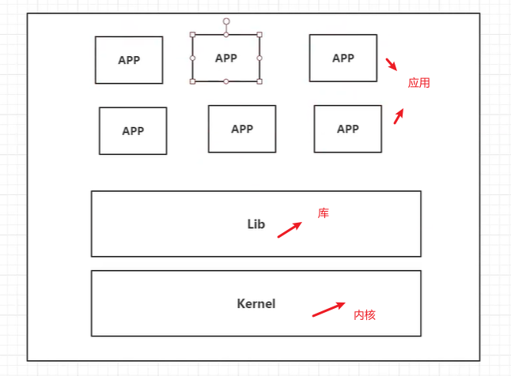

**虚拟机的缺点：** ①资源占用多 ②冗余步骤多 ③启动慢

#### 容器虚拟化技术

*容器化技术不是模拟的一个完整的操作系统!*

由于前面虚拟机存在这些缺点，Linux 发展出了另一种虚拟化技术：Linux 容器（Linux Containers，缩写为 LXC）。Linux
容器不是模拟一个完整的操作系统，而是对进程进行隔离。有了容器，就可以将软件运行所需的所有资源打包到一个隔离的容器中。容器与虚拟机不同，不需要捆绑一整套操作系统，只需要软件工作所需的库资源和设置。系统因此而变得高效轻量并保证部署在任何环境中的软件都能始终如一地运行。

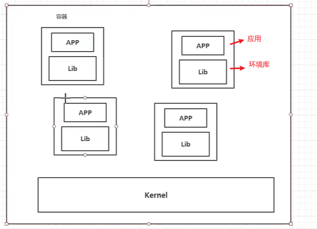

**比较了 Docker 和传统虚拟化方式的不同之处：**

1. 传统虚拟机技术是虚拟出一套硬件后，在其上运行一个完整操作系统，在该系统上再运行所需应用进程；
2. 而容器内的应用进程直接运行于宿主的内核，容器内没有自己的内核，而且也没有进行硬件虚拟。因此容器要比传统虚拟机更为轻便。
3. 每个容器之间互相隔离，<span style="color:red">每个容器有自己的文件系统 ，容器之间进程不会相互影响，能区分计算资源</span>。

### 1.5 开发/运维（DevOps）

*DevOps表示开发运维一体了,开发项目,运维项目,部署项目!*

**更快速的应用交付和部署：**

传统的应用开发完成后，需要提供一堆安装程序和配置说明文档，安装部署后需根据配置文档进行繁杂的配置才能正常运行。Docker化之后只需要交付少量容器镜像文件，在正式生产环境加载镜像并运行即可，应用安装配置在镜像里已经内置好，大大节省部署配置和测试验证时间。

---

**更便捷的升级和扩缩容：**

随着微服务架构和Docker的发展，大量的应用会通过微服务方式架构，应用的开发构建将变成搭乐高积木一样，每个Docker容器将变成一块“积木”，应用的升级将变得非常容易。当现有的容器不足以支撑业务处理时，可通过镜像运行新的容器进行快速扩容，使应用系统的扩容从原先的天级变成分钟级甚至秒级。

---

**更简单的系统运维：**

应用容器化运行后，生产环境运行的应用可与开发、测试环境的应用高度一致，容器会将应用程序相关的环境和状态完全封装起来，不会因为底层基础架构和操作系统的不一致性给应用带来影响，产生新的BUG。当出现程序异常时，也可以通过测试环境的相同容器进行快速定位和修复。

---

**更高效的计算资源利用：**

*Docker可以将服务器的性能压榨到极致!*

Docker是内核级虚拟化，其不像传统的虚拟化技术一样需要额外的Hypervisor [管理程序] 支持，所以在一台物理机上可以运行很多个容器实例，可大大提升物理服务器的CPU和内存的利用率。

### 1.6 Docker学习途径

Docker官网：http://www.docker.com

Docker中文网站：https://www.docker-cn.com

Docker Hub官网：https://hub.docker.com （仓库）

Docker文档地址: https://docs.docker.com

*Docker官方文档在官网底部的docs,如下图:*


## 第 2 章: Docker安装

### 2.1 Docker的基本组成

docker由 镜像, 容器,仓库

#### Docker的架构图

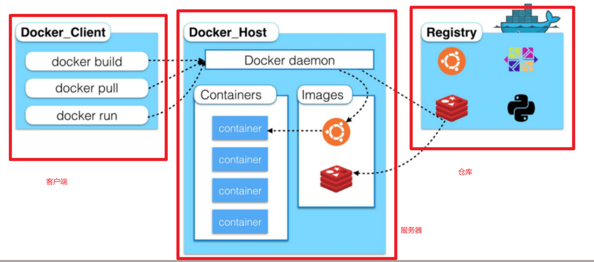

#### 镜像(image)

Docker 镜像（Image）就是一个**只读的模板**。

镜像可以用来创建 Docker 容器，一个镜像可以创建很多容器。

最终的服务运行或者项目运行就是在容器中进行的.

#### 容器(container)

Docker 利用容器（Container）独立运行的一个或一组应用。容器是用镜像创建的运行实例。 它可以被启动、开始、停止、删除。每个容器都是相互隔离的，保证安全的平台。

可以把容器看做是一个简易版的 Linux 环境（包括root用户权限、进程空间、用户空间和网络空间等） 和运行在其中的应用程序。 容器的定义和镜像几乎一模一样，也是一堆层的统一视角，唯一区别在于容器的最上面那一层是可读可写 的。

**Docker镜像与容器的关系就像java中类与对象的关系:**

- 镜像可以理解为Java 中的 类(模板)
- 容器可以理解为对象

#### 仓库(repository)

仓库（Repository）是集中存放镜像文件的场所。

仓库(Repository)和仓库注册服务器（Registry）是有区别的。

仓库注册服务器上往往存放着多个仓 库，每个仓库中又包含了多个镜像，每个镜像有不同的标签（tag）。

仓库分为公开仓库（Public）和私有仓库（Private）两种形式。

最大的公开仓库是 Docker Hub(https://hub.docker.com/)，存放了数量庞大的镜像供用户下载。

国内的公开仓库包括阿里云 、网易云 等

#### 小结

1. Docker 本身是一个容器运行载体或称之为管理引擎。我们把应用程序和配置依赖打包好形成一个可交付的运行环境，这个打包好的运行环境就似乎 image镜像文件。只有通过这个镜像文件才能生成 Docker 容器。image
   文件可以看作是容器的模板。Docker 根据 image 文件生成容器的实例。同一个 image 文件，可以生成多个同时运行的容器实例。
2. image 文件生成的容器实例，本身也是一个文件，称为镜像文件。
3. 一个容器运行一种服务，当我们需要的时候，就可以通过docker客户端创建一个对应的运行实例，也就是我们的容器
4. 至于仓库，就是放了一堆镜像的地方，我们可以把镜像发布到仓库中，需要的时候从仓库中拉下来就可以了。

### 2.2 环境说明

> 我们使用的是 CentOS 7 (64-bit)目前，CentOS 仅发行版本中的内核支持 Docker。
>
> Docker 运行在 CentOS 7 上，要求系统为64位、系统内核版本为 3.10 以上。

**查看自己的内核：**

`uname -r`命令用于打印当前系统相关信息（内核版本号、硬件架构、主机名称和操作系统类型等）。

```shell
# 系统内核是3.10以上的
[root@xiyang ~]# uname -r
3.10.0-957.21.3.el7.x86_64
```

**查看版本信息：**

`cat /etc/os-release`

```shell
[root@xiyang ~]# cat /etc/os-release
NAME="CentOS Linux"
VERSION="7 (Core)"
ID="centos"
ID_LIKE="rhel fedora"
VERSION_ID="7"
PRETTY_NAME="CentOS Linux 7 (Core)"
ANSI_COLOR="0;31"
CPE_NAME="cpe:/o:centos:centos:7"
HOME_URL="https://www.centos.org/"
BUG_REPORT_URL="https://bugs.centos.org/"

CENTOS_MANTISBT_PROJECT="CentOS-7"
CENTOS_MANTISBT_PROJECT_VERSION="7"
REDHAT_SUPPORT_PRODUCT="centos"
REDHAT_SUPPORT_PRODUCT_VERSION="7"
```

### 2.3 安装步骤

#### 安装前准备

- 官网安装参考手册：https://docs.docker.com/engine/install/centos/

- 确定你是CentOS7及以上版本

- yum安装gcc相关环境（需要确保 虚拟机可以上外网 ）

  ```shell
  yum -y install gcc 
  yum -y install gcc-c++
  ```

#### docker的安装&卸载

1. 卸载旧版本(如果你之前安装了docker需要卸载)

   ```shell
   # 1. 卸载旧版本的docker
   sudo yum remove docker \
                     docker-client \
                     docker-client-latest \
                     docker-common \
                     docker-latest \
                     docker-latest-logrotate \
                     docker-logrotate \
                     docker-engine
   ```

2. 安装Docker需要的安装包

   ```shell
   yum install -y yum-utils
   ```

3. 设置镜像仓库

   *这里我们使用的是阿里仓库,也可以使用其他的*

   ```shell
   # 正确推荐使用国内的阿里云镜像
   sudo yum-config-manager \
       --add-repo \
       http://mirrors.aliyun.com/docker-ce/linux/centos/docker-ce.repo
   ```

   ```shell
   # 不推荐使用国外的镜像,较慢
   sudo yum-config-manager \
   	--add-repo \
   	https://download.docker.com/linux/centos/docker-ce.repo 
   ## 报错 [Errno 14] curl#35 - TCP connection reset by peer [Errno 12] curl#35 - Timeout 
   
   
   ```

4. 更新yum软件包索引

   ```shell
   yum makecache fast
   ```

5. 安装docker相关的内容( Docker CE社区版的Docker)

   ```shell
   # docker-ce: 社区版, ee是企业版的 , 官方推荐使用社区版
   sudo yum install docker-ce docker-ce-cli containerd.io
   # 后续安装需要输入几次y
   ```

6. 启动 Docker

   ```shell
   systemctl start docker
   ```

7. 测试命令

   *docker安装成功后,测试docker是否可以运行*

   ```shell
   # 方式一: 查看docker版本
   docker version 
   
   # 方式二: 使用docker运行hello-world
   docker run hello-world 
   
   # docker的镜像 这里会有hellop-world的镜像
   docker images
   ```

   ```shell
   # 安装成功后下面的命令是可以正常运行的表明docker已经正常启动
   # 启动docker容器
   [root@xiyang ~]# systemctl start docker
   # 查看docker的版本
   [root@xiyang ~]# docker version
   # 查看docker的进程
   [root@xiyang ~]# docker ps
   CONTAINER ID   IMAGE     COMMAND   CREATED   STATUS    PORTS     NAMES
   # 运行hello-world(检验docker是否安装成功)
   docker run hello-world
   # 查看hello-world的镜像,会有一个hello-word镜像
   docker images
   ```

8. 卸载docker

   ```shell
   # 卸载docker之前先关闭docker
   # 停止docker
   systemctl stop docker 
   # 删除docker相关内容
   yum -y remove docker-ce docker-ce-cli containerd.io 
   # 删除docker文件夹  docker的默认工作路径:/var/lib/docker
   rm -rf /var/lib/docker
   ```

### 2.4 阿里云镜像加速

*阿里云控制台配置后更快*

1. 进入阿里云控制台找到镜像加速器

   

   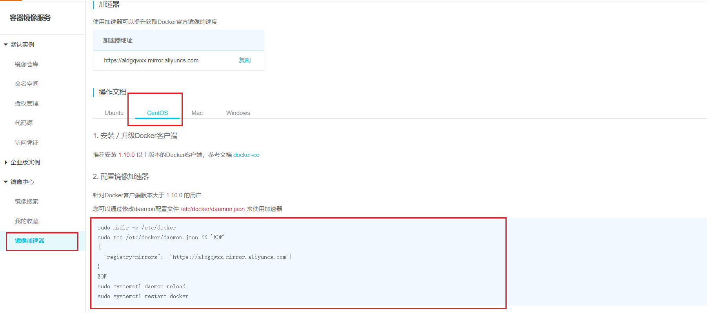

2. *配置镜像加速*

   ```shell
   # 创建一个目录
   sudo mkdir -p /etc/docker
   # 在上面目录下的json中配置一个阿里云的地址
   sudo tee /etc/docker/daemon.json <<-'EOF'
   {
     "registry-mirrors": ["https://aldgqwxx.mirror.aliyuncs.com"]
   }
   EOF
   # 重启镜像
   sudo systemctl daemon-reload
   # 重启docker
   sudo systemctl restart docker
   ```

### 2.5 镜像执行流程

通过前面的docker image查看到了hello-world镜像,以此为例子,了解docker运行镜像的大致流程

```shell
docker run hello-world
```

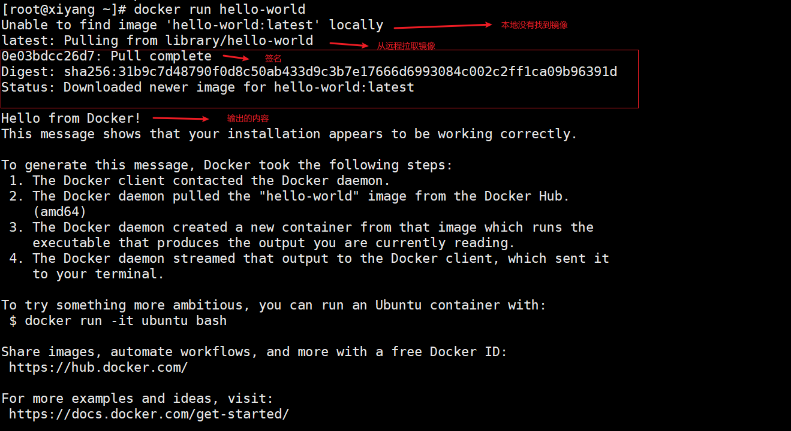

docker运行镜像的流程分析图:


### 2.6 docker运行原理

*Docker是如何工作的?*

Docker是一个Client-Server结构的系统,Docker的守护进程运行在主机上,通过Socket从客户端访问

DockerServer接收到Docker-Client的指令,就会执行这个命令


### 2.7 Docker为什么比虚拟机快

1. Docker有着比虚拟机更少的抽象层。

   

2. docker利用的是宿主机的内核，vm需要是Guest OS.

   所以说，新建一个容器的时候，docker不需要想虚拟机一样重新加载一个操作系统内核，避免一些引导操作。

   虚拟机是加载Guest OS，<u>分钟</u>级启动

   而docker是利用宿主机的操作系统，省略了这个复杂的过程，<u>秒级</u>启动

**docker与虚拟机对比**

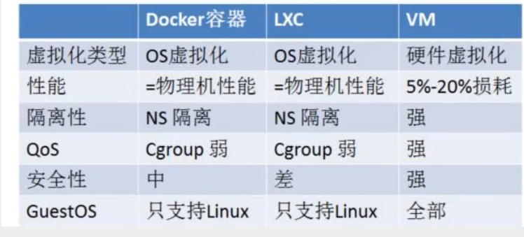

## 第 3 章: Docker常用命令

### 3.1 Docker帮助命令

```shell
# 显示 Docker 版本信息。 
docker version 

# 显示 Docker 系统信息，包括镜像和容器数量。
docker info 

# docker所有的帮助命令
docker --help 

# docker某个指定命令的帮助命令
docker 命令 --help 
#例如
docker run --help # docker 的run帮助命令
```

*[docker命令文档地址](https://docs.docker.com/engine/reference/commandline/)*

### 3.2 镜像(类)命令

#### docker images

`docker images`用于显示本地镜像

```shell
# 查询本地主机上的所有镜像 
[root@xiyang ~]# docker images
REPOSITORY    TAG       IMAGE ID       CREATED         SIZE
hello-world   latest    bf756fb1ae65   11 months ago   13.3kB
```

```shell
# 解释 
# REPOSITORY 镜像的仓库源 ; 下载与运行都可以通过这个名字进行 
# TAG 镜像的标签 
# IMAGE ID 镜像的ID 
# CREATED 镜像创建时间 
# SIZE 镜像大小 

# 同一个仓库源可以有多个 TAG，代表这个仓库源的不同版本，我们使用REPOSITORY：TAG 定义不同 的镜像，如果你不定义镜像的标签版本，docker将默认使用 lastest 镜像！ 
```

`docker images [可选项]`

```shell
# 可选项 
# -a： 显示出本地所有镜像 
docker images -a
# -q： 显示出本地所有镜像镜像id 
docker images -q
# -a和-q可以一起使用 表示显示本地所有镜像的id
docker images -aq
# --digests： 显示镜像的摘要信息
docker images --digests
```

#### docker search

`docker search 镜像名` 根据镜像名搜索远程仓库对应的镜像

```shell
# 搜索镜像(搜索mysql的镜像)
# docker search 某个镜像的名称 对应DockerHub仓库中的镜像 
[root@xiyang ~]# docker search mysql
NAME                              DESCRIPTION                                     STARS     OFFICIAL   AUTOMATED
mysql                             MySQL is a widely used, open-source relation…   10269     [OK]       
mariadb                           MariaDB is a community-developed fork of MyS…   3794      [OK]       
mysql/mysql-server                Optimized MySQL Server Docker images. Create…   749                  [OK]
percona                           Percona Server is a fork of the MySQL relati…   515       [OK]       
centos/mysql-57-centos7           MySQL 5.7 SQL database server                   86                   
...
```

`docker search [可选项]` 可以跟一些可选项

```shell
# 可选项 
# --filter=stars=5000 ： 列出收藏数不小于指定值的镜像。
[root@xiyang ~]# docker search mysql --filter=stars=5000;
NAME      DESCRIPTION                                     STARS     OFFICIAL   AUTOMATED
mysql     MySQL is a widely used, open-source relation…   10269     [OK]  
```

#### docker pull

`docker pull 镜像名` 根据镜像名从远程仓库拉取指定的镜像到本地仓库

```shell
# 下载mysql镜像 
[root@xiyang ~]# docker pull mysql
Using default tag: latest # 如果不写tag(版本),会下载所有,默认使用最后一个latest
latest: Pulling from library/mysql
6ec7b7d162b2: Pull complete # 分层下载,docker images的核心 ,只会下载不存在的镜像
fedd960d3481: Pull complete 
7ab947313861: Pull complete 
64f92f19e638: Pull complete 
3e80b17bff96: Pull complete 
014e976799f9: Pull complete 
59ae84fee1b3: Pull complete 
ffe10de703ea: Pull complete 
657af6d90c83: Pull complete 
98bfb480322c: Pull complete 
9f2c4202ac29: Pull complete 
a369b92bfc99: Pull complete 
Digest: sha256:365e891b22abd3336d65baefc475b4a9a1e29a01a7b6b5be04367fcc9f373bb7 # 签名信息防伪标志
Status: Downloaded newer image for mysql:latest
docker.io/library/mysql:latest # 真实地址
# docker pull mysql <==等价于==> docker pull docker.io/library/mysql:latest
```

`docker pull 镜像名[:tag]` 指定版本下载镜像

```shell
# 指定版本下载 
[root@xiyang ~]# docker pull mysql:5.7
5.7: Pulling from library/mysql
6ec7b7d162b2: Already exists 
fedd960d3481: Already exists 
7ab947313861: Already exists 
64f92f19e638: Already exists 
3e80b17bff96: Already exists 
014e976799f9: Already exists 
59ae84fee1b3: Already exists 
7d1da2a18e2e: Pull complete 
301a28b700b9: Pull complete 
979b389fc71f: Pull complete 
403f729b1bad: Pull complete 
Digest: sha256:d4ca82cee68dce98aa72a1c48b5ef5ce9f1538265831132187871b78e768aed1
Status: Downloaded newer image for mysql:5.7
docker.io/library/mysql:5.7
```

#### docker rmi

`docker rmi 镜像名` 删除指定的镜像

注意: 需要在容器停止后才可以删除镜像,否则会报错

```shell
# 删除镜像 
docker rmi -f 镜像id # 删除单个镜像 
docker rmi -f 镜像名:tag 镜像名:tag # 删除多个 
docker rmi -f $(docker images -aq) # 删除全部(递归删除)
```

```shell
# 删除指定id的镜像
[root@xiyang ~]# docker images
REPOSITORY    TAG       IMAGE ID       CREATED         SIZE
mysql         5.7       697daaecf703   4 days ago      448MB
mysql         latest    ab2f358b8612   4 days ago      545MB
hello-world   latest    bf756fb1ae65   11 months ago   13.3kB
[root@xiyang ~]# docker rmi -f 697daaecf703
Untagged: mysql:5.7
Untagged: mysql@sha256:d4ca82cee68dce98aa72a1c48b5ef5ce9f1538265831132187871b78e768aed1
Deleted: sha256:697daaecf703e82e8755034e816282fc3e912151b7818c85af8647fdcdcee517
Deleted: sha256:5214ea7c0bfb5429533d91b143604067a50042ae7b371dddb6ae53baadd3f7ef
Deleted: sha256:e9082a53da66fba9c49f51580500919310a36722cc4d3eb0c78e7000ad058655
Deleted: sha256:8615ae1ee613441540ee54a2c517eb0600a6c83667a79f7ca74acc9ffec4c9a4
Deleted: sha256:252efab3ecb7891820c5a340645044850d6edc7815c6588450d74b0a743424f4
[root@xiyang ~]# docker images
REPOSITORY    TAG       IMAGE ID       CREATED         SIZE
mysql         latest    ab2f358b8612   4 days ago      545MB
hello-world   latest    bf756fb1ae65   11 months ago   13.3kB
```

```shell
# 删除所有的镜像
[root@xiyang ~]# docker rmi -f $(docker images -aq)
...
...
[root@xiyang ~]# docker images
REPOSITORY   TAG       IMAGE ID   CREATED   SIZE
```

### 3.3 容器(对象)命令

**说明**：有镜像才能创建容器，我们这里使用 centos 的镜像来测试，就是虚拟一个 centos ！

```shell
# 通过docker下载centos
[root@xiyang ~]# docker pull centos
```

#### docker run

先有镜像,然后通过docker run 镜像之后,此时就是容器了;

docker run的意思就是新建容器并启动

```shell
# 命令 
docker run [可选参数] IMAGE [COMMAND][ARG...] # docker run -it centos /bin/bash
docker run [可选参数] CONTAINER ID # docker run -it 300e315adb2f
# 常用参数说明 
--name="Name" # 给容器指定一个名字 
-d # 后台方式运行容器，并返回容器的id！ 
-i # 以交互模式运行容器，通常和 -t 一起使用 
-t # 给容器重新分配一个终端，通常和 -i 一起使用 
-P # 指定端口映射（大写） 
	ip:hostPort:containerPort # 主机端口映射到容器端口
	ip::containerPort # 主机端口与容器端口对应
	hostPort:containerPort # (常用) 
	containerPort #(直接指定容器端口)
-p # 随机端口映射（小结），一般可以有四种写法 

```

```shell
# 测试 
[root@xiyang ~]# docker images
REPOSITORY   TAG       IMAGE ID       CREATED      SIZE
centos       latest    300e315adb2f   8 days ago   209MB
# 使用centos进行交互(it)模式启动容器，在容器内执行/bin/bash命令！ 
[root@xiyang ~]# docker run -it centos /bin/bash
# 注意地址，已经切换到容器内部了! 
[root@3b82a54d32d7 /]# ls
bin  dev  etc  home  lib  lib64  lost+found  media  mnt  opt  proc  root  run  sbin  srv  sys  tmp  usr  var
# 使用 exit 退出容器(从容器中退出到主机中) 
[root@3b82a54d32d7 /]# exit
exit
```

#### docker ps

`docker ps ` 列出所有正在运行中的容器

```shell
# 命令 
docker ps [OPTIONS] 
# 常用参数说明 
-a # 列出当前所有正在运行的容器 + 历史运行过的容器  a表示all,所有的意思
-l # 显示最近创建的容器 
-n=? # 显示最近n个创建的容器;其中?表示个数,例如-n=2,显示的就是最近创建的2个容器 
-q # 静默模式，只显示容器编号。
```

```shell
# 测试
[root@xiyang ~]# docker ps -a
CONTAINER ID   IMAGE          COMMAND       CREATED          STATUS                          PORTS     NAMES
844ea68968c0   centos         "/bin/bash"   27 seconds ago   Exited (127) 16 seconds ago               eager_roentgen
3b82a54d32d7   centos         "/bin/bash"   2 minutes ago    Exited (0) About a minute ago             musing_bohr
80b9e4bd54c9   bf756fb1ae65   "/hello"      2 hours ago      Exited (0) 2 hours ago                    admiring_noyce
```

#### 退出容器

```shell
# 命令
# 停止容器并退出 
[root@844ea68968c0 /]# exit
exit
# 不停止容器退出
ctrl+P+Q 
```

#### docker rm

`docker rm 容器id` 用于删除容器的

```shell
# 命令
docker rm 容器id # 删除指定容器;注意不能删除正在运行的容器,如果要强制删除需要使用 docker rm -f 容器id
docker rm -f $(docker ps -aq) # 删除所有容器(递归删除)
docker ps -a -q|xargs docker rm # 删除所有容器(通过linux中的管道来删除)
```

#### docker start / stop

`docker start / stop 容器id`通过容器id进行启动或停止容器

```shell
# 命令
docker start 容器id # 通过容器id 启动容器 可以启动历史运行(docker ps -a)过的容器
docker stop 容器id # 通过容器id 停止容器 

docker restart 容器id # 通过容器id 重启容器 
docker kill 容器id # 通过容器id 强制停止容器
```

### 3.4 常用其他命令

#### 后台启动容器

`docker run -d 镜像名 ` 表示镜像通过后台的方式启动; 一般通过`-d`可以用来部署项目

```shell
# 例子 
# 使用后台方式启动 centos
[root@xiyang ~]# docker run -d centos
Unable to find image 'centos:latest' locally
latest: Pulling from library/centos
7a0437f04f83: Already exists 
Digest: sha256:5528e8b1b1719d34604c87e11dcd1c0a20bedf46e83b5632cdeac91b8c04efc1
Status: Downloaded newer image for centos:latest
91f15d9eed0d91be80d2a2c79798d31da77fc277e7630e67c424aaae2a7497f3

# 问题： 使用docker ps 查看，发现容器已经退出了！ 
[root@xiyang ~]# docker ps
CONTAINER ID   IMAGE     COMMAND   CREATED   STATUS    PORTS     NAMES

# 解释：Docker容器后台运行，就必须有一个前台进程，容器运行的命令如果不是那些一直挂起的命 令，就会自动退出。 
# 比如，你运行了nginx服务，但是docker前台没有运行应用，这种情况下，容器启动后，会立即自 杀，因为他觉得没有程序了，所以最好的情况是，将你的应用使用前台进程(-it)的方式运行启动。
```

#### docker logs

`docker logs`是用于查看日志的

```shell
# 命令 
docker logs -f -t [--tail 条数] 容器id # 不加--tail 条数会打印所有日志

# -t 显示时间戳 
# -f 打印最新的日志 
# --tail 数字 显示多少条！ 
```

```shell
# 例子：启动 centos，并编写一段脚本来测试玩玩！最后查看日志  死循环        打印xiyang   3s一次  固定
[root@xiyang ~]# docker run -d centos /bin/bash -c "while true;do echo xiyang;sleep 3;done"
[root@xiyang ~]# docker ps
CONTAINER ID   IMAGE     COMMAND                  CREATED         STATUS         PORTS     NAMES
58856b0cc808   centos    "/bin/bash -c 'while…"   4 seconds ago   Up 3 seconds             great_carver

[root@xiyang ~]# docker logs -tf --tail 5 58856b0cc808
2020-12-17T02:57:13.334676955Z xiyang
2020-12-17T02:57:16.336714923Z xiyang
2020-12-17T02:57:19.338698615Z xiyang
2020-12-17T02:57:22.340680724Z xiyang
2020-12-17T02:57:25.342643495Z xiyang
```

#### docker top

`docker top 容器id` 查看容器中运行的进程信息，

*支持 ps 命令参数*

```shell
# 测试 
[root@xiyang ~]# docker top 58856b0cc808
UID                 PID                 PPID                C                   STIME               TTY                 TIME                CMD
root                16979               16960               0                   10:54               ?                   00:00:00            /bin/bash -c while true;do echo xiyang;sleep 3;done
root                17209               16979               0                   11:01               ?                   00:00:00            /usr/bin/coreutils --coreutils-prog-shebang=sleep /usr/bin/sleep 3
```

#### docker inspect

`docker inspect 容器id` 查看容器/镜像的元数据

```shell
[root@xiyang ~]# docker inspect 3b494c3b1e20
[
    {
        "Id": "3b494c3b1e20d90ed4fb718a27b013e778b6bee3806e3640dc890d03a98366bd",
        "Created": "2021-01-21T09:27:12.821609965Z",
        "Path": "/bin/bash",
        "Args": [],
        "State": {
            "Status": "running",
            "Running": true,
            "Paused": false,
            "Restarting": false,
            "OOMKilled": false,
            "Dead": false,
            "Pid": 13516,
            "ExitCode": 0,
            "Error": "",
            "StartedAt": "2021-01-21T09:27:13.21019113Z",
            "FinishedAt": "0001-01-01T00:00:00Z"
        },
        "Image": "sha256:300e315adb2f96afe5f0b2780b87f28ae95231fe3bdd1e16b9ba606307728f55",
        "ResolvConfPath": "/var/lib/docker/containers/3b494c3b1e20d90ed4fb718a27b013e778b6bee3806e3640dc890d03a98366bd/resolv.conf",
        "HostnamePath": "/var/lib/docker/containers/3b494c3b1e20d90ed4fb718a27b013e778b6bee3806e3640dc890d03a98366bd/hostname",
        "HostsPath": "/var/lib/docker/containers/3b494c3b1e20d90ed4fb718a27b013e778b6bee3806e3640dc890d03a98366bd/hosts",
        "LogPath": "/var/lib/docker/containers/3b494c3b1e20d90ed4fb718a27b013e778b6bee3806e3640dc890d03a98366bd/3b494c3b1e20d90ed4fb718a27b013e778b6bee3806e3640dc890d03a98366bd-json.log",
        "Name": "/thirsty_newton",
        "RestartCount": 0,
        "Driver": "overlay2",
        "Platform": "linux",
        "MountLabel": "",
        "ProcessLabel": "",
        "AppArmorProfile": "",
        "ExecIDs": null,
        "HostConfig": {
            "Binds": null,
            "ContainerIDFile": "",
            "LogConfig": {
                "Type": "json-file",
                "Config": {}
            },
            "NetworkMode": "default",
            "PortBindings": {},
            "RestartPolicy": {
                "Name": "no",
                "MaximumRetryCount": 0
            },
            "AutoRemove": false,
            "VolumeDriver": "",
            "VolumesFrom": null,
            "CapAdd": null,
            "CapDrop": null,
            "CgroupnsMode": "host",
            "Dns": [],
            "DnsOptions": [],
            "DnsSearch": [],
            "ExtraHosts": null,
            "GroupAdd": null,
            "IpcMode": "private",
            "Cgroup": "",
            "Links": null,
            "OomScoreAdj": 0,
            "PidMode": "",
            "Privileged": false,
            "PublishAllPorts": false,
            "ReadonlyRootfs": false,
            "SecurityOpt": null,
            "UTSMode": "",
            "UsernsMode": "",
            "ShmSize": 67108864,
            "Runtime": "runc",
            "ConsoleSize": [
                0,
                0
            ],
            "Isolation": "",
            "CpuShares": 0,
            "Memory": 0,
            "NanoCpus": 0,
            "CgroupParent": "",
            "BlkioWeight": 0,
            "BlkioWeightDevice": [],
            "BlkioDeviceReadBps": null,
            "BlkioDeviceWriteBps": null,
            "BlkioDeviceReadIOps": null,
            "BlkioDeviceWriteIOps": null,
            "CpuPeriod": 0,
            "CpuQuota": 0,
            "CpuRealtimePeriod": 0,
            "CpuRealtimeRuntime": 0,
            "CpusetCpus": "",
            "CpusetMems": "",
            "Devices": [],
            "DeviceCgroupRules": null,
            "DeviceRequests": null,
            "KernelMemory": 0,
            "KernelMemoryTCP": 0,
            "MemoryReservation": 0,
            "MemorySwap": 0,
            "MemorySwappiness": null,
            "OomKillDisable": false,
            "PidsLimit": null,
            "Ulimits": null,
            "CpuCount": 0,
            "CpuPercent": 0,
            "IOMaximumIOps": 0,
            "IOMaximumBandwidth": 0,
            "MaskedPaths": [
                "/proc/asound",
                "/proc/acpi",
                "/proc/kcore",
                "/proc/keys",
                "/proc/latency_stats",
                "/proc/timer_list",
                "/proc/timer_stats",
                "/proc/sched_debug",
                "/proc/scsi",
                "/sys/firmware"
            ],
            "ReadonlyPaths": [
                "/proc/bus",
                "/proc/fs",
                "/proc/irq",
                "/proc/sys",
                "/proc/sysrq-trigger"
            ]
        },
        "GraphDriver": {
            "Data": {
                "LowerDir": "/var/lib/docker/overlay2/2a0e74031b71e3362126ac756d1f56e098035f87d15cc23a6fdeefd53e07c114-init/diff:/var/lib/docker/overlay2/732f649fdc50441235f177a71f5932af6eddf7b6df1fa845fb75fb09a243a001/diff",
                "MergedDir": "/var/lib/docker/overlay2/2a0e74031b71e3362126ac756d1f56e098035f87d15cc23a6fdeefd53e07c114/merged",
                "UpperDir": "/var/lib/docker/overlay2/2a0e74031b71e3362126ac756d1f56e098035f87d15cc23a6fdeefd53e07c114/diff",
                "WorkDir": "/var/lib/docker/overlay2/2a0e74031b71e3362126ac756d1f56e098035f87d15cc23a6fdeefd53e07c114/work"
            },
            "Name": "overlay2"
        },
        "Mounts": [],
        "Config": {
            "Hostname": "3b494c3b1e20",
            "Domainname": "",
            "User": "",
            "AttachStdin": true,
            "AttachStdout": true,
            "AttachStderr": true,
            "Tty": true,
            "OpenStdin": true,
            "StdinOnce": true,
            "Env": [
                "PATH=/usr/local/sbin:/usr/local/bin:/usr/sbin:/usr/bin:/sbin:/bin"
            ],
            "Cmd": [
                "/bin/bash"
            ],
            "Image": "centos",
            "Volumes": null,
            "WorkingDir": "",
            "Entrypoint": null,
            "OnBuild": null,
            "Labels": {
                "org.label-schema.build-date": "20201204",
                "org.label-schema.license": "GPLv2",
                "org.label-schema.name": "CentOS Base Image",
                "org.label-schema.schema-version": "1.0",
                "org.label-schema.vendor": "CentOS"
            }
        },
        "NetworkSettings": {
            "Bridge": "",
            "SandboxID": "e6662474a8a7bc2b270e054f676c32fa9cbe3171e1ff8f9ebc9f329beb3896b4",
            "HairpinMode": false,
            "LinkLocalIPv6Address": "",
            "LinkLocalIPv6PrefixLen": 0,
            "Ports": {},
            "SandboxKey": "/var/run/docker/netns/e6662474a8a7",
            "SecondaryIPAddresses": null,
            "SecondaryIPv6Addresses": null,
            "EndpointID": "80415a3cac8e37f6d0818ebbbe78b80db85eb696e2d6dca21f5f337745ef1d56",
            "Gateway": "172.17.0.1",
            "GlobalIPv6Address": "",
            "GlobalIPv6PrefixLen": 0,
            "IPAddress": "172.17.0.2",
            "IPPrefixLen": 16,
            "IPv6Gateway": "",
            "MacAddress": "02:42:ac:11:00:02",
            "Networks": {
                "bridge": {
                    "IPAMConfig": null,
                    "Links": null,
                    "Aliases": null,
                    "NetworkID": "85a86abb26d93c19566eeec1b4a41b72095fd46a61341785368fb67a75f01465",
                    "EndpointID": "80415a3cac8e37f6d0818ebbbe78b80db85eb696e2d6dca21f5f337745ef1d56",
                    "Gateway": "172.17.0.1",
                    "IPAddress": "172.17.0.2",
                    "IPPrefixLen": 16,
                    "IPv6Gateway": "",
                    "GlobalIPv6Address": "",
                    "GlobalIPv6PrefixLen": 0,
                    "MacAddress": "02:42:ac:11:00:02",
                    "DriverOpts": null
                }
            }
        }
    }
]
```

#### docker exec / attach

`docker exec / attach 容器id`进入正在运行的容器

*我们通常容器都是使用后台方式(-d)运行的,而当我们需要进入容器,修改一些配置时,可以使用下面的两个命令进入运行中的*

- `docker exec -it 容器id bashShell`

- `docker attach 容器id`

**两种命令的区别:**

`exec` 是在容器中打开新的终端，并且可以启动新的进程

`attach` 进入容器正在执行的终端，不会启动新的进程

```shell
# 命令1  docker exec -it 容器id bashShell
# 测试1 
[root@xiyang ~]# docker ps
CONTAINER ID   IMAGE     COMMAND                  CREATED          STATUS          PORTS     NAMES
58856b0cc808   centos    "/bin/bash -c 'while…"   21 minutes ago   Up 21 minutes             great_carver
[root@xiyang ~]# docker exec -it 58856b0cc808 /bin/bash
[root@58856b0cc808 /]# ps -ef
UID        PID  PPID  C STIME TTY          TIME CMD
root         1     0  0 02:54 ?        00:00:00 /bin/bash -c while true;do echo xiyang;sleep 3;done
root       447     0  0 03:16 pts/0    00:00:00 /bin/bash
root       466   447  0 03:16 pts/0    00:00:00 ps -ef
root       467     1  0 03:16 ?        00:00:00 /usr/bin/coreutils --coreutils-prog-shebang=sleep /usr/bin/sleep 3
```

```shell
# 命令2  docker attach 容器id
# 测试2 
[root@xiyang ~]# docker attach 58856b0cc808
xiyang
xiyang
xiyang
...#正在执行的代码
```

#### docker cp

`docker cp 容器ld:容器内路径 目的主机路径`从容器内拷贝文件到主机上

*拷贝是一个手动过程,后面可以使用-v卷的技术,可以实现docker容器与主机自动同步;例如可以将主机中的home目录与容器中的home目录打通,实现自动同步*

```shell
# 测试 : 在centos容器中创建一个文件拷贝到主机上
# 查看当前运行的容器
[root@xiyang ~]# docker ps
CONTAINER ID   IMAGE     COMMAND   CREATED   STATUS    PORTS     NAMES
# 运行centos容器
[root@xiyang ~]# docker run -it centos
# 进入centos容器的home目录
[root@dad1f67965a4 /]# cd home
# 在centos容器内的home目录创建一个SpringApplication.java文件
[root@dad1f67965a4 home]# touch SpringApplication.java
# 查看centos容器内的home目录下的文件
[root@dad1f67965a4 home]# ls
SpringApplication.java
# 不关闭centos容器退出到主机
[root@dad1f67965a4 home]# [root@xiyang ~]# cd /
# 进入主机的home目录
[root@xiyang /]# cd home
# 查看主机home目录的文件
[root@xiyang home]# ls
# 查看运行的容器
[root@xiyang home]# docker ps
CONTAINER ID   IMAGE     COMMAND       CREATED          STATUS          PORTS     NAMES
dad1f67965a4   centos    "/bin/bash"   53 seconds ago   Up 52 seconds             competent_williams
# 将容器下的home目录中创建的java文件复制到主机上的home目录里面
[root@xiyang home]# docker cp dad1f67965a4:/home/SpringApplication.java /home
# 查看主机上当前目录下的文件
[root@xiyang home]# ls
SpringApplication.java
```

### 3.5 命令小结

#### 图解

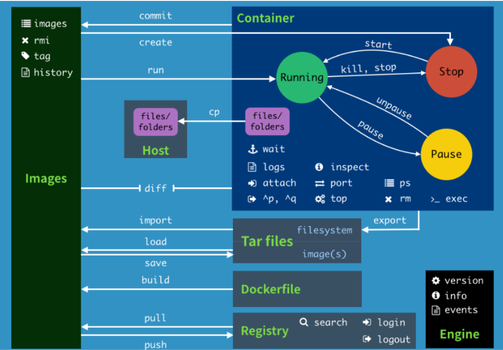

#### 命令

```shell
attach 	Attach to a running container # 当前 shell 下 attach 连接指定运行镜像 
build 	Build an image from a Dockerfile # 通过 Dockerfile 定 制镜像 
commit 	Create a new image from a container changes # 提交当前容器为新的镜像 
cp 		Copy files/folders from the containers filesystem to the host path #从容器中拷贝指定文件或者目录到宿主机中 
create 	Create a new container # 创建一个新的容器，同 run，但不启动容器 
diff 	Inspect changes on a container's filesystem # 查看 docker 容器变化 
events 	Get real time events from the server # 从 docker 服务获取容 器实时事件 
exec 	Run a command in an existing container # 在已存在的容器上运行命 令
export 	Stream the contents of a container as a tar archive # 导出容器的内 容流作为一个 tar 归档文件[对应 import ] 
history Show the history of an image # 展示一个镜像形成历史 
images 	List images # 列出系统当前镜像
import 	Create a new filesystem image from the contents of a tarball # 从 tar包中的内容创建一个新的文件系统映像[对应export] 
info 	Display system-wide information # 显示系统相关信息 
inspect Return low-level information on a container # 查看容器详细信息 
kill 	Kill a running container # kill 指定 docker 容 器
load 	Load an image from a tar archive # 从一个 tar 包中加载一 个镜像[对应 save] 
login 	Register or Login to the docker registry server # 注册或者登陆一个 docker 源服务器 
logout 	Log out from a Docker registry server # 从当前 Docker registry 退出 
logs 	Fetch the logs of a container # 输出当前容器日志信息 
port 	Lookup the public-facing port which is NAT-ed to PRIVATE_PORT # 查看映射端口对应的容器内部源端口 
pause 	Pause all processes within a container # 暂停容器 
ps 		List containers # 列出容器列表 
pull 	Pull an image or a repository from the docker registry server # 从docker镜像源服务器拉取指定镜像或者库镜像 
push 	Push an image or a repository to the docker registry server # 推送指定镜像或者库镜像至docker源服务器 
restart Restart a running container # 重启运行的容器 
rm 		Remove one or more containers # 移除一个或者多个容器 
rmi 	Remove one or more images # 移除一个或多个镜像[无容器使用该 镜像才可删除，否则需删除相关容器才可继续或 -f 强制删除] 
run 	Run a command in a new container # 创建一个新的容器并运行 一个命令 
save 	Save an image to a tar archive # 保存一个镜像为一个 tar 包[对应 load] 
search 	Search for an image on the Docker Hub # 在 docker hub 中搜 索镜像 
start 	Start a stopped containers # 启动容器 
stop 	Stop a running containers # 停止容器 
tag 	Tag an image into a repository # 给源中镜像打标签 
top 	Lookup the running processes of a container # 查看容器中运行的进程信 息
unpause Unpause a paused container # 取消暂停容器 
version Show the docker version information # 查看 docker 版本号 
wait 	Block until a container stops, then print its exit code # 截取容 器停止时的退出状态值
```

### 3.6 Docker安装实战

#### 使用Docker安装Nginx

```shell
# 1. 搜索nginx镜像
[root@xiyang ~]# docker search nginx --filter=stars=6000
NAME      DESCRIPTION                STARS     OFFICIAL   AUTOMATED
nginx     Official build of Nginx.   14163     [OK]   
# 2. 拉取镜像
[root@xiyang ~]# docker pull nginx
Using default tag: latest
latest: Pulling from library/nginx
6ec7b7d162b2: Already exists 
cb420a90068e: Pull complete 
2766c0bf2b07: Pull complete 
e05167b6a99d: Pull complete 
70ac9d795e79: Pull complete 
Digest: sha256:4cf620a5c81390ee209398ecc18e5fb9dd0f5155cd82adcbae532fec94006fb9
Status: Downloaded newer image for nginx:latest
docker.io/library/nginx:latest
# 3. 启动容器
[root@xiyang ~]# docker images
REPOSITORY   TAG       IMAGE ID       CREATED        SIZE
nginx        latest    ae2feff98a0c   31 hours ago   133MB
mysql        5.7       697daaecf703   5 days ago     448MB
mysql        latest    ab2f358b8612   5 days ago     545MB
redis        latest    ef47f3b6dc11   5 days ago     104MB
centos       latest    300e315adb2f   9 days ago     209MB
# -d 后台运行
# --name 给容器命名
# -p 宿主机端口 : 容器内部端口 - p 8080:8943 真实主机端口映射docker容器内部端口 可以看看下面的图示
[root@xiyang ~]# docker run -d --name mynginx -p 3500:80 nginx
6fc6fabb38bdc214b9df83a6e36033712cff3f774ee7410b9b9dcc614fd98daa
[root@xiyang ~]# docker ps
CONTAINER ID   IMAGE     COMMAND                  CREATED          STATUS          PORTS                  NAMES
6fc6fabb38bd   nginx     "/docker-entrypoint.…"   6 seconds ago    Up 5 seconds    0.0.0.0:3500->80/tcp   mynginx
dad1f67965a4   centos    "/bin/bash"              22 minutes ago   Up 22 minutes                          competent_williams
# 4. 测试访问
[root@xiyang ~]# curl localhost:3500
<!DOCTYPE html>
<html>
<head>
<title>Welcome to nginx!</title>
<style>
    body {
        width: 35em;
        margin: 0 auto;
        font-family: Tahoma, Verdana, Arial, sans-serif;
    }
</style>
</head>
<body>
<h1>Welcome to nginx!</h1>
<p>If you see this page, the nginx web server is successfully installed and
working. Further configuration is required.</p>

<p>For online documentation and support please refer to
<a href="http://nginx.org/">nginx.org</a>.<br/>
Commercial support is available at
<a href="http://nginx.com/">nginx.com</a>.</p>

<p><em>Thank you for using nginx.</em></p>
</body>
</html>
# 5. 进入容器
[root@xiyang ~]# docker exec -it mynginx /bin/bash
# 寻找nginx
root@6fc6fabb38bd:/# whereis nginx 
nginx: /usr/sbin/nginx /usr/lib/nginx /etc/nginx /usr/share/nginx
# nginx的路径
root@6fc6fabb38bd:/# cd /usr/share/nginx
# 首页的路径
root@6fc6fabb38bd:/usr/share/nginx# ls
html
# 进入首页路径
root@6fc6fabb38bd:/usr/share/nginx# cd html 
root@6fc6fabb38bd:/usr/share/nginx/html# ls
50x.html  index.html
root@6fc6fabb38bd:/usr/share/nginx/html# cat index.html
<!DOCTYPE html>
<html>
<head>
<title>Welcome to nginx!</title>
<style>
    body {
        width: 35em;
        margin: 0 auto;
        font-family: Tahoma, Verdana, Arial, sans-serif;
    }
</style>
</head>
<body>
<h1>Welcome to nginx!</h1>
<p>If you see this page, the nginx web server is successfully installed and
working. Further configuration is required.</p>

<p>For online documentation and support please refer to
<a href="http://nginx.org/">nginx.org</a>.<br/>
Commercial support is available at
<a href="http://nginx.com/">nginx.com</a>.</p>

<p><em>Thank you for using nginx.</em></p>
</body>
</html>

```

`-p 宿主机端口 : docker容器端口` 容器端口暴露

以阿里云为例,外网地址是120.25.155.46 ,需要先在阿里云控制台开通安全组3344,然后linux开启防火墙,3344,-p 3344:80就是打通linux和docker容器内部的连接的

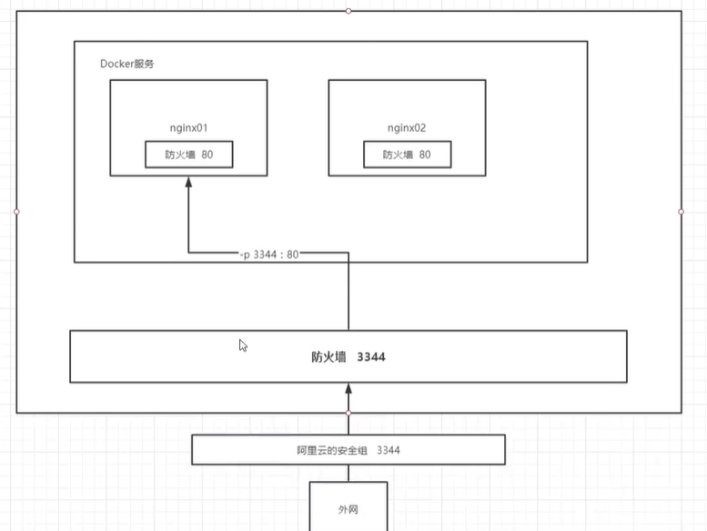

#### 使用docker安装 tomcat

```shell
# 官方文档解释 
# -it ：交互模式 
# --rm：容器启动成功并退出以后容器就自动移除，一般在测试情况下使用！
# docker run -it --rm tomcat:9.0

# 搜索镜像
[root@xiyang ~]# docker search tomcat --filter=stars=1000
NAME      DESCRIPTION                                     STARS     OFFICIAL   AUTOMATED
tomcat    Apache Tomcat is an open source implementati…   2900      [OK]     

# 1、下载tomcat镜像
[root@xiyang ~]# docker pull tomcat
Using default tag: latest
latest: Pulling from library/tomcat
6c33745f49b4: Pull complete 
c87cd3c61e27: Pull complete 
05a3c799ec37: Pull complete 
a61c38f966ac: Pull complete 
396b39798a69: Pull complete 
576b6480761a: Pull complete 
0d66e5d46fdf: Pull complete 
c9a19e25684c: Pull complete 
511576b95265: Pull complete 
7cbc3d736630: Pull complete 
Digest: sha256:f728ca177fee0851aea29499fbb2013737231a00264f517cc3d185f6f8bf09a8
Status: Downloaded newer image for tomcat:latest
docker.io/library/tomcat:latest

# 2、启动tomcat
# docker run -it --rm tomcat:9.0 官方推荐命令; --rm表示用完之后删除容器,使用 docker ps -a也无法查看到这个容器
[root@xiyang ~]# docker run -d -p 8080:8080 --name tomcat9 tomcat
9ac377a8a379d06e00fe3c3d1b87a2f75d4d7977f5aabdae192ea0025f1fd145

# 3、进入tomcat
[root@xiyang ~]# docker exec -it tomcat9 /bin/bash
root@9ac377a8a379:/usr/local/tomcat

# 4、思考：
	# 我们以后要部署项目，还需要进入容器中，是不是十分麻烦，要是有一种技术，可以将容器 内和我们Linux进行映射挂载就好了？
	# 我们后面会将数据卷技术来进行挂载操作，也是一个核心内容，这 里大家先听听名词就好，我们很快就会讲到！-v 数据卷
```

#### 使用docker 部署 es + kibana

```shell
# 我们启动es这种容器需要考虑几个问题 
# 1、端口暴露问题 9200、9300 
# 2、数据卷的挂载问题 data、plugins、conf 
# 3、吃内存 - "ES_JAVA_OPTS=-Xms512m -Xmx512m"

# 扩展命令  
docker stats 容器id # 查看容器的cpu内存和网络状态


# 1、启动es测试 
docker run -d --name elasticsearch -p 9200:9200 -p 9300:9300 -e "discovery.type=single-node" elasticsearch:7.6.2

# 2、启动之后很卡，使用 docker stats 容器id 查看下cpu状态 ，发现占用的很大 


# 3、测试访问 curl表示发起请求
[root@kuangshen data]# curl localhost:9200

# 4、增加上内存限制启动 
docker run -d --name elasticsearch -p 9200:9200 -p 9300:9300 -e "discovery.type=single-node" -e ES_JAVA_OPTS="-Xms64m -Xmx512m" elasticsearch:7.6.2

# 5、启动之后，使用 docker stats 查看下cpu状态

# 6、测试访问，效果一样，ok！

# 思考：如果我们要使用 kibana , 如果配置连接上我们的es呢？网络该如何配置呢？
```

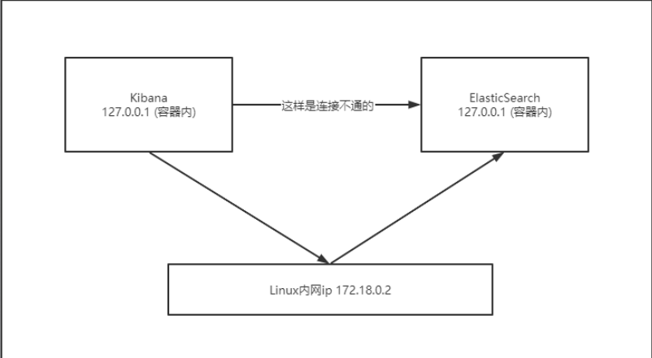

### 3.7 Docker可视化安装

*Docker可视化可使用Rancher(先使用),和Rancher(CI/CD)时使用*

#### 7.1 Portainer

**介绍:**

Portainer是Docker的图形化管理工具，提供状态显示面板、应用模板快速部署、容器镜像网络数据卷的基本操作（包括上传下载镜像，创建容器等操作）、事件日志显示、容器控制台操作、Swarm集群和服务等集中管理和操作、登录用户管理和控制等功能。功能十分全面，基本能满足中小型单位对容器管理的全部需求。

**安装Portainer**

```shell
# 安装并运行docker
docker run -d -p 9000:9000 --restart=always --name portainer -v /var/run/docker.sock:/var/run/docker.sock -v /Users/lee/dev/docker_file/portainer/data:/data docker.io/portainer/portainer

docker run -d -p 8088:9000 \ 
--restart=always -v /var/run/docker.sock:/var/run/docker.sock -- privileged=true portainer/portainer
```

**访问测试**

#### 7.2 Rancher

```shell
# 1.拉取 rancher 镜像
 docker pull rancher:v2.4.4
# 2.查看镜像列表是否存在
 docker images
# 3.在宿主机上创建Rancher的挂载目录：
 mkdir -p /docker_volume/rancher_home/rancher
 mkdir -p /docker_volume/rancher_home/auditlog
# 4. 启动 rancher 容器
 docker run -d --restart=unless-stopped -p 80:80 -p 443:443 \
 -v /docker_volume/rancher_home/rancher:/var/lib/rancher \
 -v /docker_volume/rancher_home/auditlog:/var/log/auditlog \
 --name rancher rancher/rancher:v2.4.4  
# 5. 登录配置
 http://[宿主机IP]
```

## 4. Docker镜像

### 1. 镜像是什么

镜像是一种轻量级、可执行的独立软件包，用来打包软件运行环境和基于运行环境开发的软件，它包含运行某个软件所需的所有内容，包括代码、运行时、库、环境变量和配置文件。

**所有的应用，直接打包docker镜像，就可以直接跑起来！**

### 2. Docker镜像加载原理

#### 2.1 UnionFS （联合文件系统）

UnionFS（联合文件系统）：Union文件系统（UnionFS）是一种分层、轻量级并且高性能的文件系统，它支持对文件系统的修改作为一次提交来一层层的叠加，同时可以将不同目录挂载到同一个虚拟文件系统下(unite several
directories into a single virtual fifilesystem)。Union 文件系统是 Docker 镜像的基础。镜像可以通过分层来进行继承，基于基础镜像（没有父镜像），可以制作各种具体的应用镜像。

特性：一次同时加载多个文件系统，但从外面看起来，只能看到一个文件系统，联合加载会把各层文件系统叠加起来，这样最终的文件系统会包含所有底层的文件和目录

#### 2.2 Docker镜像加载原理

docker的镜像实际上由一层一层的文件系统组成，这种层级的文件系统UnionFS。bootfs(boot fifile system)主要包含bootloader和kernel, bootloader主要是引导加载kernel,
Linux刚启动时会加载bootfs文件系统，在Docker镜像的最底层是bootfs。这一层与我们典型的Linux/Unix系统是一样的，包含boot加载器和内核。当boot加载完成之后整个内核就都在内存中了，此时内存的使用权已由bootfs转交给内核，此时系统也会卸载bootfs。
rootfs (root fifile system) ，在bootfs之上。包含的就是典型 Linux 系统中的 /dev, /proc, /bin, /etc
等标准目录和文件。rootfs就是各种不同的操作系统发行版，比如Ubuntu，Centos等等。

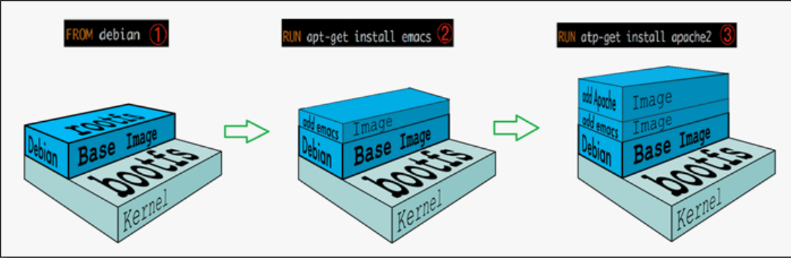

平时我们安装进虚拟机的CentOS都是好几个G，为什么Docker这里才200M？


对于一个精简的OS，rootfs 可以很小，只需要包含最基本的命令，工具和程序库就可以了，因为底层直接用Host的kernel，自己只需要提供rootfs就可以了。由此可见对于不同的linux发行版, bootfs基本是一致的,
rootfs会有差别, 因此不同的发行版可以公用bootfs。

### 3. 分层理解

#### 3.1 分层的镜像

##### 3.1.1 分层的表现

我们可以去下载一个镜像，注意观察下载的日志输出，可以看到是一层一层的在下载！

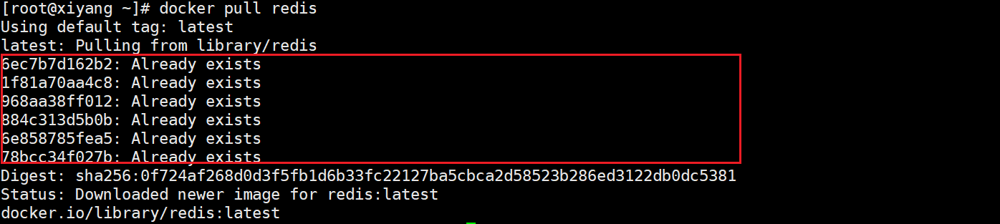

思考: 为什么Docker镜像要采用这种分层的结构呢？

最大的好处: 在于是资源共享了,比如有多个镜像都从相同的Base镜像构建而来，那么宿主机只需在磁盘上保留一份base镜像，同时内存中也只需要加载一份base镜像，这样就可以为所有的容器服务了，而且镜像的每一层都可以被共享。

查看镜像分层的方式可以通过 `docker image inspect `命令！

```shell
[root@xiyang ~]# docker image inspect redis:latest
[
    {
        "Id": "sha256:ef47f3b6dc11e8f17fb39a6e46ecaf4efd47b3d374e92aeb9f2606896b751251",
        "RepoTags": [
            "redis:latest"
        ],
        "RepoDigests": [
            "redis@sha256:0f724af268d0d3f5fb1d6b33fc22127ba5cbca2d58523b286ed3122db0dc5381"
        ],
        "Parent": "",
        "Comment": "",
        "Created": "2020-12-11T16:25:00.990749243Z",
        "Container": "6da61e8ec8c774f324d488c6047bd913d6f379855b7abcb08be9f41acee6e3ab",
        "ContainerConfig": {
            "Hostname": "6da61e8ec8c7",
            "Domainname": "",
            "User": "",
            "AttachStdin": false,
            "AttachStdout": false,
            "AttachStderr": false,
            "ExposedPorts": {
                "6379/tcp": {}
            },
            "Tty": false,
            "OpenStdin": false,
            "StdinOnce": false,
            "Env": [
                "PATH=/usr/local/sbin:/usr/local/bin:/usr/sbin:/usr/bin:/sbin:/bin",
                "GOSU_VERSION=1.12",
                "REDIS_VERSION=6.0.9",
                "REDIS_DOWNLOAD_URL=http://download.redis.io/releases/redis-6.0.9.tar.gz",
                "REDIS_DOWNLOAD_SHA=dc2bdcf81c620e9f09cfd12e85d3bc631c897b2db7a55218fd8a65eaa37f86dd"
            ],
            "Cmd": [
                "/bin/sh",
                "-c",
                "#(nop) ",
                "CMD [\"redis-server\"]"
            ],
            "Image": "sha256:d9311f71736ce563d01280a6cc23530a3f838f6f6c4c245b2b99919594b67b7b",
            "Volumes": {
                "/data": {}
            },
            "WorkingDir": "/data",
            "Entrypoint": [
                "docker-entrypoint.sh"
            ],
            "OnBuild": null,
            "Labels": {}
        },
        "DockerVersion": "19.03.12",
        "Author": "",
        "Config": {
            "Hostname": "",
            "Domainname": "",
            "User": "",
            "AttachStdin": false,
            "AttachStdout": false,
            "AttachStderr": false,
            "ExposedPorts": {
                "6379/tcp": {}
            },
            "Tty": false,
            "OpenStdin": false,
            "StdinOnce": false,
            "Env": [
                "PATH=/usr/local/sbin:/usr/local/bin:/usr/sbin:/usr/bin:/sbin:/bin",
                "GOSU_VERSION=1.12",
                "REDIS_VERSION=6.0.9",
                "REDIS_DOWNLOAD_URL=http://download.redis.io/releases/redis-6.0.9.tar.gz",
                "REDIS_DOWNLOAD_SHA=dc2bdcf81c620e9f09cfd12e85d3bc631c897b2db7a55218fd8a65eaa37f86dd"
            ],
            "Cmd": [
                "redis-server"
            ],
            "Image": "sha256:d9311f71736ce563d01280a6cc23530a3f838f6f6c4c245b2b99919594b67b7b",
            "Volumes": {
                "/data": {}
            },
            "WorkingDir": "/data",
            "Entrypoint": [
                "docker-entrypoint.sh"
            ],
            "OnBuild": null,
            "Labels": null
        },
        "Architecture": "amd64",
        "Os": "linux",
        "Size": 104252176,
        "VirtualSize": 104252176,
        "GraphDriver": {
            "Data": {
                "LowerDir": "/var/lib/docker/overlay2/bee07b9eefc7220ed126cf5bb8f6a5b55364b27a84173d4684d8f4f49687296d/diff:/var/lib/docker/overlay2/e0db0ca85805e0edd2e461e090ffda1ac56ecd3a1007cb5a8223e881c20cc3b6/diff:/var/lib/docker/overlay2/f893e55e0378bc0c5a3ee4bfe92ea8b9388fba527d103e623ec33fddb090830c/diff:/var/lib/docker/overlay2/20132b2bdad979a6fdbd283071d85e0186d83df0ff329b74fa0d8b3f12b79b0d/diff:/var/lib/docker/overlay2/42b6ba498107f8a325fe75832be5dc05b92bd68b44e0d0e6bb4f3c3c7e971326/diff",
                "MergedDir": "/var/lib/docker/overlay2/d23a201a818742f5c2173ff6fcab624da90cf16ee00d8ad1ea744892f1c216e9/merged",
                "UpperDir": "/var/lib/docker/overlay2/d23a201a818742f5c2173ff6fcab624da90cf16ee00d8ad1ea744892f1c216e9/diff",
                "WorkDir": "/var/lib/docker/overlay2/d23a201a818742f5c2173ff6fcab624da90cf16ee00d8ad1ea744892f1c216e9/work"
            },
            "Name": "overlay2"
        },
        "RootFS": {
            "Type": "layers",
            "Layers": [
                "sha256:87c8a1d8f54f3aa4e05569e8919397b65056aa71cdf48b7f061432c98475eee9",
                "sha256:25075874ce886bd3adb3b75298622e6297c3f893e169f18703019e4abc8f13f0",
                "sha256:caafc8119413c94f1e4b888128e2f337505fb57e217931a9b3a2cd7968340a9e",
                "sha256:e5d940a579ec4a80b6ec8571cb0fecf640dba14ccfd6de352977fd379a254053",
                "sha256:2a1c28c532d20c3b8af8634d72a4d276a67ce5acb6d186ac937c13bd6493c972",
                "sha256:1540b8226044ed5ce19cc0fec7fbfb36a00bb15f4e882d6affbd147a48249574"
            ]
        },
        "Metadata": {
            "LastTagTime": "0001-01-01T00:00:00Z"
        }
    }
]
```

##### 3.1.2 分层的原理分析

所有的 Docker 镜像都起始于一个基础镜像层，当进行修改或增加新的内容时，就会在当前镜像层之上，创建新的镜像层。

举一个简单的例子，假如基于 Ubuntu Linux 16.04 创建一个新的镜像，这就是新镜像的第一层；如果在该镜像中添加 Python包，就会在基础镜像层之上创建第二个镜像层；如果继续添加一个安全补丁，就会创建第三个镜像层。

该镜像当前已经包含 3 个镜像层，如下图所示（这只是一个用于演示的很简单的例子）。

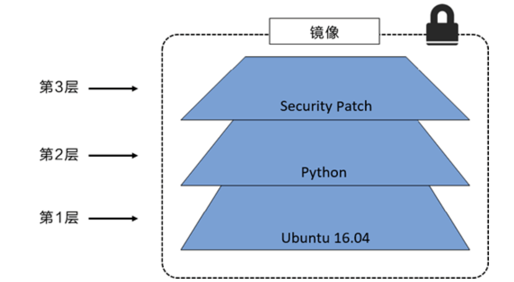

在<u>添加额外的镜像层的同时，镜像始终保持是当前所有镜像的组合</u>，理解这一点非常重要。

下图中举了一个简单的例子，每个镜像层包含 3 个文件，而镜像包含了来自两个镜像层的 6 个文件。


上图中的镜像层跟之前图中的略有区别，主要目的是便于展示文件。

下图中展示了一个稍微复杂的三层镜像，在外部看来整个镜像只有 6 个文件，这是因为最上层中的文件7 是文件 5 的一个更新版本。


这种情况下，上层镜像层中的文件覆盖了底层镜像层中的文件。这样就使得文件的更新版本作为一个新镜像层添加到镜像当中。

<u>Docker 通过存储引擎（新版本采用快照机制）的方式来实现镜像层堆栈</u>，并保证多镜像层对外展示为统一的文件系统。

Linux 上可用的存储引擎有 AUFS、Overlay2、Device Mapper、Btrfs 以及 ZFS。顾名思义，每种存储引擎都基于 Linux 中对应的文件系统或者块设备技术，并且每种存储引擎都有其独有的性能特点。

Docker 在 Windows 上仅支持 windowsfifilter 一种存储引擎，该引擎基于 NTFS 文件系统之上实现了分层和 CoW[1]。

下图展示了与系统显示相同的三层镜像。所有镜像层堆叠并合并，对外提供统一的视图。

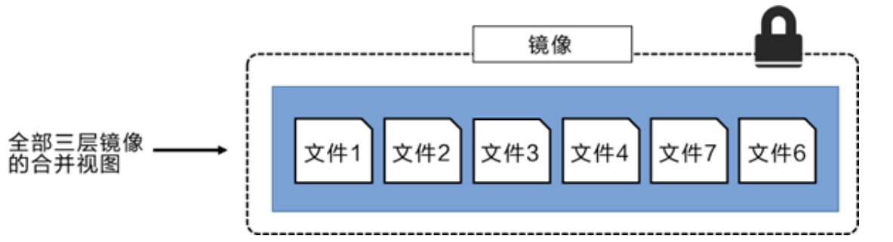

#### 3.2 特点

- Docker镜像都是只读的，当容器启动时，一个新的可写层被加载到镜像的顶部！
- 这一层就是我们通常说的容器层，容器之下的都叫镜像层！

### 4. 镜像Commit

*docker commit 从容器创建一个新的镜像。*

```shell
docker commit 提交容器副本使之成为一个新的镜像！ 
# 语法 
docker commit -m="提交的描述信息" -a="作者" 容器id 要创建的目标镜像名:[标签名]
```

```shell
# 测试


```

## 5. 容器数据卷

### 1. 什么是容器数据卷

**docker的理念回顾：**

将应用和运行的环境打包形成容器运行，运行可以伴随着容器，但是我们对于数据的要求，是希望能够持久化的！就好比，你安装一个MySQL，结果你把容器删了，就相当于删库跑路了，这TM也太扯了吧！所以我们希望容器之间有可能可以共享数据，Docker容器产生的数据，如果不通过docker
commit 生成新的镜像，使得数据作为镜像的一部分保存下来，那么当容器删除后，数据自然也就没有了！这样是行不通的！为了能保存数据在Docker中我们就可以使用卷！让数据挂载到我们本地！这样数据就不会因为容器删除而丢失了！

**作用：**

卷就是目录或者文件，存在一个或者多个容器中，由docker挂载到容器，但不属于联合文件系统，因此能够绕过 Union File System ，
提供一些用于持续存储或共享数据的特性：卷的设计目的就是数据的持久化，完全独立于容器的生存周期，因此Docker不会在容器删除时删除其挂载的数据卷。

**特点：**

1、数据卷可在容器之间共享或重用数据

2、卷中的更改可以直接生效

3、数据卷中的更改不会包含在镜像的更新中

4、数据卷的生命周期一直持续到没有容器使用它为止

**所以总结一句话： 就是容器的持久化，以及容器间的继承和数据共享！**

### 2. 使用数据卷

#### 2.1 方式一:容器中直接使用命令来添加

```shell
# 命令 
# 容器内的目录挂载到宿主机上
docker run -it -v 宿主机绝对路径目录:容器内目录 镜像名
# 查看数据卷是否挂载成功 
docker inspect 容器id
```

```shell
# 测试


```

测试容器和宿主机之间数据共享：可以发现，在容器中，创建的会在宿主机中看到！

测试容器停止退出后，主机修改数据是否会同步！

1. 停止容器
2. 在宿主机上修改文件，增加些内容
3. 启动刚才停止的容器
4. 然后查看对应的文件，发现数据依旧同步！ok

#### 2.2 方式二: 使用 docker 安装 mysql

*mysql 数据持久化的问题！*

#### 2.3 方式三: 通过Docker File 来添加（了解）

DockerFile 是用来构建Docker镜像的构建文件，是由一些列命令和参数构成的脚本。

我们在这里，先体验下，后面我们会详细讲解 DockerFile ！

```shell

```

注意：如果访问出现了 cannot open directory: Permission denied

解决办法：在挂载目录后多加一个 --privileged=true参数即可

### 3. 匿名和具名挂载

```shell
# 匿名挂载 
-v 容器内路径 
docker run -d -P --name nginx01 -v /etc/nginx nginx
# 匿名挂载的缺点，就是不好维护，通常使用命令 docker volume维护 
docker volume ls

# 具名挂载 
-v 卷名:/容器内路径 
docker run -d -P --name nginx02 -v nginxconfig:/etc/nginx nginx

# 查看挂载的路径 
[root@kuangshen ~]# docker volume inspect nginxconfig


# 怎么判断挂载的是卷名而不是本机目录名？ 不是/开始就是卷名，是/开始就是目录名 
# 改变文件的读写权限 
# ro: readonly 
# rw: readwrite 
# 指定容器对我们挂载出来的内容的读写权限 
docker run -d -P --name nginx02 -v nginxconfig:/etc/nginx:ro nginx 
docker run -d -P --name nginx02 -v nginxconfig:/etc/nginx:rw nginx
```

### 4. 数据卷容器

命名的容器挂载数据卷，其他容器通过挂载这个（父容器）实现数据共享，挂载数据卷的容器，称之为数据卷容器。

我们使用上一步的镜像：kuangshen/centos 为模板，运行容器 docker01，docker02，docker03，他们都会具有容器卷

```shell
"/dataVolumeContainer1" 
"/dataVolumeContainer2"
```

#### 4.1 测试容器间传递共享

1、先启动一个父容器docker01，然后在dataVolumeContainer2新增文件

2、创建docker02，docker03 让他们继承docker01 --volumes-from

3、回到docker01发现可以看到 02 和 03 添加的共享文件

4、删除docker01，docker02 修改后docker03还能不能访问

5、删除docker02 ，docker03还能不能访问

6、新建docker04继承docker03，然后再删除docker03，看下是否可以访问！

#### 4.2 结论

容器之间配置信息的传递，数据卷的生命周期一直持续到没有容器使用它为止。存储在本机的文件则会一直保留！

## 6. DockerFile

大家想想，Nginx，tomcat，mysql 这些镜像都是哪里来的？官方能写，我们不能写吗？

我们要研究自己如何做一个镜像，而且我们写的微服务项目以及springboot打包上云部署，Docker就是最方便的。

微服务打包成镜像，任何装了Docker的地方，都可以下载使用，极其的方便。

流程：开发应用=>DockerFile=>打包为镜像=>上传到仓库（私有仓库，公有仓库）=> 下载镜像 => 启动运行。

还可以方便移植！

### 1. 什么是DockerFile

dockerfifile是用来构建Docker镜像的构建文件，是由一系列命令和参数构成的脚本。

构建步骤：

1、编写DockerFile文件

2、docker build 构建镜像

3、docker run

dockerfifile文件我们刚才已经编写过了一次，这里我们继续使用 centos 来看！

地址：https://hub.docker.com/_/centos

### 2. DockerFile构建过程

**基础知识**

1、每条保留字指令都必须为大写字母且后面要跟随至少一个参数

2、指令按照从上到下，顺序执行

3、# 表示注释

4、每条指令都会创建一个新的镜像层，并对镜像进行提交

**流程：**

1、docker从基础镜像运行一个容器

2、执行一条指令并对容器做出修改

3、执行类似 docker commit 的操作提交一个新的镜像层

4、Docker再基于刚提交的镜像运行一个新容器

5、执行dockerfifile中的下一条指令直到所有指令都执行完成！

**说明：**

从应用软件的角度来看，DockerFile，docker镜像与docker容器分别代表软件的三个不同阶段。

DockerFile 是软件的原材料 （代码）

Docker 镜像则是软件的交付品 （.apk）

Docker 容器则是软件的运行状态 （客户下载安装执行）

DockerFile 面向开发，Docker镜像成为交付标准，Docker容器则涉及部署与运维，三者缺一不可！


**DockerFile**
：需要定义一个DockerFile，DockerFile定义了进程需要的一切东西。DockerFile涉及的内容包括执行代码或者是文件、环境变量、依赖包、运行时环境、动态链接库、操作系统的发行版、服务进程和内核进程（当引用进行需要和系统服务和内核进程打交道，这时需要考虑如何设计
namespace的权限控制）等等。

**Docker镜像**：在DockerFile 定义了一个文件之后，Docker build 时会产生一个Docker镜像，当运行Docker 镜像时，会真正开始提供服务；

**Docker容器**：容器是直接提供服务的。

### 3. DockerFile指令

```shell
FROM # 基础镜像，当前新镜像是基于哪个镜像的 
MAINTAINER # 镜像维护者的姓名混合邮箱地址 
RUN # 容器构建时需要运行的命令 
EXPOSE # 当前容器对外保留出的端口 
WORKDIR # 指定在创建容器后，终端默认登录的进来工作目录，一个落脚点 
ENV # 用来在构建镜像过程中设置环境变量 
ADD # 将宿主机目录下的文件拷贝进镜像且ADD命令会自动处理URL和解压tar压缩包 
COPY # 类似ADD，拷贝文件和目录到镜像中！ 
VOLUME # 容器数据卷，用于数据保存和持久化工作 
CMD # 指定一个容器启动时要运行的命令，dockerFile中可以有多个CMD指令，但只有最 后一个生效！ 
ENTRYPOINT # 指定一个容器启动时要运行的命令！和CMD一样 
ONBUILD # 当构建一个被继承的DockerFile时运行命令，父镜像在被子镜像继承后，父镜像的 ONBUILD被触发
```

### 4. 实战测试

*Docker Hub 中99% 的镜像都是通过在base镜像（Scratch）中安装和配置需要的软件构建出来的*

#### 4.1 自定义一个 centos

#### 4.2 CMD 和 ENTRYPOINT 的区别

#### 4.3 自定义镜像 tomcat

### 5. 发布镜像

#### 5.1 DockerHub

#### 5.2 阿里云镜像服务

### 6. DockerFile总结


## 7. Docker网络

### 1. 理解Docker0

### 2. --Link

### 3. 自定义网络

### 4. 网络连通

### 5. 实战-部署一个Redis集群

## 8. IDEA整合Docker

### 1. 创建项目

1. 使用 IDEA 构建一个 SpringBoot 项目

2. 编写一个helloController

   ```java
   
   ```

3. 启动测试下，端口修改下，避免8080冲突！本地访问没问题就可以！

4. 打jar包

### 2. 打包镜像

1. 在项目下编写 Dockerfifile 文件，将打包好的jar包拷贝到Dockerfifile同级目录
2. 将Dockerfifile 和 项目的 jar 包上传到linux服务器上，构建运行

### 3. IDEA安装插件

*了解即可！以后CI/CD，就完全没必要这样做！*

1. IDEA安装插件
2. 配置docker连接集成
3. 集成了docker插件就可以在IDEA中操作Docker内部的容器和镜像了，但是很鸡肋这个功能，对于我们开发人员来说！之后学习的CI/CD才是真正在企业中的王道！

# Docker进阶

> 课程名称: [【狂神说Java】Docker进阶篇超详细版教程通俗易懂](https://www.bilibili.com/video/BV1kv411q7Qc)
>
> 课程概述: Docker进阶
>
> 讲述人: B站-遇见狂神说

Docker Compose

Docker Swarm (简化版的k8s)

CI / CD

