# 微信小程序开发

> 课程名称: [尚硅谷2021版微信小程序开发（零基础小程序开发入门到精通）](https://www.bilibili.com/video/BV12K411A7A2)
>
> 课程概述: 本套视频教程采用项目驱动式讲解，以网易云音乐为原型进行项目构建，使用网易云音乐真实API接口数据，且最终效果同网易云音乐App保持一致，做到真正的企业级项目讲解。 内容从基础到高级，涵盖小程序常用的所有知识点，包括：事件、数据绑定、路由、自定义组件、自定义模板、音乐播放、视频播放、性能优化及项目上线前分包操作等。学习本套视频教程后，可以快速上手小程序开发，真正做到从入门到精通！
>
> 讲述人: 闫志勇

## 第 1 章: 什么是小程序

1. 2017 年度百度百科十大热词之一
2. 微信小程序，简称小程序，英文名 Mini Program，是一种不需要下载安装即可使用的应用
( 张小龙对其的定义是无需安装，用完即走，实际上是需要安装的，只不过小程序的体积特
别小， 下载速度很快，用户感觉不到下载的过程 )
3. 小程序刚发布的时候要求压缩包的体积不能大于 1M,，否则无法通过，在 2017 年 4 月做
了改进，由原来的 1M 提升到 2M；
4. 2017 年 1 月 9 日 0 点，万众瞩目的微信第一批小程序正式低调上线。


## 第 2 章: 小程序可以干什么

1. 同 App 进行互补，提供同 app 类型的功能，比 app 使用方便简洁
2. 通过扫一扫或者在微信搜索即可下载
3. 用户使用频率不高，但又不得不用的功能软件，目前看来小程序是首选
4. 连接线上线下
5. 开发门槛低， 成本低

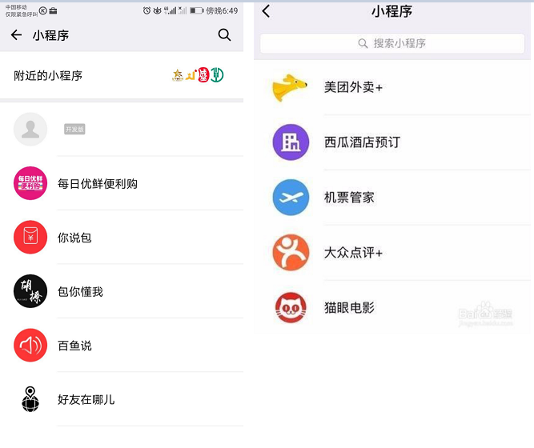

## 第 3 章: 小程序开发资料

### 3.1 相关资料

1) 官网：https://mp.weixin.qq.com/
2) 微信开发工具
3) 下载地址 https://mp.weixin.qq.com/debug/wxadoc/dev/devtools/download.html?t=2018315


### 3.2 注册小程序账号

1) 有账号

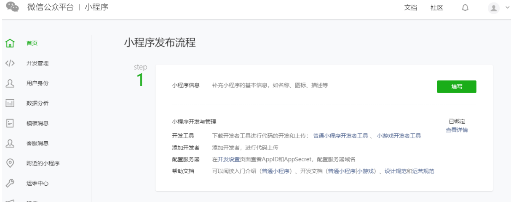

2) 无账号

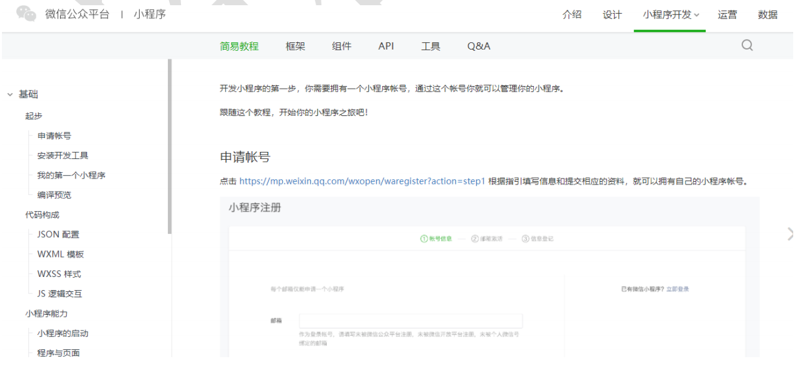


## 第 4 章: 开发小程序储备知识

### 4.1 Flex 布局简介 

#### 4.1.1 什么是 flex 布局？

1. Flex 是 Flexible Box 的缩写，意为”弹性布局”，用来为盒状模型提供最大的灵活性。
2. 任何一个容器都可以指定为 Flex 布局。
3. `display: flex`

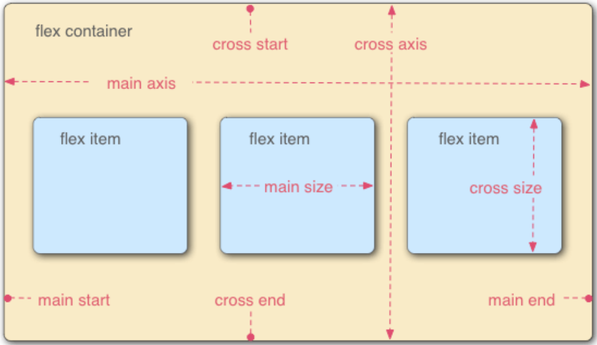

#### 4.1.2 flex 属性

**flex-direction**:

- row（默认值）：主轴为水平方向，起点在左端。
- row-reverse：主轴为水平方向，起点在右端。
- column：主轴为垂直方向，起点在上沿。
- column-reverse：主轴为垂直方向，起点在下沿。

#### 4.1.3 学习地址：

http://www.runoob.com/w3cnote/flex-grammar.html


### 4.2 移动端相关知识

#### 4.2.1 物理像素

1. 屏幕的分辨率
2. 设备能控制显示的最小单元，可以把物理像素看成是对应的像素点

#### 4.2.2 设备独立像素 & css 像素

设备独立像素(也叫密度无关像素)，可以认为是计算机坐标系统中的一个点，这个点代
表一个可以由程序使用并控制的虚拟像素(比如：CSS 像素,只是在 android 机中 CSS 像素就
不叫”CSS 像素”了而是叫”设备独立像素”)，然后由相关系统转换为物理像素。

#### 4.2.3 dpr 比 & DPI & PPI

1. `dpr`: 设备像素比，物理像素/设备独立像素 = dpr， 一般以 Iphon6 的 dpr 为准 dpr = 2

2. `PPI`: 一英寸显示屏上的像素点个数

3. `DPI`：最早指的是打印机在单位面积上打印的墨点数，墨点越多越清晰

   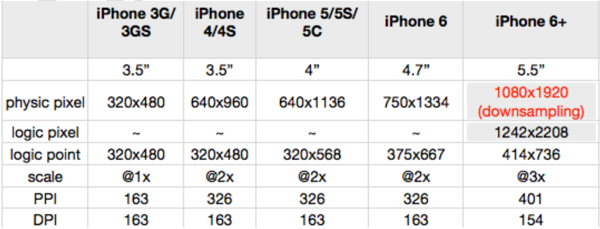

   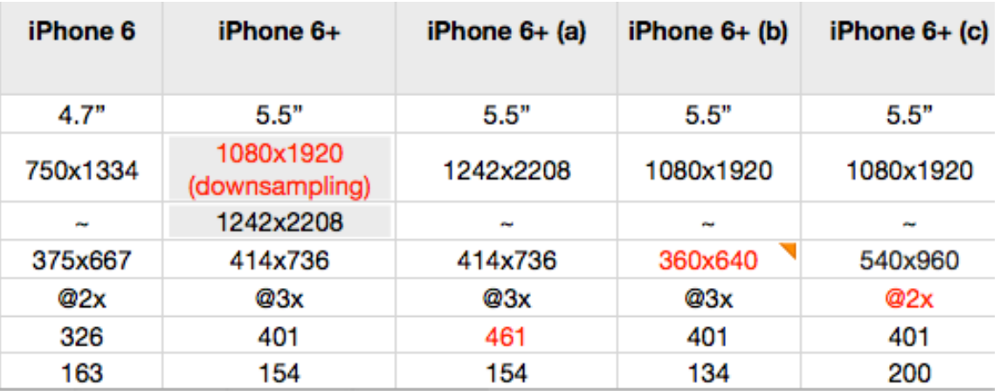

   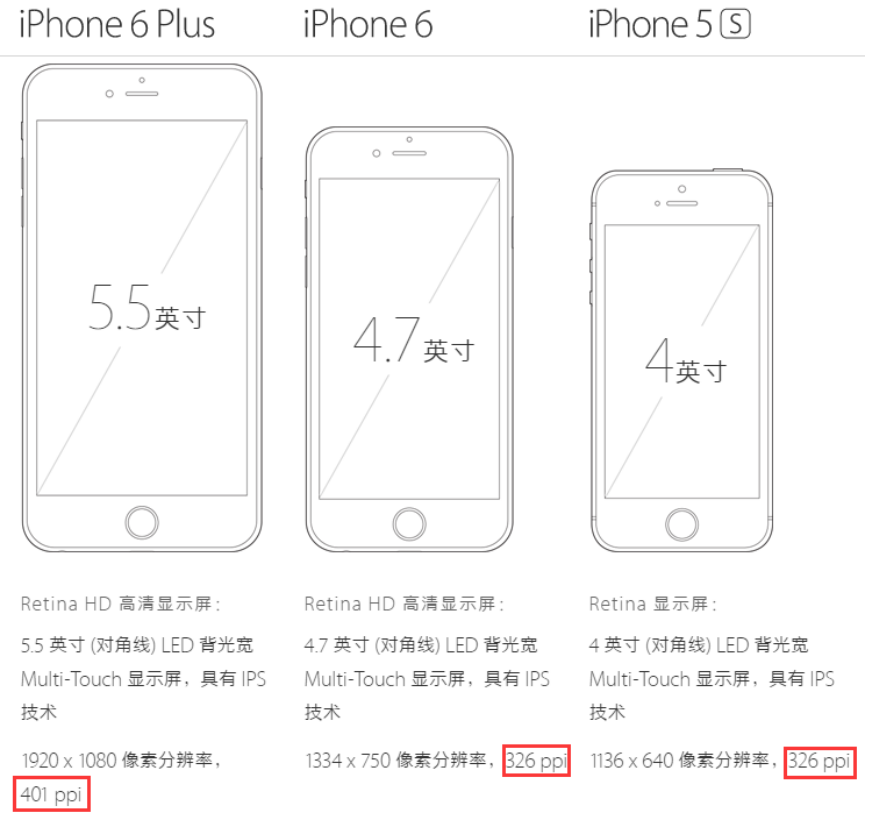


### 4.3 移动端适配方案 

#### 4.3.1 viewport 适配

1. 为什么做 viewport 适配
a) 手机厂商在生产手机的时候大部分手机默认页面宽度为 980px
b) 手机实际视口宽度都要小于 980px，如: iphone6 为 375px
c) 开发需求： 需要将 980 的页面完全显示在手机屏幕上且没有滚动条
2. 实现：`<meta name="viewport" content="width=device-width,initial-scale=1.0">`

#### 4.3.2 rem 适配

1. 为什么做 rem 适配
    a) 机型太多，不同的机型屏幕大小不一样
    b) 需求： 一套设计稿的内容在不同的机型上呈现的效果一致，根据屏幕大小不
    同的变化，页面中的内容也相应变化

2. 实现：

   ```javascript
   function remRefresh() {
       let clientWidth = document.documentElement.clientWidth; // 将屏幕等分 10 份
       let rem = clientWidth / 10;
       document.documentElement.style.fontSize = rem + 'px';
       document.body.style.fontSize = '12px'; 
   }
   window.addEventListener('pageshow', () => {
       remRefresh()
   })
   // 函数防抖
   let timeoutId;
   window.addEventListener('resize', () => {
       timeoutId && clearTimeout(timeoutId);
       timeoutId = setTimeout(() =>{
           remRefresh()
       }, 300)
   })
   ```

3. 第三方库实现

   lib-flexible + px2rem-loader


## 第 5 章: 小程序特点

### 5.1 小程序特点概述

1. 没有 DOM

2. 组件化开发： 具备特定功能效果的代码集合

3. 体积小，单个压缩包体积不能大于 2M，否则无法上线

4. 小程序的四个重要的文件
	-  `*.js` 
	-  `*.wxml` ---> view 结构 ----> `html`
	-  `*.wxss` ---> view 样式 -----> `css`
	-  `*. json` ----> view 数据 -----> `json 文件`
	
5. 小程序适配方案: `rpx` (responsive pixel 响应式像素单位)
	- 小程序适配单位： rpx
	- 规定任何屏幕下宽度为 750rpx
	- 小程序会根据屏幕的宽度不同自动计算 rpx 值的大小
	- Iphone6 下： 1rpx = 1 物理像素 = 0.5px
	
	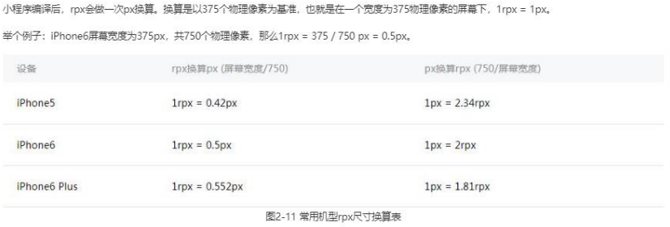


### 5.2 小程序配置

#### 5.2.1 全局配置： app.json

1. 作用： 用于为整个应用进行选项设置

2. 链接: https://developers.weixin.qq.com/miniprogram/dev/reference/configuration/app.html

3. 配图:

   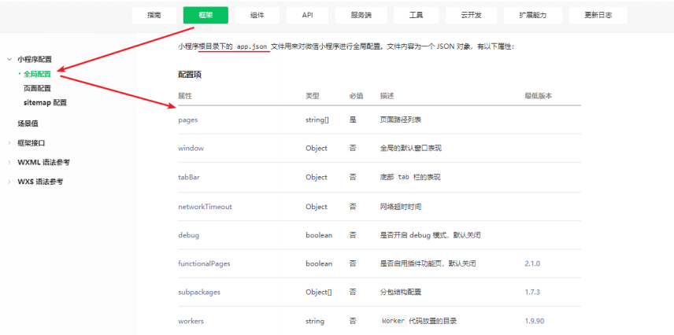


#### 5.2.2 页面配置:     页面名称.json

1. 作用: 用于为指定的页面进行配置

2. 链接: https://developers.weixin.qq.com/miniprogram/dev/reference/configuration/app.
    html

3. 注意事项: 页面配置的优先级高于全局配置

4. 配图:

   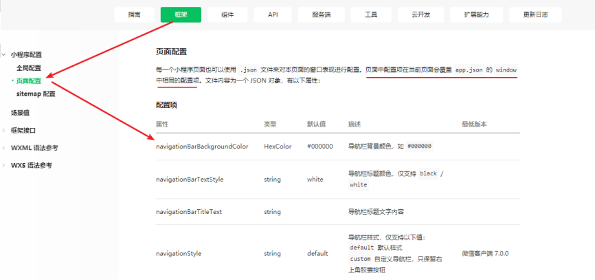


#### 5.2.3 sitemap 配置: sitemap.json

1. 作用：用于被微信搜索爬取页面

2. 链接: https://developers.weixin.qq.com/miniprogram/dev/reference/configuration/app.
    html

3. 配图:

   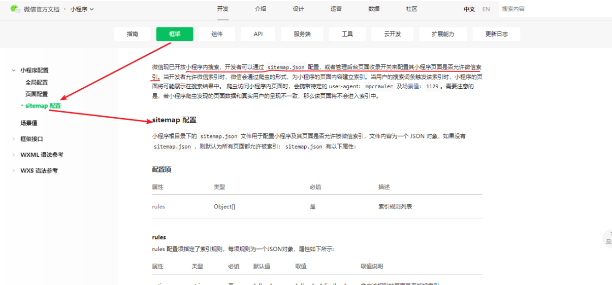


### 5.3 小程序框架接口

#### 5.3.1 App

1. 全局 app.js 中执行 App()
2. 生成当前应用的实例对象
3. getApp()获取全局应用实例

#### 5.3.2 Page

1. 页面.js 中执行 Page()
2. 生成当前页面的实例
3. 通过 getCurrentPages 获取页面实例


## 第 6 章: wxml 语法

### 6.1 数据绑定

#### 6.1.1 初始化数据

页面.js 的 data 选项中

```javascript
Page({
    data: {
        message: "Hello MINA!"
    }
})
```

#### 6.1.2 使用数据

1. 模板结构中使用双大括号` {{message}}`
2. 注意事项: 小程序中为单项数据流 model ---> view

```wxml
<view>{{ message }} </view>
```

#### 6.1.3 修改数据

1. `this.setData({message: ‘修改之后的数据’}, callback)`
2. 特点：
a) 同步修改： this.data 值被同步修改
b) 异步更新： 异步将 setData 函数用于将数据从逻辑层发送到视图层（异步）

```javascript
// index.js
Page({
    data: {
        text: 'init data',
        num: 0,
        array: [{text: 'init data'}],
        object: {
            text: 'init data'
        }
    },
    changeText: function(){
        // this.data.text = 'changed data' //不要直接修改this.data
        //应该使用 setData
        this.setData({
            text: 'changed data'
        })
    },
})
```


### 6.2 事件绑定

#### 6.2.1 事件分类

1. 冒泡事件
	- 定义：冒泡事件：当一个组件上的事件被触发后，该事件会向父节点传递。
	- 冒泡事件列表：https://mp.weixin.qq.com/debug/wxadoc/dev/framework/view/wxml/event.html
2. 非冒泡事件
	- 定义：当一个组件上的事件被触发后，该事件不会向父节点传递。
	- 非冒泡事件：表单事件和自定义事件通常是非冒泡事件https://mp.weixin.qq.com/debug/wxadoc/dev/framework/view/wxml/event.html

#### 6.2.2 绑定事件

1. **bind 绑定**：事件绑定不会阻止冒泡事件向上冒泡

   ```wxml
   <view bindtap="handleTap" class='start_container'>
    <text class='start'>开启小程序之旅</text>
   </view>
   ```

   

2. **catch** 绑定: 事件绑定可以阻止冒泡事件向上冒泡

   ```wxml
   <view catchtap="handleTap" class='start_container'>
    <text class='start'>开启小程序之旅</text>
   </view>
   ```

   

#### 6.2.3 向事件对象传参

1. 语法： data-key=value
2. 获取: `event.target.dataset.key || event.currentTarget.dataset.key`
3. Event.target 和 event.currentTarget 的区别
   - Event.target 是触发事件的对象，但不一样是绑定事件的对象，如： 事件委托，冒泡
   - currentTarget 触发时间的对象一定是绑定事件的对象， 没有事件委托


### 6.3 列表渲染

#### 6.3.1 语法说明

1. wx:for=’{{arr}}’
2. wx:key=’{{唯一值}}’

#### 6.3.2 注意事项

1. 默认的个体: `item`
2. 默认的下标: `index`
3. 自定义个体变量名称: `wx:for-item=’myItem’`
4. 自定义下标变量名称: `wx:for-index=’myIndex’`

### 6.4 条件渲染

#### 6.4.1 语法说明

1. `wx:if=’条件’`
2. `wx:elif=’条件’`
3. `wx:else`

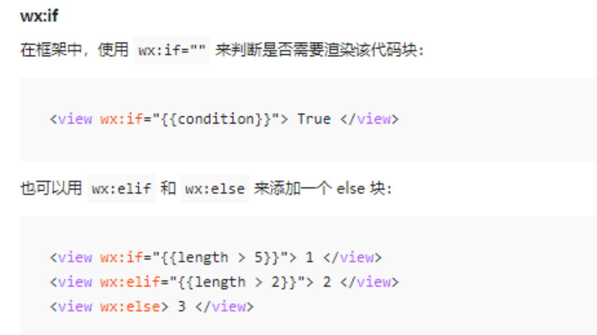

#### 6.4.2 wx:if VS hidden

1. hidden 用法: `<view hidden='{{true}}' ></view>`
2. wx:if 等同于 v-if, 条件为 false 的时候不加载，条件切换的时候决定元素销毁或者
重新加载渲染
3. hidden 等同于 v-show, 始终加载元素, 条件切换的时候决定元素的显示和隐藏


### 6.5 模板使用

#### 6.5.1 定义模板

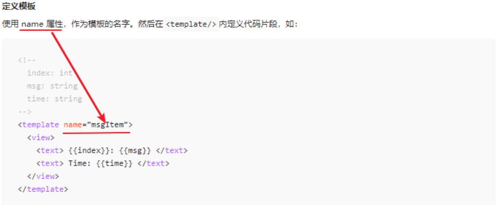

#### 6.5.2 引入模板

1. 引入模板结构: `<import src='模板结构相对路径' />`
2. 引入模板样式: @Import ‘模板样式路径’ 

#### 6.5.3 使用模板

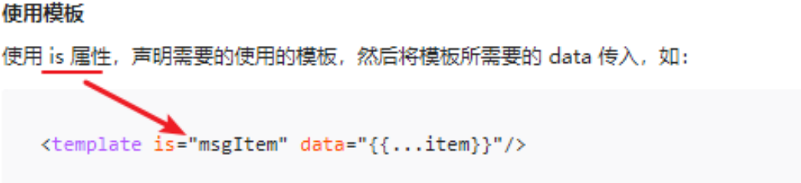

#### 6.5.4 向模板导入数据并使用数据

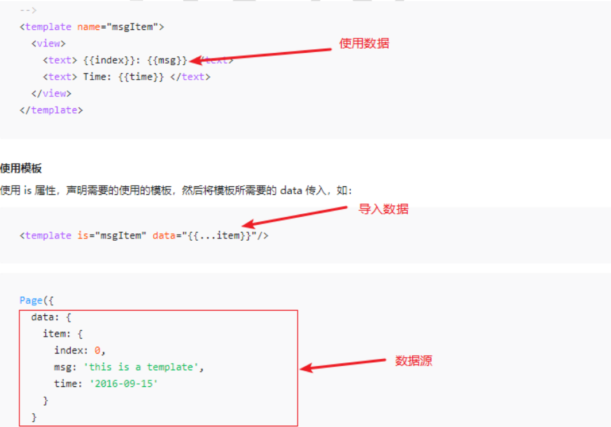

### 6.6 生命周期

#### 6.6.1 对应阶段说明

1. `onLoad(Object query)`

  - 页面加载时触发。一个页面只会调用一次，可以在 onLoad 的参数中获取打开当前页面路径中的参数。

  - 参数：

    | 名称  | 类型   | 说明                     |
    | ----- | ------ | ------------------------ |
    | query | Object | 打开当前页面路径中的参数 |

2. `onShow()`

   - 页面显示/切入前台时触发
   -  会执行多次

3. `onReady()`
	
	- 页面初次渲染完成时触发。一个页面只会调用一次，代表页面已经准备妥当，可以和视图层进行交互。
4. `onHide()`
	
	-  页面隐藏/切入后台时触发。 如 wx.navigateTo 或底部 tab 切换到其他页面，小程序切入后台等。
5. `onUnload()`
	
	- 页面卸载时触发。如 wx.redirectTo 或 wx.navigateBack 到其他页面时。


#### 6.6.2 官网图示说明

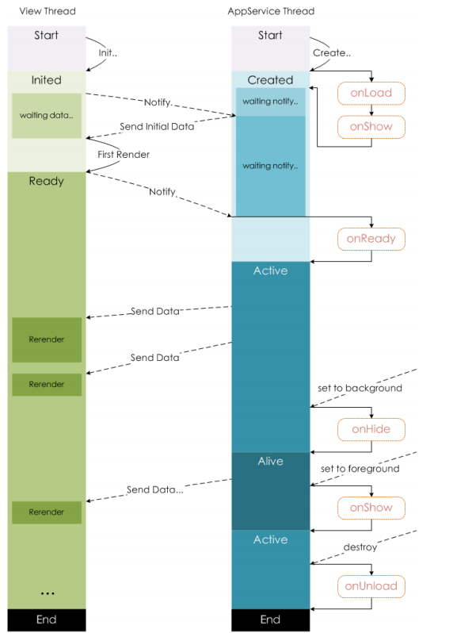


#### 6.6.3 官网对应地址

https://developers.weixin.qq.com/miniprogram/dev/framework/app-service/page-life-cycle.html


## 第 7 章 小程序 API

### 7.1 API 使用说明

1. 小程序提供了很多实用的方法供开发者使用
2. 小程序全局对象是: wx
3. 所有的 API 都保存在 wx 对象中

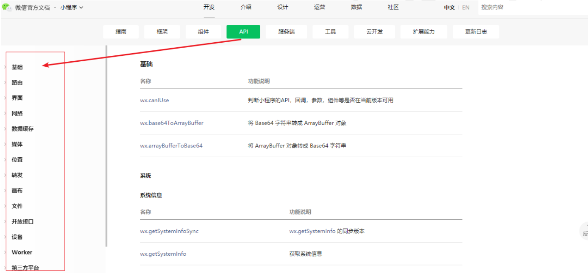

### 7.2 常用 API

1. 界面交互
	- 显示消息提示框: `wx.showToast()`
	- 显示消息加载框: `wx.showLoading()`
	- 关闭消息提示框: `wx.hideToast()`
	- 关闭消息加载框: `wx.hideLoading()`
2. 路由跳转
	- `wx.navigateTo()`
	- `wx.redirectTo()`
	- `wx.switchTab()`
3. 网络请求
   - `wx.request()`
4. 本地存储
	- `wx.setStorage()`
	- `wx.setStorageSync()`
	- `wx.getStorage()`
	- `wx.getStorageSync()`
5. 媒体
	- `wx.getBackgroundAudioManager()`
	- `wx.playVoice()`

### 7.3 快速查找技巧

1. 小程序的初学者可能对于小程序的官网的众多内容一时毫无头绪，无从下手不知道从哪
来找想要的内容
2. 当在小程序中想要实现某一种布局，查看：组件
3. 当在小程序中想要实现某一个功能，查看: API
4. 当在小程序中想要进行某一个配置或者某一种页面语法，查看: 框架 + 指南
5. 查看小程序官网的时候要细心，最好是将要使用的 API 的相关内容看完整，因为 API 的配置及限制较多

## 第 8 章 小程序重点知识汇总

### 8.1 小程序本地存储

#### 8.1.1 语法说明

1. 存入数据
	- `wx.setStorage() `异步
	- `wx.setStorageSync() `同步
	
	```javascript
	wx.setStorage({
	    key: "key",
	    data: "value"
	})
	```
	
	
	
2. 读取数据

   - `wx.getStorage()`异步
   - `wx.getStorageSync()` 同步

   ```javascript
   wx.getStorage({
       key: 'key',
       success(res){
           console.log(res.data)
       }
   })
   ```

3. 删除数据

   - `wx.removeStorage()` 异步

   - `wx.removeStroageSync()` 同步

   ```javascript
   wx.removeStorage({
       key: 'key',
       success(res){
           console.log(res)
       }
   })
   ```

4. 清空数据

   - `wx.clearStorage()` 异步

   - `wx.clearStorageSync()` 同步

   ```javascript
   wx.clearStorage()
   ```

   

#### 8.1.2 注意事项

1. 除非用户主动删除或因存储空间原因被系统清理，否则数据都一直可用
2. 单个 key 允许存储的最大数据长度为 1MB
3. 所有数据存储上限为 10MB

#### 8.1.3 官网对应地址

https://developers.weixin.qq.com/miniprogram/dev/api/storage/wx.setStorage.html

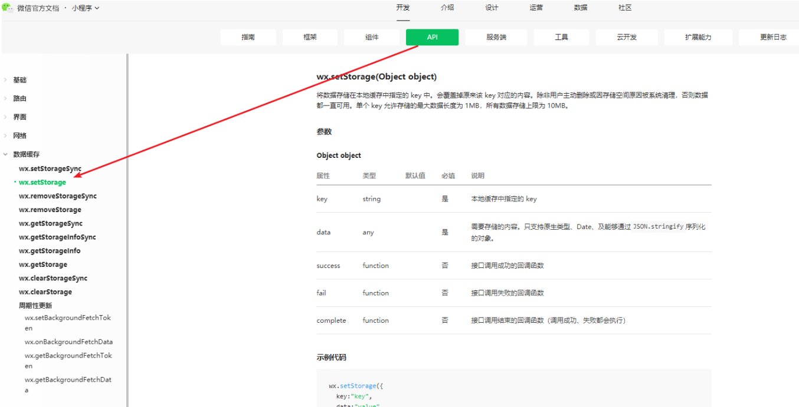

### 8.2 小程序前后端交互

#### 8.2.1 语法说明

1. `wx.request()`

   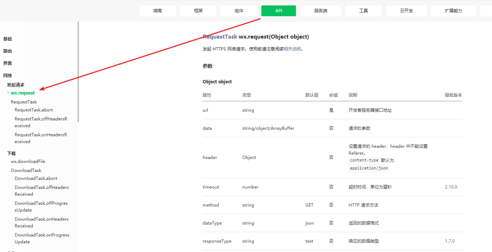

#### 8.2.2 相关配置

1. 每个微信小程序需要事先设置通讯域名，小程序只可以跟指定的域名进行网络通信
2. 服务器域名请在 「小程序后台-开发-开发设置-服务器域名」 中进行配置
3. 默认超时时间和最大超时时间都是 60s
4. 超时时间可以在 app.json 中通过 networktimeout 配置

#### 8.2.3 注意事项

1. 小程序为了安全起见只支持 Https 请求

2. wx.request 最大并发限制 10 个 

  

#### 8.2.4 官网对应地址

https://developers.weixin.qq.com/miniprogram/dev/api/storage/wx.setStorage.html

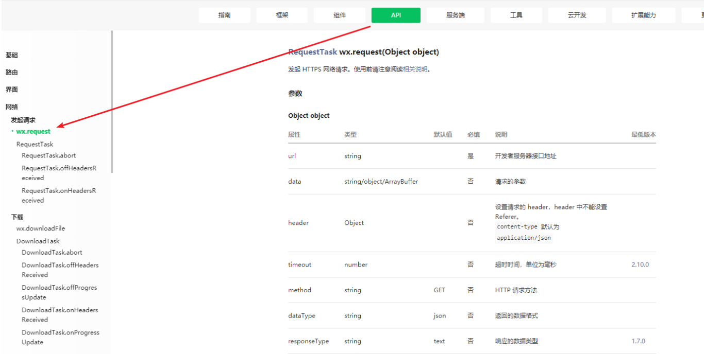

### 8.3 小程序页面通信

#### 8.3.1 路由传参

1. 传参方式
	- 路由地址中 + query 传参数
	- 示例： `url?a=123`
2. 获取参数
	
	- 跳转目标页面的 onLoad 函数中的 options 实参中获取
	
	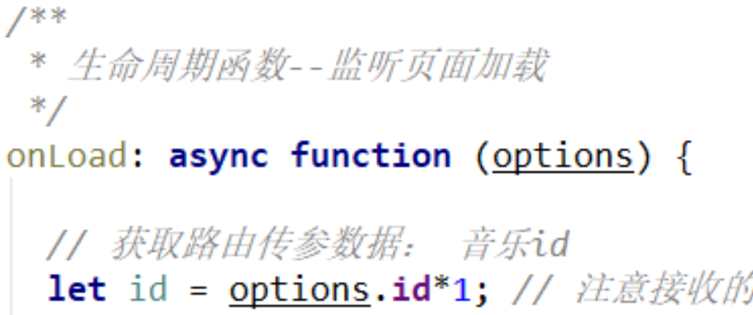

#### 8.3.2 消息订阅发布

1. 使用第三方库: `pubsub-js`
2. 安装: `npm install pubsub-js`
3. 使用：
	- `Import PubSub from ‘pubsub-js’`
	- 订阅消息: `PubSub.subscribe(‘eventName’, callback) `
	- 发布消息: `PubSub.publish(‘eventName’, data)`
	- 取消订阅: `PubSub.unsubscribe(‘eventName’)`

#### 8.3.3 eventChannel 事件通道

1. 订阅事件

  - `wx.navigateTo()`跳转的时候在 events 选项中定义事件名及事件对应的回调

  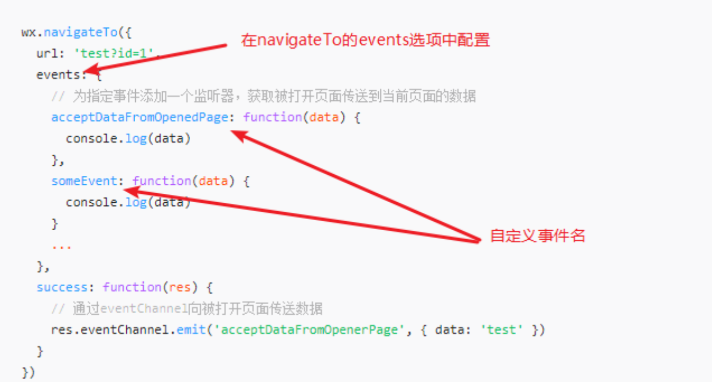

2. 获取事件总线对象

   - 目标页面中通过: `实例.getOpenerEventChannel()`
   - b) 示例: `const eventChannel = this.getOpenerEventChannel()`

3. 触发事件

   - `eventChannel.emit(‘事件名’, data)`

   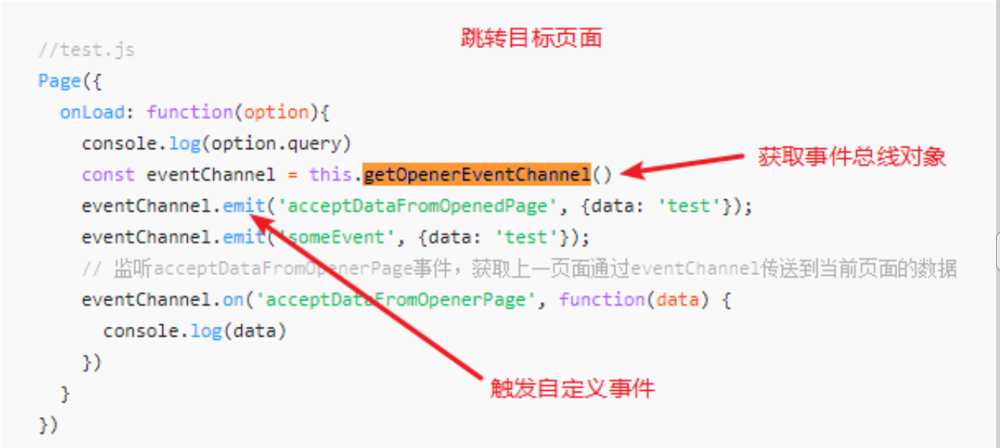

### 8.4 小程序自定义组件

#### 8.4.1 创建组件

1. 开发工具中右键新建组件

2. 组件对应的 json 文件中设置: component: true

   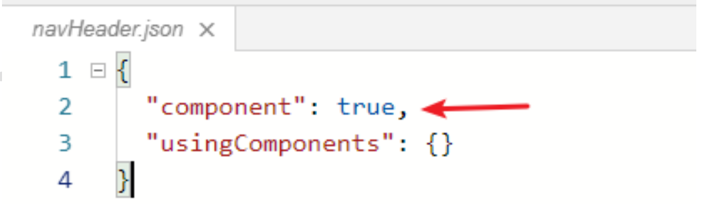

#### 8.4.2 使用组件

1. 使用组件的页面的 json 文件中注册使用组件

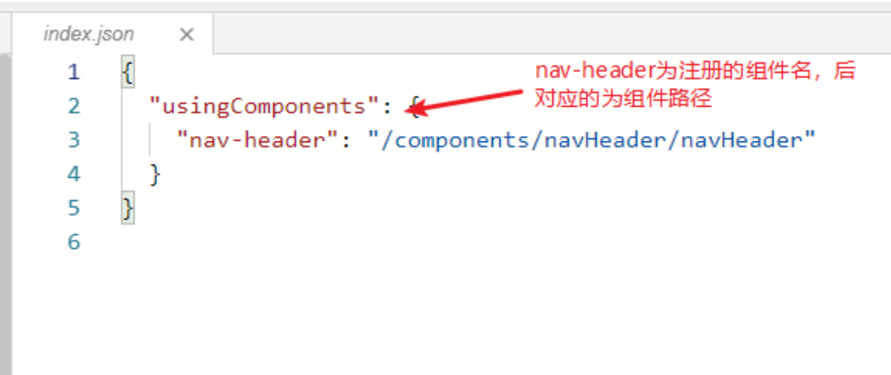


### 8.5 小程序使用 npm 包

#### 8.5.1 初始化 package.json

`npm init`

#### 8.5.2 勾选允许使用 npm

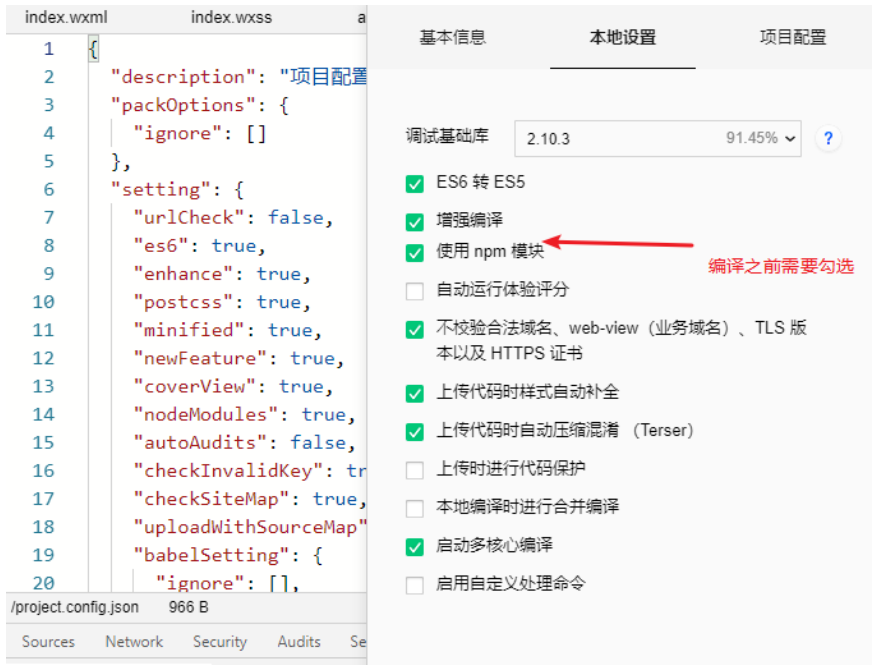


#### 8.5.3 下载 npm 包

`npm install packageName`

#### 8.5.4 构建 npm

1. 开发工具 ---> 工具 ---> 构建 npm
2. 会将 node_modules 中的包打包到 miniprogram_npm 中 

#### 8.5.5 流程执行不完整带来的错误

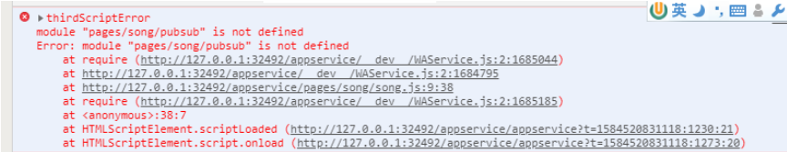

### 8.6 小程序获取用户基本信息

#### 8.6.1 首次登陆获取

1. Button 组件设置 open-type 属性为 getUserInfo
2. `<button open-type='getUserInfo'></button>`
3. 设置后首次登陆点击 button 可以弹出授权窗口
4. 注意： 授权的动作只发生一次，除非清除缓存，点击 butotn 授权一次之后再点击
失效，不会弹出授权窗口
5. 官网对应地址
https://developers.weixin.qq.com/miniprogram/dev/component/button.html

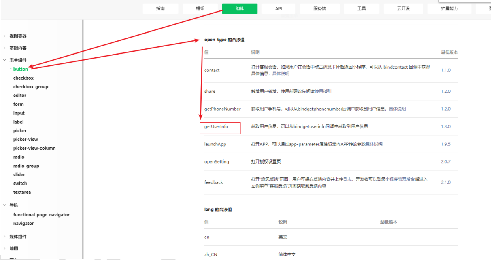

#### 8.6.2 授权之后获取

1. `wx.getUserInfo()`
2. 官网对应地址:https://developers.weixin.qq.com/miniprogram/dev/api/open-api/user-info/wx.getUserInfo.html

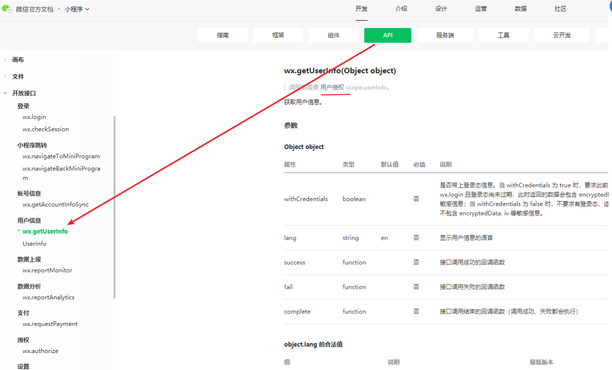

### 8.7 小程序获取用户唯一标识（openId）

#### 8.7.1 官网图解

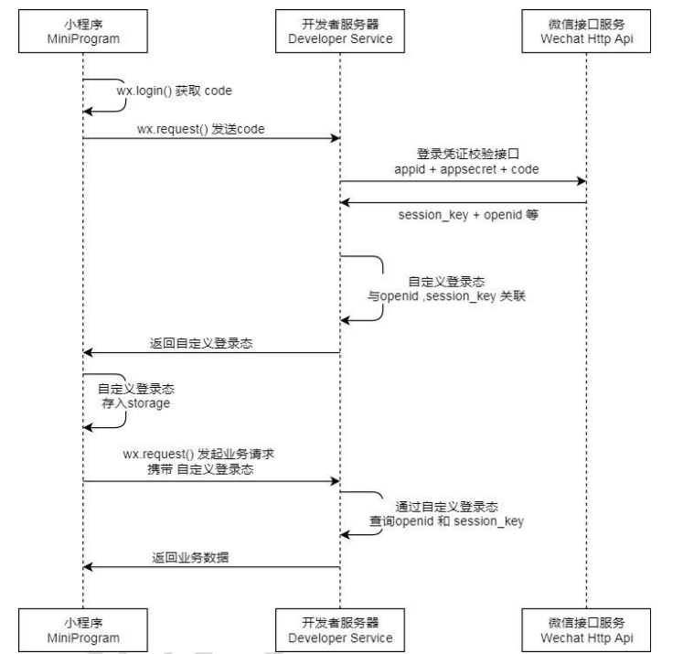


#### 8.7.2 获取流程

1. `wx.login()`

   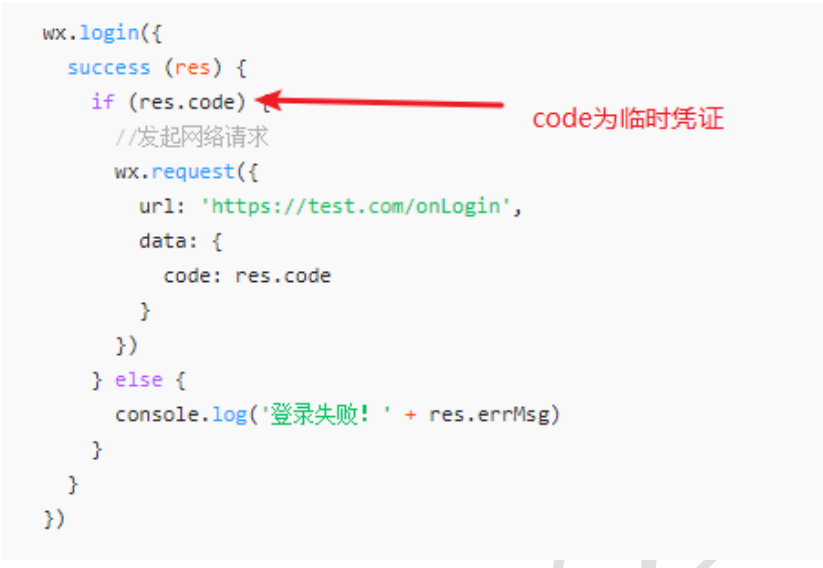

2. 发送 code 给服务器端

3. 服务器端发送请求携带参数(code, appSecret, appId)给微信服务器获取 openId

  - 接口地址:

4. appSecret，appId 在小程序首页获取

   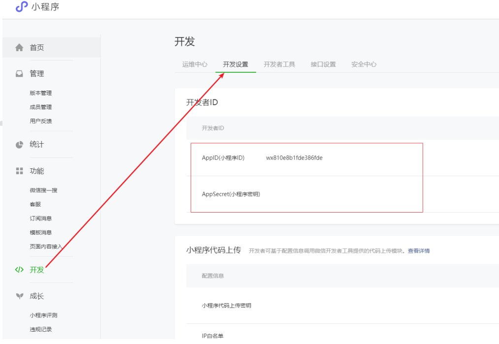

5. 服务器获取 openId 后进行加密返回给前端

#### 8.7.3 获取接口地址

- 请求方法：` GET `
- 请求地址: `https://api.weixin.qq.com/sns/jscode2session?appid=APPID&secret=SECR
ET&js_code=JSCODE&grant_type=authorization_code`

### 8.8 小程序分包流程

#### 8.8.1 为什么要分包

1. 小程序要求压缩包体积不能大于 2M，否则无法发布
2. 实际开发中小程序体积如果大于 2M 就需要使用分包机制进行发布上传
3. 分包后可解决 2M 限制，并且能分包加载内容，提高性能
4. 分包后单个包的体积不能大于 2M
5. 分包后所有包的体积不能大于 16M 

#### 8.8.2 分包形式

1. 常规分包
2. 独立分包
3. 分包预下载

#### 8.8.3 常规分包

1. 开发者通过在 app.json subpackages 字段声明项目分包结构
2. 特点：
	- 加载小程序的时候先加载主包，当需要访问分包的页面时候才加载分包内容
	- 分包的页面可以访问主包的文件，数据，图片等资源
	- 主包：
    	- 主包来源： 除了分包以外的内容都会被打包到主包中
        - 通常放置启动页/tabBar 页面

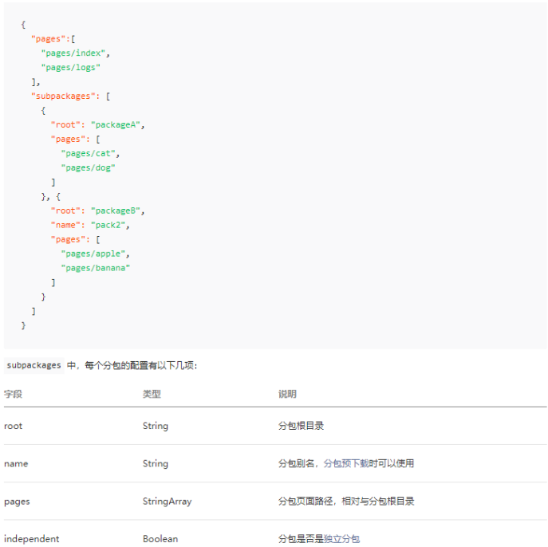

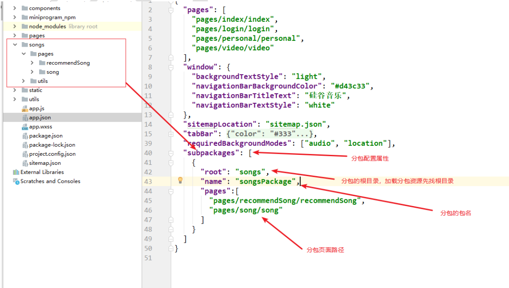


#### 8.8.4 独立分包

1. 设置 `independent 为 true`

2. 特点:
	- 独立分包可单独访问分包的内容，不需要下载主包
	- 独立分包不能依赖主包或者其他包的内容
	
3. 使用场景
	- 通常某些页面和当前小程序的其他页面关联不大的时候可进行独立分包
	- 如：临时加的广告页 `|| `活动页
	
	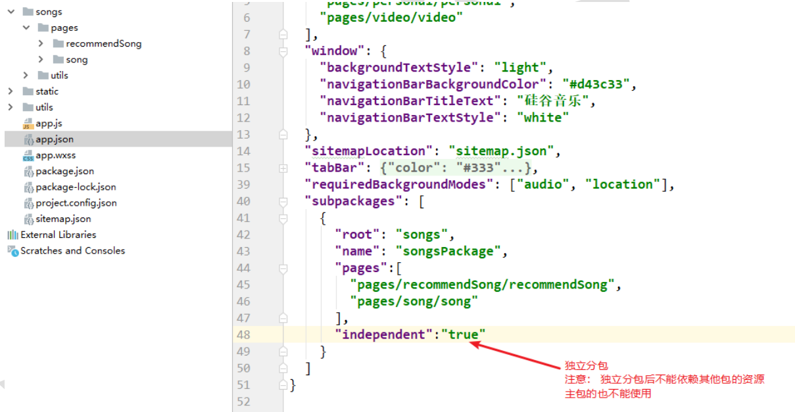


#### 8.8.5 分包预下载

1. 配置

  - app.json 中设置 preloadRule 选项
  - key(页面路径): {packages: [预下载的包名 || 预下载的包的根路径])}

  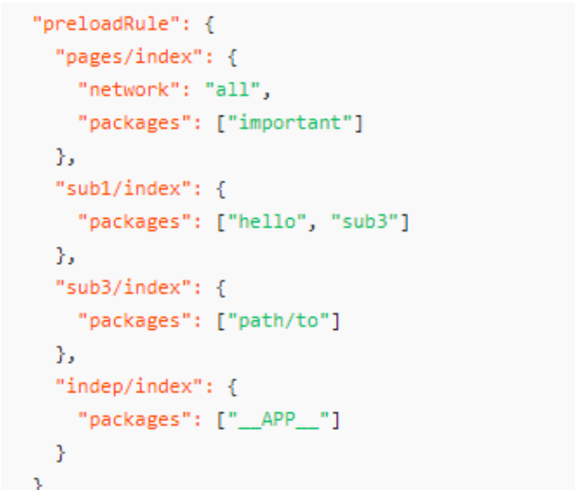

  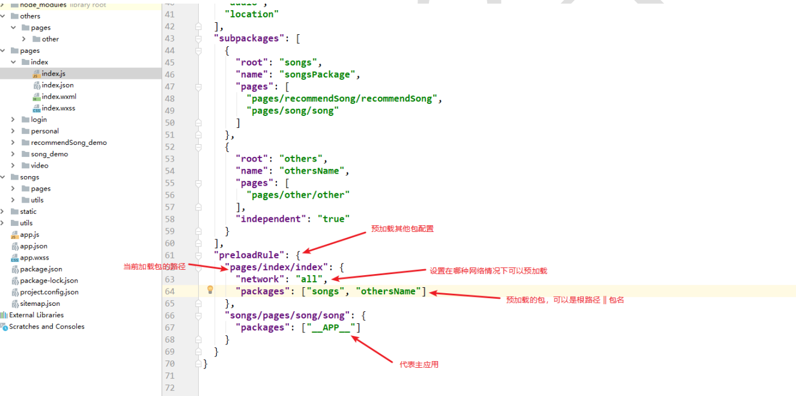

2. 特点:

   - 在加载当前包的时候可以设置预下载其他的包
   - 缩短用户等待时间，提高用户体验


#### 8.8.6 分包效果演示


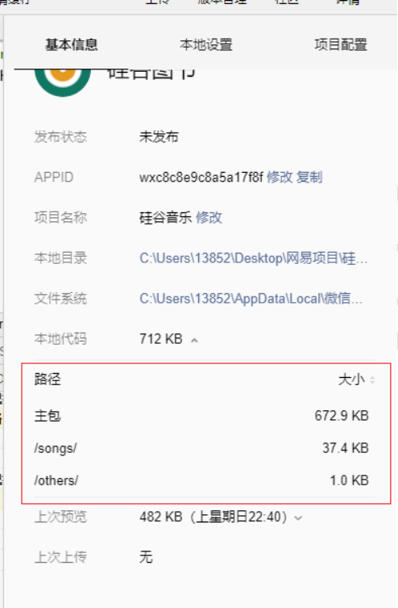

#### 8.8.7 官网对应地址

https://developers.weixin.qq.com/miniprogram/dev/framework/subpackages.html


### 8.9 小程序转发分享

#### 8.9.1 分享实现

1. Button 组件设置 open-type 为 share
2. `<button open-type='share' ></button>`

#### 8.9.2 自定义分享内容

1. 生命周期回调中 onShareAppMessage 回调中 return 对象设置自定义内容

   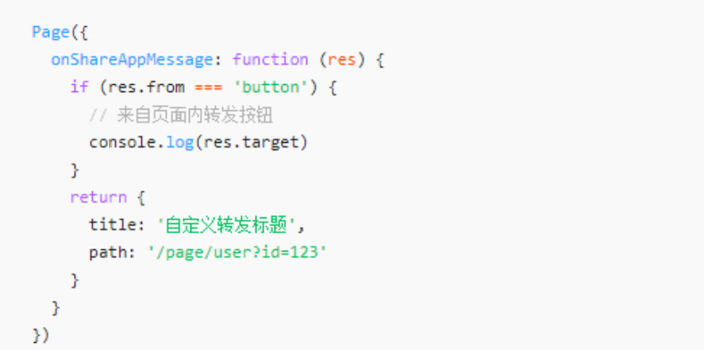

#### 8.9.3 设置体验权限

1. 开发阶段分享给微信好友，默认没有体验权限，无法打开分享小程序，需要在开发页面设置

2. 最多添加 15 个微信好友

   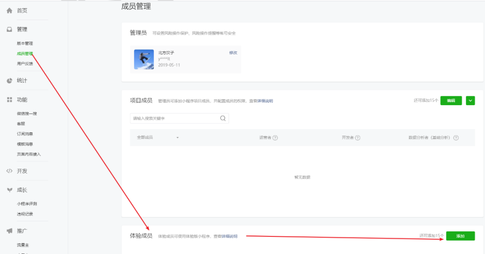

### 8.10 小程序支付流程

#### 8.10.1 支付流程官网图解

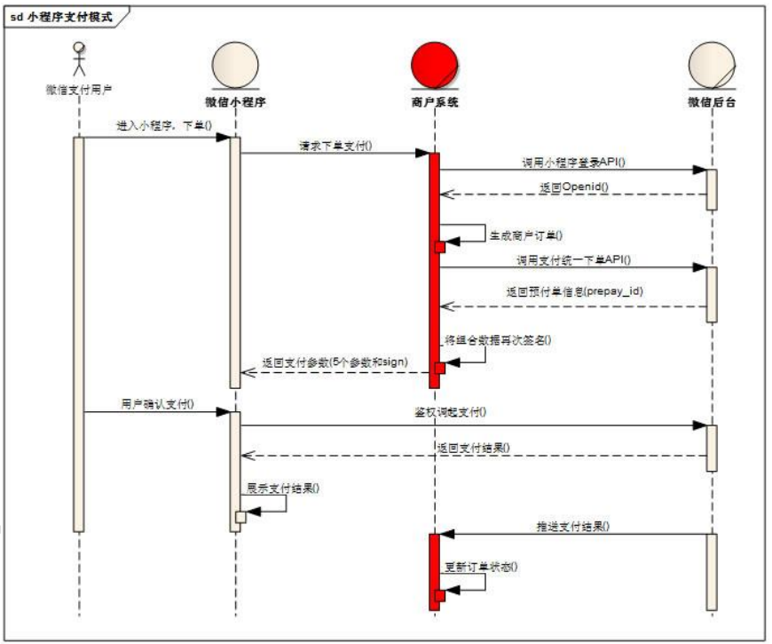

#### 8.10.2 支付流程详细说明

1. 用户在小程序客服端下单(包含用户及商品信息)
2. 小程序客户端发送下单支付请求给商家服务器
3. 商家服务器同微信服务器对接获取唯一标识 openID
4. 商家服务器根据 openId 生成商户订单(包含商户信息)
5. 商家服务器发送请求调用统一下单 API 获取预支付订单信息
	- 接口地址: https://api.mch.weixin.qq.com/pay/unifiedorder
6. 商家对预支付信息签名加密后返回给小程序客户端
   - 签名方式： MD5
   - 签名字段：小程序 ID, 时间戳， 随机串，数据包，签名方式
   - 参考地址 :https://pay.weixin.qq.com/wiki/doc/api/wxa/wxa_api.php?chapter=7_7&index=3
7. 用户确认支付（鉴权调起支付）
   - API: wx.requestPayment()
   - 微信服务器返回支付结果给小程序客户端
9. 微信服务器推送支付结果给商家服务器端


#### 8.10.3 官网对应地址

https://pay.weixin.qq.com/wiki/doc/api/wxa/wxa_api.php?chapter=7_3&index=1


# 项目实战: 硅谷云音乐

> 根据前面学习的基础知识开发一款类似于网易云音乐的小程序实战

## 开发需求文档

**硅谷云音乐需求文档**

### 1. 页面列表
1. 主页
2. 视频 video 页
3. 个人中心页
4. 登录页
5. 推荐歌曲页
6. 音乐播放页
7. 搜索页

### 2. 对应页面预览

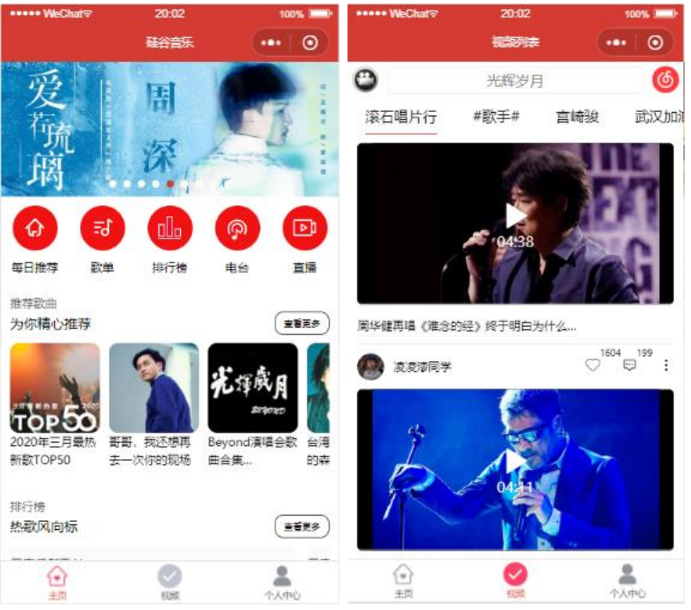

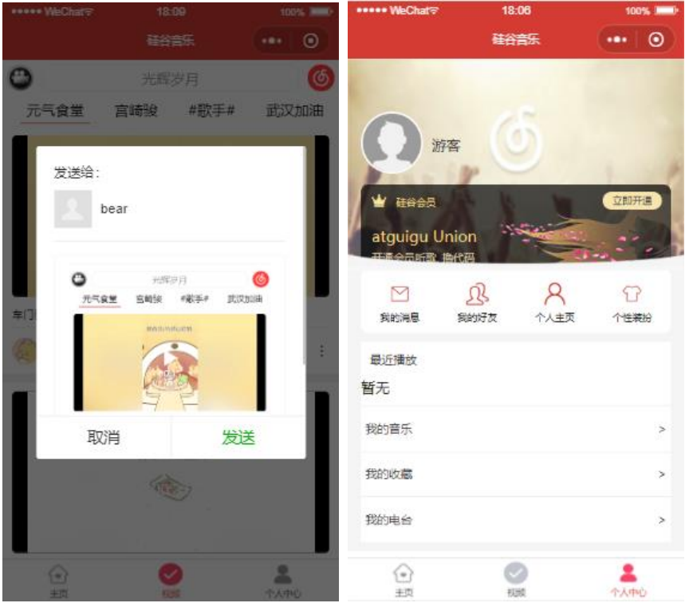

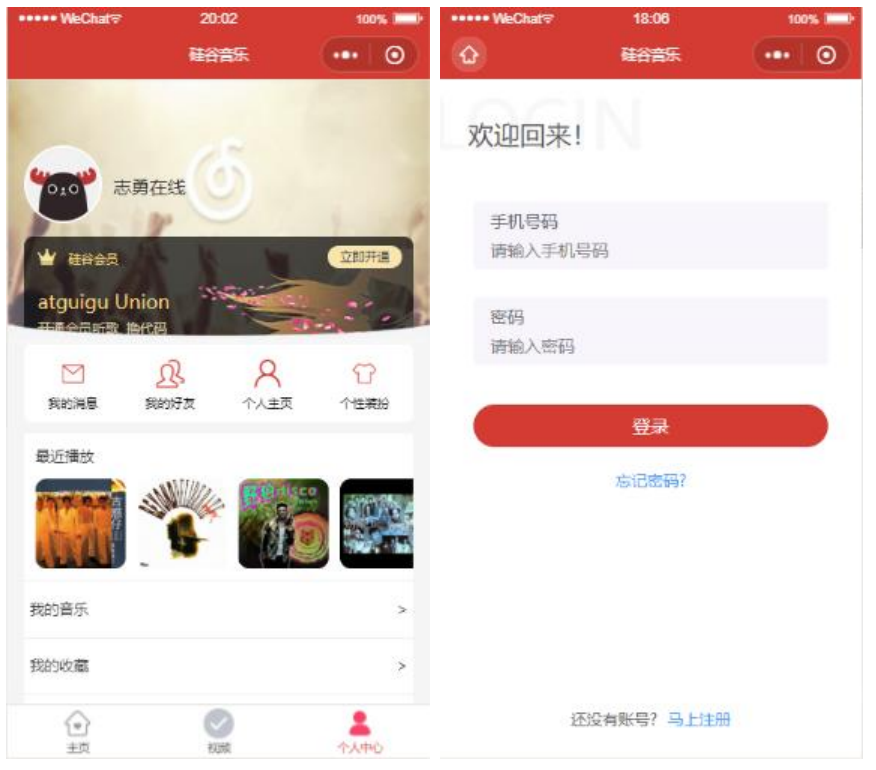

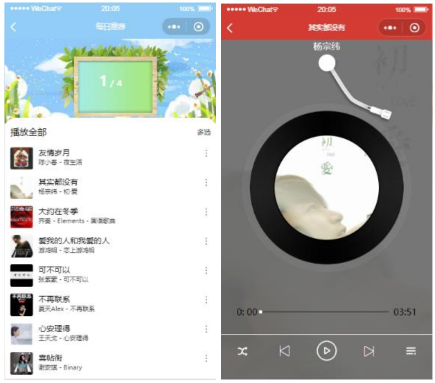

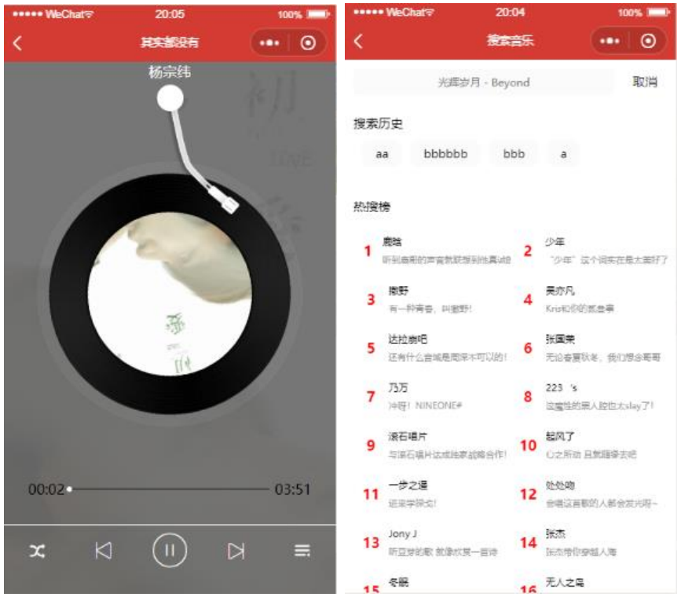

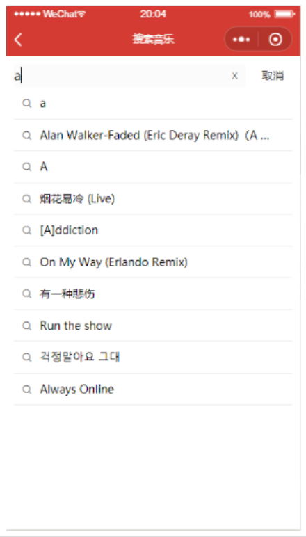

### 3. 功能模块说明
#### 3.1 主页 
1. Banner 轮播图

2. 图标导航区域

3. 推荐歌曲模块
	
	- 需要实现动态滑块效果(左右滑动)
	
4. 排行榜模块

   - 排行榜分类类目有 0-20 共 21 种
   - 需要取前 5 种分类显示
   - 整体实现轮播效果，当前滑块中显示后一个滑块部分内容

   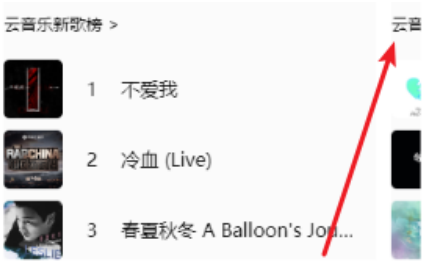

#### 3.2 视频 video 页

1. 头部搜索区域
	
	- 点击跳转至搜索界面
	
2. 导航模块
	- 动态获取数据
	- 点击动态切换视频列表数据，对应下边框动态切换，且有过渡效果
	
3. 视频列表模块
	- 用户没有登录直接跳转至登录界面
	- 用户登录后，动态获取数据
	- 需要用户 cookie 身份验证
	- 视频播放
	- 图片替代 video 标签性能优化
	
4. 分享功能
	
	- 点击视频列表模块右下角‘三个点区域’实现转发分享
	
	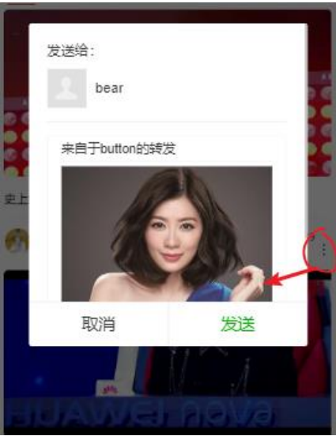


#### 3.3 个人中心页 
1. 头部模块
	- 用户未登录显示默认头像图片，及游客姓名，
	- 用户未登录的时候可以跳转至登录界面，登录以后点击不跳转
	- 用户登录显示用户头像及账号名
	
2. 最近播放模块
	- 用户登录后显示用户最近播放记录
	- 需要实现动态滑动模块
	
3. 内容区模块
	- 手指滑动内容区跟随移动，只能向下移动，最大移动距离 80rpx
	- 使用技术： transform
	
	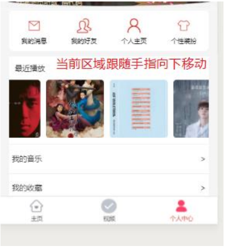

#### 3.4 TabBar 模块 
1. 主页, 视频页, 个人中心页通过 TbaBar 实现，可以实现点击切换

2. TabBar 置底

   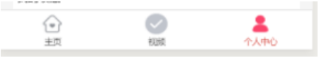

#### 3.5 登录界面 
1. 个人中心，video 视频页可以点击跳转至登录界面
2. 网易云音乐真实接口(手机号 + 密码登录)
3. 前端验证
   - 验证手机号是否合法
4. 后端验证
	- 登录成功后将用户信息存入至本地
	- 登录成功后跳转至个人中心页

#### 3.6 每日推荐页 
1. 头部模块
	- 利用 date 函数显示当前日期
2. 歌曲列表模块
	- 显示推荐歌曲列表
	- 同详情播放页进行交互

#### 3.7 歌曲详情页 
1. C3 动画功能
	- 根据音乐播放的状态动态控制摇杆，磁盘进行动画
2. 音乐播放功能
	- 根据点击按钮控制音乐播放暂停
	- 根据点击系统控制音乐播放按钮控制音乐播放/暂停/停止
	- 正确显示音乐的播放状态(页面后退再进入)
3. 切换歌曲功能
   - 点击切换按钮切换歌曲
   - 需要同推荐歌曲页面进行交互
4. 进度条控制模块
   - 显示音乐的总时长和实时播放的时长
   - 进度条根据音乐的播放进度正确显示

#### 3.8 搜索界面 
1. 页面数据动态显示
	- 需要访问对应的接口
2. 搜索功能
	- 根据用户输入的数据进行模糊匹配动态显示数据
3. 历史记录模块
	- 根据用户的搜索内容显示用户的搜索记录
	- 数据需要存入至本地 storage


## 硅谷云音乐接口文档

**接口使用说明**

```markdown
1. 代码中找到服务器： 硅谷音乐_server
2. 在服务器根目录下执行: npm start
3. 服务器端地址: localhost: 3000
4. 请求示例: http://localhost:3000/banner
```

**硅谷音乐接口文档**

### 1. 接口文档说明
该项目所有接口使用的都是由网易云音乐提供的开放接口, 最终请求的地址是自己使用
NodeJs 搭建的服务器接口，流程为先请求自己搭建的 NodeJs 服务器，由 NodeJs 转发请求给
网易云音乐的服务器，此举的目的是为了接口规范, 统一化
### 2. 适用项目 
音乐类项目
### 3. 接口列表 
#### 3.1 banner 轮播图

➢ 说明: 调用此接口 , 可获取 banner( 轮播图 ) 数据

➢ 接口地址 : /banner

➢ 请求方式: GET

➢ 可选参数 :type:资源类型,对应以下类型,默认为 0 即 PC


#### 3.2 推荐歌单
#### 3.3 排行榜
#### 3.4 手机号登录
#### 3.5 获取用户播放记录
#### 3.6 获取视频标签列表
#### 3.7 获取视频标签下对应的视频数据
#### 3.8 获取每日推荐歌曲
#### 3.9 获取音乐详情
#### 3.10 获取歌曲播放地址
#### 3.11 默认搜索关键字接口
#### 3.12 热搜榜接口
#### 3.13 搜索接口


