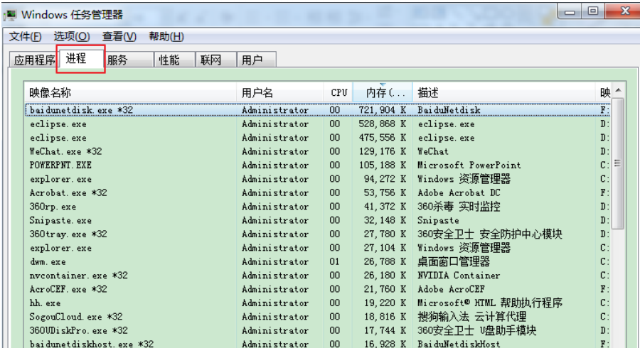

# 多线程基本概念

> 多线程学习目标:
>
> 1. 基本概念：程序、进程、线程
> 2. 线程的创建和使用
> 3. 线程的生命周期
> 4. 线程的同步
> 5. 线程的通信
> 6. JDK5.0新增线程创建方式

## 程序丶进程丶线程的基本概念

**程序(program)**:是为完成特定任务、用某种语言编写的一组指令的集合。即指段静态的代码，静态对象。

**进程(process)**:是程序的一次执行过程，或是正在运行的一个程序。是一个动态的过程：有它自身的产生、存在和消亡的过程。生命周期;例如：运行中的QQ，运行中的MP3播放器都是进程;下图就是查看电脑的进程

**程序和进程的区别:** ①程序是静态的，进程是动态的 ②进程作为资源分配的单位，系统在运行时会为每个进程分配不同的内存区域

**线程(thread)**:进程可进一步细化为线程，是一个程序内部的一条执行路径。

- 若一个进程同一时间并行执行多个线程，就是支持多线程的
- 线程作为调度和执行的单位，每个线程拥有独立的运行栈和程序计数器（pc），线程切换的开销小
- 一个进程中的多个线程共享相同的内存单元/内存地址空间 它们从同一堆中分配对象，可以访问相同的变量和对象。这就使得线程间通信更简便、高效。但多个线程操作共享的系统资源可能就会带来安全的隐患。

## 单核CPU和多核CPU的理解

- 单核CPU，其实是一种假的多线程，因为在一个时间单元内，也只能执行一个线程的任务。例如：虽然有多车道，但是收费站只有一个工作人员在收费，只有收了费才能通过，那么CPU就好比收费人员。如果有某个人不想交钱，那么收费人员可以把他“挂起”（晾着他，等他想通了，准备好了钱，再去收费）。但是因为CPU时间单元特别短，因此感觉不出来。

- 如果是多核的话，才能更好的发挥多线程的效率。（现在的服务器都是多核的）

- 一个Java应用程序java.exe，其实至少有三个线程：main()主线程，gc()垃圾回收线程，异常处理线程。当然如果发生异常，会影响主线程。 

## 并行与并发

**并行:** 多个CPU同时执行多个任务。比如：多个人同时做不同的事。

**并发:** 一个CPU(采用时间片)同时执行多个任务。比如：秒杀、多个人做同一件事。

## 使用多线程的优点

**背景：**以单核CPU为例，只使用单个线程先后完成多个任务（调用多个方法），肯定比用多个线程来完成用的时间更短，为何仍需多线程呢？

**多线程程序的优点：**

1. 提高应用程序的响应。对图形化界面更有意义，可增强用户体验。

2. 提高计算机系统CPU的利用率

3. 改善程序结构。将既长又复杂的进程分为多个线程，独立运行，利于理解和

修改

## 何时需要多线程

1. 程序需要同时执行两个或多个任务。

2. 程序需要实现一些需要等待的任务时，如用户输入、文件读写操作、网络操作、搜索等。

   1. 需要一些后台运行的程序时。 

   