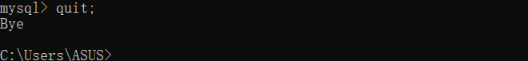
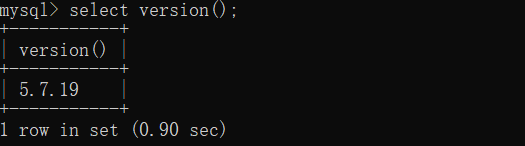

# MySQL安装与使用


## 1. MySql数据库产品的介绍

Mysql的历史: MySQL数据库隶属于MySQLAB公司，总部位于瑞典，后被oracle收购。

MySQL的优点:

- 成本低：开放源代码，一般可以免费试用
- 性能高：执行很快
- 简单：很容易安装和使用

DBMS分为两类

- 基于共享文件系统的DBMS（Access)
- 基于客户机-服务器的DBMS（MySQL丶Oracle丶SqlServer）

MySQL提供两种版本

- [社区版（免费）](http://dev.mysql.com/downloads/mysql)
- 企业版（收费）


## 2. MySQL的卸载与安装

*由于我安装了,所以跳过...对应视频:*

- *07-MySQL软件的安装*

### MySQL的卸载

- 卸载服务

- 删除安装路径

### MySQL的安装

- next...next...

## 3. MySQL的配置文件my.ini

```ini
#客户端的配置(无需关注)
[mysql]
#服务端的配置
[mysqld] 
# 配置mysql服务的端口号3306
port=3306
#配置mysql存放数据文件的路径
datadir=""
# 设置字符集编码
charcter-set-server=utf8
# 设置数据库的存储引擎
default-storage-engine=INNODB
# 设置最大连接数
max_connection=100
```


## 4. MySQL服务的启动与停止

*启动与停止mysql的服务有两种方式*

- *windows上可以通过服务来进行mysql服务的启动与停止*
- *也可以通过cmd命令方式来进行服务的启动与停止*

### 4.1 方式一

1. 按住win+Q后输入服务

   

2. 然后根据选项进行停止和启动服务

   

### 4.2 方式二:命令行(推荐使用)

1. 按住win+q输入cmd,然后 <u>以管理员身份打开</u> 进行开启服务

   

2. 停止mysql服务

   ```shell
   # 这里的mysql是自己的服务名,不一定就是mysql,需要看你自己的mysql的服务名字
   net stop mysql
   ```

   

3. 启动服务

   ```bash
   # 同理,启动的服务是名字为mysql的服务
   net start mysql
   ```

   


## 5. MySQL服务的登录与退出

*MySQL服务的登录与退出也可以通过两种方式*

- *mysql自带的客户端Client进行登录与退出*
- *直接通过命令行的方式进行登录与退出*

### 5.1 登录mysql

#### 5.1 方式一

*点击mysql的客户端后,直接输入密码*

*局限性: 只适用于root用户*


#### 5.2 方式二: 命令行(推荐使用)

```shell
# 完整的登录命令如下
mysql -h主机名 -p端口 -u用户名 -p密码
# 解释说明
# 主机名: 如果是本机可使用127.0.0.1或localhost,因为后期会连服务器
# 端口: 服务的端口,mysql一般是3306
# 用户名: 之前安装时设置的用户名
# 密码:之前安装时设置的密码 密码可以直接明文跟在p后面,也可以回车后暗文输入

#连接例子:
mysql -hlocalhost -p3306 -uroot -p1234
```

如图显示的就是登录成功后的状态


*可以使用简单的命令进行连接,简化主机和端口的设置,直接通过用户名和密码即可*

```shell
mysql -u用户名 -p密码
```


### 5.2 退出mysql(命令行)

*退出mysql有多种方式*

1. 可使用`exit;`就可直接退出mysql

   ```shell
   exit;
   ```

   

2. 可使用`quit;`退出

   ```shell
   quit;
   ```

   

3. 可使用`\q`退出

   ```shell
   \q
   ```

   


## 7. MySQL环境变量的配置

- 新建一个`MYSQL_HOME`的变量名,然后变量值配置成mysql的安装路径;例如`D:\environment\mysql-5.7.19-winx64`

- 然后再到Path中添加`%MYSQL_HOME%\bin`


## 8. MySQL的常见命令

### 8.1 查看DBMS中的所有数据库

```shell
show databases;
```


### 8.2 进入到某个数据库中(切换仓库)

```shell
use 数据库名;
# 例如 进入到demo数据库中
use demo;
```


### 8.3 查看某个数据库下所有的表

*提供了两种方式查看仓库中的表*

方式一:

```shell
use 仓库
show tables;
# 注意:通过这种方式一定要线使用这个数据库才可以

#例如:
use demo;
show tables;
```

方式二:

```shell
show tables from 库名;
#  注意: 通过这种方式可以不用先use命令,可直接查看库中的表

# 例如:
show tables from demo;
```


*ps:下面这些命令后面会讲,现在只看看就好了* 

创建一个表

```sql
create table t_user(
id int,
name varchar(20)
);
-- t_user表示表的名字
-- 后面两行,前面表示字段的名字,后面表示字段的类型
```

查看表的结构

```sql
desc 表名;
-- 例如: 查看t_user表的结构
desc t_user;
```

查询表中的数据

```sql
select * from 表名;
-- 例如: 查询t_user表的数据
select * from t_user;
```

向表中插入数据

```sql
insert into 表名(字段1,字段2) values(数据1,数据2);
-- 例如: 插入一个用户
insert into t_user(id,name) values(1,"小明");
```

修改表中的数据

```sql
update 表名 set 字段="值" where 字段="值";
-- 例如: 将小明的名字修改为小红
update t_user set name="小红" where id=1;
```

删除表中的数据

```sql
delete from 表名 where 字段=值;
-- 例如: 将id为1的数据删除
delete from t_user where id=1;
```

## 9. 查看mysql的版本

*通过命令行方式查看数据库版本*

方式一: mysql环境下查看mysql数据库版本

```sql
select version();
```



方式二: cmd命令行模式下查看mysql版本

```shell
mysql --version
# 简写:
mysql -V
```


## 10. MySQL的语法规范

1. 不区分大小写,但建议关键字大写,表名,列名小写
2. 建议每条命令使用`;`结尾
3. 每条命令根据需要,可以进行缩进或换行
4. mysql注释
   - 单行注释: `#注释文字`
   - 单行注释:`-- 注释文字`
   - 多行注释: `/*注释文字*/`

## 11. 图形界面安装

*已经安装navicate15,所以没有安装sqlyong,视频对应:*

- *16-图形化用户界面客户端的安装*
- *17-图形化用户界面客户端的介绍*


