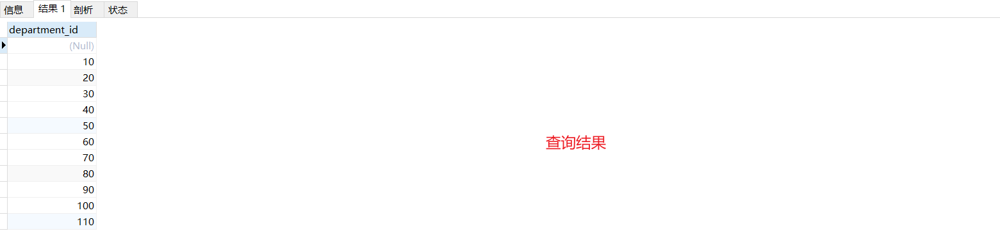

# 数据处理之查询(DQL)

> 本章专门做表中数据查询的
>
> DQL查询数据是SQL中的重中之重!!!
>
> 从文末的附录开始看最好,文末有本文中需要的表文件和数据

## 1. 基础查询-SELECT

```sql
-- 语法:
SELECT 查询列表 FROM 表名
/*
1. 查询列表可以是: 表中的字段丶常量丶表达式丶函数
2. 查询的结果是一个虚拟的表格,不是真实的表格
*/
```

### 1.1 查询表中的单个字段

```sql
-- 查询员工表中的姓名
SELECT last_name FROM employees;
```


### 1.2 查询表中的多个字段

```sql
-- 查询员工表中多个字段的员工信息
SELECT last_name,salary,email FROM employees;
-- 注意: 多个列之间使用逗号连接
```


### 1.3 查询表中的所有字段

```sql
SELECT employee_id,
employee_id,
first_name,
last_name,
email,
phone_number,
job_id,
salary,
commission_pct,
manager_id,
department_id,
hiredate
FROM employees;
-- ---------------------或者使用*,会按照表字段的顺序进行显示
SELECT * FROM employees;
```


### 1.4 查询常量值

```sql
-- 查看100
SELECT 100;
-- 查看字符型的常量值
SELECT "小明";
```


### 1.5 查询表达式

```sql
SELECT 100%99;
```


### 1.6 查询函数

```sql
-- 调用xx()方法返回结果
SELECT VERSION();
```


### 1.7 给字段起别AS

*起别名好处:*

- *给字段起别名方便理解*
- *如果要查询的字段有重名的情况，使用别名可以区分开来*

```sql
SELECT 100%99 AS 结果;
```


```sql
-- 使用AS
SELECT last_name AS 姓,first_name AS 名 FROM employees;
-- AS可以进行省略
SELECT last_name 姓,first_name 名 FROM employees;
```


**【案例】**

```sql
-- 查询salary,显示结果为out put(注意:如果有特殊符号,需要使用""引起来)
SELECT salary AS out put FROM employees; -- 报错
SELECT salary AS 'out put' FROM employees; -- 正确
SELECT salary AS "out put" FROM employees; -- 正确
```


### 1.8 去重-DISTINCT

*去除重复的数据*

```sql
-- 查询员工表中涉及到的所有部门编号
SELECT DISTINCT department_id FROM employees;
```



### 1.9 MySQL`+`的作用

*Mysql中+仅仅只有一个作用: 用于做运算符*

```sql
-- 当两个操作数都是数值型,则做加法运算
SELECT 100+90;
-- 有其中一放为字符型,会试图将字符型数值转换为数值型
	-- 如果转换成功则继续做加法运算
	SELECT "100"+90;
	-- 如果转换失败,则将字符型数值转换为0,再运算
	SELECT '小明'+90;
	-- 只要其中一方为null,结果就是null
	SELECT '90'+NULL;
```


**【案例】**

```sql
-- 员工名和姓连接成一个字段,并显示为姓名
SELECT last_name+first_name AS 姓名
FROM employees; -- 报错(MySQL中的+无法做连接)
-- CONCAT()函数可以做连接
SELECT CONCAT('A',"B","C"); -- 结果就是ABC
-- 使用CONCAT()完成上面的例子
SELECT CONCAT(last_name,first_name) AS 姓名 FROM employees;
```


## 2. 条件查询-WHERE

```sql
-- 语法
SELECT 查询列表 FROM 表名 WHERE 筛选条件;
-- 执行顺序
/*
1. 先执行FROM
2. 执行WHERE
3. 执行SELECT
先会查看是否有这个表,然后进行数据筛选,最后执行SELECT查出结果
*/
-- 筛选条件的分类
/*
1. 按条件表达式进行筛选 条件运算符: > < = !=(<>) >= <=
2. 按逻辑表达式筛选 逻辑运算符: 
	&&(and) : 如果两个条件都为true,结果为true,只有一个为false,结果就是false
	||(or) : 如果一个条件为true,结果就是true
	!(not): 如果连接的条件本身为false,结果为ture,反之为flase
3. 模糊查询筛选 
	like 
	between and
	in
	is null
*/
```


### 2.1 按条件表达式筛选

`条件运算符: > < = !=(<>) >= <=`

**【案例】**

```sql
-- 案例一: 查询员工工资>12000的员工信息
SELECT * FROM employees WHERE salary>12000;
-- 案例二: 查询部门编号不等于90号的员工名(first_name)和部门编号(department_id)
SELECT first_name,department_id FROM employees WHERE department_id!=90;
SELECT first_name,department_id FROM employees WHERE department_id<>90;
```


### 2.2 按逻辑表达式筛选

`逻辑运算符: &&(and) ||(or) !(not)`

**【案例】**

```sql
-- 案例一: 查询工资在10000到20000之间的员工名丶工资以及奖金
SELECT last_name,salary,commission_pct FROM employees WHERE salary >= 10000 AND salary <= 20000;
-- 案例二: 部门编号不是在90到110之间,或者工资高于15000的员工信息
SELECT * FROM employees WHERE department_id<90 OR department_id>110 OR salary>15000;
SELECT * FROM employees WHERE NOT (department_id>=90 AND department_id<=110) OR salary>15000;
```


### 2.3 模糊查询

#### like 

like一般和通配符搭配使用`%:任意多个字符` `_任意一个字符`

```sql
-- 案例一: 查询员工名中包含字符a的员工信息
SELECT * FROM employees WHERE last_name like '%a%';
-- 案例二: 查询员工名中第3个字符为n,第5个字符为l的员工名和工资
SELECT last_name,salary FROM employees WHERE last_name LIKE '__n_l%';
-- 案例三: 查询员工名中第二个字符为_的员工 (遇到特殊符号可以使用 \ 进行转义)
SELECT last_name FROM employees WHERE last_name like "_\_%";
SELECT last_name FROM employees WHERE last_name like "_Z_%" ESCAPE 'Z'; -- 使用ESCAPE标名z是一个转义字符,并不一定必须使用\

```

#### between and

`between 值1 and  值2`用于模糊查询范围的

使用between and是包含临界值的

between and之间值不可以调整顺序

```sql
-- 案例: 查询员工编号在100到120之间的员工信息
SELECT * FROM employees WHERE employee_id>=100 AND employee_id<=120;
SELECT * FROM employees WHERE employee_id BETWEEN 100 AND 120;
```


#### in

`in` 用于在...里面的

使用in可以提高语句简洁度

in列表的值类型必须一致或兼容

```sql
-- 案例: 查询员工的工种编号是IT_PROG，AD_VP，AD_PRES中的一个员工名和工种编号
SELECT last_name,job_id FROM employees WHERE job_id = "IT_PROG" OR job_id = "AD_VP" OR job_id = "AD_PRES";
SELECT last_name,job_id FROM employees WHERE job_id IN("IT_PROG","AD_VP","AD_PRES");
```


#### is null / is not null

`=或<>`不能用于判断null值

`is null / is not null` 可以用于判断null值

```sql
-- 案例一: 查询没有奖金的员工名和奖金率
SELECT last_name,commission_pct FROM employees WHERE commission_pct IS NULL;
-- 案例二: 查询有奖金的员工名和奖金率
SELECT last_name,commission_pct FROM employees WHERE commission_pct IS NOT NULL;
```

**补充: 安全等于`<=>`** 

可以用于判断null值

可以用于判断具体的值

```sql
-- 案例一: 查询没有奖金的员工名和奖金率
SELECT last_name,commission_pct FROM employees WHERE commission_pct <=> NULL;
-- 案例二: 查询工资为12000的员工信息 
SELECT last_name,commission_pct FROM employees WHERE salary <=> 12000;
```

**IS NULL vs <=>**

IS NULL: 仅仅可以判断null值,不可以判断具体的数值,例如不可以写成 `is 12000` ,但是IS NULL可读性高

<=>: 既可以判断null值,也可以判断普通的数值(不推荐使用)

### 2.4 条件查询-案例讲解

查询员工号为176的员工的姓名和部门号和年薪

```sql
SELECT last_name,department_id,salary*12*(1+IFNULL(commission_pct,0)) AS 年薪 FROM employees WHERE employee_id <=> 176;
```


## 3. 排序查询


## 4. 常见函数


## 5. 分组函数


## 6. 连接查询


## 7. 子查询


## 8. 分页查询


## 9. union联合查询


---

## 附    录

### 附录1: SQL语言分类说明

DQL: 数据查询语言(用于查询数据)

DML: 数据操纵语言(对数据的增删改)

DDL: 关于库和表的定义(如何创建库,删除库)

TCL: 事务控制语言

DCL: 数据控制语言(控制权限的)

### 附录2: myemployees.sql(员工)脚本

*这个脚本中包含了4张表*

#### 四张表说明

##### departments表(部门表)

| 字段            | 类型    | 注释               |
| --------------- | ------- | ------------------ |
| department_id   | int     | 部门编号           |
| department_name | varchar | 部门名称           |
| manager_id      | int     | 部门领导的员工编号 |
| location_id     | int     | 位置编号           |


##### employees表(员工表)

| 字段           | 类型     | 注释           |
| -------------- | -------- | -------------- |
| employee_id    | int      | 员工编号       |
| first_name     | varchar  | 员工名         |
| last_name      | varchar  | 员工姓         |
| email          | varchar  | 员工邮箱       |
| phone_number   | varchar  | 员工电话号码   |
| job_id         | varchar  | 员工的工种编号 |
| salary         | double   | 月薪           |
| commission_pct | double   | 奖金率         |
| manager_id     | int      | 上级领导到编号 |
| department_id  | int      | 部门编号       |
| hiredate       | datetime | 入职日期       |

##### jobs表(工种表)

| 字段       | 类型    | 注释     |
| ---------- | ------- | -------- |
| job_id     | varchar | 工种编号 |
| job_title  | varchar | 工种名称 |
| min_salary | int     | 最低工资 |
| max_salary | int     | 最高工资 |


##### locations表(位置表)

| 字段           | 类型    | 注释     |
| -------------- | ------- | -------- |
| location_id    | int     | 位置编号 |
| street_address | varchar | 所属街道 |
| postal_code    | varchar | 邮编     |
| city           | varchar | 城市     |
| state_province | varchar | 州/省    |
| country_id     | varchar | 国家编号 |


#### myemployees.sql执行脚本

```sql
/*
SQLyog Ultimate v10.00 Beta1
MySQL - 5.5.15 : Database - myemployees
*********************************************************************
*/


/*!40101 SET NAMES utf8 */;

/*!40101 SET SQL_MODE=''*/;

/*!40014 SET @OLD_UNIQUE_CHECKS=@@UNIQUE_CHECKS, UNIQUE_CHECKS=0 */;
/*!40014 SET @OLD_FOREIGN_KEY_CHECKS=@@FOREIGN_KEY_CHECKS, FOREIGN_KEY_CHECKS=0 */;
/*!40101 SET @OLD_SQL_MODE=@@SQL_MODE, SQL_MODE='NO_AUTO_VALUE_ON_ZERO' */;
/*!40111 SET @OLD_SQL_NOTES=@@SQL_NOTES, SQL_NOTES=0 */;
CREATE DATABASE /*!32312 IF NOT EXISTS*/`myemployees` /*!40100 DEFAULT CHARACTER SET gb2312 */;

USE `myemployees`;

/*Table structure for table `departments` */

DROP TABLE IF EXISTS `departments`;

CREATE TABLE `departments` (
  `department_id` int(4) NOT NULL AUTO_INCREMENT,
  `department_name` varchar(3) DEFAULT NULL,
  `manager_id` int(6) DEFAULT NULL,
  `location_id` int(4) DEFAULT NULL,
  PRIMARY KEY (`department_id`),
  KEY `loc_id_fk` (`location_id`),
  CONSTRAINT `loc_id_fk` FOREIGN KEY (`location_id`) REFERENCES `locations` (`location_id`)
) ENGINE=InnoDB AUTO_INCREMENT=271 DEFAULT CHARSET=gb2312;

/*Data for the table `departments` */

insert  into `departments`(`department_id`,`department_name`,`manager_id`,`location_id`) values (10,'Adm',200,1700),(20,'Mar',201,1800),(30,'Pur',114,1700),(40,'Hum',203,2400),(50,'Shi',121,1500),(60,'IT',103,1400),(70,'Pub',204,2700),(80,'Sal',145,2500),(90,'Exe',100,1700),(100,'Fin',108,1700),(110,'Acc',205,1700),(120,'Tre',NULL,1700),(130,'Cor',NULL,1700),(140,'Con',NULL,1700),(150,'Sha',NULL,1700),(160,'Ben',NULL,1700),(170,'Man',NULL,1700),(180,'Con',NULL,1700),(190,'Con',NULL,1700),(200,'Ope',NULL,1700),(210,'IT ',NULL,1700),(220,'NOC',NULL,1700),(230,'IT ',NULL,1700),(240,'Gov',NULL,1700),(250,'Ret',NULL,1700),(260,'Rec',NULL,1700),(270,'Pay',NULL,1700);

/*Table structure for table `employees` */

DROP TABLE IF EXISTS `employees`;

CREATE TABLE `employees` (
  `employee_id` int(6) NOT NULL AUTO_INCREMENT,
  `first_name` varchar(20) DEFAULT NULL,
  `last_name` varchar(25) DEFAULT NULL,
  `email` varchar(25) DEFAULT NULL,
  `phone_number` varchar(20) DEFAULT NULL,
  `job_id` varchar(10) DEFAULT NULL,
  `salary` double(10,2) DEFAULT NULL,
  `commission_pct` double(4,2) DEFAULT NULL,
  `manager_id` int(6) DEFAULT NULL,
  `department_id` int(4) DEFAULT NULL,
  `hiredate` datetime DEFAULT NULL,
  PRIMARY KEY (`employee_id`),
  KEY `dept_id_fk` (`department_id`),
  KEY `job_id_fk` (`job_id`),
  CONSTRAINT `dept_id_fk` FOREIGN KEY (`department_id`) REFERENCES `departments` (`department_id`),
  CONSTRAINT `job_id_fk` FOREIGN KEY (`job_id`) REFERENCES `jobs` (`job_id`)
) ENGINE=InnoDB AUTO_INCREMENT=207 DEFAULT CHARSET=gb2312;

/*Data for the table `employees` */

insert  into `employees`(`employee_id`,`first_name`,`last_name`,`email`,`phone_number`,`job_id`,`salary`,`commission_pct`,`manager_id`,`department_id`,`hiredate`) values (100,'Steven','K_ing','SKING','515.123.4567','AD_PRES',24000.00,NULL,NULL,90,'1992-04-03 00:00:00'),(101,'Neena','Kochhar','NKOCHHAR','515.123.4568','AD_VP',17000.00,NULL,100,90,'1992-04-03 00:00:00'),(102,'Lex','De Haan','LDEHAAN','515.123.4569','AD_VP',17000.00,NULL,100,90,'1992-04-03 00:00:00'),(103,'Alexander','Hunold','AHUNOLD','590.423.4567','IT_PROG',9000.00,NULL,102,60,'1992-04-03 00:00:00'),(104,'Bruce','Ernst','BERNST','590.423.4568','IT_PROG',6000.00,NULL,103,60,'1992-04-03 00:00:00'),(105,'David','Austin','DAUSTIN','590.423.4569','IT_PROG',4800.00,NULL,103,60,'1998-03-03 00:00:00'),(106,'Valli','Pataballa','VPATABAL','590.423.4560','IT_PROG',4800.00,NULL,103,60,'1998-03-03 00:00:00'),(107,'Diana','Lorentz','DLORENTZ','590.423.5567','IT_PROG',4200.00,NULL,103,60,'1998-03-03 00:00:00'),(108,'Nancy','Greenberg','NGREENBE','515.124.4569','FI_MGR',12000.00,NULL,101,100,'1998-03-03 00:00:00'),(109,'Daniel','Faviet','DFAVIET','515.124.4169','FI_ACCOUNT',9000.00,NULL,108,100,'1998-03-03 00:00:00'),(110,'John','Chen','JCHEN','515.124.4269','FI_ACCOUNT',8200.00,NULL,108,100,'2000-09-09 00:00:00'),(111,'Ismael','Sciarra','ISCIARRA','515.124.4369','FI_ACCOUNT',7700.00,NULL,108,100,'2000-09-09 00:00:00'),(112,'Jose Manuel','Urman','JMURMAN','515.124.4469','FI_ACCOUNT',7800.00,NULL,108,100,'2000-09-09 00:00:00'),(113,'Luis','Popp','LPOPP','515.124.4567','FI_ACCOUNT',6900.00,NULL,108,100,'2000-09-09 00:00:00'),(114,'Den','Raphaely','DRAPHEAL','515.127.4561','PU_MAN',11000.00,NULL,100,30,'2000-09-09 00:00:00'),(115,'Alexander','Khoo','AKHOO','515.127.4562','PU_CLERK',3100.00,NULL,114,30,'2000-09-09 00:00:00'),(116,'Shelli','Baida','SBAIDA','515.127.4563','PU_CLERK',2900.00,NULL,114,30,'2000-09-09 00:00:00'),(117,'Sigal','Tobias','STOBIAS','515.127.4564','PU_CLERK',2800.00,NULL,114,30,'2000-09-09 00:00:00'),(118,'Guy','Himuro','GHIMURO','515.127.4565','PU_CLERK',2600.00,NULL,114,30,'2000-09-09 00:00:00'),(119,'Karen','Colmenares','KCOLMENA','515.127.4566','PU_CLERK',2500.00,NULL,114,30,'2000-09-09 00:00:00'),(120,'Matthew','Weiss','MWEISS','650.123.1234','ST_MAN',8000.00,NULL,100,50,'2004-02-06 00:00:00'),(121,'Adam','Fripp','AFRIPP','650.123.2234','ST_MAN',8200.00,NULL,100,50,'2004-02-06 00:00:00'),(122,'Payam','Kaufling','PKAUFLIN','650.123.3234','ST_MAN',7900.00,NULL,100,50,'2004-02-06 00:00:00'),(123,'Shanta','Vollman','SVOLLMAN','650.123.4234','ST_MAN',6500.00,NULL,100,50,'2004-02-06 00:00:00'),(124,'Kevin','Mourgos','KMOURGOS','650.123.5234','ST_MAN',5800.00,NULL,100,50,'2004-02-06 00:00:00'),(125,'Julia','Nayer','JNAYER','650.124.1214','ST_CLERK',3200.00,NULL,120,50,'2004-02-06 00:00:00'),(126,'Irene','Mikkilineni','IMIKKILI','650.124.1224','ST_CLERK',2700.00,NULL,120,50,'2004-02-06 00:00:00'),(127,'James','Landry','JLANDRY','650.124.1334','ST_CLERK',2400.00,NULL,120,50,'2004-02-06 00:00:00'),(128,'Steven','Markle','SMARKLE','650.124.1434','ST_CLERK',2200.00,NULL,120,50,'2004-02-06 00:00:00'),(129,'Laura','Bissot','LBISSOT','650.124.5234','ST_CLERK',3300.00,NULL,121,50,'2004-02-06 00:00:00'),(130,'Mozhe','Atkinson','MATKINSO','650.124.6234','ST_CLERK',2800.00,NULL,121,50,'2004-02-06 00:00:00'),(131,'James','Marlow','JAMRLOW','650.124.7234','ST_CLERK',2500.00,NULL,121,50,'2004-02-06 00:00:00'),(132,'TJ','Olson','TJOLSON','650.124.8234','ST_CLERK',2100.00,NULL,121,50,'2004-02-06 00:00:00'),(133,'Jason','Mallin','JMALLIN','650.127.1934','ST_CLERK',3300.00,NULL,122,50,'2004-02-06 00:00:00'),(134,'Michael','Rogers','MROGERS','650.127.1834','ST_CLERK',2900.00,NULL,122,50,'2002-12-23 00:00:00'),(135,'Ki','Gee','KGEE','650.127.1734','ST_CLERK',2400.00,NULL,122,50,'2002-12-23 00:00:00'),(136,'Hazel','Philtanker','HPHILTAN','650.127.1634','ST_CLERK',2200.00,NULL,122,50,'2002-12-23 00:00:00'),(137,'Renske','Ladwig','RLADWIG','650.121.1234','ST_CLERK',3600.00,NULL,123,50,'2002-12-23 00:00:00'),(138,'Stephen','Stiles','SSTILES','650.121.2034','ST_CLERK',3200.00,NULL,123,50,'2002-12-23 00:00:00'),(139,'John','Seo','JSEO','650.121.2019','ST_CLERK',2700.00,NULL,123,50,'2002-12-23 00:00:00'),(140,'Joshua','Patel','JPATEL','650.121.1834','ST_CLERK',2500.00,NULL,123,50,'2002-12-23 00:00:00'),(141,'Trenna','Rajs','TRAJS','650.121.8009','ST_CLERK',3500.00,NULL,124,50,'2002-12-23 00:00:00'),(142,'Curtis','Davies','CDAVIES','650.121.2994','ST_CLERK',3100.00,NULL,124,50,'2002-12-23 00:00:00'),(143,'Randall','Matos','RMATOS','650.121.2874','ST_CLERK',2600.00,NULL,124,50,'2002-12-23 00:00:00'),(144,'Peter','Vargas','PVARGAS','650.121.2004','ST_CLERK',2500.00,NULL,124,50,'2002-12-23 00:00:00'),(145,'John','Russell','JRUSSEL','011.44.1344.429268','SA_MAN',14000.00,0.40,100,80,'2002-12-23 00:00:00'),(146,'Karen','Partners','KPARTNER','011.44.1344.467268','SA_MAN',13500.00,0.30,100,80,'2002-12-23 00:00:00'),(147,'Alberto','Errazuriz','AERRAZUR','011.44.1344.429278','SA_MAN',12000.00,0.30,100,80,'2002-12-23 00:00:00'),(148,'Gerald','Cambrault','GCAMBRAU','011.44.1344.619268','SA_MAN',11000.00,0.30,100,80,'2002-12-23 00:00:00'),(149,'Eleni','Zlotkey','EZLOTKEY','011.44.1344.429018','SA_MAN',10500.00,0.20,100,80,'2002-12-23 00:00:00'),(150,'Peter','Tucker','PTUCKER','011.44.1344.129268','SA_REP',10000.00,0.30,145,80,'2014-03-05 00:00:00'),(151,'David','Bernstein','DBERNSTE','011.44.1344.345268','SA_REP',9500.00,0.25,145,80,'2014-03-05 00:00:00'),(152,'Peter','Hall','PHALL','011.44.1344.478968','SA_REP',9000.00,0.25,145,80,'2014-03-05 00:00:00'),(153,'Christopher','Olsen','COLSEN','011.44.1344.498718','SA_REP',8000.00,0.20,145,80,'2014-03-05 00:00:00'),(154,'Nanette','Cambrault','NCAMBRAU','011.44.1344.987668','SA_REP',7500.00,0.20,145,80,'2014-03-05 00:00:00'),(155,'Oliver','Tuvault','OTUVAULT','011.44.1344.486508','SA_REP',7000.00,0.15,145,80,'2014-03-05 00:00:00'),(156,'Janette','K_ing','JKING','011.44.1345.429268','SA_REP',10000.00,0.35,146,80,'2014-03-05 00:00:00'),(157,'Patrick','Sully','PSULLY','011.44.1345.929268','SA_REP',9500.00,0.35,146,80,'2014-03-05 00:00:00'),(158,'Allan','McEwen','AMCEWEN','011.44.1345.829268','SA_REP',9000.00,0.35,146,80,'2014-03-05 00:00:00'),(159,'Lindsey','Smith','LSMITH','011.44.1345.729268','SA_REP',8000.00,0.30,146,80,'2014-03-05 00:00:00'),(160,'Louise','Doran','LDORAN','011.44.1345.629268','SA_REP',7500.00,0.30,146,80,'2014-03-05 00:00:00'),(161,'Sarath','Sewall','SSEWALL','011.44.1345.529268','SA_REP',7000.00,0.25,146,80,'2014-03-05 00:00:00'),(162,'Clara','Vishney','CVISHNEY','011.44.1346.129268','SA_REP',10500.00,0.25,147,80,'2014-03-05 00:00:00'),(163,'Danielle','Greene','DGREENE','011.44.1346.229268','SA_REP',9500.00,0.15,147,80,'2014-03-05 00:00:00'),(164,'Mattea','Marvins','MMARVINS','011.44.1346.329268','SA_REP',7200.00,0.10,147,80,'2014-03-05 00:00:00'),(165,'David','Lee','DLEE','011.44.1346.529268','SA_REP',6800.00,0.10,147,80,'2014-03-05 00:00:00'),(166,'Sundar','Ande','SANDE','011.44.1346.629268','SA_REP',6400.00,0.10,147,80,'2014-03-05 00:00:00'),(167,'Amit','Banda','ABANDA','011.44.1346.729268','SA_REP',6200.00,0.10,147,80,'2014-03-05 00:00:00'),(168,'Lisa','Ozer','LOZER','011.44.1343.929268','SA_REP',11500.00,0.25,148,80,'2014-03-05 00:00:00'),(169,'Harrison','Bloom','HBLOOM','011.44.1343.829268','SA_REP',10000.00,0.20,148,80,'2014-03-05 00:00:00'),(170,'Tayler','Fox','TFOX','011.44.1343.729268','SA_REP',9600.00,0.20,148,80,'2014-03-05 00:00:00'),(171,'William','Smith','WSMITH','011.44.1343.629268','SA_REP',7400.00,0.15,148,80,'2014-03-05 00:00:00'),(172,'Elizabeth','Bates','EBATES','011.44.1343.529268','SA_REP',7300.00,0.15,148,80,'2014-03-05 00:00:00'),(173,'Sundita','Kumar','SKUMAR','011.44.1343.329268','SA_REP',6100.00,0.10,148,80,'2014-03-05 00:00:00'),(174,'Ellen','Abel','EABEL','011.44.1644.429267','SA_REP',11000.00,0.30,149,80,'2014-03-05 00:00:00'),(175,'Alyssa','Hutton','AHUTTON','011.44.1644.429266','SA_REP',8800.00,0.25,149,80,'2014-03-05 00:00:00'),(176,'Jonathon','Taylor','JTAYLOR','011.44.1644.429265','SA_REP',8600.00,0.20,149,80,'2014-03-05 00:00:00'),(177,'Jack','Livingston','JLIVINGS','011.44.1644.429264','SA_REP',8400.00,0.20,149,80,'2014-03-05 00:00:00'),(178,'Kimberely','Grant','KGRANT','011.44.1644.429263','SA_REP',7000.00,0.15,149,NULL,'2014-03-05 00:00:00'),(179,'Charles','Johnson','CJOHNSON','011.44.1644.429262','SA_REP',6200.00,0.10,149,80,'2014-03-05 00:00:00'),(180,'Winston','Taylor','WTAYLOR','650.507.9876','SH_CLERK',3200.00,NULL,120,50,'2014-03-05 00:00:00'),(181,'Jean','Fleaur','JFLEAUR','650.507.9877','SH_CLERK',3100.00,NULL,120,50,'2014-03-05 00:00:00'),(182,'Martha','Sullivan','MSULLIVA','650.507.9878','SH_CLERK',2500.00,NULL,120,50,'2014-03-05 00:00:00'),(183,'Girard','Geoni','GGEONI','650.507.9879','SH_CLERK',2800.00,NULL,120,50,'2014-03-05 00:00:00'),(184,'Nandita','Sarchand','NSARCHAN','650.509.1876','SH_CLERK',4200.00,NULL,121,50,'2014-03-05 00:00:00'),(185,'Alexis','Bull','ABULL','650.509.2876','SH_CLERK',4100.00,NULL,121,50,'2014-03-05 00:00:00'),(186,'Julia','Dellinger','JDELLING','650.509.3876','SH_CLERK',3400.00,NULL,121,50,'2014-03-05 00:00:00'),(187,'Anthony','Cabrio','ACABRIO','650.509.4876','SH_CLERK',3000.00,NULL,121,50,'2014-03-05 00:00:00'),(188,'Kelly','Chung','KCHUNG','650.505.1876','SH_CLERK',3800.00,NULL,122,50,'2014-03-05 00:00:00'),(189,'Jennifer','Dilly','JDILLY','650.505.2876','SH_CLERK',3600.00,NULL,122,50,'2014-03-05 00:00:00'),(190,'Timothy','Gates','TGATES','650.505.3876','SH_CLERK',2900.00,NULL,122,50,'2014-03-05 00:00:00'),(191,'Randall','Perkins','RPERKINS','650.505.4876','SH_CLERK',2500.00,NULL,122,50,'2014-03-05 00:00:00'),(192,'Sarah','Bell','SBELL','650.501.1876','SH_CLERK',4000.00,NULL,123,50,'2014-03-05 00:00:00'),(193,'Britney','Everett','BEVERETT','650.501.2876','SH_CLERK',3900.00,NULL,123,50,'2014-03-05 00:00:00'),(194,'Samuel','McCain','SMCCAIN','650.501.3876','SH_CLERK',3200.00,NULL,123,50,'2014-03-05 00:00:00'),(195,'Vance','Jones','VJONES','650.501.4876','SH_CLERK',2800.00,NULL,123,50,'2014-03-05 00:00:00'),(196,'Alana','Walsh','AWALSH','650.507.9811','SH_CLERK',3100.00,NULL,124,50,'2014-03-05 00:00:00'),(197,'Kevin','Feeney','KFEENEY','650.507.9822','SH_CLERK',3000.00,NULL,124,50,'2014-03-05 00:00:00'),(198,'Donald','OConnell','DOCONNEL','650.507.9833','SH_CLERK',2600.00,NULL,124,50,'2014-03-05 00:00:00'),(199,'Douglas','Grant','DGRANT','650.507.9844','SH_CLERK',2600.00,NULL,124,50,'2014-03-05 00:00:00'),(200,'Jennifer','Whalen','JWHALEN','515.123.4444','AD_ASST',4400.00,NULL,101,10,'2016-03-03 00:00:00'),(201,'Michael','Hartstein','MHARTSTE','515.123.5555','MK_MAN',13000.00,NULL,100,20,'2016-03-03 00:00:00'),(202,'Pat','Fay','PFAY','603.123.6666','MK_REP',6000.00,NULL,201,20,'2016-03-03 00:00:00'),(203,'Susan','Mavris','SMAVRIS','515.123.7777','HR_REP',6500.00,NULL,101,40,'2016-03-03 00:00:00'),(204,'Hermann','Baer','HBAER','515.123.8888','PR_REP',10000.00,NULL,101,70,'2016-03-03 00:00:00'),(205,'Shelley','Higgins','SHIGGINS','515.123.8080','AC_MGR',12000.00,NULL,101,110,'2016-03-03 00:00:00'),(206,'William','Gietz','WGIETZ','515.123.8181','AC_ACCOUNT',8300.00,NULL,205,110,'2016-03-03 00:00:00');

/*Table structure for table `jobs` */

DROP TABLE IF EXISTS `jobs`;

CREATE TABLE `jobs` (
  `job_id` varchar(10) NOT NULL,
  `job_title` varchar(35) DEFAULT NULL,
  `min_salary` int(6) DEFAULT NULL,
  `max_salary` int(6) DEFAULT NULL,
  PRIMARY KEY (`job_id`)
) ENGINE=InnoDB DEFAULT CHARSET=gb2312;

/*Data for the table `jobs` */

insert  into `jobs`(`job_id`,`job_title`,`min_salary`,`max_salary`) values ('AC_ACCOUNT','Public Accountant',4200,9000),('AC_MGR','Accounting Manager',8200,16000),('AD_ASST','Administration Assistant',3000,6000),('AD_PRES','President',20000,40000),('AD_VP','Administration Vice President',15000,30000),('FI_ACCOUNT','Accountant',4200,9000),('FI_MGR','Finance Manager',8200,16000),('HR_REP','Human Resources Representative',4000,9000),('IT_PROG','Programmer',4000,10000),('MK_MAN','Marketing Manager',9000,15000),('MK_REP','Marketing Representative',4000,9000),('PR_REP','Public Relations Representative',4500,10500),('PU_CLERK','Purchasing Clerk',2500,5500),('PU_MAN','Purchasing Manager',8000,15000),('SA_MAN','Sales Manager',10000,20000),('SA_REP','Sales Representative',6000,12000),('SH_CLERK','Shipping Clerk',2500,5500),('ST_CLERK','Stock Clerk',2000,5000),('ST_MAN','Stock Manager',5500,8500);

/*Table structure for table `locations` */

DROP TABLE IF EXISTS `locations`;

CREATE TABLE `locations` (
  `location_id` int(11) NOT NULL AUTO_INCREMENT,
  `street_address` varchar(40) DEFAULT NULL,
  `postal_code` varchar(12) DEFAULT NULL,
  `city` varchar(30) DEFAULT NULL,
  `state_province` varchar(25) DEFAULT NULL,
  `country_id` varchar(2) DEFAULT NULL,
  PRIMARY KEY (`location_id`)
) ENGINE=InnoDB AUTO_INCREMENT=3201 DEFAULT CHARSET=gb2312;

/*Data for the table `locations` */

insert  into `locations`(`location_id`,`street_address`,`postal_code`,`city`,`state_province`,`country_id`) values (1000,'1297 Via Cola di Rie','00989','Roma',NULL,'IT'),(1100,'93091 Calle della Testa','10934','Venice',NULL,'IT'),(1200,'2017 Shinjuku-ku','1689','Tokyo','Tokyo Prefecture','JP'),(1300,'9450 Kamiya-cho','6823','Hiroshima',NULL,'JP'),(1400,'2014 Jabberwocky Rd','26192','Southlake','Texas','US'),(1500,'2011 Interiors Blvd','99236','South San Francisco','California','US'),(1600,'2007 Zagora St','50090','South Brunswick','New Jersey','US'),(1700,'2004 Charade Rd','98199','Seattle','Washington','US'),(1800,'147 Spadina Ave','M5V 2L7','Toronto','Ontario','CA'),(1900,'6092 Boxwood St','YSW 9T2','Whitehorse','Yukon','CA'),(2000,'40-5-12 Laogianggen','190518','Beijing',NULL,'CN'),(2100,'1298 Vileparle (E)','490231','Bombay','Maharashtra','IN'),(2200,'12-98 Victoria Street','2901','Sydney','New South Wales','AU'),(2300,'198 Clementi North','540198','Singapore',NULL,'SG'),(2400,'8204 Arthur St',NULL,'London',NULL,'UK'),(2500,'Magdalen Centre, The Oxford Science Park','OX9 9ZB','Oxford','Oxford','UK'),(2600,'9702 Chester Road','09629850293','Stretford','Manchester','UK'),(2700,'Schwanthalerstr. 7031','80925','Munich','Bavaria','DE'),(2800,'Rua Frei Caneca 1360 ','01307-002','Sao Paulo','Sao Paulo','BR'),(2900,'20 Rue des Corps-Saints','1730','Geneva','Geneve','CH'),(3000,'Murtenstrasse 921','3095','Bern','BE','CH'),(3100,'Pieter Breughelstraat 837','3029SK','Utrecht','Utrecht','NL'),(3200,'Mariano Escobedo 9991','11932','Mexico City','Distrito Federal,','MX');

/*!40101 SET SQL_MODE=@OLD_SQL_MODE */;
/*!40014 SET FOREIGN_KEY_CHECKS=@OLD_FOREIGN_KEY_CHECKS */;
/*!40014 SET UNIQUE_CHECKS=@OLD_UNIQUE_CHECKS */;
/*!40111 SET SQL_NOTES=@OLD_SQL_NOTES */;
```


