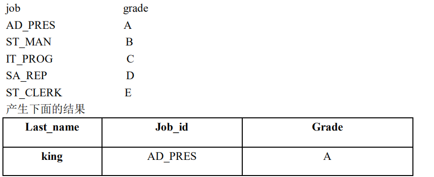

# 案例-单行函数

1. 显示系统时间(注：日期+时间)

   ```sql
   
   ```

   

2. 查询员工号，姓名，工资，以及工资提高百分之 20%后的结果（new salary）

   ```sql
   
   ```

   

3. 将员工的姓名按首字母排序，并写出姓名的长度（length）

   ```sql
   
   ```

   

4. 做一个查询，产生下面的结果

   `<last_name> earns <salary> monthly but wants <salary*3>`

   

   ```sql
   
   ```

   

5. 使用 case-when，按照下面的条件：

   

   ```sql
   
   ```

   