# NIO

> 课程名称: [尚硅谷NIO视频(java nio线程精讲)](https://www.bilibili.com/video/BV14W411u7ro)
>
> 课程概述: 本Java视频主要讲授 Java NIO 的使用及原理。Java NIO 是 JDK 1.4 发布的一套全新的IO API(New IO 简称 NIO)，由于 JDK 1.7 对 NIO 的更新，目前 NIO 被广泛应用，以至于将 JDK 1.7 的改动称为 NIO.2，NIO 可以替代传统的Java IO API。NIO与原来的IO有同样的作用和目的，但是使用方式及原理有很大不同。NIO支持面向缓冲区的、基于通道的IO操作。
>
> 讲述人: 李贺飞

## 1. Java NIO 简介

Java NIO（New IO / NO Blocking IO）是从Java 1.4版本开始引入的一个新的IO API，可以替代标准的Java IO
API。NIO与原来的IO有同样的作用和目的，但是使用的方式完全不同，NIO支持面向缓冲区的、基于通道的IO操作。NIO将以更加高效的方式进行文件的读写操作。

学过javase的知道io就是用来自做输入输出的

## 2. Java NIO 与 IO 的主要区别

| IO                      | NIO                         |
| ----------------------- | --------------------------- |
| 面向流(Stream Oriented) | 面向缓冲区(Buffer Oriented) |
| 阻塞IO(Blocking IO)     | 非阻塞IO(Non Blocking IO)   |
| (无)                    | 选择器(Selectors)           |

## 3. 缓冲区(Buffer)和通道(Channel)

Java NIO系统的核心在于：通道(Channel)和缓冲区(Buffer)。通道表示打开到 IO 设备(例如：文件、套接字)的连接。若需要使用 NIO 系统，需要获取用于连接 IO
设备的通道以及用于容纳数据的缓冲区。然后操作缓冲区，对数据进行处理。

**简而言之，Channel 负责传输， Buffer 负责存储**

### 3.1 缓冲区（Buffer）

**缓冲区（Buffer）**：一个用于特定基本数据类型的容器。由 java.nio 包定义的，所有缓冲区都是 Buffer 抽象类的子类。

Java NIO 中的 Buffer 主要用于与 NIO 通道进行交互，数据是从通道读入缓冲区，从缓冲区写入通道中的。

Buffer 就像一个数组，可以保存多个相同类型的数据。根据数据类型不同(boolean 除外) ，有以下 Buffer 常用子类：

```java
ByteBuffer
CharBuffer
ShortBuffer
IntBuffer
LongBuffer
FloatBuffer
DoubleBuffer
/**
 上述 Buffer 类 他们都采用相似的方法进行管理数据，只是各自管理的数据类型不同而已。都是通过如下方法获取一个 Buffer 对象：
 static XxxBuffer allocate(int capacity) : 创建一个容量为 capacity 的 XxxBuffer 对象
 */
```

#### 缓冲区的基本属性

*Buffer 中的重要概念：*

**容量** **(capacity)** **：**表示 Buffer 最大数据容量，缓冲区容量不能为负，并且创建后不能更改。

**限制 (limit)**：第一个不应该读取或写入的数据的索引，即位于 limit 后的数据不可读写。缓冲区的限制不能为负，并且不能大于其容量。

**位置 (position)**：下一个要读取或写入的数据的索引。缓冲区的位置不能为负，并且不能大于其限制

**标记 (mark)与重置 (reset)**：标记是一个索引，通过 Buffer 中的 mark() 方法指定 Buffer 中一个特定的 position，之后可以通过调用 reset() 方法恢复到这个 position.

*标记、位置、限制、容量遵守以下不变式： 0 <= mark <= position <= limit <= capacity*

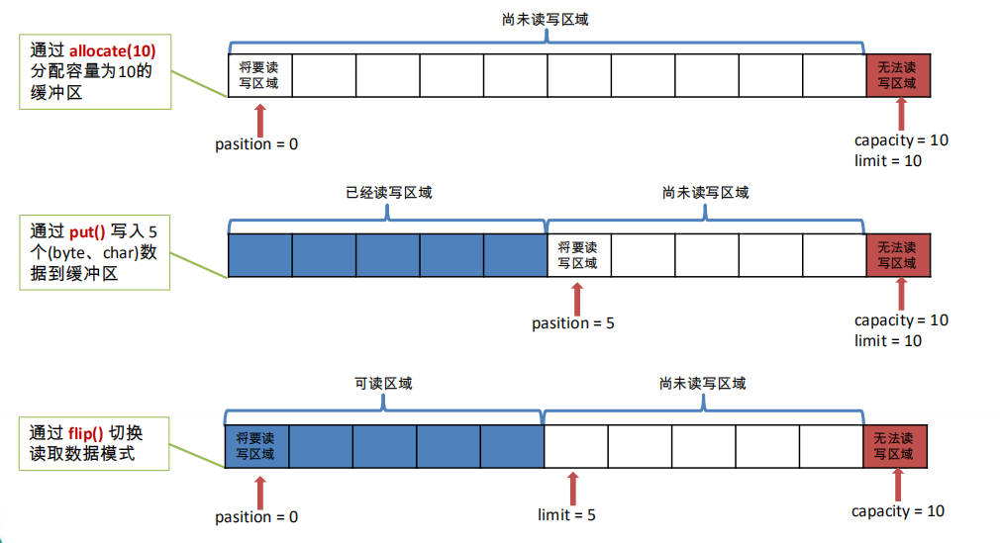

#### Buffer 的常用方法

| 方法                   | 描述                                                      |
| ---------------------- | --------------------------------------------------------- |
| **Buffer clear()**     | **清空缓冲区并返回对缓冲区的引用**                        |
| **Buffer flip()**      | **将缓冲区的界限设置为当前位置，并将当前位置充值为 0**    |
| int capacity()         | 返回 Buffer 的 capacity 大小                              |
| boolean hasRemaining() | 判断缓冲区中是否还有元素                                  |
| int limit()            | 返回 Buffer 的界限(limit) 的位置                          |
| Buffer limit(int n)    | 将设置缓冲区界限为 n, 并返回一个具有新 limit 的缓冲区对象 |
| Buffer mark()          | 对缓冲区设置标记                                          |
| int position()         | 返回缓冲区的当前位置 position                             |
| Buffer position(int n) | 将设置缓冲区的当前位置为 n , 并返回修改后的 Buffer 对象   |
| int remaining()        | 返回 position 和 limit 之间的元素个数                     |
| Buffer reset()         | 将位置 position 转到以前设置的 mark 所在的位置            |
| Buffer rewind()        | 将位置设为为 0， 取消设置的 mark                          |

#### 缓冲区的数据操作

Buffer 所有子类提供了两个用于数据操作的方法：get() 与 put() 方法

**获取 Buffer 中的数据**

- get() ：读取单个字节
- get(byte[] dst)：批量读取多个字节到 dst 中
- get(int index)：读取指定索引位置的字节(不会移动 position)

**放入数据到 Buffer 中**

- put(byte b)：将给定单个字节写入缓冲区的当前位置
- put(byte[] src)：将 src 中的字节写入缓冲区的当前位置
- put(int index, byte b)：将指定字节写入缓冲区的索引位置(不会移动 position)

#### 直接与非直接缓冲区

1. 字节缓冲区要么是直接的，要么是非直接的。如果为直接字节缓冲区，则 Java 虚拟机会尽最大努力直接在此缓冲区上执行本机 I/O 操作。也就是说，在每次调用基础操作系统的一个本机 I/O
   操作之前（或之后），虚拟机都会尽量避免将缓冲区的内容复制到中间缓冲区中（或从中间缓冲区中复制内容）。
2. 直接字节缓冲区可以通过调用此类的 allocateDirect()
   工厂方法来创建。此方法返回的缓冲区进行分配和取消分配所需成本通常高于非直接缓冲区。直接缓冲区的内容可以驻留在常规的垃圾回收堆之外，因此，它们对应用程序的内存需求量造成的影响可能并不明显。所以，建议将直接缓冲区主要分配给那些易受基础系统的本机
   I/O 操作影响的大型、持久的缓冲区。一般情况下，最好仅在直接缓冲区能在程序性能方面带来明显好处时分配它们。
3. 直接字节缓冲区还可以通过 FileChannel 的 map() 方法 将文件区域直接映射到内存中来创建。该方法返回MappedByteBuffer 。Java 平台的实现有助于通过 JNI
   从本机代码创建直接字节缓冲区。如果以上这些缓冲区中的某个缓冲区实例指的是不可访问的内存区域，则试图访问该区域不会更改该缓冲区的内容，并且将会在访问期间或稍后的某个时间导致抛出不确定的异常。
4. 字节缓冲区是直接缓冲区还是非直接缓冲区可通过调用其 isDirect() 方法来确定。提供此方法是为了能够在性能关键型代码中执行显式缓冲区管理。

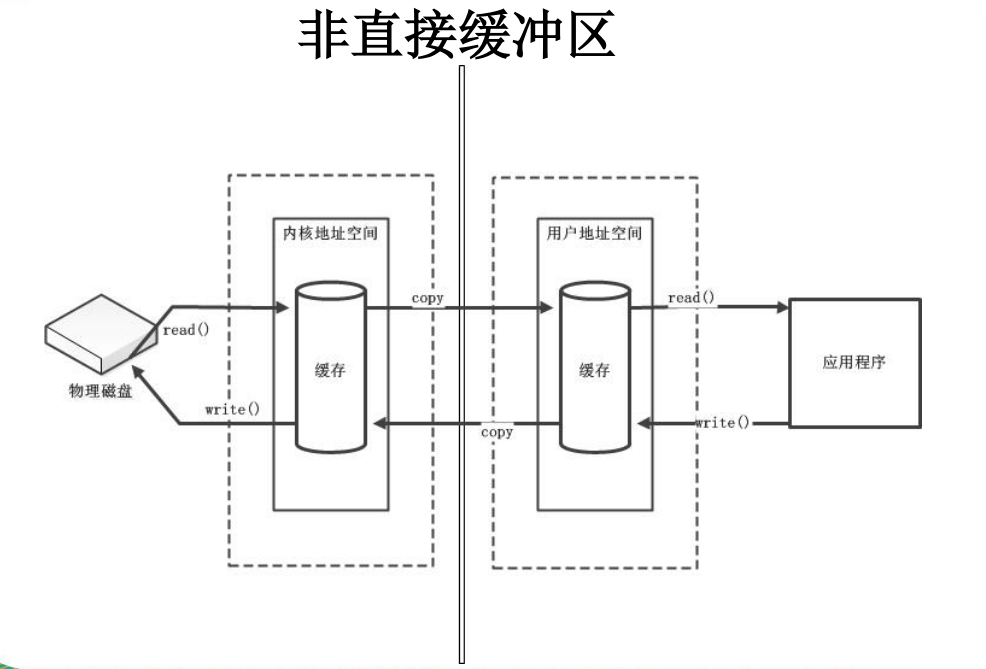

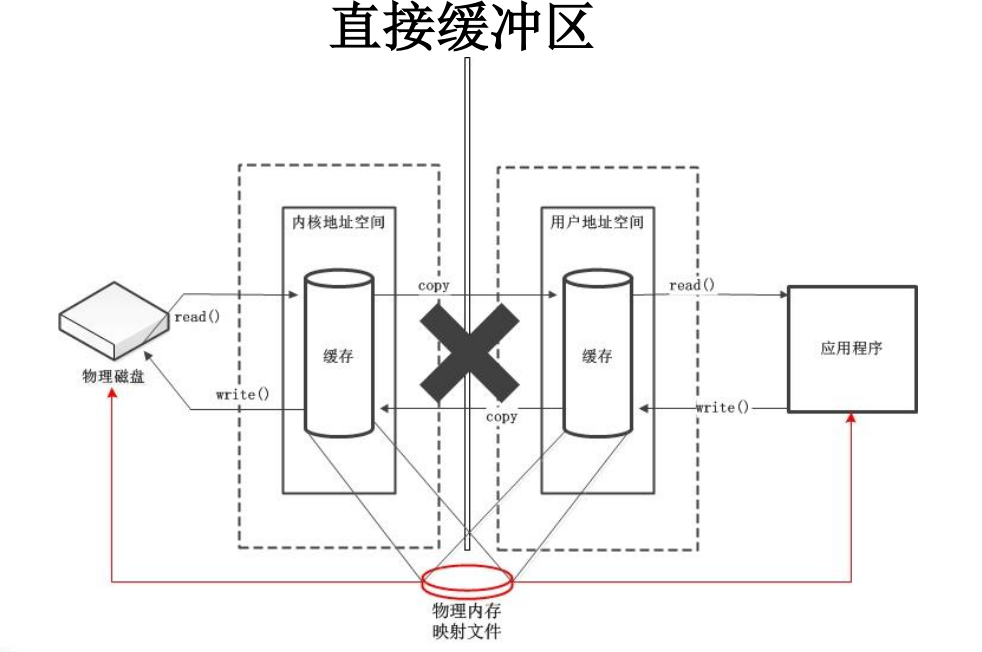

### 3.2 通道（Channel）

**通道（Channel）**：由 java.nio.channels 包定义的。Channel 表示 IO 源与目标打开的连接。Channel 类似于传统的“流”。只不过 Channel 本身不能直接访问数据，Channel
只能与Buffer 进行交互。

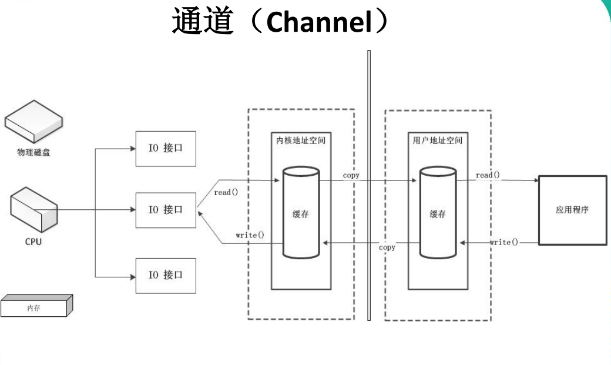

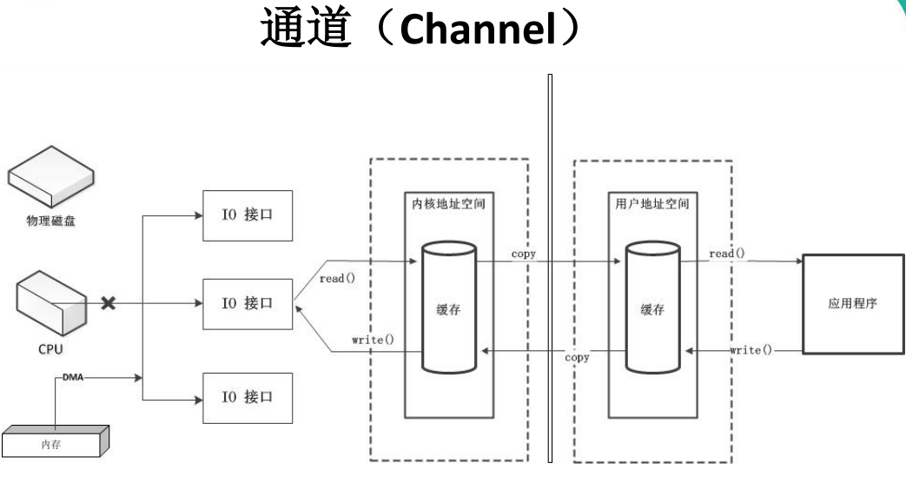

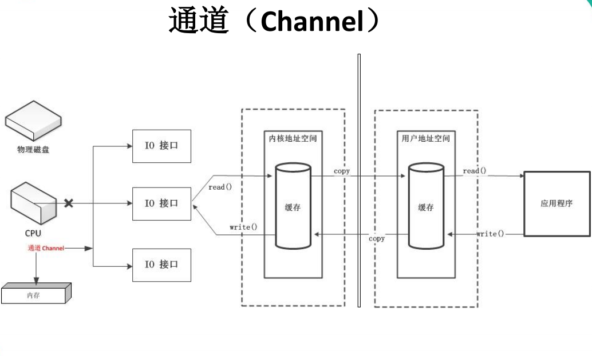

#### Channel实现类

*Java 为 Channel 接口提供的最主要实现类如下：*

FileChannel：用于读取、写入、映射和操作文件的通道。 DatagramChannel：通过 UDP 读写网络中的数据通道。 SocketChannel：通过 TCP 读写网络中的数据。
ServerSocketChannel：可以监听新进来的 TCP 连接，对每一个新进来的连接都会创建一个 SocketChannel。

#### 获取通道

**获取通道的一种方式是对支持通道的对象调用getChannel() 方法。支持通道的类如下：**

```
FileInputStream
FileOutputStream
RandomAccessFile
DatagramSocket
Socket
ServerSocket
```

获取通道的其他方式是使用 Files 类的静态方法 newByteChannel() 获取字节通道。或者通过通道的静态方法 open() 打开并返回指定通道。

#### 通道的数据传输

将 Buffer 中数据写入 Channel 例如：


从 Channel 读取数据到 Buffer 例如：


#### 分散(Scatter)和聚集(Gather)

分散读取（Scattering Reads）是指从 Channel 中读取的数据“分散”到多个 Buffer 中。

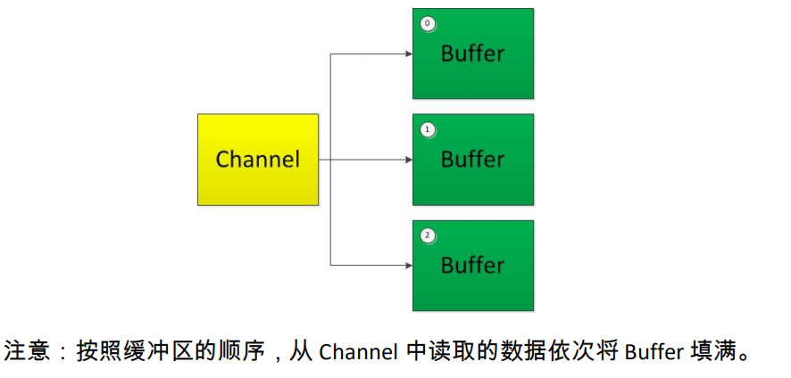

聚集写入（Gathering Writes）是指将多个 Buffer 中的数据“聚集”到 Channel。

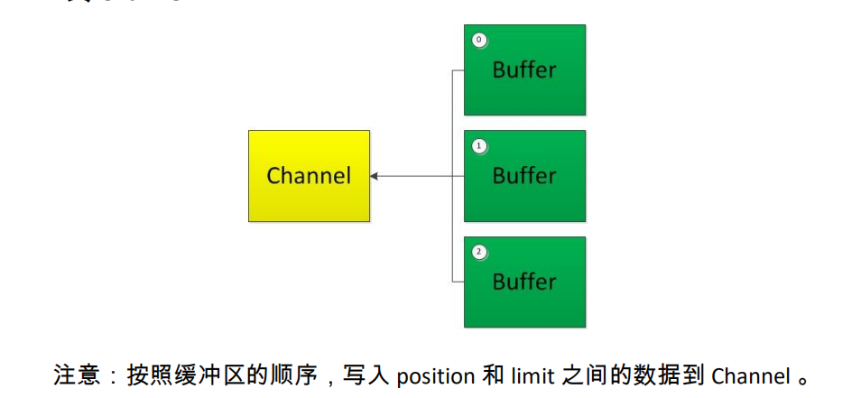

#### transferFrom()

将数据从源通道传输到其他 Channel 中：

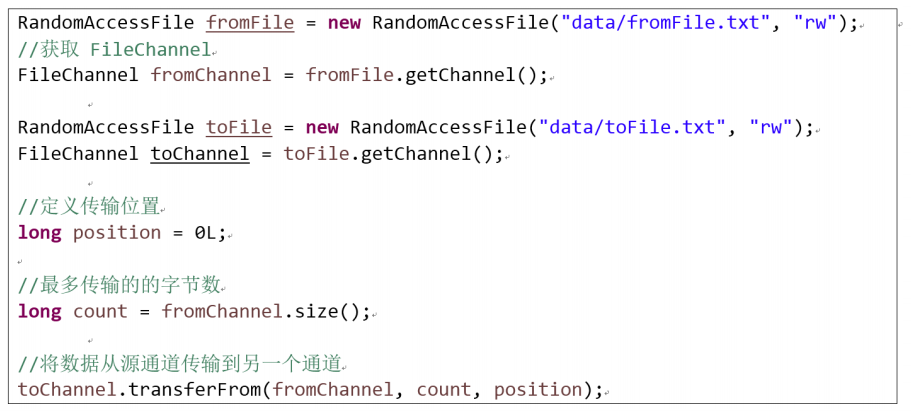

#### transferTo()

将数据从源通道传输到其他 Channel 中：

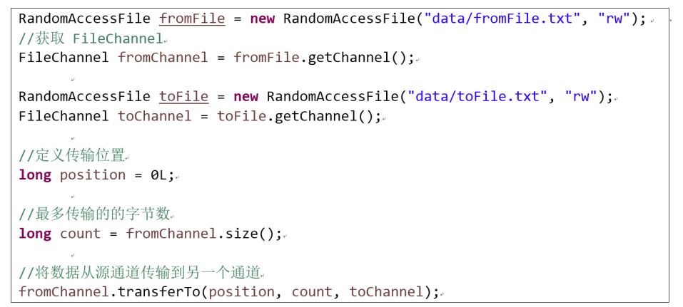

## 4. 文件通道(FileChannel)

**FileChannel 的常用方法**

| 方法                              | 描述                                         |
| --------------------------------- | -------------------------------------------- |
| **int read(ByteBuffer dst)**      | **从 Channel 中读取数据到 ByteBuffer**       |
| **long read(ByteBuffer[] dsts)**  | **将 Channel 中的数据“分散”到 ByteBuffer[]** |
| **int write(ByteBuffer src)**     | **将 ByteBuffer 中的数据写入到 Channel**     |
| **long write(ByteBuffer[] srcs)** | **将 ByteBuffer[] 中的数据“聚集”到 Channel** |
| long position()                   | 返回此通道的文件位置                         |
| FileChannel position(long p)      | 设置此通道的文件位置                         |
| long size()                       | 返回此通道的文件的当前大小                   |
| FileChannel truncate(long s)      | 将此通道的文件截取为给定大小                 |
| void force(boolean metaData)      | 强制将所有对此通道的文件更新写入到存储设备中 |

## 5. NIO 的非阻塞式网络通信

### 阻塞与非阻塞

1. 传统的 IO 流都是阻塞式的。也就是说，当一个线程调用 read() 或 write() 时，该线程被阻塞，直到有一些数据被读取或写入，该线程在此期间不能执行其他任务。因此，在完成网络通信进行 IO
   操作时，由于线程会阻塞，所以服务器端必须为每个客户端都提供一个独立的线程进行处理，当服务器端需要处理大量客户端时，性能急剧下降。
2. Java NIO 是非阻塞模式的。当线程从某通道进行读写数据时，若没有数据可用时，该线程可以进行其他任务。线程通常将非阻塞 IO 的空闲时间用于在其他通道上执行 IO 操作，所以单独的线程可以管理多个输入和输出通道。因此，NIO
   可以让服务器端使用一个或有限几个线程来同时处理连接到服务器端的所有客户端。

### 选择器(Selector)

选择器（Selector） 是 SelectableChannle 对象的多路复用器，Selector 可以同时监控多个 SelectableChannel 的 IO 状况，也就是说，利用 Selector 可使一个单独的线程管理多个
Channel。Selector 是非阻塞 IO 的核心。

SelectableChannle 的结构如下图：

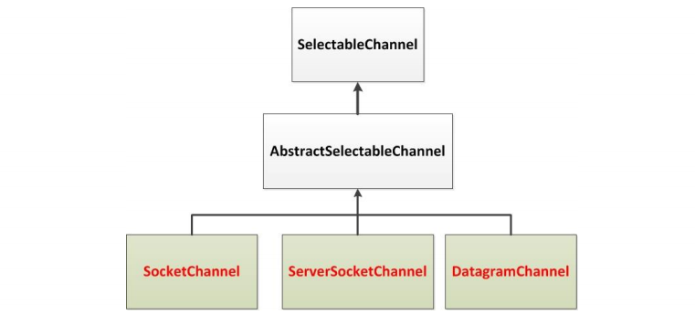

#### 选择器（Selector）的应用

1. 创建 Selector ：通过调用 Selector.open() 方法创建一个 Selector。

   

2. 向选择器注册通道：SelectableChannel.register(Selector sel, int ops)

   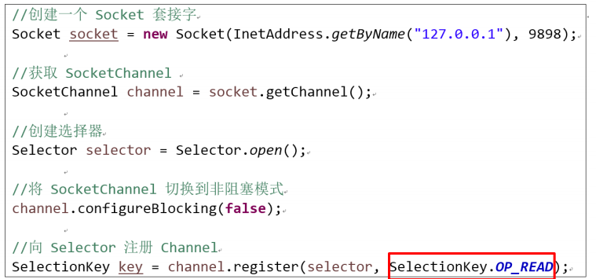

3. 当调用 register(Selector sel, int ops) 将通道注册选择器时，选择器对通道的监听事件，需要通过第二个参数 ops 指定。

4. 可以监听的事件类型（**可使用** **SelectionKey** **的四个常量表示**）：

   ```
    读 : SelectionKey.OP_READ （1）
    写 : SelectionKey.OP_WRITE （4）
    连接 : SelectionKey.OP_CONNECT （8）
    接收 : SelectionKey.OP_ACCEPT （16）
   ```

5. 若注册时不止监听一个事件，则可以使用“位或”操作符连接。例:

   

#### SelectionKey

当调用 register(Selector sel, int ops) 将通道注册选择器时，选择器对通道的监听事件，需要通过第二个参数 ops 指定。

可以监听的事件类型（**可使用** **SelectionKey** **的四个常量表示**）：

```
读 : SelectionKey.OP_READ （1） 
写 : SelectionKey.OP_WRITE （4） 
连接 : SelectionKey.OP_CONNECT （8）
接收 : SelectionKey.OP_ACCEPT （16）
```

若注册时不止监听一个事件，则可以使用“位或”操作符连接。例:


SelectionKey：表示 SelectableChannel 和 Selector 之间的注册关系。每次向选择器注册通道时就会选择一个事件(选择键)
。选择键包含两个表示为整数值的操作集。操作集的每一位都表示该键的通道所支持的一类可选择操作。

| 方法                        | 描述                             |
| --------------------------- | -------------------------------- |
| int interestOps()           | 获取感兴趣事件集合               |
| int readyOps()              | 获取通道已经准备就绪的操作的集合 |
| SelectableChannel channel() | 获取注册通道                     |
| Selector selector()         | 返回选择器                       |
| boolean isReadable()        | 检测 Channal 中读事件是否就绪    |
| boolean isWritable()        | 检测 Channal 中写事件是否就绪    |
| boolean isConnectable()     | 检测 Channel 中连接是否就绪      |
| boolean isAcceptable()      | 检测 Channel 中接收是否就绪      |

#### Selector 的常用方法

| 方法                     | 描述                                                         |
| ------------------------ | ------------------------------------------------------------ |
| Set<SelectionKey> keys() | 所有的 SelectionKey 集合。代表注册在该Selector上的Channel    |
| selectedKeys()           | 被选择的 SelectionKey 集合。返回此Selector的已选择键集       |
| int select()             | 监控所有注册的Channel，当它们中间有需要处理的 IO 操作时，    |
| int select(long timeout) | 该方法返回，并将对应得的 SelectionKey 加入被选择的可以设置超时时长的 select() 操作 |
| int selectNow()          | SelectionKey 集合中，该方法返回这些 Channel 的数量。执行一个立即返回的 select() 操作，该方法不会阻塞线程 |
| Selector wakeup()        | 使一个还未返回的 select() 方法立即返回                       |
| void close()             | 关闭该选择器                                                 |

### SocketChannel、ServerSocketChannel、DatagramChannel

#### SocketChannel

Java NIO中的SocketChannel是一个连接到TCP网络套接字的通道。

操作步骤：

```
打开 SocketChannel
读写数据
关闭 SocketChannel
```

#### ServerSocketChannel

Java NIO中的 ServerSocketChannel 是一个可以监听新进来的TCP连接的通道，就像标准IO中 的ServerSocket一样。

#### DatagramChannel

Java NIO中的DatagramChannel是一个能收发UDP包的通道。

操作步骤：

```
打开 DatagramChannel
接收/发送数据
```

## 6. 管道(Pipe)

Java NIO 管道是2个线程之间的单向数据连接。Pipe有一个source通道和一个sink通道。数据会被写到sink通道，从source通道读取。


### 向管道写数据

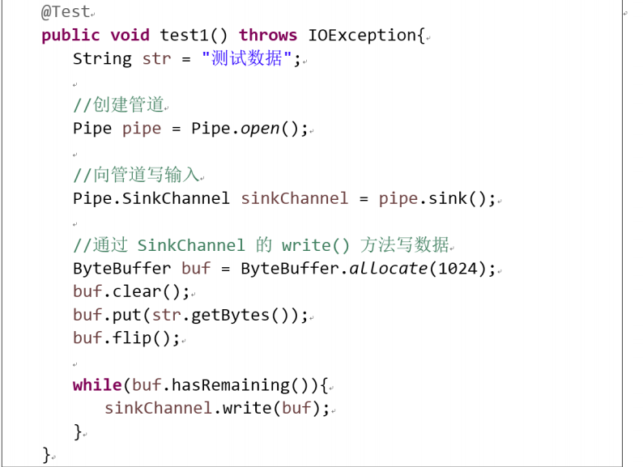

#### 从管道中读数据

1. 从读取管道的数据，需要访问source通道。

   

2. 调用source通道的read()方法来读取数据

   

## 7. Java NIO2 (Path、Paths 与 Files )

### NIO.2

随着 JDK 7 的发布，Java对NIO进行了极大的扩展，增强了对文件处理和文件系统特性的支持，以至于我们称他们为 NIO.2。因为 NIO 提供的一些功能，NIO已经成为文件处理中越来越重要的部分。

### Path 与 Paths

*java.nio.file.Path 接口代表一个平台无关的平台路径，描述了目录结构中文件的位置。*

Paths 提供的 get() 方法用来获取 Path 对象：

- Path get(String first, String … more) : 用于将多个字符串串连成路径。

Path 常用方法：

```java
 boolean endsWith(String path) : 判断是否以 path 路径结束
 boolean startsWith(String path) : 判断是否以 path 路径开始
 boolean isAbsolute() : 判断是否是绝对路径
 Path getFileName() : 返回与调用 Path 对象关联的文件名
 Path getName(int idx) : 返回的指定索引位置 idx 的路径名称
 int getNameCount() : 返回Path 根目录后面元素的数量
 Path getParent() ：返回Path对象包含整个路径，不包含 Path 对象指定的文件路径
 Path getRoot() ：返回调用 Path 对象的根路径
 Path resolve(Path p) :将相对路径解析为绝对路径
 Path toAbsolutePath() : 作为绝对路径返回调用 Path 对象
 String toString() ： 返回调用 Path 对象的字符串表示形式
```

#### Files 类

*java.nio.file.Files 用于操作文件或目录的工具类。*

Files常用方法：

```java
 Path copy(Path src, Path dest, CopyOption … how) : 文件的复制
 Path createDirectory(Path path, FileAttribute<?> … attr) : 创建一个目录
 Path createFile(Path path, FileAttribute<?> … arr) : 创建一个文件
 void delete(Path path) : 删除一个文件
 Path move(Path src, Path dest, CopyOption…how) : 将 src 移动到 dest 位置
 long size(Path path) : 返回 path 指定文件的大小
```

Files常用方法：用于判断

```java
 boolean exists(Path path, LinkOption … opts) : 判断文件是否存在
 boolean isDirectory(Path path, LinkOption … opts) : 判断是否是目录
 boolean isExecutable(Path path) : 判断是否是可执行文件
 boolean isHidden(Path path) : 判断是否是隐藏文件
 boolean isReadable(Path path) : 判断文件是否可读
 boolean isWritable(Path path) : 判断文件是否可写
 boolean notExists(Path path, LinkOption … opts) : 判断文件是否不存在
 public static <A extends BasicFileAttributes> A readAttributes(Path path,Class<A> type,LinkOption... 
options) : 获取与 path 指定的文件相关联的属性。
```

Files常用方法：用于操作内容

```java
 SeekableByteChannel newByteChannel(Path path, OpenOption…how) : 获取与指定文件的连接，how 指定打开方式。
 DirectoryStream newDirectoryStream(Path path) : 打开 path 指定的目录
 InputStream newInputStream(Path path, OpenOption…how):获取 InputStream 对象
 OutputStream newOutputStream(Path path, OpenOption…how) : 获取 OutputStream 对象
```

#### 自动资源管理

Java 7 增加了一个新特性，该特性提供了另外一种管理资源的方式，这种方式能自动关闭文件。这个特性有时被称为自动资源管理(Automatic Resource Management, ARM)， 该特性以 try
语句的扩展版为基础。自动资源管理主要用于，当不再需要文件（或其他资源）时，可以防止无意中忘记释放它们。

自动资源管理基于 try 语句的扩展形式：

```java
try(需要关闭的资源声明){
//可能发生异常的语句
}catch(异常类型 变量名){
//异常的处理语句
}
……
finally{
//一定执行的语句
}
```

当 try 代码块结束时，自动释放资源。因此不需要显示的调用 close() 方法。该形式也称为“带资源的 try 语句”。

注意:

①try 语句中声明的资源被隐式声明为 final ，资源的作用局限于带资源的 try 语句

②可以在一条 try 语句中管理多个资源，每个资源以“;” 隔开即可。

③需要关闭的资源，必须实现了 AutoCloseable 接口或其自接口 Closeable


